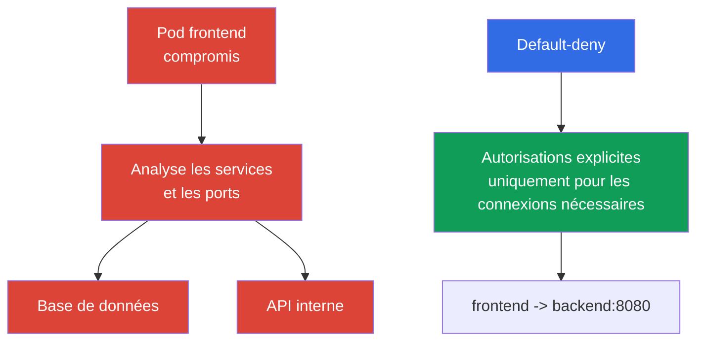

[Русская версия](ru.md) · [Eng version](README.md) · [Versión en español](es.md) · [Deutsche Version](de.md) · [ქართული ვერსია](ge.md) · [繁體中文版](tw.md) · [日本語版](jp.md)

# Chapitre 13. NetworkPolicy, isolation et segmentation

> **La suite.** Dans les chapitres sur l'authentification, les Pod Security Standards et les `Secret`, nous avons limité les identités, les privilèges et l'accès aux données. Limitons maintenant les chemins réseau entre les charges de travail. `NetworkPolicy` aide à empêcher qu'une compromission d'un `Pod` ne devienne automatiquement un lateral movement dans l'ensemble du cluster. C'est un sujet du domaine KCSA Kubernetes Security Fundamentals, qui pèse 22 %. Les exemples sont orientés vers Kubernetes `v1.36`.

## 13.1 `NetworkPolicy` : pourquoi le default allow est dangereux et pourquoi utiliser le default-deny

`NetworkPolicy` est une ressource API Kubernetes qui décrit les connexions réseau entrantes (`Ingress`) et sortantes (`Egress`) autorisées pour les `Pod` sélectionnés. Elle ne protège pas l'application contre une erreur de code et ne remplace pas RBAC, mais elle réduit le nombre de chemins réseau accessibles après la compromission d'une charge de travail.

Kubernetes ne crée pas automatiquement de `NetworkPolicy` default-deny. Si un `Pod` n'est pas isolé par une politique applicable pour une direction donnée, le trafic dans cette direction est généralement autorisé. Pour passer au default-deny, on crée une `NetworkPolicy` explicite qui sélectionne les Pods concernés et ne contient aucune règle ingress/egress d'autorisation pour les `policyTypes` sélectionnés, puis des politiques distinctes ajoutent uniquement les flux nécessaires.



**Default-deny** signifie que, pour une direction de trafic, une interdiction par défaut est d'abord créée, puis des allow-policies ciblées sont ajoutées. La précision de la formulation est importante : un `Pod` est isolé séparément pour `Ingress` et `Egress` lorsqu'au moins une `NetworkPolicy` le sélectionne avec la direction correspondante dans `policyTypes`.

Les politiques `NetworkPolicy` sont additives **pour un même `Pod` sélectionné et une même direction** : si plusieurs politiques s'appliquent à son ingress ou à son egress, l'ensemble autorisé de connexions est l'union des allow rules de toutes les politiques applicables. Il n'existe ni ordre entre les politiques ni règle deny distincte avec priorité permettant de « refuser au-dessus d'une autorisation ».

Pour une connexion `source Pod → destination Pod`, les deux côtés sont vérifiés indépendamment. Si le `Pod` source est isolé pour `Egress`, ses egress rules doivent autoriser la destination. Si le `Pod` destination est isolé pour `Ingress`, ses ingress rules doivent autoriser la source. Lorsque les deux côtés sont isolés, la connexion est possible uniquement si **l'egress de la source et l'ingress de la destination** l'autorisent.

Cette approche met en œuvre le least privilege sur le réseau. Elle nécessite un inventaire des dépendances : une application peut avoir besoin de DNS, d'une base de données, de l'API d'un autre service, d'une passerelle de paiement externe ou d'un endpoint d'un fournisseur cloud. Une allow-policy incomplète peut perturber le fonctionnement de l'application, il faut donc planifier et observer le changement, plutôt que l'ajouter aveuglément.

## 13.2 `Ingress`, `Egress`, sélecteurs et default-deny minimal

`Ingress` décrit le trafic **vers** les `Pod` sélectionnés, tandis que `Egress` décrit le trafic **depuis** ceux-ci. Les règles utilisent des sélecteurs plutôt que les adresses IP de `Pod` individuels, car les adresses changent lors de leur recréation :

| Mécanisme | Ce qu'il sélectionne | Utilisation typique |
|---|---|---|
| `podSelector` | `Pod` possédant les labels indiqués dans le même `Namespace` | autoriser `frontend` à accéder à `backend` |
| `namespaceSelector` | `Namespace` possédant les labels indiqués | autoriser le trafic depuis le namespace `monitoring` |
| `ipBlock` | plage CIDR d'adresses IP | endpoint externe exceptionnel ou réseau d'entreprise |
| `ports` | protocole et port | n'autoriser que TCP 5432 pour la base de données |

Lorsque `podSelector` et `namespaceSelector` se trouvent dans le même élément `from` ou `to`, ils fonctionnent comme une intersection : les `Pod` avec le label requis **dans** un `Namespace` correspondant sont admis. S'ils sont dans des éléments de liste différents, ce sont des sources ou destinations alternatives. Cette différence est souvent évaluée dans les questions avec YAML.

Voici un exemple minimal qui sélectionne tous les `Pod` du namespace `shop` et les isole dans les deux directions. Les listes vides `ingress` et `egress` n'autorisent aucune connexion dans ces directions.

```yaml
apiVersion: networking.k8s.io/v1
kind: NetworkPolicy
metadata:
  name: default-deny-ingress-egress
  namespace: shop
spec:
  podSelector: {}
  policyTypes:
    - Ingress
    - Egress
  ingress: []
  egress: []
```

Il s'agit d'un default-deny pour le Pod traffic, que l'implémentation CNI concernée traite via NetworkPolicy et non via un host firewall. Le comportement des Pods `hostNetwork` dépend du network plugin ; le trafic node/host présente des cas particuliers. Par conséquent, une `NetworkPolicy` Kubernetes ordinaire ne doit pas être considérée comme un contrôle d'accès universel à kubelet ou à d'autres host endpoints.

Après cette règle de base, on ajoute des politiques distinctes. Par exemple, `frontend` peut être autorisé à atteindre uniquement le port TCP `8080` de `backend`, et `backend` uniquement le port de la base de données. Pour la résolution des noms, il faut généralement autoriser séparément l'egress vers le serveur DNS du cluster. Il ne faut pas remplacer la segmentation par une règle qui autorise tout le trafic vers `kube-system` : cela élargit la surface de confiance davantage que nécessaire.

`NetworkPolicy` gère les connexions aux couches réseau L3/L4 dans le cadre de l'implémentation prise en charge : sources, destinations, IP et ports. Elle n'interprète ni l'utilisateur HTTP, ni la requête SQL, ni la signification des données applicatives.

## 13.3 Limites des namespace, réseau et multi-tenancy

Un `Namespace` est utile pour organiser les ressources, les quotas, RBAC et les politiques, mais il ne constitue pas à lui seul un mur réseau. Un `Pod` du namespace `team-a` peut accéder à un `Pod` de `team-b` si le réseau l'autorise et qu'aucune `NetworkPolicy` applicable ne l'empêche. De même, un namespace n'interdit pas à un utilisateur l'accès via l'API si RBAC lui accorde les droits correspondants.

L'isolation d'un environnement multi-tenant est donc construite par couches :

| Limite | Contrôle | Problème réduit |
|---|---|---|
| Identité et API | `ServiceAccount` distincts, RBAC, admission | lecture ou modification des ressources d'un autre tenant |
| Namespace | namespaces distincts, `ResourceQuota`, `LimitRange` | mélange des ressources et consommation non contrôlée |
| Réseau | default-deny et `NetworkPolicy` ciblées | accès aux services d'un autre tenant et lateral movement |
| Exécution | PSS, `securityContext`, sandbox si nécessaire | sortie du conteneur et privilèges dangereux |

Pour le soft multi-tenancy, plusieurs équipes partagent le cluster et la protection repose sur des RBAC, des namespace et des politiques réseau correctement configurés. C'est pratique, mais une erreur dans l'infrastructure partagée ou un rôle trop large peut affecter un tenant voisin. Lorsque les exigences d'isolation sont élevées, on applique une séparation plus forte : nœuds dédiés, clusters distincts ou sandbox runtimes. Le choix dépend de la valeur des données, de la confiance entre les équipes et des conséquences acceptables d'une erreur.

La segmentation doit refléter l'architecture réelle, et pas seulement les noms des équipes. Une question utile pour chaque connexion est : quel `Pod` initie la connexion, vers quel service, sur quel port, et cette connexion est-elle réellement nécessaire en production ? La réponse forme l'allowlist et révèle les dépendances inattendues.

## 13.4 Rôle du CNI et aperçu de Cilium

L'objet `NetworkPolicy` fait partie de l'API Kubernetes, mais Kubernetes n'intercepte pas lui-même les paquets. L'application des règles est assurée par un plugin CNI ou son composant réseau. Par conséquent, la présence d'un objet YAML ne prouve pas encore que le trafic est limité : le CNI choisi doit prendre en charge et activer l'enforcement de `NetworkPolicy`. Il faut le vérifier dans la documentation et dans un test de projet, en particulier lors d'un changement de CNI.

Une `NetworkPolicy` Kubernetes classique exprime des relations L3/L4 : entre quelles identités ou adresses le trafic est autorisé et sur quels ports. **Cilium** est un CNI qui utilise eBPF et prend en charge les `NetworkPolicy` standards, ainsi que ses propres politiques. Ses capacités supplémentaires sont utiles lorsqu'une adresse et un port ne suffisent pas à assurer la protection :

| Niveau | Exemple de contrôle Cilium | Utilité |
|---|---|---|
| L3 | source ou destination par identity | isoler des groupes de charges de travail |
| L4 | port TCP ou UDP | n'autoriser que le port du service requis |
| L7 | méthode HTTP, chemin, en-tête | limiter l'accès à des opérations API précises |
| DNS-aware | règles pour les noms DNS, par exemple `api.example.com` | restreindre l'egress vers un service externe dont l'IP change |

Les politiques L7 et DNS-aware ne sont pas des fonctionnalités de l'API `NetworkPolicy` de base ; elles dépendent de Cilium et de sa configuration. Le contrôle L7 n'est pas propre à Cilium : celui-ci l'implémente au niveau CNI via eBPF sans sidecar-proxy, tandis que les service meshes (Istio, Linkerd) atteignent un résultat similaire au niveau applicatif via un sidecar-proxy, en ajoutant au passage mTLS et telemetry (voir le chapitre 18 sur PKI, mTLS et le service mesh). Les politiques L7 d'un CNI et le service mesh ne remplacent pas la vérification applicative : autoriser `GET /healthz` au niveau L7 est plus utile que d'accéder à tout le service HTTP, mais cela ne corrige pas une vulnérabilité du serveur. Cilium fournit également l'observabilité des décisions réseau, ce qui aide à comprendre pourquoi une connexion est autorisée ou rejetée.

### Ce que `NetworkPolicy` fait et ne fait pas

**Fait :** régule les ingress/egress connections autorisées pour les `Pod` sélectionnés via l'enforcement CNI. **Ne fait pas automatiquement :** ne chiffre pas le trafic, n'authentifie pas une workload ou un utilisateur, n'effectue pas d'application-layer authorization, ne scanne pas l'image et ne limite pas le CPU/la RAM.

Le chiffrement du trafic entre les `Pod` est une tâche distincte de `NetworkPolicy` et du filtrage L7 du CNI : il est assuré par TLS/mTLS au niveau applicatif ou par un service mesh (par exemple Istio, Linkerd), qui ajoute un sidecar-proxy, une workload identity et mTLS sans modifier le code de l'application (plus de détails au chapitre 18). `NetworkPolicy` et les politiques L7 de Cilium peuvent autoriser ou refuser une connexion, mais ne rendent pas son contenu confidentiel.

| Scénario | Meilleur contrôle | Preuve |
|---|---|---|
| `frontend` ne doit pas ouvrir de connexion TCP vers la database | `NetworkPolicy` | inspection de la policy et vérification de la connection autorisée/refusée |
| `ServiceAccount` ne doit pas lire un `Secret` via l'API | RBAC | `kubectl auth can-i` et API audit event |
| Un Pod doit s'exécuter sans `privileged` | PSS/PSA ou admission policy | admission rejection/warn/audit |
| Une protection cryptographique du trafic autorisé est requise | TLS/mTLS | certificate/handshake et configuration |

Ce choix commence par la limite : API permission, paramètre d'objet, network path, runtime process ou data in transit. `NetworkPolicy` n'est une réponse précise que pour un network path.

## 13.5 Comment l'appliquer en pratique

On ne commence pas avec un ensemble de règles aléatoires, mais avec une carte des flux : client vers `frontend`, `frontend` vers `backend`, `backend` vers la base de données, charges de travail vers DNS et uniquement les API externes nécessaires. Pour chaque namespace, on crée un default-deny pour les directions requises, puis on introduit des allow-policies minimales. Il est plus pratique de procéder par étapes : observer d'abord les dépendances, restreindre ensuite les services moins critiques, puis appliquer le modèle dans les autres namespaces.

Les labels deviennent une partie du contrat de sécurité. Des labels stables comme `app: frontend`, `app: backend` et le label de namespace `team: payments` permettent à une politique de suivre le `Pod`, plutôt que son IP temporaire. Les labels ne doivent pas pouvoir être attribués sans contrôle à un sujet non fiable : la possibilité de modifier un label peut aussi modifier l'appartenance réseau d'une charge de travail.

En production, on vérifie les chemins attendus comme les chemins interdits : disponibilité de l'application, DNS, métriques, mises à jour et absence d'accès au tenant voisin. Les journaux du CNI ou l'observabilité de Cilium aident à identifier une connexion légitime refusée. Ces vérifications ne remplacent pas la politique elle-même : leur but est de confirmer que l'allowlist prévue correspond à l'architecture.

## 13.6 Vocabulaire d'examen / Mini-glossaire

| Terme | Signification |
|---|---|
| `NetworkPolicy` | Objet API Kubernetes définissant les connexions entrantes et sortantes autorisées pour les `Pod` sélectionnés. |
| default-deny | approche selon laquelle le trafic dans une direction sélectionnée est interdit tant qu'une politique explicite ne l'autorise pas. |
| `Ingress` | direction du trafic réseau vers un `Pod`. |
| `Egress` | direction du trafic réseau depuis un `Pod`. |
| CNI | interface et plugins via lesquels Kubernetes connecte le réseau des conteneurs ; l'implémentation CNI applique les politiques réseau. |
| multi-tenancy | utilisation d'une même plateforme par plusieurs équipes ou organisations avec séparation des accès et des ressources. |
| L3/L4/L7 | niveaux de contrôle : réseau IP, ports de transport et protocole applicatif. |

## 13.7 Exam Essentials / Points essentiels du chapitre

- Sans `NetworkPolicy` applicable, le trafic d'un `Pod` est généralement autorisé ; le default-deny crée le point de départ d'une allowlist.
- `Ingress` et `Egress` sont isolés indépendamment, et les politiques correspondantes s'additionnent en tant qu'autorisations.
- `podSelector` et `namespaceSelector` définissent l'identité réseau via des labels ; un `Namespace` sans politique n'est pas une limite réseau.
- Le multi-tenancy requiert plusieurs couches : RBAC, namespace, quotas, politiques réseau et restrictions d'exécution.
- L'enforcement dépend du CNI. Cilium prend en charge les politiques de base et peut ajouter le contrôle L7 et DNS-aware.

## 13.8 À ne pas confondre et présence à l'examen

Les questions KCSA évaluent généralement le modèle, et non la syntaxe d'un grand manifeste. Il faut distinguer default allow et default-deny, comprendre la direction de `Ingress` et `Egress`, le rôle de `podSelector` et `namespaceSelector`, ainsi que le fait qu'un namespace ne constitue pas une isolation réseau automatique. Un piège supplémentaire : `NetworkPolicy` n'a d'effet que si le CNI choisi prend en charge l'enforcement.

Il est également important de ne pas confondre la `NetworkPolicy` de base avec les extensions de Cilium. La politique de base limite les sources, destinations et ports, tandis que les règles HTTP L7 et les règles par nom DNS relèvent des capacités supplémentaires de Cilium. Lorsque vous choisissez la réponse la plus appropriée, recherchez le contrôle minimal qui ferme le chemin de trafic décrit.

## 13.9 Questions d'auto-évaluation

### 1. Quelle description est la plus précise pour l'état d'un `Pod` qui n'est sélectionné par aucune `NetworkPolicy` ?

   - a. Seul le trafic provenant d'un `Pod` du même namespace est autorisé, si le CNI prend en charge `NetworkPolicy`.

   - b. Le `Pod` reste non-isolated pour cette direction tant qu'une `NetworkPolicy` applicable ne l'isole pas et que le CNI n'applique pas les règles.

   - c. Seuls DNS et le trafic vers l'API Kubernetes sont autorisés, toutes les autres connexions sont automatiquement bloquées.

   - d. Kubernetes applique automatiquement un default-deny ingress et egress à chaque `Pod` sans politique sélectionnée.

<details>
<summary>Réponse et explication</summary>

**Bonne réponse : b.** Kubernetes ne crée pas de default-deny pour chaque `Pod` par lui-même. La restriction apparaît lorsqu'une politique applicable isole la direction et que le CNI l'applique.

</details>

### 2. Quel effet produit une `NetworkPolicy` avec `podSelector: {}`, `policyTypes: [Ingress, Egress]`, `ingress: []` et `egress: []` dans un namespace ?

   - a. Elle sélectionne tous les Pods du namespace et les isole pour les directions indiquées, jusqu'à ce que des additive policies applicables autorisent explicitement le trafic requis.
   - b. Elle bloque Kubernetes API authorization pour tous les utilisateurs qui travaillent avec les objets de ce namespace.
   - c. Elle autorise tout ingress et egress entre les Pods du namespace, tout en interdisant uniquement le trafic externe.
   - d. Elle supprime les Pods sélectionnés à la première connexion réseau qui ne correspond pas à une règle d'autorisation.

<details>
<summary>Réponse et explication</summary>

**Bonne réponse : a.** Un `podSelector` vide sélectionne tous les Pods du namespace, et les ingress/egress rules vides n'ajoutent aucune autorisation pour les directions correspondantes. D'autres NetworkPolicy applicables peuvent autoriser de manière additive un trafic spécifique. Le véritable enforcement nécessite que le CNI utilisé prenne en charge NetworkPolicy.

</details>

### 3. Quelle affirmation sur les namespace est correcte pour la segmentation réseau ?

   - a. Le trafic entre les namespace est impossible si leurs noms diffèrent.

   - b. Un `Namespace` organise les ressources, mais une `NetworkPolicy` applicable crée la limite réseau.

   - c. Un `Namespace` remplace RBAC et `NetworkPolicy`.

   - d. Un `Namespace` bloque à lui seul le trafic entre les espaces.

<details>
<summary>Réponse et explication</summary>

**Bonne réponse : b.** Un namespace est utile pour gérer les ressources et les accès, mais il ne filtre pas automatiquement les paquets. Des politiques appliquées par le CNI sont nécessaires pour la séparation réseau.

</details>

### 4. Quelle condition est nécessaire pour qu'un objet Kubernetes `NetworkPolicy` limite réellement le trafic ?

   - a. Tous les `Pod` doivent utiliser `hostNetwork`.

   - b. Un service mesh doit être installé dans le cluster.

   - c. Le CNI choisi doit prendre en charge et appliquer `NetworkPolicy`.

   - d. Chaque `Pod` doit posséder une adresse IP statique.

<details>
<summary>Réponse et explication</summary>

**Bonne réponse : c.** Kubernetes stocke l'objet de politique dans l'API, mais l'application réseau est effectuée par le CNI. Un service mesh peut fournir un autre niveau de contrôle, mais n'est pas requis pour une `NetworkPolicy` de base.

</details>

### 5. Quelle capacité relève plus précisément des extensions Cilium que de la `NetworkPolicy` Kubernetes de base ?

   - a. Limiter le trafic HTTP à une méthode/un chemin spécifique ou définir une egress policy selon la sémantique DNS/FQDN.
   - b. Sélectionner un `Pod` par label et l'autoriser à envoyer du trafic TCP vers un destination port donné.
   - c. Utiliser `namespaceSelector` et `podSelector` pour sélectionner une source ingress autorisée pour une workload.
   - d. Utiliser `ipBlock` avec un CIDR pour autoriser le trafic vers une plage d'adresses IP donnée.

<details>
<summary>Réponse et explication</summary>

**Bonne réponse : a.** La `NetworkPolicy` Kubernetes de base utilise des sélecteurs L3/L4, des directions, des blocs IP et des ports. Cilium ajoute des capacités de niveau supérieur, notamment la HTTP policy L7 et les egress controls basés sur FQDN/DNS.

</details>

> **La suite.** Pour concevoir en pratique les politiques default-deny et allow, étudiez le chapitre 04 CKS sur `NetworkPolicy`. La protection des services metadata et des endpoints de service est présentée au chapitre 05 CKS, et les politiques Cilium L3/L4/L7 et DNS-aware au chapitre 06 CKS. Pour les bases administratives du réseau des `Pod` et du CNI, le chapitre 34 CKA est utile.

[Sommaire](../README_FR.md) · [Chapitre 12](../12/fr.md) · [Chapitre 14](../14/fr.md)
