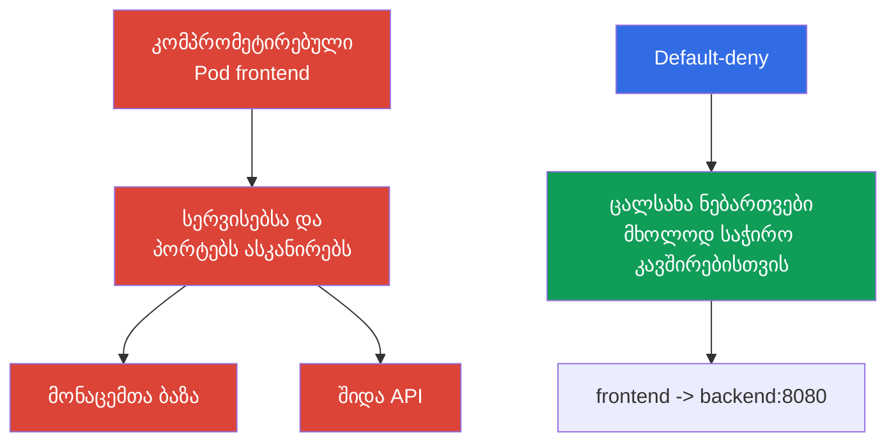

[Русская версия](ru.md) · [Eng version](README.md) · [Versión en español](es.md) · [Version française](fr.md) · [Deutsche Version](de.md) · [繁體中文版](tw.md) · [日本語版](jp.md)

# თავი 13. Network Policy, იზოლაცია და სეგმენტაცია

> **შემდეგ რა არის.** ავთენტიფიკაციის, Pod Security Standards-ისა და `Secret`-ის შესახებ თავებში ჩვენ შევზღუდეთ იდენტობები, პრივილეგიები და მონაცემებზე წვდომა. ახლა შევზღუდავთ ქსელურ გზებს სამუშაო დატვირთვებს შორის. `NetworkPolicy` ხელს უშლის ერთი `Pod`-ის კომპრომეტირებას, ავტომატურად გადაიზარდოს lateral movement-ში მთელ კლასტერში. ეს თემა შედის KCSA Kubernetes Security Fundamentals დომენში, რომლის წონაა 22%. მაგალითები გათვლილია Kubernetes `v1.36`-ზე.

## 13.1 `NetworkPolicy`: რატომ არის default allow სახიფათო და რისთვის გვჭირდება default-deny

`NetworkPolicy` არის Kubernetes API რესურსი, რომელიც აღწერს ნებადართულ შემომავალ (`Ingress`) და გამავალ (`Egress`) ქსელურ კავშირებს არჩეული `Pod`-ებისთვის. ის არ იცავს აპლიკაციას კოდში არსებული შეცდომისგან და არ ანაცვლებს RBAC-ს, მაგრამ სამუშაო დატვირთვის კომპრომეტირების შემდეგ ამცირებს ხელმისაწვდომი ქსელური გზების რაოდენობას.

Kubernetes ავტომატურად არ ქმნის default-deny `NetworkPolicy`-ს. თუ `Pod` კონკრეტული მიმართულებისთვის შესაბამისი პოლიტიკით იზოლირებული არ არის, ამ მიმართულებით ტრაფიკი ჩვეულებრივ ნებადართულია. default-deny მოდელზე გადასასვლელად ქმნიან ცალსახა `NetworkPolicy`-ს, რომელიც ირჩევს საჭირო Pods-ს და არჩეული `policyTypes`-ისთვის ნებადამრთველ ingress/egress rules-ს არ შეიცავს, შემდეგ კი ცალკეული პოლიტიკებით მხოლოდ აუცილებელ ნაკადებს ამატებენ.



**Default-deny** ნიშნავს, რომ ტრაფიკის მიმართულებისთვის თავდაპირველად ქმნიან ნაგულისხმევ აკრძალვას, შემდეგ კი ვიწრო allow-პოლიტიკებს ამატებენ. ფორმულირების სიზუსტე მნიშვნელოვანია: `Pod` `Ingress`-ისა და `Egress`-ისთვის ცალ-ცალკე იზოლირდება, როდესაც მას `policyTypes`-ში შესაბამისი მიმართულების მქონე ერთი `NetworkPolicy` მაინც ირჩევს.

`NetworkPolicy` პოლიტიკები ადიტიურია **ერთი არჩეული `Pod`-ისა და ერთი მიმართულებისთვის**: თუ მის ingress-ზე ან egress-ზე რამდენიმე პოლიტიკა ვრცელდება, კავშირების ნებადართული სიმრავლე ყველა შესაბამისი პოლიტიკის allow rules-ის გაერთიანებაა. პოლიტიკების რიგითობა და პრიორიტეტული ცალკე deny-წესი, რომელიც „ნებართვას ზემოდან აკრძალავს“, არ არსებობს.

`source Pod → destination Pod` კავშირისთვის ორივე მხარე დამოუკიდებლად მოწმდება. თუ source `Pod` `Egress`-ისთვის იზოლირებულია, მისმა egress rules-მა დანიშნულება უნდა დაუშვას. თუ destination `Pod` `Ingress`-ისთვის იზოლირებულია, მისმა ingress rules-მა წყარო უნდა დაუშვას. როდესაც ორივე მხარე იზოლირებულია, კავშირი შესაძლებელია მხოლოდ მაშინ, თუ მას ნებას რთავს **როგორც წყაროს egress, ისე დანიშნულების ingress**.

ასეთი მიდგომა ქსელში least privilege-ს ახორციელებს. ის დამოკიდებულებების ინვენტარიზაციას მოითხოვს: აპლიკაციას შეიძლება სჭირდებოდეს DNS, მონაცემთა ბაზა, სხვა სერვისის API, გარე გადახდის კარიბჭე ან ღრუბლოვანი პროვაიდერის endpoint. არასრული allow-პოლიტიკა აპლიკაციის მუშაობას დაარღვევს, ამიტომ ცვლილებას გეგმავენ და აკვირდებიან, ბრმად კი არ ამატებენ.

## 13.2 `Ingress`, `Egress`, სელექტორები და მინიმალური default-deny

`Ingress` აღწერს ტრაფიკს არჩეული `Pod`-ების **მიმართულებით**, ხოლო `Egress` - მათგან **გამავალ** ტრაფიკს. წესებში ცალკეული `Pod`-ების IP მისამართების ნაცვლად სელექტორებს იყენებენ, რადგან ხელახლა შექმნისას მისამართები იცვლება:

| მექანიზმი | რას ირჩევს | ტიპური გამოყენება |
|---|---|---|
| `podSelector` | მითითებული labels-ის მქონე `Pod` იმავე `Namespace`-ში | `frontend`-ისთვის `backend`-თან დაკავშირების ნებართვა |
| `namespaceSelector` | მითითებული labels-ის მქონე `Namespace` | `monitoring` namespace-იდან ტრაფიკის ნებართვა |
| `ipBlock` | IP მისამართების CIDR დიაპაზონი | გამონაკლისი გარე endpoint ან კორპორაციული ქსელი |
| `ports` | პროტოკოლი და პორტი | მონაცემთა ბაზისთვის მხოლოდ TCP 5432-ის ნებართვა |

თუ `podSelector` და `namespaceSelector` `from`-ის ან `to`-ს ერთ ელემენტშია მოთავსებული, ისინი თანაკვეთის პრინციპით მუშაობს: შეირჩევა საჭირო ნიშნულის მქონე `Pod` **შესაბამის** `Namespace`-ში. თუ ისინი სიის სხვადასხვა ელემენტია, ეს ალტერნატიული წყაროები ან დანიშნულებებია. ეს განსხვავება ხშირად მოწმდება YAML-ის შემცველ კითხვებში.

ქვემოთ მოცემული მინიმალური მაგალითი ირჩევს ყველა `Pod`-ს namespace `shop`-ში და ორივე მიმართულებით იზოლირებს მათ. ცარიელი `ingress` და `egress` სიები ამ მიმართულებებით კავშირებს არ უშვებს.

```yaml
apiVersion: networking.k8s.io/v1
kind: NetworkPolicy
metadata:
  name: default-deny-ingress-egress
  namespace: shop
spec:
  podSelector: {}
  policyTypes:
    - Ingress
    - Egress
  ingress: []
  egress: []
```

ეს არის default-deny იმ Pod traffic-ისთვის, რომელსაც CNI-ის კონკრეტული იმპლემენტაცია NetworkPolicy-ის საშუალებით ამუშავებს და არა host firewall-ის მეშვეობით. `hostNetwork` Pods-ის ქცევა network plugin-ზეა დამოკიდებული; node/host traffic-ს განსაკუთრებული შემთხვევები აქვს. ამიტომ ჩვეულებრივი Kubernetes `NetworkPolicy` kubelet-ზე ან სხვა host endpoints-ზე წვდომის უნივერსალურ კონტროლად ვერ ჩაითვლება.

ასეთი საბაზისო წესის შემდეგ ცალკეული პოლიტიკები ემატება. მაგალითად, შეიძლება `frontend`-ს მიეცეს ნებართვა მხოლოდ `backend`-ის TCP პორტ `8080`-ზე, ხოლო `backend`-ს - მხოლოდ მონაცემთა ბაზის პორტზე. სახელებით მუშაობისთვის, ჩვეულებრივ, ცალკე უშვებენ egress-ს კლასტერის DNS სერვერისკენ. სეგმენტაცია არ უნდა ჩანაცვლდეს წესით, რომელიც `kube-system`-ში მთელ ტრაფიკს უშვებს: ეს ნდობის ზედაპირს საჭიროზე მეტად აფართოებს.

`NetworkPolicy` კავშირებს მართავს L3/L4 ქსელურ დონეებზე მხარდაჭერილი იმპლემენტაციის ფარგლებში: წყაროებს, დანიშნულებებს, IP-სა და პორტებს. ის არ განმარტავს HTTP მომხმარებელს, SQL მოთხოვნას ან აპლიკაციის მონაცემების შინაარსს.

## 13.3 namespace-ის, ქსელისა და multi-tenancy-ის საზღვრები

`Namespace` სასარგებლოა რესურსების, კვოტების, RBAC-ისა და პოლიტიკების ორგანიზებისთვის, მაგრამ თავისთავად ქსელური კედელი არ არის. namespace `team-a`-ში მდებარე `Pod`-ს შეუძლია namespace `team-b`-ში მდებარე `Pod`-ს დაუკავშირდეს, თუ ქსელი ამის საშუალებას იძლევა და შესაბამისი `NetworkPolicy` არ არსებობს. მსგავსადვე, namespace მომხმარებელს API-ს მეშვეობით წვდომას არ უკრძალავს, თუ RBAC მას შესაბამის უფლებებს ანიჭებს.

ამიტომ multi-tenant გარემოს იზოლაცია შრეებად იგება:

| საზღვარი | კონტროლი | რომელ პრობლემას ამცირებს |
|---|---|---|
| იდენტობა და API | ცალკეული `ServiceAccount`, RBAC, admission | სხვისი რესურსების წაკითხვა ან შეცვლა |
| Namespace | ცალკეული namespace-ები, `ResourceQuota`, `LimitRange` | რესურსების შერევა და უკონტროლო მოხმარება |
| ქსელი | default-deny და მიზნობრივი `NetworkPolicy` | სხვა tenant-ის სერვისებზე წვდომა და lateral movement |
| შესრულება | PSS, `securityContext`, საჭიროების შემთხვევაში sandbox | კონტეინერიდან გასვლა და სახიფათო პრივილეგიები |

soft multi-tenancy-ის შემთხვევაში რამდენიმე გუნდი ერთ კლასტერს იყენებს, ხოლო დაცვა გამართულ RBAC-ზე, namespace-ებსა და ქსელურ პოლიტიკებზეა დაფუძნებული. ეს მოსახერხებელია, მაგრამ საერთო ინფრასტრუქტურის შეცდომამ ან ზედმეტად ფართო როლმა შეიძლება მეზობელ tenant-ზე იმოქმედოს. იზოლაციისადმი მაღალი მოთხოვნების შემთხვევაში უფრო ძლიერ გამიჯვნას იყენებენ: გამოყოფილ კვანძებს, ცალკეულ კლასტერებს ან sandbox runtime-ებს. არჩევანი დამოკიდებულია მონაცემების ღირებულებაზე, გუნდებს შორის ნდობასა და შეცდომის დასაშვებ შედეგებზე.

სეგმენტაცია რეალურ არქიტექტურას უნდა ასახავდეს და არა მხოლოდ გუნდების სახელებს. თითოეული კავშირის შესახებ სასარგებლო კითხვაა: რომელი `Pod` იწყებს კავშირს, რომელ სერვისთან, რომელ პორტზე და ნამდვილად საჭიროა თუ არა ეს კავშირი production-ში. პასუხი allowlist-ს ქმნის და მოულოდნელ დამოკიდებულებებს ავლენს.

## 13.4 CNI-ის როლი და Cilium-ის მიმოხილვა

`NetworkPolicy` ობიექტი Kubernetes API-ში შედის, მაგრამ Kubernetes თავად არ იჭერს პაკეტებს. წესების აღსრულებას CNI plugin ან მისი ქსელური კომპონენტი უზრუნველყოფს. ამიტომ YAML ობიექტის არსებობა ჯერ კიდევ არ ადასტურებს, რომ ტრაფიკი შეზღუდულია: არჩეულ CNI-ს `NetworkPolicy` enforcement-ის მხარდაჭერა უნდა ჰქონდეს და ის ჩართული უნდა იყოს. ეს დოკუმენტაციაში და სატესტო პროექტში უნდა შემოწმდეს, განსაკუთრებით CNI-ის შეცვლისას.

ჩვეულებრივი Kubernetes `NetworkPolicy` L3/L4 ურთიერთობებს გამოხატავს: რომელ იდენტობებს ან მისამართებს შორისაა ტრაფიკი ნებადართული და რომელ პორტებზე. **Cilium** არის CNI, რომელიც eBPF-ს იყენებს და მხარს უჭერს როგორც სტანდარტულ `NetworkPolicy`-ს, ისე საკუთარ პოლიტიკებს. მისი დამატებითი შესაძლებლობები სასარგებლოა, როდესაც დასაცავად მისამართი და პორტი საკმარისი არ არის:

| დონე | Cilium-ის კონტროლის მაგალითი | რისთვისაა საჭირო |
|---|---|---|
| L3 | წყარო ან დანიშნულება identity-ის მიხედვით | სამუშაო დატვირთვების ჯგუფების იზოლირება |
| L4 | TCP ან UDP პორტი | მხოლოდ საჭირო სერვისის პორტის ნებართვა |
| L7 | HTTP მეთოდი, გზა, სათაური | კონკრეტულ API ოპერაციებზე წვდომის შეზღუდვა |
| DNS-aware | DNS სახელების წესები, მაგალითად `api.example.com` | egress-ის შეზღუდვა გარე სერვისამდე, რომლის IP იცვლება |

L7 და DNS-aware პოლიტიკები საბაზისო API `NetworkPolicy`-ის შესაძლებლობები არ არის; ისინი Cilium-სა და მის კონფიგურაციაზეა დამოკიდებული. L7 კონტროლი მხოლოდ Cilium-ისთვის უნიკალური არ არის: ის ამას CNI-ის დონეზე eBPF-ის საშუალებით, sidecar-proxy-ის გარეშე ახორციელებს, ხოლო service mesh-ები (Istio, Linkerd) მსგავს შედეგს აპლიკაციის დონეზე sidecar-proxy-ის საშუალებით აღწევს და ამასთანავე mTLS-სა და telemetry-ს ამატებს (იხილეთ თავი 18 PKI-ის, mTLS-ისა და service mesh-ის შესახებ). CNI-ის L7 პოლიტიკები და service mesh აპლიკაციის შემოწმებას არ ანაცვლებს: L7 დონეზე `GET /healthz`-ის ნებართვა მთელ HTTP სერვისზე წვდომაზე უკეთესია, მაგრამ სერვერის მოწყვლადობას ვერ გამოასწორებს. Cilium ასევე ქსელური გადაწყვეტილებების დაკვირვებადობას უზრუნველყოფს, რაც გვეხმარება გავიგოთ, რატომ არის კავშირი ნებადართული ან უარყოფილი.

### რას აკეთებს `NetworkPolicy` და რას არ აკეთებს

**აკეთებს:** CNI enforcement-ის მეშვეობით არეგულირებს არჩეული `Pod`-ებისთვის ნებადართულ ingress/egress connections-ს. **ავტომატურად არ აკეთებს:** არ შიფრავს ტრაფიკს, არ ახდენს workload-ის ან მომხმარებლის ავთენტიფიკაციას, არ ასრულებს application-layer authorization-ს, არ ასკანირებს image-ს და არ ზღუდავს CPU/RAM-ს.

`Pod`-ებს შორის ტრაფიკის დაშიფვრა `NetworkPolicy`-ისა და CNI-ის L7 ფილტრაციისგან დამოუკიდებელი ამოცანაა: ის აპლიკაციის დონეზე TLS/mTLS-ით ან service mesh-ის მეშვეობით წყდება (მაგალითად Istio, Linkerd), რომელიც აპლიკაციის კოდის შეცვლის გარეშე ამატებს sidecar-proxy-ს, workload identity-სა და mTLS-ს (დაწვრილებით თავში 18). `NetworkPolicy`-სა და Cilium-ის L7 პოლიტიკებს კავშირის დაშვება ან აკრძალვა შეუძლია, მაგრამ მის შიგთავსს კონფიდენციალურს არ ხდის.

| სცენარი | საუკეთესო კონტროლი | მტკიცებულება |
|---|---|---|
| `frontend`-ს არ უნდა შეეძლოს database-თან TCP კავშირის გახსნა | `NetworkPolicy` | policy inspection და ნებადართული/აკრძალული connection-ის შემოწმება |
| `ServiceAccount`-ს არ უნდა შეეძლოს API-ს მეშვეობით `Secret`-ის წაკითხვა | RBAC | `kubectl auth can-i` და API audit event |
| Pod უნდა გაეშვას `privileged`-ის გარეშე | PSS/PSA ან admission policy | admission rejection/warn/audit |
| საჭიროა ნებადართული ტრაფიკის კრიპტოგრაფიული დაცვა | TLS/mTLS | certificate/handshake და configuration |

ასეთი არჩევანი საზღვრით იწყება: API permission, ობიექტის პარამეტრი, network path, runtime process ან data in transit. `NetworkPolicy` ზუსტი პასუხია მხოლოდ network path-ისთვის.

## 13.5 როგორ გამოიყენება ეს პრაქტიკაში

იწყებენ არა შემთხვევითი წესების ნაკრებით, არამედ ნაკადების რუკით: კლიენტიდან `frontend`-მდე, `frontend`-იდან `backend`-მდე, `backend`-იდან მონაცემთა ბაზამდე, სამუშაო დატვირთვებიდან DNS-მდე და მხოლოდ აუცილებელ გარე API-ებამდე. თითოეული namespace-ისთვის ქმნიან default-deny-ს საჭირო მიმართულებებისთვის, შემდეგ კი მინიმალურ allow-პოლიტიკებს შემოიღებენ. ამის ეტაპობრივად გაკეთება უფრო მოსახერხებელია: ჯერ დამოკიდებულებებს აკვირდებიან, შემდეგ ნაკლებად კრიტიკულ სერვისებს ზღუდავენ, რის შემდეგაც შაბლონს დანარჩენ namespace-ებში იყენებენ.

ნიშნულები უსაფრთხოების კონტრაქტის ნაწილი ხდება. სტაბილური labels, როგორიცაა `app: frontend`, `app: backend` და namespace-ის ნიშნული `team: payments`, საშუალებას აძლევს პოლიტიკას დროებითი IP-ის ნაცვლად `Pod`-ს მიჰყვეს. ნიშნულების მინიჭება კონტროლის გარეშე არასანდო სუბიექტისთვის არ შეიძლება: label-ის შეცვლის შესაძლებლობას სამუშაო დატვირთვის ქსელური კუთვნილების შეცვლაც შეუძლია.

production-ში ამოწმებენ როგორც მოსალოდნელ, ისე აკრძალულ გზებს: აპლიკაციისა და DNS-ის ხელმისაწვდომობას, მეტრიკებს, განახლებებს და მეზობელ tenant-ზე წვდომის არარსებობას. CNI-ის ლოგები ან Cilium-ის დაკვირვებადობა უარყოფილი კანონიერი კავშირის აღმოჩენაში გვეხმარება. ასეთი შემოწმებები თავად პოლიტიკას არ ანაცვლებს: მათი მიზანია დაადასტუროს, რომ intended allowlist არქიტექტურას შეესაბამება.

## 13.6 Exam vocabulary / მინი-ლექსიკონი

| ტერმინი | მნიშვნელობა |
|---|---|
| `NetworkPolicy` | Kubernetes API ობიექტი, რომელიც არჩეული `Pod`-ებისთვის ნებადართულ შემომავალ და გამავალ კავშირებს განსაზღვრავს. |
| default-deny | მიდგომა, რომლის დროსაც არჩეული მიმართულებით ტრაფიკი აკრძალულია, სანამ ცალსახა პოლიტიკა მას არ დაუშვებს. |
| `Ingress` | ქსელური ტრაფიკის მიმართულება `Pod`-ისკენ. |
| `Egress` | ქსელური ტრაფიკის მიმართულება `Pod`-იდან. |
| CNI | ინტერფეისი და plugins, რომელთა მეშვეობითაც Kubernetes კონტეინერების ქსელს აერთებს; CNI-ის იმპლემენტაცია ქსელურ პოლიტიკებს აღასრულებს. |
| multi-tenancy | ერთი პლატფორმის გამოყენება რამდენიმე გუნდის ან ორგანიზაციის მიერ, წვდომისა და რესურსების გამიჯვნით. |
| L3/L4/L7 | კონტროლის დონეები: IP ქსელი, სატრანსპორტო პორტები და გამოყენებითი პროტოკოლი. |

## 13.7 Exam Essentials / თავის შეჯამება

- შესაბამისი `NetworkPolicy`-ის გარეშე `Pod`-ის ტრაფიკი ჩვეულებრივ ნებადართულია; default-deny allowlist-ის საწყის წერტილს ქმნის.
- `Ingress` და `Egress` დამოუკიდებლად იზოლირდება, ხოლო შესაბამისი პოლიტიკები ნებართვების სახით ერთიანდება.
- `podSelector` და `namespaceSelector` ქსელურ იდენტობას labels-ის მეშვეობით განსაზღვრავს; `Namespace` პოლიტიკის გარეშე ქსელური საზღვარი არ არის.
- Multi-tenancy რამდენიმე შრეს მოითხოვს: RBAC-ს, namespace-ებს, კვოტებს, ქსელურ პოლიტიკებსა და შესრულების შეზღუდვებს.
- Enforcement დამოკიდებულია CNI-ზე. Cilium მხარს უჭერს საბაზისო პოლიტიკებს და შეუძლია L7 და DNS-aware კონტროლის დამატება.

## 13.8 არ აგერიოთ და როგორ გვხვდება ეს გამოცდაზე

KCSA-ის კითხვები, ჩვეულებრივ, მოდელს ამოწმებს და არა დიდი მანიფესტის სინტაქსს. საჭიროა default allow-სა და default-deny-ს შორის განსხვავების ცოდნა, `Ingress`-ისა და `Egress`-ის მიმართულებების, `podSelector`-ისა და `namespaceSelector`-ის როლების გაგება, ასევე იმის ცოდნა, რომ namespace ავტომატური ქსელური იზოლაცია არ არის. ცალკე ხაფანგია ის, რომ `NetworkPolicy` ეფექტურია მხოლოდ არჩეული CNI-ის მიერ enforcement-ის მხარდაჭერისას.

ასევე მნიშვნელოვანია, რომ საბაზისო `NetworkPolicy` Cilium-ის გაფართოებებში არ აგერიოთ. საბაზისო პოლიტიკა წყაროებს, დანიშნულებებსა და პორტებს ზღუდავს, ხოლო L7 HTTP წესები და DNS სახელის მიხედვით წესები Cilium-ის დამატებით შესაძლებლობებს მიეკუთვნება. ყველაზე სწორი პასუხის არჩევისას ეძებეთ მინიმალური კონტროლი, რომელიც აღწერილ ტრაფიკის გზას კეტავს.

## 13.9 თვითშემოწმების კითხვები

### 1. რა აღწერს ყველაზე ზუსტად `Pod`-ის მდგომარეობას, რომელსაც არცერთი `NetworkPolicy` არ ირჩევს?

   - a. თუ CNI `NetworkPolicy`-ს მხარს უჭერს, ნებადართულია მხოლოდ იმავე namespace-ის `Pod`-ებიდან მომავალი ტრაფიკი.

   - b. `Pod` მიმართულებისთვის non-isolated რჩება, სანამ შესაბამისი `NetworkPolicy` მას არ იზოლირებს და CNI წესებს არ აღასრულებს.

   - c. ნებადართულია მხოლოდ DNS და Kubernetes API-სკენ ტრაფიკი, დანარჩენი კავშირები ავტომატურად იბლოკება.

   - d. არჩეული პოლიტიკის გარეშე Kubernetes თითოეულ `Pod`-ზე ავტომატურად იყენებს default-deny ingress-სა და egress-ს.

<details>
<summary>პასუხი და განმარტება</summary>

**სწორი პასუხია: b.** Kubernetes თავისთავად თითოეული `Pod`-ისთვის default-deny-ს არ ქმნის. შეზღუდვა მაშინ ჩნდება, როდესაც შესაბამისი პოლიტიკა მიმართულებას იზოლირებს, ხოლო CNI მას აღასრულებს.

</details>

### 2. რა ეფექტი აქვს ერთ namespace-ში `NetworkPolicy`-ს, რომელშიც მითითებულია `podSelector: {}`, `policyTypes: [Ingress, Egress]`, `ingress: []` და `egress: []`?

   - a. ის namespace-ის ყველა Pods-ს ირჩევს და მითითებული მიმართულებებისთვის იზოლირებს, სანამ შესაბამისი additive policies საჭირო ტრაფიკს ცალსახად არ დაუშვებს.
   - b. ის ბლოკავს Kubernetes API authorization-ს ყველა მომხმარებლისთვის, რომლებიც ამ namespace-ის ობიექტებთან მუშაობენ.
   - c. ის namespace-ის Pods-ს შორის მთელ ingress-სა და egress-ს უშვებს და ამავე დროს მხოლოდ გარე ტრაფიკს კრძალავს.
   - d. ის არჩეულ Pods-ს შლის პირველი ქსელური კავშირისას, რომელიც ნებადამრთველ წესს არ დაემთხვა.

<details>
<summary>პასუხი და განმარტება</summary>

**სწორი პასუხია: a.** ცარიელი `podSelector` namespace-ის ყველა Pods-ს ირჩევს, ხოლო ცარიელი ingress/egress rules შესაბამისი მიმართულებებისთვის ნებართვებს არ ამატებს. სხვა შესაბამის NetworkPolicy-ებს კონკრეტული ტრაფიკის ადიტიურად დაშვება შეუძლია. რეალური enforcement გამოყენებული CNI-ის მიერ NetworkPolicy-ის მხარდაჭერას მოითხოვს.

</details>

### 3. რომელი მტკიცებაა სწორი ქსელური სეგმენტაციისთვის namespace-ის შესახებ?

   - a. namespace-ებს შორის ტრაფიკი შეუძლებელია, თუ namespace-ების სახელები განსხვავდება.

   - b. `Namespace` რესურსებს აწესრიგებს, მაგრამ ქსელურ საზღვარს შესაბამისი `NetworkPolicy` ქმნის.

   - c. `Namespace` RBAC-სა და `NetworkPolicy`-ს ანაცვლებს.

   - d. `Namespace` თავისთავად ბლოკავს namespace-ებს შორის ტრაფიკს.

<details>
<summary>პასუხი და განმარტება</summary>

**სწორი პასუხია: b.** Namespace სასარგებლოა რესურსებისა და წვდომის სამართავად, მაგრამ პაკეტებს ავტომატურად არ ფილტრავს. ქსელური გამიჯვნისთვის საჭიროა CNI-ის მიერ აღსრულებული პოლიტიკები.

</details>

### 4. რომელი პირობაა აუცილებელი იმისთვის, რომ Kubernetes `NetworkPolicy` ობიექტმა ტრაფიკი რეალურად შეზღუდოს?

   - a. ყველა `Pod` უნდა იყენებდეს `hostNetwork`-ს.

   - b. კლასტერში service mesh უნდა იყოს დაყენებული.

   - c. არჩეული CNI `NetworkPolicy`-ს უნდა უჭერდეს მხარს და აღასრულებდეს.

   - d. თითოეულ `Pod`-ს სტატიკური IP მისამართი უნდა ჰქონდეს.

<details>
<summary>პასუხი და განმარტება</summary>

**სწორი პასუხია: c.** Kubernetes პოლიტიკის ობიექტს API-ში ინახავს, მაგრამ ქსელურ აღსრულებას CNI ასრულებს. Service mesh-ს შეუძლია კონტროლის სხვა დონის უზრუნველყოფა, მაგრამ საბაზისო `NetworkPolicy`-ისთვის სავალდებულო არ არის.

</details>

### 5. რომელი შესაძლებლობა უფრო ზუსტად მიეკუთვნება Cilium-ის გაფართოებებს და არა საბაზისო Kubernetes `NetworkPolicy`-ს?

   - a. HTTP ტრაფიკის კონკრეტული მეთოდით/გზით შეზღუდვა ან DNS/FQDN სემანტიკის მიხედვით egress policy-ის განსაზღვრა.
   - b. `Pod`-ის label-ის მიხედვით არჩევა და მისთვის კონკრეტულ destination port-ზე TCP ტრაფიკის ნებართვა.
   - c. `namespaceSelector`-ისა და `podSelector`-ის გამოყენება workload-ისთვის ingress-ის დასაშვები წყაროს ასარჩევად.
   - d. CIDR-თან ერთად `ipBlock`-ის გამოყენება IP მისამართების განსაზღვრულ დიაპაზონამდე ტრაფიკის დასაშვებად.

<details>
<summary>პასუხი და განმარტება</summary>

**სწორი პასუხია: a.** საბაზისო Kubernetes `NetworkPolicy` L3/L4 სელექტორებთან, მიმართულებებთან, IP ბლოკებსა და პორტებთან მუშაობს. Cilium უფრო მაღალი დონის შესაძლებლობებს ამატებს, მათ შორის L7 HTTP policy-სა და FQDN/DNS-based egress controls-ს.

</details>

> **შემდეგ სად წავიდეთ.** default-deny და allow-პოლიტიკების პრაქტიკული დაპროექტებისთვის შეისწავლეთ CKS-ის თავი 04 `NetworkPolicy`-ის შესახებ. metadata სერვისებისა და სამსახურებრივი endpoints-ის დაცვა განხილულია CKS-ის თავში 05, ხოლო Cilium-ის L3/L4/L7 და DNS-aware პოლიტიკები - CKS-ის თავში 06. `Pod` ქსელისა და CNI-ის ადმინისტრაციული საფუძვლებისთვის სასარგებლოა CKA-ის თავი 34.

[სარჩევი](../README_GE.md) · [თავი 12](../12/ge.md) · [თავი 14](../14/ge.md)
