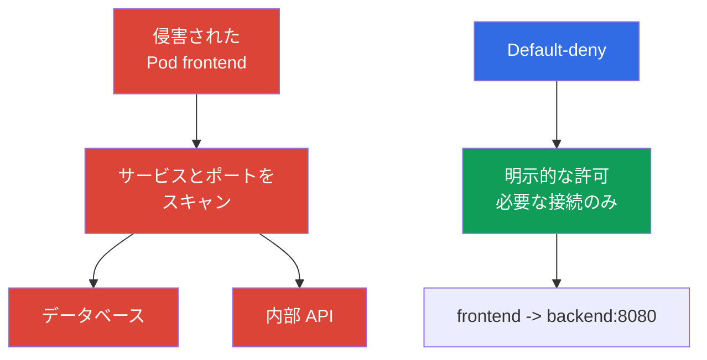

[Русская версия](ru.md) · [Eng version](README.md) · [Versión en español](es.md) · [Version française](fr.md) · [Deutsche Version](de.md) · [ქართული ვერსია](ge.md) · [繁體中文版](tw.md)

# 第13章. NetworkPolicy、分離、セグメンテーション

> **この次へ。** 認証、Pod Security Standards、`Secret` の章では、アイデンティティ、権限、データへのアクセスを制限しました。ここでは、ワークロード間のネットワーク経路を制限します。`NetworkPolicy` は、1つの `Pod` の侵害がクラスター全体での lateral movement に自動的につながるのを防ぐのに役立ちます。これは、比重22%の KCSA Kubernetes Security Fundamentals ドメインのテーマです。例は Kubernetes `v1.36` を対象としています。

## 13.1 `NetworkPolicy`: default allow が危険な理由と default-deny が必要な理由

`NetworkPolicy` は、選択した `Pod` に許可する受信 (`Ingress`) と送信 (`Egress`) のネットワーク接続を記述する Kubernetes API リソースです。アプリケーションのコード上の欠陥から保護するものでも、RBAC を置き換えるものでもありませんが、ワークロード侵害後に利用可能なネットワーク経路の数を減らします。

Kubernetes は default-deny `NetworkPolicy` を自動作成しません。特定の方向について `Pod` が適用可能なポリシーで分離されていない場合、その方向のトラフィックは通常許可されます。default-deny に移行するには、必要な Pods を選択し、選択した `policyTypes` に対する許可 ingress/egress rules を含まない明示的な `NetworkPolicy` を作成します。その後、別のポリシーで必要なフローだけを追加します。



**Default-deny** は、トラフィック方向に対して最初にデフォルトの拒否を作成し、その後に限定的な allow ポリシーを追加することを意味します。表現の正確さが重要です。`Pod` は、`policyTypes` に該当する方向を持つ `NetworkPolicy` が少なくとも1つ選択したとき、`Ingress` と `Egress` それぞれに対して個別に分離されます。

`NetworkPolicy` は、**同じ選択対象の `Pod` と同じ方向に対して** 加算的です。複数のポリシーがその ingress または egress に適用される場合、許可される接続セットは、適用可能なすべてのポリシーの allow rules の和集合です。ポリシーの順序は存在せず、「許可を上書きして拒否する」という優先度を持つ個別の deny rule もありません。

接続 `source Pod → destination Pod` では、両側が独立して確認されます。source `Pod` が `Egress` に対して分離されているなら、その egress rules は宛先を許可しなければなりません。destination `Pod` が `Ingress` に対して分離されているなら、その ingress rules は送信元を許可しなければなりません。両側が分離されている場合、接続が可能なのは、送信元の egress と宛先の ingress の**両方**が許可するときだけです。

このアプローチはネットワークで least privilege を実現します。依存関係の棚卸しが必要です。アプリケーションには DNS、データベース、別サービスの API、外部決済ゲートウェイ、クラウドプロバイダーの endpoint が必要になることがあります。不完全な allow ポリシーはアプリケーションの動作を妨げる可能性があるため、無作為に追加するのではなく、変更を計画して監視します。

## 13.2 `Ingress`、`Egress`、セレクター、最小限の default-deny

`Ingress` は選択した `Pod` **への**トラフィックを記述し、`Egress` はそこからの**トラフィック**を記述します。再作成時にアドレスが変わるため、rules では個々の `Pod` の IP アドレスではなくセレクターを使用します。

| メカニズム | 選択対象 | 一般的な用途 |
|---|---|---|
| `podSelector` | 同じ `Namespace` 内で指定した labels を持つ `Pod` | `frontend` から `backend` へのアクセスを許可する |
| `namespaceSelector` | 指定した labels を持つ `Namespace` | namespace `monitoring` からのトラフィックを許可する |
| `ipBlock` | IP アドレスの CIDR 範囲 | 例外的な外部 endpoint または社内ネットワーク |
| `ports` | プロトコルとポート | データベースには TCP 5432 のみを許可する |

`podSelector` と `namespaceSelector` が同じ `from` または `to` 要素にある場合、両者は積集合として機能します。つまり、適合する `Namespace` **内の**必要なラベルを持つ `Pod` が対象です。これらがリストの別要素にある場合は、代替の送信元または宛先です。この違いは YAML を用いた問題で頻繁に問われます。

以下は、namespace `shop` のすべての `Pod` を選択し、両方向で分離する最小限の例です。空の `ingress` と `egress` リストは、それらの方向の接続を許可しません。

```yaml
apiVersion: networking.k8s.io/v1
kind: NetworkPolicy
metadata:
  name: default-deny-ingress-egress
  namespace: shop
spec:
  podSelector: {}
  policyTypes:
    - Ingress
    - Egress
  ingress: []
  egress: []
```

これは、特定の CNI 実装が NetworkPolicy を通じて処理する Pod traffic に対する default-deny であり、host firewall に対するものではありません。`hostNetwork` Pods の動作は network plugin に依存します。node/host traffic には特別なケースがあります。したがって、通常の Kubernetes `NetworkPolicy` を kubelet やその他の host endpoints へのアクセスに対する万能な制御と見なすことはできません。

この基本ルールの後に、個別のポリシーを追加します。たとえば `frontend` には、`backend` の TCP ポート `8080` のみを許可し、`backend` にはデータベースのポートのみを許可できます。名前による通信のためには、通常、クラスターの DNS サーバーへの egress を別途許可します。セグメンテーションを、`kube-system` 内のすべてのトラフィックを許可する rule で置き換えてはいけません。これは、必要以上に信頼された対象範囲を広げます。

`NetworkPolicy` は、サポート対象の実装の範囲で L3/L4 ネットワーク層の接続を制御します。すなわち、送信元、宛先、IP、ポートです。HTTP のユーザー、SQL query、またはアプリケーションデータの意味を解釈するものではありません。

## 13.3 Namespace の境界、ネットワーク、multi-tenancy

`Namespace` はリソース、quota、RBAC、ポリシーの整理に役立ちますが、それ自体はネットワークの壁ではありません。namespace `team-a` の `Pod` は、ネットワークが許可し、適用可能な `NetworkPolicy` がない場合、`team-b` の `Pod` に接続できます。同様に、RBAC が対応する権限を付与していれば、namespace は API を通じたユーザーアクセスを禁止しません。

したがって、multi-tenant 環境の分離は複数の層で構築します。

| 境界 | 制御 | 軽減する問題 |
|---|---|---|
| アイデンティティと API | 個別の `ServiceAccount`、RBAC、admission | 他者のリソースの読み取りまたは変更 |
| Namespace | 個別の namespace、`ResourceQuota`、`LimitRange` | リソースの混在と無制御な消費 |
| ネットワーク | default-deny と限定的な `NetworkPolicy` | 他の tenant のサービスへのアクセスと lateral movement |
| 実行 | PSS、`securityContext`、必要に応じて sandbox | コンテナからの脱出と危険な権限 |

soft multi-tenancy では、複数チームがクラスターを共有し、保護は正しい RBAC、namespace、ネットワークポリシーに基づきます。これは便利ですが、共有インフラの誤りや広範な role が隣接する tenant に影響する可能性があります。高い分離要件には、専用ノード、別クラスター、sandbox runtime など、より強力な分離を適用します。選択はデータの価値、チーム間の信頼、誤りによる許容可能な影響に依存します。

セグメンテーションは、チーム名だけでなく実際のアーキテクチャを反映する必要があります。各接続に対して有用な問いは、どの `Pod` が接続を開始し、どのサービスへ、どのポートで、そして本当に production でその接続が必要なのか、です。その答えは allowlist を形成し、予期しない依存関係を明らかにします。

## 13.4 CNI の役割と Cilium の概要

`NetworkPolicy` オブジェクトは Kubernetes API の一部ですが、Kubernetes 自体がパケットをインターセプトするわけではありません。rules の適用は CNI plugin またはそのネットワークコンポーネントが担います。したがって、YAML オブジェクトの存在だけではトラフィックが制限されている証明にはなりません。選択した CNI は `NetworkPolicy` enforcement をサポートし、有効化している必要があります。特に CNI の変更時には、ドキュメントとプロジェクトテストで確認しなければなりません。

通常の Kubernetes `NetworkPolicy` は L3/L4 の関係を表現します。つまり、どのアイデンティティまたはアドレス間のトラフィックを、どのポートで許可するかです。**Cilium** は eBPF を使用し、標準の `NetworkPolicy` と独自のポリシーをサポートする CNI です。以下のように、アドレスとポートだけでは保護に不十分な場合、その追加機能が有用です。

| レベル | Cilium の制御例 | 必要な理由 |
|---|---|---|
| L3 | identity による送信元または宛先 | ワークロードグループを分離する |
| L4 | TCP または UDP のポート | 必要なサービスのポートのみを許可する |
| L7 | HTTP method、path、header | 特定の API 操作へのアクセスを制限する |
| DNS-aware | 例: `api.example.com` のような DNS 名の rules | IP が変わる外部サービスへの egress を絞り込む |

L7 および DNS-aware ポリシーは、基本の `NetworkPolicy` API の機能ではありません。これらは Cilium とその設定に依存します。L7 制御は Cilium に固有のものではありません。Cilium は sidecar-proxy なしで eBPF を通じて CNI レベルに実装し、service mesh (Istio、Linkerd) は sidecar-proxy を通じてアプリケーションレベルで似た結果を実現するとともに、mTLS と telemetry を追加します (PKI、mTLS、service mesh については第18章を参照)。CNI の L7 ポリシーと service mesh はアプリケーション検証の代替ではありません。L7 で `GET /healthz` を許可することは、HTTP サービス全体へのアクセスより有用ですが、サーバーの脆弱性を修正するものではありません。Cilium はネットワーク判断の可観測性も提供し、接続が許可または拒否された理由の理解に役立ちます。

### `NetworkPolicy` が行うことと行わないこと

**行うこと:** CNI enforcement を通じて、選択した `Pod` の許可される ingress/egress connections を制御します。**自動的には行わないこと:** トラフィックの暗号化、workload またはユーザーの認証、application-layer authorization、image のスキャン、CPU/RAM の制限。

`Pod` 間トラフィックの暗号化は、`NetworkPolicy` および CNI の L7 filtering とは別の課題です。これはアプリケーションレベルの TLS/mTLS、またはアプリケーションコードを変更せずに sidecar-proxy、workload identity、mTLS を追加する service mesh (例: Istio、Linkerd) によって解決されます (詳細は第18章)。`NetworkPolicy` と Cilium L7 ポリシーは接続を許可または拒否できますが、その内容を機密にするものではありません。

| シナリオ | 最適な制御 | 証跡 |
|---|---|---|
| `frontend` が database への TCP 接続を開いてはならない | `NetworkPolicy` | policy の検査と許可/拒否された connection の確認 |
| `ServiceAccount` が API 経由で `Secret` を読んではならない | RBAC | `kubectl auth can-i` と API audit event |
| Pod は `privileged` なしで起動しなければならない | PSS/PSA または admission policy | admission rejection/warn/audit |
| 許可されたトラフィックの暗号学的保護が必要 | TLS/mTLS | certificate/handshake と configuration |

このような選択は境界から始まります。すなわち、API permission、オブジェクトのパラメーター、network path、runtime process、または data in transit です。`NetworkPolicy` が正確な回答となるのは network path に対してだけです。

## 13.5 実践での適用方法

無作為な rules の集合から始めるのではなく、フローマップから始めます。client から `frontend`、`frontend` から `backend`、`backend` からデータベース、ワークロードから DNS、そして必要な外部 API のみ、という流れです。各 namespace で必要な方向に default-deny を作成し、その後、最小限の allow ポリシーを導入します。段階的に行うのが便利です。まず依存関係を観察し、次に重要度の低いサービスを制限し、その後に残りの namespace へテンプレートを適用します。

labels はセキュリティ契約の一部になります。`app: frontend`、`app: backend`、namespace label `team: payments` のような安定した labels により、ポリシーは一時的な IP ではなく `Pod` を追跡できます。labels は、制御なしに信頼できない主体へ付与してはなりません。label を変更する能力は、ワークロードのネットワーク所属も変更できるためです。

production では、期待される経路と禁止される経路の両方を確認します。アプリケーションの可用性、DNS、metrics、更新、隣接 tenant へのアクセスがないことです。CNI logs または Cilium の可観測性は、拒否された正当な接続を見つけるのに役立ちます。このような確認はポリシー自体の代替ではありません。その目的は、意図した allowlist がアーキテクチャに対応していることを確認することです。

## 13.6 Exam vocabulary / ミニ用語集

| 用語 | 意味 |
|---|---|
| `NetworkPolicy` | 選択した `Pod` に許可する受信および送信接続を定義する Kubernetes API オブジェクト。 |
| default-deny | 明示的なポリシーが許可するまで、選択した方向のトラフィックを拒否するアプローチ。 |
| `Ingress` | `Pod` へのネットワークトラフィックの方向。 |
| `Egress` | `Pod` からのネットワークトラフィックの方向。 |
| CNI | Kubernetes がコンテナネットワークを接続するためのインターフェイスと plugins。CNI 実装がネットワークポリシーを適用する。 |
| multi-tenancy | アクセスとリソースを分離しながら、複数のチームまたは組織が1つのプラットフォームを使用すること。 |
| L3/L4/L7 | 制御の層: IP ネットワーク、トランスポートポート、アプリケーションプロトコル。 |

## 13.7 Exam Essentials / 章のまとめ

- 適用可能な `NetworkPolicy` がなければ、`Pod` トラフィックは通常許可されます。default-deny は allowlist の出発点を作ります。
- `Ingress` と `Egress` は独立して分離され、適合するポリシーは許可として加算されます。
- `podSelector` と `namespaceSelector` は labels を通じてネットワークアイデンティティを定義します。ポリシーのない `Namespace` はネットワーク境界ではありません。
- Multi-tenancy には、RBAC、namespace、quota、ネットワークポリシー、実行制限という複数の層が必要です。
- Enforcement は CNI に依存します。Cilium は基本ポリシーをサポートし、L7 および DNS-aware 制御を追加できます。

## 13.8 混同しやすい点と試験での出題形式

KCSA の問題は通常、大きな manifest の構文ではなくモデルを問います。default allow と default-deny の区別、`Ingress` と `Egress` の方向、`podSelector` と `namespaceSelector` の役割、そして namespace が自動的なネットワーク分離ではない事実を理解する必要があります。別の注意点として、`NetworkPolicy` が効果を持つのは、選択した CNI が enforcement をサポートする場合だけです。

また、基本の `NetworkPolicy` と Cilium の拡張を混同しないことも重要です。基本ポリシーは送信元、宛先、ポートを制限しますが、L7 HTTP rules と DNS 名による rules は Cilium の追加機能に属します。最も正しい回答を選ぶときは、説明されたトラフィック経路を閉じる最小限の制御を探してください。

## 13.9 自己確認問題

### 1. どの `NetworkPolicy` にも選択されていない `Pod` の状態を、最も正確に説明するものはどれですか。

   - a. CNI が `NetworkPolicy` をサポートしている場合、同じ namespace の `Pod` からのトラフィックだけが許可される。

   - b. 適合する `NetworkPolicy` がその方向を分離し、CNI が rules を適用するまで、`Pod` はその方向に対して non-isolated のままである。

   - c. DNS と Kubernetes API へのトラフィックだけが許可され、それ以外の接続は自動的にブロックされる。

   - d. Kubernetes は、選択ポリシーのないすべての `Pod` に対し、default-deny ingress と egress を自動的に適用する。

<details>
<summary>回答と解説</summary>

**正解: b.** Kubernetes 自体は、各 `Pod` に default-deny を作成しません。適合するポリシーが方向を分離し、CNI がそれを適用したときに制限が生じます。

</details>

### 2. 1つの namespace で、`podSelector: {}`、`policyTypes: [Ingress, Egress]`、`ingress: []`、`egress: []` を持つ `NetworkPolicy` はどのような効果を持ちますか。

   - a. namespace のすべての Pods を選択して、適合する additive policies が必要なトラフィックを明示的に許可するまで、指定された方向に対して分離する。
   - b. この namespace のオブジェクトを操作するすべてのユーザーに対し、Kubernetes API authorization をブロックする。
   - c. 外部トラフィックだけを禁止しつつ、namespace の Pods 間のすべての ingress と egress を許可する。
   - d. 許可 rule に一致しないネットワーク接続が最初に発生したとき、選択した Pods を削除する。

<details>
<summary>回答と解説</summary>

**正解: a.** 空の `podSelector` は namespace のすべての Pods を選択し、空の ingress/egress rules は対応する方向に許可を追加しません。他の適合する NetworkPolicy は、特定のトラフィックを加算的に許可できます。実際の enforcement には、使用する CNI による NetworkPolicy のサポートが必要です。

</details>

### 3. ネットワークセグメンテーションにおける namespace について、正しい記述はどれですか。

   - a. namespace 名が異なる場合、namespace 間のトラフィックは不可能である。

   - b. `Namespace` はリソースを整理するが、ネットワーク境界は適用可能な `NetworkPolicy` が作成する。

   - c. `Namespace` は RBAC と `NetworkPolicy` を置き換える。

   - d. `Namespace` は、それ自体で namespace 間トラフィックをブロックする。

<details>
<summary>回答と解説</summary>

**正解: b.** Namespace はリソースとアクセスの管理には役立ちますが、パケットを自動的にフィルタリングしません。ネットワーク分離には、CNI が適用するポリシーが必要です。

</details>

### 4. Kubernetes `NetworkPolicy` オブジェクトが実際にトラフィックを制限するために必要な条件はどれですか。

   - a. すべての `Pod` が `hostNetwork` を使用しなければならない。

   - b. クラスターに service mesh がインストールされていなければならない。

   - c. 選択した CNI が `NetworkPolicy` をサポートし、適用しなければならない。

   - d. 各 `Pod` が静的な IP アドレスを持たなければならない。

<details>
<summary>回答と解説</summary>

**正解: c.** Kubernetes はポリシーオブジェクトを API に保存しますが、ネットワークへの適用は CNI が実行します。service mesh は別のレベルの制御を提供できますが、基本の `NetworkPolicy` には必須ではありません。

</details>

### 5. 基本の Kubernetes `NetworkPolicy` ではなく、Cilium の拡張に分類するのが最も正確な機能はどれですか。

   - a. HTTP トラフィックを特定の method/path に制限する、または DNS/FQDN semantics による egress policy を設定する。
   - b. label で `Pod` を選択し、特定の destination port への TCP traffic を許可する。
   - c. `namespaceSelector` と `podSelector` を使用して、workload への許可された ingress の送信元を選択する。
   - d. CIDR を持つ `ipBlock` を使用して、特定の IP アドレス範囲へのトラフィックを許可する。

<details>
<summary>回答と解説</summary>

**正解: a.** 基本の Kubernetes `NetworkPolicy` は L3/L4 セレクター、方向、IP blocks、ポートで機能します。Cilium は、L7 HTTP policy や FQDN/DNS-based egress controls など、より高いレベルの機能を追加します。

</details>

> **この次へ。** default-deny と allow ポリシーの実践的な設計については、CKS の第04章 `NetworkPolicy` を学んでください。metadata services とサービス endpoints の保護は CKS の第05章で、Cilium の L3/L4/L7 と DNS-aware ポリシーは CKS の第06章で説明します。`Pod` ネットワークと CNI の管理基盤については、CKA の第34章が役立ちます。

[目次](../README_JP.md) · [第12章](../12/jp.md) · [第14章](../14/jp.md)
