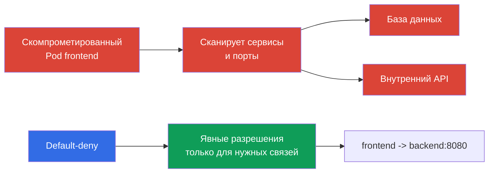

> **Язык:** русский. Переводы будут добавлены после публикации соответствующих файлов.

# Глава 13. Network Policy, изоляция и сегментация

> **Что дальше.** В главах об аутентификации, Pod Security Standards и `Secret` мы ограничивали идентичности, привилегии и доступ к данным. Теперь ограничим сетевые пути между рабочими нагрузками. `NetworkPolicy` помогает не дать компрометации одного `Pod` автоматически стать lateral movement по всему кластеру. Это тема домена KCSA Kubernetes Security Fundamentals с весом 22%. Примеры ориентированы на Kubernetes `v1.36`.

## 13.1 `NetworkPolicy`: почему default allow опасен и зачем default-deny

`NetworkPolicy` - API-ресурс Kubernetes, который описывает разрешённые входящие (`Ingress`) и исходящие (`Egress`) сетевые соединения для выбранных `Pod`. Он не защищает приложение от ошибки в коде и не заменяет RBAC, но уменьшает число доступных сетевых путей после компрометации рабочей нагрузки.

Kubernetes не создаёт default-deny `NetworkPolicy` автоматически. Если `Pod` не изолирован применимой политикой для конкретного направления, трафик по этому направлению обычно разрешён. Чтобы перейти к default-deny, создают явную `NetworkPolicy`, которая выбирает нужные Pods и не содержит разрешающих ingress/egress rules для выбранных `policyTypes`, а затем отдельными политиками добавляют только необходимые потоки.



**Default-deny** означает, что для направления трафика сначала создают запрет по умолчанию, а затем добавляют узкие allow-политики. Важна точность формулировки: `Pod` изолируется отдельно для `Ingress` и `Egress`, когда его выбирает хотя бы одна `NetworkPolicy` с соответствующим направлением в `policyTypes`.

Политики `NetworkPolicy` аддитивны **для одного выбранного `Pod` и одного направления**: если к его ingress или egress применяются несколько политик, разрешённый набор соединений является объединением allow rules всех применимых политик. Порядка политик и отдельного deny-правила с приоритетом «запретить поверх разрешения» нет.

Для соединения `source Pod → destination Pod` обе стороны проверяются независимо. Если source `Pod` изолирован для `Egress`, его egress rules должны разрешать назначение. Если destination `Pod` изолирован для `Ingress`, его ingress rules должны разрешать источник. Когда изолированы обе стороны, соединение возможно только если его разрешают **и egress источника, и ingress назначения**.

Такой подход реализует least privilege в сети. Он требует инвентаризации зависимостей: приложению могут быть нужны DNS, база данных, API другого сервиса, внешний платёжный шлюз или endpoint облачного провайдера. Неполная allow-политика способна нарушить работу приложения, поэтому изменение планируют и наблюдают, а не добавляют вслепую.

## 13.2 `Ingress`, `Egress`, селекторы и минимальный default-deny

`Ingress` описывает трафик **к** выбранным `Pod`, а `Egress` - трафик **из** них. В правилах используют селекторы, а не IP-адреса отдельных `Pod`, поскольку адреса меняются при пересоздании:

| Механизм | Что выбирает | Типичное применение |
|---|---|---|
| `podSelector` | `Pod` с указанными labels в том же `Namespace` | разрешить `frontend` обращаться к `backend` |
| `namespaceSelector` | `Namespace` с указанными labels | разрешить трафик из namespace `monitoring` |
| `ipBlock` | CIDR-диапазон IP-адресов | исключительный внешний endpoint или корпоративная сеть |
| `ports` | протокол и порт | разрешить только TCP 5432 для базы данных |

Если `podSelector` и `namespaceSelector` находятся в одном элементе `from` или `to`, они работают как пересечение: подходят `Pod` с нужной меткой **в** подходящем `Namespace`. Если это разные элементы списка, это альтернативные источники или назначения. Эта разница часто проверяется в вопросах с YAML.

Ниже минимальный пример, который выбирает все `Pod` в namespace `shop` и изолирует их в обоих направлениях. Пустые списки `ingress` и `egress` не разрешают соединений в этих направлениях.

```yaml
apiVersion: networking.k8s.io/v1
kind: NetworkPolicy
metadata:
  name: default-deny-ingress-egress
  namespace: shop
spec:
  podSelector: {}
  policyTypes:
    - Ingress
    - Egress
  ingress: []
  egress: []
```

Это default-deny для Pod traffic, который конкретная реализация CNI обрабатывает через NetworkPolicy, а не host firewall. Поведение `hostNetwork` Pods зависит от network plugin; node/host traffic имеет специальные случаи. Поэтому обычный Kubernetes `NetworkPolicy` нельзя считать универсальным контролем доступа к kubelet или другим host endpoints.

После такого базового правила добавляют отдельные политики. Например, `frontend` можно разрешить только на TCP-порт `8080` `backend`, а `backend` - только на порт базы данных. Для работы по именам обычно отдельно разрешают egress к DNS-серверу кластера. Не стоит заменять сегментацию правилом, которое разрешает весь трафик в `kube-system`: это расширяет доверенную поверхность сильнее, чем нужно.

`NetworkPolicy` управляет соединениями на сетевых уровнях L3/L4 в рамках поддерживаемой реализации: источниками, назначениями, IP и портами. Она не интерпретирует пользователя HTTP, SQL-запрос или смысл данных приложения.

## 13.3 Границы namespace, сети и multi-tenancy

`Namespace` полезен для организации ресурсов, квот, RBAC и политик, но сам по себе не является сетевой стеной. `Pod` из namespace `team-a` способен обратиться к `Pod` из `team-b`, если это допускает сеть и нет применимой `NetworkPolicy`. Аналогично namespace не запрещает пользователю доступ через API, если RBAC даёт ему соответствующие права.

Поэтому изоляция multi-tenant среды строится слоями:

| Граница | Контроль | Какую проблему уменьшает |
|---|---|---|
| Идентичность и API | отдельные `ServiceAccount`, RBAC, admission | чтение или изменение чужих ресурсов |
| Namespace | отдельные namespace, `ResourceQuota`, `LimitRange` | смешение ресурсов и неконтролируемое потребление |
| Сеть | default-deny и точечные `NetworkPolicy` | доступ к сервисам другого tenant и lateral movement |
| Выполнение | PSS, `securityContext`, sandbox при необходимости | выход из контейнера и опасные привилегии |

Для soft multi-tenancy несколько команд делят кластер, а защита основана на корректных RBAC, namespace и сетевых политиках. Это удобно, но ошибка в общей инфраструктуре или широкая роль может затронуть соседнего tenant. При высоких требованиях к изоляции применяют более сильное разделение: выделенные узлы, отдельные кластеры или sandbox-рантаймы. Выбор зависит от ценности данных, доверия между командами и допустимых последствий ошибки.

Сегментация должна отражать реальную архитектуру, а не только названия команд. Полезный вопрос к каждой связи: какой `Pod` инициирует соединение, к какому сервису, по какому порту и действительно ли связь требуется в production. Ответ образует allowlist и выявляет неожиданные зависимости.

## 13.4 Роль CNI и обзор Cilium

Объект `NetworkPolicy` входит в Kubernetes API, но Kubernetes сам не перехватывает пакеты. Применение правил обеспечивает CNI-плагин или его сетевой компонент. Поэтому наличие YAML-объекта ещё не доказывает, что трафик ограничен: выбранный CNI должен поддерживать и включать enforcement `NetworkPolicy`. Это нужно проверять в документации и в проектном тесте, особенно при смене CNI.

Обычная Kubernetes `NetworkPolicy` выражает отношения L3/L4: между какими идентичностями или адресами разрешён трафик и на каких портах. **Cilium** - CNI, использующий eBPF и поддерживающий стандартные `NetworkPolicy`, а также собственные политики. Его дополнительные возможности полезны, когда для защиты недостаточно адреса и порта:

| Уровень | Пример контроля Cilium | Зачем нужен |
|---|---|---|
| L3 | источник или назначение по identity | изолировать группы рабочих нагрузок |
| L4 | TCP или UDP порт | разрешить только порт нужного сервиса |
| L7 | HTTP-метод, путь, заголовок | ограничить доступ конкретным API-операциям |
| DNS-aware | правила для DNS-имён, например `api.example.com` | сузить egress к внешнему сервису, чей IP меняется |

L7 и DNS-aware политики не являются возможностями базового API `NetworkPolicy`; они зависят от Cilium и его конфигурации. Они не заменяют проверку приложения: разрешение `GET /healthz` на L7 полезнее доступа ко всему HTTP-сервису, но не исправит уязвимость сервера. Cilium также даёт наблюдаемость сетевых решений, что помогает понять, почему соединение разрешено или отклонено.

### Что `NetworkPolicy` делает и чего не делает

**Делает:** регулирует разрешённые ingress/egress connections для выбранных `Pod` через CNI enforcement. **Не делает автоматически:** не шифрует трафик, не аутентифицирует workload или пользователя, не выполняет application-layer authorization, не сканирует image и не ограничивает CPU/RAM.

| Scenario | Best control | Evidence |
|---|---|---|
| `frontend` не должен открыть TCP-соединение к database | `NetworkPolicy` | inspection policy и проверка разрешённого/запрещённого connection |
| `ServiceAccount` не должен читать `Secret` через API | RBAC | `kubectl auth can-i` и API audit event |
| Под должен запускаться без `privileged` | PSS/PSA или admission policy | admission rejection/warn/audit |
| Нужна криптографическая защита разрешённого трафика | TLS/mTLS | certificate/handshake и configuration |

Такой выбор начинается с границы: API permission, параметр объекта, network path, runtime process или data in transit. `NetworkPolicy` - точный ответ только для network path.

## 13.5 Как это применяют на практике

Начинают не с набора случайных правил, а с карты потоков: клиент к `frontend`, `frontend` к `backend`, `backend` к базе данных, рабочие нагрузки к DNS и только необходимые внешние API. Для каждого namespace создают default-deny для нужных направлений, затем вводят минимальные allow-политики. Это удобнее делать поэтапно: сначала наблюдать зависимости, затем ограничивать менее критичные сервисы, после чего применять шаблон в остальных namespace.

Метки становятся частью контракта безопасности. Стабильные labels вроде `app: frontend`, `app: backend` и метка namespace `team: payments` позволяют политике следовать за `Pod`, а не за его временным IP. Метки не должны выдаваться недоверенному субъекту без контроля: возможность изменить label может изменить и сетовую принадлежность рабочей нагрузки.

В production проверяют как ожидаемые, так и запрещённые пути: доступность приложения, DNS, метрики, обновления и отсутствие доступа к соседнему tenant. Логи CNI или наблюдаемость Cilium помогают найти отклонённое законное соединение. Такие проверки не являются заменой самой политики: их цель подтвердить, что intended allowlist соответствует архитектуре.

## 13.6 Exam vocabulary / Мини-глоссарий

| Термин | Значение |
|---|---|
| `NetworkPolicy` | Kubernetes API-объект, задающий разрешённые входящие и исходящие соединения для выбранных `Pod`. |
| default-deny | подход, при котором трафик в выбранном направлении запрещён, пока его не разрешит явная политика. |
| `Ingress` | направление сетевого трафика к `Pod`. |
| `Egress` | направление сетевого трафика из `Pod`. |
| CNI | интерфейс и плагины, через которые Kubernetes подключает сеть контейнеров; реализация CNI применяет сетевые политики. |
| multi-tenancy | использование одной платформы несколькими командами или организациями с разделением доступа и ресурсов. |
| L3/L4/L7 | уровни контроля: IP-сеть, транспортные порты и прикладной протокол. |

## 13.7 Exam Essentials / Итоги главы

- Без применимой `NetworkPolicy` трафик `Pod` обычно разрешён; default-deny создаёт исходную точку для allowlist.
- `Ingress` и `Egress` изолируются независимо, а подходящие политики складываются как разрешения.
- `podSelector` и `namespaceSelector` задают сетевую идентичность через labels; `Namespace` без политики не является сетевой границей.
- Multi-tenancy требует нескольких слоёв: RBAC, namespace, квот, сетевых политик и ограничений выполнения.
- Enforcement зависит от CNI. Cilium поддерживает базовые политики и может добавить L7- и DNS-aware контроль.

## 13.8 Не путать и как это встречается на экзамене

Вопросы KCSA обычно проверяют модель, а не синтаксис большого манифеста. Нужно различать default allow и default-deny, понимать направление `Ingress` и `Egress`, роль `podSelector` и `namespaceSelector`, а также факт, что namespace не является автоматической сетевой изоляцией. Отдельная ловушка: `NetworkPolicy` имеет эффект только при поддержке enforcement выбранным CNI.

Также важно не смешивать базовую `NetworkPolicy` с расширениями Cilium. Базовая политика ограничивает источники, назначения и порты, тогда как L7 HTTP-правила и правила по DNS-имени относятся к дополнительным возможностям Cilium. При выборе наиболее правильного ответа ищите минимальный контроль, который закрывает описанный путь трафика.

## 13.9 Вопросы для самопроверки

### 1. Что точнее всего описывает состояние `Pod`, который не выбран ни одной `NetworkPolicy`?

   - a. Разрешён только трафик от `Pod` того же namespace, если CNI поддерживает `NetworkPolicy`.

   - b. `Pod` остаётся non-isolated для направления, пока подходящая `NetworkPolicy` не изолирует его, а CNI не применит правила.

   - c. Разрешён только DNS и трафик к Kubernetes API, остальные соединения блокируются автоматически.

   - d. Kubernetes автоматически применяет default-deny ingress и egress к каждому `Pod` без выбранной политики.

<details>
<summary>Ответ и разбор</summary>

**Верный ответ: b.** Сам по себе Kubernetes не создаёт default-deny для каждого `Pod`. Ограничение появляется, когда подходящая политика изолирует направление, а CNI применяет её.

</details>

### 2. Какой эффект имеет `NetworkPolicy` с `podSelector: {}`, `policyTypes: [Ingress, Egress]`, `ingress: []` и `egress: []` в одном namespace?

   - a. Она выбирает все Pods namespace и изолирует их для указанных направлений, пока подходящие additive policies явно не разрешат нужный трафик.
   - b. Она блокирует Kubernetes API authorization для всех пользователей, которые работают с объектами этого namespace.
   - c. Она разрешает весь ingress и egress между Pods namespace, одновременно запрещая только внешний трафик.
   - d. Она удаляет выбранные Pods при первом сетевом соединении, которое не совпало с разрешающим правилом.

<details>
<summary>Ответ и разбор</summary>

**Верный ответ: a.** Пустой `podSelector` выбирает все Pods namespace, а пустые ingress/egress rules не добавляют разрешений для соответствующих направлений. Другие подходящие NetworkPolicy могут аддитивно разрешить конкретный трафик. Реальное enforcement требует поддержки NetworkPolicy используемым CNI.

</details>

### 3. Какое утверждение о namespace верно для сетевой сегментации?

   - a. Трафик между namespace невозможен, если имена namespace различаются.

   - b. `Namespace` организует ресурсы, но сетовую границу создаёт применимая `NetworkPolicy`.

   - c. `Namespace` заменяет RBAC и `NetworkPolicy`.

   - d. `Namespace` сам по себе блокирует межпространственный трафик.

<details>
<summary>Ответ и разбор</summary>

**Верный ответ: b.** Namespace полезен для управления ресурсами и доступа, но не фильтрует пакеты автоматически. Для сетевого разделения нужны политики, применяемые CNI.

</details>

### 4. Какое условие необходимо, чтобы объект Kubernetes `NetworkPolicy` действительно ограничивал трафик?

   - a. Все `Pod` должны использовать `hostNetwork`.

   - b. В кластере должен быть установлен service mesh.

   - c. Выбранный CNI должен поддерживать и применять `NetworkPolicy`.

   - d. Каждый `Pod` должен иметь статический IP-адрес.

<details>
<summary>Ответ и разбор</summary>

**Верный ответ: c.** Kubernetes хранит объект политики в API, но сетевое применение выполняет CNI. Service mesh может дать иной уровень контроля, но не является обязательным для базовой `NetworkPolicy`.

</details>

### 5. Какую возможность точнее отнести к расширениям Cilium, а не к базовой Kubernetes `NetworkPolicy`?

   - a. Ограничить HTTP-трафик конкретным методом/путём или задать egress policy по DNS/FQDN-семантике.
   - b. Выбрать `Pod` по label и разрешить ему TCP-трафик на определённый destination port.
   - c. Использовать `namespaceSelector` и `podSelector`, чтобы выбрать допустимый источник ingress для workload.
   - d. Использовать `ipBlock` с CIDR, чтобы разрешить трафик к определённому диапазону IP-адресов.

<details>
<summary>Ответ и разбор</summary>

**Верный ответ: a.** Базовая Kubernetes `NetworkPolicy` работает с L3/L4-селекторами, направлениями, IP-блоками и портами. Cilium добавляет возможности более высокого уровня, включая L7 HTTP policy и FQDN/DNS-based egress controls.

</details>

> **Куда дальше.** Для практического проектирования default-deny и allow-политик изучите главу 04 CKS о `NetworkPolicy`. Защита metadata-сервисов и служебных endpoints разобрана в главе 05 CKS, а L3/L4/L7 и DNS-aware политики Cilium - в главе 06 CKS. Для административной основы сети `Pod` и CNI полезна глава 34 CKA.

[Оглавление](../README_RU.md) · [Глава 12](../12/ru.md) · [Глава 14](../14/ru.md)
