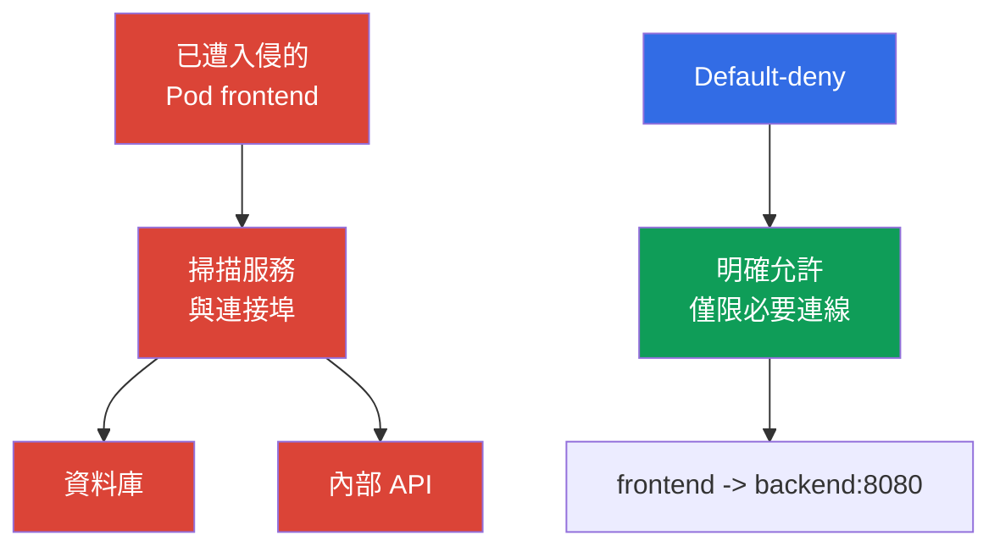

[Русская версия](ru.md) · [Eng version](README.md) · [Versión en español](es.md) · [Version française](fr.md) · [Deutsche Version](de.md) · [ქართული ვერსია](ge.md) · [日本語版](jp.md)

# 第 13 章：NetworkPolicy、隔離與分段

> **接下來。** 在身分驗證、Pod Security Standards 與 `Secret` 的章節中，我們限制了身分、權限和資料存取。現在將限制工作負載之間的網路路徑。`NetworkPolicy` 有助於避免一個 `Pod` 遭入侵後，自動演變為整個叢集中的橫向移動。這是 KCSA Kubernetes Security Fundamentals 領域的主題，權重為 22%。範例以 Kubernetes `v1.36` 為準。

## 13.1 `NetworkPolicy`：為何 default allow 危險，以及為何需要 default-deny

`NetworkPolicy` 是 Kubernetes API 資源，用於描述對所選 `Pod` 允許的傳入 (`Ingress`) 與傳出 (`Egress`) 網路連線。它無法防護應用程式的程式碼錯誤，也不能取代 RBAC，但能減少工作負載遭入侵後可用的網路路徑數量。

Kubernetes 不會自動建立 default-deny `NetworkPolicy`。若 `Pod` 未由特定方向的適用政策隔離，該方向的流量通常會被允許。要轉為 default-deny，需建立明確的 `NetworkPolicy`，選取所需 Pods 並且不包含針對所選 `policyTypes` 的允許 ingress/egress rules，接著再以個別政策僅新增必要的流量。



**Default-deny** 表示先針對流量方向建立預設拒絕，之後再加入狹義的 allow 政策。措辭的精確性很重要：當 `Pod` 被至少一個 `policyTypes` 中包含相應方向的 `NetworkPolicy` 選取時，會分別對 `Ingress` 與 `Egress` 進行隔離。

`NetworkPolicy` 對於**同一個選取的 `Pod` 與同一方向**具有加總效果：若有多個政策套用至其 ingress 或 egress，允許的連線集合是所有適用政策 allow rules 的聯集。不存在政策順序，也沒有具優先權、可「在允許之上拒絕」的個別 deny 規則。

對於 `source Pod → destination Pod` 連線，兩端會獨立檢查。若 source `Pod` 針對 `Egress` 被隔離，其 egress rules 必須允許目的地。若 destination `Pod` 針對 `Ingress` 被隔離，其 ingress rules 必須允許來源。當雙方皆被隔離時，只有**來源 egress 與目的地 ingress 都允許**時，連線才可能建立。

此方法在網路中實作 least privilege。它需要盤點相依關係：應用程式可能需要 DNS、資料庫、其他服務的 API、外部付款閘道或雲端供應商 endpoint。不完整的 allow 政策可能中斷應用程式運作，因此應規劃與觀察變更，而非盲目加入。

## 13.2 `Ingress`、`Egress`、選取器與最小化 default-deny

`Ingress` 描述**到達**所選 `Pod` 的流量，而 `Egress` 描述**從中離開**的流量。規則使用選取器，而非個別 `Pod` 的 IP 位址，因為位址會在重新建立時變更：

| 機制 | 選取內容 | 典型用途 |
|---|---|---|
| `podSelector` | 同一 `Namespace` 中帶有指定 labels 的 `Pod` | 允許 `frontend` 存取 `backend` |
| `namespaceSelector` | 帶有指定 labels 的 `Namespace` | 允許來自 namespace `monitoring` 的流量 |
| `ipBlock` | IP 位址的 CIDR 範圍 | 例外的外部 endpoint 或企業網路 |
| `ports` | 通訊協定與連接埠 | 僅允許資料庫的 TCP 5432 |

若 `podSelector` 與 `namespaceSelector` 位於同一個 `from` 或 `to` 元素，它們會作為交集運作：符合條件的是適當 `Namespace` **中的**帶有必要標籤的 `Pod`。若它們是不同的清單元素，則代表替代的來源或目的地。此差異經常在 YAML 題目中受到測試。

以下是最小範例，它選取 namespace `shop` 中的所有 `Pod`，並在兩個方向隔離它們。空的 `ingress` 與 `egress` 清單不允許這些方向的連線。

```yaml
apiVersion: networking.k8s.io/v1
kind: NetworkPolicy
metadata:
  name: default-deny-ingress-egress
  namespace: shop
spec:
  podSelector: {}
  policyTypes:
    - Ingress
    - Egress
  ingress: []
  egress: []
```

這是適用於由特定 CNI 實作透過 NetworkPolicy 處理的 Pod traffic 的 default-deny，而不是 host firewall。`hostNetwork` Pods 的行為取決於 network plugin；node/host traffic 具有特殊情況。因此，不能將一般 Kubernetes `NetworkPolicy` 視為對 kubelet 或其他 host endpoints 的通用存取控制。

在此基礎規則後，應加入個別政策。例如，可只允許 `frontend` 連至 `backend` 的 TCP 連接埠 `8080`，並只允許 `backend` 連至資料庫連接埠。為了能以名稱運作，通常會另外允許 egress 至叢集的 DNS 伺服器。不應以允許 `kube-system` 中所有流量的規則取代分段：這會比必要範圍更大幅度地擴展可信任面。

`NetworkPolicy` 在受支援實作的 L3/L4 網路層級管理連線：來源、目的地、IP 與連接埠。它不會解譯 HTTP 使用者、SQL 查詢或應用程式資料的含義。

## 13.3 Namespace、網路與 multi-tenancy 邊界

`Namespace` 有助於組織資源、配額、RBAC 與政策，但它本身不是網路防火牆。namespace `team-a` 中的 `Pod` 可以連線至 `team-b` 中的 `Pod`，只要網路允許且沒有適用的 `NetworkPolicy`。同樣地，若 RBAC 賦予相應權限，namespace 不會禁止使用者透過 API 存取。

因此，multi-tenant 環境的隔離由多個層次組成：

| 邊界 | 控制 | 減少的問題 |
|---|---|---|
| 身分與 API | 個別的 `ServiceAccount`、RBAC、admission | 讀取或變更他人的資源 |
| Namespace | 個別 namespace、`ResourceQuota`、`LimitRange` | 資源混雜與未受控的消耗 |
| 網路 | default-deny 與精確的 `NetworkPolicy` | 存取其他 tenant 的服務與橫向移動 |
| 執行 | PSS、`securityContext`，必要時使用 sandbox | 從容器逸出與危險權限 |

在 soft multi-tenancy 中，數個團隊共用一個叢集，保護依賴正確的 RBAC、namespace 與網路政策。這很方便，但共用基礎設施中的錯誤或寬泛角色可能會影響相鄰 tenant。若隔離要求很高，則採用更強的分隔方式：專用節點、個別叢集或 sandbox runtimes。選擇取決於資料價值、團隊之間的信任程度，以及可接受的錯誤後果。

分段應反映真實架構，而不只是團隊名稱。對每個連線有一個實用問題：哪個 `Pod` 發起連線、要連至哪個服務、使用哪個連接埠，以及該連線在 production 中是否確實需要。回答構成 allowlist，並找出意料之外的相依性。

## 13.4 CNI 的角色與 Cilium 概覽

`NetworkPolicy` 物件屬於 Kubernetes API，但 Kubernetes 本身不會攔截封包。規則的套用由 CNI plugin 或其網路元件負責。因此，存在 YAML 物件尚不能證明流量已受限：所選 CNI 必須支援並啟用 `NetworkPolicy` enforcement。應在文件及專案測試中驗證此項，尤其是在更換 CNI 時。

一般 Kubernetes `NetworkPolicy` 表示 L3/L4 關係：哪些身分或位址之間允許流量，以及使用哪些連接埠。**Cilium** 是使用 eBPF 的 CNI，支援標準 `NetworkPolicy` 以及其自有政策。當位址與連接埠不足以提供保護時，它的額外功能很有用：

| 層級 | Cilium 控制範例 | 用途 |
|---|---|---|
| L3 | 依 identity 的來源或目的地 | 隔離工作負載群組 |
| L4 | TCP 或 UDP 連接埠 | 僅允許所需服務的連接埠 |
| L7 | HTTP 方法、路徑、標頭 | 限制存取特定 API 操作 |
| DNS-aware | DNS 名稱規則，例如 `api.example.com` | 縮限至 IP 會變動之外部服務的 egress |

L7 與 DNS-aware 政策並非基礎 `NetworkPolicy` API 的功能；它們依賴 Cilium 及其設定。L7 控制並非 Cilium 獨有：它透過 eBPF 在 CNI 層實作，無需 sidecar-proxy；而 service mesh（Istio、Linkerd）透過 sidecar-proxy 在應用程式層達成類似結果，同時加入 mTLS 與 telemetry（請見第 18 章 PKI、mTLS 與 service mesh）。CNI L7 政策與 service mesh 並不能取代應用程式檢查：在 L7 允許 `GET /healthz` 比存取整個 HTTP 服務更有益，但不會修復伺服器漏洞。Cilium 也提供網路決策的可觀測性，有助於了解連線為何被允許或拒絕。

### `NetworkPolicy` 能做與不能做的事

**能做：**透過 CNI enforcement 管理所選 `Pod` 允許的 ingress/egress connections。**不會自動做：**不會加密流量、不會驗證 workload 或使用者、不會執行 application-layer authorization、不會掃描 image，也不會限制 CPU/RAM。

`Pod` 之間的流量加密，是不同於 `NetworkPolicy` 與 CNI L7 filtering 的工作：它可透過應用程式層的 TLS/mTLS，或透過 service mesh（例如 Istio、Linkerd）來解決，後者會加入 sidecar-proxy、workload identity 與 mTLS，而無須修改應用程式程式碼（第 18 章有更詳細說明）。`NetworkPolicy` 與 Cilium L7 政策可以允許或拒絕連線，但不會讓其內容保密。

| 情境 | 最佳控制 | 證據 |
|---|---|---|
| `frontend` 不應對 database 開啟 TCP 連線 | `NetworkPolicy` | 檢視 policy 及驗證允許/拒絕的 connection |
| `ServiceAccount` 不應透過 API 讀取 `Secret` | RBAC | `kubectl auth can-i` 與 API audit event |
| Pod 必須在沒有 `privileged` 的情況下啟動 | PSS/PSA 或 admission policy | admission rejection/warn/audit |
| 需要對允許流量提供密碼學保護 | TLS/mTLS | certificate/handshake 與 configuration |

此類選擇始於邊界：API permission、物件參數、network path、runtime process 或 data in transit。`NetworkPolicy` 僅是對 network path 的精確答案。

## 13.5 實務上的套用方式

起點不是隨機規則集合，而是流量圖：client 至 `frontend`、`frontend` 至 `backend`、`backend` 至資料庫、工作負載至 DNS，以及僅限必要的外部 API。對每個 namespace，為所需方向建立 default-deny，接著導入最小化的 allow 政策。分階段執行會更方便：先觀察相依性，再限制較不關鍵的服務，之後將模式套用到其餘 namespace。

labels 會成為安全契約的一部分。穩定的 labels，例如 `app: frontend`、`app: backend` 及 namespace label `team: payments`，能讓政策跟隨 `Pod`，而非其暫時 IP。不應在沒有控制的情況下讓不受信任主體指派 labels：變更 label 的能力也可能變更工作負載的網路歸屬。

在 production 中，應驗證預期與禁止的路徑：應用程式可用性、DNS、指標、更新，以及無法存取相鄰 tenant。CNI logs 或 Cilium 可觀測性有助於找出被拒絕的合法連線。這些檢查不能取代政策本身：其目的在於確認 intended allowlist 符合架構。

## 13.6 Exam vocabulary / 迷你詞彙表

| 術語 | 含義 |
|---|---|
| `NetworkPolicy` | 定義所選 `Pod` 允許傳入與傳出連線的 Kubernetes API 物件。 |
| default-deny | 一種方法，所選方向的流量在明確政策允許前均被拒絕。 |
| `Ingress` | 進入 `Pod` 的網路流量方向。 |
| `Egress` | 離開 `Pod` 的網路流量方向。 |
| CNI | Kubernetes 藉以連接容器網路的介面與 plugins；CNI 實作會套用網路政策。 |
| multi-tenancy | 多個團隊或組織使用同一平台，並對存取及資源進行隔離。 |
| L3/L4/L7 | 控制層級：IP 網路、傳輸連接埠與應用程式通訊協定。 |

## 13.7 Exam Essentials / 本章重點

- 若沒有適用的 `NetworkPolicy`，`Pod` 流量通常會被允許；default-deny 提供 allowlist 的起點。
- `Ingress` 與 `Egress` 獨立隔離，符合的政策會以允許規則方式加總。
- `podSelector` 與 `namespaceSelector` 透過 labels 定義網路身分；沒有政策的 `Namespace` 不是網路邊界。
- Multi-tenancy 需要多個層次：RBAC、namespace、配額、網路政策與執行限制。
- Enforcement 取決於 CNI。Cilium 支援基礎政策，並可加入 L7 與 DNS-aware 控制。

## 13.8 不要混淆的概念，以及它在考試中的出現方式

KCSA 題目通常測試模型，而非大型 manifest 的語法。必須區分 default allow 與 default-deny，理解 `Ingress` 與 `Egress` 的方向、`podSelector` 與 `namespaceSelector` 的角色，以及 namespace 並非自動網路隔離。另一個陷阱是：`NetworkPolicy` 僅在所選 CNI 支援 enforcement 時才有效。

同樣重要的是，不要混淆基礎 `NetworkPolicy` 與 Cilium 擴充功能。基礎政策限制來源、目的地與連接埠，而 L7 HTTP 規則及 DNS 名稱規則屬於 Cilium 的額外功能。選擇最正確答案時，應尋找能封閉所述流量路徑的最小控制。

## 13.9 自我檢查題

### 1. 最精確描述未被任何 `NetworkPolicy` 選取之 `Pod` 狀態的是什麼？

   - a. 若 CNI 支援 `NetworkPolicy`，僅允許同一 namespace 的 `Pod` 流量。

   - b. `Pod` 對該方向仍為 non-isolated，直到適用的 `NetworkPolicy` 將其隔離且 CNI 套用規則為止。

   - c. 僅允許 DNS 與至 Kubernetes API 的流量，其他連線會自動封鎖。

   - d. Kubernetes 會自動對每個沒有選取政策的 `Pod` 套用 default-deny ingress 與 egress。

<details>
<summary>答案與解析</summary>

**正確答案：b。** Kubernetes 本身不會對每個 `Pod` 建立 default-deny。當適用政策隔離該方向且 CNI 套用它時，限制才會生效。

</details>

### 2. 在一個 namespace 中，`podSelector: {}`、`policyTypes: [Ingress, Egress]`、`ingress: []` 與 `egress: []` 的 `NetworkPolicy` 有何效果？

   - a. 它選取 namespace 的所有 Pods，並在適用的 additive policies 明確允許必要流量前，隔離其指定方向。
   - b. 它封鎖所有使用該 namespace 物件之使用者的 Kubernetes API authorization。
   - c. 它允許 namespace Pods 之間所有 ingress 與 egress，同時只禁止外部流量。
   - d. 當所選 Pods 的第一個網路連線不符合允許規則時，它會刪除這些 Pods。

<details>
<summary>答案與解析</summary>

**正確答案：a。** 空的 `podSelector` 選取 namespace 的所有 Pods，而空的 ingress/egress rules 不為相應方向新增允許。其他適用的 NetworkPolicy 可以加總方式允許特定流量。實際 enforcement 需要使用的 CNI 支援 NetworkPolicy。

</details>

### 3. 關於網路分段，哪一項 namespace 陳述是正確的？

   - a. 若 namespace 名稱不同，namespace 之間的流量不可能傳送。

   - b. `Namespace` 用於組織資源，但網路邊界由適用的 `NetworkPolicy` 建立。

   - c. `Namespace` 可取代 RBAC 與 `NetworkPolicy`。

   - d. `Namespace` 本身會封鎖跨 namespace 流量。

<details>
<summary>答案與解析</summary>

**正確答案：b。** Namespace 有助於資源與存取管理，但不會自動篩選封包。網路分隔需要由 CNI 套用的政策。

</details>

### 4. Kubernetes `NetworkPolicy` 物件確實限制流量的必要條件是什麼？

   - a. 所有 `Pod` 都必須使用 `hostNetwork`。

   - b. 叢集必須安裝 service mesh。

   - c. 所選 CNI 必須支援並套用 `NetworkPolicy`。

   - d. 每個 `Pod` 都必須有靜態 IP 位址。

<details>
<summary>答案與解析</summary>

**正確答案：c。** Kubernetes 將政策物件儲存在 API 中，但網路套用由 CNI 執行。Service mesh 能提供不同層級的控制，但對基礎 `NetworkPolicy` 並非必要。

</details>

### 5. 哪一項功能較精確地屬於 Cilium 擴充功能，而非基礎 Kubernetes `NetworkPolicy`？

   - a. 將 HTTP 流量限制為特定方法/路徑，或以 DNS/FQDN 語義設定 egress policy。
   - b. 依 label 選取 `Pod`，並允許其在特定 destination port 上使用 TCP 流量。
   - c. 使用 `namespaceSelector` 與 `podSelector`，選取 workload 可接受的 ingress 來源。
   - d. 使用含 CIDR 的 `ipBlock`，允許流量至特定 IP 位址範圍。

<details>
<summary>答案與解析</summary>

**正確答案：a。** 基礎 Kubernetes `NetworkPolicy` 使用 L3/L4 selectors、方向、IP blocks 與連接埠。Cilium 加入更高層級功能，包括 L7 HTTP policy 及 FQDN/DNS-based egress controls。

</details>

> **接下來。** 如需實際設計 default-deny 與 allow 政策，請研讀 CKS 第 04 章的 `NetworkPolicy`。CKS 第 05 章說明 metadata services 與服務 endpoints 的保護，而 CKS 第 06 章涵蓋 Cilium 的 L3/L4/L7 與 DNS-aware 政策。若要了解 `Pod` 網路與 CNI 的管理基礎，請參閱 CKA 第 34 章。

[目錄](../README_TW.md) · [第 12 章](../12/tw.md) · [第 14 章](../14/tw.md)