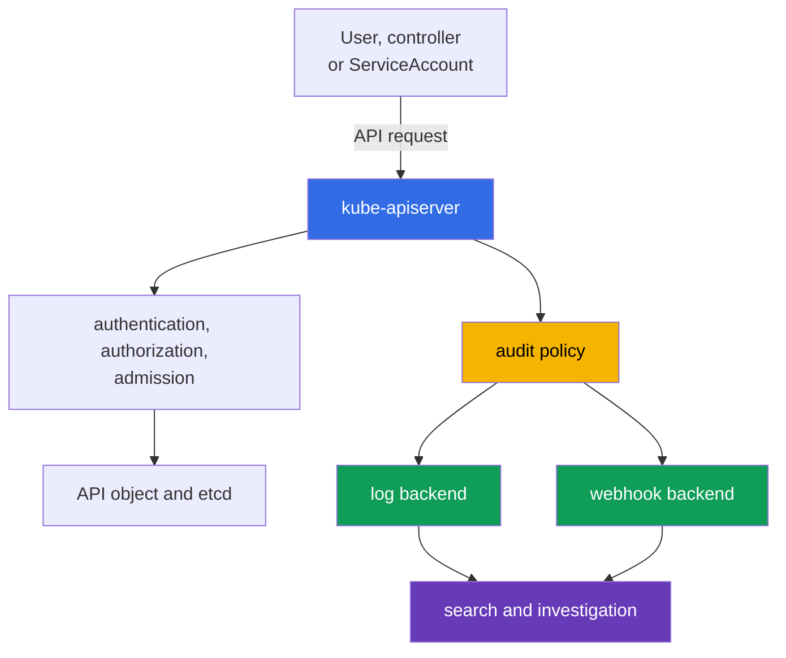

[Русская версия](ru.md) · [Versión en español](es.md) · [Version française](fr.md) · [Deutsche Version](de.md) · [ქართული ვერსია](ge.md) · [繁體中文版](tw.md) · [日本語版](jp.md)

# Chapter 14. Audit Logging

> **What comes next.** Chapters 10-13 covered identities, permissions, `Pod` restrictions, secrets, and network segmentation. Even strong preventive controls do not eliminate the need to answer the questions of who did what and when. Audit logging creates a trail of requests to the Kubernetes API for investigations and compliance. This is a topic in the KCSA **Kubernetes Security Fundamentals** domain, weighted at 22%. The examples apply to Kubernetes `v1.36`.

## 14.1 Why Kubernetes API auditing is needed

Audit logging records events about requests to the `kube-apiserver`. Actions from `kubectl`, controllers, `ServiceAccount`, and other clients pass through the API: creating a `Pod`, reading a `Secret`, modifying a `RoleBinding`, or deleting a `NetworkPolicy`. Therefore, the audit log answers four basic questions:

| Question | Example event data |
|---|---|
| Who? | user, group, or `ServiceAccount` in `user.username` |
| What? | the `verb`, resource, and object in `objectRef` |
| When? | the timestamp and request processing stage |
| What was the result? | the response code and reason in `responseStatus` |



Audit records access to the Kubernetes API, not every action inside a container. For example, a shell command in a `Pod`, a system call, or a network connection may not appear in the audit log. Therefore, auditing complements but does not replace application logs, network telemetry, and runtime detection.

Useful scenarios include determining who granted a dangerous RBAC permission, identifying the source of a resource deletion, checking unusual reads of a `Secret`, or building an incident timeline. For compliance, auditing provides a verifiable record of administrative actions if the log itself is protected from modification and unauthorized reading.

## 14.2 Audit policy: stages and recording levels

An `audit policy` determines which requests to record, at which stages, and with how much data. It is a `kube-apiserver` configuration, not an object that is normally created through `kubectl`. Policy rules are matched in order: the first matching rule is applied. Therefore, narrow rules for sensitive resources are placed above a broad default rule.

A single request can pass through the following stages:

| Stage | Meaning |
|---|---|
| `RequestReceived` | The API Server received the request but has not finished processing it yet. |
| `ResponseStarted` | Sending the response started, especially for long-running `watch` requests. |
| `ResponseComplete` | Processing is complete and the final status is known. |
| `Panic` | The API Server handler terminated unexpectedly. |

For most investigations, `ResponseComplete` is more valuable because it connects an action to the final result. Recording every stage of every short request increases volume and often creates duplication. A policy can exclude unnecessary stages through `omitStages`.

The recording level and stage answer different questions. The stage says **when** to create an event, while the level says **how much** information to include in it.

| Level | What is retained | Typical purpose and boundary |
|---|---|---|
| `None` | nothing | for deliberately excluded noise, such as specific health requests; an overly broad exclusion creates a blind spot. |
| `Metadata` | identity, URI, verb, object reference, time, and status, but no body | a safe baseline level for most API calls. |
| `Request` | `Metadata` and the request body | a narrow case where the intent of a change matters; the body can contain sensitive data. |
| `RequestResponse` | `Request` and the response body | the most complete but also the most expensive and risky level; use it only with a justified forensic need. |

A particular pitfall is that `RequestResponse` for a `Secret` can record a password or token in the log. For access to a `Secret`, `Metadata` is usually chosen so the fact, actor, object, and result are visible without exposing the value. Likewise, a high level for frequent `watch` requests can generate a large data stream without proportional benefit.

## 14.3 Useful signal, noise, and backends

An audit log should help an investigation rather than become another source of leaks and cost. Useful signal is usually associated with a security change or access to an important resource: a change to a `Role`, `ClusterRoleBinding`, `ServiceAccount`, `Secret`, `NetworkPolicy`, or a `Pod` with elevated privileges.

Noise is created by frequent readiness checks, ordinary controller requests, and long-running `watch` operations. They should not be thoughtlessly disabled for entire API paths. A safer approach is to exclude only specific, understood endpoints, retain a `Metadata` catch-all rule, and periodically review event volume.

| Decision | Benefit | What to consider |
|---|---|---|
| `Metadata` as the default | provides identity, action, and outcome with little risk of body disclosure | does not show the content of the modified object |
| selective `Request` | helps understand the intent of a critical change | limit it by resource, namespace, and verb |
| `None` for known noise | reduces storage cost | can hide an important action if the rule is too broad |
| `RequestResponse` | provides the most complete context | creates the greatest volume, cost, and risk of disclosure |

Kubernetes supports two primary event delivery destinations:

- The **log backend** writes JSON events to a local file on the control plane node. It is simple for initial collection, but the node and file must be protected, rotated, and sent to centralized storage.
- The **webhook backend** sends events over HTTPS to an external collector or SIEM. It simplifies centralized search and correlation, but requires TLS, collector reliability, delivery monitoring, and assessment of the impact of an unavailable backend on the API.

The policy and backend have different roles: the policy decides which events to generate, while the backend decides where to send them. Regardless of the chosen path, permissions to read logs must be limited: an audit log can contain user names, addresses, infrastructure details, and, with an unsafe policy, request bodies.

## 14.4 Reading events, runtime detection, and investigation

During an investigation, an event is usually read as JSON and a combination of time, identity, verb, object, IP address, and status is sought. The different stages of a single request are joined by `auditID`.

In addition to `user.username`, `verb`, `objectRef`, and `responseStatus`, an audit event can also contain client-context fields that help distinguish an expected automated client from an unexpected one:

| Event field | What it shows |
|---|---|
| `user.username` | the calling identity: a user, group, or `ServiceAccount` |
| `verb` | the action performed, for example `get`, `list`, `delete` |
| `objectRef` | the affected resource, namespace, and object name |
| `sourceIPs` | the network address(es) from which the request arrived |
| `userAgent` | the client string, for example a specific `kubectl` version or the name of a controller/automation |
| `responseStatus` | the final response code and reason |
| `auditID` | an identifier that joins the stages of one request |

`sourceIPs` and `userAgent` are useful only as **correlating context**, not as proof of a particular workload. `userAgent` is set by the client and must not be considered trusted; in `sourceIPs`, values from `X-Forwarded-For` / `X-Real-Ip` can be supplied by the client, apart from the actual remote address at the end of the chain. For attribution to a specific `Pod` or `CronJob`, correlate the audit event with the authenticated identity, workload metadata, trusted proxy/network telemetry, and other logs.

```json
{
  "level": "Metadata",
  "auditID": "b9d0-example",
  "stage": "ResponseComplete",
  "user": {"username": "system:serviceaccount:shop:api"},
  "verb": "get",
  "objectRef": {"resource": "secrets", "namespace": "shop", "name": "payments"},
  "responseStatus": {"code": 200}
}
```

This event shows that the stated identity successfully read a specific `Secret`, but the `Metadata` level does not reveal its contents. A `200` code alone does not prove misuse. An analyst correlates the event with expected application behavior, deployment time, RBAC, source IP, and other logs.

A runtime detector, such as Falco, answers a different class of questions: what is happening on a worker node or inside a container during execution. It can detect a shell being launched, access to an unexpected file, or a suspicious system call. Audit logging, in turn, shows API actions. Combining these sources is useful during an investigation: a runtime event about a compromised container and an audit event about a subsequent `Secret` read give a more complete picture.

A basic investigation sequence:

1. Record the time, affected resource, and suspicious identity.
2. Find `ResponseComplete` events with the appropriate `objectRef`, `verb`, and `auditID`.
3. Check whether the identity had the expected permissions through RBAC and whether the activity was planned.
4. Correlate the findings with runtime, network, cloud, and application logs.
5. Limit further risk: revoke the token, narrow RBAC, isolate the workload, or preserve evidence according to the response procedure.

## 14.5 How it is applied in practice

The platform team first defines audit goals: which actions require evidence, how long it must be retained, and who is allowed to read events. It then creates a policy with a small number of understandable rules: exclude only known safe noise, use `Metadata` as the baseline level, and separately protect `Secret` from body recording.

In production, audit events are delivered from a local buffer or webhook to centralized storage. There, teams configure restricted access, retention, backups, protection from modification, and alerts for the absence of recent events. A change to the audit policy and API Server configuration is itself considered a sensitive operation and is also controlled.

A regular pipeline check is useful: perform a safe test API action and verify that storage contains an event with the correct identity, resource, level, and status. The purpose of this check is not to collect the maximum volume of JSON, but to be confident that evidence will be available at the time of an incident.

## 14.6 Exam vocabulary / Mini-glossary

| Term | Meaning |
|---|---|
| audit event | A `kube-apiserver` record of processing a request to the Kubernetes API. |
| audit policy | An ordered set of rules that selects audit levels and stages. |
| `auditID` | An identifier that connects events from different stages of one request. |
| stage | A moment in request processing: `RequestReceived`, `ResponseStarted`, `ResponseComplete`, or `Panic`. |
| level | The amount of data in an event: `None`, `Metadata`, `Request`, or `RequestResponse`. |
| log backend | A backend that writes audit events to a local file. |
| webhook backend | A backend that sends audit events to an HTTPS collector or SIEM. |
| runtime detection | Detection of suspicious activity during execution on a node or in a container. |

## 14.7 Exam Essentials / Chapter summary

- Audit logging records requests to the Kubernetes API and helps establish who did what, when, and what the result was.
- Audit does not replace runtime, network, and application logs because it does not see every action inside a `Pod` and on a worker node.
- The stage determines when recording occurs, while the level determines the amount of data. `ResponseComplete` is usually important for investigations.
- `Metadata` is suitable as a safe default. Use `Request` and especially `RequestResponse` narrowly because of volume and the risk of recording sensitive data.
- For a `Secret`, `Metadata` is usually chosen rather than a level with a body.
- The `log backend` and `webhook backend` solve event delivery. Both require access protection, storage, monitoring, and retention.
- A useful investigation correlates audit events with RBAC, runtime detection, and other telemetry.

## 14.8 Do not confuse these and how they appear on the exam

KCSA questions often test the boundaries of a mechanism rather than exact API Server flags. Distinguish level from stage: `Metadata` does not contain a body, `Request` contains the request body, and `RequestResponse` contains the request and response bodies. If a `Secret` is mentioned, choosing a level with a body usually creates a risk of disclosure.

Another common wording asks which source explains a change to a Kubernetes resource. The correct answer is API Server audit logging. A shell inside a container or a system call needs a runtime detector, not audit. If the question includes an unusual API action, look for the identity, `verb`, `objectRef`, time, and `responseStatus`.

## 14.9 Self-check questions

### 1. Which audit logging capability most directly helps establish who deleted a `Deployment`?

   - a. An audit policy that automatically prohibits all `delete` operations for every cluster API client.

   - b. An audit event with the identity, `verb`, `objectRef`, and processing result for a specific API request.

   - c. A runtime metric with CPU and memory for the deleted `Pod`, collected after the request completed.

   - d. Image metadata with the digest and container build time of the deleted workload.

<details>
<summary>Answer and explanation</summary>

**Correct answer: b.** An API Server audit event links an identity to an action and object, and also shows the processing result. It records evidence but does not itself block the action.

</details>

### 2. Which audit level records request and response metadata without bodies?

   - a. `Request`.

   - b. `RequestResponse`.

   - c. `None`.

   - d. `Metadata`.

<details>
<summary>Answer and explanation</summary>

**Correct answer: d.** `Metadata` includes information about the identity, action, object, time, and status without the request and response bodies. `Request` adds the request body, and `RequestResponse` adds both bodies.

</details>

### 3. Why is `RequestResponse` usually not selected for access to a `Secret`?

   - a. This level can record request and response bodies, which can contain sensitive values for a Secret.

   - b. This level stores only event metadata and therefore cannot record a request or response body at all.

   - c. This level disables authentication for requests to a Secret before the event enters the audit pipeline.

   - d. This level prohibits the API Server from returning a Secret object to the client, even if Kubernetes authorization allowed the read.

<details>
<summary>Answer and explanation</summary>

**Correct answer: a.** `RequestResponse` can retain request and response bodies. For a Secret, this creates a risk that sensitive values will enter audit storage. It is usually safer to retain sufficient audit context without the Secret contents, for example through `Metadata`, unless forensic requirements require more.

</details>

### 4. Which source will best detect an interactive shell launched inside an already running container if that action did not invoke the Kubernetes API?

   - a. API Server audit logging.

   - b. `NetworkPolicy`.

   - c. A runtime detector, such as Falco.

   - d. `RoleBinding`.

<details>
<summary>Answer and explanation</summary>

**Correct answer: c.** Audit sees API requests. A runtime detector observes execution-time activity, such as container processes and system calls.

</details>

> **Where next.** For practical configuration of audit policy, backends, rotation, webhooks, and event verification, study CKS chapter 32 on Kubernetes audit logs.

[Table of contents](../README.md) · [Chapter 13](../13/README.md) · [Chapter 15](../15/README.md)
