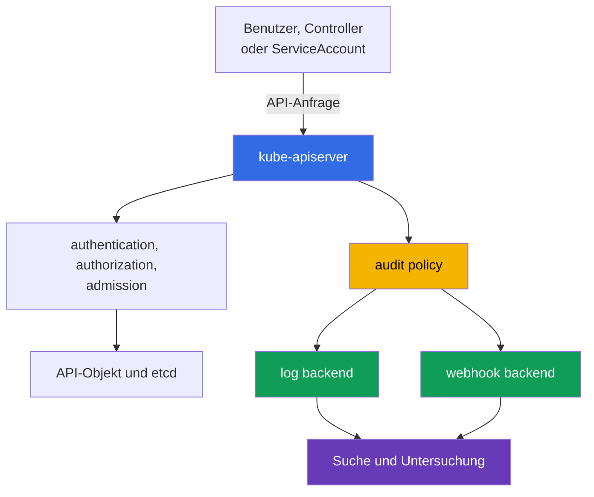

[Русская версия](ru.md) · [Eng version](README.md) · [Versión en español](es.md) · [Version française](fr.md) · [ქართული ვერსია](ge.md) · [繁體中文版](tw.md) · [日本語版](jp.md)

# Kapitel 14. Audit Logging

> **Was kommt als Nächstes.** In den Kapiteln 10-13 wurden Identitäten, Berechtigungen, `Pod`-Einschränkungen, Secrets und Netzwerksegmentierung behandelt. Selbst gute präventive Kontrollen beseitigen nicht die Notwendigkeit, Fragen danach zu beantworten, wer was wann getan hat. Audit Logging erstellt für Untersuchungen und Compliance eine Spur der Anfragen an die Kubernetes API. Dies ist ein Thema der KCSA-Domäne **Kubernetes Security Fundamentals** mit einer Gewichtung von 22%. Die Beispiele beziehen sich auf Kubernetes `v1.36`.

## 14.1 Warum Kubernetes API-Audits benötigt werden

Audit Logging zeichnet Ereignisse zu Anfragen an den `kube-apiserver` auf. Aktionen von `kubectl`, Controllern, `ServiceAccount` und anderen Clients laufen über die API: das Erstellen eines `Pod`, das Lesen eines `Secret`, das Ändern eines `RoleBinding` oder das Löschen einer `NetworkPolicy`. Daher beantwortet das Audit-Log vier grundlegende Fragen:

| Frage | Beispielhafte Ereignisdaten |
|---|---|
| Wer? | Benutzer, Gruppe oder `ServiceAccount` in `user.username` |
| Was? | Verb `verb`, Ressource und Objekt in `objectRef` |
| Wann? | Zeitstempel und Verarbeitungsphase der Anfrage |
| Was ist das Ergebnis? | Code und Grund der Antwort in `responseStatus` |



Audit erfasst Zugriffe auf die Kubernetes API, nicht alle Aktionen innerhalb eines Containers. Beispielsweise erscheinen ein Shell-Befehl in einem `Pod`, ein Systemaufruf oder eine Netzwerkverbindung möglicherweise nicht im Audit-Log. Audit ergänzt daher Anwendungslogs, Netzwerktelemetrie und Runtime Detection, ersetzt sie jedoch nicht.

Nützliche Szenarien sind: herauszufinden, wer eine gefährliche RBAC-Berechtigung erteilt hat, die Ursache für das Löschen einer Ressource zu bestimmen, ungewöhnliches Lesen eines `Secret` zu prüfen oder eine Incident-Chronologie zu erstellen. Für Compliance liefert Audit einen nachweisbaren Datensatz administrativer Aktionen, sofern das Log selbst vor Änderungen und unbefugtem Lesen geschützt ist.

## 14.2 Audit Policy: Phasen und Aufzeichnungsstufen

Eine `audit policy` bestimmt, welche Anfragen in welchen Phasen und mit welchem Datenumfang aufgezeichnet werden. Sie ist eine Konfiguration des `kube-apiserver` und kein Objekt, das üblicherweise über `kubectl` erstellt wird. Die Regeln der Policy werden der Reihe nach abgeglichen: Die erste passende Regel wird angewendet. Daher werden enge Regeln für sensible Ressourcen oberhalb einer breiten Standardregel platziert.

Eine Anfrage kann folgende Phasen durchlaufen:

| Phase | Bedeutung |
|---|---|
| `RequestReceived` | Der API Server hat die Anfrage erhalten, die Verarbeitung aber noch nicht abgeschlossen. |
| `ResponseStarted` | Das Senden der Antwort hat begonnen, insbesondere bei langlebigen `watch`-Anfragen. |
| `ResponseComplete` | Die Verarbeitung ist abgeschlossen, der endgültige Status ist bekannt. |
| `Panic` | Der API-Server-Handler wurde unerwartet beendet. |

Für die meisten Untersuchungen ist `ResponseComplete` wertvoller: Sie verknüpft die Aktion mit dem endgültigen Ergebnis. Das Aufzeichnen aller Phasen jeder kurzen Anfrage erhöht das Volumen und erzeugt häufig Duplikate. Die Policy kann unnötige Phasen über `omitStages` ausschließen.

Aufzeichnungsstufe und Phase beantworten unterschiedliche Fragen. Die Phase sagt, **wann** ein Ereignis erzeugt wird, und die Stufe sagt, **wie viele** Informationen darin enthalten sind.

| Stufe | Was gespeichert wird | Typischer Zweck und Grenze |
|---|---|---|
| `None` | nichts | für bewusst ausgeschlossene Störsignale, etwa einzelne Health-Anfragen; ein zu breiter Ausschluss erzeugt einen blinden Fleck. |
| `Metadata` | Identity, URI, Verb, Objektreferenz, Zeit und Status, aber kein Body | sichere Basisstufe für die meisten API-Aufrufe. |
| `Request` | `Metadata` und Request Body | enger Fall, in dem die Änderungsabsicht wichtig ist; der Body kann sensible Daten enthalten. |
| `RequestResponse` | `Request` und Response Body | vollständigste, aber teuerste und riskanteste Stufe; wird nur bei begründetem forensischem Bedarf eingesetzt. |

Eine besondere Falle: `RequestResponse` kann bei `Secret` ein Passwort oder Token im Log aufzeichnen. Für Zugriffe auf `Secret` wird üblicherweise `Metadata` gewählt, damit Fakt, Autor, Objekt und Ergebnis sichtbar sind, ohne den Wert offenzulegen. Ebenso kann eine hohe Stufe bei häufigen `watch`-Anfragen einen großen Datenstrom ohne angemessenen Nutzen erzeugen.

## 14.3 Nützliches Signal, Rauschen und Backends

Ein Audit-Log sollte bei Untersuchungen helfen, statt eine weitere Quelle für Lecks und Kosten zu werden. Ein nützliches Signal steht normalerweise im Zusammenhang mit einer Sicherheitsänderung oder dem Zugriff auf eine wichtige Ressource: einer Änderung von `Role`, `ClusterRoleBinding`, `ServiceAccount`, `Secret`, `NetworkPolicy` oder eines `Pod` mit erweiterten Privilegien.

Rauschen entsteht durch häufige Bereitschaftsprüfungen, gewöhnliche Controller-Anfragen und langlebige `watch`. Diese sollten nicht unbedacht über ganze API-Pfade deaktiviert werden. Ein sicherer Ansatz besteht darin, nur konkrete, bekannte Endpoints auszuschließen, eine Catch-all-Regel `Metadata` beizubehalten und das Ereignisvolumen regelmäßig zu überprüfen.

| Entscheidung | Vorteil | Zu beachten |
|---|---|---|
| `Metadata` als Standard | liefert Identity, Aktion und Ergebnis mit geringem Risiko einer Body-Offenlegung | zeigt den Inhalt des geänderten Objekts nicht |
| selektives `Request` | hilft, die Absicht einer kritischen Änderung zu verstehen | nach Ressource, Namespace und Verb begrenzen |
| `None` für bekanntes Rauschen | senkt Speicherkosten | kann bei einer zu breiten Regel eine wichtige Aktion verbergen |
| `RequestResponse` | liefert den vollständigsten Kontext | erzeugt maximales Volumen, maximale Kosten und maximales Leckrisiko |

Kubernetes unterstützt zwei grundlegende Wege zur Bereitstellung von Ereignissen:

- Das **log backend** schreibt JSON-Ereignisse in eine lokale Datei auf dem Control-Plane-Knoten. Es ist für die anfängliche Sammlung einfach, aber Knoten und Datei müssen geschützt, rotiert und an einen zentralen Speicher weitergeleitet werden.
- Das **webhook backend** übermittelt Ereignisse per HTTPS an einen externen Collector oder ein SIEM. Es vereinfacht zentrale Suche und Korrelation, erfordert jedoch TLS, einen zuverlässigen Collector, die Überwachung der Zustellung und eine Bewertung der Auswirkungen eines nicht verfügbaren Backends auf die API.

Policy und Backend haben unterschiedliche Rollen: Die Policy entscheidet, welche Ereignisse erzeugt werden, und das Backend entscheidet, wohin sie gesendet werden. Unabhängig vom gewählten Weg müssen die Leseberechtigungen für Logs eingeschränkt sein: Ein Audit-Log kann Benutzernamen, Adressen, Infrastrukturdetails und bei unvorsichtiger Policy auch Request Bodies enthalten.

## 14.4 Ereignisse lesen, Runtime Detection und Untersuchung

Bei einer Untersuchung wird ein Ereignis gewöhnlich als JSON gelesen, und es wird nach einer Kombination aus Zeit, Identity, Verb, Objekt, IP-Adresse und Status gesucht. Die unterschiedlichen Phasen einer Anfrage werden über `auditID` zusammengeführt.

Neben `user.username`, `verb`, `objectRef` und `responseStatus` kann ein Audit-Ereignis auch Felder zum Client-Kontext enthalten, die helfen, einen erwarteten automatisierten Client von einem unerwarteten zu unterscheiden:

| Ereignisfeld | Was es zeigt |
|---|---|
| `user.username` | aufrufende Identity: Benutzer, Gruppe oder `ServiceAccount` |
| `verb` | ausgeführte Aktion, beispielsweise `get`, `list`, `delete` |
| `objectRef` | betroffene Ressource, Namespace und Objektname |
| `sourceIPs` | Netzwerkadresse(n), von der die Anfrage kam |
| `userAgent` | Client-Zeichenkette, beispielsweise eine bestimmte `kubectl`-Version oder der Name eines Controllers/einer Automatisierung |
| `responseStatus` | Code und Grund der endgültigen Antwort |
| `auditID` | Kennung, die die Phasen einer Anfrage verknüpft |

`sourceIPs` und `userAgent` sind nur als **korrelierender Kontext** nützlich, nicht als Nachweis für einen bestimmten Workload. `userAgent` wird vom Client festgelegt und darf nicht als vertrauenswürdig gelten; in `sourceIPs` können Werte aus `X-Forwarded-For` / `X-Real-Ip` vom Client eingebracht werden, mit Ausnahme der tatsächlichen Remote-Adresse am Ende der Kette. Für die Attribution zu einem bestimmten `Pod` oder `CronJob` gleichen Sie das Audit Event mit authentifizierter Identity, Workload-Metadaten, vertrauenswürdiger Proxy-/Netzwerktelemetrie und anderen Logs ab.

```json
{
  "level": "Metadata",
  "auditID": "b9d0-example",
  "stage": "ResponseComplete",
  "user": {"username": "system:serviceaccount:shop:api"},
  "verb": "get",
  "objectRef": {"resource": "secrets", "namespace": "shop", "name": "payments"},
  "responseStatus": {"code": 200}
}
```

Aus diesem Ereignis folgt, dass die angegebene Identity ein bestimmtes `Secret` erfolgreich gelesen hat, doch die Stufe `Metadata` legt seinen Inhalt nicht offen. Ein Code `200` allein beweist keinen Missbrauch. Der Analyst gleicht das Ereignis mit dem erwarteten Anwendungsverhalten, dem Deployment-Zeitpunkt, RBAC, der Source IP und anderen Logs ab.

Ein Runtime Detector wie Falco beantwortet eine andere Klasse von Fragen: Was geschieht zur Laufzeit auf dem Worker-Knoten oder innerhalb eines Containers? Er kann einen gestarteten Shell-Prozess, den Zugriff auf eine unerwartete Datei oder einen verdächtigen Systemaufruf erkennen. Audit Logging zeigt dagegen API-Aktionen. Die Kombination dieser Quellen ist bei einer Untersuchung nützlich: Ein Runtime-Ereignis über einen kompromittierten Container und ein Audit-Ereignis über das anschließende Lesen eines `Secret` ergeben ein vollständigeres Bild.

Grundlegende Untersuchungsabfolge:

1. Zeit, betroffene Ressource und verdächtige Identity festhalten.
2. `ResponseComplete`-Ereignisse mit passendem `objectRef`, `verb` und `auditID` finden.
3. Prüfen, ob die Identity über RBAC die erwarteten Rechte hatte und ob die Aktivität geplant war.
4. Die Ergebnisse mit Runtime-, Netzwerk-, Cloud- und Application-Logs abgleichen.
5. Weiteres Risiko begrenzen: Token widerrufen, RBAC einschränken, Workload isolieren oder Evidence gemäß dem Incident-Response-Verfahren sichern.

## 14.5 Praktische Anwendung

Das Plattformteam definiert zunächst die Audit-Ziele: Welche Aktionen erfordern Nachweise, welche Aufbewahrungsdauer ist notwendig und wer darf Ereignisse lesen? Anschließend erstellt es eine Policy mit einer kleinen Anzahl verständlicher Regeln: Es schließt nur bekanntes, sicheres Rauschen aus, verwendet `Metadata` als Basisstufe und schützt `Secret` gesondert davor, dass Bodies aufgezeichnet werden.

In Production werden Audit-Ereignisse aus einem lokalen Puffer oder per Webhook an einen zentralen Speicher geliefert. Dort werden eingeschränkter Zugriff, Retention, Redundanz, Schutz vor Änderungen und Warnungen bei fehlenden aktuellen Ereignissen eingerichtet. Die Änderung von Audit Policy und API-Server-Konfiguration wird selbst als sensible Operation betrachtet und ebenfalls kontrolliert.

Eine regelmäßige Überprüfung des Stroms ist sinnvoll: eine sichere API-Testaktion ausführen und sicherstellen, dass im Speicher ein Ereignis mit der richtigen Identity, Ressource, Stufe und Status vorhanden ist. Das Ziel dieser Prüfung ist nicht, das maximale JSON-Volumen zu sammeln, sondern sicher zu sein, dass Evidence im Moment eines Incidents verfügbar wird.

## 14.6 Exam vocabulary / Mini-Glossar

| Begriff | Bedeutung |
|---|---|
| audit event | Aufzeichnung des `kube-apiserver` über die Verarbeitung einer Anfrage an die Kubernetes API. |
| audit policy | Geordnete Menge von Regeln, die Audit-Stufen und -Phasen auswählt. |
| `auditID` | Kennung, die Ereignisse unterschiedlicher Phasen einer Anfrage verbindet. |
| stage | Zeitpunkt der Anfrageverarbeitung: `RequestReceived`, `ResponseStarted`, `ResponseComplete` oder `Panic`. |
| level | Datenumfang im Ereignis: `None`, `Metadata`, `Request` oder `RequestResponse`. |
| log backend | Backend, das Audit-Ereignisse in eine lokale Datei schreibt. |
| webhook backend | Backend, das Audit-Ereignisse per HTTPS an einen Collector oder ein SIEM sendet. |
| runtime detection | Erkennung verdächtiger Aktivität zur Laufzeit auf einem Knoten oder in einem Container. |

## 14.7 Exam Essentials / Zusammenfassung des Kapitels

- Audit Logging zeichnet Anfragen an die Kubernetes API auf und hilft festzustellen, wer was wann getan hat und welches Ergebnis vorlag.
- Audit ersetzt Runtime-, Netzwerk- und Application-Logs nicht, weil es nicht alle Aktionen innerhalb eines `Pod` und auf dem Worker-Knoten sieht.
- Die Phase legt den Zeitpunkt der Aufzeichnung fest, die Stufe den Datenumfang. Für Untersuchungen ist gewöhnlich `ResponseComplete` wichtig.
- `Metadata` eignet sich als sicherer Standard. `Request` und insbesondere `RequestResponse` werden wegen des Volumens und des Risikos, sensible Daten aufzuzeichnen, gezielt eingesetzt.
- Für `Secret` wird gewöhnlich `Metadata` gewählt, nicht eine Stufe mit Body.
- `log backend` und `webhook backend` lösen die Bereitstellungsaufgabe. Beide erfordern Schutz von Zugriff, Speicherung, Überwachung und Retention.
- Eine nützliche Untersuchung gleicht Audit-Ereignisse mit RBAC, Runtime Detection und anderer Telemetrie ab.

## 14.8 Nicht verwechseln und wie es in der Prüfung vorkommt

In KCSA-Fragen werden häufig die Grenzen des Mechanismus geprüft, nicht exakte API-Server-Flags. Unterscheiden Sie Stufe und Phase: `Metadata` enthält keinen Body, `Request` enthält den Request Body, und `RequestResponse` enthält Request und Response Body. Wird ein `Secret` erwähnt, erzeugt die Wahl einer Stufe mit Body gewöhnlich ein Leckrisiko.

Eine weitere häufige Formulierung fragt, welche Quelle eine Änderung einer Kubernetes-Ressource erklärt. Die richtige Antwort ist API Server Audit Logging. Für eine Shell in einem Container oder einen Systemaufruf wird ein Runtime Detector benötigt, nicht Audit. Wenn die Frage eine ungewöhnliche API-Aktion enthält, suchen Sie nach Identity, `verb`, `objectRef`, Zeit und `responseStatus`.

## 14.9 Fragen zur Selbstkontrolle

### 1. Welche Fähigkeit von Audit Logging hilft am direktesten festzustellen, wer ein `Deployment` gelöscht hat?

   - a. Eine Audit Policy, die automatisch alle `delete`-Operationen für alle API-Clients des Clusters verbietet.

   - b. Ein Audit Event mit Identity, `verb`, `objectRef` und Verarbeitungsergebnis einer konkreten API-Anfrage.

   - c. Eine Runtime Metric mit CPU und Memory des gelöschten `Pod`, die nach Abschluss der Anfrage erfasst wurde.

   - d. Image Metadata mit Digest und Build-Zeit des Containers des gelöschten Workload.

<details>
<summary>Antwort und Erläuterung</summary>

**Richtige Antwort: b.** Ein Audit-Ereignis des API Server verknüpft die Identity mit Aktion und Objekt und zeigt außerdem das Verarbeitungsergebnis. Es zeichnet Evidence auf, blockiert die Aktion aber nicht selbst.

</details>

### 2. Welche Audit-Stufe zeichnet Metadaten der Anfrage und Antwort ohne Body auf?

   - a. `Request`.

   - b. `RequestResponse`.

   - c. `None`.

   - d. `Metadata`.

<details>
<summary>Antwort und Erläuterung</summary>

**Richtige Antwort: d.** `Metadata` enthält Angaben zu Identity, Aktion, Objekt, Zeit und Status ohne Request und Response Bodies. `Request` fügt den Request Body hinzu, und `RequestResponse` fügt beide Bodies hinzu.

</details>

### 3. Warum wird für Zugriffe auf `Secret` üblicherweise nicht `RequestResponse` gewählt?

   - a. Diese Stufe kann Request und Response Bodies aufzeichnen, die bei Secret sensible Werte enthalten können.

   - b. Diese Stufe speichert nur die Event Metadata und kann daher überhaupt keinen Request oder Response Body aufzeichnen.

   - c. Diese Stufe deaktiviert authentication für Anfragen an Secret, bevor das Ereignis die Audit Pipeline erreicht.

   - d. Diese Stufe verbietet dem API Server, dem Client ein Secret-Objekt zurückzugeben, selbst wenn Kubernetes authorization das Lesen erlaubt hat.

<details>
<summary>Antwort und Erläuterung</summary>

**Richtige Antwort: a.** `RequestResponse` kann Request und Response Bodies speichern. Bei Secret entsteht dadurch das Risiko, dass sensible Werte in Audit Storage gelangen. Gewöhnlich ist es sicherer, ausreichenden Audit Context ohne Inhalt des Secret zu speichern, beispielsweise über `Metadata`, wenn die forensic requirements nicht mehr verlangen.

</details>

### 4. Welche Quelle erkennt am besten den Start einer interaktiven Shell in einem bereits laufenden Container, wenn diese Aktion keine Kubernetes API ausgelöst hat?

   - a. API Server Audit Logging.

   - b. `NetworkPolicy`.

   - c. Ein Runtime Detector, beispielsweise Falco.

   - d. `RoleBinding`.

<details>
<summary>Antwort und Erläuterung</summary>

**Richtige Antwort: c.** Audit sieht API-Anfragen. Ein Runtime Detector beobachtet Aktivitäten zur Laufzeit, beispielsweise Container-Prozesse und Systemaufrufe.

</details>

> **Wohin als Nächstes.** Für die praktische Konfiguration von Audit Policy, Backend, Rotation, Webhook und Ereignisprüfung lesen Sie Kapitel 32 von CKS über Kubernetes-Audit-Logs.

[Inhaltsverzeichnis](../README_DE.md) · [Kapitel 13](../13/de.md) · [Kapitel 15](../15/de.md)
