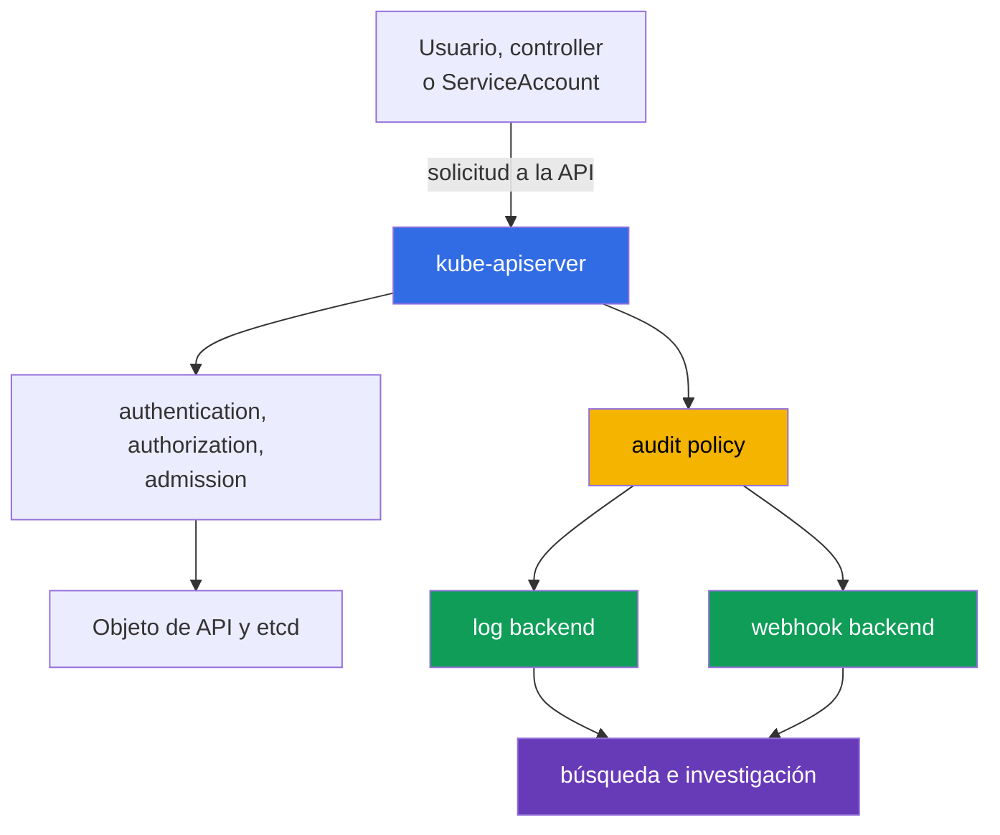

[Русская версия](ru.md) · [Eng version](README.md) · [Version française](fr.md) · [Deutsche Version](de.md) · [ქართული ვერსია](ge.md) · [繁體中文版](tw.md) · [日本語版](jp.md)

# Capítulo 14. Registro de auditoría

> **Lo que sigue.** Los capítulos 10-13 trataron las identidades, los permisos, las restricciones de `Pod`, los secretos y la segmentación de red. Incluso buenos controles preventivos no eliminan la necesidad de responder quién hizo qué y cuándo. El registro de auditoría crea un rastro de solicitudes a la API de Kubernetes para investigaciones y cumplimiento. Es un tema del dominio KCSA **Kubernetes Security Fundamentals** con un peso del 22%. Los ejemplos se refieren a Kubernetes `v1.36`.

## 14.1 Por qué se necesita la auditoría de la API de Kubernetes

El registro de auditoría registra eventos sobre solicitudes a `kube-apiserver`. Las acciones de `kubectl`, controladores, `ServiceAccount` y otros clientes pasan por la API: crear un `Pod`, leer un `Secret`, modificar un `RoleBinding` o eliminar una `NetworkPolicy`. Por ello, el registro de auditoría responde cuatro preguntas básicas:

| Pregunta | Datos de evento de ejemplo |
|---|---|
| ¿Quién? | usuario, grupo o `ServiceAccount` en `user.username` |
| ¿Qué? | verbo `verb`, recurso y objeto en `objectRef` |
| ¿Cuándo? | marca temporal y etapa de procesamiento de la solicitud |
| ¿Cuál fue el resultado? | código y razón de la respuesta en `responseStatus` |



La auditoría registra el acceso a la API de Kubernetes, no todas las acciones dentro de un contenedor. Por ejemplo, un comando de shell en un `Pod`, una llamada al sistema o una conexión de red pueden no aparecer en el registro de auditoría. Por tanto, la auditoría complementa, pero no reemplaza, los registros de aplicaciones, la telemetría de red y la detección en runtime.

Escenarios útiles: averiguar quién concedió un permiso RBAC peligroso, determinar el origen de la eliminación de un recurso, comprobar una lectura inusual de un `Secret` o construir una cronología de un incidente. Para el cumplimiento, la auditoría proporciona un registro verificable de las acciones administrativas si el propio registro está protegido contra modificaciones y lecturas no autorizadas.

## 14.2 Audit policy: etapas y niveles de registro

La `audit policy` determina qué solicitudes registrar, en qué etapas y con qué cantidad de datos. Es una configuración de `kube-apiserver`, no un objeto que se cree habitualmente con `kubectl`. Las reglas de la policy se comparan secuencialmente: se aplica la primera regla coincidente. Por tanto, las reglas específicas para recursos sensibles se colocan antes de la regla predeterminada amplia.

Una solicitud puede pasar por las siguientes etapas:

| Etapa | Significado |
|---|---|
| `RequestReceived` | El API Server recibió la solicitud, pero aún no terminó de procesarla. |
| `ResponseStarted` | Comenzó el envío de la respuesta, en particular para solicitudes `watch` de larga duración. |
| `ResponseComplete` | El procesamiento finalizó y se conoce el estado final. |
| `Panic` | El controlador del API Server terminó de forma anómala. |

Para la mayoría de las investigaciones, `ResponseComplete` es más valioso: vincula la acción con el resultado final. Registrar todas las etapas de cada solicitud corta aumenta el volumen y suele crear duplicación. La policy puede excluir etapas innecesarias mediante `omitStages`.

El nivel de registro y la etapa responden a preguntas distintas. La etapa indica **cuándo** crear un evento, y el nivel indica **cuánta** información incluir en él.

| Nivel | Qué se guarda | Uso típico y límite |
|---|---|---|
| `None` | nada | para ruido excluido de forma deliberada, por ejemplo determinadas solicitudes de health; una exclusión demasiado amplia crea una zona ciega. |
| `Metadata` | identity, URI, verbo, referencia al objeto, hora y estado, pero sin body | nivel base seguro para la mayoría de llamadas a la API. |
| `Request` | `Metadata` y el cuerpo de la solicitud | caso específico en el que importa el intent de un cambio; el body puede contener datos sensibles. |
| `RequestResponse` | `Request` y el cuerpo de la respuesta | el nivel más completo, pero también el más costoso y riesgoso; se aplica solo ante una necesidad forense justificada. |

Una trampa especial: `RequestResponse` para un `Secret` puede registrar una contraseña o un token en el registro. Para los accesos a `Secret` se suele elegir `Metadata`, para ver el hecho, el autor, el objeto y el resultado sin revelar el valor. Del mismo modo, un nivel alto para `watch` frecuentes puede generar un gran flujo de datos sin un beneficio proporcional.

## 14.3 Señal útil, ruido y backends

El registro de auditoría debe ayudar a la investigación, no convertirse en otra fuente de filtraciones y costes. La señal útil suele estar asociada a un cambio de seguridad o al acceso a un recurso importante: modificar un `Role`, un `ClusterRoleBinding`, un `ServiceAccount`, un `Secret`, una `NetworkPolicy` o un `Pod` con privilegios elevados.

El ruido lo crean las comprobaciones de disponibilidad frecuentes, las solicitudes normales de controladores y los `watch` prolongados. No se deben desactivar sin criterio rutas completas de la API. Un enfoque más seguro es excluir solo endpoints concretos y conocidos, conservar una regla catch-all `Metadata` y revisar periódicamente el volumen de eventos.

| Decisión | Ventaja | Qué considerar |
|---|---|---|
| `Metadata` como predeterminado | proporciona identity, acción y outcome con poco riesgo de revelar el body | no muestra el contenido del objeto modificado |
| `Request` selectivo | ayuda a entender el intent de un cambio crítico | limitar por recurso, namespace y verbo |
| `None` para ruido conocido | reduce el coste de almacenamiento | puede ocultar una acción importante con una regla demasiado amplia |
| `RequestResponse` | proporciona el contexto más completo | crea el máximo volumen, coste y riesgo de filtración |

Kubernetes admite dos destinos principales para la entrega de eventos:

- El **log backend** escribe eventos JSON en un archivo local del nodo de control plane. Es sencillo para la recopilación inicial, pero el nodo y el archivo deben protegerse, rotarse y enviarse a almacenamiento centralizado.
- El **webhook backend** transmite eventos por HTTPS a un collector externo o a un SIEM. Simplifica la búsqueda y correlación centralizadas, pero requiere TLS, fiabilidad del collector, supervisión de la entrega y evaluar el impacto de que el backend no esté disponible sobre la API.

La policy y el backend tienen roles distintos: la policy decide qué eventos generar y el backend decide dónde enviarlos. Independientemente de la ruta elegida, los permisos de lectura de registros deben restringirse: un registro de auditoría puede contener nombres de usuarios, direcciones, detalles de infraestructura y, con una policy descuidada, cuerpos de solicitudes.

## 14.4 Lectura de eventos, detección en runtime e investigación

Durante una investigación, un evento se suele leer como JSON y se busca la combinación de hora, identity, verbo, objeto, dirección IP y estado. Las diferentes etapas de una solicitud se agrupan mediante `auditID`.

Además de `user.username`, `verb`, `objectRef` y `responseStatus`, un evento de auditoría también puede contener campos de contexto del cliente que ayudan a diferenciar un cliente automatizado esperado de uno inesperado:

| Campo del evento | Qué muestra |
|---|---|
| `user.username` | identity que realiza la llamada: usuario, grupo o `ServiceAccount` |
| `verb` | acción realizada, por ejemplo `get`, `list`, `delete` |
| `objectRef` | recurso afectado, namespace y nombre del objeto |
| `sourceIPs` | dirección o direcciones de red desde las que llegó la solicitud |
| `userAgent` | cadena del cliente, por ejemplo una versión concreta de `kubectl` o el nombre de un controller/automatización |
| `responseStatus` | código y razón de la respuesta final |
| `auditID` | identificador que agrupa las etapas de una solicitud |

`sourceIPs` y `userAgent` son útiles solo como **contexto de correlación**, no como prueba de un workload concreto. `userAgent` lo establece el cliente y no debe considerarse confiable; en `sourceIPs`, los valores de `X-Forwarded-For` / `X-Real-Ip` pueden ser inyectados por el cliente, excepto la remote address real al final de la cadena. Para atribuir a un `Pod` o `CronJob` concreto, correlacione el evento de auditoría con la identity autenticada, los metadatos del workload, la telemetría confiable de proxy/red y otros registros.

```json
{
  "level": "Metadata",
  "auditID": "b9d0-example",
  "stage": "ResponseComplete",
  "user": {"username": "system:serviceaccount:shop:api"},
  "verb": "get",
  "objectRef": {"resource": "secrets", "namespace": "shop", "name": "payments"},
  "responseStatus": {"code": 200}
}
```

De este evento se deduce que la identity indicada leyó correctamente un `Secret` concreto, pero el nivel `Metadata` no revela su contenido. Por sí solo, el código `200` no demuestra un abuso. El analista correlaciona el evento con el comportamiento esperado de la aplicación, el momento del despliegue, RBAC, la IP de origen y otros registros.

Un detector en runtime, como Falco, responde a otra clase de preguntas: qué sucede en el nodo de trabajo o dentro de un contenedor durante la ejecución. Puede detectar el inicio de una shell, el acceso a un archivo inesperado o una llamada al sistema sospechosa. El registro de auditoría, a su vez, muestra acciones de la API. Combinar estas fuentes es útil en una investigación: un evento de runtime sobre un contenedor comprometido y un evento de auditoría sobre la posterior lectura de un `Secret` ofrecen una imagen más completa.

Secuencia básica de una investigación:

1. Registrar la hora, el recurso afectado y la identity sospechosa.
2. Buscar eventos `ResponseComplete` con `objectRef`, `verb` y `auditID` adecuados.
3. Comprobar si la identity tenía los permisos esperados mediante RBAC y si la actividad estaba planificada.
4. Correlacionar el resultado con registros de runtime, red, cloud y aplicación.
5. Limitar el riesgo adicional: revocar el token, restringir RBAC, aislar el workload o preservar evidence conforme al procedimiento de respuesta.

## 14.5 Cómo se aplica en la práctica

El equipo de plataforma primero define los objetivos de auditoría: qué acciones requieren evidencia, qué período de retención se necesita y quién tiene derecho a leer los eventos. Luego crea una policy con un número reducido de reglas comprensibles: excluye solo el ruido seguro conocido, utiliza `Metadata` como nivel base y protege por separado el `Secret` de registrar body.

En producción, los eventos de auditoría se entregan desde un búfer local o un webhook a un almacenamiento centralizado. Allí se establecen acceso restringido, retention, copias de seguridad, protección contra modificaciones y alertas por ausencia de eventos recientes. El cambio de la audit policy y de la configuración del API Server se considera en sí mismo una operación sensible y también se controla.

Resulta útil revisar regularmente el flujo: ejecutar una acción de API de prueba segura y confirmar que existe un evento en el almacenamiento con la identity, el recurso, el nivel y el estado correctos. El objetivo de esta comprobación no es recopilar el máximo volumen de JSON, sino tener la certeza de que la evidencia aparecerá en el momento de un incidente.

## 14.6 Exam vocabulary / Miniglosario

| Término | Significado |
|---|---|
| audit event | Registro de `kube-apiserver` sobre el procesamiento de una solicitud a la API de Kubernetes. |
| audit policy | Conjunto ordenado de reglas que seleccionan los niveles y etapas de auditoría. |
| `auditID` | Identificador que vincula eventos de distintas etapas de una misma solicitud. |
| stage | Momento de procesamiento de la solicitud: `RequestReceived`, `ResponseStarted`, `ResponseComplete` o `Panic`. |
| level | Cantidad de datos en el evento: `None`, `Metadata`, `Request` o `RequestResponse`. |
| log backend | Backend que escribe eventos de auditoría en un archivo local. |
| webhook backend | Backend que envía eventos de auditoría a un collector o SIEM por HTTPS. |
| runtime detection | Detección de actividad sospechosa durante la ejecución en un nodo o contenedor. |

## 14.7 Exam Essentials / Resumen del capítulo

- El registro de auditoría registra solicitudes a la API de Kubernetes y ayuda a establecer quién hizo qué, cuándo y cuál fue el resultado.
- La auditoría no reemplaza los registros de runtime, red y aplicación, porque no ve todas las acciones dentro de un `Pod` y en el nodo de trabajo.
- La etapa determina el momento del registro y el nivel determina la cantidad de datos. Para la investigación, normalmente importa `ResponseComplete`.
- `Metadata` es adecuado como predeterminado seguro. `Request` y, especialmente, `RequestResponse` se aplican de forma limitada por el volumen y el riesgo de registrar datos sensibles.
- Para `Secret` se suele elegir `Metadata`, no un nivel con body.
- `log backend` y `webhook backend` resuelven la entrega. Ambos requieren protección del acceso, almacenamiento, supervisión y retention.
- Una investigación útil correlaciona los eventos de auditoría con RBAC, la detección en runtime y otra telemetría.

## 14.8 No confundir y cómo aparece en el examen

En las preguntas de KCSA a menudo se comprueban los límites del mecanismo, no los flags exactos del API Server. Distinga nivel y etapa: `Metadata` no contiene body, `Request` contiene el request body y `RequestResponse` contiene request y response body. Si se menciona un `Secret`, elegir un nivel con body normalmente crea un riesgo de filtración.

Otra formulación frecuente pregunta qué fuente explicará un cambio en un recurso de Kubernetes. La respuesta correcta es el registro de auditoría del API Server. Para una shell dentro de un contenedor o una llamada al sistema se necesita un detector en runtime, no auditoría. Si la pregunta trata de una acción inusual de la API, busque la identity, `verb`, `objectRef`, la hora y `responseStatus`.

## 14.9 Preguntas de autoevaluación

### 1. ¿Qué capacidad del registro de auditoría ayuda más directamente a establecer quién eliminó un `Deployment`?

   - a. Una audit policy que prohíbe automáticamente todas las operaciones `delete` para todos los clientes de la API del clúster.

   - b. Un audit event con la identity, `verb`, `objectRef` y el resultado del procesamiento de una solicitud concreta a la API.

   - c. Una métrica de runtime con la CPU y memory del `Pod` eliminado, recopilada después de completar la solicitud.

   - d. Metadatos de image con el digest y la hora de compilación del contenedor del workload eliminado.

<details>
<summary>Respuesta y explicación</summary>

**Respuesta correcta: b.** Un evento de auditoría del API Server vincula una identity con una acción y un objeto, y también muestra el resultado del procesamiento. Registra evidence, pero no bloquea la acción por sí mismo.

</details>

### 2. ¿Qué nivel de auditoría registra los metadatos de la solicitud y la respuesta sin body?

   - a. `Request`.

   - b. `RequestResponse`.

   - c. `None`.

   - d. `Metadata`.

<details>
<summary>Respuesta y explicación</summary>

**Respuesta correcta: d.** `Metadata` contiene información sobre la identity, la acción, el objeto, la hora y el estado sin cuerpos de solicitud ni respuesta. `Request` añade el request body y `RequestResponse` añade ambos body.

</details>

### 3. ¿Por qué normalmente no se elige `RequestResponse` para accesos a un `Secret`?

   - a. Este nivel puede registrar request y response bodies, en los que un Secret puede contener valores sensibles.

   - b. Este nivel solo guarda los metadatos del evento y por tanto no puede registrar ningún request o response body.

   - c. Este nivel desactiva la authentication para solicitudes a Secret antes de que el evento entre en el pipeline de auditoría.

   - d. Este nivel impide que el API Server devuelva el objeto Secret al cliente, incluso si Kubernetes authorization permitió la lectura.

<details>
<summary>Respuesta y explicación</summary>

**Respuesta correcta: a.** `RequestResponse` puede guardar cuerpos de solicitudes y respuestas. Para un Secret, esto crea el riesgo de que valores sensibles lleguen al almacenamiento de auditoría. Normalmente es más seguro conservar suficiente contexto de auditoría sin el contenido del Secret, por ejemplo mediante `Metadata`, si los requisitos forenses no exigen más.

</details>

### 4. ¿Qué fuente detectaría mejor el inicio de una shell interactiva dentro de un contenedor que ya se está ejecutando, si esta acción no llamó a la API de Kubernetes?

   - a. Registro de auditoría del API Server.

   - b. `NetworkPolicy`.

   - c. Un detector en runtime, por ejemplo Falco.

   - d. `RoleBinding`.

<details>
<summary>Respuesta y explicación</summary>

**Respuesta correcta: c.** La auditoría ve solicitudes a la API. Un detector en runtime observa actividad durante la ejecución, por ejemplo procesos y llamadas al sistema del contenedor.

</details>

> **A dónde seguir.** Para la configuración práctica de audit policy, backend, rotación, webhook y verificación de eventos, estudie el capítulo 32 de CKS sobre registros de auditoría de Kubernetes.

[Índice](../README_ES.md) · [Capítulo 13](../13/es.md) · [Capítulo 15](../15/es.md)
