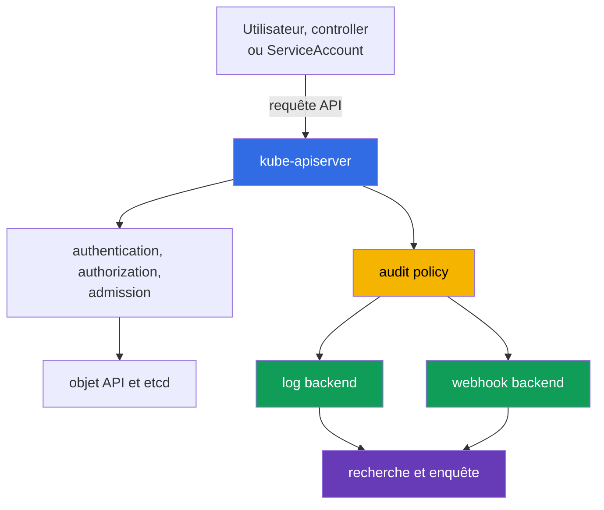

[Русская версия](ru.md) · [Eng version](README.md) · [Versión en español](es.md) · [Deutsche Version](de.md) · [ქართული ვერსია](ge.md) · [繁體中文版](tw.md) · [日本語版](jp.md)

# Chapitre 14. Audit Logging

> **À suivre.** Les chapitres 10-13 ont traité des identités, des droits, des contraintes sur les `Pod`, des secrets et de la segmentation réseau. Même de bons contrôles préventifs n'éliminent pas la nécessité de répondre aux questions « qui a fait quoi et quand ». L'audit logging crée une trace des requêtes à l'API Kubernetes pour les enquêtes et la conformité. C'est un sujet du domaine KCSA **Kubernetes Security Fundamentals**, dont le poids est de 22 %. Les exemples concernent Kubernetes `v1.36`.

## 14.1 Pourquoi auditer l'API Kubernetes

L'audit logging enregistre les événements relatifs aux requêtes vers `kube-apiserver`. Les actions de `kubectl`, des contrôleurs, des `ServiceAccount` et d'autres clients transitent par l'API : création d'un `Pod`, lecture d'un `Secret`, modification d'un `RoleBinding` ou suppression d'une `NetworkPolicy`. Le journal d'audit répond donc à quatre questions fondamentales :

| Question | Exemple de données d'événement |
|---|---|
| Qui ? | utilisateur, groupe ou `ServiceAccount` dans `user.username` |
| Quoi ? | le verbe `verb`, la ressource et l'objet dans `objectRef` |
| Quand ? | l'horodatage et l'étape de traitement de la requête |
| Quel résultat ? | le code et la raison de la réponse dans `responseStatus` |



L'audit consigne les accès à l'API Kubernetes, et non toutes les actions à l'intérieur d'un conteneur. Par exemple, une commande shell dans un `Pod`, un appel système ou une connexion réseau peuvent ne pas apparaître dans le journal d'audit. L'audit complète donc, sans les remplacer, les journaux applicatifs, la télémétrie réseau et la détection runtime.

Les scénarios utiles consistent à déterminer qui a accordé une permission RBAC dangereuse, à identifier la source d'une suppression de ressource, à vérifier une lecture inhabituelle d'un `Secret` ou à établir la chronologie d'un incident. Pour la conformité, l'audit fournit une trace vérifiable des actions administratives, à condition que le journal soit lui-même protégé contre les modifications et les lectures non autorisées.

## 14.2 Audit policy : étapes et niveaux d'enregistrement

L'`audit policy` définit quelles requêtes enregistrer, à quelles étapes et avec quel volume de données. Il s'agit d'une configuration de `kube-apiserver`, et non d'un objet habituellement créé avec `kubectl`. Les règles de policy sont évaluées dans l'ordre : la première règle correspondante est appliquée. Les règles étroites pour les ressources sensibles doivent donc être placées au-dessus de la règle générale par défaut.

Une requête peut passer par les étapes suivantes :

| Étape | Signification |
|---|---|
| `RequestReceived` | L'API Server a reçu la requête, mais son traitement n'est pas encore terminé. |
| `ResponseStarted` | L'envoi de la réponse a commencé, notamment pour les requêtes `watch` de longue durée. |
| `ResponseComplete` | Le traitement est terminé et le statut final est connu. |
| `Panic` | Le gestionnaire de l'API Server s'est terminé de manière anormale. |

Pour la plupart des enquêtes, `ResponseComplete` est la plus utile : elle associe l'action à son résultat final. Enregistrer toutes les étapes de chaque requête courte augmente le volume et crée souvent des doublons. Une policy peut exclure les étapes inutiles avec `omitStages`.

Le niveau d'enregistrement et l'étape répondent à des questions différentes. L'étape indique **quand** créer un événement, tandis que le niveau indique **combien** d'informations y inclure.

| Niveau | Ce qui est conservé | Usage et limite typiques |
|---|---|---|
| `None` | rien | pour le bruit délibérément exclu, par exemple certaines requêtes de santé ; une exclusion trop large crée un angle mort. |
| `Metadata` | identity, URI, verbe, référence d'objet, heure et statut, mais sans body | niveau de base sûr pour la majorité des appels d'API. |
| `Request` | `Metadata` et le corps de la requête | cas ciblé où l'intention de modification est importante ; le body peut contenir des données sensibles. |
| `RequestResponse` | `Request` et le corps de la réponse | niveau le plus complet, mais aussi le plus coûteux et risqué ; à utiliser uniquement en cas de besoin forensic justifié. |

Un piège particulier : `RequestResponse` pour un `Secret` peut inscrire un mot de passe ou un jeton dans le journal. Pour les accès à un `Secret`, on choisit généralement `Metadata` afin de voir le fait, l'auteur, l'objet et le résultat sans révéler la valeur. De même, un niveau élevé pour des `watch` fréquents peut produire un important flux de données sans bénéfice proportionné.

## 14.3 Signal utile, bruit et backends

Le journal d'audit doit aider l'enquête, sans devenir une nouvelle source de fuites et de coûts. Un signal utile est généralement lié à une modification de sécurité ou à l'accès à une ressource importante : modification d'un `Role`, d'un `ClusterRoleBinding`, d'un `ServiceAccount`, d'un `Secret`, d'une `NetworkPolicy` ou d'un `Pod` avec des privilèges élevés.

Le bruit provient des fréquentes vérifications de disponibilité, des requêtes ordinaires des contrôleurs et des `watch` de longue durée. Il ne faut pas les désactiver sans discernement pour des chemins d'API entiers. Une approche plus sûre consiste à exclure uniquement des endpoints précis et compris, à conserver une règle catch-all `Metadata` et à revoir périodiquement le volume d'événements.

| Décision | Avantage | À prendre en compte |
|---|---|---|
| `Metadata` par défaut | fournit identity, action et outcome avec un faible risque d'exposition du body | ne montre pas le contenu de l'objet modifié |
| `Request` sélectif | aide à comprendre l'intention d'une modification critique | limiter par ressource, namespace et verbe |
| `None` pour un bruit connu | réduit le coût de stockage | peut masquer une action importante si la règle est trop large |
| `RequestResponse` | fournit le contexte le plus complet | entraîne le volume, le coût et le risque de fuite maximums |

Kubernetes prend en charge deux principales voies de livraison des événements :

- Le **log backend** écrit les événements JSON dans un fichier local sur le nœud control plane. Il est simple pour une collecte initiale, mais le nœud et le fichier doivent être protégés, soumis à rotation et envoyés vers un stockage centralisé.
- Le **webhook backend** transmet les événements via HTTPS à un collector externe ou à un SIEM. Il facilite la recherche et la corrélation centralisées, mais exige TLS, la fiabilité du collector, la surveillance de la livraison et l'évaluation de l'impact de l'indisponibilité du backend sur l'API.

La policy et le backend ont des rôles différents : la policy décide quels événements produire, tandis que le backend décide où les envoyer. Indépendamment de la voie choisie, les droits de lecture des journaux doivent être limités : un journal d'audit peut contenir des noms d'utilisateurs, des adresses, des détails d'infrastructure et, avec une policy imprudente, des corps de requêtes.

## 14.4 Lecture des événements, détection runtime et enquête

Lors d'une enquête, un événement est généralement lu sous forme de JSON, en recherchant une combinaison de l'heure, de l'identity, du verbe, de l'objet, de l'adresse IP et du statut. Pour une seule requête, les différentes étapes sont regroupées à l'aide de `auditID`.

En plus de `user.username`, `verb`, `objectRef` et `responseStatus`, un événement d'audit peut aussi contenir des champs de contexte client qui aident à distinguer un client automatisé attendu d'un client inattendu :

| Champ de l'événement | Ce qu'il montre |
|---|---|
| `user.username` | l'identity appelante : utilisateur, groupe ou `ServiceAccount` |
| `verb` | l'action effectuée, par exemple `get`, `list`, `delete` |
| `objectRef` | la ressource concernée, le namespace et le nom de l'objet |
| `sourceIPs` | la ou les adresses réseau d'où vient la requête |
| `userAgent` | la chaîne du client, par exemple une version spécifique de `kubectl` ou le nom d'un controller ou d'une automatisation |
| `responseStatus` | le code et la raison de la réponse finale |
| `auditID` | l'identifiant qui relie les étapes d'une même requête |

`sourceIPs` et `userAgent` ne sont utiles que comme **contexte de corrélation**, et non comme preuve d'un workload précis. `userAgent` est défini par le client et ne doit pas être considéré comme fiable ; dans `sourceIPs`, des valeurs de `X-Forwarded-For` / `X-Real-Ip` peuvent être injectées par le client, à l'exception de la remote address réelle située à la fin de la chaîne. Pour attribuer une action à un `Pod` ou à un `CronJob` spécifique, corrélez l'audit event avec l'identity authentifiée, les métadonnées du workload, la télémétrie fiable du proxy et du réseau, et d'autres journaux.

```json
{
  "level": "Metadata",
  "auditID": "b9d0-example",
  "stage": "ResponseComplete",
  "user": {"username": "system:serviceaccount:shop:api"},
  "verb": "get",
  "objectRef": {"resource": "secrets", "namespace": "shop", "name": "payments"},
  "responseStatus": {"code": 200}
}
```

Cet événement indique que l'identity mentionnée a lu avec succès le `Secret` concerné, mais le niveau `Metadata` n'en révèle pas le contenu. À lui seul, un code `200` ne prouve pas un abus. L'analyste corrèle l'événement avec le comportement attendu de l'application, l'heure du déploiement, RBAC, la source IP et d'autres journaux.

Un détecteur runtime, par exemple Falco, répond à une autre catégorie de questions : que se passe-t-il sur le nœud de travail ou à l'intérieur du conteneur pendant l'exécution ? Il peut détecter le lancement d'un shell, l'accès à un fichier inattendu ou un appel système suspect. L'audit logging, quant à lui, montre les actions d'API. Associer ces sources est utile lors d'une enquête : un événement runtime concernant un conteneur compromis et un événement d'audit sur une lecture ultérieure de `Secret` donnent une image plus complète.

Séquence de base d'une enquête :

1. Noter l'heure, la ressource concernée et l'identity suspecte.
2. Rechercher les événements `ResponseComplete` avec les `objectRef`, `verb` et `auditID` correspondants.
3. Vérifier si l'identity disposait des droits attendus via RBAC et si l'activité était planifiée.
4. Corréler la conclusion avec les journaux runtime, réseau, cloud et applicatifs.
5. Limiter le risque supplémentaire : révoquer le jeton, restreindre RBAC, isoler le workload ou conserver les éléments de preuve conformément à la procédure de réponse.

## 14.5 Application pratique

L'équipe de plateforme définit d'abord les objectifs d'audit : quelles actions nécessitent des preuves, quelle durée de conservation est requise et qui est autorisé à lire les événements. Elle crée ensuite une policy comportant un petit nombre de règles compréhensibles : elle exclut uniquement le bruit sûr connu, utilise `Metadata` comme niveau de base et protège séparément les `Secret` contre l'enregistrement du body.

En production, les événements d'audit sont livrés depuis un tampon local ou un webhook vers un stockage centralisé. On y définit un accès limité, la retention, la sauvegarde, la protection contre les modifications et des alertes en cas d'absence d'événements récents. La modification de l'audit policy et de la configuration de l'API Server est elle-même considérée comme une opération sensible et également contrôlée.

Il est utile de vérifier régulièrement le flux : effectuer une action d'API de test sûre et confirmer que le stockage contient un événement avec l'identity, la ressource, le niveau et le statut corrects. L'objectif de cette vérification n'est pas de collecter le volume maximal de JSON, mais de s'assurer que des preuves apparaîtront au moment d'un incident.

## 14.6 Exam vocabulary / Mini-glossaire

| Terme | Signification |
|---|---|
| audit event | Enregistrement de `kube-apiserver` sur le traitement d'une requête vers l'API Kubernetes. |
| audit policy | Ensemble ordonné de règles sélectionnant les niveaux et les étapes d'audit. |
| `auditID` | Identifiant reliant les événements de différentes étapes d'une même requête. |
| stage | Moment du traitement d'une requête : `RequestReceived`, `ResponseStarted`, `ResponseComplete` ou `Panic`. |
| level | Volume de données dans l'événement : `None`, `Metadata`, `Request` ou `RequestResponse`. |
| log backend | Backend qui écrit les événements d'audit dans un fichier local. |
| webhook backend | Backend qui envoie les événements d'audit à un collector HTTPS ou à un SIEM. |
| runtime detection | Détection d'activité suspecte lors de l'exécution sur un nœud ou dans un conteneur. |

## 14.7 Exam Essentials / Points essentiels du chapitre

- L'audit logging consigne les requêtes vers l'API Kubernetes et aide à déterminer qui a fait quoi, quand, et quel en a été le résultat.
- L'audit ne remplace pas les journaux runtime, réseau et applicatifs, car il ne voit pas toutes les actions dans un `Pod` ni sur le nœud de travail.
- L'étape définit le moment de l'enregistrement, tandis que le niveau définit le volume de données. Pour une enquête, `ResponseComplete` est généralement important.
- `Metadata` convient comme valeur par défaut sûre. `Request` et surtout `RequestResponse` sont utilisés de façon ciblée en raison du volume et du risque d'enregistrer des données sensibles.
- Pour un `Secret`, on choisit généralement `Metadata`, plutôt qu'un niveau incluant le body.
- Le `log backend` et le `webhook backend` résolvent la livraison. Tous deux exigent une protection de l'accès, du stockage, de la surveillance et de la retention.
- Une enquête utile corrèle les événements d'audit avec RBAC, la détection runtime et d'autres sources de télémétrie.

## 14.8 À ne pas confondre et présence à l'examen

Dans les questions KCSA, on vérifie souvent les limites du mécanisme, et non les indicateurs précis de l'API Server. Distinguez le niveau de l'étape : `Metadata` ne contient pas de body, `Request` contient le request body et `RequestResponse` contient les request et response bodies. Si un `Secret` est mentionné, choisir un niveau avec body crée généralement un risque de fuite.

Une autre formulation fréquente demande quelle source expliquera la modification d'une ressource Kubernetes. La bonne réponse est l'audit logging de l'API Server. Pour un shell dans un conteneur ou un appel système, il faut un détecteur runtime, et non l'audit. Si la question porte sur une action d'API inhabituelle, recherchez l'identity, `verb`, `objectRef`, l'heure et `responseStatus`.

## 14.9 Questions d'auto-évaluation

### 1. Quelle capacité de l'audit logging aide le plus directement à déterminer qui a supprimé un `Deployment` ?

   - a. Une audit policy qui interdit automatiquement toute opération `delete` pour tous les clients API du cluster.

   - b. Un audit event contenant l'identity, `verb`, `objectRef` et le résultat du traitement d'une requête API précise.

   - c. Une runtime metric contenant le CPU et la mémoire du `Pod` supprimé, collectée après la fin de la requête.

   - d. Des image metadata avec le digest et l'heure de build du conteneur du workload supprimé.

<details>
<summary>Réponse et explication</summary>

**Bonne réponse : b.** Un événement d'audit de l'API Server associe une identity à une action et à un objet, tout en affichant le résultat final du traitement. Il consigne des preuves, mais ne bloque pas lui-même l'action.

</details>

### 2. Quel niveau d'audit enregistre les métadonnées de la requête et de la réponse sans body ?

   - a. `Request`.

   - b. `RequestResponse`.

   - c. `None`.

   - d. `Metadata`.

<details>
<summary>Réponse et explication</summary>

**Bonne réponse : d.** `Metadata` contient des informations sur l'identity, l'action, l'objet, l'heure et le statut, sans corps de requête ni de réponse. `Request` ajoute le request body, et `RequestResponse` ajoute les deux bodies.

</details>

### 3. Pourquoi `RequestResponse` n'est-il généralement pas choisi pour les accès à un `Secret` ?

   - a. Ce niveau peut enregistrer les request et response bodies, qui peuvent contenir des valeurs sensibles pour un Secret.

   - b. Ce niveau ne conserve que les metadata de l'événement et ne peut donc pas enregistrer de request ou response body.

   - c. Ce niveau désactive l'authentication pour les requêtes vers un Secret avant que l'événement n'entre dans l'audit pipeline.

   - d. Ce niveau interdit à l'API Server de renvoyer l'objet Secret au client, même si l'authorization Kubernetes a autorisé la lecture.

<details>
<summary>Réponse et explication</summary>

**Bonne réponse : a.** `RequestResponse` peut conserver les corps des requêtes et des réponses. Pour un Secret, cela crée le risque que des valeurs sensibles se retrouvent dans l'audit storage. Il est généralement plus sûr de conserver un contexte d'audit suffisant sans le contenu du Secret, par exemple avec `Metadata`, sauf si les exigences forensic demandent davantage.

</details>

### 4. Quelle source détectera le mieux le lancement d'un shell interactif dans un conteneur déjà en exécution, si cette action n'a pas appelé l'API Kubernetes ?

   - a. L'audit logging de l'API Server.

   - b. `NetworkPolicy`.

   - c. Un détecteur runtime, par exemple Falco.

   - d. `RoleBinding`.

<details>
<summary>Réponse et explication</summary>

**Bonne réponse : c.** L'audit voit les requêtes API. Un détecteur runtime observe l'activité pendant l'exécution, par exemple les processus et les appels système du conteneur.

</details>

> **À suivre.** Pour la configuration pratique d'une audit policy, d'un backend, de la rotation, d'un webhook et de la vérification des événements, étudiez le chapitre 32 CKS sur les journaux d'audit Kubernetes.

[Sommaire](../README_FR.md) · [Chapitre 13](../13/fr.md) · [Chapitre 15](../15/fr.md)
