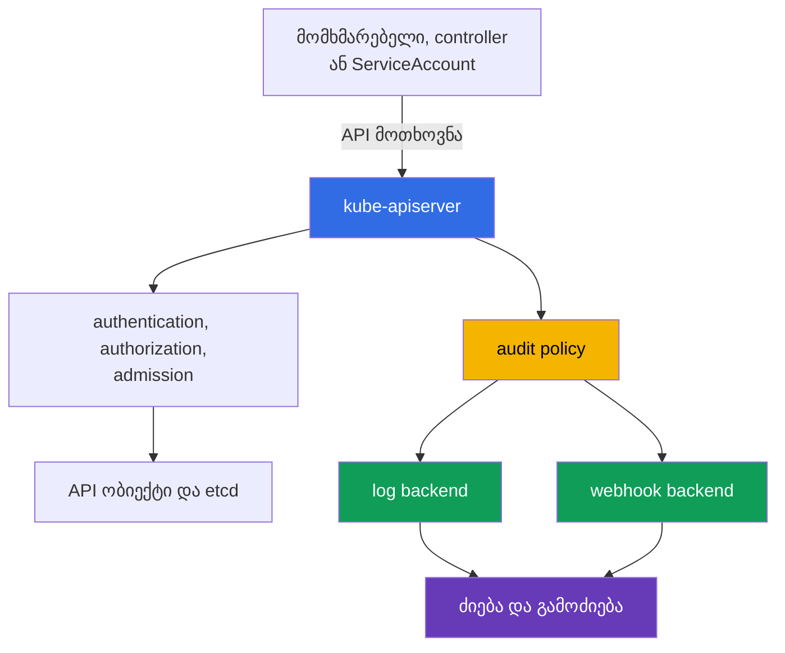

[Русская версия](ru.md) · [Eng version](README.md) · [Versión en español](es.md) · [Version française](fr.md) · [Deutsche Version](de.md) · [繁體中文版](tw.md) · [日本語版](jp.md)

# თავი 14. Audit Logging

> **შემდეგ რა არის.** 10-13 თავებში განხილული იყო იდენტობები, უფლებები, `Pod`-ის შეზღუდვები, საიდუმლოებები და ქსელის სეგმენტაცია. კარგი პრევენციული კონტროლიც კი არ აუქმებს კითხვებზე "ვინ, რა და როდის გააკეთა" პასუხის გაცემის საჭიროებას. Audit logging ქმნის Kubernetes API-სთვის გაგზავნილი მოთხოვნების კვალს გამოძიებისა და შესაბამისობისთვის. ეს არის KCSA-ს **Kubernetes Security Fundamentals** დომენის თემა, რომლის წონაა 22%. მაგალითები ეხება Kubernetes `v1.36`-ს.

## 14.1 რატომ არის საჭირო Kubernetes API-ს აუდიტი

Audit logging აღრიცხავს `kube-apiserver`-ისთვის გაგზავნილი მოთხოვნების მოვლენებს. API-ის გავლით სრულდება `kubectl`-ის, controller-ების, `ServiceAccount`-ებისა და სხვა კლიენტების მოქმედებები: `Pod`-ის შექმნა, `Secret`-ის წაკითხვა, `RoleBinding`-ის შეცვლა ან `NetworkPolicy`-ის წაშლა. ამიტომ audit-ლოგი პასუხობს ოთხ ძირითად კითხვას:

| კითხვა | მოვლენის მონაცემების მაგალითი |
|---|---|
| ვინ? | მომხმარებელი, ჯგუფი ან `ServiceAccount` ველში `user.username` |
| რა? | ზმნა `verb`, რესურსი და ობიექტი ველში `objectRef` |
| როდის? | დროის ნიშნული და მოთხოვნის დამუშავების ეტაპი |
| რა შედეგი დადგა? | პასუხის კოდი და მიზეზი ველში `responseStatus` |



Audit აღრიცხავს Kubernetes API-სთან მიმართვას და არა ყველა მოქმედებას კონტეინერის შიგნით. მაგალითად, shell-ბრძანება `Pod`-ში, სისტემური გამოძახება ან ქსელური კავშირი შეიძლება audit-ლოგში არ გამოჩნდეს. ამიტომ აუდიტი ავსებს, მაგრამ არ ცვლის აპლიკაციების ლოგებს, ქსელურ ტელემეტრიასა და runtime-დეტექტირებას.

სასარგებლო სცენარებია: იმის გარკვევა, ვინ გასცა RBAC-ის სახიფათო ნებართვა, რესურსის წაშლის წყაროს დადგენა, `Secret`-ის უჩვეულო წაკითხვის შემოწმება ან ინციდენტის ქრონოლოგიის აგება. შესაბამისობისთვის აუდიტი ადმინისტრაციული მოქმედებების დადასტურებად ჩანაწერს იძლევა, თუ თავად ჟურნალი დაცულია შეცვლისა და არაავტორიზებული წაკითხვისგან.

## 14.2 Audit policy: ეტაპები და აღრიცხვის დონეები

`audit policy` განსაზღვრავს, რომელი მოთხოვნები აღირიცხოს, რომელ ეტაპებზე და მონაცემთა რა მოცულობით. ეს `kube-apiserver`-ის კონფიგურაციაა და არა ობიექტი, რომელსაც ჩვეულებრივ `kubectl`-ის მეშვეობით ქმნიან. Policy-ის წესები თანმიმდევრულად მოწმდება: გამოიყენება პირველი შესაბამისი წესი. ეს ნიშნავს, რომ მგრძნობიარე რესურსებისთვის განკუთვნილი ვიწრო წესები ფართო ნაგულისხმევ წესზე ზემოთ უნდა განთავსდეს.

ერთმა მოთხოვნამ შეიძლება შემდეგი ეტაპები გაიაროს:

| ეტაპი | მნიშვნელობა |
|---|---|
| `RequestReceived` | API Server-მა მოთხოვნა მიიღო, მაგრამ მისი დამუშავება ჯერ არ დაუსრულებია. |
| `ResponseStarted` | პასუხის გაგზავნა დაიწყო, კერძოდ, ხანგრძლივი `watch` მოთხოვნებისთვის. |
| `ResponseComplete` | დამუშავება დასრულდა და საბოლოო სტატუსი ცნობილია. |
| `Panic` | API Server-ის დამმუშავებელი ავარიულად დასრულდა. |

გამოძიებების უმეტესობისთვის `ResponseComplete` უფრო ღირებულია: ის მოქმედებას საბოლოო შედეგთან აკავშირებს. თითოეული მოკლე მოთხოვნის ყველა ეტაპის აღრიცხვა მოცულობას ზრდის და ხშირად დუბლირებას ქმნის. Policy-ს შეუძლია არასაჭირო ეტაპები `omitStages`-ის მეშვეობით გამორიცხოს.

აღრიცხვის დონე და ეტაპი სხვადასხვა კითხვას პასუხობს. ეტაპი მიუთითებს, **როდის** შეიქმნას მოვლენა, ხოლო დონე მიუთითებს, **რამდენი** ინფორმაცია მოთავსდეს მასში.

| დონე | რა ინახება | ტიპური დანიშნულება და შეზღუდვა |
|---|---|---|
| `None` | არაფერი | განზრახ გამორიცხული ხმაურისთვის, მაგალითად, ცალკეული health-მოთხოვნებისთვის; ზედმეტად ფართო გამორიცხვა ბრმა ზონას ქმნის. |
| `Metadata` | identity, URI, ზმნა, ობიექტზე მითითება, დრო და სტატუსი, მაგრამ body-ის გარეშე | უსაფრთხო საბაზისო დონე API-გამოძახებების უმეტესობისთვის. |
| `Request` | `Metadata` და მოთხოვნის სხეული | ვიწრო შემთხვევა, როდესაც ცვლილების intent მნიშვნელოვანია; body შეიძლება მგრძნობიარე მონაცემებს შეიცავდეს. |
| `RequestResponse` | `Request` და პასუხის სხეული | ყველაზე სრული, მაგრამ ყველაზე ძვირი და სარისკო დონე; გამოიყენება მხოლოდ დასაბუთებული forensic-საჭიროებისას. |

განსაკუთრებული ხაფანგი: `Secret`-ისთვის გამოყენებულ `RequestResponse`-ს ჟურნალში პაროლის ან ტოკენის ჩაწერა შეუძლია. `Secret`-თან მიმართვისთვის ჩვეულებრივ ირჩევენ `Metadata`-ს, რათა მნიშვნელობის გამჟღავნების გარეშე გამოჩნდეს ფაქტი, ავტორი, ობიექტი და შედეგი. ანალოგიურად, ხშირი `watch`-ისთვის მაღალმა დონემ შეიძლება მონაცემთა დიდი ნაკადი შექმნას თანაზომიერი სარგებლის გარეშე.

## 14.3 სასარგებლო სიგნალი, ხმაური და backends

Audit-ლოგი გამოძიებას უნდა ეხმარებოდეს და არ უნდა გადაიქცეს გაჟონვისა და ხარჯების კიდევ ერთ წყაროდ. სასარგებლო სიგნალი ჩვეულებრივ უსაფრთხოების ცვლილებას ან მნიშვნელოვან რესურსზე წვდომას უკავშირდება: `Role`-ის, `ClusterRoleBinding`-ის, `ServiceAccount`-ის, `Secret`-ის, `NetworkPolicy`-ის ან მომატებული პრივილეგიების მქონე `Pod`-ის ცვლილებას.

ხმაურს ქმნის მზადყოფნის ხშირი შემოწმებები, controller-ების ჩვეულებრივი მოთხოვნები და ხანგრძლივი `watch`. ისინი დაუფიქრებლად, მთელი API-ბილიკების მიხედვით არ უნდა გაითიშოს. უფრო უსაფრთხო მიდგომაა მხოლოდ კონკრეტული, გასაგები endpoints-ის გამორიცხვა, catch-all `Metadata` წესის შენარჩუნება და მოვლენების მოცულობის პერიოდული გადახედვა.

| გადაწყვეტილება | უპირატესობა | რა უნდა გაითვალისწინოთ |
|---|---|---|
| `Metadata` როგორც default | body-ის გამჟღავნების მცირე რისკით იძლევა identity-ს, მოქმედებასა და outcome-ს | არ აჩვენებს შეცვლილი ობიექტის შიგთავსს |
| შერჩევითი `Request` | კრიტიკული ცვლილების intent-ის გაგებაში გეხმარებათ | უნდა შეიზღუდოს რესურსით, namespace-ითა და ზმნით |
| `None` ცნობილი ხმაურისთვის | ამცირებს შენახვის ღირებულებას | ზედმეტად ფართო წესის შემთხვევაში შეიძლება მნიშვნელოვანი მოქმედება დამალოს |
| `RequestResponse` | ყველაზე სრულ კონტექსტს იძლევა | ქმნის მაქსიმალურ მოცულობას, ღირებულებასა და გაჟონვის რისკს |

Kubernetes მხარს უჭერს მოვლენების მიწოდების ორ ძირითად მიმართულებას:

- **log backend** JSON-მოვლენებს control plane-ის კვანძზე არსებულ ლოკალურ ფაილში წერს. ის მოსახერხებელია პირველადი შეგროვებისთვის, მაგრამ კვანძი და ფაილი დაცული უნდა იყოს, უნდა ხდებოდეს მათი როტაცია და ცენტრალიზებულ საცავში გაგზავნა.
- **webhook backend** მოვლენებს HTTPS-ით გარე collector-ს ან SIEM-ს გადასცემს. ის ამარტივებს ცენტრალიზებულ ძიებასა და კორელაციას, მაგრამ მოითხოვს TLS-ს, collector-ის საიმედოობას, მიწოდების მონიტორინგს და API-ზე მიუწვდომელი backend-ის გავლენის შეფასებას.

Policy-სა და backend-ს სხვადასხვა როლი აქვს: policy წყვეტს, რომელი მოვლენები შეიქმნას, ხოლო backend წყვეტს, სად გაიგზავნოს ისინი. არჩეული გზის მიუხედავად, ჟურნალების წაკითხვის უფლებები შეზღუდული უნდა იყოს: audit-ლოგი შეიძლება შეიცავდეს მომხმარებლების სახელებს, მისამართებს, ინფრასტრუქტურის დეტალებს და, გაუფრთხილებელი policy-ის შემთხვევაში, მოთხოვნების სხეულებს.

## 14.4 მოვლენების წაკითხვა, runtime-დეტექტირება და გამოძიება

გამოძიებისას მოვლენას ჩვეულებრივ JSON-ის სახით კითხულობენ და ეძებენ დროის, identity-ს, ზმნის, ობიექტის, IP-მისამართისა და სტატუსის კომბინაციას. ერთი მოთხოვნის სხვადასხვა ეტაპი `auditID`-ის მიხედვით ერთიანდება.

`user.username`-ის, `verb`-ის, `objectRef`-ისა და `responseStatus`-ის გარდა, audit-მოვლენა შეიძლება ასევე შეიცავდეს კლიენტის კონტექსტის ველებს, რომლებიც მოსალოდნელი ავტომატიზებული კლიენტის მოულოდნელისგან გარჩევაში გეხმარებათ:

| მოვლენის ველი | რას აჩვენებს |
|---|---|
| `user.username` | გამომძახებელი identity: მომხმარებელი, ჯგუფი ან `ServiceAccount` |
| `verb` | შესრულებული მოქმედება, მაგალითად `get`, `list`, `delete` |
| `objectRef` | დაკავშირებული რესურსი, namespace და ობიექტის სახელი |
| `sourceIPs` | ქსელური მისამართ(ებ)ი, საიდანაც მოთხოვნა მოვიდა |
| `userAgent` | კლიენტის სტრიქონი, მაგალითად `kubectl`-ის კონკრეტული ვერსია ან controller-ის/ავტომატიზაციის სახელი |
| `responseStatus` | საბოლოო პასუხის კოდი და მიზეზი |
| `auditID` | ერთი მოთხოვნის ეტაპების გამაერთიანებელი იდენტიფიკატორი |

`sourceIPs` და `userAgent` სასარგებლოა მხოლოდ როგორც **მაკორელირებელი კონტექსტი** და არა როგორც კონკრეტული workload-ის მტკიცებულება. `userAgent`-ს კლიენტი ადგენს და ის სანდოდ არ უნდა ჩაითვალოს; `sourceIPs`-ში `X-Forwarded-For` / `X-Real-Ip`-ის მნიშვნელობები შეიძლება კლიენტმა ჩასვას, გარდა ჯაჭვის ბოლოში არსებული ფაქტობრივი remote address-ისა. კონკრეტულ `Pod`-თან ან `CronJob`-თან attribution-ისთვის audit event შეაჯერეთ authenticated identity-სთან, workload metadata-სთან, სანდო proxy/network telemetry-სა და სხვა ჟურნალებთან.

```json
{
  "level": "Metadata",
  "auditID": "b9d0-example",
  "stage": "ResponseComplete",
  "user": {"username": "system:serviceaccount:shop:api"},
  "verb": "get",
  "objectRef": {"resource": "secrets", "namespace": "shop", "name": "payments"},
  "responseStatus": {"code": 200}
}
```

ასეთი მოვლენიდან ჩანს, რომ მითითებულმა identity-მ კონკრეტული `Secret` წარმატებით წაიკითხა, მაგრამ `Metadata` დონე მის შიგთავსს არ ამჟღავნებს. კოდი `200` თავისთავად ბოროტად გამოყენებას არ ადასტურებს. ანალიტიკოსი მოვლენას აპლიკაციის მოსალოდნელ ქცევას, deployment-ის დროს, RBAC-ს, source IP-სა და სხვა ჟურნალებს უდარებს.

Runtime-დეტექტორი, მაგალითად Falco, სხვა კლასის კითხვებს პასუხობს: რა ხდება სამუშაო კვანძზე ან კონტეინერის შიგნით შესრულების დროს. მას შეუძლია შეამჩნიოს shell-ის გაშვება, მოულოდნელ ფაილთან წვდომა ან საეჭვო სისტემური გამოძახება. Audit logging, თავის მხრივ, API-მოქმედებებს აჩვენებს. ამ წყაროების დაკავშირება გამოძიებისას სასარგებლოა: კომპრომეტირებული კონტეინერის შესახებ runtime-მოვლენა და `Secret`-ის შემდგომი წაკითხვის შესახებ audit-მოვლენა უფრო სრულ სურათს იძლევა.

გამოძიების საბაზისო თანმიმდევრობა:

1. დააფიქსირეთ დრო, დაკავშირებული რესურსი და საეჭვო identity.
2. იპოვეთ `ResponseComplete` მოვლენები შესაბამისი `objectRef`-ით, `verb`-ითა და `auditID`-ით.
3. შეამოწმეთ, ჰქონდა თუ არა identity-ს მოსალოდნელი უფლებები RBAC-ის მეშვეობით და იყო თუ არა აქტივობა დაგეგმილი.
4. შედეგი შეაჯერეთ runtime, ქსელურ, ღრუბლოვან და application-ლოგებთან.
5. შეზღუდეთ შემდგომი რისკი: გააუქმეთ ტოკენი, შეავიწროეთ RBAC, იზოლაციაში მოაქციეთ სამუშაო დატვირთვა ან რეაგირების პროცედურის შესაბამისად შეინახეთ evidence.

## 14.5 როგორ იყენებენ ამას პრაქტიკაში

პლატფორმის გუნდი თავდაპირველად აუდიტის მიზნებს განსაზღვრავს: რომელი მოქმედებები მოითხოვს მტკიცებულებებს, შენახვის რა ვადაა საჭირო და ვის აქვს მოვლენების წაკითხვის უფლება. შემდეგ გუნდი ქმნის policy-ს მცირე რაოდენობის გასაგები წესებით: გამორიცხავს მხოლოდ ცნობილ უსაფრთხო ხმაურს, საბაზისო დონედ იყენებს `Metadata`-ს და `Secret`-ს body-ის ჩაწერისგან ცალკე იცავს.

Production-ში audit-მოვლენები ლოკალური ბუფერიდან ან webhook-იდან ცენტრალიზებულ საცავში მიეწოდება. იქ ადგენენ შეზღუდულ წვდომას, retention-ს, რეზერვირებას, ცვლილებისგან დაცვასა და ახალი მოვლენების არარსებობის alert-ებს. Audit policy-ისა და API Server-ის კონფიგურაციის შეცვლა თავისთავად მგრძნობიარე ოპერაციად ითვლება და ისიც კონტროლდება.

სასარგებლოა ნაკადის რეგულარული შემოწმება: შეასრულეთ უსაფრთხო სატესტო API-მოქმედება და დარწმუნდით, რომ საცავში არის მოვლენა სწორი identity-ით, რესურსით, დონითა და სტატუსით. ასეთი შემოწმების მიზანი JSON-ის მაქსიმალური მოცულობის შეგროვება კი არა, იმის რწმენაა, რომ ინციდენტის დროს evidence გაჩნდება.

## 14.6 Exam vocabulary / მინი-ლექსიკონი

| ტერმინი | მნიშვნელობა |
|---|---|
| audit event | `kube-apiserver`-ის ჩანაწერი Kubernetes API-სთვის გაგზავნილი მოთხოვნის დამუშავების შესახებ. |
| audit policy | წესების დალაგებული ნაკრები, რომელიც აუდიტის დონეებსა და ეტაპებს ირჩევს. |
| `auditID` | იდენტიფიკატორი, რომელიც ერთი მოთხოვნის სხვადასხვა ეტაპის მოვლენებს აკავშირებს. |
| stage | მოთხოვნის დამუშავების მომენტი: `RequestReceived`, `ResponseStarted`, `ResponseComplete` ან `Panic`. |
| level | მოვლენაში მონაცემთა მოცულობა: `None`, `Metadata`, `Request` ან `RequestResponse`. |
| log backend | Backend, რომელიც audit-მოვლენებს ლოკალურ ფაილში წერს. |
| webhook backend | Backend, რომელიც audit-მოვლენებს HTTPS collector-ს ან SIEM-ს უგზავნის. |
| runtime detection | კვანძზე ან კონტეინერში შესრულების დროს საეჭვო აქტივობის აღმოჩენა. |

## 14.7 Exam Essentials / თავის შეჯამება

- Audit logging აღრიცხავს Kubernetes API-სთვის გაგზავნილ მოთხოვნებს და გვეხმარება დავადგინოთ, ვინ რა და როდის გააკეთა და როგორი იყო შედეგი.
- Audit არ ცვლის runtime, ქსელურ და application-ლოგებს, რადგან ის ვერ ხედავს `Pod`-ის შიგნით და სამუშაო კვანძზე შესრულებულ ყველა მოქმედებას.
- ეტაპი განსაზღვრავს აღრიცხვის მომენტს, ხოლო დონე განსაზღვრავს მონაცემთა მოცულობას. გამოძიებისთვის ჩვეულებრივ მნიშვნელოვანია `ResponseComplete`.
- `Metadata` უსაფრთხო default-ისთვის შესაფერისია. `Request` და განსაკუთრებით `RequestResponse` ვიწროდ გამოიყენება მოცულობისა და მგრძნობიარე მონაცემების ჩაწერის რისკის გამო.
- `Secret`-ისთვის ჩვეულებრივ ირჩევენ `Metadata`-ს და არა body-ის შემცველ დონეს.
- `log backend` და `webhook backend` მიწოდების ამოცანას წყვეტს. ორივე მოითხოვს წვდომის, შენახვის, მონიტორინგისა და retention-ის დაცვას.
- სასარგებლო გამოძიება audit-მოვლენებს RBAC-ს, runtime-დეტექტირებასა და სხვა ტელემეტრიას უდარებს.

## 14.8 არ აგერიოთ და როგორ გვხვდება ეს გამოცდაზე

KCSA-ს კითხვებში ხშირად მექანიზმის საზღვრებს ამოწმებენ და არა API Server-ის ზუსტ ალმებს. განასხვავეთ დონე და ეტაპი: `Metadata` არ შეიცავს body-ს, `Request` შეიცავს request body-ს, ხოლო `RequestResponse` შეიცავს request და response body-ს. თუ ნახსენებია `Secret`, body-ის შემცველი დონის არჩევა, როგორც წესი, გაჟონვის რისკს ქმნის.

კიდევ ერთი გავრცელებული ფორმულირება სვამს კითხვას, რომელი წყარო ახსნის Kubernetes-რესურსის ცვლილებას. სწორი პასუხია API Server-ის audit logging. კონტეინერის შიგნით shell-ისთვის ან სისტემური გამოძახებისთვის საჭიროა runtime-დეტექტორი და არა audit. თუ კითხვაში უჩვეულო API-მოქმედებაა, მოძებნეთ identity, `verb`, `objectRef`, დრო და `responseStatus`.

## 14.9 თვითშემოწმების კითხვები

### 1. Audit logging-ის რომელი შესაძლებლობა გვეხმარება ყველაზე უშუალოდ დავადგინოთ, ვინ წაშალა `Deployment`?

   - a. Audit policy, რომელიც კლასტერის ყველა API-კლიენტისთვის ყველა `delete` ოპერაციას ავტომატურად კრძალავს.

   - b. Audit event, რომელიც კონკრეტული API-მოთხოვნის identity-ს, `verb`-ს, `objectRef`-სა და დამუშავების შედეგს შეიცავს.

   - c. წაშლილი `Pod`-ის CPU-სა და memory-ის Runtime metric, რომელიც მოთხოვნის დასრულების შემდეგ შეგროვდა.

   - d. წაშლილი workload-ის კონტეინერის Image metadata digest-ითა და აგების დროით.

<details>
<summary>პასუხი და განმარტება</summary>

**სწორი პასუხია: b.** API Server-ის audit-მოვლენა identity-ს მოქმედებასა და ობიექტს უკავშირებს და ასევე დამუშავების საბოლოო შედეგს აჩვენებს. ის evidence-ს აღრიცხავს, მაგრამ თავად მოქმედებას არ ბლოკავს.

</details>

### 2. Audit-ის რომელი დონე აღრიცხავს მოთხოვნისა და პასუხის metadata-ს body-ის გარეშე?

   - a. `Request`.

   - b. `RequestResponse`.

   - c. `None`.

   - d. `Metadata`.

<details>
<summary>პასუხი და განმარტება</summary>

**სწორი პასუხია: d.** `Metadata` შეიცავს ინფორმაციას identity-ს, მოქმედების, ობიექტის, დროისა და სტატუსის შესახებ მოთხოვნისა და პასუხის სხეულების გარეშე. `Request` ამატებს request body-ს, ხოლო `RequestResponse` ორივე body-ს ამატებს.

</details>

### 3. რატომ არ ირჩევენ ჩვეულებრივ `RequestResponse`-ს `Secret`-თან მიმართვისთვის?

   - a. ამ დონემ შეიძლება ჩაწეროს request და response bodies, რომლებშიც Secret-ის შემთხვევაში შეიძლება მგრძნობიარე მნიშვნელობები იყოს.

   - b. ეს დონე მხოლოდ მოვლენის metadata-ს ინახავს და ამიტომ request ან response body-ის ჩაწერა საერთოდ არ შეუძლია.

   - c. ეს დონე Secret-ის მოთხოვნებისთვის authentication-ს თიშავს, სანამ მოვლენა audit pipeline-ში მოხვდება.

   - d. ეს დონე API Server-ს უკრძალავს, დაუბრუნოს Secret ობიექტი კლიენტს მაშინაც კი, თუ Kubernetes authorization-მა წაკითხვის ნებართვა გასცა.

<details>
<summary>პასუხი და განმარტება</summary>

**სწორი პასუხია: a.** `RequestResponse`-ს მოთხოვნისა და პასუხის სხეულების შენახვა შეუძლია. Secret-ისთვის ეს მგრძნობიარე მნიშვნელობების audit storage-ში მოხვედრის რისკს ქმნის. ჩვეულებრივ უფრო უსაფრთხოა Secret-ის შიგთავსის გარეშე საკმარისი audit context-ის შენახვა, მაგალითად `Metadata`-ის მეშვეობით, თუ forensic requirements უფრო მეტს არ მოითხოვს.

</details>

### 4. რომელი წყარო უკეთ აღმოაჩენს უკვე გაშვებული კონტეინერის შიგნით ინტერაქტიული shell-ის გაშვებას, თუ ამ მოქმედებას Kubernetes API არ გამოუძახებია?

   - a. API Server-ის Audit logging.

   - b. `NetworkPolicy`.

   - c. Runtime-დეტექტორი, მაგალითად Falco.

   - d. `RoleBinding`.

<details>
<summary>პასუხი და განმარტება</summary>

**სწორი პასუხია: c.** Audit API-მოთხოვნებს ხედავს. Runtime-დეტექტორი შესრულების დროს აქტივობას აკვირდება, მაგალითად კონტეინერის პროცესებსა და სისტემურ გამოძახებებს.

</details>

> **შემდეგ სად წავიდეთ.** Audit policy-ის, backend-ის, როტაციის, webhook-ის პრაქტიკული კონფიგურაციისა და მოვლენების შემოწმების გასაცნობად შეისწავლეთ CKS-ის 32-ე თავი Kubernetes-ის audit-ლოგების შესახებ.

[სარჩევი](../README_GE.md) · [თავი 13](../13/ge.md) · [თავი 15](../15/ge.md)
