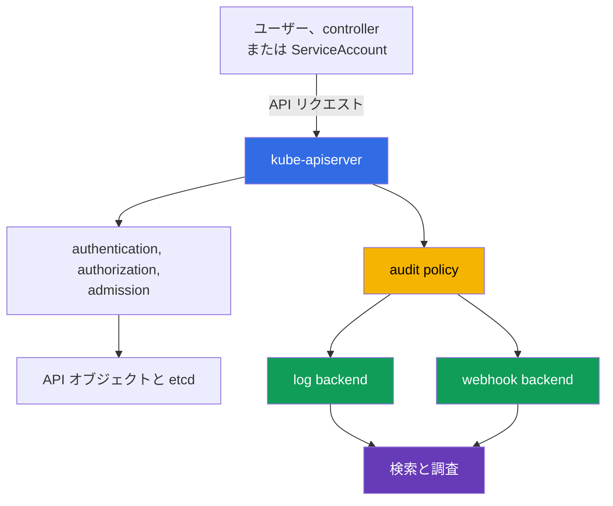

[Русская версия](ru.md) · [Eng version](README.md) · [Versión en español](es.md) · [Version française](fr.md) · [Deutsche Version](de.md) · [ქართული ვერსია](ge.md) · [繁體中文版](tw.md)

# 第14章 Audit Logging

> **次は何か。** 第10-13章では、アイデンティティ、権限、`Pod` の制約、Secret、ネットワーク分離を扱いました。優れた予防的コントロールがあっても、「誰が、何を、いつ行ったか」という問いに答える必要はなくなりません。Audit logging は Kubernetes API へのリクエストの追跡を作成し、調査とコンプライアンスに役立ちます。これは KCSA ドメイン **Kubernetes Security Fundamentals** のトピックであり、重みは22%です。例は Kubernetes `v1.36` に対応しています。

## 14.1 Kubernetes API 監査が必要な理由

Audit logging は `kube-apiserver` へのリクエストに関するイベントを記録します。`kubectl`、コントローラ、`ServiceAccount`、その他のクライアントによる操作は API を経由します。たとえば `Pod` の作成、`Secret` の読み取り、`RoleBinding` の変更、`NetworkPolicy` の削除です。そのため audit log は、次の4つの基本的な問いに答えます。

| 問い | イベントデータの例 |
|---|---|
| 誰が? | `user.username` 内のユーザー、グループ、または `ServiceAccount` |
| 何を? | `verb`、リソース、および `objectRef` 内のオブジェクト |
| いつ? | タイムスタンプとリクエスト処理ステージ |
| 結果は? | `responseStatus` 内のレスポンスコードと理由 |



Audit は Kubernetes API へのアクセスを記録しますが、コンテナ内のすべての操作を記録するわけではありません。たとえば、`Pod` 内の shell コマンド、システムコール、ネットワーク接続は audit log に現れないことがあります。したがって監査は、アプリケーションログ、ネットワークテレメトリ、runtime 検出を補完しますが、それらに置き換わるものではありません。

有用なシナリオには、危険な RBAC 権限を誰が付与したかの特定、リソース削除の発生源の判定、異常な `Secret` 読み取りの確認、インシデントの時系列の構築があります。コンプライアンスのため、ログ自体が改ざんや不正な読み取りから保護されていれば、監査は管理操作の検証可能な記録を提供します。

## 14.2 Audit policy: 記録のステージとレベル

`audit policy` は、どのリクエストを、どのステージで、どの程度のデータ量で記録するかを定義します。これは `kube-apiserver` の設定であり、通常は `kubectl` で作成するオブジェクトではありません。policy のルールは順番に照合され、最初に一致したルールが適用されます。したがって、機密リソースに対する限定的なルールは、広範なデフォルトルールより上に配置します。

1つのリクエストは次のステージを通過します。

| ステージ | 意味 |
|---|---|
| `RequestReceived` | API Server がリクエストを受信したが、まだ処理を完了していません。 |
| `ResponseStarted` | レスポンス送信が始まりました。特に長時間の `watch` リクエストで使われます。 |
| `ResponseComplete` | 処理が完了し、最終ステータスが判明しています。 |
| `Panic` | API Server のハンドラが異常終了しました。 |

ほとんどの調査では、`ResponseComplete` がより価値があります。これは操作を最終結果と結び付けるためです。すべての短いリクエストの全ステージを記録すると、データ量が増え、多くの場合重複が生じます。policy は `omitStages` により不要なステージを除外できます。

記録レベルとステージは異なる問いに答えます。ステージはイベントを作成する**タイミング**を示し、レベルはそこに格納する情報の**量**を示します。

| レベル | 保存される内容 | 一般的な用途と境界 |
|---|---|---|
| `None` | なし | 特定の health リクエストなど、意図的に除外するノイズ向けです。除外範囲が広すぎると死角が生じます。 |
| `Metadata` | identity、URI、verb、オブジェクト参照、時間、ステータス。ただし body は含まない | 大半の API 呼び出しに安全な基本レベルです。 |
| `Request` | `Metadata` とリクエスト body | 変更の意図が重要な限定ケース向けです。body には機密データが含まれる可能性があります。 |
| `RequestResponse` | `Request` とレスポンス body | 最も完全ですが、最も高コストで危険なレベルです。正当な forensic の必要性がある場合にのみ使用します。 |

特に注意すべき点は、`Secret` に対する `RequestResponse` がパスワードやトークンをログに記録し得ることです。`Secret` へのアクセスには通常 `Metadata` を選び、値を公開せずに事実、実行者、オブジェクト、結果を確認できるようにします。同様に、高頻度の `watch` に高いレベルを使用すると、見合う利点なく大量のデータストリームが発生する可能性があります。

## 14.3 有用なシグナル、ノイズ、backends

Audit log は調査に役立つべきであり、漏えいやコストの新たな原因になるべきではありません。有用なシグナルは、通常セキュリティ変更または重要なリソースへのアクセスに関連します。たとえば、`Role`、`ClusterRoleBinding`、`ServiceAccount`、`Secret`、`NetworkPolicy`、権限が昇格された `Pod` の変更です。

ノイズは、頻繁な readiness チェック、通常のコントローラリクエスト、長時間の `watch` によって生じます。これらを API パス全体ごと無思慮に無効化すべきではありません。より安全なアプローチは、具体的で理解済みの endpoint のみを除外し、catch-all の `Metadata` ルールを維持して、イベント量を定期的に見直すことです。

| 判断 | 利点 | 考慮事項 |
|---|---|---|
| デフォルトとしての `Metadata` | body 公開のリスクを小さくして identity、操作、outcome を提供する | 変更されたオブジェクトの内容は表示しない |
| 選択的な `Request` | 重要な変更の意図を理解する助けになる | リソース、namespace、verb で制限する |
| 既知のノイズに対する `None` | ストレージコストを削減する | ルールが広すぎると重要な操作を隠す可能性がある |
| `RequestResponse` | 最も完全なコンテキストを提供する | 最大のデータ量、コスト、漏えいリスクを生む |

Kubernetes はイベント配信の主要な2つの方法をサポートしています。

- **log backend** は JSON イベントを control plane ノード上のローカルファイルに書き込みます。初期収集には簡単ですが、ノードとファイルを保護、ローテーションし、中央ストレージに送信する必要があります。
- **webhook backend** は HTTPS 経由でイベントを外部の collector または SIEM に送信します。集中検索と相関を簡素化しますが、TLS、collector の信頼性、配信監視、および backend が利用できない場合の API への影響評価が必要です。

policy と backend には異なる役割があります。policy はどのイベントを生成するかを決め、backend はその送信先を決めます。どの経路を選んでも、ログの読み取り権限は制限する必要があります。audit log にはユーザー名、アドレス、インフラストラクチャの詳細、そして不注意な policy ではリクエスト body が含まれる可能性があります。

## 14.4 イベントの読み取り、runtime 検出、調査

調査では通常、イベントを JSON として読み、時間、identity、verb、オブジェクト、IP アドレス、ステータスの組み合わせを探します。1つのリクエストの異なるステージは `auditID` でまとめます。

`user.username`、`verb`、`objectRef`、`responseStatus` に加え、audit イベントにはクライアントコンテキストのフィールドが含まれることがあります。これらは、想定された自動クライアントと予期しないクライアントを区別するのに役立ちます。

| イベントフィールド | 示す内容 |
|---|---|
| `user.username` | 呼び出し元の identity: ユーザー、グループ、または `ServiceAccount` |
| `verb` | 実行された操作。例: `get`、`list`、`delete` |
| `objectRef` | 影響を受けたリソース、namespace、オブジェクト名 |
| `sourceIPs` | リクエストの送信元ネットワークアドレス |
| `userAgent` | 特定の `kubectl` バージョンや controller/自動化の名前などのクライアント文字列 |
| `responseStatus` | 最終レスポンスのコードと理由 |
| `auditID` | 1つのリクエストのステージを結び付ける識別子 |

`sourceIPs` と `userAgent` は、特定の workload の証拠ではなく、**相関のためのコンテキスト**としてのみ有用です。`userAgent` はクライアントが設定するものであり、信頼すべきではありません。`sourceIPs` では、チェーン末尾の実際の remote address を除き、`X-Forwarded-For` / `X-Real-Ip` の値はクライアントにより偽装される可能性があります。特定の `Pod` または `CronJob` に帰属させるには、audit event を authenticated identity、workload metadata、信頼できる proxy/network telemetry、その他のログと照合してください。

```json
{
  "level": "Metadata",
  "auditID": "b9d0-example",
  "stage": "ResponseComplete",
  "user": {"username": "system:serviceaccount:shop:api"},
  "verb": "get",
  "objectRef": {"resource": "secrets", "namespace": "shop", "name": "payments"},
  "responseStatus": {"code": 200}
}
```

このイベントから、示された identity が特定の `Secret` を正常に読み取ったことが分かりますが、`Metadata` レベルでは内容は公開されません。コード `200` だけでは不正利用を証明しません。分析者は、このイベントをアプリケーションの想定動作、デプロイ時間、RBAC、source IP、その他のログと照合します。

Falco などの runtime 検出器は、別の種類の問いに答えます。実行時にワーカーノードまたはコンテナ内で何が起きているか、という問いです。shell の起動、想定外のファイルへのアクセス、疑わしいシステムコールを検出できます。一方、Audit logging は API 操作を示します。これらの情報源の組み合わせは調査に有用です。侵害されたコンテナに関する runtime イベントと、その後の `Secret` 読み取りに関する audit イベントにより、より完全な状況が得られます。

基本的な調査手順:

1. 時刻、影響を受けたリソース、疑わしい identity を記録します。
2. 該当する `objectRef`、`verb`、`auditID` を持つ `ResponseComplete` イベントを探します。
3. identity が RBAC によって想定された権限を持っていたか、またアクティビティが予定されていたかを確認します。
4. 結果を runtime、ネットワーク、クラウド、application のログと照合します。
5. さらなるリスクを制限します。トークンの失効、RBAC の縮小、workload の隔離、または対応手順に従った evidence の保存を行います。

## 14.5 実運用での適用

プラットフォームチームはまず監査の目的を定義します。どの操作に証拠が必要か、どの保持期間が必要か、誰がイベントを読む権限を持つかです。次に少数の分かりやすいルールからなる policy を作成します。既知で安全なノイズだけを除外し、`Metadata` を基本レベルとして使い、`Secret` を body の記録から個別に保護します。

production では、audit イベントをローカルバッファまたは webhook から中央ストレージへ配信します。そこでは、アクセス制限、retention、バックアップ、改ざん防止、最新イベントがない場合のアラートを設定します。audit policy と API Server 設定の変更自体を機密操作とみなし、それも管理します。

フローの定期的な確認が有用です。安全なテスト API 操作を実行し、正しい identity、リソース、レベル、ステータスを持つイベントがストレージにあることを確かめます。この確認の目的は最大量の JSON を収集することではなく、インシデント発生時に evidence が得られるという確信を持つことです。

## 14.6 Exam vocabulary / ミニ用語集

| 用語 | 意味 |
|---|---|
| audit event | Kubernetes API リクエストの処理に関する `kube-apiserver` の記録。 |
| audit policy | 監査のレベルとステージを選択する、順序付けられたルールの集合。 |
| `auditID` | 1つのリクエストの異なるステージのイベントを結び付ける識別子。 |
| stage | リクエスト処理の時点: `RequestReceived`、`ResponseStarted`、`ResponseComplete`、または `Panic`。 |
| level | イベントのデータ量: `None`、`Metadata`、`Request`、または `RequestResponse`。 |
| log backend | audit イベントをローカルファイルに書き込む backend。 |
| webhook backend | audit イベントを HTTPS 経由で collector または SIEM に送信する backend。 |
| runtime detection | ノードまたはコンテナでの実行時に疑わしいアクティビティを検出すること。 |

## 14.7 Exam Essentials / 章の要点

- Audit logging は Kubernetes API リクエストを記録し、誰が、何を、いつ行ったか、その結果は何かを確立するのに役立ちます。
- Audit は `Pod` 内およびワーカーノード上のすべての操作を見られないため、runtime、ネットワーク、application のログを置き換えるものではありません。
- ステージは記録の時点を決め、レベルはデータ量を決めます。調査では通常 `ResponseComplete` が重要です。
- `Metadata` は安全なデフォルトとして適しています。`Request`、特に `RequestResponse` は、データ量と機密データを記録するリスクのため、限定して使用します。
- `Secret` には通常、body を含むレベルではなく `Metadata` を選択します。
- `log backend` と `webhook backend` は配信を担います。どちらにもアクセス、ストレージ、監視、retention の保護が必要です。
- 有効な調査では、audit イベントを RBAC、runtime 検出、その他のテレメトリと照合します。

## 14.8 混同しやすい点と試験での出題

KCSA の問題では、正確な API Server フラグではなく、メカニズムの境界がよく問われます。レベルとステージを区別してください。`Metadata` は body を含まず、`Request` は request body を含み、`RequestResponse` は request と response の body を含みます。`Secret` が言及される場合、body を含むレベルの選択は通常漏えいリスクを生じさせます。

もう1つのよくある表現は、Kubernetes リソースの変更を説明する情報源を問うものです。正しい答えは API Server の audit logging です。コンテナ内の shell またはシステムコールには audit ではなく runtime 検出器が必要です。問題に異常な API 操作がある場合は、identity、`verb`、`objectRef`、時刻、`responseStatus` を探します。

## 14.9 自己確認問題

### 1. `Deployment` を誰が削除したかを特定するのに、audit logging のどの機能が最も直接的に役立ちますか?

   - a. cluster 内のすべての API クライアントに対するあらゆる `delete` 操作を自動的に禁止する Audit policy。

   - b. 特定の API リクエストについて identity、`verb`、`objectRef`、処理結果を含む Audit event。

   - c. リクエスト完了後に収集された、削除された `Pod` の CPU と memory に関する Runtime metric。

   - d. 削除された workload のコンテナの digest とビルド時刻を含む Image metadata。

<details>
<summary>回答と解説</summary>

**正解: b.** API Server の audit イベントは identity を操作とオブジェクトに結び付け、処理の最終結果も示します。これは evidence を記録しますが、操作そのものをブロックするわけではありません。

</details>

### 2. body を含めず、リクエストとレスポンスのメタデータを記録する audit レベルはどれですか?

   - a. `Request`。

   - b. `RequestResponse`。

   - c. `None`。

   - d. `Metadata`。

<details>
<summary>回答と解説</summary>

**正解: d.** `Metadata` には、リクエストとレスポンスの body を含めずに、identity、操作、オブジェクト、時刻、ステータスに関する情報が含まれます。`Request` は request body を追加し、`RequestResponse` は両方の body を追加します。

</details>

### 3. `Secret` へのアクセスに通常 `RequestResponse` を選ばない理由は何ですか?

   - a. このレベルでは request と response の body を記録でき、それらには Secret の機密値が含まれる可能性があるため。

   - b. このレベルはイベントの metadata のみを保存するため、request または response body をまったく記録できないため。

   - c. このレベルは、イベントが audit pipeline に入る前に Secret リクエストの authentication を無効化するため。

   - d. このレベルは、Kubernetes authorization が読み取りを許可していても、API Server が Secret オブジェクトをクライアントに返すことを禁止するため。

<details>
<summary>回答と解説</summary>

**正解: a.** `RequestResponse` はリクエストとレスポンスの body を保存できます。Secret では、これにより機密値が audit storage に含まれるリスクが生じます。forensic requirements がそれ以上を必要としない場合、通常は `Metadata` などにより Secret の内容なしで十分な audit context を保存するほうが安全です。

</details>

### 4. すでに稼働中のコンテナ内で対話型 shell が起動された場合、その操作が Kubernetes API を呼び出さなかったとして、どの情報源が最も適切に検出できますか?

   - a. API Server の Audit logging。

   - b. `NetworkPolicy`。

   - c. Falco などの Runtime 検出器。

   - d. `RoleBinding`。

<details>
<summary>回答と解説</summary>

**正解: c.** Audit は API リクエストを確認します。Runtime 検出器は、コンテナのプロセスやシステムコールなど、実行時のアクティビティを監視します。

</details>

> **次へ。** audit policy、backend、ローテーション、webhook、イベント確認の実践的な設定については、Kubernetes audit logs に関する CKS の第32章を学んでください。

[目次](../README_JP.md) · [第13章](../13/jp.md) · [第15章](../15/jp.md)
