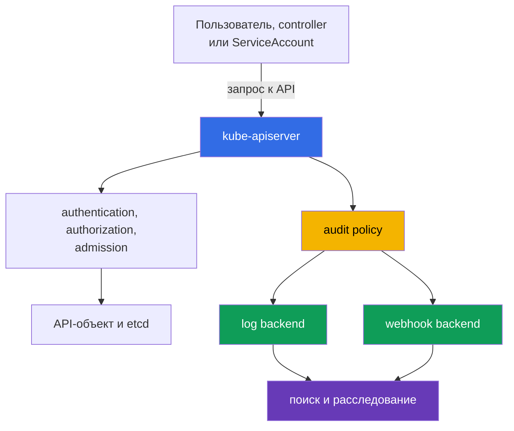

> **Язык:** русский. Переводы будут добавлены после публикации соответствующих файлов.

# Глава 14. Audit Logging

> **Что дальше.** В главах 10-13 были рассмотрены идентичности, права, ограничения `Pod`, секреты и сегментация сети. Даже хорошие превентивные контроли не отменяют потребность ответить на вопросы «кто, что и когда сделал». Audit logging создаёт след запросов к Kubernetes API для расследований и комплаенса. Это тема домена KCSA **Kubernetes Security Fundamentals** с весом 22%. Примеры относятся к Kubernetes `v1.36`.

## 14.1 Зачем нужен аудит Kubernetes API

Audit logging записывает события о запросах к `kube-apiserver`. Через API проходят действия `kubectl`, контроллеров, `ServiceAccount` и других клиентов: создание `Pod`, чтение `Secret`, изменение `RoleBinding` или удаление `NetworkPolicy`. Поэтому audit-лог отвечает на четыре базовых вопроса:

| Вопрос | Пример данных события |
|---|---|
| Кто? | пользователь, группа или `ServiceAccount` в `user.username` |
| Что? | глагол `verb`, ресурс и объект в `objectRef` |
| Когда? | временная метка и стадия обработки запроса |
| Каков результат? | код и причина ответа в `responseStatus` |



Audit фиксирует обращение к Kubernetes API, а не все действия внутри контейнера. Например, shell-команда в `Pod`, системный вызов или сетевое соединение могут не появиться в audit-логе. Поэтому аудит дополняет, но не заменяет логи приложений, сетевую телеметрию и runtime-детектирование.

Полезные сценарии: выяснить, кто выдал опасное разрешение RBAC, определить источник удаления ресурса, проверить необычное чтение `Secret` или построить хронологию инцидента. Для комплаенса аудит даёт подтверждаемую запись административных действий, если сам журнал защищён от изменения и несанкционированного чтения.

## 14.2 Audit policy: стадии и уровни записи

`audit policy` определяет, какие запросы записывать, на каких стадиях и с каким объёмом данных. Это конфигурация `kube-apiserver`, а не объект, который обычно создают через `kubectl`. Правила policy сопоставляются последовательно: применяется первое подходящее правило. Значит, узкие правила для чувствительных ресурсов располагают выше широкого правила по умолчанию.

Один запрос может пройти следующие стадии:

| Стадия | Смысл |
|---|---|
| `RequestReceived` | API Server принял запрос, но ещё не завершил обработку. |
| `ResponseStarted` | началась отправка ответа, в частности для длительных запросов `watch`. |
| `ResponseComplete` | обработка завершена, известен итоговый статус. |
| `Panic` | обработчик API Server аварийно завершился. |

Для большинства расследований ценнее `ResponseComplete`: она связывает действие с окончательным результатом. Запись всех стадий каждого короткого запроса повышает объём и часто создаёт дублирование. Policy может исключить ненужные стадии через `omitStages`.

Уровень записи и стадия отвечают на разные вопросы. Стадия говорит, **когда** создать событие, а уровень говорит, **сколько** информации в него поместить.

| Уровень | Что сохраняется | Типичное назначение и граница |
|---|---|---|
| `None` | ничего | для осознанно исключённого шума, например отдельных health-запросов; слишком широкое исключение создаёт слепую зону. |
| `Metadata` | identity, URI, глагол, ссылка на объект, время и статус, но без body | безопасный базовый уровень для большинства API-вызовов. |
| `Request` | `Metadata` и тело запроса | узкий случай, когда важен intent изменения; body может содержать чувствительные данные. |
| `RequestResponse` | `Request` и тело ответа | наиболее полный, но самый дорогой и рискованный уровень; применяют только при обоснованной forensic-потребности. |

Особая ловушка: `RequestResponse` для `Secret` способен записать пароль или токен в журнал. Для обращений к `Secret` обычно выбирают `Metadata`, чтобы видеть факт, автора, объект и результат без раскрытия значения. Аналогично высокий уровень для частых `watch` может породить большой поток данных без соразмерной пользы.

## 14.3 Полезный сигнал, шум и backends

Audit-лог должен помогать расследованию, а не становиться ещё одним источником утечек и затрат. Полезный сигнал обычно связан с изменением безопасности или доступом к важному ресурсу: изменением `Role`, `ClusterRoleBinding`, `ServiceAccount`, `Secret`, `NetworkPolicy`, `Pod` с повышенными привилегиями.

Шум создают частые проверки готовности, обычные запросы контроллеров и длительные `watch`. Их не следует бездумно отключать целыми API-путями. Более безопасный подход: исключить только конкретные, понятные endpoints, сохранить catch-all правило `Metadata` и периодически пересматривать объём событий.

| Решение | Преимущество | Что учитывать |
|---|---|---|
| `Metadata` как default | даёт identity, действие и outcome с небольшим риском раскрытия body | не показывает содержимое изменённого объекта |
| выборочный `Request` | помогает понять intent критичного изменения | ограничивать ресурсом, namespace и глаголом |
| `None` для известного шума | уменьшает стоимость хранения | может скрыть важное действие при слишком широком правиле |
| `RequestResponse` | даёт наиболее полный контекст | создаёт максимальные объём, стоимость и риск утечки |

Kubernetes поддерживает два основных направления доставки событий:

- **log backend** записывает JSON-события в локальный файл на узле control plane. Он прост для первоначального сбора, но узел и файл нужно защищать, ротировать и отправлять в централизованное хранилище.
- **webhook backend** передаёт события по HTTPS внешнему collector или SIEM. Он упрощает централизованный поиск и корреляцию, но требует TLS, надёжности collector, мониторинга доставки и оценки влияния недоступного backend на API.

У policy и backend разные роли: policy решает, какие события сформировать, а backend решает, куда их отправить. Независимо от выбранного пути права на чтение журналов должны быть ограничены: audit-лог может содержать имена пользователей, адреса, детали инфраструктуры и, при неосторожной policy, тела запросов.

## 14.4 Чтение событий, runtime-детектирование и расследование

При расследовании событие обычно читают как JSON и ищут комбинацию времени, identity, глагола, объекта, IP-адреса и статуса. Для одного запроса разные стадии объединяют по `auditID`.

Помимо `user.username`, `verb`, `objectRef` и `responseStatus`, audit-событие также может содержать поля клиентского контекста, которые помогают отличить ожидаемого автоматизированного клиента от неожиданного:

| Поле события | Что показывает |
|---|---|
| `user.username` | вызывающая identity: пользователь, группа или `ServiceAccount` |
| `verb` | выполненное действие, например `get`, `list`, `delete` |
| `objectRef` | затронутый ресурс, namespace и имя объекта |
| `sourceIPs` | сетевой адрес(а), откуда пришёл запрос |
| `userAgent` | строка клиента, например конкретная версия `kubectl` или имя controller/автоматизации |
| `responseStatus` | код и причина итогового ответа |
| `auditID` | идентификатор, объединяющий стадии одного запроса |

`sourceIPs` и `userAgent` полезны только как **коррелирующий контекст**, а не как доказательство конкретного workload. `userAgent` задаётся клиентом и не должен считаться доверенным; в `sourceIPs` значения из `X-Forwarded-For` / `X-Real-Ip` могут быть подставлены клиентом, кроме фактического remote address в конце цепочки. Для attribution к конкретному `Pod` или `CronJob` сопоставляйте audit event с authenticated identity, workload metadata, trusted proxy/network telemetry и другими журналами.

```json
{
  "level": "Metadata",
  "auditID": "b9d0-example",
  "stage": "ResponseComplete",
  "user": {"username": "system:serviceaccount:shop:api"},
  "verb": "get",
  "objectRef": {"resource": "secrets", "namespace": "shop", "name": "payments"},
  "responseStatus": {"code": 200}
}
```

Из такого события следует, что указанная identity успешно прочитала конкретный `Secret`, но уровень `Metadata` не раскрывает его содержимое. Сам по себе код `200` не доказывает злоупотребление. Аналитик сопоставляет событие с ожидаемым поведением приложения, временем деплоя, RBAC, source IP и другими журналами.

Runtime-детектор, например Falco, отвечает на другой класс вопросов: что происходит на рабочем узле или внутри контейнера во время исполнения. Он может заметить запуск shell, доступ к неожиданному файлу или подозрительный системный вызов. Audit logging, в свою очередь, показывает API-действия. Связка этих источников полезна при расследовании: runtime-событие о скомпрометированном контейнере и audit-событие о последующем чтении `Secret` дают более полную картину.

Базовая последовательность расследования:

1. Зафиксировать время, затронутый ресурс и подозрительную identity.
2. Найти `ResponseComplete` события с подходящими `objectRef`, `verb` и `auditID`.
3. Проверить, имела ли identity ожидаемые права через RBAC и была ли активность запланирована.
4. Сопоставить вывод с runtime, сетевыми, облачными и application-логами.
5. Ограничить дальнейший риск: отозвать токен, сузить RBAC, изолировать рабочую нагрузку или сохранить evidence по процедуре реагирования.

## 14.5 Как это применяют на практике

Команда платформы сначала определяет цели аудита: какие действия требуют доказательств, какой срок хранения нужен и кто имеет право читать события. Затем она создаёт policy с небольшим числом понятных правил: исключает только известный безопасный шум, использует `Metadata` как базовый уровень и отдельно защищает `Secret` от записи body.

В production audit-события доставляют из локального буфера или webhook в централизованное хранилище. Там задают ограниченный доступ, retention, резервирование, защиту от изменения и алерты на отсутствие свежих событий. Изменение audit policy и конфигурации API Server само считают чувствительной операцией и тоже контролируют.

Полезна регулярная проверка потока: выполнить безопасное тестовое API-действие и убедиться, что в хранилище есть событие с правильными identity, ресурсом, уровнем и статусом. Цель такой проверки не в сборе максимального объёма JSON, а в уверенности, что evidence появится в момент инцидента.

## 14.6 Exam vocabulary / Мини-глоссарий

| Термин | Значение |
|---|---|
| audit event | Запись `kube-apiserver` об обработке запроса к Kubernetes API. |
| audit policy | Упорядоченный набор правил, выбирающих уровни и стадии аудита. |
| `auditID` | Идентификатор, связывающий события разных стадий одного запроса. |
| stage | Момент обработки запроса: `RequestReceived`, `ResponseStarted`, `ResponseComplete` или `Panic`. |
| level | Объём данных в событии: `None`, `Metadata`, `Request` или `RequestResponse`. |
| log backend | Backend, записывающий audit-события в локальный файл. |
| webhook backend | Backend, отправляющий audit-события HTTPS collector или SIEM. |
| runtime detection | Обнаружение подозрительной активности во время исполнения на узле или в контейнере. |

## 14.7 Exam Essentials / Итоги главы

- Audit logging фиксирует запросы к Kubernetes API и помогает установить кто, что, когда сделал и каким был результат.
- Audit не заменяет runtime, сетевые и application-логи, потому что не видит все действия внутри `Pod` и на рабочем узле.
- Стадия определяет момент записи, а уровень определяет объём данных. Для расследования обычно важна `ResponseComplete`.
- `Metadata` подходит как безопасный default. `Request` и особенно `RequestResponse` применяют узко из-за объёма и риска записать чувствительные данные.
- Для `Secret` обычно выбирают `Metadata`, а не уровень с body.
- `log backend` и `webhook backend` решают задачу доставки. Оба требуют защиты доступа, хранения, мониторинга и retention.
- Полезное расследование сопоставляет audit-события с RBAC, runtime-детектированием и другой телеметрией.

## 14.8 Не путать и как это встречается на экзамене

В вопросах KCSA часто проверяют границы механизма, а не точные флаги API Server. Различайте уровень и стадию: `Metadata` не содержит body, `Request` содержит request body, а `RequestResponse` содержит request и response body. Если упомянут `Secret`, выбор уровня с body обычно создаёт риск утечки.

Ещё одна частая формулировка спрашивает, какой источник объяснит изменение Kubernetes-ресурса. Правильный ответ - audit logging API Server. Для shell внутри контейнера или системного вызова нужен runtime-детектор, а не audit. Если в вопросе есть необычное API-действие, ищите identity, `verb`, `objectRef`, время и `responseStatus`.

## 14.9 Вопросы для самопроверки

### 1. Какая возможность audit logging наиболее прямо помогает установить, кто удалил `Deployment`?

   - a. Audit policy, автоматически запрещающая любые операции `delete` для всех API-клиентов кластера.

   - b. Audit event с identity, `verb`, `objectRef` и результатом обработки конкретного API-запроса.

   - c. Runtime metric с CPU и memory удалённого `Pod`, собранная после завершения запроса.

   - d. Image metadata с digest и временем сборки контейнера удалённого workload.

<details>
<summary>Ответ и разбор</summary>

**Верный ответ: b.** Audit-событие API Server связывает identity с действием и объектом, а также показывает итог обработки. Оно фиксирует evidence, но само не блокирует действие.

</details>

### 2. Какой уровень audit записывает метаданные запроса и ответа без body?

   - a. `Request`.

   - b. `RequestResponse`.

   - c. `None`.

   - d. `Metadata`.

<details>
<summary>Ответ и разбор</summary>

**Верный ответ: d.** `Metadata` содержит сведения об identity, действии, объекте, времени и статусе без тел запроса и ответа. `Request` добавляет request body, а `RequestResponse` добавляет оба body.

</details>

### 3. Почему для обращений к `Secret` обычно не выбирают `RequestResponse`?

   - a. Этот уровень может записать request и response bodies, в которых для Secret могут находиться чувствительные значения.

   - b. Этот уровень сохраняет только metadata события и поэтому не способен записывать request или response body вообще.

   - c. Этот уровень отключает authentication для запросов к Secret до того, как событие попадёт в audit pipeline.

   - d. Этот уровень запрещает API Server возвращать Secret объект клиенту, даже если Kubernetes authorization разрешил чтение.

<details>
<summary>Ответ и разбор</summary>

**Верный ответ: a.** `RequestResponse` может сохранять тела запросов и ответов. Для Secret это создаёт риск попадания чувствительных значений в audit storage. Обычно безопаснее сохранять достаточный audit context без содержимого Secret, например через `Metadata`, если forensic requirements не требуют большего.

</details>

### 4. Какой источник лучше обнаружит запуск интерактивной shell внутри уже работающего контейнера, если это действие не вызвало Kubernetes API?

   - a. Audit logging API Server.

   - b. `NetworkPolicy`.

   - c. Runtime-детектор, например Falco.

   - d. `RoleBinding`.

<details>
<summary>Ответ и разбор</summary>

**Верный ответ: c.** Audit видит API-запросы. Runtime-детектор наблюдает активность во время исполнения, например процессы и системные вызовы контейнера.

</details>

> **Куда дальше.** Для практической настройки audit policy, backend, ротации, webhook и проверки событий изучите главу 32 CKS об audit-логах Kubernetes.

[Оглавление](../README_RU.md) · [Глава 13](../13/ru.md) · [Глава 15](../15/ru.md)
