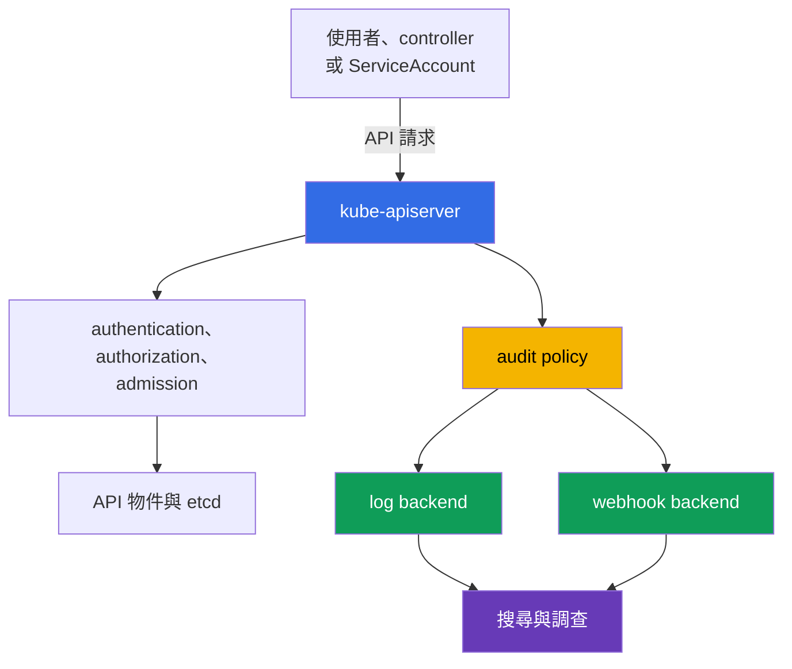

[Русская версия](ru.md) · [Eng version](README.md) · [Versión en español](es.md) · [Version française](fr.md) · [Deutsche Version](de.md) · [ქართული ვერსია](ge.md) · [日本語版](jp.md)

# 第 14 章. Audit Logging

> **接下來。** 第 10-13 章說明了身分、權限、`Pod` 限制、Secret 與網路分段。即使有良好的預防性控制，仍須回答「誰在何時做了什麼」。Audit logging 為對 Kubernetes API 的請求建立追蹤紀錄，以支援調查與合規。這是 KCSA **Kubernetes Security Fundamentals** 領域的主題，權重為 22%。範例適用於 Kubernetes `v1.36`。

## 14.1 為何需要 Kubernetes API 稽核

Audit logging 記錄對 `kube-apiserver` 提出的請求事件。`kubectl`、controller、`ServiceAccount` 與其他用戶端的動作都會經過 API，例如建立 `Pod`、讀取 `Secret`、修改 `RoleBinding` 或刪除 `NetworkPolicy`。因此 audit log 可回答四個基本問題：

| 問題 | 事件資料範例 |
|---|---|
| 誰？ | `user.username` 中的使用者、群組或 `ServiceAccount` |
| 做了什麼？ | `verb`、資源以及 `objectRef` 中的物件 |
| 何時？ | 時間戳記與請求處理階段 |
| 結果如何？ | `responseStatus` 中的回應碼與原因 |



Audit 記錄的是對 Kubernetes API 的存取，而不是容器內的所有動作。例如，`Pod` 中的 shell 指令、系統呼叫或網路連線可能不會出現在 audit log 中。因此，稽核可補充但不能取代應用程式日誌、網路遙測與 runtime 偵測。

實用情境包括：找出誰授與了危險的 RBAC 權限、判定資源刪除的來源、檢查異常的 `Secret` 讀取，或建立事件的時間軸。對於合規，若日誌本身受到保護，免於修改與未授權讀取，稽核可提供可驗證的管理動作紀錄。

## 14.2 Audit policy：記錄的階段與層級

`audit policy` 定義要記錄哪些請求、在哪些階段記錄，以及記錄多少資料。它是 `kube-apiserver` 的設定，而非通常透過 `kubectl` 建立的物件。Policy 規則按順序比對：套用第一個符合的規則。因此，針對敏感資源的狹義規則應置於廣泛的預設規則之前。

一個請求可以經過以下階段：

| 階段 | 意義 |
|---|---|
| `RequestReceived` | API Server 已接收請求，但尚未完成處理。 |
| `ResponseStarted` | 已開始傳送回應，特別適用於長時間執行的 `watch` 請求。 |
| `ResponseComplete` | 處理已完成，最終狀態已知。 |
| `Panic` | API Server handler 異常終止。 |

對大多數調查而言，`ResponseComplete` 更有價值：它將動作與最終結果連結起來。記錄每個短暫請求的所有階段會增加資料量，且常造成重複。Policy 可以透過 `omitStages` 排除不必要的階段。

記錄層級與階段回答的是不同問題。階段表示**何時**建立事件，層級表示事件中放入**多少**資訊。

| 層級 | 保留的內容 | 典型用途與界限 |
|---|---|---|
| `None` | 無 | 用於刻意排除的雜訊，例如個別 health 請求；過度廣泛的排除會造成盲點。 |
| `Metadata` | identity、URI、動詞、物件參照、時間與狀態，但不含 body | 對大多數 API 呼叫而言安全的基準層級。 |
| `Request` | `Metadata` 與 request body | 適用於變更意圖很重要的狹義情況；body 可能含有敏感資料。 |
| `RequestResponse` | `Request` 與 response body | 最完整，但成本與風險最高的層級；僅在有合理 forensic 需求時使用。 |

一項特別陷阱是：對 `Secret` 使用 `RequestResponse` 可能將密碼或 token 寫入日誌。對 `Secret` 的存取通常選擇 `Metadata`，以便看見事實、執行者、物件與結果而不揭露其值。同樣地，對頻繁的 `watch` 採用高層級，可能產生大量資料流，卻沒有相稱的效益。

## 14.3 有用訊號、雜訊與 backend

Audit log 應有助於調查，而不應成為另一個洩漏與成本來源。有用的訊號通常與安全變更或重要資源的存取有關：修改 `Role`、`ClusterRoleBinding`、`ServiceAccount`、`Secret`、`NetworkPolicy`，或使用提升權限的 `Pod`。

頻繁的就緒檢查、一般 controller 請求與長時間 `watch` 會產生雜訊。不應不加思考地停用整個 API 路徑。較安全的做法是：僅排除特定且可理解的 endpoints，保留 `Metadata` 的 catch-all 規則，並定期檢討事件量。

| 決策 | 優點 | 注意事項 |
|---|---|---|
| 預設使用 `Metadata` | 以較低的 body 揭露風險提供 identity、動作與 outcome | 不會顯示已修改物件的內容 |
| 選擇性 `Request` | 有助於理解關鍵變更的意圖 | 應依資源、namespace 與動詞限制範圍 |
| 對已知雜訊使用 `None` | 降低儲存成本 | 規則過於廣泛時可能隱藏重要動作 |
| `RequestResponse` | 提供最完整的情境 | 造成最高的資料量、成本與洩漏風險 |

Kubernetes 支援兩個主要的事件傳送方向：

- **log backend** 將 JSON 事件寫入 control plane 節點上的本機檔案。它適合初始收集且很簡單，但節點與檔案必須受到保護、輪替並傳送至集中式儲存。
- **webhook backend** 會透過 HTTPS 將事件傳給外部 collector 或 SIEM。它簡化集中式搜尋與關聯，但需要 TLS、collector 的可靠性、傳送監控，以及評估 backend 無法使用對 API 的影響。

Policy 與 backend 的角色不同：policy 決定形成哪些事件，而 backend 決定將它們送往何處。無論選擇何種路徑，讀取日誌的權限都應限制：audit log 可能包含使用者名稱、位址、基礎架構詳細資料，以及在不謹慎的 policy 下出現的 request body。

## 14.4 閱讀事件、runtime 偵測與調查

進行調查時，通常會將事件當作 JSON 閱讀，並尋找時間、identity、動詞、物件、IP 位址與狀態的組合。單一請求的不同階段會以 `auditID` 結合。

除 `user.username`、`verb`、`objectRef` 與 `responseStatus` 外，audit 事件也可能包含用戶端情境欄位，可協助區分預期的自動化用戶端與非預期用戶端：

| 事件欄位 | 顯示內容 |
|---|---|
| `user.username` | 呼叫者 identity：使用者、群組或 `ServiceAccount` |
| `verb` | 已執行的動作，例如 `get`、`list`、`delete` |
| `objectRef` | 受影響的資源、namespace 與物件名稱 |
| `sourceIPs` | 請求來源的網路位址 |
| `userAgent` | 用戶端字串，例如特定 `kubectl` 版本或 controller/automation 名稱 |
| `responseStatus` | 最終回應的代碼與原因 |
| `auditID` | 將單一請求的各階段連結起來的識別碼 |

`sourceIPs` 與 `userAgent` 僅適合作為**關聯情境**，而非特定 workload 的證據。`userAgent` 由用戶端設定，不應視為可信；在 `sourceIPs` 中，`X-Forwarded-For` / `X-Real-Ip` 的值可能由用戶端偽造，只有鏈結末端的實際 remote address 例外。若要歸因至特定 `Pod` 或 `CronJob`，請將 audit event 與已驗證的 identity、workload metadata、可信任的 proxy/network telemetry 及其他日誌相互關聯。

```json
{
  "level": "Metadata",
  "auditID": "b9d0-example",
  "stage": "ResponseComplete",
  "user": {"username": "system:serviceaccount:shop:api"},
  "verb": "get",
  "objectRef": {"resource": "secrets", "namespace": "shop", "name": "payments"},
  "responseStatus": {"code": 200}
}
```

由此事件可知，指定的 identity 已成功讀取特定的 `Secret`，但 `Metadata` 層級不會揭露其內容。僅憑 `200` 代碼並不能證明濫用。分析人員會將事件與預期的應用程式行為、部署時間、RBAC、source IP 及其他日誌相互關聯。

例如 Falco 的 runtime 偵測器回答的是另一類問題：執行期間在工作節點或容器內發生什麼事。它可察覺 shell 啟動、存取意外檔案或可疑的系統呼叫。反之，Audit logging 顯示 API 動作。這些來源的結合有助於調查：關於遭入侵容器的 runtime 事件，加上隨後讀取 `Secret` 的 audit 事件，可提供更完整的圖像。

基本調查順序：

1. 記錄時間、受影響資源與可疑 identity。
2. 尋找具有相符 `objectRef`、`verb` 與 `auditID` 的 `ResponseComplete` 事件。
3. 檢查 identity 是否透過 RBAC 具有預期權限，以及活動是否已排程。
4. 將結果與 runtime、網路、雲端及 application log 相互關聯。
5. 限制後續風險：撤銷 token、縮小 RBAC、隔離 workload，或依回應程序保存 evidence。

## 14.5 實務上的應用方式

平台團隊首先定義稽核目標：哪些動作需要證據、需要何種保存期限，以及誰有權讀取事件。接著建立具少量明確規則的 policy：僅排除已知安全的雜訊、以 `Metadata` 作為基準層級，並另外保護 `Secret` 以避免記錄 body。

在 production 中，audit 事件會從本機緩衝區或 webhook 傳送至集中式儲存。團隊會在其中設定受限存取、retention、備援、防竄改保護，以及沒有新事件時的警示。Audit policy 與 API Server 設定的變更本身也視為敏感操作，並受到控制。

定期檢查資料流很有用：執行安全的測試 API 動作，並確認儲存中存在具備正確 identity、資源、層級與狀態的事件。這項檢查的目標不是收集最大量的 JSON，而是確信在事件發生時會出現 evidence。

## 14.6 Exam vocabulary / 迷你詞彙表

| 術語 | 含義 |
|---|---|
| audit event | `kube-apiserver` 對 Kubernetes API 請求處理的紀錄。 |
| audit policy | 選擇 audit 層級與階段的有序規則集合。 |
| `auditID` | 將單一請求不同階段的事件連結起來的識別碼。 |
| stage | 請求處理的時點：`RequestReceived`、`ResponseStarted`、`ResponseComplete` 或 `Panic`。 |
| level | 事件中的資料量：`None`、`Metadata`、`Request` 或 `RequestResponse`。 |
| log backend | 將 audit 事件寫入本機檔案的 backend。 |
| webhook backend | 將 audit 事件傳送給 HTTPS collector 或 SIEM 的 backend。 |
| runtime detection | 在節點或容器中，於執行期間偵測可疑活動。 |

## 14.7 Exam Essentials / 本章重點

- Audit logging 記錄對 Kubernetes API 的請求，有助於判定誰在何時做了什麼，以及結果如何。
- Audit 無法取代 runtime、網路與 application log，因為它看不到 `Pod` 內及工作節點上的所有動作。
- 階段決定記錄時機，而層級決定資料量。對調查而言，通常以 `ResponseComplete` 最重要。
- `Metadata` 適合作為安全的預設值。由於資料量與記錄敏感資料的風險，`Request`，尤其是 `RequestResponse`，應狹義使用。
- 對 `Secret` 通常選擇 `Metadata`，而非含有 body 的層級。
- `log backend` 與 `webhook backend` 解決事件傳送問題。兩者都需要存取保護、儲存、監控與 retention。
- 有用的調查會將 audit 事件與 RBAC、runtime 偵測及其他遙測資料相互關聯。

## 14.8 不要混淆，以及在考試中的呈現方式

KCSA 問題經常測試機制的界限，而不是精確的 API Server flags。請區分層級與階段：`Metadata` 不含 body，`Request` 含有 request body，`RequestResponse` 則同時含有 request 和 response body。若題目提及 `Secret`，選擇含 body 的層級通常會造成洩漏風險。

另一個常見問法是詢問哪一種來源能解釋 Kubernetes 資源的變更。正確答案是 API Server Audit logging。容器內 shell 或系統呼叫需要 runtime 偵測器，而不是 audit。若題目出現異常 API 動作，請尋找 identity、`verb`、`objectRef`、時間與 `responseStatus`。

## 14.9 自我檢查問題

### 1. Audit logging 的哪項能力最直接有助於判定誰刪除了 `Deployment`？

   - a. Audit policy，會自動禁止叢集所有 API 用戶端執行任何 `delete` 操作。

   - b. 包含特定 API 請求的 identity、`verb`、`objectRef` 與處理結果的 audit event。

   - c. 請求完成後收集的 runtime metric，其中包含被刪除 `Pod` 的 CPU 與 memory。

   - d. 被刪除 workload 容器的 image metadata，其中包含 digest 與建置時間。

<details>
<summary>答案與說明</summary>

**正確答案：b.** API Server audit event 將 identity 與動作及物件連結，並顯示處理結果。它會記錄 evidence，但本身不會阻止動作。

</details>

### 2. 哪個 audit 層級記錄請求與回應的 metadata，但不含 body？

   - a. `Request`。

   - b. `RequestResponse`。

   - c. `None`。

   - d. `Metadata`。

<details>
<summary>答案與說明</summary>

**正確答案：d.** `Metadata` 包含 identity、動作、物件、時間與狀態資訊，不含 request 和 response body。`Request` 會增加 request body，而 `RequestResponse` 會增加兩個 body。

</details>

### 3. 為何對 `Secret` 的存取通常不選擇 `RequestResponse`？

   - a. 此層級可能記錄 request 與 response bodies，其中 Secret 可能含有敏感值。

   - b. 此層級僅保留事件 metadata，因此完全無法記錄 request 或 response body。

   - c. 在事件進入 audit pipeline 前，此層級會停用對 Secret 請求的 authentication。

   - d. 即使 Kubernetes authorization 允許讀取，此層級也會禁止 API Server 向用戶端回傳 Secret 物件。

<details>
<summary>答案與說明</summary>

**正確答案：a.** `RequestResponse` 可保留 request 與 response bodies。對 Secret 而言，這會造成敏感值進入 audit storage 的風險。通常較安全的做法是，在 forensic requirements 不要求更多資料時，以 `Metadata` 等方式保留足夠的 audit context 而不含 Secret 內容。

</details>

### 4. 如果在已執行的容器內啟動互動式 shell，且該動作未呼叫 Kubernetes API，哪一種來源最能偵測到它？

   - a. API Server Audit logging。

   - b. `NetworkPolicy`。

   - c. Runtime 偵測器，例如 Falco。

   - d. `RoleBinding`。

<details>
<summary>答案與說明</summary>

**正確答案：c.** Audit 能看見 API 請求。Runtime 偵測器會觀察執行期間的活動，例如容器程序與系統呼叫。

</details>

> **下一步。** 如需實務設定 audit policy、backend、輪替、webhook 與事件驗證，請研讀 CKS 的第 32 章 Kubernetes audit logs。

[目錄](../README_TW.md) · [第 13 章](../13/tw.md) · [第 15 章](../15/tw.md)
