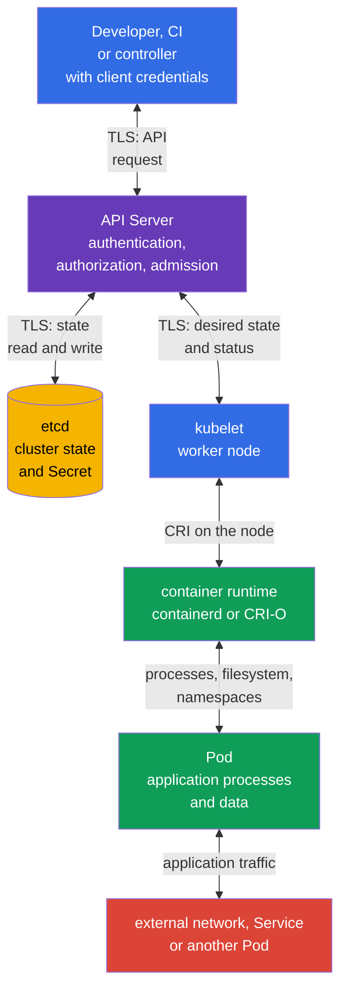

[Русская версия](ru.md) · [Versión en español](es.md) · [Version française](fr.md) · [Deutsche Version](de.md) · [ქართული ვერსია](ge.md) · [繁體中文版](tw.md) · [日本語版](jp.md)

# Chapter 15. Trust boundaries, data flows, and the threat model

> **What comes next.** Chapters 10-14 examined individual controls: identities and RBAC, `Pod` security, `Secret`, network segmentation, and auditing. Now they need to be connected to what we protect, from whom, and at which point in the data flow. Threat modeling makes that choice explicit. This is a topic in the KCSA **Kubernetes Threat Model** domain, weighted at 16%. The course examples are based on Kubernetes `v1.36`.

## 15.1 What a threat model is and why Kubernetes needs one

A threat model is a structured description of a system, its assets, actors, data flows, trust boundaries, and possible abuses. It does not predict every attack and does not replace a security control. Its purpose is simpler: to ask the right questions before an incident and choose controls for a specific risk.

In Kubernetes, the system is distributed: a developer or CI sends a request to the API, the API Server stores state in etcd, the `kubelet` on a worker node receives the desired state, and the container runtime starts a `Pod`. Application network requests, access to `Secret`, registry requests, and observability are separate flows. Therefore, saying that “the cluster is secure” without naming a boundary is too vague.

It is useful to start with four questions:

1. **Which assets are valuable?** For example, customer data, `Secret`, `ServiceAccount` tokens, images, configuration, API access, and compute resources.
2. **Who acts?** A developer, CI, an application user, an administrator, a cloud provider, a compromised `Pod`, or an external attacker.
3. **Which paths are available?** The Kubernetes API, the network between `Pod`, the kubelet API, the container runtime socket, a volume, an etcd backup, or a registry.
4. **Where does the decision trust input data or an identity?** At the client-API, API-etcd, API-kubelet, runtime-`Pod`, namespace-to-namespace, and network egress boundaries.

The result does not have to be a large document. For a small team, a diagram, a threat table, and a list of control owners are enough. It is important to update the model when adding a new `Namespace`, external ingress, webhook, cloud role, or access to sensitive data.

| Model element | Question | Kubernetes example |
|---|---|---|
| Asset | What could be lost or changed? | A `Secret` containing a payment API key |
| Actor | Whose action are we analyzing? | CI with a kubeconfig or an application `ServiceAccount` |
| Data flow | Where is information sent? | `kubectl` sends a request to the API Server over TLS |
| Trust boundary | Where does the trust level change? | The API Server verifies a client's token and RBAC permissions |
| Threat | Which unwanted outcome is possible? | A compromised token creates a `privileged` `Pod` |
| Control | What reduces the likelihood or impact? | MFA/OIDC, RBAC, PSA, audit logging, and token rotation |

Threat modeling helps avoid confusing a control with an asset. For example, `NetworkPolicy` restricts a network path, but it does not hide a `Secret` from a subject with the `get secrets` permission. Encryption at rest protects a record in etcd, but it does not replace API client authentication. A single risk often has multiple layers of defense.

## 15.2 Cluster trust boundaries and data flows

A **trust boundary** is a place where data or a request moves from a less trusted actor to a more trusted one, or changes its authorization context. At this boundary, identity, permissions, integrity, and, for sensitive data, confidentiality are checked. TLS is important for protecting the channel, but it does not determine whether the sender is allowed to perform an action.

In a typical cluster, the API Server is the central boundary. It authenticates a client, authorizes a request, and applies admission controls before state changes. etcd is not intended for direct access by ordinary users: it stores cluster state and should trust only a protected API Server. The `kubelet` receives or watches objects assigned to its worker node through the API and passes instructions to the local container runtime. The runtime creates container processes and isolation, while a `Pod` executes application code that can have its own network, volumes, and token.



The arrows in the diagram are bidirectional because components exchange requests and responses. This does not mean they have the same trust level. For example, the API Server writes state to etcd, but etcd must not accept administrative requests from a `Pod`; the runtime manages a container, but the application must not gain access to its socket.

| Boundary | What can go wrong | Conceptual controls |
|---|---|---|
| client ↔ API Server | stolen kubeconfig, spoofed identity, overly broad permissions | TLS, strong authentication, short-lived credentials, RBAC, audit logging |
| API Server ↔ etcd | state reading or modification, snapshot exposure | TLS, restricted network and host access, encryption at rest, protected backups |
| API Server ↔ kubelet | kubelet API abuse or status spoofing | mutual authentication, kubelet authorization, worker-node protection |
| kubelet ↔ runtime | access to the CRI socket enables container control | socket access only for system components, node hardening, monitoring |
| runtime ↔ `Pod` | container escape, dangerous mounts or privileges | PSS/PSA, `securityContext`, seccomp, AppArmor, minimal capabilities |
| `Pod` ↔ network and data | MITM, lateral movement, exfiltration | `NetworkPolicy`, TLS or mTLS, DNS controls, RBAC, and `Secret` separation |

Not all flows follow the direct line shown in the diagram. Controllers use the API as clients, an admission webhook receives a call from the API Server, CSI and CNI can access a worker node, and an application contacts an external service. Add these connections when they exist in the specific platform. Otherwise, an “invisible” webhook or cloud role becomes an unaccounted trust boundary.

## 15.3 STRIDE, MITRE ATT&CK for Containers, and the kill chain

> **Important for KCSA domain mapping.**
> Linux Foundation assigns **Threat Modelling Frameworks** to the
> **Compliance and Security Frameworks** domain, rather than to the
> **Kubernetes Threat Model** domain.
>
> STRIDE, MITRE ATT&CK for Containers, and the kill chain are used in this chapter
> as cross-domain analytical context for working with already identified
> trust boundaries and data flows. On the exam, questions specifically about the purpose of
> threat-modeling frameworks should be assigned to Compliance.
>
> The **Kubernetes Threat Model** domain itself covers trust boundaries/data flow,
> persistence, denial of service, malicious code / compromised applications,
> attacker on the network, access to sensitive data, and privilege escalation.
> Detailed exam-oriented review of framework competencies is in
> [chapter 19](../19/README.md).

Frameworks are not interchangeable lists of settings: each has its own scope and question that it answers. First is an overview of what each solves, followed by a detailed examination of STRIDE and ATT&CK for Containers separately.

| Framework | Which question does it answer? | Unit of analysis | When to apply it |
|---|---|---|---|
| STRIDE | Which threat classes are possible for a specific flow or boundary? | architecture element (component, data flow, trust boundary) | during design or architecture review, before an incident |
| MITRE ATT&CK for Containers | Which attack tactics and techniques does an attacker already use or could use in a container environment? | observable attacker behavior (tactic → technique) | when building detection, investigating an incident, or assessing runtime security coverage |
| Kill chain | At which stage of an attack is it most effective to stop it? | sequence of stages in one attack (from preparation to objective) | when choosing where to place preventive and detective controls relative to each other |

**STRIDE** and **ATT&CK for Containers** do not compete; they cover different sides of the same picture: STRIDE is “threat-first” architecture analysis applied in advance, while ATT&CK is “attacker-first” behavior analysis applied to observed or hypothetical actions. The **kill chain** is not another list of threats or techniques, but a way to order STRIDE and ATT&CK results in time: it shows at which stage a specific threat from STRIDE or technique from ATT&CK will actually appear, and helps decide where a preventive control is worthwhile and where a detective control is needed.

**Combination best practice.** Do not try to merge all three frameworks into one document or table: they use different axes of analysis, and forced consolidation blurs the question each one answers. A practical sequence is: (1) for a new architecture or a significant change, first apply STRIDE to every element and flow - this produces a list of threats and trust boundaries; (2) for threats realistic in your environment, map them to ATT&CK for Containers tactics and techniques - this gives concrete observable signals and existing detection coverage; (3) arrange the result along the kill chain to see which attack stages have preventive control coverage, which have only detective coverage, and where a gap exists. STRIDE and ATT&CK do not need to match one-to-one: one STRIDE threat, such as Elevation of Privilege, can manifest through several ATT&CK techniques, such as a privileged container, hostPath, or capability abuse. This is expected, not an analysis error. A detailed mapping to frameworks and compliance is provided in chapter 19.

### STRIDE: six questions for every element

| Category | Question for the cluster | Example | Suitable controls |
|---|---|---|---|
| Spoofing | Can an attacker impersonate someone else? | a stolen `ServiceAccount` token is used as legitimate | authentication, token rotation, and limiting token issuance |
| Tampering | Can they alter data or configuration without detection? | a modified `Deployment` starts a different image | RBAC, admission, image signing, audit logging |
| Repudiation | Can we prove who performed an action? | a `Secret` is deleted, but no record identifies the author | audit policy, protected storage, and log correlation |
| Information Disclosure | Can sensitive data be exposed? | access to an etcd backup reveals `Secret` | encryption at rest, RBAC, backup protection |
| Denial of Service | Can a resource be exhausted or availability disrupted? | a `Pod` consumes a worker node's CPU and memory | `requests`, `limits`, `ResourceQuota`, monitoring |
| Elevation of Privilege | Can a subject obtain more permissions? | a container with `hostPath` and an unnecessary capability affects the node | PSS/PSA, `securityContext`, least privilege, node hardening |

STRIDE does not claim that every element is necessarily vulnerable. It prevents an entire class of questions from being missed. For example, for the API Server, spoofing and tampering are examined through identities and RBAC, while for the audit log, repudiation and storage integrity are especially important.

### ATT&CK for Containers and attack progression

MITRE ATT&CK for Containers groups attacker behavior into tactics and techniques. At the associate level, it is useful to recognize the logic of the chain rather than memorize technique identifiers. ATT&CK evolves: the names below were checked against Containers Matrix v19, but they must be checked again in the official matrix before operational mapping. A single incident can pass through several tactics and does not have to include every one.

| Stage or tactic | Possible action in Kubernetes | What to look for or restrict |
|---|---|---|
| Initial Access | a vulnerable application accepts a malicious request, or a stolen kubeconfig enters the cluster | application protection, authentication, external surface, audit events |
| Execution | a shell or unexpected process runs in a container | runtime detection, process logs, minimal image |
| Persistence | a `CronJob`, webhook, static `Pod`, or token is retained | change review, RBAC, audit logging, control-plane monitoring |
| Privilege Escalation | a container obtains `privileged`, `hostPath`, or access to the runtime socket | PSA, admission, `securityContext`, node restrictions |
| Defense Impairment | a protection mechanism is disabled or changed | configuration protection, separate log storage, change auditing |
| Credential Access | a `Secret`, token, or kubeconfig is read | RBAC, encryption at rest, secure delivery and rotation |
| Discovery | `Namespace`, `Pod`, services, and API resources are enumerated | least privilege, auditing unusual `list` and `watch` |
| Lateral Movement | a compromised `Pod` contacts another service or node | segmentation, `NetworkPolicy`, mTLS, kubelet protection |
| Data access and exfiltration (data-flow lens, not a Containers Matrix tactic) | data is read from a volume and sent to an external endpoint | egress restriction, TLS, network and data monitoring |
| Impact | workloads are deleted, data is encrypted, or resources are exhausted | backups, quotas, limits, alerts, and a response plan |

The kill chain is useful for the question “at which stage should the attack be stopped?” For example, image scanning and signing reduce the chance of initial access through a malicious artifact; PSA reduces the path to privilege escalation; `NetworkPolicy` restricts lateral movement; audit and runtime detection provide evidence at the Execution and Defense Impairment stages. No single control covers the entire chain.

It is important not to turn ATT&CK into an automatic verdict. Running `sh` in a container, making a `list pods` request, or sending outbound HTTPS traffic can be normal. Context comes from the workload owner, namespace, time, image, API request initiator, and expected application behavior.

## 15.4 Attack tree: obtain production secrets

An attack tree turns a general threat into testable paths. The objective is not to list every exploit, but to choose a control and evidence for every realistic step.

```text
Goal: obtain production secrets
├── steal kubeconfig
│   └── use excessive RBAC
├── compromise a Pod
│   ├── read the ServiceAccount token
│   ├── call the Kubernetes API
│   └── use excessive permissions
├── obtain an etcd backup
│   └── Secret is not protected by encryption at rest
└── compromise CI/CD
    └── inject a malicious artifact
```

| Attack path | Preventive control | Detective control | Evidence |
|---|---|---|---|
| A stolen `ServiceAccount` token reads a `Secret` | separate workload identity and least-privilege RBAC | Kubernetes API audit | audit event: identity, `get`, `secrets`, response status |
| A shell in a container searches for credentials | minimize available workload credentials: do not mount unnecessary `Secret`, use `automountServiceAccountToken: false` if the Kubernetes API is not needed, and assign a separate workload identity with least-privilege RBAC | Falco or another runtime detector | runtime event for shell activity or credential-file access |
| A malicious image passes CI | digest, SBOM, signature/provenance, and admission verification | registry/CI/admission logs | verified attestation and admission decision |
| An etcd backup exposes data | encryption at rest, backup protection, and access protection | backup-access audit and storage-control review | backup report/access trail |

No preventive control makes a path impossible by itself: RBAC cannot see a shell inside a container, and runtime detection more often detects an action already in progress. On the exam, first name the asset and attack path, then choose the control at the enforcement point and the evidence that confirms it.

## 15.5 How to apply a threat model to your cluster

Practical application starts with a limited scenario, not a list of all Kubernetes components. For example: “CI deploys an online store into the `payments` namespace, the application reads a payment token and contacts an external provider.” For this scenario, you can create a short working table.

| Step | What is recorded | Example result |
|---|---|---|
| 1. Define scope | system, namespace, integrations, and owners | `payments`, CI, registry, payment API, platform team |
| 2. List assets | what requires confidentiality, integrity, or availability | provider token, orders, application image, resource quota |
| 3. Draw flows | who contacts whom and with which credentials | CI → API Server; `Pod` → payment API; API Server → etcd |
| 4. Mark boundaries | where trust or permissions change | CI-API, API-etcd, `Pod`-external network, `Pod`-`Secret` |
| 5. Analyze threats | STRIDE and likely ATT&CK actions | stolen token, image tampering, data egress, DoS |
| 6. Choose and assign controls | preventive, detective, and recovery controls | RBAC and PSA, `NetworkPolicy`, audit, backups, control owner |
| 7. Review changes | what changed after a new service or incident | add a new webhook and its permissions to the model |

Consider three typical decisions. If CI has `cluster-admin`, the risk of tampering is too high: a separate `ServiceAccount` and a limited `Role` reduce the blast radius of an error or stolen credential. If an application has unrestricted egress, the risk of exfiltration and lateral movement is higher: default-deny and targeted `NetworkPolicy` rules limit known paths, while TLS or mTLS protects the allowed channel. If a `Secret` is accessible to every `Pod` in a namespace, the disclosure risk is high: separate identities, narrow RBAC permissions, encryption at rest, and rotation reduce the impact.

Prioritization depends on damage and threat realism. A production cluster processing payments usually requires protecting administrative access, secrets, worker nodes, and external flows first. A test environment is not an exception if it contains production credentials or shares a control plane. The threat model must reflect the actual architecture, not the formal environment name.

## 15.6 How this is applied in practice

A platform team maintains a baseline data-flow diagram for typical workloads and separate diagrams for critical integrations. When reviewing a new component, it asks a short set of questions: which API permissions does it receive, which `Secret` does it read, where can it connect over the network, does it run privileged code, and who will see its events?

Threats are tied to measurable checks. For the client-API boundary, these are RBAC review and audit events. For a worker node, they are access control for kubelet and the runtime socket, PSS/PSA, and the `securityContext` state. For data, they are etcd encryption, backup protection, and minimal `secrets` permissions. For the network, they are understandable egress and ingress connectivity, `NetworkPolicy`, and TLS or mTLS where traffic is sensitive.

The model also helps investigation. When an alert reports an unexpected process, the team maps it to an ATT&CK stage and the diagram: which `Pod`, image, `ServiceAccount`, node, and network route were involved. This is faster than starting an incident with an unrestricted search across all logs.

## 15.7 Exam vocabulary / Mini-glossary

| Term | Meaning |
|---|---|
| threat model | A description of a system's assets, actors, flows, trust boundaries, threats, and controls. |
| trust boundary | A transition point between actors or contexts with different trust levels. |
| data flow | The transfer of a request, state, or data between components. |
| STRIDE | A framework with the categories Spoofing, Tampering, Repudiation, Information Disclosure, Denial of Service, and Elevation of Privilege. |
| MITRE ATT&CK for Containers | A knowledge base of tactics and techniques describing attacker behavior in a container environment. |
| kill chain | A model of the sequence of attack stages from initial access to impact. |
| lateral movement | An attacker's move from a compromised resource to another resource. |
| attack surface | The set of accessible paths through which a system can be attacked. |

## 15.8 Exam Essentials / Chapter summary

- A threat model connects a system's assets, actors, data flows, trust boundaries, threats, and controls.
- In Kubernetes, key boundaries exist between the client and API Server, API Server and etcd, API Server and kubelet, kubelet and runtime, runtime and `Pod`, as well as between `Pod`, the network, and data.
- TLS protects the transmission channel, but authentication, authorization, and admission are needed to decide whether an action is allowed.
- STRIDE, MITRE ATT&CK for Containers, and the kill chain help analyze threats and attack progression, but in the official KCSA domain mapping, **Threat Modelling Frameworks belong to Compliance and Security Frameworks**; here they are used as cross-domain context.
- One control does not stop an entire attack: RBAC, PSA, encryption, segmentation, audit, runtime detection, and backups work in layers.
- A useful threat model should be short, connected to real flows, and updated when the architecture changes.

## 15.9 Do not confuse these, and how they appear on the exam

In an MCQ (multiple choice question), you are often given one component or scenario and asked to choose the most appropriate control. First identify the asset and boundary: is it API access, etcd data, `Pod` permissions, worker-node access, or a network flow? Then distinguish prevention from detection and recovery.

Typical traps:

- treating TLS as a replacement for RBAC: TLS confirms a protected channel, but does not restrict an identity's permissions;
- treating `NetworkPolicy` as protection for etcd data or a `Secret` read through the API;
- assuming etcd should be directly accessible to users for normal cluster management;
- choosing one measure for every stage of the kill chain;
- treating any process, `list` API request, or HTTPS traffic as an attack without context;
- confusing STRIDE as a list of settings rather than a method of asking questions about threats.

If answer options mix frameworks, remember their purposes: STRIDE classifies threats, ATT&CK for Containers describes adversary tactics and techniques, and the kill chain shows attack progression. These models complement rather than compete with each other.

## 15.10 Self-check questions

### 1. Which component is usually the central trust boundary for Kubernetes management requests?

   - a. Application `Pod`.

   - b. container runtime.

   - c. API Server.

   - d. CNI plugin.

<details>
<summary>Answer and explanation</summary>

**Correct answer: c.** The API Server authenticates the client, checks its permissions, and applies admission before state changes. The runtime and CNI are important for other boundaries, but they are not the usual processing point for Kubernetes API requests.

</details>

### 2. Which control most directly reduces the risk that a subject with a stolen kubeconfig creates arbitrary `Deployment` objects across the cluster?

   - a. RBAC with least privilege for that identity.

   - b. `ResourceQuota`.

   - c. Encryption at rest for etcd.

   - d. `NetworkPolicy` for the application namespace.

<details>
<summary>Answer and explanation</summary>

**Correct answer: a.** Least-privilege RBAC limits which API actions the compromised identity can perform. The other controls are important, but do not determine the permission to `create deployments` through the API.

</details>

#### Cross-domain review: Compliance and Security Frameworks

### 3. Which STRIDE category best describes reading a `Secret` from an unprotected etcd snapshot?

   - a. Information Disclosure.

   - b. Denial of Service.

   - c. Tampering.

   - d. Repudiation.

<details>
<summary>Answer and explanation</summary>

**Correct answer: a.** This scenario exposes sensitive data. Reducing the risk requires protecting access to etcd and backups, as well as encryption at rest. Repudiation concerns the inability to identify who performed an action.

</details>

### 4. What is the most accurate relationship between STRIDE and MITRE ATT&CK for Containers?

   - a. STRIDE classifies threat classes, while ATT&CK for Containers describes attacker tactics and techniques.

   - b. Both frameworks automatically block `privileged` `Pod` objects.

   - c. STRIDE is a way to encrypt data, and ATT&CK replaces RBAC.

   - d. ATT&CK applies only to cloud infrastructure outside Kubernetes.

<details>
<summary>Answer and explanation</summary>

**Correct answer: a.** STRIDE helps systematically analyze threats at boundaries and flows. ATT&CK for Containers provides a language for describing observed adversary behavior. Neither is a policy enforcement mechanism.

</details>

#### Return to Kubernetes Threat Model

### 5. Which scenario best illustrates lateral movement after a `Pod` is compromised?

   - a. A compromised process restarts the normal HTTP listener inside the same container after a local failure.
   - b. An attacker changes an application file inside an already compromised `Pod` without accessing other workloads or systems.
   - c. An external client scans a public Ingress endpoint but has not yet obtained access to any workload.
   - d. A compromised `Pod` uses an available network path or credential to access an internal service in another workload zone.

<details>
<summary>Answer and explanation</summary>

**Correct answer: d.** Lateral movement is a transition from an already compromised point to other workloads, services, or trust zones. Network segmentation, narrowly scoped identities, and least privilege reduce such paths.

</details>

> **Where next.** For an overview of frameworks, STRIDE, MITRE ATT&CK for Containers, and compliance, go to [KCSA chapter 19](../19/README.md). Practical security boundaries and the 4C model are covered in CKS chapter 02, while signal correlation and investigation of attack phases are covered in CKS chapter 30.

[Table of contents](../README.md) · [Chapter 14](../14/README.md) · [Chapter 16](../16/README.md)
