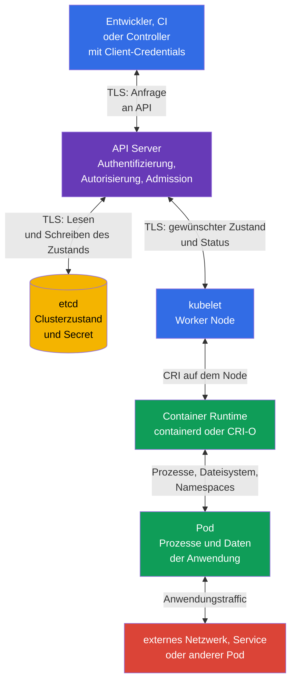

[Русская версия](ru.md) · [Eng version](README.md) · [Versión en español](es.md) · [Version française](fr.md) · [ქართული ვერსია](ge.md) · [繁體中文版](tw.md) · [日本語版](jp.md)

# Kapitel 15. Vertrauensgrenzen, Datenflüsse und Bedrohungsmodell

> **Was als Nächstes kommt.** Die Kapitel 10-14 behandelten einzelne Kontrollen: Identitäten und RBAC, Pod-Sicherheit, Secret, Netzwerksegmentierung und Audit. Nun müssen wir sie mit dem verbinden, was wir schützen, vor wem und an welcher Stelle des Datenflusses. Ein Bedrohungsmodell macht diese Auswahl explizit. Dies ist ein Thema der KCSA-Domain **Kubernetes Threat Model** mit einer Gewichtung von 16 %. Die Beispiele im Kurs beziehen sich auf Kubernetes `v1.36`.

## 15.1 Was ein Bedrohungsmodell ist und warum es in Kubernetes benötigt wird

Ein Bedrohungsmodell ist eine strukturierte Beschreibung eines Systems, seiner Assets, Akteure, Datenflüsse, Vertrauensgrenzen und möglicher Missbrauchsfälle. Es sagt nicht alle Angriffe voraus und ersetzt keine Sicherheitskontrolle. Sein Ziel ist einfacher: Vor einem Incident die richtigen Fragen zu stellen und Kontrollen für ein konkretes Risiko auszuwählen.

In Kubernetes ist das System verteilt: Ein Entwickler oder CI sendet eine Anfrage an die API, der API Server speichert den Zustand in etcd, `kubelet` auf dem Worker Node erhält den gewünschten Zustand und die Container Runtime startet den `Pod`. Daneben gibt es Netzwerkaufrufe von Anwendungen, Zugriff auf `Secret`, Zugriffe auf die Registry und Observability. Daher ist die Aussage „der Cluster ist geschützt“ ohne Angabe der Grenze zu vage.

Es ist sinnvoll, mit vier Fragen zu beginnen:

1. **Welche Assets sind wertvoll?** Zum Beispiel Kundendaten, `Secret`, `ServiceAccount`-Token, Images, Konfiguration, API-Zugriff und Rechenressourcen.
2. **Wer handelt?** Entwickler, CI, Anwendungsnutzer, Administrator, Cloud-Anbieter, ein kompromittierter `Pod` oder ein externer Angreifer.
3. **Welche Wege sind verfügbar?** Kubernetes API, Netzwerk zwischen `Pod`, kubelet API, Container-Runtime-Socket, Volume, etcd-Backup, Registry.
4. **Wo vertraut die Entscheidung Eingabedaten oder einer Identität?** An den Grenzen Client-API, API-etcd, API-kubelet, Runtime-`Pod`, zwischen Namespace und beim Netzwerk-Egress.

Das Ergebnis muss kein großes Dokument sein. Für ein kleines Team reichen ein Diagramm, eine Bedrohungstabelle und eine Liste der Verantwortlichen für Kontrollen. Wichtig ist, das Modell zu aktualisieren, wenn ein neuer Namespace, externer Ingress, Webhook, eine Cloud-Rolle oder Zugriff auf sensible Daten hinzugefügt wird.

| Element des Modells | Frage | Kubernetes-Beispiel |
|---|---|---|
| Asset | Was geht verloren oder wird verändert? | `Secret` mit einem Schlüssel für die Zahlungs-API |
| Akteur | Wessen Handlung analysieren wir? | CI mit kubeconfig oder `ServiceAccount` der Anwendung |
| Datenfluss | Wohin werden Informationen übertragen? | `kubectl` sendet eine Anfrage über TLS an den API Server |
| Vertrauensgrenze | Wo ändert sich das Vertrauensniveau? | API Server prüft Client-Token und dessen RBAC-Rechte |
| Bedrohung | Welches unerwünschte Ergebnis ist möglich? | Kompromittierter Token erstellt einen `privileged` `Pod` |
| Kontrolle | Was verringert Wahrscheinlichkeit oder Auswirkungen? | MFA/OIDC, RBAC, PSA, Audit Logging und Token-Rotation |

Ein Bedrohungsmodell hilft, Kontrolle und Asset nicht zu verwechseln. Beispielsweise beschränkt `NetworkPolicy` einen Netzwerkweg, verbirgt aber kein `Secret` vor einem Subjekt mit der Berechtigung `get secrets`. Encryption at rest schützt den Eintrag in etcd, ersetzt jedoch nicht die Authentifizierung eines API-Clients. Ein Risiko hat oft mehrere Schutzschichten.

## 15.2 Vertrauensgrenzen und Datenflüsse des Clusters

Eine **Vertrauensgrenze** ist ein Ort, an dem Daten oder eine Anfrage von einem weniger vertrauenswürdigen Akteur zu einem stärker vertrauenswürdigen wechseln oder ihren Berechtigungskontext ändern. An einer solchen Grenze werden Identität, Rechte, Integrität und bei sensiblen Daten die Vertraulichkeit geprüft. TLS ist wichtig, um den Kanal zu schützen, entscheidet aber nicht, ob der Sender die Berechtigung für eine Aktion hat.

In einem typischen Cluster ist der API Server die zentrale Grenze. Er authentifiziert den Client, autorisiert die Anfrage und wendet Admission-Kontrollen an, bevor sich der Zustand ändert. etcd ist nicht für direkten Zugriff gewöhnlicher Benutzer vorgesehen: Es speichert den Clusterzustand und darf nur dem geschützten API Server vertrauen. `kubelet` bezieht oder beobachtet über die API die dem Worker Node zugewiesenen Objekte und übergibt Anweisungen an die lokale Container Runtime. Die Runtime erstellt Prozesse und die Isolation der Container, und der `Pod` führt Anwendungscode aus, der ein eigenes Netzwerk, Volumes und einen Token haben kann.



Die Pfeile im Diagramm sind bidirektional, weil Komponenten Anfragen und Antworten austauschen. Das bedeutet nicht, dass sie das gleiche Vertrauensniveau haben. Beispielsweise schreibt der API Server Zustand in etcd, doch etcd darf keine administrativen Anfragen von `Pod` annehmen; die Runtime verwaltet den Container, doch die Anwendung darf nicht ihren Socket erhalten.

| Grenze | Was schiefgehen kann | Konzeptionelle Kontrollen |
|---|---|---|
| Client ↔ API Server | gestohlene kubeconfig, gefälschte Identität, zu weitreichende Rechte | TLS, starke Authentifizierung, kurzlebige Credentials, RBAC, Audit Logging |
| API Server ↔ etcd | Lesen oder Ändern des Zustands, Snapshot-Leak | TLS, eingeschränkter Netzwerk- und Host-Zugriff, Encryption at rest, geschützte Backups |
| API Server ↔ kubelet | Missbrauch der kubelet API oder Manipulation des Status | gegenseitige Authentifizierung, kubelet-Autorisierung, Schutz des Worker Node |
| kubelet ↔ Runtime | Zugriff auf den CRI-Socket erlaubt die Steuerung von Containern | Socket-Zugriff nur für Systemkomponenten, Node Hardening, Monitoring |
| Runtime ↔ `Pod` | Container Escape, gefährliche Mounts oder Privilegien | PSS/PSA, `securityContext`, seccomp, AppArmor, minimale Capabilities |
| `Pod` ↔ Netzwerk und Daten | MITM, Lateral Movement, Exfiltration | `NetworkPolicy`, TLS oder mTLS, DNS-Kontrollen, RBAC und Trennung von `Secret` |

Nicht alle Flüsse verlaufen auf der direkten Linie des Diagramms. Controller nutzen die API als Clients, ein Admission Webhook erhält einen Aufruf vom API Server, CSI und CNI können mit dem Worker Node kommunizieren und die Anwendung greift auf einen externen Service zu. Beim Modellieren werden diese Verbindungen ergänzt, sofern sie auf der konkreten Plattform bestehen. Sonst wird ein „unsichtbarer“ Webhook oder eine Cloud-Rolle zu einer nicht berücksichtigten Vertrauensgrenze.

## 15.3 STRIDE, MITRE ATT&CK for Containers und Kill Chain

> **Wichtig für das KCSA-Domain-Mapping.**
> Linux Foundation ordnet **Threat Modelling Frameworks** der Domain
> **Compliance and Security Frameworks** zu, nicht der Domain
> **Kubernetes Threat Model**.
>
> STRIDE, MITRE ATT&CK for Containers und Kill Chain werden in diesem Kapitel
> als domänenübergreifender analytischer Kontext verwendet, um mit bereits bestimmten
> Trust Boundaries und Data Flows zu arbeiten. Prüfungsfragen speziell zum Zweck von
> Threat-Modelling-Frameworks sind Compliance zuzuordnen.
>
> Die Domain **Kubernetes Threat Model** selbst prüft Trust Boundaries/Data Flow,
> Persistence, Denial of Service, Malicious Code / Compromised Applications,
> Attacker on the Network, Access to Sensitive Data und Privilege Escalation.
> Die detaillierte prüfungsorientierte Wiederholung der Framework-Kompetenzen steht in
> [Kapitel 19](../19/de.md).

Die Frameworks sind keine austauschbaren Listen von Einstellungen: Jedes hat einen eigenen Anwendungsbereich und beantwortet eine eigene Frage. Zunächst folgt ein Überblick darüber, was jedes löst, anschließend eine detaillierte Betrachtung von STRIDE und ATT&CK for Containers separat.

| Framework | Welche Frage beantwortet es? | Analyseeinheit | Wann verwenden? |
|---|---|---|---|
| STRIDE | Welche Bedrohungsklassen sind für einen konkreten Fluss oder eine Grenze möglich? | Architekturelement (Komponente, Datenfluss, Vertrauensgrenze) | beim Entwurf oder Architektur-Review, vor einem Incident |
| MITRE ATT&CK for Containers | Welche Taktiken und Techniken verwendet ein Angreifer bereits oder kann er in einer Container-Umgebung verwenden? | beobachtbares Verhalten des Angreifers (Taktik → Technik) | beim Aufbau von Detection, bei Incident-Analyse, bei der Bewertung der Abdeckung des Runtime-Schutzes |
| Kill Chain | In welcher Phase der Entwicklung eines Angriffs lässt er sich am wirksamsten stoppen? | Abfolge der Phasen eines Angriffs (von Vorbereitung bis Ziel) | bei der Auswahl, wo preventive und detective controls zueinander platziert werden |

**STRIDE** und **ATT&CK for Containers** konkurrieren nicht, sondern decken verschiedene Seiten desselben Bildes ab: STRIDE ist eine Architektur-Analyse „von der Bedrohung aus“, die im Voraus angewendet wird; ATT&CK ist eine Verhaltensanalyse „vom Angreifer aus“, die auf bereits beobachtete oder hypothetische Handlungen angewendet wird. **Kill Chain** ist keine weitere Liste von Bedrohungen oder Techniken, sondern eine Möglichkeit, das Ergebnis von STRIDE und ATT&CK zeitlich zu ordnen: Sie zeigt, in welcher Phase sich eine konkrete Bedrohung (aus STRIDE) oder Technik (aus ATT&CK) tatsächlich zeigt, und hilft bei der Entscheidung, wo ein preventive control und wo ein detective control sinnvoller ist.

**Best Practice für die Kombination.** Versuchen Sie nicht, alle drei Frameworks in ein Dokument oder eine Tabelle zu zwängen - sie haben verschiedene Analyseachsen, und eine erzwungene Zusammenführung verwischt die Frage, die jedes beantwortet. Eine praktikable Reihenfolge lautet: (1) bei einer neuen Architektur oder wesentlichen Änderung zunächst STRIDE für jedes Element und jeden Fluss durchführen - dies ergibt eine Liste von Bedrohungen und Trust Boundaries; (2) für in Ihrer Umgebung realistische Bedrohungen diese Taktiken und Techniken von ATT&CK for Containers zuordnen - dies liefert konkrete beobachtbare Signale und vorhandene Detection Coverage; (3) das Ergebnis entlang der Kill Chain aufteilen, um zu sehen, welche Angriffsphasen durch preventive controls, welche nur durch detective controls abgedeckt sind und wo Lücken bestehen. STRIDE und ATT&CK müssen nicht eins zu eins übereinstimmen: Eine STRIDE-Bedrohung (etwa Elevation of Privilege) kann sich durch mehrere ATT&CK-Techniken zeigen (privileged container, hostPath, Capability Abuse), und das ist erwartet, kein Analysefehler. Eine detaillierte Zuordnung zu Frameworks und Compliance findet sich in Kapitel 19.

### STRIDE: sechs Fragen an jedes Element

| Kategorie | Frage an den Cluster | Beispiel | Geeignete Kontrollen |
|---|---|---|---|
| Spoofing | Kann sich ein Angreifer als ein anderer ausgeben? | gestohlener `ServiceAccount`-Token wird als legitim verwendet | Authentifizierung, Token-Rotation, Einschränkung ihrer Ausgabe |
| Tampering | Kann er Daten oder Konfiguration unbemerkt ändern? | verändertes `Deployment` startet ein anderes Image | RBAC, Admission, Image-Signatur, Audit Logging |
| Repudiation | Lässt sich nachweisen, wer eine Aktion durchgeführt hat? | `Secret` wird gelöscht, aber es gibt keinen Eintrag über den Urheber | Audit Policy, geschützte Speicherung und Korrelation von Logs |
| Information Disclosure | Können sensible Daten offengelegt werden? | Zugriff auf etcd-Backup legt `Secret` offen | Encryption at rest, RBAC, Backup-Schutz |
| Denial of Service | Kann eine Ressource erschöpft oder die Verfügbarkeit beeinträchtigt werden? | `Pod` belegt CPU und Arbeitsspeicher des Worker Node | `requests`, `limits`, `ResourceQuota`, Monitoring |
| Elevation of Privilege | Kann ein Subjekt mehr Rechte erlangen? | Container mit `hostPath` und überflüssiger Capability beeinflusst den Node | PSS/PSA, `securityContext`, Least Privilege, Node Hardening |

STRIDE behauptet nicht, dass jedes Element zwangsläufig verwundbar ist. Es verhindert, dass eine Kategorie von Fragen übersehen wird. Beispielsweise prüft man für den API Server Spoofing und Tampering über Identitäten und RBAC, während für das Audit Log insbesondere Repudiation und die Integrität der Speicherung wichtig sind.

### ATT&CK for Containers und die Entwicklung eines Angriffs

MITRE ATT&CK for Containers gruppiert Angreiferverhalten in Taktiken und Techniken. Auf Associate-Ebene ist es sinnvoll, die Logik der Kette zu erkennen, statt Technik-IDs auswendig zu lernen. ATT&CK entwickelt sich weiter: Die folgenden Namen wurden mit Containers Matrix v19 abgeglichen, müssen jedoch vor einem operational mapping erneut in der offiziellen Matrix geprüft werden. Ein Incident kann mehrere Taktiken durchlaufen und muss nicht jede davon enthalten.

| Phase oder Taktik | Mögliche Aktion in Kubernetes | Was suchen oder einschränken? |
|---|---|---|
| Initial Access | eine verwundbare Anwendung nimmt eine bösartige Anfrage an oder gestohlene kubeconfig gelangt in den Cluster | Anwendungsschutz, Authentifizierung, externe Angriffsfläche, Audit Events |
| Execution | Shell oder unerwarteter Prozess wird im Container ausgeführt | Runtime Detection, Prozess-Logs, minimales Image |
| Persistence | `CronJob`, Webhook, statischer `Pod` wird erstellt oder ein Token wird behalten | Änderungs-Review, RBAC, Audit Logging, Kontrolle der Control Plane |
| Privilege Escalation | Container erhält `privileged`, `hostPath` oder Zugriff auf den Runtime-Socket | PSA, Admission, `securityContext`, Node-Einschränkungen |
| Defense Impairment | ein Schutzmittel wird deaktiviert oder verändert | Schutz der Konfiguration, separate Log-Speicherung, Änderungs-Audit |
| Credential Access | `Secret`, Token oder kubeconfig wird gelesen | RBAC, Encryption at rest, sichere Bereitstellung und Rotation |
| Discovery | Namespace, Pod, Services und API-Ressourcen werden aufgelistet | Least Privilege, Audit ungewöhnlicher `list` und `watch` |
| Lateral Movement | kompromittierter `Pod` greift auf einen anderen Service oder Node zu | Segmentierung, `NetworkPolicy`, mTLS, kubelet-Schutz |
| Datenzugriff und Exfiltration (Data-Flow-Linse, keine Taktik der Containers Matrix) | Daten werden aus einem Volume gelesen und an einen externen Endpoint übertragen | Egress beschränken, TLS, Netzwerk- und Daten-Monitoring |
| Impact | Workloads werden gelöscht, Daten verschlüsselt oder Ressourcen erschöpft | Backup, Quotas, Einschränkungen, Alerts und Reaktionsplan |

Die Kill Chain ist hilfreich für die Frage „in welcher Phase sollte ein Angriff gestoppt werden“. Image Scanning und Signatur verringern beispielsweise die Wahrscheinlichkeit von Initial Access über ein bösartiges Artefakt; PSA verringert den Weg zur Privilege Escalation; `NetworkPolicy` beschränkt Lateral Movement; Audit und Runtime Detection liefern Belege in den Phasen Execution und Defense Impairment. Es gibt keine einzelne Kontrolle für die gesamte Kette.

Es ist wichtig, ATT&CK nicht in ein automatisches Urteil zu verwandeln. Das Ausführen von `sh` in einem Container, eine `list pods`-Anfrage oder ausgehender HTTPS-Traffic können regulär sein. Den Kontext liefern der Workload-Owner, Namespace, Zeitpunkt, Image, Initiator der API-Anfrage und das erwartete Anwendungsverhalten.

## 15.4 Attack Tree: Production Secrets erhalten

Ein Attack Tree macht aus einer allgemeinen Bedrohung überprüfbare Pfade. Ziel ist nicht, alle Exploits aufzulisten, sondern für jeden realistischen Schritt eine Kontrolle und Evidenz auszuwählen.

```text
Goal: Production Secrets erhalten
├── kubeconfig stehlen
│   └── excessive RBAC verwenden
├── Pod kompromittieren
│   ├── ServiceAccount-Token lesen
│   ├── Kubernetes API aufrufen
│   └── excessive permissions verwenden
├── etcd-Backup erhalten
│   └── Secret ist nicht durch encryption at rest geschützt
└── CI/CD kompromittieren
    └── malicious artifact einschleusen
```

| Angriffspfad | Preventive Control | Detective Control | Evidenz |
|---|---|---|---|
| Gestohlener `ServiceAccount`-Token liest `Secret` | separate Workload Identity und Least-Privilege-RBAC | Kubernetes API Audit | Audit Event: Identität, `get`, `secrets`, Response Status |
| Shell im Container sucht nach Credentials | verfügbare Workload Credentials minimieren: keine unnötigen `Secret` mounten, `automountServiceAccountToken: false` verwenden, wenn die Kubernetes API nicht benötigt wird, und eine separate Workload Identity mit Least-Privilege-RBAC zuweisen | Falco oder ein anderer Runtime Detector | Runtime Event über Shell-/Zugriff auf Credential-Datei |
| Malicious Image durchläuft CI | Digest, SBOM, Signatur/Provenance und Admission Verification | Registry-/CI-/Admission-Logs | überprüfte Attestation und Admission Decision |
| Etcd-Backup legt Daten offen | Encryption at rest, Schutz von Backup und Zugriff | Audit des Backup-Zugriffs und Review der Storage Controls | Backup-Bericht/Access Trail |

Kein preventive control allein macht den Pfad unmöglich: RBAC sieht keine Shell im Container und Runtime Detection entdeckt meist eine bereits begonnene Handlung. Benennen Sie in der Prüfung zuerst Asset und Angriffspfad, wählen Sie dann die Kontrolle am Enforcement Point und den Beleg, der sie bestätigt.

## 15.5 Ein Bedrohungsmodell auf den eigenen Cluster anwenden

Die praktische Anwendung beginnt mit einem begrenzten Szenario, nicht mit einer Liste aller Kubernetes-Komponenten. Zum Beispiel: „CI stellt einen Onlineshop im Namespace `payments` bereit, die Anwendung liest einen Zahlungs-Token und ruft einen externen Anbieter auf.“ Für dieses Szenario kann eine kurze Arbeitstabelle erstellt werden.

| Schritt | Was festgehalten wird | Beispielergebnis |
|---|---|---|
| 1. Umfang bestimmen | System, Namespace, Integrationen und Verantwortliche | `payments`, CI, Registry, Zahlungs-API, Plattform-Team |
| 2. Assets auflisten | Was Vertraulichkeit, Integrität oder Verfügbarkeit erfordert | Anbieter-Token, Bestellungen, Anwendungs-Image, Ressourcenquote |
| 3. Flüsse zeichnen | Wer greift wohin und mit welchen Credentials zu? | CI → API Server; `Pod` → Zahlungs-API; API Server → etcd |
| 4. Grenzen markieren | Wo ändern sich Vertrauen oder Rechte? | CI-API, API-etcd, `Pod`-externes Netzwerk, `Pod`-`Secret` |
| 5. Bedrohungen analysieren | STRIDE und wahrscheinliche ATT&CK-Handlungen | gestohlener Token, Image-Manipulation, Daten-Egress, DoS |
| 6. Kontrollen auswählen und zuweisen | preventive, detective, restorative | RBAC und PSA, `NetworkPolicy`, Audit, Backup, Verantwortlicher für die Kontrolle |
| 7. Änderungen prüfen | Was hat sich nach einem neuen Service oder Incident geändert? | neuen Webhook und dessen Rechte dem Modell hinzufügen |

Betrachten wir drei typische Entscheidungen. Hat CI `cluster-admin`, ist das Tampering-Risiko zu groß: Eine separate `ServiceAccount` und eingeschränkte `Role` verringern den Wirkungsbereich eines Fehlers oder Credential-Diebstahls. Hat eine Anwendung unrestricted Egress, sind das Risiko von Exfiltration und Lateral Movement höher: Default-Deny und gezielte `NetworkPolicy`-Regeln beschränken bekannte Wege, und TLS oder mTLS schützt den erlaubten Kanal. Ist ein `Secret` für alle `Pod` eines Namespace verfügbar, ist das Disclosure-Risiko hoch: separate Identitäten, enge RBAC-Rechte, Encryption at rest und Rotation verringern die Auswirkungen.

Die Priorisierung hängt vom Schaden und der Realitätsnähe der Bedrohung ab. Bei einem Production-Cluster mit Zahlungen müssen gewöhnlich zuerst administrativer Zugriff, Secrets, Worker Nodes und externe Flüsse geschützt werden. Auch eine Testumgebung ist keine Ausnahme, wenn sie Production Credentials oder eine gemeinsame Control Plane enthält. Das Bedrohungsmodell muss die tatsächliche Architektur widerspiegeln, nicht die formale Bezeichnung der Umgebung.

## 15.6 Anwendung in der Praxis

Das Plattform-Team pflegt ein Basisdiagramm der Datenflüsse für typische Workloads und separate Diagramme für kritische Integrationen. Beim Review einer neuen Komponente wird ein kurzer Fragenkatalog gestellt: Welche API-Rechte erhält sie, welche `Secret` liest sie, wohin kann sie über das Netzwerk kommunizieren, führt sie privilegierten Code aus und wer sieht ihre Events?

Bedrohungen werden mit messbaren Prüfungen verknüpft. Für die Client-API-Grenze sind das RBAC-Review und Audit Events. Für den Worker Node sind es die Zugangskontrolle für kubelet und Runtime Socket, PSS/PSA und der Zustand von `securityContext`. Für Daten sind es die etcd-Verschlüsselung, Backup-Schutz und minimale Rechte auf `secrets`. Für das Netzwerk sind es nachvollziehbare Egress- und Ingress-Verbindungen, `NetworkPolicy` und TLS oder mTLS, wenn der Traffic sensibel ist.

Das Modell hilft auch bei der Untersuchung. Bei einem Alert über einen unerwarteten Prozess ordnet das Team ihn einer ATT&CK-Phase und dem Diagramm zu: Welcher `Pod`, welches Image, welcher `ServiceAccount`, welcher Node und welcher Netzwerkpfad waren beteiligt? Das ist schneller, als einen Incident mit einer unbegrenzten Suche in allen Logs zu beginnen.

## 15.7 Exam vocabulary / Mini-Glossar

| Begriff | Bedeutung |
|---|---|
| Bedrohungsmodell | Beschreibung der Assets, Akteure, Flüsse, Vertrauensgrenzen, Bedrohungen und Kontrollen eines Systems. |
| Vertrauensgrenze | Übergangspunkt zwischen Akteuren oder Kontexten mit unterschiedlichem Vertrauensniveau. |
| Datenfluss | Übertragung einer Anfrage, eines Zustands oder von Daten zwischen Komponenten. |
| STRIDE | Framework mit den Kategorien Spoofing, Tampering, Repudiation, Information Disclosure, Denial of Service und Elevation of Privilege. |
| MITRE ATT&CK for Containers | Wissensbasis von Taktiken und Techniken, die Angreiferverhalten in einer Container-Umgebung beschreiben. |
| Kill Chain | Modell einer Abfolge von Angriffsphasen vom ursprünglichen Zugriff bis zur Auswirkung. |
| Lateral Movement | Übergang des Angreifers von einer kompromittierten Ressource zu einer anderen Ressource. |
| Attack Surface | Gesamtheit der verfügbaren Wege, über die ein System angegriffen werden kann. |

## 15.8 Exam Essentials / Zusammenfassung des Kapitels

- Ein Bedrohungsmodell verbindet Assets, Akteure, Datenflüsse, Vertrauensgrenzen, Bedrohungen und Kontrollen.
- In Kubernetes liegen wichtige Grenzen zwischen Client und API Server, API Server und etcd, API Server und kubelet, kubelet und Runtime, Runtime und `Pod` sowie zwischen `Pod`, Netzwerk und Daten.
- TLS schützt den Übertragungskanal, doch für die Entscheidung „ist die Aktion erlaubt?“ sind Authentifizierung, Autorisierung und Admission erforderlich.
- STRIDE, MITRE ATT&CK for Containers und Kill Chain helfen bei der Analyse von Bedrohungen und der Angriffsabfolge, doch im offiziellen KCSA-Domain-Mapping gehören **Threat Modelling Frameworks zu Compliance and Security Frameworks**; hier werden sie als domänenübergreifender Kontext verwendet.
- Eine einzelne Kontrolle deckt nicht den gesamten Angriff ab: RBAC, PSA, Encryption, Segmentierung, Audit, Runtime Detection und Backup arbeiten schichtweise.
- Ein Arbeits-Bedrohungsmodell sollte kurz sein, an reale Flüsse gebunden und bei Architekturänderungen aktualisiert werden.

## 15.9 Nicht verwechseln und wie dies in der Prüfung vorkommt

In MCQ (multiple choice question, Frage mit Antwortauswahl) beschreiben die Fragen oft eine Komponente oder ein Szenario und verlangen die passendste Kontrolle. Bestimmen Sie zuerst Asset und Grenze: Handelt es sich um API-Zugriff, etcd-Daten, Rechte eines `Pod`, Zugriff auf den Worker Node oder einen Netzwerkfluss? Trennen Sie dann Prävention von Detection und Wiederherstellung.

Typische Fallen:

- TLS als Ersatz für RBAC zu betrachten: TLS bestätigt einen geschützten Kanal, schränkt aber die Berechtigungen einer Identität nicht ein;
- `NetworkPolicy` als Schutz der etcd-Daten oder von `Secret` beim Lesen über die API zu betrachten;
- anzunehmen, dass etcd für den regulären Clusterbetrieb direkt für Benutzer erreichbar sein sollte;
- eine Maßnahme für alle Phasen der Kill Chain zu wählen;
- jeden Prozess, jede `list`-API-Anfrage oder HTTPS-Traffic ohne Kontext als Angriff zu behandeln;
- STRIDE als Liste von Einstellungen statt als Methode, Fragen über Bedrohungen zu stellen, zu verwechseln.

Wenn Antwortoptionen Frameworks vermischen, merken Sie sich ihren Zweck: STRIDE klassifiziert Bedrohungen, ATT&CK for Containers beschreibt Taktiken und Techniken des Gegners, und Kill Chain zeigt den Verlauf eines Angriffs. Es sind sich ergänzende, nicht konkurrierende Modelle.

## 15.10 Fragen zur Selbstkontrolle

### 1. Welche Komponente ist gewöhnlich die zentrale Vertrauensgrenze für Kubernetes-Verwaltungsanfragen?

   - a. Anwendungs-`Pod`.

   - b. Container Runtime.

   - c. API Server.

   - d. CNI-Plugin.

<details>
<summary>Antwort und Erklärung</summary>

**Richtige Antwort: c.** API Server authentifiziert den Client, prüft dessen Berechtigungen und wendet Admission an, bevor sich der Zustand ändert. Runtime und CNI sind für andere Grenzen wichtig, aber keine gewöhnliche Verarbeitungsstelle für Kubernetes-API-Anfragen.

</details>

### 2. Welche Kontrolle verringert am direktesten das Risiko, dass ein Subjekt mit gestohlener kubeconfig beliebige `Deployment` im gesamten Cluster erstellt?

   - a. RBAC mit minimalen Berechtigungen für diese Identität.

   - b. `ResourceQuota`.

   - c. Encryption at rest für etcd.

   - d. `NetworkPolicy` für den Namespace der Anwendung.

<details>
<summary>Antwort und Erklärung</summary>

**Richtige Antwort: a.** Least-Privilege-RBAC beschränkt, welche API-Aktionen die kompromittierte Identität ausführen kann. Die anderen Kontrollen sind wichtig, bestimmen aber nicht das Recht `create deployments` über die API.

</details>

#### Domänenübergreifende Wiederholung: Compliance and Security Frameworks

### 3. Welche STRIDE-Kategorie beschreibt am besten das Lesen eines `Secret` aus einem ungeschützten etcd-Snapshot?

   - a. Information Disclosure.

   - b. Denial of Service.

   - c. Tampering.

   - d. Repudiation.

<details>
<summary>Antwort und Erklärung</summary>

**Richtige Antwort: a.** In diesem Szenario werden sensible Daten offengelegt. Zur Risikoreduzierung sind der Schutz des Zugriffs auf etcd und Backups sowie Encryption at rest erforderlich. Repudiation bezieht sich auf die Unmöglichkeit, den Urheber einer Aktion festzustellen.

</details>

### 4. Wie verhalten sich STRIDE und MITRE ATT&CK for Containers am genauesten zueinander?

   - a. STRIDE klassifiziert Bedrohungsklassen, und ATT&CK for Containers beschreibt Taktiken und Techniken von Angreiferhandlungen.

   - b. Beide Frameworks blockieren automatisch `privileged` `Pod`.

   - c. STRIDE ist eine Methode zum Verschlüsseln von Daten, und ATT&CK ersetzt RBAC.

   - d. ATT&CK wird nur auf Cloud-Infrastruktur außerhalb von Kubernetes angewendet.

<details>
<summary>Antwort und Erklärung</summary>

**Richtige Antwort: a.** STRIDE hilft bei der systematischen Analyse von Bedrohungen an Grenzen und in Flüssen. ATT&CK for Containers liefert eine Sprache zur Beschreibung beobachtbaren Gegnerverhaltens. Keines von beiden ist ein Mechanismus zur Durchsetzung von Richtlinien.

</details>

#### Zurück zu Kubernetes Threat Model

### 5. Welches Szenario veranschaulicht Lateral Movement nach der Kompromittierung eines `Pod` am besten?

   - a. Ein kompromittierter Prozess startet nach einem lokalen Fehler denselben regulären HTTP Listener im selben Container erneut.
   - b. Ein Angreifer verändert eine Anwendungsdatei innerhalb eines bereits kompromittierten `Pod`, ohne auf andere Workloads oder Systeme zuzugreifen.
   - c. Ein externer Client scannt einen öffentlichen Ingress-Endpoint, hat aber noch keinen Zugriff auf irgendeinen Workload erhalten.
   - d. Ein kompromittierter `Pod` verwendet einen verfügbaren Netzwerkpfad oder Credential, um auf einen internen Service einer anderen Workload-Zone zuzugreifen.

<details>
<summary>Antwort und Erklärung</summary>

**Richtige Antwort: d.** Lateral Movement ist der Übergang von einem bereits kompromittierten Punkt zu anderen Workloads, Services oder Vertrauenszonen. Netzwerksegmentierung, enge Identitäten und Least Privilege verringern solche Wege.

</details>

> **Wohin als Nächstes.** Einen Überblick über Frameworks, STRIDE, MITRE ATT&CK for Containers und Compliance finden Sie in [Kapitel 19 KCSA](../19/de.md). Praktische Sicherheitsgrenzen und das 4C-Modell werden in Kapitel 02 CKS behandelt, die Korrelation von Signalen und die Untersuchung von Angriffsphasen in Kapitel 30 CKS.

[Inhaltsverzeichnis](../README_DE.md) · [Kapitel 14](../14/de.md) · [Kapitel 16](../16/de.md)
