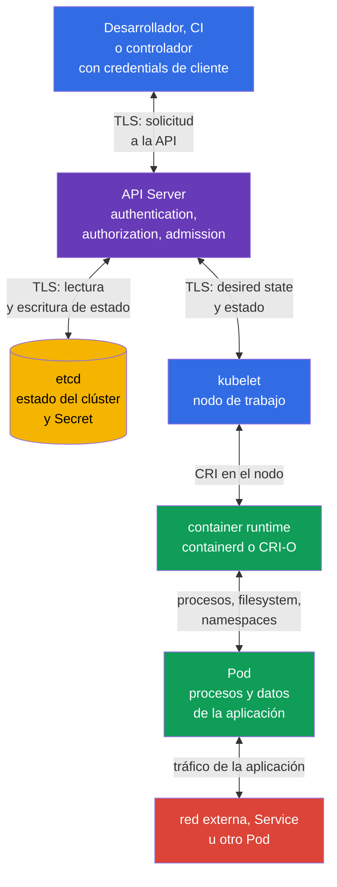

[Русская версия](ru.md) · [Eng version](README.md) · [Version française](fr.md) · [Deutsche Version](de.md) · [ქართული ვერსია](ge.md) · [繁體中文版](tw.md) · [日本語版](jp.md)

# Capítulo 15. Límites de confianza, flujos de datos y modelo de amenazas

> **Qué sigue.** Los capítulos 10-14 analizaron controles individuales: identidades y RBAC, seguridad de `Pod`, `Secret`, segmentación de red y auditoría. Ahora debemos relacionarlos con lo que protegemos, de quién y en qué punto del flujo de datos. El modelo de amenazas hace explícita esta elección. Es un tema del dominio KCSA **Kubernetes Threat Model**, con un peso del 16 %. Los ejemplos del curso se orientan a Kubernetes `v1.36`.

## 15.1 Qué es un modelo de amenazas y por qué se necesita en Kubernetes

Un modelo de amenazas es una descripción estructurada de un sistema, sus activos, participantes, flujos de datos, límites de confianza y posibles abusos. No predice todos los ataques ni sustituye un control de seguridad. Su objetivo es más sencillo: formular las preguntas adecuadas antes de un incidente y elegir controles para un riesgo concreto.

En Kubernetes, el sistema está distribuido: un desarrollador o CI envía una solicitud a la API, API Server guarda el estado en etcd, `kubelet` de un nodo de trabajo obtiene el estado deseado y el container runtime inicia un `Pod`. También hay llamadas de red de las aplicaciones, acceso a `Secret`, llamadas al registry y observabilidad. Por ello, la frase «el clúster está protegido» sin indicar el límite es demasiado imprecisa.

Es útil comenzar con cuatro preguntas:

1. **¿Qué activos son valiosos?** Por ejemplo, datos de clientes, `Secret`, tokens de `ServiceAccount`, imágenes, configuración, acceso a la API y recursos de computación.
2. **¿Quién actúa?** Un desarrollador, CI, un usuario de la aplicación, un administrador, un proveedor cloud, un `Pod` comprometido o un atacante externo.
3. **¿Qué rutas están disponibles?** Kubernetes API, red entre `Pod`, kubelet API, container runtime socket, volumen, backup de etcd, registry.
4. **¿Dónde confía una decisión en datos de entrada o en una identidad?** En los límites cliente-API, API-etcd, API-kubelet, runtime-`Pod`, entre namespace y al salir a la red.

El resultado no tiene que ser un documento grande. Para un equipo pequeño basta con un esquema, una tabla de amenazas y una lista de propietarios de controles. Es importante actualizar el modelo cuando se añade un nuevo `Namespace`, ingress externo, webhook, rol cloud o acceso a datos sensibles.

| Elemento del modelo | Pregunta | Ejemplo de Kubernetes |
|---|---|---|
| Activo | ¿Qué se perderá o modificará? | `Secret` con una clave de API de pagos |
| Participante | ¿Qué acción analizamos? | CI con kubeconfig o `ServiceAccount` de la aplicación |
| Flujo de datos | ¿A dónde se transmite la información? | `kubectl` envía una solicitud a API Server mediante TLS |
| Límite de confianza | ¿Dónde cambia el nivel de confianza? | API Server valida el token del cliente y sus permisos RBAC |
| Amenaza | ¿Qué resultado no deseado es posible? | Un token comprometido crea un `Pod` `privileged` |
| Control | ¿Qué reduce la probabilidad o las consecuencias? | MFA/OIDC, RBAC, PSA, audit logging y rotación de token |

El modelo de amenazas ayuda a no confundir un control con un activo. Por ejemplo, `NetworkPolicy` limita una ruta de red, pero no oculta un `Secret` a un sujeto con permiso `get secrets`. Encryption at rest protege la escritura en etcd, pero no sustituye la autenticación del cliente de API. Un riesgo suele tener varias capas de defensa.

## 15.2 Límites de confianza y flujo de datos del clúster

Un **límite de confianza** es un lugar donde datos o una solicitud pasan de un participante menos confiable a uno más confiable, o cambian de contexto de privilegios. En ese límite se verifican la identidad, los permisos, la integridad y, si los datos son sensibles, la confidencialidad. TLS es importante para proteger el canal, pero no determina si el remitente tiene derecho a ejecutar una acción.

En un clúster típico, el límite central es API Server. Autentica al cliente, autoriza la solicitud y aplica admission controls antes de cambiar el estado. etcd no está pensado para el acceso directo de usuarios normales: almacena el estado del clúster y solo debe confiar en un API Server protegido. `kubelet` obtiene u observa mediante la API los objetos asignados al nodo de trabajo y transmite instrucciones al container runtime local. El runtime crea procesos y aislamiento de contenedores, y el `Pod` ejecuta código de aplicación que puede tener su propia red, volúmenes y token.



En el diagrama las flechas son bidireccionales porque los componentes intercambian solicitudes y respuestas. Esto no implica el mismo nivel de confianza. Por ejemplo, API Server escribe el estado en etcd, pero etcd no debe aceptar solicitudes administrativas de un `Pod`; el runtime administra el contenedor, pero la aplicación no debe obtener su socket.

| Límite | Qué puede salir mal | Controles conceptuales |
|---|---|---|
| cliente ↔ API Server | kubeconfig robado, identidad falsificada, permisos demasiado amplios | TLS, autenticación sólida, credentials de corta duración, RBAC, audit logging |
| API Server ↔ etcd | lectura o modificación de estado, fuga de snapshot | TLS, acceso de red y host restringido, encryption at rest, backup protegidos |
| API Server ↔ kubelet | abuso de kubelet API o falsificación de estado | autenticación mutua, autorización de kubelet, protección del nodo de trabajo |
| kubelet ↔ runtime | el acceso a CRI socket permite controlar contenedores | acceso al socket solo para componentes del sistema, hardening del nodo, monitorización |
| runtime ↔ `Pod` | escape del contenedor, mount o privilegios peligrosos | PSS/PSA, `securityContext`, seccomp, AppArmor, capabilities mínimas |
| `Pod` ↔ red y datos | MITM, lateral movement, exfiltration | `NetworkPolicy`, TLS o mTLS, controles DNS, RBAC y separación de `Secret` |

No todos los flujos recorren la línea directa del diagrama. Los controladores usan la API como clientes, un admission webhook recibe una llamada de API Server, CSI y CNI pueden llamar al nodo de trabajo, y una aplicación llama a un servicio externo. Al modelar, se añaden estas conexiones si existen en la plataforma concreta. De otro modo, un webhook «invisible» o un rol cloud se convierte en un límite de confianza no considerado.

## 15.3 STRIDE, MITRE ATT&CK for Containers y kill chain

> **Importante para KCSA domain mapping.**
> Linux Foundation asigna **Threat Modelling Frameworks** al dominio
> **Compliance and Security Frameworks**, no al dominio
> **Kubernetes Threat Model**.
>
> STRIDE, MITRE ATT&CK for Containers y kill chain se utilizan en este capítulo
> como contexto analítico cross-domain para trabajar con los
> trust boundaries y data flows ya definidos. En el examen, las preguntas sobre la finalidad de
> threat-modelling frameworks deben asignarse a Compliance.
>
> El propio dominio **Kubernetes Threat Model** evalúa trust boundaries/data flow,
> persistence, denial of service, malicious code / compromised applications,
> attacker on the network, access to sensitive data y privilege escalation.
> El repaso detallado y orientado al examen de las competencias de frameworks está en el
> [capítulo 19](../19/es.md).

Los frameworks no son listas de configuraciones intercambiables: cada uno tiene su propio ámbito y la pregunta a la que responde. Primero se presenta una visión general de lo que resuelve cada uno y después un análisis detallado de STRIDE y ATT&CK for Containers por separado.

| Framework | A qué pregunta responde | Unidad de análisis | Cuándo aplicarlo |
|---|---|---|---|
| STRIDE | ¿Qué clases de amenazas son posibles para un flujo o límite concreto? | elemento de arquitectura (componente, flujo de datos, límite de confianza) | durante el diseño o la revisión de arquitectura, antes de un incidente |
| MITRE ATT&CK for Containers | ¿Qué tácticas y técnicas ya aplica o puede aplicar un atacante en un entorno de contenedores? | comportamiento observable del atacante (táctica → técnica) | al crear detecciones, analizar un incidente o evaluar la cobertura de protección runtime |
| Kill chain | ¿En qué etapa del desarrollo de un ataque es más efectivo detenerlo? | secuencia de etapas de un ataque (desde la preparación hasta el objetivo) | al decidir dónde ubicar controles preventive y detective entre sí |

**STRIDE** y **ATT&CK for Containers** no compiten, sino que cubren lados distintos de un mismo panorama: STRIDE es un análisis de arquitectura «desde la amenaza», aplicado de antemano, mientras que ATT&CK es un análisis de comportamiento «desde el atacante», aplicado a acciones ya observadas o hipotéticas. **Kill chain** no es otra lista de amenazas o técnicas, sino una forma de ordenar en el tiempo el resultado de STRIDE y ATT&CK: muestra en qué etapa se manifestará realmente una amenaza concreta (de STRIDE) o técnica (de ATT&CK), y ayuda a decidir dónde conviene ubicar un preventive control y dónde uno detective.

**Mejor práctica de combinación.** No intente reducir los tres frameworks a un único documento o tabla: tienen ejes de análisis diferentes y su combinación forzada diluye la pregunta que responde cada uno. Un orden práctico es: (1) para una nueva arquitectura o un cambio sustancial, primero recorrer STRIDE para cada elemento y flujo, lo que proporciona una lista de amenazas y trust boundaries; (2) para las amenazas realistas en su entorno, relacionarlas con las tácticas y técnicas de ATT&CK for Containers, lo que proporciona señales observables concretas y existing detection coverage; (3) distribuir el resultado según la kill chain para ver qué etapas del ataque cubre un preventive control, cuáles solo un detective y dónde existe una brecha. STRIDE y ATT&CK no tienen que coincidir uno a uno: una amenaza STRIDE (por ejemplo, Elevation of Privilege) puede manifestarse a través de varias técnicas ATT&CK (privileged container, hostPath, capability abuse), y esto es esperado, no un error de análisis. La relación detallada con frameworks y compliance se presenta en el capítulo 19.

### STRIDE: seis preguntas para cada elemento

| Categoría | Pregunta para el clúster | Ejemplo | Controles adecuados |
|---|---|---|---|
| Spoofing | ¿Puede el atacante hacerse pasar por otra persona? | un token robado de `ServiceAccount` se usa como legítimo | autenticación, rotación de tokens, limitación de su emisión |
| Tampering | ¿Puede modificar datos o configuración sin ser detectado? | un `Deployment` modificado inicia otra imagen | RBAC, admission, firma de imágenes, audit logging |
| Repudiation | ¿Se puede demostrar quién ejecutó una acción? | se elimina un `Secret`, pero no hay registro del autor | audit policy, almacenamiento protegido y correlación de logs |
| Information Disclosure | ¿Pueden exponerse datos sensibles? | el acceso a un backup de etcd expone un `Secret` | encryption at rest, RBAC, protección de backup |
| Denial of Service | ¿Puede agotarse un recurso o interrumpirse la disponibilidad? | un `Pod` ocupa CPU y memoria de un nodo de trabajo | `requests`, `limits`, `ResourceQuota`, monitorización |
| Elevation of Privilege | ¿Puede un sujeto obtener más permisos? | un contenedor con `hostPath` y una capability excesiva afecta al nodo | PSS/PSA, `securityContext`, least privilege, hardening del nodo |

STRIDE no afirma que cada elemento sea necesariamente vulnerable. Evita que se omita una clase de preguntas. Por ejemplo, para API Server se revisan spoofing y tampering mediante identidades y RBAC, mientras que para el registro de auditoría son especialmente importantes repudiation y la integridad del almacenamiento.

### ATT&CK for Containers y evolución del ataque

MITRE ATT&CK for Containers agrupa el comportamiento del atacante en tácticas y técnicas. En el nivel associate, es útil reconocer la lógica de la cadena, no memorizar los identificadores de las técnicas. ATT&CK evoluciona: los nombres siguientes se contrastaron con Containers Matrix v19, pero deben volver a verificarse en la matriz oficial antes de operational mapping. Un incidente puede recorrer varias tácticas y no tiene que incluir cada una de ellas.

| Etapa o táctica | Posible acción en Kubernetes | Qué buscar o limitar |
|---|---|---|
| Initial Access | una aplicación vulnerable acepta una solicitud maliciosa, o un kubeconfig robado llega al clúster | protección de la aplicación, autenticación, superficie externa, audit events |
| Execution | se ejecuta un shell o proceso inesperado en un contenedor | detección runtime, logs de procesos, imagen mínima |
| Persistence | se crea un `CronJob`, webhook, `Pod` estático o se conserva un token | revisión de cambios, RBAC, audit logging, control del control plane |
| Privilege Escalation | un contenedor obtiene `privileged`, `hostPath` o acceso al socket del runtime | PSA, admission, `securityContext`, restricciones del nodo |
| Defense Impairment | se desactiva o modifica una herramienta de protección | protección de configuración, almacenamiento separado de logs, auditoría de cambios |
| Credential Access | se lee un `Secret`, token o kubeconfig | RBAC, encryption at rest, entrega segura y rotación |
| Discovery | se enumeran `Namespace`, `Pod`, servicios y recursos API | least privilege, auditoría de `list` y `watch` inusuales |
| Lateral Movement | un `Pod` comprometido llama a otro servicio o nodo | segmentación, `NetworkPolicy`, mTLS, protección de kubelet |
| Acceso a datos y exfiltration (data-flow lens, no una táctica de Containers Matrix) | se leen datos de un volume y se envían a un endpoint externo | restricción de egress, TLS, monitorización de red y datos |
| Impact | se eliminan workloads, se cifran datos o se agotan recursos | backup, cuotas, límites, alertas y plan de respuesta |

Kill chain es útil para la pregunta «¿en qué etapa detener el ataque?». Por ejemplo, el escaneo y la firma de imágenes reducen la probabilidad de initial access mediante un artefacto malicioso; PSA reduce la ruta a privilege escalation; `NetworkPolicy` limita lateral movement; la auditoría y la detección runtime aportan evidencia en las etapas de execution y Defense Impairment. No existe un único control para toda la cadena.

Es importante no convertir ATT&CK en una sentencia automática. Ejecutar `sh` en un contenedor, solicitar `list pods` o tener tráfico HTTPS saliente pueden ser operaciones normales. El contexto lo proporcionan el propietario del workload, el namespace, la hora, la imagen, el iniciador de la solicitud API y el comportamiento esperado de la aplicación.

## 15.4 Attack tree: obtener production secrets

Un attack tree convierte una amenaza general en rutas verificables. El objetivo no es enumerar todos los exploits, sino elegir un control y evidence para cada paso realista.

```text
Goal: obtener production secrets
├── robar kubeconfig
│   └── usar RBAC excesivo
├── comprometer un Pod
│   ├── leer token de ServiceAccount
│   ├── llamar a Kubernetes API
│   └── usar permisos excesivos
├── obtener backup de etcd
│   └── Secret no está protegido con encryption at rest
└── comprometer CI/CD
    └── insertar malicious artifact
```

| Attack path | Preventive control | Detective control | Evidence |
|---|---|---|---|
| Un token robado de `ServiceAccount` lee un `Secret` | identidad de workload separada y RBAC de least privilege | Auditoría de Kubernetes API | audit event: identidad, `get`, `secrets`, estado de respuesta |
| Un shell en un contenedor busca credentials | minimizar las credentials disponibles para el workload: no montar `Secret` innecesarios, usar `automountServiceAccountToken: false` si no se necesita Kubernetes API y asignar una identidad de workload separada con RBAC de least privilege | Falco u otro detector runtime | evento runtime sobre shell/acceso al archivo de credentials |
| Una imagen maliciosa pasa CI | digest, SBOM, signature/provenance y admission verification | logs de registry/CI/admission | attestation verificada y decisión de admission |
| Un backup de etcd expone datos | encryption at rest, protección de backup y de acceso | auditoría del acceso al backup y review de controles de almacenamiento | informe de backup/access trail |

Ningún preventive control hace que una ruta sea imposible por sí solo: RBAC no ve un shell dentro de un contenedor, y la detección runtime suele descubrir una acción que ya ha empezado. En el examen, primero nombre el activo y la ruta de ataque, luego elija el control en el enforcement point y la evidencia que lo confirme.

## 15.5 Cómo aplicar el modelo de amenazas a su clúster

La aplicación práctica comienza con un escenario acotado, no con una lista de todos los componentes de Kubernetes. Por ejemplo: «CI despliega una tienda en línea en el namespace `payments`, la aplicación lee un token de pago y llama a un proveedor externo». Para ese escenario se puede elaborar una tabla de trabajo breve.

| Paso | Qué se registra | Ejemplo de resultado |
|---|---|---|
| 1. Definir el alcance | sistema, namespace, integraciones y propietarios | `payments`, CI, registry, API de pagos, equipo de plataforma |
| 2. Enumerar los activos | qué requiere confidencialidad, integridad o disponibilidad | token del proveedor, pedidos, imagen de la aplicación, cuota de recursos |
| 3. Dibujar los flujos | quién llama a quién y con qué credentials | CI → API Server; `Pod` → API de pagos; API Server → etcd |
| 4. Marcar los límites | dónde cambia la confianza o los permisos | CI-API, API-etcd, red externa-`Pod`, `Pod`-`Secret` |
| 5. Analizar las amenazas | STRIDE y posibles acciones ATT&CK | token robado, sustitución de imagen, egress con datos, DoS |
| 6. Elegir y asignar controles | preventivos, detectives, de recuperación | RBAC y PSA, `NetworkPolicy`, auditoría, backup, propietario del control |
| 7. Revisar cambios | qué cambió tras un nuevo servicio o incidente | añadir un nuevo webhook y sus permisos al modelo |

Considere tres decisiones típicas. Si CI tiene `cluster-admin`, el riesgo de tampering es demasiado alto: una `ServiceAccount` separada y un `Role` restringido reducen el radio de una equivocación o robo de credentials. Si una aplicación tiene unrestricted egress, el riesgo de exfiltration y lateral movement es mayor: default-deny y reglas específicas de `NetworkPolicy` limitan las rutas conocidas, y TLS o mTLS protege el canal permitido. Si un `Secret` es accesible para todos los `Pod` del namespace, el riesgo de disclosure es alto: identidades separadas, permisos RBAC estrechos, encryption at rest y rotación reducen las consecuencias.

La priorización depende del daño y de la plausibilidad de la amenaza. Un clúster de production con pagos normalmente requiere proteger primero el acceso administrativo, los secretos, los nodos de trabajo y los flujos externos. Un entorno de pruebas tampoco es una excepción si contiene credentials de production o un control plane compartido. El modelo de amenazas debe reflejar la arquitectura real, no el nombre formal del entorno.

## 15.6 Cómo se aplica en la práctica

El equipo de plataforma mantiene un esquema base de flujos de datos para workloads típicos y esquemas separados para integraciones críticas. Durante la revisión de un componente nuevo se formula un conjunto breve de preguntas: qué permisos API recibe, qué `Secret` lee, a dónde puede acceder por red, si ejecuta código privilegiado y quién verá sus eventos.

Las amenazas se vinculan a comprobaciones medibles. Para el límite cliente-API, son la revisión de RBAC y los audit events. Para el nodo de trabajo, el control de acceso a kubelet y runtime socket, PSS/PSA y el estado de `securityContext`. Para los datos, cifrado de etcd, protección de backup y permisos mínimos sobre `secrets`. Para la red, conectividad entrante y saliente comprensible, `NetworkPolicy` y TLS o mTLS donde el tráfico sea sensible.

El modelo también ayuda en la investigación. Cuando aparece una alerta sobre un proceso inesperado, el equipo la relaciona con una etapa ATT&CK y con el esquema: qué `Pod`, imagen, `ServiceAccount`, nodo y ruta de red intervinieron. Esto es más rápido que iniciar un incidente con una búsqueda sin límites en todos los logs.

## 15.7 Exam vocabulary / Mini-glosario

| Término | Significado |
|---|---|
| modelo de amenazas | Descripción de los activos, participantes, flujos, límites de confianza, amenazas y controles de un sistema. |
| límite de confianza | Punto de transición entre participantes o contextos con distinto nivel de confianza. |
| flujo de datos | Transferencia de una solicitud, estado o datos entre componentes. |
| STRIDE | Framework con las categorías Spoofing, Tampering, Repudiation, Information Disclosure, Denial of Service y Elevation of Privilege. |
| MITRE ATT&CK for Containers | Base de tácticas y técnicas que describen el comportamiento de atacantes en un entorno de contenedores. |
| kill chain | Modelo de una secuencia de etapas de ataque desde el acceso inicial hasta el impacto. |
| lateral movement | Movimiento del atacante desde un recurso comprometido hacia otro recurso. |
| attack surface | Conjunto de rutas disponibles a través de las cuales se puede atacar un sistema. |

## 15.8 Exam Essentials / Resumen del capítulo

- El modelo de amenazas vincula activos, participantes, flujos de datos, límites de confianza, amenazas y controles.
- En Kubernetes, los límites clave se sitúan entre el cliente y API Server, API Server y etcd, API Server y kubelet, kubelet y runtime, runtime y `Pod`, así como entre `Pod`, red y datos.
- TLS protege el canal de transmisión, pero para decidir «si la acción está permitida» se necesitan autenticación, autorización y admission.
- STRIDE, MITRE ATT&CK for Containers y kill chain ayudan a analizar amenazas y la evolución de un ataque, pero en el KCSA domain mapping oficial **Threat Modelling Frameworks pertenece a Compliance and Security Frameworks**; aquí se utilizan como contexto cross-domain.
- Un control no cubre todo el ataque: RBAC, PSA, encryption, segmentación, auditoría, detección runtime y backup funcionan en capas.
- Un modelo de amenazas útil debe ser breve, estar vinculado a flujos reales y actualizarse cuando cambie la arquitectura.

## 15.9 Qué no confundir y cómo aparece en el examen

En MCQ (multiple choice question, pregunta de opción múltiple), a menudo se describe un componente o escenario y se pide elegir el control más adecuado. Primero identifique el activo y el límite: si es acceso a API, datos de etcd, permisos de `Pod`, acceso al nodo de trabajo o flujo de red. Después separe prevención de detección y recuperación.

Trampas típicas:

- considerar TLS un reemplazo de RBAC: TLS confirma un canal protegido, pero no limita los permisos de una identidad;
- considerar `NetworkPolicy` protección de datos de etcd o `Secret` cuando se leen mediante API;
- considerar que etcd debe ser directamente accesible a los usuarios para administrar normalmente el clúster;
- elegir una sola medida para todas las etapas de kill chain;
- tomar cualquier proceso, solicitud API `list` o tráfico HTTPS como un ataque sin contexto;
- confundir STRIDE, como una lista de configuraciones, con un método para formular preguntas sobre amenazas.

Si las opciones mezclan frameworks, recuerde su propósito: STRIDE clasifica amenazas, ATT&CK for Containers describe tácticas y técnicas del adversario, y kill chain muestra el curso de un ataque. Son modelos complementarios, no competidores.

## 15.10 Preguntas de autoevaluación

### 1. ¿Qué componente suele ser el límite de confianza central para las solicitudes de administración de Kubernetes?

   - a. `Pod` de la aplicación.

   - b. container runtime.

   - c. API Server.

   - d. Complemento CNI.

<details>
<summary>Respuesta y explicación</summary>

**Respuesta correcta: c.** API Server autentica al cliente, comprueba sus privilegios y aplica admission antes de cambiar el estado. Runtime y CNI son importantes para otros límites, pero no son el punto habitual de procesamiento de solicitudes de Kubernetes API.

</details>

### 2. ¿Qué control reduce más directamente el riesgo de que un sujeto con un kubeconfig robado cree un `Deployment` arbitrario en todo el clúster?

   - a. RBAC con permisos mínimos para esa identidad.

   - b. `ResourceQuota`.

   - c. Encryption at rest para etcd.

   - d. `NetworkPolicy` para el namespace de la aplicación.

<details>
<summary>Respuesta y explicación</summary>

**Respuesta correcta: a.** Least-privilege RBAC limita qué acciones de API puede ejecutar una identidad comprometida. Los demás controles son importantes, pero no determinan el permiso `create deployments` mediante la API.

</details>

#### Repaso cross-domain: Compliance and Security Frameworks

### 3. ¿Qué categoría STRIDE describe mejor la lectura de un `Secret` desde un snapshot de etcd no protegido?

   - a. Information Disclosure.

   - b. Denial of Service.

   - c. Tampering.

   - d. Repudiation.

<details>
<summary>Respuesta y explicación</summary>

**Respuesta correcta: a.** En este escenario se exponen datos sensibles. Para reducir el riesgo se necesita proteger el acceso a etcd y los backup, además de encryption at rest. Repudiation se refiere a la imposibilidad de establecer el autor de una acción.

</details>

### 4. ¿Cuál es la relación más precisa entre STRIDE y MITRE ATT&CK for Containers?

   - a. STRIDE clasifica clases de amenazas, y ATT&CK for Containers describe tácticas y técnicas de las acciones de un atacante.

   - b. Ambos frameworks bloquean automáticamente un `Pod` `privileged`.

   - c. STRIDE es un método de cifrado de datos y ATT&CK sustituye a RBAC.

   - d. ATT&CK se aplica solo a infraestructura cloud fuera de Kubernetes.

<details>
<summary>Respuesta y explicación</summary>

**Respuesta correcta: a.** STRIDE ayuda a analizar sistemáticamente amenazas en límites y flujos. ATT&CK for Containers proporciona un lenguaje para describir el comportamiento observable del adversario. Ninguno es un mecanismo de aplicación de políticas.

</details>

#### Vuelta a Kubernetes Threat Model

### 5. ¿Qué escenario ilustra mejor lateral movement después de comprometer un `Pod`?

   - a. Un proceso comprometido reinicia un HTTP listener normal dentro del mismo contenedor después de un fallo local.
   - b. Un atacante modifica un archivo de aplicación dentro de un `Pod` ya comprometido, sin llamar a otros workloads o systems.
   - c. Un cliente externo escanea un endpoint público de Ingress, pero todavía no obtuvo acceso a ningún workload.
   - d. Un `Pod` comprometido usa una ruta de red o credential disponible para llamar a un servicio interno de otra zona de workload.

<details>
<summary>Respuesta y explicación</summary>

**Respuesta correcta: d.** Lateral movement es el paso desde un punto ya comprometido hacia otros workloads, servicios o zonas de confianza. La segmentación de red, las identities estrechas y least privilege reducen esas rutas.

</details>

> **Adónde seguir.** Para una visión general de frameworks, STRIDE, MITRE ATT&CK for Containers y compliance, vaya al [capítulo 19 de KCSA](../19/es.md). Los límites prácticos de seguridad y el modelo 4C se analizan en el capítulo 02 de CKS, y la correlación de señales y la investigación de fases de ataque, en el capítulo 30 de CKS.

[Índice](../README_ES.md) · [Capítulo 14](../14/es.md) · [Capítulo 16](../16/es.md)
