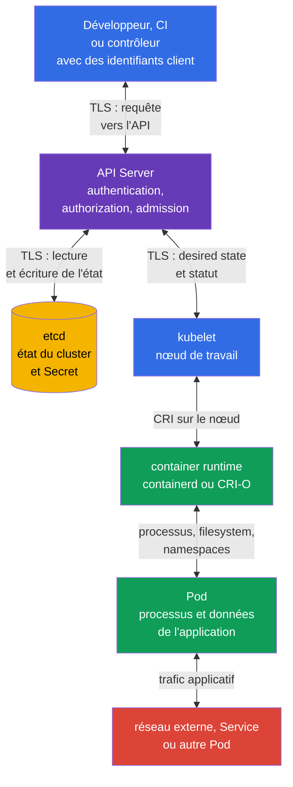

[Русская версия](ru.md) · [Eng version](README.md) · [Versión en español](es.md) · [Deutsche Version](de.md) · [ქართული ვერსია](ge.md) · [繁體中文版](tw.md) · [日本語版](jp.md)

# Chapitre 15. Limites de confiance, flux de données et modèle de menaces

> **La suite.** Les chapitres 10-14 ont présenté des contrôles distincts : identités et RBAC, sécurité des `Pod`, `Secret`, segmentation réseau et audit. Il faut maintenant les relier à ce que nous protégeons, contre qui et à quel point du flux de données. Le modèle de menaces rend ce choix explicite. Ce sujet relève du domaine KCSA **Kubernetes Threat Model**, pondéré à 16 %. Les exemples du cours se basent sur Kubernetes `v1.36`.

## 15.1 Qu'est-ce qu'un modèle de menaces et pourquoi est-il nécessaire dans Kubernetes

Un modèle de menaces est une description structurée d'un système, de ses actifs, participants, flux de données, limites de confiance et abus possibles. Il ne prédit pas toutes les attaques et ne remplace pas les contrôles de sécurité. Son objectif est plus simple : poser les bonnes questions avant un incident et choisir des contrôles pour un risque précis.

Dans Kubernetes, le système est distribué : un développeur ou le CI envoie une requête à l'API, l'API Server enregistre l'état dans etcd, le `kubelet` d'un nœud de travail reçoit l'état désiré et le container runtime démarre le `Pod`. Il existe aussi des appels réseau des applications, l'accès aux `Secret`, les appels au registry et l'observabilité. Ainsi, dire « le cluster est protégé » sans préciser la limite est trop vague.

Il est utile de commencer par quatre questions :

1. **Quels actifs ont de la valeur ?** Par exemple, les données clients, `Secret`, tokens de `ServiceAccount`, images, configuration, accès à l'API et ressources de calcul.
2. **Qui agit ?** Développeur, CI, utilisateur de l'application, administrateur, fournisseur cloud, `Pod` compromis ou attaquant externe.
3. **Quels chemins sont accessibles ?** Kubernetes API, réseau entre `Pod`, kubelet API, container runtime socket, volume, backup etcd, registry.
4. **À quel endroit la décision fait-elle confiance à des données d'entrée ou à une identité ?** Aux limites client-API, API-etcd, API-kubelet, runtime-`Pod`, entre namespaces et à la sortie vers le réseau.

Le résultat ne doit pas nécessairement être un gros document. Pour une petite équipe, un schéma, une table des menaces et une liste des propriétaires de contrôles suffisent. Il est important de mettre le modèle à jour lorsqu'on ajoute un nouveau `Namespace`, un ingress externe, un webhook, un rôle cloud ou l'accès à des données sensibles.

| Élément du modèle | Question | Exemple Kubernetes |
|---|---|---|
| Actif | Qu'est-ce qui serait perdu ou modifié ? | `Secret` avec une clé d'API de paiement |
| Participant | Quelle action analysons-nous ? | CI avec kubeconfig ou `ServiceAccount` de l'application |
| Flux de données | Où l'information est-elle transmise ? | `kubectl` envoie une requête à l'API Server via TLS |
| Limite de confiance | Où le niveau de confiance change-t-il ? | L'API Server vérifie le token du client et ses droits RBAC |
| Menace | Quel résultat indésirable est possible ? | Un token compromis crée un `Pod` `privileged` |
| Contrôle | Qu'est-ce qui réduit la probabilité ou les conséquences ? | MFA/OIDC, RBAC, PSA, audit logging et rotation de token |

Le modèle de menaces aide à ne pas confondre un contrôle avec un actif. Par exemple, `NetworkPolicy` limite un chemin réseau, mais ne masque pas un `Secret` à un sujet qui possède l'autorisation `get secrets`. Encryption at rest protège l'enregistrement dans etcd, mais ne remplace pas l'authentification d'un client API. Un même risque possède souvent plusieurs couches de défense.

## 15.2 Limites de confiance et flux de données du cluster

Une **limite de confiance** est un endroit où des données ou une requête passent d'un participant moins fiable à un participant plus fiable, ou changent de contexte d'autorisation. À une telle limite, on vérifie l'identité, les droits, l'intégrité et, si les données sont sensibles, la confidentialité. TLS est important pour protéger le canal, mais ne détermine pas si l'expéditeur a le droit d'effectuer l'action.

Dans un cluster typique, la limite centrale est l'API Server. Il authentifie le client, autorise la requête et applique les contrôles d'admission avant de modifier l'état. etcd n'est pas destiné à l'accès direct des utilisateurs ordinaires : il stocke l'état du cluster et ne doit faire confiance qu'à un API Server protégé. Le `kubelet` reçoit ou observe les objets assignés au nœud de travail via l'API et transmet les instructions au container runtime local. Le runtime crée les processus et l'isolation des conteneurs, tandis que le `Pod` exécute le code applicatif, qui peut disposer de son propre réseau, de volumes et d'un token.



Dans le schéma, les flèches sont bidirectionnelles, car les composants échangent des requêtes et des réponses. Cela ne signifie pas un niveau de confiance identique. Par exemple, l'API Server écrit l'état dans etcd, mais etcd ne doit pas accepter de requêtes administratives de `Pod` ; le runtime gère le conteneur, mais l'application ne doit pas obtenir son socket.

| Limite | Ce qui peut mal tourner | Contrôles conceptuels |
|---|---|---|
| client ↔ API Server | kubeconfig volé, identité falsifiée, droits trop larges | TLS, authentification robuste, identifiants de courte durée, RBAC, audit logging |
| API Server ↔ etcd | lecture ou modification de l'état, fuite de snapshot | TLS, accès réseau et hôte limité, encryption at rest, backup protégés |
| API Server ↔ kubelet | abus de kubelet API ou substitution de statut | authentification mutuelle, autorisation kubelet, protection du nœud de travail |
| kubelet ↔ runtime | l'accès au CRI socket permet de contrôler les conteneurs | accès au socket réservé aux composants système, hardening du nœud, monitoring |
| runtime ↔ `Pod` | escape du conteneur, mount ou privilèges dangereux | PSS/PSA, `securityContext`, seccomp, AppArmor, capabilities minimales |
| `Pod` ↔ réseau et données | MITM, lateral movement, exfiltration | `NetworkPolicy`, TLS ou mTLS, contrôles DNS, RBAC et séparation des `Secret` |

Tous les flux ne suivent pas la ligne directe du diagramme. Les contrôleurs utilisent l'API comme clients, un admission webhook reçoit un appel de l'API Server, CSI et CNI peuvent communiquer avec le nœud de travail, et l'application appelle un service externe. Lors de la modélisation, on ajoute ces liaisons si elles existent dans la plateforme concernée. Sinon, un webhook ou un rôle cloud « invisible » deviendra une limite de confiance non prise en compte.

## 15.3 STRIDE, MITRE ATT&CK for Containers et kill chain

> **Important pour le mapping des domaines KCSA.**
> Linux Foundation rattache les **Threat Modelling Frameworks** au domaine
> **Compliance and Security Frameworks**, et non au domaine
> **Kubernetes Threat Model**.
>
> STRIDE, MITRE ATT&CK for Containers et kill chain sont utilisés dans ce chapitre
> comme contexte analytique cross-domain pour travailler avec des
> trust boundaries et data flows déjà définis. À l'examen, les questions portant précisément sur le rôle des
> threat-modelling frameworks doivent être rattachées à Compliance.
>
> Le domaine **Kubernetes Threat Model** lui-même évalue trust boundaries/data flow,
> persistence, denial of service, malicious code / compromised applications,
> attacker on the network, access to sensitive data et privilege escalation.
> La révision détaillée orientée examen des compétences de framework se trouve dans le
> [chapitre 19](../19/fr.md).

Les frameworks ne sont pas des listes de réglages interchangeables : chacun a son propre champ d'application et répond à sa propre question. D'abord, voici une vue d'ensemble de ce que chacun résout, puis une analyse détaillée de STRIDE et ATT&CK for Containers séparément.

| Framework | Question à laquelle il répond | Unité d'analyse | Quand l'appliquer |
|---|---|---|---|
| STRIDE | Quelles catégories de menaces sont possibles pour un flux ou une limite précis ? | élément d'architecture (composant, flux de données, limite de confiance) | à l'étape de conception ou de revue d'architecture, avant l'incident |
| MITRE ATT&CK for Containers | Quelles tactiques et techniques un attaquant utilise-t-il déjà ou peut-il utiliser dans un environnement de conteneurs ? | comportement observable de l'attaquant (tactique → technique) | lors de la création de détections, de l'analyse d'un incident, de l'évaluation de la couverture de protection runtime |
| Kill chain | À quelle étape de l'évolution d'une attaque est-il plus efficace de l'arrêter ? | séquence d'étapes d'une même attaque (de la préparation à l'objectif) | lors du choix de l'emplacement des preventive et detective control les uns par rapport aux autres |

**STRIDE** et **ATT&CK for Containers** ne sont pas concurrents, ils couvrent différents aspects d'une même image : STRIDE est une analyse de l'architecture « à partir de la menace », appliquée à l'avance, ATT&CK est une analyse du comportement « à partir de l'attaquant », appliquée à des actions déjà observées ou hypothétiques. La **kill chain** n'est pas une autre liste de menaces ou de techniques, mais une façon d'ordonner le résultat de STRIDE et ATT&CK dans le temps : elle montre à quelle étape une menace concrète (de STRIDE) ou une technique (d'ATT&CK) se manifestera réellement, et aide à décider où placer un preventive control et où placer un detective control.

**Bonnes pratiques de combinaison.** N'essayez pas de réduire les trois frameworks à un seul document ou à une seule table : ils ont des axes d'analyse différents, et une fusion forcée brouille la question à laquelle chacun répond. Un ordre pratique est le suivant : (1) pour une nouvelle architecture ou une modification importante, commencer par parcourir STRIDE pour chaque élément et flux, ce qui donne une liste de menaces et de trust boundaries ; (2) pour les menaces réalistes dans votre environnement, les mettre en correspondance avec les tactiques et techniques ATT&CK for Containers, ce qui donne des signaux observables précis et la existing detection coverage ; (3) répartir le résultat selon la kill chain afin de voir quelles étapes de l'attaque sont couvertes par un preventive control, lesquelles ne le sont que par un detective control, et où se trouve un écart. STRIDE et ATT&CK ne doivent pas correspondre un à un : une menace STRIDE (par exemple Elevation of Privilege) peut se manifester via plusieurs techniques ATT&CK (privileged container, hostPath, capability abuse), ce qui est attendu et non une erreur d'analyse. Une mise en correspondance détaillée avec les frameworks et la conformité est fournie au chapitre 19.

### STRIDE : six questions pour chaque élément

| Catégorie | Question pour le cluster | Exemple | Contrôles adaptés |
|---|---|---|---|
| Spoofing | Un attaquant peut-il se faire passer pour une autre personne ? | un token `ServiceAccount` volé est utilisé comme légitime | authentification, rotation des tokens, limitation de leur émission |
| Tampering | Peut-il modifier discrètement les données ou la configuration ? | un `Deployment` modifié lance une autre image | RBAC, admission, signature d'image, audit logging |
| Repudiation | Peut-on prouver qui a effectué l'action ? | un `Secret` est supprimé, mais aucun enregistrement ne permet d'identifier l'auteur | audit policy, stockage protégé et corrélation des logs |
| Information Disclosure | Des données sensibles peuvent-elles être divulguées ? | l'accès à un backup etcd révèle un `Secret` | encryption at rest, RBAC, protection du backup |
| Denial of Service | Une ressource peut-elle être épuisée ou la disponibilité perturbée ? | un `Pod` consomme le CPU et la mémoire du nœud de travail | `requests`, `limits`, `ResourceQuota`, monitoring |
| Elevation of Privilege | Un sujet peut-il obtenir davantage de droits ? | un conteneur avec `hostPath` et une capability superflue affecte le nœud | PSS/PSA, `securityContext`, least privilege, hardening du nœud |

STRIDE n'affirme pas que chaque élément est nécessairement vulnérable. Il évite d'omettre une catégorie de questions. Par exemple, pour l'API Server, on vérifie spoofing et tampering via les identités et RBAC, tandis que repudiation et l'intégrité du stockage sont particulièrement importants pour le journal d'audit.

### ATT&CK for Containers et progression de l'attaque

MITRE ATT&CK for Containers regroupe le comportement de l'attaquant en tactiques et techniques. Au niveau associate, il est utile de reconnaître la logique de la chaîne plutôt que de mémoriser les identifiants de techniques. ATT&CK évolue : les noms ci-dessous ont été vérifiés avec Containers Matrix v19, mais ils doivent être vérifiés de nouveau dans la matrice officielle avant un operational mapping. Un incident peut passer par plusieurs tactiques et ne doit pas nécessairement toutes les contenir.

| Étape ou tactique | Action possible dans Kubernetes | Ce qu'il faut rechercher ou limiter |
|---|---|---|
| Initial Access | une application vulnérable accepte une requête malveillante, ou un kubeconfig volé arrive dans le cluster | protection de l'application, authentification, surface externe, audit events |
| Execution | un shell ou un processus inattendu s'exécute dans le conteneur | runtime-detection, logs de processus, image minimale |
| Persistence | un `CronJob`, webhook, `Pod` statique est créé, ou un token est conservé | revue des changements, RBAC, audit logging, contrôle du control plane |
| Privilege Escalation | le conteneur obtient `privileged`, `hostPath` ou l'accès au socket runtime | PSA, admission, `securityContext`, restrictions du nœud |
| Defense Impairment | un outil de protection est désactivé ou modifié | protection de configuration, stockage distinct des logs, audit des changements |
| Credential Access | un `Secret`, token ou kubeconfig est lu | RBAC, encryption at rest, livraison sécurisée et rotation |
| Discovery | les `Namespace`, `Pod`, services et ressources API sont énumérés | least privilege, audit des `list` et `watch` inhabituels |
| Lateral Movement | un `Pod` compromis accède à un autre service ou nœud | segmentation, `NetworkPolicy`, mTLS, protection de kubelet |
| Accès aux données et exfiltration (data-flow lens, non une tactique de Containers Matrix) | les données sont lues depuis un volume et transmises à un endpoint externe | limitation de l'egress, TLS, monitoring du réseau et des données |
| Impact | les workloads sont supprimés, les données chiffrées ou les ressources épuisées | backup, quotas, limites, alertes et plan de réponse |

La kill chain est utile pour la question « à quelle étape arrêter l'attaque ». Par exemple, le scan d'image et la signature réduisent le risque d'initial access via un artefact malveillant ; PSA réduit le chemin vers privilege escalation ; `NetworkPolicy` limite lateral movement ; l'audit et runtime-detection apportent des éléments probants aux étapes execution et Defense Impairment. Aucun contrôle ne couvre toute la chaîne.

Il est important de ne pas transformer ATT&CK en condamnation automatique. L'exécution de `sh` dans un conteneur, une requête `list pods` ou du trafic HTTPS sortant peuvent être normaux. Le contexte est fourni par le propriétaire du workload, le namespace, l'heure, l'image, l'initiateur de la requête API et le comportement attendu de l'application.

## 15.4 Attack tree : obtenir des production secrets

Un attack tree transforme une menace générale en chemins vérifiables. L'objectif n'est pas d'énumérer tous les exploits, mais de choisir un control et des evidence pour chaque étape réaliste.

```text
Goal: obtenir des production secrets
├── voler le kubeconfig
│   └── utiliser un RBAC excessif
├── compromettre un Pod
│   ├── lire le token ServiceAccount
│   ├── appeler Kubernetes API
│   └── utiliser des permissions excessives
├── obtenir un backup etcd
│   └── Secret non protégé par encryption at rest
└── compromettre le CI/CD
    └── injecter un artefact malveillant
```

| Attack path | Preventive control | Detective control | Evidence |
|---|---|---|---|
| Un token `ServiceAccount` volé lit un `Secret` | identité de workload distincte et RBAC de moindre privilège | audit Kubernetes API | audit event : identité, `get`, `secrets`, statut de réponse |
| Un shell dans un conteneur recherche des credentials | minimiser les credentials de workload disponibles : ne pas monter de `Secret` inutiles, utiliser `automountServiceAccountToken: false` si Kubernetes API n'est pas nécessaire, et attribuer une identité de workload distincte avec RBAC de moindre privilège | Falco ou autre runtime detector | runtime event relatif à un shell ou à l'accès à un fichier credential |
| Une image malveillante passe le CI | digest, SBOM, signature/provenance et admission verification | logs de registry/CI/admission | attestation vérifiée et admission decision |
| Un backup Etcd divulgue des données | encryption at rest, protection du backup et de l'accès | audit d'accès au backup et review des storage controls | rapport de backup/access trail |

Aucun preventive control ne rend seul un chemin impossible : RBAC ne voit pas un shell dans le conteneur, et runtime detection détecte le plus souvent une action déjà commencée. À l'examen, commencez par nommer l'actif et le chemin d'attaque, puis choisissez le control au point d'enforcement et la preuve qui le confirme.

## 15.5 Comment appliquer le modèle de menaces à son propre cluster

L'application pratique commence par un scénario limité, et non par la liste de tous les composants Kubernetes. Par exemple : « le CI déploie une boutique en ligne dans le namespace `payments`, l'application lit un token de paiement et communique avec un fournisseur externe ». Pour ce scénario, on peut établir une table de travail concise.

| Étape | Ce qui est consigné | Exemple de résultat |
|---|---|---|
| 1. Définir le périmètre | système, namespace, intégrations et propriétaires | `payments`, CI, registry, API de paiement, équipe plateforme |
| 2. Énumérer les actifs | ce qui exige confidentialité, intégrité ou disponibilité | token du fournisseur, commandes, image de l'application, quota de ressources |
| 3. Dessiner les flux | qui communique avec qui et avec quels credentials | CI → API Server ; `Pod` → API de paiement ; API Server → etcd |
| 4. Marquer les limites | où la confiance ou les droits changent | CI-API, API-etcd, `Pod`-réseau externe, `Pod`-`Secret` |
| 5. Analyser les menaces | STRIDE et actions ATT&CK probables | token volé, substitution d'image, egress de données, DoS |
| 6. Choisir et attribuer les contrôles | préventifs, détectifs, de récupération | RBAC et PSA, `NetworkPolicy`, audit, backup, propriétaire du contrôle |
| 7. Vérifier les changements | ce qui a changé après un nouveau service ou un incident | ajouter un nouveau webhook et ses droits au modèle |

Considérons trois décisions typiques. Si le CI possède `cluster-admin`, le risque de tampering est trop élevé : une `ServiceAccount` distincte et un `Role` limité réduisent le rayon d'impact d'une erreur ou du vol d'un credential. Si l'application a un egress unrestricted, le risque d'exfiltration et de lateral movement est plus élevé : default-deny et des règles `NetworkPolicy` précises limitent les chemins connus, tandis que TLS ou mTLS protège le canal autorisé. Si un `Secret` est accessible à tous les `Pod` du namespace, le risque de disclosure est élevé : des identités distinctes, des droits RBAC étroits, encryption at rest et la rotation réduisent les conséquences.

La priorisation dépend des dommages et du réalisme de la menace. Un cluster de production avec des paiements demande en général de protéger d'abord l'accès administratif, les secrets, les nœuds de travail et les flux externes. Un environnement de test n'est pas une exception s'il contient des credentials de production ou un control plane partagé. Le modèle de menaces doit refléter l'architecture réelle, et non le nom formel de l'environnement.

## 15.6 Comment cela s'applique en pratique

L'équipe plateforme maintient un schéma de base des flux de données pour les workloads habituels et des schémas distincts pour les intégrations critiques. Lors de la revue d'un nouveau composant, elle pose un ensemble court de questions : quels droits API reçoit-il, quels `Secret` lit-il, où peut-il communiquer sur le réseau, exécute-t-il du code privilégié et qui verra ses événements.

Les menaces sont liées à des vérifications mesurables. Pour la limite client-API, il s'agit de la revue RBAC et des audit events. Pour le nœud de travail, il s'agit du contrôle de l'accès à kubelet et au runtime socket, de PSS/PSA et de l'état de `securityContext`. Pour les données, il s'agit du chiffrement etcd, de la protection du backup et de droits minimaux sur `secrets`. Pour le réseau, il s'agit d'une connectivité sortante et entrante compréhensible, de `NetworkPolicy` et de TLS ou mTLS lorsque le trafic est sensible.

Le modèle aide aussi à l'investigation. Lorsqu'une alerte signale un processus inattendu, l'équipe le met en correspondance avec une étape ATT&CK et le schéma : quels `Pod`, image, `ServiceAccount`, nœud et route réseau étaient impliqués. Cela est plus rapide que de commencer un incident par une recherche illimitée dans tous les logs.

## 15.7 Vocabulaire d'examen / Mini-glossaire

| Terme | Signification |
|---|---|
| modèle de menaces | Description des actifs, participants, flux, limites de confiance, menaces et contrôles d'un système. |
| limite de confiance | Point de passage entre des participants ou contextes ayant des niveaux de confiance différents. |
| flux de données | Transmission d'une requête, d'un état ou de données entre composants. |
| STRIDE | Framework avec les catégories Spoofing, Tampering, Repudiation, Information Disclosure, Denial of Service et Elevation of Privilege. |
| MITRE ATT&CK for Containers | Base de tactiques et de techniques décrivant le comportement des attaquants dans un environnement de conteneurs. |
| kill chain | Modèle de séquence des étapes d'une attaque, de l'accès initial à l'impact. |
| lateral movement | Passage d'un attaquant d'une ressource compromise à une autre ressource. |
| attack surface | Ensemble des chemins accessibles par lesquels un système peut être attaqué. |

## 15.8 Exam Essentials / Points essentiels du chapitre

- Un modèle de menaces relie les actifs, participants, flux de données, limites de confiance, menaces et contrôles.
- Dans Kubernetes, les principales limites se trouvent entre le client et l'API Server, l'API Server et etcd, l'API Server et kubelet, kubelet et runtime, runtime et le `Pod`, ainsi qu'entre le `Pod`, le réseau et les données.
- TLS protège le canal de transmission, mais l'authentification, l'autorisation et l'admission sont nécessaires pour décider si une action est autorisée.
- STRIDE, MITRE ATT&CK for Containers et kill chain aident à analyser les menaces et la progression d'une attaque, mais dans le mapping officiel des domaines KCSA, les **Threat Modelling Frameworks appartiennent à Compliance and Security Frameworks** ; ils sont ici utilisés comme contexte cross-domain.
- Un seul contrôle ne couvre pas toute l'attaque : RBAC, PSA, encryption, segmentation, audit, runtime-detection et backup fonctionnent par couches.
- Un modèle de menaces opérationnel doit être court, lié aux flux réels et mis à jour à chaque modification de l'architecture.

## 15.9 À ne pas confondre et comment cela apparaît à l'examen

Dans les MCQ (multiple choice question, question à choix multiple), un composant ou scénario est souvent décrit et il faut choisir le contrôle le plus adapté. Commencez par déterminer l'actif et la limite : s'agit-il de l'accès à l'API, des données etcd, des droits de `Pod`, de l'accès au nœud de travail ou d'un flux réseau ? Distinguez ensuite prévention, détection et récupération.

Pièges fréquents :

- considérer TLS comme un remplacement de RBAC : TLS confirme un canal protégé, mais ne limite pas les autorisations d'une identité ;
- considérer `NetworkPolicy` comme une protection des données etcd ou d'un `Secret` lorsqu'ils sont lus via l'API ;
- considérer qu'etcd doit être directement accessible aux utilisateurs pour administrer normalement le cluster ;
- choisir une seule mesure pour toutes les étapes de la kill chain ;
- considérer tout processus, toute requête API `list` ou tout trafic HTTPS comme une attaque sans contexte ;
- confondre STRIDE, une méthode pour poser des questions sur les menaces, avec une liste de réglages.

Si les choix mélangent des frameworks, retenez leur rôle : STRIDE classe les menaces, ATT&CK for Containers décrit les tactiques et techniques de l'adversaire, et kill chain montre le déroulement de l'attaque. Ce sont des modèles complémentaires, non concurrents.

## 15.10 Questions d'autoévaluation

### 1. Quel composant est généralement la limite de confiance centrale pour les requêtes de gestion Kubernetes ?

   - a. Le `Pod` de l'application.

   - b. Le container runtime.

   - c. L'API Server.

   - d. Le plugin CNI.

<details>
<summary>Réponse et explication</summary>

**Réponse correcte : c.** L'API Server authentifie le client, vérifie ses autorisations et applique l'admission avant de modifier l'état. Le runtime et CNI sont importants pour d'autres limites, mais ne sont pas le point habituel de traitement des requêtes Kubernetes API.

</details>

### 2. Quel contrôle réduit le plus directement le risque qu'un sujet possédant un kubeconfig volé crée un `Deployment` arbitraire dans tout le cluster ?

   - a. RBAC avec des autorisations minimales pour cette identité.

   - b. `ResourceQuota`.

   - c. Encryption at rest pour etcd.

   - d. `NetworkPolicy` pour le namespace de l'application.

<details>
<summary>Réponse et explication</summary>

**Réponse correcte : a.** Le RBAC de moindre privilège limite les actions API que l'identité compromise peut effectuer. Les autres contrôles sont importants, mais ne définissent pas le droit `create deployments` via l'API.

</details>

#### Révision cross-domain : Compliance and Security Frameworks

### 3. Quelle catégorie STRIDE décrit le mieux la lecture d'un `Secret` depuis un snapshot etcd non protégé ?

   - a. Information Disclosure.

   - b. Denial of Service.

   - c. Tampering.

   - d. Repudiation.

<details>
<summary>Réponse et explication</summary>

**Réponse correcte : a.** Dans ce scénario, des données sensibles sont divulguées. Pour réduire le risque, il faut protéger l'accès à etcd et au backup, ainsi qu'utiliser encryption at rest. Repudiation concerne l'impossibilité d'identifier l'auteur d'une action.

</details>

### 4. Comment STRIDE et MITRE ATT&CK for Containers se rapportent-ils le plus précisément ?

   - a. STRIDE classe les catégories de menaces, tandis qu'ATT&CK for Containers décrit les tactiques et techniques des actions de l'attaquant.

   - b. Les deux frameworks bloquent automatiquement un `Pod` `privileged`.

   - c. STRIDE est une méthode de chiffrement des données, et ATT&CK remplace RBAC.

   - d. ATT&CK ne s'applique qu'à l'infrastructure cloud en dehors de Kubernetes.

<details>
<summary>Réponse et explication</summary>

**Réponse correcte : a.** STRIDE aide à analyser systématiquement les menaces aux limites et dans les flux. ATT&CK for Containers fournit un langage pour décrire le comportement observable de l'adversaire. Aucun des deux n'est un mécanisme d'application de politiques.

</details>

#### Retour à Kubernetes Threat Model

### 5. Quel scénario illustre le mieux lateral movement après la compromission d'un `Pod` ?

   - a. Un processus compromis redémarre le listener HTTP normal à l'intérieur du même conteneur après une panne locale.
   - b. Un attaquant modifie un fichier de l'application à l'intérieur d'un `Pod` déjà compromis, sans communiquer avec d'autres workloads ou systems.
   - c. Un client externe scanne un endpoint Ingress public, mais n'a encore obtenu l'accès à aucun workload.
   - d. Un `Pod` compromis utilise un chemin réseau ou un credential disponible pour accéder à un service interne d'une autre zone de workload.

<details>
<summary>Réponse et explication</summary>

**Réponse correcte : d.** Lateral movement est le passage d'un point déjà compromis vers d'autres workloads, services ou zones de confiance. La segmentation réseau, des identités étroites et least privilege réduisent de tels chemins.

</details>

> **Pour la suite.** Pour une vue d'ensemble des frameworks, de STRIDE, de MITRE ATT&CK for Containers et de la conformité, consultez le [chapitre 19 KCSA](../19/fr.md). Les limites de sécurité pratiques et le modèle 4C sont présentés dans le chapitre 02 CKS, tandis que la corrélation des signaux et l'investigation des phases d'attaque sont traitées dans le chapitre 30 CKS.

[Table des matières](../README_FR.md) · [Chapitre 14](../14/fr.md) · [Chapitre 16](../16/fr.md)
