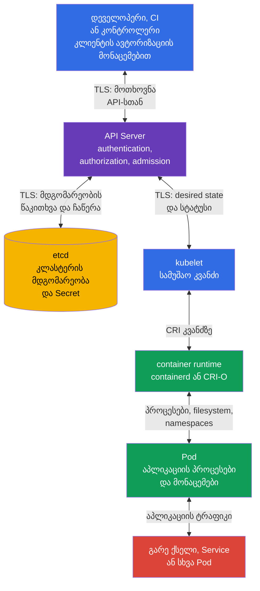

[Русская версия](ru.md) · [Eng version](README.md) · [Versión en español](es.md) · [Version française](fr.md) · [Deutsche Version](de.md) · [繁體中文版](tw.md) · [日本語版](jp.md)

# თავი 15. ნდობის საზღვრები, მონაცემთა ნაკადები და საფრთხეების მოდელი

> **რა არის შემდეგ.** თავებში 10-14 განხილულია ცალკეული კონტროლები: იდენტობები და RBAC, `Pod`-ის, `Secret`-ის უსაფრთხოება, ქსელის სეგმენტაცია და აუდიტი. ახლა საჭიროა მათი დაკავშირება იმასთან, თუ რას ვიცავთ, ვისგან და მონაცემთა ნაკადის რომელ წერტილში. საფრთხეების მოდელი ამ არჩევანს მკაფიოს ხდის. ეს არის KCSA დომენის **Kubernetes Threat Model** თემა, რომლის წონაა 16%. კურსის მაგალითები ორიენტირებულია Kubernetes `v1.36`-ზე.

## 15.1 რა არის საფრთხეების მოდელი და რატომ არის ის საჭირო Kubernetes-ში

საფრთხეების მოდელი არის სისტემის, მისი აქტივების, მონაწილეების, მონაცემთა ნაკადების, ნდობის საზღვრებისა და შესაძლო ბოროტად გამოყენების სტრუქტურირებული აღწერა. ის ყველა შეტევას არ პროგნოზირებს და უსაფრთხოების კონტროლს არ ანაცვლებს. მისი მიზანი უფრო მარტივია: ინციდენტამდე დასვას სწორი კითხვები და კონკრეტული რისკისთვის შეარჩიოს კონტროლები.

Kubernetes-ში სისტემა განაწილებულია: დეველოპერი ან CI აგზავნის მოთხოვნას API-ში, API Server ინახავს მდგომარეობას etcd-ში, სამუშაო კვანძზე `kubelet` იღებს სასურველ მდგომარეობას, ხოლო container runtime უშვებს `Pod`-ს. ცალკე მიმდინარეობს აპლიკაციების ქსელური მიმართვები, `Secret`-ზე წვდომა, registry-სთან მიმართვები და დაკვირვებადობა. ამიტომ ფრაზა „კლასტერი დაცულია“ საზღვრის მითითების გარეშე ზედმეტად ბუნდოვანია.

დაწყება სასარგებლოა ოთხი კითხვით:

1. **რომელი აქტივებია ღირებული?** მაგალითად, კლიენტების მონაცემები, `Secret`, `ServiceAccount`-ის ტოკენები, იმიჯები, კონფიგურაცია, API-ზე წვდომა და გამოთვლითი რესურსები.
2. **ვინ მოქმედებს?** დეველოპერი, CI, აპლიკაციის მომხმარებელი, ადმინისტრატორი, ღრუბლოვანი პროვაიდერი, კომპრომეტირებული `Pod` ან გარე შემტევი.
3. **რომელი გზებია ხელმისაწვდომი?** Kubernetes API, ქსელი `Pod`-ებს შორის, kubelet API, container runtime socket, ტომი, etcd-ის backup, registry.
4. **სად ენდობა გადაწყვეტილება შემავალ მონაცემებს ან იდენტობას?** client-API, API-etcd, API-kubelet, runtime-`Pod` საზღვრებზე, namespace-ებს შორის და ქსელში გასვლისას.

შედეგი აუცილებელი არ არის დიდი დოკუმენტი იყოს. პატარა გუნდისთვის საკმარისია სქემა, საფრთხეების ცხრილი და კონტროლების მფლობელთა სია. მნიშვნელოვანია მოდელის განახლება, როდესაც ემატება ახალი `Namespace`, გარე ingress, webhook, ღრუბლოვანი როლი ან მგრძნობიარე მონაცემებზე წვდომა.

| მოდელის ელემენტი | კითხვა | Kubernetes-ის მაგალითი |
|---|---|---|
| აქტივი | რა დაიკარგება ან შეიცვლება? | `Secret` გადახდის API-ის გასაღებით |
| მონაწილე | ვისი მოქმედება გაანალიზდება? | CI kubeconfig-ით ან აპლიკაციის `ServiceAccount` |
| მონაცემთა ნაკადი | სად გადაიცემა ინფორმაცია? | `kubectl` აგზავნის მოთხოვნას API Server-ში TLS-ის მეშვეობით |
| ნდობის საზღვარი | სად იცვლება ნდობის დონე? | API Server ამოწმებს კლიენტის ტოკენს და მის RBAC უფლებებს |
| საფრთხე | რა არასასურველი შედეგია შესაძლებელი? | კომპრომეტირებული ტოკენი ქმნის `privileged` `Pod`-ს |
| კონტროლი | რა ამცირებს ალბათობას ან შედეგებს? | MFA/OIDC, RBAC, PSA, audit logging და ტოკენის როტაცია |

საფრთხეების მოდელი გვეხმარება, რომ კონტროლი აქტივში არ აგვერიოს. მაგალითად, `NetworkPolicy` ზღუდავს ქსელურ გზას, მაგრამ `Secret`-ს არ მალავს სუბიექტისგან, რომელსაც აქვს `get secrets` ნებართვა. Encryption at rest იცავს ჩანაწერს etcd-ში, მაგრამ API კლიენტის ავთენტიფიკაციას არ ანაცვლებს. ერთ რისკს ხშირად დაცვის რამდენიმე ფენა აქვს.

## 15.2 ნდობის საზღვრები და კლასტერის მონაცემთა ნაკადი

**ნდობის საზღვარი** არის ადგილი, სადაც მონაცემები ან მოთხოვნა ნაკლებად სანდო მონაწილისგან უფრო სანდო მონაწილესთან გადადის ან უფლებამოსილების კონტექსტს იცვლის. ასეთ საზღვარზე ამოწმებენ იდენტობას, უფლებებს, მთლიანობას და, თუ მონაცემები მგრძნობიარეა, კონფიდენციალურობას. TLS მნიშვნელოვანია არხის დასაცავად, მაგრამ ვერ წყვეტს, აქვს თუ არა გამგზავნს მოქმედების შესრულების უფლება.

ტიპურ კლასტერში ცენტრალური საზღვარია API Server. ის ახდენს კლიენტის ავთენტიფიკაციას, მოთხოვნის ავტორიზაციას და მდგომარეობის შეცვლამდე admission კონტროლებს იყენებს. etcd არ არის განკუთვნილი ჩვეულებრივი მომხმარებლების პირდაპირი წვდომისთვის: ის ინახავს კლასტერის მდგომარეობას და მხოლოდ დაცულ API Server-ს უნდა ენდობოდეს. `kubelet` API-ის მეშვეობით იღებს ან აკვირდება სამუშაო კვანძისთვის დანიშნულ ობიექტებს და ინსტრუქციებს ადგილობრივ container runtime-ს გადასცემს. Runtime ქმნის პროცესებსა და კონტეინერების იზოლაციას, ხოლო `Pod` ასრულებს აპლიკაციის კოდს, რომელსაც შეიძლება ჰქონდეს საკუთარი ქსელი, ტომები და ტოკენი.



სქემაზე ისრები ორმხრივია, რადგან კომპონენტები ცვლიან მოთხოვნებსა და პასუხებს. ეს ნდობის ერთსა და იმავე დონეს არ ნიშნავს. მაგალითად, API Server წერს მდგომარეობას etcd-ში, მაგრამ etcd-მ `Pod`-ისგან ადმინისტრაციული მოთხოვნები არ უნდა მიიღოს; runtime მართავს კონტეინერს, მაგრამ აპლიკაციამ მის socket-ზე წვდომა არ უნდა მიიღოს.

| საზღვარი | რა შეიძლება მოხდეს არასწორად | კონცეპტუალური კონტროლები |
|---|---|---|
| კლიენტი ↔ API Server | მოპარული kubeconfig, ყალბი იდენტობა, ზედმეტად ფართო უფლებები | TLS, საიმედო ავთენტიფიკაცია, მოკლევადიანი ავტორიზაციის მონაცემები, RBAC, audit logging |
| API Server ↔ etcd | მდგომარეობის წაკითხვა ან შეცვლა, snapshot-ის გაჟონვა | TLS, შეზღუდული ქსელური და ჰოსტზე წვდომა, encryption at rest, დაცული backup |
| API Server ↔ kubelet | kubelet API-ის ბოროტად გამოყენება ან სტატუსის გაყალბება | ორმხრივი ავთენტიფიკაცია, kubelet-ის ავტორიზაცია, სამუშაო კვანძის დაცვა |
| kubelet ↔ runtime | CRI socket-ზე წვდომა კონტეინერების მართვის საშუალებას იძლევა | socket-ზე წვდომა მხოლოდ სისტემური კომპონენტებისთვის, კვანძის hardening, მონიტორინგი |
| runtime ↔ `Pod` | კონტეინერიდან escape, სახიფათო mount ან პრივილეგიები | PSS/PSA, `securityContext`, seccomp, AppArmor, მინიმალური capabilities |
| `Pod` ↔ ქსელი და მონაცემები | MITM, lateral movement, exfiltration | `NetworkPolicy`, TLS ან mTLS, DNS კონტროლები, RBAC და `Secret`-ების განცალკევება |

ყველა ნაკადი დიაგრამის პირდაპირ ხაზს არ მიჰყვება. კონტროლერები API-ს კლიენტების სახით იყენებენ, admission webhook იღებს გამოძახებას API Server-ისგან, CSI-სა და CNI-ს შეუძლიათ სამუშაო კვანძთან მიმართვა, ხოლო აპლიკაცია გარე სერვისს მიმართავს. მოდელირებისას ეს კავშირები ემატება, თუ ისინი კონკრეტულ პლატფორმაში არსებობს. წინააღმდეგ შემთხვევაში „უხილავი“ webhook ან ღრუბლოვანი როლი ნდობის გაუთვალისწინებელ საზღვრად იქცევა.

## 15.3 STRIDE, MITRE ATT&CK for Containers და kill chain

> **მნიშვნელოვანია KCSA domain mapping-ისთვის.**
> Linux Foundation **Threat Modelling Frameworks**-ს მიაკუთვნებს დომენს
> **Compliance and Security Frameworks**, და არა დომენს
> **Kubernetes Threat Model**.
>
> STRIDE, MITRE ATT&CK for Containers და kill chain ამ თავში გამოიყენება,
> როგორც cross-domain ანალიტიკური კონტექსტი უკვე განსაზღვრულ
> trust boundaries-სა და data flows-თან მუშაობისთვის. გამოცდაზე კითხვები უშუალოდ
> threat-modelling frameworks-ის დანიშნულების შესახებ უნდა მიაკუთვნოთ Compliance-ს.
>
> თავად დომენი **Kubernetes Threat Model** ამოწმებს trust boundaries/data flow-ს,
> persistence-ს, denial of service-ს, malicious code / compromised applications-ს,
> attacker on the network-ს, access to sensitive data-ს და privilege escalation-ს.
> framework competencies-ის დეტალური, გამოცდაზე ორიენტირებული გამეორება მოცემულია
> [თავში 19](../19/ge.md).

ფრეიმვორკები პარამეტრების ურთიერთჩანაცვლებადი სიები არ არის: თითოეულს თავისი გამოყენების სფერო და კითხვა აქვს, რომელსაც პასუხობს. ჯერ განვიხილოთ, რას წყვეტს თითოეული მათგანი, შემდეგ კი ცალ-ცალკე დეტალურად გავარჩიოთ STRIDE და ATT&CK for Containers.

| ფრეიმვორკი | რომელ კითხვას პასუხობს | ანალიზის ერთეული | როდის გამოვიყენოთ |
|---|---|---|---|
| STRIDE | კონკრეტულ ნაკადთან ან საზღვართან საფრთხეების რომელი კლასებია შესაძლებელი? | არქიტექტურის ელემენტი (კომპონენტი, მონაცემთა ნაკადი, ნდობის საზღვარი) | პროექტირების ან არქიტექტურის მიმოხილვის ეტაპზე, ინციდენტამდე |
| MITRE ATT&CK for Containers | რომელ ტაქტიკებსა და ტექნიკებს უკვე იყენებს ან შეიძლება იყენებდეს შემტევი კონტეინერულ გარემოში? | შემტევის დაკვირვებადი ქცევა (ტაქტიკა → ტექნიკა) | დეტექტირების აგებისას, ინციდენტის გარჩევისას, runtime დაცვის დაფარვის შეფასებისას |
| Kill chain | შეტევის განვითარების რომელ ეტაპზეა მისი შეჩერება ყველაზე ეფექტური? | ერთი შეტევის ეტაპების თანმიმდევრობა (მომზადებიდან მიზნამდე) | preventive და detective control-ების ერთმანეთთან მიმართებით განთავსების არჩევისას |

**STRIDE** და **ATT&CK for Containers** ერთმანეთს არ ეჯიბრება, არამედ ერთი სურათის სხვადასხვა მხარეს ფარავს: STRIDE არის არქიტექტურის ანალიზი „საფრთხიდან“, რომელიც წინასწარ გამოიყენება, ATT&CK კი არის ქცევის ანალიზი „შემტევიდან“, რომელიც უკვე დაკვირვებად ან ჰიპოთეზურ მოქმედებებზე გამოიყენება. **Kill chain** არ არის საფრთხეების ან ტექნიკების ცალკე სია, არამედ STRIDE-ისა და ATT&CK-ის შედეგების დროში დალაგების მეთოდია: ის აჩვენებს, რომელ ეტაპზე გამოვლინდება კონკრეტული საფრთხე (STRIDE-იდან) ან ტექნიკა (ATT&CK-იდან) და გვეხმარება გადავწყვიტოთ, სად უფრო ხელსაყრელია preventive control-ის განთავსება და სად detective-ის.

**კომბინირების საუკეთესო პრაქტიკა.** ნუ ეცდებით სამივე ფრეიმვორკის ერთ დოკუმენტში ან ერთ ცხრილში გაერთიანებას, რადგან მათ ანალიზის სხვადასხვა ღერძი აქვთ და იძულებითი გაერთიანება აბუნდოვანებს კითხვას, რომელსაც თითოეული პასუხობს. პრაქტიკული თანმიმდევრობაა: (1) ახალი არქიტექტურის ან არსებითი ცვლილებისთვის ჯერ თითოეული ელემენტი და ნაკადი STRIDE-ით გაიარეთ, რაც საფრთხეებისა და trust boundaries-ის სიას იძლევა; (2) თქვენს გარემოში რეალისტური საფრთხეები ATT&CK for Containers-ის ტაქტიკებსა და ტექნიკებს შეუსაბამეთ, რაც კონკრეტულ დაკვირვებად სიგნალებსა და existing detection coverage-ს იძლევა; (3) შედეგი kill chain-ის მიხედვით დაალაგეთ, რათა დაინახოთ, შეტევის რომელ ეტაპებს ფარავს preventive control, რომელს მხოლოდ detective და სად არის ხარვეზი. STRIDE და ATT&CK არ არის ვალდებული, ერთი-ერთზე ემთხვეოდეს: STRIDE-ის ერთი საფრთხე (მაგალითად Elevation of Privilege) შეიძლება ATT&CK-ის რამდენიმე ტექნიკით გამოვლინდეს (privileged container, hostPath, capability abuse) და ეს ანალიზის შეცდომა კი არა, მოსალოდნელი შედეგია. ფრეიმვორკებსა და კომპლაიენსთან დეტალური შესაბამისობა მოცემულია თავში 19.

### STRIDE: ექვსი კითხვა თითოეული ელემენტისთვის

| კატეგორია | კითხვა კლასტერთან | მაგალითი | შესაფერისი კონტროლები |
|---|---|---|---|
| Spoofing | შეუძლია თუ არა შემტევს თავი სხვად გაასაღოს? | მოპარული `ServiceAccount` ტოკენი გამოიყენება, როგორც ლეგიტიმური | ავთენტიფიკაცია, ტოკენების როტაცია, მათი გაცემის შეზღუდვა |
| Tampering | შეუძლია თუ არა მას მონაცემების ან კონფიგურაციის შეუმჩნევლად შეცვლა? | შეცვლილი `Deployment` სხვა იმიჯს უშვებს | RBAC, admission, იმიჯების ხელმოწერა, audit logging |
| Repudiation | შესაძლებელია თუ არა იმის დამტკიცება, ვინ შეასრულა მოქმედება? | `Secret` წაიშალა, მაგრამ ავტორის შესახებ ჩანაწერი არ არსებობს | audit policy, ლოგების დაცული შენახვა და კორელაცია |
| Information Disclosure | შესაძლებელია თუ არა მგრძნობიარე მონაცემების გამჟღავნება? | etcd backup-ზე წვდომა `Secret`-ს ამჟღავნებს | encryption at rest, RBAC, backup-ის დაცვა |
| Denial of Service | შესაძლებელია თუ არა რესურსის ამოწურვა ან ხელმისაწვდომობის დარღვევა? | `Pod` სამუშაო კვანძის CPU-სა და მეხსიერებას იკავებს | `requests`, `limits`, `ResourceQuota`, მონიტორინგი |
| Elevation of Privilege | შეუძლია თუ არა სუბიექტს მეტი უფლების მიღება? | კონტეინერი `hostPath`-ითა და ზედმეტი capability-ით გავლენას ახდენს კვანძზე | PSS/PSA, `securityContext`, least privilege, კვანძის hardening |

STRIDE არ ამტკიცებს, რომ თითოეული ელემენტი აუცილებლად მოწყვლადია. ის საფრთხეების რომელიმე კლასის გამოტოვების საშუალებას არ გვაძლევს. მაგალითად, API Server-ისთვის spoofing და tampering მოწმდება იდენტობებისა და RBAC-ის მეშვეობით, ხოლო აუდიტის ჟურნალისთვის განსაკუთრებით მნიშვნელოვანია repudiation და საცავის მთლიანობა.

### ATT&CK for Containers და შეტევის განვითარება

MITRE ATT&CK for Containers შემტევის ქცევას ტაქტიკებად და ტექნიკებად აჯგუფებს. associate დონეზე სასარგებლოა ჯაჭვის ლოგიკის ამოცნობა და არა ტექნიკების იდენტიფიკატორების დაზეპირება. ATT&CK ვითარდება: ქვემოთ მოცემული სახელები Containers Matrix v19-თან არის გადამოწმებული, თუმცა operational mapping-მდე ისინი ოფიციალურ მატრიცაში ხელახლა უნდა გადამოწმდეს. ერთმა ინციდენტმა შეიძლება რამდენიმე ტაქტიკა გაიაროს და აუცილებელი არ არის თითოეულ მათგანს შეიცავდეს.

| ეტაპი ან ტაქტიკა | შესაძლო მოქმედება Kubernetes-ში | რა უნდა ვეძებოთ ან შევზღუდოთ |
|---|---|---|
| Initial Access | მოწყვლადი აპლიკაცია იღებს მავნე მოთხოვნას ან კლასტერში მოპარული kubeconfig ხვდება | აპლიკაციის დაცვა, ავთენტიფიკაცია, გარე ზედაპირი, audit events |
| Execution | კონტეინერში სრულდება shell ან მოულოდნელი პროცესი | runtime დეტექტირება, პროცესის ლოგები, მინიმალური იმიჯი |
| Persistence | იქმნება `CronJob`, webhook, სტატიკური `Pod` ან ინახება ტოკენი | ცვლილებების მიმოხილვა, RBAC, audit logging, control plane-ის კონტროლი |
| Privilege Escalation | კონტეინერი იღებს `privileged`, `hostPath`-ს ან runtime socket-ზე წვდომას | PSA, admission, `securityContext`, კვანძის შეზღუდვები |
| Defense Impairment | დაცვის საშუალება ითიშება ან იცვლება | კონფიგურაციის დაცვა, ლოგების ცალკე შენახვა, ცვლილებების აუდიტი |
| Credential Access | იკითხება `Secret`, token ან kubeconfig | RBAC, encryption at rest, უსაფრთხო მიწოდება და როტაცია |
| Discovery | ჩამოითვლება `Namespace`, `Pod`, სერვისები და API რესურსები | least privilege, უჩვეულო `list` და `watch` მოქმედებების აუდიტი |
| Lateral Movement | კომპრომეტირებული `Pod` სხვა სერვისს ან კვანძს მიმართავს | სეგმენტაცია, `NetworkPolicy`, mTLS, kubelet-ის დაცვა |
| მონაცემებზე წვდომა და exfiltration (data-flow lens, არა Containers Matrix-ის ტაქტიკა) | მონაცემები იკითხება volume-იდან და იგზავნება გარე endpoint-ზე | egress-ის შეზღუდვა, TLS, ქსელისა და მონაცემების მონიტორინგი |
| Impact | იშლება workloads, იშიფრება მონაცემები ან იწურება რესურსები | backup, კვოტები, შეზღუდვები, შეტყობინებები და რეაგირების გეგმა |

Kill chain სასარგებლოა კითხვაზე „რომელ ეტაპზე შევაჩეროთ შეტევა“. მაგალითად, იმიჯის სკანირება და ხელმოწერა ამცირებს malicious artifact-ის მეშვეობით initial access-ის შანსს; PSA ამცირებს privilege escalation-მდე მისასვლელ გზას; `NetworkPolicy` ზღუდავს lateral movement-ს; აუდიტი და runtime დეტექტირება მტკიცებულებებს იძლევა execution-ისა და Defense Impairment-ის ეტაპებზე. მთელი ჯაჭვისთვის ერთი კონტროლი არ არსებობს.

მნიშვნელოვანია, ATT&CK ავტომატურ განაჩენად არ ვაქციოთ. კონტეინერში `sh`-ის გაშვება, `list pods` მოთხოვნა ან გამავალი HTTPS ტრაფიკი შეიძლება ნორმალური იყოს. კონტექსტს გვაძლევს workload-ის მფლობელი, namespace, დრო, იმიჯი, API მოთხოვნის ინიციატორი და აპლიკაციის მოსალოდნელი ქცევა.

## 15.4 Attack tree: production secrets-ის მოპოვება

Attack tree ზოგად საფრთხეს შემოწმებად გზებად გარდაქმნის. მიზანი ყველა exploit-ის ჩამოთვლა კი არა, თითოეული რეალისტური ნაბიჯისთვის control-ისა და evidence-ის არჩევაა.

```text
Goal: production secrets-ის მოპოვება
├── kubeconfig-ის მოპარვა
│   └── excessive RBAC-ის გამოყენება
├── Pod-ის კომპრომეტირება
│   ├── ServiceAccount token-ის წაკითხვა
│   ├── Kubernetes API-ის გამოძახება
│   └── excessive permissions-ის გამოყენება
├── etcd backup-ის მოპოვება
│   └── Secret არ არის დაცული encryption at rest-ით
└── CI/CD-ის კომპრომეტირება
    └── malicious artifact-ის ჩაშენება
```

| Attack path | Preventive control | Detective control | Evidence |
|---|---|---|---|
| მოპარული `ServiceAccount` token კითხულობს `Secret`-ს | ცალკე workload identity და least-privilege RBAC | Kubernetes API audit | audit event: identity, `get`, `secrets`, response status |
| კონტეინერში shell ეძებს ავტორიზაციის მონაცემებს | ხელმისაწვდომი workload ავტორიზაციის მონაცემების მინიმიზაცია: ზედმეტი `Secret`-ების არ დამონტაჟება, `automountServiceAccountToken: false`-ის გამოყენება, თუ Kubernetes API საჭირო არ არის, და ცალკე workload identity-ის მინიჭება least-privilege RBAC-ით | Falco ან სხვა runtime detector | runtime event shell-ის ან ავტორიზაციის მონაცემების ფაილზე წვდომის შესახებ |
| Malicious image გადის CI-ს | digest, SBOM, signature/provenance და admission verification | registry/CI/admission logs | შემოწმებული attestation და admission decision |
| Etcd backup ამჟღავნებს მონაცემებს | encryption at rest, backup-ისა და წვდომის დაცვა | backup-ზე წვდომის აუდიტი და storage controls-ის მიმოხილვა | backup ანგარიში/access trail |

არცერთი preventive control გზას თავისთავად შეუძლებელს არ ხდის: RBAC ვერ ხედავს shell-ს კონტეინერის შიგნით, ხოლო runtime detection ხშირად უკვე დაწყებულ მოქმედებას აღმოაჩენს. გამოცდაზე ჯერ დაასახელეთ აქტივი და შეტევის გზა, შემდეგ შეარჩიეთ control enforcement point-ზე და მტკიცებულება, რომელიც მას ადასტურებს.

## 15.5 როგორ გამოვიყენოთ საფრთხეების მოდელი საკუთარ კლასტერში

პრაქტიკული გამოყენება იწყება შეზღუდული სცენარით და არა Kubernetes-ის ყველა კომპონენტის სიით. მაგალითად: „CI განათავსებს ინტერნეტმაღაზიას namespace `payments`-ში, აპლიკაცია კითხულობს გადახდის ტოკენს და გარე პროვაიდერს მიმართავს“. ასეთი სცენარისთვის შესაძლებელია მოკლე სამუშაო ცხრილის შედგენა.

| ნაბიჯი | რას აფიქსირებენ | შედეგის მაგალითი |
|---|---|---|
| 1. სფეროს განსაზღვრა | სისტემა, namespace, ინტეგრაციები და მფლობელები | `payments`, CI, registry, გადახდის API, პლატფორმის გუნდი |
| 2. აქტივების ჩამოთვლა | რას სჭირდება კონფიდენციალურობა, მთლიანობა ან ხელმისაწვდომობა | პროვაიდერის ტოკენი, შეკვეთები, აპლიკაციის იმიჯი, რესურსების კვოტა |
| 3. ნაკადების დახატვა | ვინ, სად და რომელი ავტორიზაციის მონაცემებით მიმართავს | CI → API Server; `Pod` → გადახდის API; API Server → etcd |
| 4. საზღვრების მონიშვნა | სად იცვლება ნდობა ან უფლებები | CI-API, API-etcd, `Pod`-გარე ქსელი, `Pod`-`Secret` |
| 5. საფრთხეების გარჩევა | STRIDE და ATT&CK-ის სავარაუდო მოქმედებები | მოპარული ტოკენი, იმიჯის ჩანაცვლება, egress მონაცემებით, DoS |
| 6. კონტროლების არჩევა და დანიშვნა | პრევენციული, დეტექტირების, აღდგენის | RBAC და PSA, `NetworkPolicy`, აუდიტი, backup, კონტროლის მფლობელი |
| 7. ცვლილებების შემოწმება | რა შეიცვალა ახალი სერვისის ან ინციდენტის შემდეგ | ახალი webhook-ისა და მისი უფლებების მოდელში დამატება |

განვიხილოთ სამი ტიპური გადაწყვეტილება. თუ CI-ს აქვს `cluster-admin`, tampering-ის რისკი ზედმეტად დიდია: ცალკე `ServiceAccount` და შეზღუდული `Role` ამცირებს შეცდომის ან ავტორიზაციის მონაცემის მოპარვის ზემოქმედების რადიუსს. თუ აპლიკაციას unrestricted egress აქვს, exfiltration-ისა და lateral movement-ის რისკი უფრო მაღალია: default-deny და `NetworkPolicy`-ის მიზნობრივი წესები ზღუდავს ცნობილ გზებს, ხოლო TLS ან mTLS იცავს ნებადართულ არხს. თუ `Secret` ხელმისაწვდომია namespace-ის ყველა `Pod`-ისთვის, disclosure-ის რისკი დიდია: ცალკე identities, ვიწრო RBAC უფლებები, encryption at rest და როტაცია ამცირებს შედეგებს.

პრიორიტეტიზაცია დამოკიდებულია ზიანსა და საფრთხის რეალისტურობაზე. Production კლასტერში, რომელიც გადახდებს ამუშავებს, როგორც წესი, პირველ რიგში უნდა იყოს დაცული ადმინისტრაციული წვდომა, საიდუმლოებები, სამუშაო კვანძები და გარე ნაკადები. სატესტო გარემოც არ არის გამონაკლისი, თუ მასში production ავტორიზაციის მონაცემები ან საერთო control plane არის. საფრთხეების მოდელი ფაქტობრივ არქიტექტურას უნდა ასახავდეს და არა გარემოს ფორმალურ სახელს.

## 15.6 როგორ იყენებენ ამას პრაქტიკაში

პლატფორმის გუნდი ინარჩუნებს ტიპური workloads-ის მონაცემთა ნაკადების საბაზისო სქემას და ცალკე სქემებს კრიტიკული ინტეგრაციებისთვის. ახალი კომპონენტის განხილვისას სვამენ კითხვების მოკლე ნაკრებს: რომელ API უფლებებს იღებს, რომელ `Secret`-ებს კითხულობს, სად შეუძლია ქსელით მიმართვა, უშვებს თუ არა პრივილეგირებულ კოდს და ვინ დაინახავს მის მოვლენებს.

საფრთხეები იზომებად შემოწმებებს უკავშირდება. client-API საზღვრისთვის ეს არის RBAC-ისა და audit events-ის მიმოხილვა. სამუშაო კვანძისთვის არის kubelet-სა და runtime socket-ზე წვდომის კონტროლი, PSS/PSA და `securityContext`-ის მდგომარეობა. მონაცემებისთვის არის etcd-ის დაშიფვრა, backup-ის დაცვა და `secrets`-ზე მინიმალური უფლებები. ქსელისთვის არის გასაგები გამავალი და შემომავალი კავშირები, `NetworkPolicy` და TLS ან mTLS იქ, სადაც ტრაფიკი მგრძნობიარეა.

მოდელი გამოძიებასაც ეხმარება. როდესაც მოულოდნელი პროცესის შესახებ alert ჩნდება, გუნდი მას ATT&CK-ის ეტაპსა და სქემას უსადაგებს: რომელი `Pod`, იმიჯი, `ServiceAccount`, კვანძი და ქსელური მარშრუტი იყო ჩართული. ეს უფრო სწრაფია, ვიდრე ინციდენტის დაწყება ყველა ლოგში შეუზღუდავი ძიებით.

## 15.7 Exam vocabulary / მინი-ლექსიკონი

| ტერმინი | მნიშვნელობა |
|---|---|
| საფრთხეების მოდელი | სისტემის აქტივების, მონაწილეების, ნაკადების, ნდობის საზღვრების, საფრთხეებისა და კონტროლების აღწერა. |
| ნდობის საზღვარი | სხვადასხვა ნდობის დონის მქონე მონაწილეებს ან კონტექსტებს შორის გადასვლის წერტილი. |
| მონაცემთა ნაკადი | მოთხოვნის, მდგომარეობის ან მონაცემების კომპონენტებს შორის გადაცემა. |
| STRIDE | ფრეიმვორკი კატეგორიებით Spoofing, Tampering, Repudiation, Information Disclosure, Denial of Service და Elevation of Privilege. |
| MITRE ATT&CK for Containers | ტაქტიკებისა და ტექნიკების ბაზა, რომელიც კონტეინერულ გარემოში შემტევების ქცევას აღწერს. |
| kill chain | შეტევის ეტაპების თანმიმდევრობის მოდელი საწყისი წვდომიდან ზემოქმედებამდე. |
| lateral movement | შემტევის გადასვლა კომპრომეტირებული რესურსიდან სხვა რესურსზე. |
| attack surface | ხელმისაწვდომი გზების ერთობლიობა, რომელთა მეშვეობითაც სისტემაზე შეტევაა შესაძლებელი. |

## 15.8 Exam Essentials / თავის შეჯამება

- საფრთხეების მოდელი აკავშირებს აქტივებს, მონაწილეებს, მონაცემთა ნაკადებს, ნდობის საზღვრებს, საფრთხეებსა და კონტროლებს.
- Kubernetes-ში ძირითადი საზღვრები გადის კლიენტსა და API Server-ს, API Server-სა და etcd-ს, API Server-სა და kubelet-ს, kubelet-სა და runtime-ს, runtime-სა და `Pod`-ს შორის, ასევე `Pod`-ებს, ქსელსა და მონაცემებს შორის.
- TLS იცავს გადაცემის არხს, მაგრამ გადაწყვეტილებისთვის „ნებადართულია თუ არა მოქმედება“ საჭიროა ავთენტიფიკაცია, ავტორიზაცია და admission.
- STRIDE, MITRE ATT&CK for Containers და kill chain ხელს უწყობს საფრთხეებისა და შეტევის განვითარების ანალიზს, მაგრამ ოფიციალურ KCSA domain mapping-ში **Threat Modelling Frameworks მიეკუთვნება Compliance and Security Frameworks-ს**; აქ ისინი cross-domain კონტექსტად გამოიყენება.
- ერთი კონტროლი მთელ შეტევას არ ფარავს: RBAC, PSA, encryption, სეგმენტაცია, აუდიტი, runtime დეტექტირება და backup ფენებად მუშაობს.
- სამუშაო საფრთხეების მოდელი უნდა იყოს მოკლე, რეალურ ნაკადებთან დაკავშირებული და არქიტექტურის ცვლილებისას განახლებადი.

## 15.9 არ აგერიოთ და როგორ გვხვდება ეს გამოცდაზე

MCQ-ში (multiple choice question, კითხვა პასუხის არჩევით) ხშირად აღწერენ ერთ კომპონენტს ან სცენარს და ითხოვენ ყველაზე შესაფერისი კონტროლის არჩევას. ჯერ განსაზღვრეთ აქტივი და საზღვარი: ეს არის API წვდომა, etcd-ის მონაცემები, `Pod`-ის უფლებები, სამუშაო კვანძზე წვდომა თუ ქსელური ნაკადი. შემდეგ ერთმანეთისგან გამოყავით პრევენცია, დეტექტირება და აღდგენა.

ტიპური მახეები:

- TLS-ის RBAC-ის შემცვლელად მიჩნევა: TLS ადასტურებს დაცულ არხს, მაგრამ იდენტობის ნებართვებს არ ზღუდავს;
- `NetworkPolicy`-ის etcd მონაცემების ან API-ის მეშვეობით წაკითხული `Secret`-ის დაცვად მიჩნევა;
- იმის მიჩნევა, რომ კლასტერის ჩვეულებრივი მართვისთვის etcd პირდაპირ ხელმისაწვდომი უნდა იყოს მომხმარებლებისთვის;
- kill chain-ის ყველა ეტაპისთვის ერთი ზომის არჩევა;
- ნებისმიერი პროცესის, `list` API მოთხოვნის ან HTTPS ტრაფიკის კონტექსტის გარეშე შეტევად მიჩნევა;
- STRIDE-ის პარამეტრების სიად აღრევა საფრთხეების შესახებ კითხვების დასმის მეთოდთან.

თუ პასუხის ვარიანტებში ფრეიმვორკებია არეული, დაიმახსოვრეთ დანიშნულება: STRIDE საფრთხეებს კლასიფიცირებს, ATT&CK for Containers მოწინააღმდეგის ტაქტიკებსა და ტექნიკებს აღწერს, ხოლო kill chain შეტევის მსვლელობას აჩვენებს. ეს ურთიერთშემავსებელი და არა კონკურენტი მოდელებია.

## 15.10 კითხვები თვითშემოწმებისთვის

### 1. ჩვეულებრივ რომელი კომპონენტია Kubernetes-ის მართვის მოთხოვნებისთვის ნდობის ცენტრალური საზღვარი?

   - a. აპლიკაციის `Pod`.

   - b. container runtime.

   - c. API Server.

   - d. CNI პლაგინი.

<details>
<summary>პასუხი და განმარტება</summary>

**სწორი პასუხია: c.** API Server ახდენს კლიენტის ავთენტიფიკაციას, ამოწმებს მის უფლებამოსილებას და მდგომარეობის შეცვლამდე იყენებს admission-ს. Runtime და CNI სხვა საზღვრებისთვის მნიშვნელოვანია, მაგრამ Kubernetes API მოთხოვნების დამუშავების ჩვეულებრივი წერტილები არ არის.

</details>

### 2. რომელი კონტროლი ყველაზე პირდაპირ ამცირებს რისკს, რომ მოპარული kubeconfig-ის მქონე სუბიექტმა მთელ კლასტერში თვითნებური `Deployment` შექმნას?

   - a. RBAC მინიმალური უფლებამოსილებით ამ იდენტობისთვის.

   - b. `ResourceQuota`.

   - c. Encryption at rest etcd-ისთვის.

   - d. `NetworkPolicy` აპლიკაციის namespace-ისთვის.

<details>
<summary>პასუხი და განმარტება</summary>

**სწორი პასუხია: a.** Least-privilege RBAC ზღუდავს, რომელი API მოქმედებების შესრულება შეუძლია კომპრომეტირებულ იდენტობას. დანარჩენი კონტროლებიც მნიშვნელოვანია, მაგრამ API-ის მეშვეობით `create deployments` უფლებას არ განსაზღვრავს.

</details>

#### Cross-domain გამეორება: Compliance and Security Frameworks

### 3. STRIDE-ის რომელი კატეგორია აღწერს საუკეთესოდ `Secret`-ის წაკითხვას etcd-ის დაუცველი snapshot-იდან?

   - a. Information Disclosure.

   - b. Denial of Service.

   - c. Tampering.

   - d. Repudiation.

<details>
<summary>პასუხი და განმარტება</summary>

**სწორი პასუხია: a.** ამ სცენარში მგრძნობიარე მონაცემები მჟღავნდება. რისკის შესამცირებლად საჭიროა etcd-სა და backup-ზე წვდომის დაცვა, ასევე encryption at rest. Repudiation ეხება მოქმედების ავტორის დადგენის შეუძლებლობას.

</details>

### 4. როგორია STRIDE-ისა და MITRE ATT&CK for Containers-ის ყველაზე ზუსტი ურთიერთმიმართება?

   - a. STRIDE საფრთხეების კლასებს ახარისხებს, ხოლო ATT&CK for Containers შემტევის მოქმედებების ტაქტიკებსა და ტექნიკებს აღწერს.

   - b. ორივე ფრეიმვორკი ავტომატურად ბლოკავს `privileged` `Pod`-ს.

   - c. STRIDE მონაცემთა დაშიფვრის მეთოდია, ხოლო ATT&CK RBAC-ს ანაცვლებს.

   - d. ATT&CK გამოიყენება მხოლოდ Kubernetes-ის გარეთ არსებულ ღრუბლოვან ინფრასტრუქტურაზე.

<details>
<summary>პასუხი და განმარტება</summary>

**სწორი პასუხია: a.** STRIDE საზღვრებსა და ნაკადებზე საფრთხეების სისტემატურ ანალიზს უწყობს ხელს. ATT&CK for Containers მოწინააღმდეგის დაკვირვებადი ქცევის აღსაწერ ენას გვაძლევს. არცერთი მათგანი არ არის პოლიტიკის იძულებითი აღსრულების მექანიზმი.

</details>

#### დაბრუნება Kubernetes Threat Model-ზე

### 5. რომელი სცენარი ასახავს საუკეთესოდ lateral movement-ს `Pod`-ის კომპრომეტირების შემდეგ?

   - a. კომპრომეტირებული პროცესი ლოკალური მარცხის შემდეგ იმავე კონტეინერში ხელახლა უშვებს ჩვეულებრივ HTTP listener-ს.
   - b. შემტევი უკვე კომპრომეტირებულ `Pod`-ში ცვლის აპლიკაციის ფაილს ისე, რომ სხვა workloads-ს ან systems-ს არ მიმართავს.
   - c. გარე კლიენტი ასკანირებს საჯარო Ingress endpoint-ს, მაგრამ ჯერ არცერთ workload-ზე წვდომა არ მიუღია.
   - d. კომპრომეტირებული `Pod` იყენებს ხელმისაწვდომ ქსელურ გზას ან ავტორიზაციის მონაცემს, რათა სხვა workload ზონის შიდა სერვისს მიმართოს.

<details>
<summary>პასუხი და განმარტება</summary>

**სწორი პასუხია: d.** Lateral movement არის უკვე კომპრომეტირებული წერტილიდან სხვა workloads-ზე, სერვისებზე ან ნდობის ზონებზე გადასვლა. ქსელის სეგმენტაცია, ვიწრო identities და least privilege ასეთ გზებს ამცირებს.

</details>

> **სად წავიდეთ შემდეგ.** ფრეიმვორკების, STRIDE-ის, MITRE ATT&CK for Containers-ისა და კომპლაიენსის მიმოხილვისთვის გადადით [KCSA-ს თავში 19](../19/ge.md). უსაფრთხოების პრაქტიკული საზღვრები და 4C მოდელი განხილულია CKS-ის თავში 02, ხოლო სიგნალების კორელაცია და შეტევის ფაზების გამოძიება CKS-ის თავში 30.

[სარჩევი](../README_GE.md) · [თავი 14](../14/ge.md) · [თავი 16](../16/ge.md)
