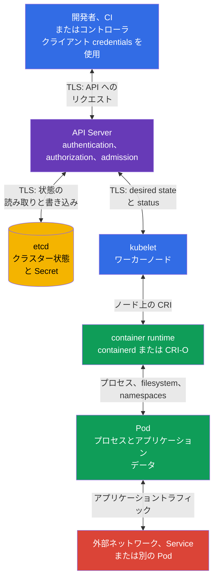

[Русская версия](ru.md) · [Eng version](README.md) · [Versión en español](es.md) · [Version française](fr.md) · [Deutsche Version](de.md) · [ქართული ვერსია](ge.md) · [繁體中文版](tw.md)

# 第15章. 信頼境界、データフロー、脅威モデル

> **この後に学ぶこと。** 第10-14章では、アイデンティティと RBAC、`Pod` セキュリティ、`Secret`、ネットワーク分離、監査という個別のコントロールを扱いました。ここでは、それらを保護対象、脅威主体、データフロー上の位置と結び付けます。脅威モデルはこの選択を明示的にします。これは、重み付けが16%の KCSA ドメイン **Kubernetes Threat Model** のテーマです。本コースの例は Kubernetes `v1.36` を対象としています。

## 15.1 脅威モデルとは何か、そして Kubernetes でなぜ必要か

脅威モデルとは、システム、その資産、主体、データフロー、信頼境界、および起こり得る悪用を構造化して説明するものです。すべての攻撃を予測するものでも、セキュリティコントロールを置き換えるものでもありません。目的はより単純です。インシデントの前に正しい問いを設定し、特定のリスクに対するコントロールを選択することです。

Kubernetes ではシステムが分散しています。開発者または CI が API にリクエストを送信し、API Server が状態を etcd に保存し、ワーカーノード上の `kubelet` が望ましい状態を取得し、container runtime が `Pod` を起動します。これとは別に、アプリケーションのネットワーク呼び出し、`Secret` へのアクセス、registry へのアクセス、オブザーバビリティがあります。したがって、境界を示さずに「クラスターは保護されている」と言うだけでは曖昧すぎます。

まず、次の4つの問いから始めると有用です。

1. **どの資産に価値があるか。** 例として、顧客データ、`Secret`、`ServiceAccount` トークン、イメージ、設定、API へのアクセス、コンピューティングリソースがあります。
2. **誰が行動するか。** 開発者、CI、アプリケーションユーザー、管理者、クラウドプロバイダー、侵害された `Pod`、または外部攻撃者です。
3. **どの経路が利用可能か。** Kubernetes API、`Pod` 間ネットワーク、kubelet API、container runtime socket、volume、etcd backup、registry です。
4. **どこで意思決定が入力データまたはアイデンティティを信頼するか。** クライアント-API、API-etcd、API-kubelet、runtime-`Pod` の境界、namespace 間、およびネットワークへの送信時です。

結果は大規模な文書である必要はありません。小規模なチームには、図、脅威表、コントロール所有者の一覧で十分です。新しい `Namespace`、外部 ingress、webhook、クラウドロール、または機密データへのアクセスを追加したときには、モデルを更新することが重要です。

| モデルの要素 | 問い | Kubernetes の例 |
|---|---|---|
| 資産 | 何が失われ、または変更されるか。 | 決済 API キーを含む `Secret` |
| 主体 | 誰の行動を分析するか。 | kubeconfig を持つ CI またはアプリケーションの `ServiceAccount` |
| データフロー | 情報はどこに送られるか。 | `kubectl` が TLS 経由で API Server にリクエストを送る |
| 信頼境界 | どこで信頼レベルが変わるか。 | API Server がクライアントトークンと RBAC 権限を検証する |
| 脅威 | どのような望ましくない結果が起こり得るか。 | 侵害されたトークンが `privileged` `Pod` を作成する |
| コントロール | 発生可能性または影響を何が低減するか。 | MFA/OIDC、RBAC、PSA、audit logging、トークンローテーション |

脅威モデルは、コントロールと資産を混同しないために役立ちます。たとえば、`NetworkPolicy` はネットワーク経路を制限しますが、`get secrets` 権限を持つ主体から `Secret` を隠すことはできません。保存時暗号化は etcd 内の記録を保護しますが、API クライアントの認証を置き換えません。1つのリスクには複数の防御層が存在することがよくあります。

## 15.2 信頼境界とクラスターのデータフロー

**信頼境界**とは、データまたはリクエストが、より信頼性の低い主体からより信頼性の高い主体へ移る、あるいは権限コンテキストを変える場所です。このような境界では、アイデンティティ、権限、完全性、データが機密であれば機密性を検証します。TLS はチャネルの保護に重要ですが、送信者がその操作を実行する権利を持つかどうかは決定しません。

典型的なクラスターでは、中心となる境界は API Server です。これはクライアントを認証し、リクエストを認可し、状態を変更する前に admission コントロールを適用します。etcd は通常のユーザーが直接アクセスするためのものではありません。etcd はクラスター状態を保持し、保護された API Server のみを信頼すべきです。`kubelet` は API を通じてワーカーノードに割り当てられたオブジェクトを取得または監視し、命令をローカルの container runtime に渡します。runtime はコンテナのプロセスと分離を作成し、`Pod` は独自のネットワーク、volume、トークンを持ち得るアプリケーションコードを実行します。



図の矢印は双方向です。これは、コンポーネントがリクエストとレスポンスを交換するためです。ただし、同じ信頼レベルであることを意味しません。たとえば、API Server は状態を etcd に書き込みますが、etcd は `Pod` からの管理リクエストを受け入れるべきではありません。runtime はコンテナを管理しますが、アプリケーションがその socket を取得すべきではありません。

| 境界 | 起こり得る問題 | 概念的なコントロール |
|---|---|---|
| クライアント ↔ API Server | 盗まれた kubeconfig、偽装されたアイデンティティ、過度に広い権限 | TLS、堅牢な認証、短命な credentials、RBAC、audit logging |
| API Server ↔ etcd | 状態の読み取りまたは変更、snapshot の漏えい | TLS、限定されたネットワークおよびホストアクセス、保存時暗号化、保護された backup |
| API Server ↔ kubelet | kubelet API の悪用または status の改ざん | 相互認証、kubelet 認可、ワーカーノードの保護 |
| kubelet ↔ runtime | CRI socket へのアクセスはコンテナの制御を与える | socket へのアクセスはシステムコンポーネントのみに限定、ノード hardening、監視 |
| runtime ↔ `Pod` | コンテナ escape、危険な mount または特権 | PSS/PSA、`securityContext`、seccomp、AppArmor、最小限の capabilities |
| `Pod` ↔ ネットワークとデータ | MITM、lateral movement、exfiltration | `NetworkPolicy`、TLS または mTLS、DNS コントロール、RBAC、`Secret` の分離 |

すべてのフローが図の直線上を通るわけではありません。コントローラはクライアントとして API を使用し、admission webhook は API Server から呼び出しを受け、CSI と CNI はワーカーノードにアクセスすることがあり、アプリケーションは外部サービスにアクセスします。特定のプラットフォームにこれらの接続がある場合、モデリングに追加します。そうしないと、「見えない」webhook やクラウドロールが考慮されない信頼境界になります。

## 15.3 STRIDE、MITRE ATT&CK for Containers、kill chain

> **KCSA domain mapping にとって重要です。**
> Linux Foundation は **Threat Modelling Frameworks** を
> **Kubernetes Threat Model** ではなく、
> **Compliance and Security Frameworks** ドメインに分類しています。
>
> STRIDE、MITRE ATT&CK for Containers、kill chain は、この章では
> すでに定義した trust boundaries と data flows を扱うための
> cross-domain の分析コンテキストとして使用します。試験では、
> threat-modelling frameworks の目的に関する設問は Compliance に
> 分類する必要があります。
>
> **Kubernetes Threat Model** ドメイン自体では、trust boundaries/data flow、
> persistence、denial of service、malicious code / compromised applications、
> attacker on the network、access to sensitive data、privilege escalation を確認します。
> framework competencies の詳細な exam-oriented 復習は
> [第19章](../19/jp.md) にあります。

フレームワークは、設定の交換可能なリストではありません。それぞれ適用範囲と回答する問いが異なります。まず各フレームワークが扱うものの概要を示し、その後に STRIDE と ATT&CK for Containers を個別に詳しく見ます。

| フレームワーク | 回答する問い | 分析単位 | 使用するタイミング |
|---|---|---|---|
| STRIDE | 特定のフローまたは境界で、どの脅威クラスが起こり得るか。 | アーキテクチャ要素（コンポーネント、データフロー、信頼境界） | インシデント前の設計段階またはアーキテクチャレビュー時 |
| MITRE ATT&CK for Containers | コンテナ環境で、攻撃者はすでにどの戦術と技術を使用しているか、または使用できるか。 | 観測可能な攻撃者の振る舞い（戦術 → 技術） | 検知の構築、インシデント分析、runtime 保護のカバレッジ評価時 |
| Kill chain | 攻撃の進展のどの段階で止めるのが最も効果的か。 | 1つの攻撃における段階の連続（準備から目的達成まで） | preventive と detective control を相互にどこに配置するか選ぶ時 |

**STRIDE** と **ATT&CK for Containers** は競合せず、同じ全体像の異なる側面をカバーします。STRIDE は事前に適用する「脅威から」のアーキテクチャ分析であり、ATT&CK はすでに観測された、または仮説上の行動に適用する「攻撃者から」の振る舞い分析です。**Kill chain** は別の脅威や技術の一覧ではなく、STRIDE と ATT&CK の結果を時系列で整理する方法です。特定の脅威（STRIDE）または技術（ATT&CK）が実際にどの段階で現れるかを示し、どこに preventive control を置き、どこに detective control を置くのが有利かの判断に役立ちます。

**組み合わせのベストプラクティス。** 3つのフレームワークを1つの文書や表にまとめようとしないでください。分析軸が異なり、無理に統合すると各フレームワークが答える問いが曖昧になります。実践的な順序は次のとおりです。(1) 新しいアーキテクチャまたは大きな変更では、まず各要素とフローに対して STRIDE を実施します。これにより脅威と trust boundaries の一覧が得られます。(2) 環境内で現実的な脅威について、ATT&CK for Containers の戦術と技術に対応付けます。これにより具体的な観測可能シグナルと既存の detection coverage が得られます。(3) 結果を kill chain に沿って整理し、攻撃のどの段階が preventive control でカバーされ、どの段階が detective のみで、どこにギャップがあるかを確認します。STRIDE と ATT&CK は1対1で一致する必要はありません。1つの STRIDE 脅威（たとえば Elevation of Privilege）は、複数の ATT&CK 技術（privileged container、hostPath、capability abuse）で現れる可能性があり、これは分析の誤りではなく想定どおりです。フレームワークとコンプライアンスとの詳細な対応は第19章で説明します。

### STRIDE: 各要素に対する6つの問い

| カテゴリ | クラスターへの問い | 例 | 適切なコントロール |
|---|---|---|---|
| Spoofing | 攻撃者は別の主体になりすませるか。 | 盗まれた `ServiceAccount` トークンが正規のものとして使われる | 認証、トークンローテーション、発行の制限 |
| Tampering | データや設定を気付かれずに変更できるか。 | 変更された `Deployment` が別のイメージを起動する | RBAC、admission、イメージ署名、audit logging |
| Repudiation | 誰が操作を実行したかを証明できるか。 | `Secret` が削除されたが、実行者の記録がない | audit policy、保護されたログ保管、ログ相関 |
| Information Disclosure | 機密データが開示され得るか。 | etcd backup へのアクセスが `Secret` を漏えいさせる | 保存時暗号化、RBAC、backup の保護 |
| Denial of Service | リソースが枯渇するか、可用性を損なえるか。 | `Pod` がワーカーノードの CPU とメモリを占有する | `requests`、`limits`、`ResourceQuota`、監視 |
| Elevation of Privilege | 主体がより大きな権限を得られるか。 | `hostPath` と不要な capability を持つコンテナがノードに影響を及ぼす | PSS/PSA、`securityContext`、least privilege、ノード hardening |

STRIDE は、すべての要素が必ず脆弱であると主張するものではありません。問うべきクラスを見落とさないためのものです。たとえば API Server では、アイデンティティと RBAC を通じて spoofing と tampering を確認し、監査ログでは repudiation と保存の完全性が特に重要です。

### ATT&CK for Containers と攻撃の進展

MITRE ATT&CK for Containers は攻撃者の振る舞いを戦術と技術にまとめます。associate レベルでは、技術 ID を暗記するよりもチェーンの論理を認識することが有用です。ATT&CK は発展し続けています。以下の名称は Containers Matrix v19 と照合済みですが、operational mapping の前には公式マトリクスで再確認する必要があります。1つのインシデントは複数の戦術を経由でき、すべてを含む必要はありません。

| 段階または戦術 | Kubernetes で起こり得る操作 | 検出または制限する対象 |
|---|---|---|
| Initial Access | 脆弱なアプリケーションが悪意あるリクエストを受け付ける、または盗まれた kubeconfig がクラスターに持ち込まれる | アプリケーション保護、認証、外部公開面、audit events |
| Execution | コンテナ内で shell または予期しないプロセスが実行される | runtime 検知、プロセスログ、最小イメージ |
| Persistence | `CronJob`、webhook、静的 `Pod` が作成される、またはトークンが保持される | 変更レビュー、RBAC、audit logging、control plane の制御 |
| Privilege Escalation | コンテナが `privileged`、`hostPath`、または runtime socket へのアクセスを得る | PSA、admission、`securityContext`、ノード制限 |
| Defense Impairment | 防御手段が無効化または変更される | 設定の保護、ログの別保管、変更の監査 |
| Credential Access | `Secret`、token、または kubeconfig が読み取られる | RBAC、保存時暗号化、安全な配布とローテーション |
| Discovery | `Namespace`、`Pod`、Service、API リソースが列挙される | least privilege、異常な `list` と `watch` の監査 |
| Lateral Movement | 侵害された `Pod` が別のサービスまたはノードにアクセスする | 分離、`NetworkPolicy`、mTLS、kubelet の保護 |
| データアクセスと exfiltration（data-flow lens、Containers Matrix の戦術ではない） | データが volume から読み取られ、外部 endpoint に送られる | egress の制限、TLS、ネットワークとデータの監視 |
| Impact | workload が削除される、データが暗号化される、またはリソースが枯渇する | backup、クォータ、制限、アラート、対応計画 |

Kill chain は「攻撃のどの段階で止めるか」という問いに役立ちます。たとえば、イメージスキャンと署名は悪意ある artifact による initial access の可能性を低減し、PSA は privilege escalation への経路を低減し、`NetworkPolicy` は lateral movement を制限します。監査と runtime 検知は execution と Defense Impairment の段階で証拠を提供します。チェーン全体に対する単一のコントロールはありません。

ATT&CK を自動的な有罪判定に変えないことが重要です。コンテナ内での `sh` の起動、`list pods` リクエスト、送信 HTTPS トラフィックは、正規のものである可能性があります。コンテキストは、workload の所有者、namespace、時刻、イメージ、API リクエストの実行者、アプリケーションの期待される振る舞いから得られます。

## 15.4 Attack tree: production secrets を取得する

Attack tree は、一般的な脅威を検証可能な経路に変換します。目的はすべての exploit を列挙することではなく、現実的な各ステップについて control と evidence を選ぶことです。

```text
目標: production secrets を取得する
├── kubeconfig を盗む
│   └── 過剰な RBAC を使用する
├── Pod を侵害する
│   ├── ServiceAccount token を読み取る
│   ├── Kubernetes API を呼び出す
│   └── 過剰な permissions を使用する
├── etcd backup を取得する
│   └── Secret が encryption at rest で保護されていない
└── CI/CD を侵害する
    └── malicious artifact を注入する
```

| Attack path | Preventive control | Detective control | Evidence |
|---|---|---|---|
| 盗まれた `ServiceAccount` token が `Secret` を読み取る | 個別の workload identity と least-privilege RBAC | Kubernetes API audit | audit event: identity、`get`、`secrets`、response status |
| コンテナ内の shell が credentials を探す | 利用可能な workload credentials を最小化する: 不要な `Secret` を mount せず、Kubernetes API が不要な場合は `automountServiceAccountToken: false` を使用し、least-privilege RBAC を持つ個別の workload identity を割り当てる | Falco または他の runtime detector | shell または credential ファイルアクセスに関する runtime event |
| Malicious image が CI を通過する | digest、SBOM、signature/provenance、admission verification | registry/CI/admission logs | 検証済み attestation と admission decision |
| Etcd backup がデータを開示する | 保存時暗号化、backup とアクセスの保護 | backup アクセスの監査と storage controls のレビュー | backup/access trail のレポート |

どの preventive control も単独で経路を不可能にはしません。RBAC はコンテナ内の shell を認識せず、runtime detection はすでに開始した操作を検出することが多いからです。試験では、まず資産と攻撃経路を挙げ、次に enforcement point における control と、それを裏付ける evidence を選んでください。

## 15.5 自分のクラスターに脅威モデルを適用する方法

実践は、Kubernetes のすべてのコンポーネントの一覧ではなく、限定したシナリオから始めます。たとえば、「CI が namespace `payments` にオンラインストアをデプロイし、アプリケーションが決済トークンを読み取り、外部プロバイダーにアクセスする」というシナリオです。このようなシナリオでは、短い作業表を作成できます。

| 手順 | 記録する内容 | 結果の例 |
|---|---|---|
| 1. 範囲を定義する | システム、namespace、統合、所有者 | `payments`、CI、registry、決済 API、プラットフォームチーム |
| 2. 資産を列挙する | 機密性、完全性、可用性を必要とするもの | プロバイダートークン、注文、アプリケーションイメージ、リソースクォータ |
| 3. フローを描く | 誰がどこへ、どの credentials でアクセスするか | CI → API Server、`Pod` → 決済 API、API Server → etcd |
| 4. 境界を示す | どこで信頼または権限が変わるか | CI-API、API-etcd、`Pod`-外部ネットワーク、`Pod`-`Secret` |
| 5. 脅威を分析する | STRIDE と想定される ATT&CK の行動 | 盗まれたトークン、イメージの改ざん、データを伴う egress、DoS |
| 6. コントロールを選び割り当てる | preventive、detective、recovery | RBAC と PSA、`NetworkPolicy`、監査、backup、コントロール所有者 |
| 7. 変更を確認する | 新サービスまたはインシデント後に何が変わったか | 新しい webhook とその権限をモデルに追加する |

3つの典型的な判断を見てみましょう。CI が `cluster-admin` を持つ場合、tampering のリスクは大きすぎます。個別の `ServiceAccount` と限定した `Role` により、credential の誤使用または窃取の影響範囲を縮小できます。アプリケーションが unrestricted egress を持つ場合、exfiltration と lateral movement のリスクが高くなります。default-deny と限定的な `NetworkPolicy` ルールは既知の経路を制限し、TLS または mTLS は許可されたチャネルを保護します。`Secret` に namespace のすべての `Pod` がアクセスできる場合、disclosure のリスクは大きくなります。個別の identities、狭い RBAC 権限、保存時暗号化、ローテーションにより影響を低減します。

優先順位は、被害と脅威の現実性によって決まります。決済を扱う production クラスターでは通常、管理アクセス、secret、ワーカーノード、外部フローを最初に保護する必要があります。production credentials や共有 control plane がある場合、テスト環境も例外ではありません。脅威モデルは、環境の形式的な名称ではなく、実際のアーキテクチャを反映すべきです。

## 15.6 実務での適用方法

プラットフォームチームは、典型的な workloads のための基本的なデータフロー図と、重要な統合のための個別図を維持します。新しいコンポーネントのレビューでは、短い一連の問いを確認します。どの API 権限を取得するか、どの `Secret` を読み取るか、ネットワーク経由でどこに到達できるか、特権コードを実行するか、そのイベントを誰が確認するかです。

脅威を測定可能な検証に結び付けます。クライアント-API 境界では、RBAC レビューと audit events です。ワーカーノードでは、kubelet と runtime socket へのアクセス制御、PSS/PSA、`securityContext` の状態です。データでは、etcd の暗号化、backup の保護、`secrets` に対する最小権限です。ネットワークでは、理解しやすい送信および受信接続、`NetworkPolicy`、トラフィックが機密である場所での TLS または mTLS です。

このモデルは調査にも役立ちます。予期しないプロセスの alert が発生したとき、チームはそれを ATT&CK の段階と図に対応付けます。どの `Pod`、イメージ、`ServiceAccount`、ノード、ネットワーク経路が関与したかを確認します。これは、すべてのログを無制限に検索してインシデントを開始するよりも速い方法です。

## 15.7 Exam vocabulary / ミニ用語集

| 用語 | 意味 |
|---|---|
| 脅威モデル | システムの資産、主体、フロー、信頼境界、脅威、コントロールを説明するもの。 |
| 信頼境界 | 信頼レベルの異なる主体またはコンテキスト間の移行点。 |
| データフロー | コンポーネント間でのリクエスト、状態、またはデータの転送。 |
| STRIDE | Spoofing、Tampering、Repudiation、Information Disclosure、Denial of Service、Elevation of Privilege のカテゴリを持つフレームワーク。 |
| MITRE ATT&CK for Containers | コンテナ環境の攻撃者の振る舞いを説明する戦術と技術のデータベース。 |
| kill chain | 最初のアクセスから影響に至る攻撃段階の連続を表すモデル。 |
| lateral movement | 攻撃者が侵害済みのリソースから別のリソースへ移動すること。 |
| attack surface | システムを攻撃できる、利用可能な経路の総体。 |

## 15.8 Exam Essentials / この章のまとめ

- 脅威モデルは、資産、主体、データフロー、信頼境界、脅威、コントロールを結び付けます。
- Kubernetes の主要な境界は、クライアントと API Server、API Server と etcd、API Server と kubelet、kubelet と runtime、runtime と `Pod`、さらに `Pod`、ネットワーク、データの間にあります。
- TLS は転送チャネルを保護しますが、「操作が許可されるか」の判断には、認証、認可、admission が必要です。
- STRIDE、MITRE ATT&CK for Containers、kill chain は脅威と攻撃の進展の分析に役立ちますが、公式の KCSA domain mapping では **Threat Modelling Frameworks は Compliance and Security Frameworks に属します**。この章では cross-domain のコンテキストとして使用します。
- 1つのコントロールで攻撃全体を防ぐことはできません。RBAC、PSA、encryption、分離、監査、runtime 検知、backup は層として機能します。
- 実用的な脅威モデルは短く、実際のフローに結び付き、アーキテクチャの変更時に更新されるべきです。

## 15.9 混同しないために、試験での出題形式

MCQ（multiple choice question、選択式問題）では、1つのコンポーネントまたはシナリオを説明し、最も適切なコントロールを選ぶよう求められることがよくあります。まず資産と境界を特定してください。これは API アクセス、etcd のデータ、`Pod` の権限、ワーカーノードへのアクセス、またはネットワークフローのどれでしょうか。次に、予防、検知、復旧を分けます。

よくある落とし穴:

- TLS を RBAC の代替と考えること: TLS は保護されたチャネルを確認しますが、アイデンティティの権限を制限しません。
- `NetworkPolicy` を API 経由で読み取る etcd データや `Secret` の保護と考えること。
- 通常のクラスター管理のために、etcd をユーザーが直接アクセスできるべきと考えること。
- kill chain のすべての段階に対して1つの対策を選ぶこと。
- コンテキストなしに、あらゆるプロセス、`list` API リクエスト、HTTPS トラフィックを攻撃と見なすこと。
- STRIDE を脅威について問う方法ではなく、設定の一覧と混同すること。

選択肢にフレームワークが混在する場合は、目的を覚えてください。STRIDE は脅威を分類し、ATT&CK for Containers は敵対者の戦術と技術を説明し、kill chain は攻撃の進行を示します。これらは競合するのではなく、補完するモデルです。

## 15.10 自己確認問題

### 1. Kubernetes の管理リクエストにおいて、通常中心的な信頼境界となるコンポーネントはどれですか。

   - a. アプリケーションの `Pod`。

   - b. container runtime。

   - c. API Server。

   - d. CNI プラグイン。

<details>
<summary>回答と解説</summary>

**正解: c.** API Server はクライアントを認証し、その権限を確認し、状態を変更する前に admission を適用します。runtime と CNI は別の境界で重要ですが、Kubernetes API リクエストを通常処理するポイントではありません。

</details>

### 2. 盗まれた kubeconfig を持つ主体がクラスター全体で任意の `Deployment` を作成するリスクを、最も直接的に低減するコントロールはどれですか。

   - a. そのアイデンティティに最小権限を与える RBAC。

   - b. `ResourceQuota`。

   - c. etcd の保存時暗号化。

   - d. アプリケーション namespace の `NetworkPolicy`。

<details>
<summary>回答と解説</summary>

**正解: a.** Least-privilege RBAC は、侵害されたアイデンティティが実行できる API 操作を制限します。他のコントロールも重要ですが、API 経由での `create deployments` 権限を決定するものではありません。

</details>

#### Cross-domain の復習: Compliance and Security Frameworks

### 3. 保護されていない etcd snapshot から `Secret` を読み取ることを、最もよく表す STRIDE カテゴリはどれですか。

   - a. Information Disclosure。

   - b. Denial of Service。

   - c. Tampering。

   - d. Repudiation。

<details>
<summary>回答と解説</summary>

**正解: a.** このシナリオでは、機密データが開示されます。リスクを低減するには、etcd と backup へのアクセス保護、および保存時暗号化が必要です。Repudiation は操作の実行者を特定できないことに関係します。

</details>

### 4. STRIDE と MITRE ATT&CK for Containers の関係を最も正確に表すものはどれですか。

   - a. STRIDE は脅威クラスを分類し、ATT&CK for Containers は攻撃者の行動の戦術と技術を説明する。

   - b. 両フレームワークは `privileged` `Pod` を自動的にブロックする。

   - c. STRIDE はデータを暗号化する方法であり、ATT&CK は RBAC を置き換える。

   - d. ATT&CK は Kubernetes 外のクラウドインフラストラクチャにのみ適用される。

<details>
<summary>回答と解説</summary>

**正解: a.** STRIDE は境界とフローにおける脅威を体系的に分析するのに役立ちます。ATT&CK for Containers は、観測された敵対者の振る舞いを説明するための言語を提供します。どちらもポリシーを強制するメカニズムではありません。

</details>

#### Kubernetes Threat Model に戻る

### 5. `Pod` の侵害後に起こる lateral movement を最もよく表すシナリオはどれですか。

   - a. 侵害されたプロセスが、ローカル障害の後に同じコンテナ内の通常の HTTP listener を再起動する。
   - b. 攻撃者が、別の workloads や systems にアクセスせず、すでに侵害した `Pod` 内のアプリケーションファイルを変更する。
   - c. 外部クライアントが公開 Ingress endpoint をスキャンするが、まだどの workload にもアクセスしていない。
   - d. 侵害された `Pod` が、利用可能なネットワーク経路または credential を使って、別の workload ゾーンの内部サービスにアクセスする。

<details>
<summary>回答と解説</summary>

**正解: d.** Lateral movement とは、すでに侵害された地点から別の workloads、サービス、または信頼ゾーンへ移動することです。ネットワーク分離、狭い identities、least privilege はこのような経路を低減します。

</details>

> **この後に学ぶこと。** フレームワーク、STRIDE、MITRE ATT&CK for Containers、コンプライアンスの概要については、[KCSA 第19章](../19/jp.md) に進んでください。実践的なセキュリティ境界と 4C モデルは CKS 第02章で、シグナル相関と攻撃段階の調査は CKS 第30章で扱います。

[目次](../README_JP.md) · [第14章](../14/jp.md) · [第16章](../16/jp.md)
