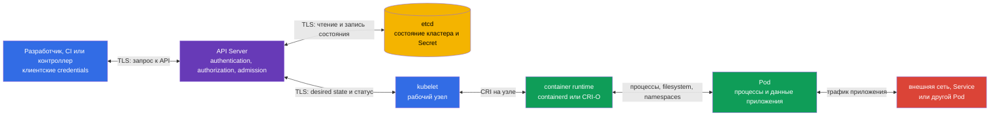

> **Язык:** русский. Переводы будут добавлены после публикации соответствующих файлов.

# Глава 15. Границы доверия, потоки данных и модель угроз

> **Что дальше.** В главах 10-14 разобраны отдельные контроли: идентичности и RBAC, безопасность `Pod`, `Secret`, сегментация сети и аудит. Теперь нужно связать их с тем, что защищаем, от кого и в какой точке потока данных. Модель угроз делает этот выбор явным. Это тема домена KCSA **Kubernetes Threat Model** с весом 16%. Примеры в курсе ориентированы на Kubernetes `v1.36`.

## 15.1 Что такое модель угроз и зачем она нужна в Kubernetes

Модель угроз - это структурированное описание системы, её активов, участников, потоков данных, границ доверия и возможных злоупотреблений. Она не предсказывает все атаки и не заменяет контроль безопасности. Её цель проще: до инцидента задать правильные вопросы и выбрать контроли для конкретного риска.

В Kubernetes система распределена: разработчик или CI отправляет запрос в API, API Server сохраняет состояние в etcd, `kubelet` на рабочем узле получает желаемое состояние, а container runtime запускает `Pod`. Отдельно идут сетевые обращения приложений, доступ к `Secret`, обращения к registry и наблюдаемость. Поэтому фраза «кластер защищён» без указания границы слишком расплывчата.

Начинать полезно с четырёх вопросов:

1. **Какие активы ценны?** Например, данные клиентов, `Secret`, токены `ServiceAccount`, образы, конфигурация, доступ к API и вычислительные ресурсы.
2. **Кто действует?** Разработчик, CI, пользователь приложения, администратор, облачный провайдер, скомпрометированный `Pod` или внешний атакующий.
3. **Какие пути доступны?** Kubernetes API, сеть между `Pod`, kubelet API, container runtime socket, том, backup etcd, registry.
4. **Где решение доверяет входным данным или идентичности?** На границах клиент-API, API-etcd, API-kubelet, runtime-`Pod`, между namespace и при выходе в сеть.

Результатом не обязан быть большой документ. Для небольшой команды достаточно схемы, таблицы угроз и списка владельцев контролей. Важно обновлять модель, когда добавляют новый `Namespace`, внешний ingress, webhook, облачную роль или доступ к чувствительным данным.

| Элемент модели | Вопрос | Пример Kubernetes |
|---|---|---|
| Актив | Что будет потеряно или изменено? | `Secret` с ключом платежного API |
| Участник | Чьё действие анализируем? | CI с kubeconfig или `ServiceAccount` приложения |
| Поток данных | Куда передаётся информация? | `kubectl` отправляет запрос в API Server по TLS |
| Граница доверия | Где меняется уровень доверия? | API Server проверяет токен клиента и его права RBAC |
| Угроза | Какой нежелательный результат возможен? | Скомпрометированный токен создаёт `privileged` `Pod` |
| Контроль | Что снижает вероятность или последствия? | MFA/OIDC, RBAC, PSA, audit logging и ротация токена |

Модель угроз помогает не перепутать контроль с активом. Например, `NetworkPolicy` ограничивает сетевой путь, но не скрывает `Secret` от субъекта с разрешением `get secrets`. Encryption at rest защищает запись в etcd, но не заменяет аутентификацию клиента API. У одного риска часто несколько слоёв защиты.

## 15.2 Границы доверия и поток данных кластера

**Граница доверия** - место, где данные или запрос переходят от менее доверенного участника к более доверенному либо меняют контекст полномочий. На такой границе проверяют идентичность, права, целостность и, если данные чувствительны, конфиденциальность. TLS важен для защиты канала, но не решает, имеет ли отправитель право выполнить действие.

В типовом кластере центральная граница - API Server. Он аутентифицирует клиента, авторизует запрос и применяет admission-контроли до изменения состояния. etcd не предназначен для прямого доступа обычных пользователей: он хранит состояние кластера и должен доверять только защищённому API Server. `kubelet` получает или наблюдает назначенные рабочему узлу объекты через API и передаёт инструкции локальному container runtime. Runtime создаёт процессы и изоляцию контейнеров, а `Pod` исполняет прикладной код, который может иметь собственную сеть, тома и токен.



На схеме стрелки двунаправленные, потому что компоненты обмениваются запросами и ответами. Это не означает одинаковый уровень доверия. Например, API Server пишет состояние в etcd, но etcd не должен принимать административные запросы от `Pod`; runtime управляет контейнером, но приложение не должно получать его socket.

| Граница | Что может пойти не так | Концептуальные контроли |
|---|---|---|
| клиент ↔ API Server | украденный kubeconfig, поддельная идентичность, слишком широкие права | TLS, надёжная аутентификация, короткоживущие credentials, RBAC, audit logging |
| API Server ↔ etcd | чтение или изменение состояния, утечка snapshot | TLS, ограниченный сетевой и хостовый доступ, encryption at rest, защищённые backup |
| API Server ↔ kubelet | злоупотребление kubelet API или подмена статуса | взаимная аутентификация, авторизация kubelet, защита рабочего узла |
| kubelet ↔ runtime | доступ к CRI socket даёт управление контейнерами | доступ к socket только системным компонентам, hardening узла, мониторинг |
| runtime ↔ `Pod` | escape из контейнера, опасные mount или привилегии | PSS/PSA, `securityContext`, seccomp, AppArmor, минимальные capabilities |
| `Pod` ↔ сеть и данные | MITM, lateral movement, exfiltration | `NetworkPolicy`, TLS или mTLS, DNS-контроли, RBAC и разделение `Secret` |

Не все потоки проходят по прямой линии из диаграммы. Контроллеры используют API как клиенты, admission webhook получает вызов от API Server, CSI и CNI могут обращаться к рабочему узлу, а приложение обращается к внешнему сервису. При моделировании добавляют эти связи, если они существуют в конкретной платформе. Иначе «невидимый» webhook или облачная роль станет неучтённой границей доверия.

## 15.3 STRIDE, MITRE ATT&CK for Containers и kill chain

> **Важно для KCSA domain mapping.**
> Linux Foundation относит **Threat Modelling Frameworks** к домену
> **Compliance and Security Frameworks**, а не к домену
> **Kubernetes Threat Model**.
>
> STRIDE, MITRE ATT&CK for Containers и kill chain используются в этой главе
> как cross-domain аналитический контекст для работы с уже определёнными
> trust boundaries и data flows. На экзамене вопросы именно о назначении
> threat-modelling frameworks следует относить к Compliance.
>
> Сам домен **Kubernetes Threat Model** проверяет trust boundaries/data flow,
> persistence, denial of service, malicious code / compromised applications,
> attacker on the network, access to sensitive data и privilege escalation.
> Детальное exam-oriented повторение framework competencies находится в
> [главе 19](../19/ru.md).

Фреймворки не являются взаимозаменяемыми списками настроек. **STRIDE** помогает спросить, какие классы угроз есть у каждого потока и границы. **MITRE ATT&CK for Containers** описывает наблюдаемые тактики и техники против контейнерной среды. **Kill chain** упорядочивает развитие атаки от подготовки до достижения цели. Вместе они помогают перейти от абстрактной угрозы к приоритетам детекта и защиты. Подробное сопоставление с фреймворками и комплаенсом дано в главе 19.

### STRIDE: шесть вопросов к каждому элементу

| Категория | Вопрос к кластеру | Пример | Подходящие контроли |
|---|---|---|---|
| Spoofing | Может ли атакующий выдать себя за другого? | украденный токен `ServiceAccount` используется как легитимный | аутентификация, ротация токенов, ограничение их выдачи |
| Tampering | Может ли он незаметно изменить данные или конфигурацию? | изменён `Deployment` запускает другой образ | RBAC, admission, подпись образов, audit logging |
| Repudiation | Можно ли доказать, кто выполнил действие? | удалён `Secret`, но нет записи об авторе | audit policy, защищённое хранение и корреляция логов |
| Information Disclosure | Могут ли быть раскрыты чувствительные данные? | доступ к etcd backup раскрывает `Secret` | encryption at rest, RBAC, защита backup |
| Denial of Service | Может ли быть исчерпан ресурс или нарушена доступность? | `Pod` занимает CPU и память рабочего узла | `requests`, `limits`, `ResourceQuota`, мониторинг |
| Elevation of Privilege | Может ли субъект получить больше прав? | контейнер с `hostPath` и лишней capability влияет на узел | PSS/PSA, `securityContext`, least privilege, hardening узла |

STRIDE не утверждает, что каждый элемент обязательно уязвим. Он не позволяет пропустить класс вопросов. Например, для API Server проверяют spoofing и tampering через идентичности и RBAC, а для журнала аудита особенно важны repudiation и целостность хранения.

### ATT&CK for Containers и развитие атаки

MITRE ATT&CK for Containers группирует поведение атакующего в тактики и техники. На associate-уровне полезно узнавать логику цепочки, а не заучивать идентификаторы техник. ATT&CK развивается: названия ниже сверены с Containers Matrix v19, но перед operational mapping их нужно повторно проверить в официальной матрице. Один инцидент может проходить через несколько тактик и не обязан содержать каждую из них.

| Этап или тактика | Возможное действие в Kubernetes | Что искать или ограничивать |
|---|---|---|
| Initial Access | уязвимое приложение принимает вредоносный запрос, либо в кластер попадает украденный kubeconfig | защита приложения, аутентификация, внешняя поверхность, audit events |
| Execution | выполняется shell или неожиданный процесс в контейнере | runtime-детект, логи процесса, минимальный образ |
| Persistence | создаётся `CronJob`, webhook, статический `Pod` или сохраняется токен | ревью изменений, RBAC, audit logging, контроль control plane |
| Privilege Escalation | контейнер получает `privileged`, `hostPath` или доступ к socket runtime | PSA, admission, `securityContext`, ограничения узла |
| Defense Impairment | отключается или изменяется средство защиты | защита конфигурации, отдельное хранение логов, аудит изменений |
| Credential Access | читается `Secret`, token или kubeconfig | RBAC, encryption at rest, безопасная доставка и ротация |
| Discovery | перечисляются `Namespace`, `Pod`, сервисы и API-ресурсы | least privilege, аудит необычных `list` и `watch` |
| Lateral Movement | скомпрометированный `Pod` обращается к другому сервису или узлу | сегментация, `NetworkPolicy`, mTLS, защита kubelet |
| Доступ к данным и exfiltration (data-flow lens, не тактика Containers Matrix) | данные читаются из volume и уходят во внешний endpoint | ограничение egress, TLS, мониторинг сети и данных |
| Impact | удаляются workloads, шифруются данные или исчерпываются ресурсы | backup, квоты, ограничения, оповещения и план реакции |

Kill chain полезен для вопроса «на каком этапе остановить атаку». Например, сканирование образа и подпись уменьшают шанс initial access через вредоносный артефакт; PSA уменьшает путь к privilege escalation; `NetworkPolicy` ограничивает lateral movement; аудит и runtime-детект дают свидетельства на этапах execution и Defense Impairment. Одного контроля для всей цепочки нет.

Важно не превращать ATT&CK в автоматический приговор. Запуск `sh` в контейнере, запрос `list pods` или исходящий HTTPS-трафик могут быть штатными. Контекст дают владелец workload, namespace, время, образ, инициатор API-запроса и ожидаемое поведение приложения.

## 15.4 Attack tree: получить production secrets

Attack tree превращает общую угрозу в проверяемые пути. Цель не в перечислении всех exploits, а в выборе control и evidence для каждого реалистичного шага.

```text
Goal: получить production secrets
├── украсть kubeconfig
│   └── использовать excessive RBAC
├── скомпрометировать Pod
│   ├── прочитать ServiceAccount token
│   ├── вызвать Kubernetes API
│   └── использовать excessive permissions
├── получить etcd backup
│   └── Secret не защищён encryption at rest
└── скомпрометировать CI/CD
    └── внедрить malicious artifact
```

| Attack path | Preventive control | Detective control | Evidence |
|---|---|---|---|
| Stolen `ServiceAccount` token читает `Secret` | отдельный workload identity и least-privilege RBAC | Kubernetes API audit | audit event: identity, `get`, `secrets`, response status |
| Shell в контейнере ищет credentials | минимизировать доступные workload credentials: не монтировать ненужные `Secret`, использовать `automountServiceAccountToken: false`, если Kubernetes API не нужен, и назначать отдельную workload identity с least-privilege RBAC | Falco или другой runtime detector | runtime event о shell/доступе к credential-файлу |
| Malicious image проходит CI | digest, SBOM, signature/provenance и admission verification | registry/CI/admission logs | проверенная attestation и admission decision |
| Etcd backup раскрывает данные | encryption at rest, защита backup и доступа | audit доступа к backup и review storage controls | отчёт backup/access trail |

Ни один preventive control не делает путь невозможным сам по себе: RBAC не видит shell внутри контейнера, а runtime detection чаще обнаруживает уже начавшееся действие. На экзамене сначала назовите актив и путь атаки, затем выберите control на enforcement point и доказательство, которое его подтверждает.

## 15.5 Как применить модель угроз к своему кластеру

Практическое применение начинается с ограниченного сценария, а не со списка всех компонентов Kubernetes. Например: «CI развёртывает интернет-магазин в namespace `payments`, приложение читает платёжный токен и обращается к внешнему провайдеру». Для такого сценария можно составить короткую рабочую таблицу.

| Шаг | Что фиксируют | Пример результата |
|---|---|---|
| 1. Определить область | система, namespace, интеграции и владельцы | `payments`, CI, registry, платёжный API, команда платформы |
| 2. Перечислить активы | что требует конфиденциальности, целостности или доступности | токен провайдера, заказы, образ приложения, квота ресурсов |
| 3. Нарисовать потоки | кто, куда и с какими credentials обращается | CI → API Server; `Pod` → платёжный API; API Server → etcd |
| 4. Отметить границы | где меняется доверие или права | CI-API, API-etcd, `Pod`-внешняя сеть, `Pod`-`Secret` |
| 5. Разобрать угрозы | STRIDE и вероятные действия ATT&CK | украденный токен, подмена образа, egress с данными, DoS |
| 6. Выбрать и назначить контроли | превентивные, детективные, восстановительные | RBAC и PSA, `NetworkPolicy`, аудит, backup, владелец контроля |
| 7. Проверять изменения | что изменилось после нового сервиса или инцидента | добавить новый webhook и его права в модель |

Рассмотрим три типовых решения. Если CI имеет `cluster-admin`, риск tampering слишком велик: отдельная `ServiceAccount` и ограниченный `Role` уменьшают радиус ошибки или кражи credential. Если приложение имеет unrestricted egress, риск exfiltration и lateral movement выше: default-deny и точечные правила `NetworkPolicy` ограничивают известные пути, а TLS или mTLS защищает разрешённый канал. Если `Secret` доступен всем `Pod` namespace, риск disclosure велик: отдельные identities, узкие RBAC-права, encryption at rest и ротация уменьшают последствия.

Приоритизация зависит от ущерба и реалистичности угрозы. Production-кластер с платежами обычно требует сначала защитить административный доступ, секреты, рабочие узлы и внешние потоки. Тестовая среда тоже не является исключением, если в ней есть production credentials или общий control plane. Модель угроз должна отражать фактическую архитектуру, а не формальное название окружения.

## 15.6 Как это применяют на практике

Команда платформы поддерживает базовую схему потоков данных для типовых workloads и отдельные схемы для критичных интеграций. При review нового компонента задают короткий набор вопросов: какие API-права он получает, какие `Secret` читает, куда может ходить по сети, запускает ли он привилегированный код и кто увидит его события.

Угрозы связывают с измеримыми проверками. Для границы клиент-API это ревью RBAC и audit events. Для рабочего узла - контроль доступа к kubelet и runtime socket, PSS/PSA и состояние `securityContext`. Для данных - шифрование etcd, защита backup и минимальные права на `secrets`. Для сети - понятная исходящая и входящая связность, `NetworkPolicy` и TLS или mTLS там, где трафик чувствителен.

Модель также помогает расследованию. Когда появляется alert о неожиданном процессе, команда сопоставляет его с этапом ATT&CK и схемой: какой `Pod`, образ, `ServiceAccount`, узел и сетевой маршрут были задействованы. Это быстрее, чем начинать инцидент с неограниченного поиска по всем логам.

## 15.7 Exam vocabulary / Мини-глоссарий

| Термин | Значение |
|---|---|
| модель угроз | Описание активов, участников, потоков, границ доверия, угроз и контролей системы. |
| граница доверия | Точка перехода между участниками или контекстами с разным уровнем доверия. |
| поток данных | Передача запроса, состояния или данных между компонентами. |
| STRIDE | Фреймворк с категориями Spoofing, Tampering, Repudiation, Information Disclosure, Denial of Service и Elevation of Privilege. |
| MITRE ATT&CK for Containers | База тактик и техник, описывающих поведение атакующих в контейнерной среде. |
| kill chain | Модель последовательности этапов атаки от первоначального доступа до воздействия. |
| lateral movement | Переход атакующего от скомпрометированного ресурса к другому ресурсу. |
| attack surface | Совокупность доступных путей, через которые систему можно атаковать. |

## 15.8 Exam Essentials / Итоги главы

- Модель угроз связывает активы, участников, потоки данных, границы доверия, угрозы и контроли.
- В Kubernetes ключевые границы проходят между клиентом и API Server, API Server и etcd, API Server и kubelet, kubelet и runtime, runtime и `Pod`, а также между `Pod`, сетью и данными.
- TLS защищает канал передачи, но для решения «разрешено ли действие» нужны аутентификация, авторизация и admission.
- STRIDE, MITRE ATT&CK for Containers и kill chain помогают анализировать угрозы и развитие атаки, но в официальной KCSA domain mapping **Threat Modelling Frameworks относятся к Compliance and Security Frameworks**; здесь они используются как cross-domain контекст.
- Один контроль не закрывает всю атаку: RBAC, PSA, encryption, сегментация, аудит, runtime-детект и backup работают слоями.
- Рабочая модель угроз должна быть короткой, привязанной к реальным потокам и обновляемой при изменении архитектуры.

## 15.9 Не путать и как это встречается на экзамене

В MCQ часто описывают один компонент или сценарий и просят выбрать наиболее подходящий контроль. Сначала определите актив и границу: это API-доступ, данные etcd, права `Pod`, доступ к рабочему узлу или сетевой поток. Затем отделите профилактику от детекта и восстановления.

Типичные ловушки:

- считать TLS заменой RBAC: TLS подтверждает защищённый канал, но не ограничивает разрешения идентичности;
- считать `NetworkPolicy` защитой данных etcd или `Secret` при чтении через API;
- считать, что etcd должен быть напрямую доступен пользователям для штатного управления кластером;
- выбирать одну меру для всех этапов kill chain;
- принимать любой процесс, `list` API-запрос или HTTPS-трафик за атаку без контекста;
- путать STRIDE как перечень настроек с методом задавать вопросы об угрозах.

Если варианты смешивают фреймворки, запомните назначение: STRIDE классифицирует угрозы, ATT&CK for Containers описывает тактики и техники противника, а kill chain показывает ход атаки. Это дополняющие, а не конкурирующие модели.

## 15.10 Вопросы для самопроверки

### 1. Какой компонент обычно является центральной границей доверия для запросов управления Kubernetes?

   - a. `Pod` приложения.

   - b. container runtime.

   - c. API Server.

   - d. CNI-плагин.

<details>
<summary>Ответ и разбор</summary>

**Верный ответ: c.** API Server аутентифицирует клиента, проверяет его полномочия и применяет admission до изменения состояния. Runtime и CNI важны для других границ, но не являются обычной точкой обработки запросов Kubernetes API.

</details>

### 2. Какой контроль наиболее прямо уменьшает риск, что субъект с украденным kubeconfig создаст произвольный `Deployment` во всём кластере?

   - a. RBAC с минимальными полномочиями для этой идентичности.

   - b. `ResourceQuota`.

   - c. Encryption at rest для etcd.

   - d. `NetworkPolicy` для namespace приложения.

<details>
<summary>Ответ и разбор</summary>

**Верный ответ: a.** Least-privilege RBAC ограничивает, какие API-действия скомпрометированная идентичность может выполнить. Остальные контроли важны, но не определяют право `create deployments` через API.

</details>

#### Cross-domain повторение: Compliance and Security Frameworks

### 3. Какая категория STRIDE лучше всего описывает чтение `Secret` из незащищённого snapshot etcd?

   - a. Information Disclosure.

   - b. Denial of Service.

   - c. Tampering.

   - d. Repudiation.

<details>
<summary>Ответ и разбор</summary>

**Верный ответ: a.** В этом сценарии раскрываются чувствительные данные. Для снижения риска нужны защита доступа к etcd и backup, а также encryption at rest. Repudiation относится к невозможности установить автора действия.

</details>

### 4. Как точнее всего соотносятся STRIDE и MITRE ATT&CK for Containers?

   - a. STRIDE классифицирует классы угроз, а ATT&CK for Containers описывает тактики и техники действий атакующего.

   - b. Оба фреймворка автоматически блокируют `privileged` `Pod`.

   - c. STRIDE является способом шифрования данных, а ATT&CK заменяет RBAC.

   - d. ATT&CK применяется только к облачной инфраструктуре вне Kubernetes.

<details>
<summary>Ответ и разбор</summary>

**Верный ответ: a.** STRIDE помогает систематически анализировать угрозы на границах и потоках. ATT&CK for Containers даёт язык для описания наблюдаемого поведения противника. Ни один из них не является механизмом принудительного применения политики.

</details>

#### Возврат к Kubernetes Threat Model

### 5. Какой сценарий лучше всего иллюстрирует lateral movement после компрометации `Pod`?

   - a. Скомпрометированный процесс повторно запускает штатный HTTP listener внутри того же контейнера после локального сбоя.
   - b. Атакующий изменяет файл приложения внутри уже скомпрометированного `Pod`, не обращаясь к другим workloads или systems.
   - c. Внешний клиент сканирует публичный Ingress endpoint, но ещё не получил доступ ни к одному workload.
   - d. Скомпрометированный `Pod` использует доступный сетевой путь или credential, чтобы обратиться к внутреннему сервису другой workload-зоны.

<details>
<summary>Ответ и разбор</summary>

**Верный ответ: d.** Lateral movement — это переход от уже скомпрометированной точки к другим workloads, сервисам или зонам доверия. Сетевое сегментирование, узкие identities и least privilege уменьшают такие пути.

</details>

> **Куда дальше.** Для обзора фреймворков, STRIDE, MITRE ATT&CK for Containers и комплаенса перейдите к [главе 19 KCSA](../19/ru.md). Практические границы безопасности и модель 4C разобраны в главе 02 CKS, а корреляция сигналов и расследование фаз атаки - в главе 30 CKS.

[Оглавление](../README_RU.md) · [Глава 14](../14/ru.md) · [Глава 16](../16/ru.md)
