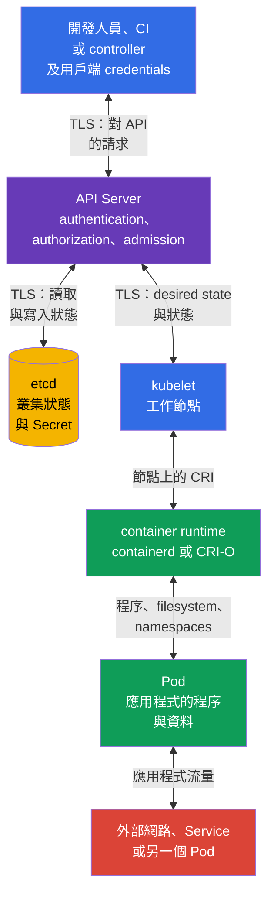

[Русская версия](ru.md) · [Eng version](README.md) · [Versión en español](es.md) · [Version française](fr.md) · [Deutsche Version](de.md) · [ქართული ვერსია](ge.md) · [日本語版](jp.md)

# 第 15 章。信任邊界、資料流與威脅模型

> **接下來的內容。** 第 10-14 章說明了個別控制項：身分與 RBAC、`Pod` 安全性、`Secret`、網路分段與稽核。現在需要將它們與我們保護的對象、保護的對手，以及資料流中的哪一個位置連結起來。威脅模型會明確呈現這項選擇。這是 KCSA **Kubernetes Threat Model** 領域的主題，占比為 16%。課程範例以 Kubernetes `v1.36` 為準。

## 15.1 什麼是威脅模型，以及為何 Kubernetes 需要它

威脅模型是系統、其資產、參與者、資料流、信任邊界與可能濫用情境的結構化描述。它不會預測所有攻擊，也不會取代安全控制項。它的目的較單純：在事件發生前提出正確的問題，並為特定風險選擇控制項。

在 Kubernetes 中，系統是分散式的：開發人員或 CI 將請求傳送至 API，API Server 將狀態儲存在 etcd，工作節點上的 `kubelet` 取得期望狀態，而 container runtime 啟動 `Pod`。此外還有應用程式網路呼叫、對 `Secret` 的存取、對 registry 的呼叫以及可觀測性。因此，若不指出邊界，僅說「叢集受到保護」就過於籠統。

適合從四個問題開始：

1. **哪些資產有價值？** 例如客戶資料、`Secret`、`ServiceAccount` token、映像、組態、API 存取權與運算資源。
2. **誰在行動？** 開發人員、CI、應用程式使用者、管理員、雲端供應商、遭入侵的 `Pod` 或外部攻擊者。
3. **有哪些可用路徑？** Kubernetes API、`Pod` 之間的網路、kubelet API、container runtime socket、磁碟區、etcd backup、registry。
4. **決策在哪裡信任輸入資料或身分？** 在用戶端-API、API-etcd、API-kubelet、runtime-`Pod` 邊界、namespace 之間，以及網路輸出處。

結果不必是一份大型文件。對小型團隊而言，一張圖、威脅表格與控制項擁有者清單已足夠。當新增 `Namespace`、外部 ingress、webhook、雲端角色或對敏感資料的存取時，重要的是更新模型。

| 模型元素 | 問題 | Kubernetes 範例 |
|---|---|---|
| 資產 | 哪些內容會遺失或遭變更？ | 含有付款 API 金鑰的 `Secret` |
| 參與者 | 我們分析的是誰的行動？ | 使用 kubeconfig 的 CI 或應用程式的 `ServiceAccount` |
| 資料流 | 資訊傳送到哪裡？ | `kubectl` 透過 TLS 向 API Server 傳送請求 |
| 信任邊界 | 信任層級在哪裡改變？ | API Server 驗證用戶端 token 及其 RBAC 權限 |
| 威脅 | 可能出現什麼不希望的結果？ | 遭入侵的 token 建立 `privileged` `Pod` |
| 控制項 | 什麼能降低機率或後果？ | MFA/OIDC、RBAC、PSA、audit logging 與 token 輪替 |

威脅模型有助於避免把控制項與資產混為一談。例如，`NetworkPolicy` 限制網路路徑，但不會對具有 `get secrets` 權限的主體隱藏 `Secret`。Encryption at rest 保護 etcd 中的記錄，但不能取代 API 用戶端驗證。一項風險通常需要多層防護。

## 15.2 叢集的信任邊界與資料流

**信任邊界**是資料或請求從較不受信任的參與者移向較受信任的參與者，或變更權限內容的位置。在此類邊界上，會驗證身分、權限、完整性，並在資料敏感時驗證機密性。TLS 對保護通道很重要，但不能決定傳送者是否有權執行動作。

在典型叢集中，中央邊界是 API Server。它驗證用戶端身分、授權請求，並在變更狀態前套用 admission 控制項。etcd 並非供一般使用者直接存取：它儲存叢集狀態，且應僅信任受保護的 API Server。`kubelet` 透過 API 取得或觀察指派至工作節點的物件，並將指令傳遞給本機 container runtime。Runtime 會建立容器程序與隔離，而 `Pod` 會執行可能有自身網路、磁碟區與 token 的應用程式碼。



圖中的箭頭是雙向的，因為元件會交換請求與回應。這不代表信任層級相同。例如，API Server 將狀態寫入 etcd，但 etcd 不應接受來自 `Pod` 的管理請求；runtime 管理容器，但應用程式不應取得其 socket。

| 邊界 | 可能出現的問題 | 概念性控制項 |
|---|---|---|
| 用戶端 ↔ API Server | 遭竊的 kubeconfig、偽造身分、過度寬廣的權限 | TLS、可靠的 authentication、短期 credentials、RBAC、audit logging |
| API Server ↔ etcd | 讀取或變更狀態、snapshot 外洩 | TLS、受限的網路與主機存取、encryption at rest、受保護的 backup |
| API Server ↔ kubelet | 濫用 kubelet API 或偽造狀態 | 相互 authentication、kubelet authorization、工作節點保護 |
| kubelet ↔ runtime | 存取 CRI socket 即可控制容器 | socket 僅供系統元件存取、節點 hardening、監控 |
| runtime ↔ `Pod` | 從容器 escape、危險的 mount 或權限 | PSS/PSA、`securityContext`、seccomp、AppArmor、最小 capabilities |
| `Pod` ↔ 網路與資料 | MITM、lateral movement、exfiltration | `NetworkPolicy`、TLS 或 mTLS、DNS 控制項、RBAC 與 `Secret` 分隔 |

並非所有資料流都會沿著圖中的直線通過。Controller 作為用戶端使用 API，admission webhook 接收來自 API Server 的呼叫，CSI 與 CNI 可能會連線至工作節點，而應用程式會呼叫外部服務。在建模時，若特定平台有這些連線就應加入。否則，「不可見」的 webhook 或雲端角色會成為未被考量的信任邊界。

## 15.3 STRIDE、MITRE ATT&CK for Containers 與 kill chain

> **KCSA domain mapping 的重要事項。**
> Linux Foundation 將 **Threat Modelling Frameworks** 歸於
> **Compliance and Security Frameworks** 領域，而非
> **Kubernetes Threat Model** 領域。
>
> 本章使用 STRIDE、MITRE ATT&CK for Containers 與 kill chain
> 作為跨領域分析內容，以處理已定義的
> trust boundaries 與 data flows。考試中，關於 threat-modelling frameworks 用途的問題應歸於 Compliance。
>
> **Kubernetes Threat Model** 領域本身會檢驗 trust boundaries/data flow、
> persistence、denial of service、malicious code / compromised applications、
> attacker on the network、access to sensitive data 與 privilege escalation。
> 關於 framework competencies 的詳細考試導向複習位於
> [第 19 章](../19/tw.md)。

這些 framework 並不是可互換的設定清單：每個都有自己的適用範圍與要回答的問題。首先概覽各自解決的問題，接著分別詳細說明 STRIDE 與 ATT&CK for Containers。

| Framework | 回答什麼問題 | 分析單位 | 何時使用 |
|---|---|---|---|
| STRIDE | 特定資料流或邊界可能有哪些類別的威脅？ | 架構元素（元件、資料流、信任邊界） | 在設計或架構審查階段、事件發生前 |
| MITRE ATT&CK for Containers | 攻擊者已經使用，或可能在容器環境中使用哪些攻擊戰術與技術？ | 可觀察到的攻擊者行為（戰術 → 技術） | 建立偵測、分析事件、評估 runtime 防護涵蓋範圍時 |
| Kill chain | 在攻擊發展的哪一階段攔截它最有效？ | 單一攻擊的階段順序（從準備到目標） | 選擇 preventive 與 detective control 彼此相對的位置時 |

**STRIDE** 與 **ATT&CK for Containers** 並不競爭，而是涵蓋同一全貌的不同面向：STRIDE 是以「從威脅出發」的架構分析，預先套用；ATT&CK 是以「從攻擊者出發」的行為分析，適用於已觀察到或假設的行動。**Kill chain** 並非另一份威脅或技術清單，而是按時間排列 STRIDE 與 ATT&CK 結果的方式：它顯示特定威脅（來自 STRIDE）或技術（來自 ATT&CK）實際會在哪個階段顯現，並協助決定何處適合設定 preventive control，何處適合設定 detective control。

**組合的最佳實務。** 不要嘗試把三個 framework 合併成一份文件或一張表格：它們有不同的分析軸，強制合併會模糊各自要回答的問題。實用的順序是：(1) 對於新架構或重大變更，先對每個元素與資料流執行 STRIDE - 這會產生威脅與 trust boundaries 清單；(2) 針對在環境中可信的威脅，將它們對應到 ATT&CK for Containers 的戰術與技術 - 這會產生特定可觀察訊號與現有 detection coverage；(3) 依 kill chain 展開結果，以了解哪些攻擊階段受到 preventive control 保護、哪些只有 detective 保護，以及何處有缺口。STRIDE 與 ATT&CK 不必一對一對應：一項 STRIDE 威脅（例如 Elevation of Privilege）可透過多種 ATT&CK 技術（privileged container、hostPath、capability abuse）顯現，這是預期結果，而非分析錯誤。第 19 章有與 framework 及 compliance 的詳細對照。

### STRIDE：對每個元素的六個問題

| 類別 | 對叢集的問題 | 範例 | 合適的控制項 |
|---|---|---|---|
| Spoofing | 攻擊者能否冒充其他人？ | 遭竊的 `ServiceAccount` token 被當成合法身分使用 | authentication、token 輪替、限制發放 |
| Tampering | 他能否在不被發現的情況下修改資料或組態？ | 被變更的 `Deployment` 啟動另一個映像 | RBAC、admission、映像簽章、audit logging |
| Repudiation | 能否證明是誰執行了動作？ | `Secret` 被刪除，但沒有作者紀錄 | audit policy、受保護的日誌儲存與關聯 |
| Information Disclosure | 敏感資料會不會被揭露？ | 存取 etcd backup 會揭露 `Secret` | encryption at rest、RBAC、backup 保護 |
| Denial of Service | 資源能否被耗盡，或可用性是否能被破壞？ | `Pod` 佔用工作節點的 CPU 與記憶體 | `requests`、`limits`、`ResourceQuota`、監控 |
| Elevation of Privilege | 主體能否取得更多權限？ | 具有 `hostPath` 與多餘 capability 的容器會影響節點 | PSS/PSA、`securityContext`、least privilege、節點 hardening |

STRIDE 並不聲稱每個元素都必然有弱點。它確保不會略過某一類問題。例如，對 API Server 會透過身分與 RBAC 檢查 spoofing 和 tampering，而對稽核日誌而言，repudiation 與儲存完整性特別重要。

### ATT&CK for Containers 與攻擊發展

MITRE ATT&CK for Containers 將攻擊者行為分組為戰術與技術。在 associate 層級，辨識攻擊鏈邏輯比死記技術識別碼更有用。ATT&CK 會持續發展：以下名稱已根據 Containers Matrix v19 核對，但在 operational mapping 前必須再次於官方 matrix 核對。一個事件可能經過多個戰術，且不必包含每一個戰術。

| 階段或戰術 | Kubernetes 中可能的動作 | 要尋找或限制的內容 |
|---|---|---|
| Initial Access | 易受攻擊的應用程式接受惡意請求，或遭竊的 kubeconfig 進入叢集 | 應用程式保護、authentication、外部攻擊面、audit events |
| Execution | 在容器中執行 shell 或非預期的程序 | runtime 偵測、程序日誌、最小化映像 |
| Persistence | 建立 `CronJob`、webhook、靜態 `Pod`，或保留 token | 變更審查、RBAC、audit logging、control plane 控制 |
| Privilege Escalation | 容器取得 `privileged`、`hostPath` 或 runtime socket 存取權 | PSA、admission、`securityContext`、節點限制 |
| Defense Impairment | 停用或變更保護工具 | 組態保護、獨立日誌儲存、變更稽核 |
| Credential Access | 讀取 `Secret`、token 或 kubeconfig | RBAC、encryption at rest、安全交付與輪替 |
| Discovery | 列舉 `Namespace`、`Pod`、Service 與 API 資源 | least privilege、稽核異常的 `list` 與 `watch` |
| Lateral Movement | 遭入侵的 `Pod` 呼叫另一個服務或節點 | 分段、`NetworkPolicy`、mTLS、kubelet 保護 |
| 資料存取與 exfiltration（data-flow lens，不是 Containers Matrix 戰術） | 從 volume 讀取資料並傳送至外部 endpoint | 限制 egress、TLS、網路與資料監控 |
| Impact | 刪除 workloads、加密資料或耗盡資源 | backup、配額、限制、警示與回應計畫 |

Kill chain 對於「在哪個階段阻止攻擊」這個問題很有用。例如，映像掃描與簽章能降低透過惡意 artifact 取得 initial access 的機率；PSA 降低通往 privilege escalation 的路徑；`NetworkPolicy` 限制 lateral movement；稽核與 runtime 偵測在 execution 與 Defense Impairment 階段提供證據。沒有一個控制項能涵蓋整條鏈。

重要的是，不要將 ATT&CK 變成自動判決。在容器中執行 `sh`、`list pods` 請求或輸出 HTTPS 流量都可能是正常行為。情境取決於 workload 擁有者、namespace、時間、映像、API 請求發起者與預期的應用程式行為。

## 15.4 Attack tree：取得 production secrets

Attack tree 將一般威脅轉為可驗證的路徑。目的並非列舉所有 exploits，而是為每個可信步驟選擇 control 與 evidence。

```text
Goal: 取得 production secrets
├── 竊取 kubeconfig
│   └── 使用 excessive RBAC
├── 入侵 Pod
│   ├── 讀取 ServiceAccount token
│   ├── 呼叫 Kubernetes API
│   └── 使用 excessive permissions
├── 取得 etcd backup
│   └── Secret 未受 encryption at rest 保護
└── 入侵 CI/CD
    └── 植入 malicious artifact
```

| Attack path | Preventive control | Detective control | Evidence |
|---|---|---|---|
| 遭竊的 `ServiceAccount` token 讀取 `Secret` | 獨立 workload identity 與 least-privilege RBAC | Kubernetes API audit | audit event：identity、`get`、`secrets`、response status |
| 容器中的 Shell 尋找 credentials | 最小化可用的 workload credentials：不要 mount 不必要的 `Secret`，若不需要 Kubernetes API，使用 `automountServiceAccountToken: false`，並指派具有 least-privilege RBAC 的獨立 workload identity | Falco 或其他 runtime detector | 關於 shell/存取 credential 檔案的 runtime event |
| Malicious image 通過 CI | digest、SBOM、signature/provenance 與 admission verification | registry/CI/admission logs | 已驗證的 attestation 與 admission decision |
| Etcd backup 揭露資料 | encryption at rest、backup 與存取保護 | backup 存取稽核與 storage controls 審查 | backup/access trail 報告 |

沒有任何單一 preventive control 能讓路徑無法實現：RBAC 看不到容器內的 shell，而 runtime detection 通常是在行動已開始後才偵測到。在考試中，先指出資產與攻擊路徑，接著選擇 enforcement point 上的 control，以及證明它的 evidence。

## 15.5 如何將威脅模型套用至自己的叢集

實務套用應從範圍有限的情境開始，而不是列出所有 Kubernetes 元件。例如：「CI 將網路商店部署到 namespace `payments`，應用程式讀取付款 token，並呼叫外部供應商」。對此情境可製作簡短的工作表格。

| 步驟 | 記錄什麼 | 結果範例 |
|---|---|---|
| 1. 定義範圍 | 系統、namespace、整合與擁有者 | `payments`、CI、registry、付款 API、平台團隊 |
| 2. 列出資產 | 哪些項目需要機密性、完整性或可用性 | 供應商 token、訂單、應用程式映像、資源配額 |
| 3. 繪製資料流 | 誰以哪些 credentials 呼叫哪裡 | CI → API Server；`Pod` → 付款 API；API Server → etcd |
| 4. 標記邊界 | 信任或權限在哪裡改變 | CI-API、API-etcd、`Pod`-外部網路、`Pod`-`Secret` |
| 5. 分析威脅 | STRIDE 與可信的 ATT&CK 行動 | 遭竊 token、映像竄改、含資料的 egress、DoS |
| 6. 選擇並指派控制項 | 預防性、偵測性、復原性 | RBAC 與 PSA、`NetworkPolicy`、稽核、backup、控制項擁有者 |
| 7. 驗證變更 | 新服務或事件後有何變化 | 在模型中新增 webhook 與其權限 |

來看三個典型決策。若 CI 具有 `cluster-admin`，tampering 風險太高：獨立的 `ServiceAccount` 與受限的 `Role` 可縮小錯誤或 credentials 遭竊的影響範圍。若應用程式具有 unrestricted egress，exfiltration 與 lateral movement 的風險更高：default-deny 與精確的 `NetworkPolicy` 規則限制已知路徑，而 TLS 或 mTLS 保護允許的通道。若 `Secret` 可供 namespace 中所有 `Pod` 存取，disclosure 風險很高：獨立 identities、狹窄的 RBAC 權限、encryption at rest 與輪替可降低後果。

優先順序取決於損害與威脅的可信度。含有付款功能的 production 叢集通常需要先保護管理存取權、secrets、工作節點與外部資料流。若測試環境包含 production credentials 或共用 control plane，也不是例外。威脅模型應反映實際架構，而不是環境的正式名稱。

## 15.6 實務上的套用方式

平台團隊為典型 workloads 維護基本資料流圖，並為關鍵整合維護獨立圖表。在審查新元件時，會問一組簡短問題：它取得哪些 API 權限、讀取哪些 `Secret`、可以在網路上前往何處、是否執行 privileged 程式碼，以及誰能看到它的事件。

威脅會與可衡量的檢查相連結。對於用戶端-API 邊界，這是 RBAC 審查與 audit events。對於工作節點，這是 kubelet 與 runtime socket 存取控制、PSS/PSA 及 `securityContext` 狀態。對於資料，這是 etcd 加密、backup 保護，以及對 `secrets` 的最小權限。對於網路，這是清楚的輸出與輸入連通性、`NetworkPolicy`，以及流量敏感時的 TLS 或 mTLS。

模型也有助於調查。當出現非預期程序的 alert 時，團隊會將其與 ATT&CK 階段及圖表對應：涉及哪個 `Pod`、映像、`ServiceAccount`、節點與網路路由。這比從不受限地搜尋所有日誌開始事件處理更快。

## 15.7 Exam vocabulary / 迷你詞彙表

| 術語 | 含義 |
|---|---|
| 威脅模型 | 系統資產、參與者、資料流、信任邊界、威脅與控制項的描述。 |
| 信任邊界 | 信任層級不同的參與者或內容之間的轉換點。 |
| 資料流 | 元件之間傳送請求、狀態或資料。 |
| STRIDE | 包含 Spoofing、Tampering、Repudiation、Information Disclosure、Denial of Service 與 Elevation of Privilege 類別的 framework。 |
| MITRE ATT&CK for Containers | 描述容器環境中攻擊者行為的戰術與技術知識庫。 |
| kill chain | 從初始存取到影響的攻擊階段順序模型。 |
| lateral movement | 攻擊者從遭入侵資源移往另一個資源。 |
| attack surface | 可用來攻擊系統的所有可用路徑集合。 |

## 15.8 Exam Essentials / 本章重點

- 威脅模型連結資產、參與者、資料流、信任邊界、威脅與控制項。
- Kubernetes 中的關鍵邊界位於用戶端與 API Server、API Server 與 etcd、API Server 與 kubelet、kubelet 與 runtime、runtime 與 `Pod`，以及 `Pod`、網路與資料之間。
- TLS 保護傳輸通道，但要判定「是否允許此動作」，需要 authentication、authorization 與 admission。
- STRIDE、MITRE ATT&CK for Containers 與 kill chain 有助於分析威脅與攻擊發展，但在官方 KCSA domain mapping 中，**Threat Modelling Frameworks 屬於 Compliance and Security Frameworks**；本章將它們作為跨領域內容使用。
- 單一控制項無法涵蓋整個攻擊：RBAC、PSA、encryption、分段、稽核、runtime 偵測與 backup 以多層方式運作。
- 有效的威脅模型應簡短、連結實際資料流，並在架構改變時更新。

## 15.9 不要混淆，以及考試中如何出現

在 MCQ（multiple choice question，選擇題）中，通常會描述一個元件或情境，並要求選擇最合適的控制項。先判斷資產與邊界：這是 API 存取、etcd 資料、`Pod` 權限、工作節點存取，還是網路資料流。接著區分預防、偵測與復原。

典型陷阱：

- 認為 TLS 可取代 RBAC：TLS 確認通道受到保護，但不限制身分的權限；
- 認為 `NetworkPolicy` 可保護透過 API 讀取的 etcd 資料或 `Secret`；
- 認為 etcd 應供使用者直接存取，以正常管理叢集；
- 為 kill chain 所有階段選擇一項措施；
- 在沒有情境下，將任何程序、`list` API 請求或 HTTPS 流量都當作攻擊；
- 將 STRIDE 誤認為設定清單，而不是提出威脅問題的方法。

若選項混合 framework，請記住其用途：STRIDE 對威脅分類，ATT&CK for Containers 描述對手的戰術與技術，kill chain 顯示攻擊的過程。它們是互補而非競爭的模型。

## 15.10 自我檢查問題

### 1. 哪個元件通常是 Kubernetes 管理請求的中央信任邊界？

   - a. 應用程式 `Pod`。

   - b. container runtime。

   - c. API Server。

   - d. CNI plugin。

<details>
<summary>答案與說明</summary>

**正確答案：c.** API Server 會在變更狀態前驗證用戶端身分、檢查其權限並套用 admission。Runtime 與 CNI 對其他邊界很重要，但不是 Kubernetes API 請求的一般處理點。

</details>

### 2. 哪一項控制最直接降低具有遭竊 kubeconfig 的主體在整個叢集中建立任意 `Deployment` 的風險？

   - a. 為該身分設定最小權限的 RBAC。

   - b. `ResourceQuota`。

   - c. etcd 的 Encryption at rest。

   - d. 應用程式 namespace 的 `NetworkPolicy`。

<details>
<summary>答案與說明</summary>

**正確答案：a.** Least-privilege RBAC 限制遭入侵的身分可執行哪些 API 動作。其他控制項雖然重要，卻不決定透過 API 執行 `create deployments` 的權限。

</details>

#### 跨領域複習：Compliance and Security Frameworks

### 3. 哪個 STRIDE 類別最能描述從未受保護的 etcd snapshot 讀取 `Secret`？

   - a. Information Disclosure。

   - b. Denial of Service。

   - c. Tampering。

   - d. Repudiation。

<details>
<summary>答案與說明</summary>

**正確答案：a.** 此情境會揭露敏感資料。降低風險需要保護對 etcd 與 backup 的存取，以及 encryption at rest。Repudiation 指的是無法確定動作作者。

</details>

### 4. STRIDE 與 MITRE ATT&CK for Containers 最精確的關係是什麼？

   - a. STRIDE 對威脅類別分類，而 ATT&CK for Containers 描述攻擊者行動的戰術與技術。

   - b. 兩個 framework 都會自動封鎖 `privileged` `Pod`。

   - c. STRIDE 是資料加密方式，而 ATT&CK 取代 RBAC。

   - d. ATT&CK 僅適用於 Kubernetes 以外的雲端基礎架構。

<details>
<summary>答案與說明</summary>

**正確答案：a.** STRIDE 有助於系統化分析邊界與資料流上的威脅。ATT&CK for Containers 提供描述可觀察對手行為的語言。兩者都不是強制執行 policy 的機制。

</details>

#### 回到 Kubernetes Threat Model

### 5. 哪個情境最能說明 `Pod` 遭入侵後的 lateral movement？

   - a. 遭入侵的程序在本機故障後，於同一容器內重新啟動正常的 HTTP listener。
   - b. 攻擊者變更已遭入侵的 `Pod` 內部應用程式檔案，沒有存取其他 workloads 或 systems。
   - c. 外部用戶端掃描公開的 Ingress endpoint，但尚未取得任何 workload 的存取權。
   - d. 遭入侵的 `Pod` 使用可用的網路路徑或 credential，呼叫另一個 workload 區域的內部服務。

<details>
<summary>答案與說明</summary>

**正確答案：d.** Lateral movement 是從已遭入侵的點移往其他 workloads、服務或信任區域。網路分段、狹窄的 identities 與 least privilege 可減少這類路徑。

</details>

> **接下來前往。** 如需 framework、STRIDE、MITRE ATT&CK for Containers 與 compliance 的概覽，請前往[第 19 章 KCSA](../19/tw.md)。實務安全邊界與 4C 模型將在第 02 章 CKS 說明，而訊號關聯與攻擊階段調查將在第 30 章 CKS 說明。

[目錄](../README_TW.md) · [第 14 章](../14/tw.md) · [第 16 章](../16/tw.md)
