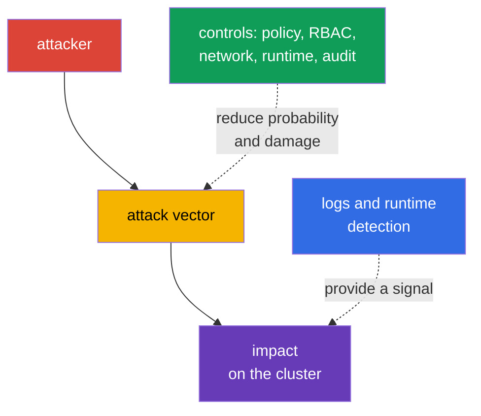
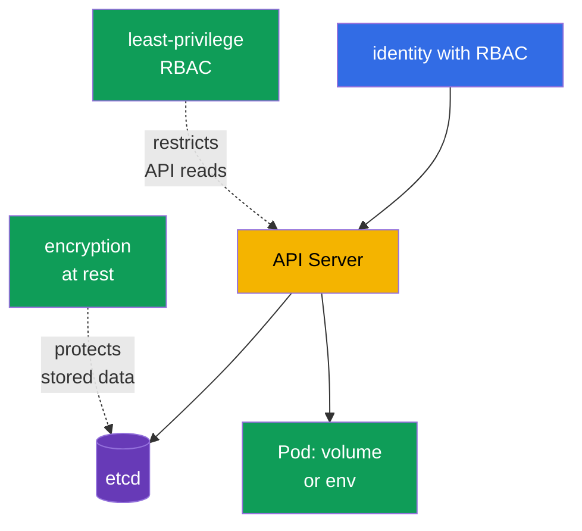

[Русская версия](ru.md) · [Versión en español](es.md) · [Version française](fr.md) · [Deutsche Version](de.md) · [ქართული ვერსია](ge.md) · [繁體中文版](tw.md) · [日本語版](jp.md)

# Chapter 16. Kubernetes Threat Categories

> **What’s next.** In Chapter 15, we defined trust boundaries and data flows. Now we will examine how attacks use these boundaries: persist in the cluster, exhaust resources, execute malicious code, intercept traffic, obtain data, or escalate privileges. This is the KCSA **Kubernetes Threat Model** domain, weighted at 16%. Examples in the course target Kubernetes `v1.36`.

A threat model does not promise to eliminate all risk. It helps connect an attack scenario with an observable manifestation and several independent controls. One control can fail, so Kubernetes is protected in layers: from source code and image to the `Pod`, API, network, and worker node.



## 16.1 Persistence: persisting in the cluster

**Scenario.** An attacker with temporary access to the API or a worker node wants to survive deletion of the initial `Pod` and retain a path back into the cluster. They can create a `CronJob` that periodically runs their code, modify a `MutatingAdmissionWebhook` to inject a container into every new `Pod`, place a static `Pod` in a directory watched by kubelet, or steal a long-lived token.

**How it manifests.** An unfamiliar `CronJob` appears in a namespace and periodically creates a `Job` and `Pod`; an unknown webhook appears in the admission configuration; kubelet recreates a static `Pod` after it is deleted through the API. A compromised `ServiceAccount` token or kubeconfig is used from an unusual network or after an employee has left. Not every new `CronJob` or webhook is an attack, so the signal is correlated with its owner, change record, and API audit data.

**How it is addressed.** Restrict RBAC: most identities do not need permission to create `CronJob`, modify `MutatingWebhookConfiguration`, or manage `ServiceAccount` and `RoleBinding`. Restrict access to the worker node and static `Pod` paths; protect kubelet and its credentials. Use short-lived tokens, do not distribute kubeconfig, and revoke access when roles change. Admission policy can deny unsuitable webhooks or images, while audit logs and runtime detection help notice the creation and execution of an unexpected workload.

| Persistence point | Why it survives the initial access | Primary controls |
|---|---|---|
| `CronJob` | controller creates new `Job` objects on a schedule | least-privilege RBAC, audit, namespace review |
| mutating webhook | affects every matching new object | restrict admission permissions, configuration review, audit |
| static `Pod` | kubelet reads the manifest locally on the node | worker node hardening, protect kubelet paths, monitoring |
| token or kubeconfig | provides repeated API access as an identity | short-lived tokens, rotation, RBAC, access revocation |

## 16.2 Denial of Service: resource exhaustion

**Scenario.** An application error, an overly aggressive client, or an intentional attacker creates many `Pod` objects, consumes CPU and memory, fills ephemeral storage, opens many connections, or floods the API with requests. The goal of DoS is not necessarily to obtain data: making a service or the control plane unavailable is enough.

**How it manifests.** `Pod` objects receive `OOMKilled`, remain `Pending` because of insufficient resources, nodes transition to `NotReady`, API Server latency increases, and legitimate requests receive errors or timeouts. An avalanche of `Job` or `Pod` objects can appear in one namespace. High load alone does not prove an attack: it is compared with normal traffic, limits, and deployment history.

**How it is addressed.** Set `resources.requests` and `resources.limits` for containers: requests participate in scheduling, while limits restrict available CPU or memory. `ResourceQuota` sets an aggregate namespace budget, and `LimitRange` sets or requires boundaries at the container level. They reduce the blast radius for one tenant, but do not replace capacity planning, autoscaling, protection against network floods, or API client control. Observability, saturation alerts, and prioritization of critical workloads are also important.

```yaml
apiVersion: v1
kind: ResourceQuota
metadata:
  name: team-budget
  namespace: team-a
spec:
  hard:
    requests.cpu: "4"
    requests.memory: 8Gi
    limits.cpu: "8"
    limits.memory: 16Gi
    pods: "20"
```

This short example limits the aggregate namespace budget, rather than guaranteeing availability of the entire cluster. Without requests and limits for individual containers, the budget might not apply as the team expects.

## 16.3 Malicious Code Execution and compromised applications

**Scenario.** An application vulnerability leads to remote code execution (RCE), a developer runs an image containing malicious code, or a dependency contains a known CVE. Code in a container can download a miner, open a reverse shell, read tokens, and make API requests as its `ServiceAccount`.

**How it manifests.** A runtime detector sees a shell, package manager, unexpected command, or network connection in an application container. An image scanner reports a vulnerable library, and the audit log shows unusual API access by that `ServiceAccount`. It is important to distinguish them: finding a CVE means risk but does not prove exploitation; a shell can be authorized debugging. A decision is made based on the context of the process, image, `Pod`, identity, and time.

**How it is addressed.** Use trusted minimal images, pin their digest, scan images and dependencies in CI, maintain an SBOM, and promptly update vulnerable components. Image signing and admission control reduce the likelihood of running an unverified artifact. A restricted `securityContext`, avoiding unnecessary `ServiceAccount` tokens, NetworkPolicy, and non-root execution reduce what code can do after RCE. Runtime detection, logs, and an incident response procedure help discover and contain malicious code that is already running.

| Control | Stage where it operates | What it does not replace |
|---|---|---|
| SCA and image scan | before deployment and when a new CVE appears | observing exploitation at runtime |
| image signing and admission | when a `Pod` is created | application logic security |
| `securityContext` and minimal permissions | after a process starts | verifying image provenance |
| runtime detection | during execution | blocking all dangerous actions |

## 16.4 Attacker on the Network: MITM and lateral movement

**Scenario.** An attacker gains a foothold in the cluster network or compromises one `Pod`. They try to intercept unencrypted traffic, replace an endpoint when correct TLS verification is absent, or access other services, APIs, and metadata endpoints. This movement between services is called lateral movement.

**How it manifests.** An unexpected `Pod` begins connecting to a database, internal API, or DNS names that its role does not require. Network observability shows new flows between namespaces. With TLS problems, a client can see a certificate validation error, while with an insecure configuration it may not notice substitution at all. A network flow without knowledge of the application’s purpose is not always malicious, so policy starts with an inventory of necessary connections.

**How it is addressed.** `NetworkPolicy` implements default-deny and allows only necessary ingress and egress flows by selector, port, and protocol. For actual enforcement, the CNI must support policy. mTLS encrypts traffic and verifies the identity of both sides, reducing the risk of interception and substitution; a service mesh can centrally issue and rotate certificates. TLS without certificate verification, mTLS without network restrictions, and NetworkPolicy without identity protection are not equivalent. Together, they constrain the attack path and provide observable network signals.

## 16.5 Access to Sensitive Data: secrets, etcd, and volumes

**Scenario.** An attacker obtains `get`, `list`, or `watch` permission for `secrets`, access to etcd or its backup, compromises a worker node with mounted volumes, or reads a secret from an environment variable and application logs. A `Secret` is convenient for delivering sensitive data, but base64 in its `data` field is not encryption.

**How it manifests.** The audit log records mass reading of `secrets`, an etcd snapshot appears outside protected storage, a process reads an unusual volume path, or an application prints a credential in a log. Secrets appear in Git, a ticket, or a crash dump. Routine secret reading by a running workload is expected, so an investigation considers the identity, namespace, object count, and time.

**How it is addressed.** RBAC grants access to a `Secret` to specific identities and only with the required verbs; broad `list` and `watch` are particularly dangerous. Encryption at rest protects data in etcd and backups when storage media is lost or storage is accessed directly, but does not protect against a subject that the API already permits to `get`. Volume encryption, backup protection, minimizing the number of mounted secrets, separating `ServiceAccount` objects, and safe log handling narrow the consequences. For highly sensitive data, external secret managers and KMS provide a separate key-management boundary.



## 16.6 Privilege Escalation: from container to node

**Scenario.** An attacker who has already executed code in a container attempts to obtain more permissions. Risk increases if a `Pod` runs with `privileged: true`, mounts a sensitive `hostPath`, receives unnecessary Linux capabilities, uses `hostPID`, or has access to the container runtime socket. A kernel or runtime vulnerability can lead to container escape and access to the worker node.

**How it manifests.** The manifest contains `privileged` containers, a `hostPath` such as `/`, `hostNetwork`, additional capabilities, or disabled seccomp. A runtime signal can show a mount, device access, reading the host filesystem, or an attempt to modify the kernel. After a node compromise, an attacker often gains the secrets and `Pod` tokens on it, so this event has high priority.

**How it is addressed.** Pod Security Standards and Pod Security Admission disallow dangerous settings in the `restricted` profile and provide a basic shared barrier. Remove `privileged`, `hostPath`, host namespaces, and unnecessary capabilities; run the process as non-root and disallow privilege escalation if compatible with the application. seccomp reduces the allowed set of syscalls, while AppArmor limits process actions according to a profile on supported nodes. These mechanisms complement each other and do not fix a kernel vulnerability by themselves. Admission policy, manifest review, worker node updates, and runtime detection make up the remaining protection layers.

| Risky setting | Possible impact | Preferred control |
|---|---|---|
| `privileged: true` | broad access to host devices and capabilities | PSS/PSA, admission, explicit exception only when necessary |
| `hostPath` | reading or modifying worker node files | do not use for ordinary workloads; deny or restrict through PSS/PSA or admission policy; RBAC separately restricts who can create or modify workload API objects. |
| unnecessary capability | kernel action beyond application requirements | drop capabilities, add only what is necessary |
| `hostPID` or runtime socket | access to host processes or container management | deny host namespaces and socket access |
| missing seccomp/AppArmor | fewer barriers after exploitation | `RuntimeDefault` seccomp, AppArmor profile where supported |

## 16.7 How this is applied in practice

Start not with a list of tools, but with critical assets and allowed actions. For each namespace, it is useful to answer: which images are permitted, which services need to communicate, which secrets are needed, what resource budget is acceptable, and who is permitted to change RBAC, admission, and scheduled workload.

A practical order can look like this:

1. Enable basic preventive controls: least-privilege RBAC, PSA, requests/limits, `ResourceQuota`, image verification, and NetworkPolicy where supported by the CNI.
2. Protect data and identities: enable encryption at rest for sensitive resources, separate `ServiceAccount` objects, use short-lived tokens, and protect backups and worker nodes.
3. Make changes observable: collect API audit events, CNI or service mesh logs, and runtime signals. Assign an alert owner and a procedure: check context, isolate the workload, revoke the credential, and preserve evidence.
4. Regularly review exceptions. A `privileged` `Pod`, `hostPath`, broad role, open egress, or webhook should have a justification, owner, and review deadline.

This is not a lab sequence of commands, but a way to turn a threat model into understandable requirements for the platform and application team.

## 16.8 Exam vocabulary / Mini-glossary

| Term | Meaning |
|---|---|
| persistence | an attacker’s ability to retain access after the initial entry point is removed |
| DoS | denial of service due to resource exhaustion or overload |
| RCE | remote code execution, executing code remotely through a vulnerability |
| lateral movement | an attacker moving from one system or workload to another |
| MITM | man-in-the-middle, interception or substitution of network communication |
| blast radius | the scope of impact when one component is compromised |
| container escape | a process escaping container isolation to worker node resources |
| mTLS | mutual TLS: both sides encrypt the channel and verify each other’s identity |

## 16.9 Exam Essentials / Chapter summary

- The six KCSA threat categories describe different attacker goals: persist, disrupt availability, execute code, attack the network, obtain data, or expand privileges.
- One symptom does not equal an incident. It is correlated with the identity, Kubernetes object, time, expected behavior, and audit/runtime observability data.
- `ResourceQuota` and limits constrain DoS damage, but do not replace capacity planning and observability.
- Signing, scanning, and admission reduce the risk from a malicious artifact; runtime detection is required for behavior after startup.
- `NetworkPolicy` restricts allowed flows, while mTLS protects their confidentiality and identity. Both controls are necessary for different reasons.
- Base64 does not encrypt a `Secret`; RBAC, encryption at rest, node protection, and volume protection address different data paths.
- PSS/PSA, seccomp, AppArmor, and minimal privileges form multiple barriers against privilege escalation and escape.

## 16.10 Do not confuse them and how they appear on the exam

A KCSA question usually describes a symptom and asks for the **most direct** control. If many `Pod` objects in one namespace exhaust the budget, look for limits and `ResourceQuota`, not NetworkPolicy. If movement between services must be denied, choose `NetworkPolicy`; if the question is about encryption and mutual service verification, choose mTLS.

Common traps: a `Secret` with base64 is not encrypted; encryption at rest does not override permission to `get secrets`; image scanning does not detect a command that has already run; an audit log reports Kubernetes API calls, not every syscall in a container. For a `privileged` `Pod`, the best answer is usually preventive: do not grant the privilege unnecessarily and apply admission/PSS, rather than relying only on detection after startup.

## 16.11 Self-check questions

### 1. Which control most directly limits the aggregate number of `Pod` objects and resource budget of one namespace?

   - a. `ResourceQuota`

   - b. `NetworkPolicy`

   - c. `MutatingAdmissionWebhook`

   - d. mTLS

<details>
<summary>Answer and explanation</summary>

**Correct answer: a. `ResourceQuota`.** It sets aggregate hard limits for a namespace, for example on CPU, memory, and the number of `Pod` objects. `NetworkPolicy` regulates network flows, while mTLS protects a connection, but neither limits resource consumption.

</details>

### 2. Which statement about encryption at rest for a `Secret` is correct?

   - a. It prohibits reading a `Secret` through the API even for a subject whose RBAC permits `get secrets`.

   - b. It protects a `Secret` only after it is mounted in a `Pod` and replaces worker node protection.

   - c. It makes base64 cryptographic encryption and therefore eliminates the need for key management.

   - d. It protects stored data in etcd/backups, but does not override RBAC for permitted API access.

<details>
<summary>Answer and explanation</summary>

**Correct answer: d.** Encryption at rest protects stored data, for example when an etcd snapshot is stolen. A subject with API permission to read receives the decrypted object, so least-privilege RBAC remains required.

</details>

### 3. Connections to services of other teams are observed in a compromised `Pod`. Which control primarily reduces the possibility of such lateral movement?

   - a. Default-deny NetworkPolicy with minimal ingress/egress allow rules for required workload paths.
   - b. ResourceQuota that limits aggregate CPU, memory, and object counts within a namespace.
   - c. Horizontal scaling that increases the number of application replicas as load grows.
   - d. Base64-encoding Secret data before passing the value to an application.

<details>
<summary>Answer and explanation</summary>

**Correct answer: a.** When supported by the CNI, NetworkPolicy can limit workload network paths to only necessary directions, thereby reducing the opportunity for lateral movement. Quota protects availability, scaling changes capacity, and base64 is not a network control.

</details>

### 4. Which example best describes persistence in Kubernetes?

   - a. A container reached its memory limit and was terminated with `OOMKilled`.

   - b. A scanner found a vulnerable library in an image.

   - c. A client failed TLS certificate validation.

   - d. An attacker created a `CronJob` that regularly creates a new `Pod`.

<details>
<summary>Answer and explanation</summary>

**Correct answer: d.** A `CronJob` survives the termination of an individual `Pod` and runs code again on a schedule. The other choices concern availability, a vulnerability, or channel protection.

</details>

### 5. Which set of measures best reduces the risk of container escape and privilege escalation?

   - a. Keep the container `privileged`, but add audit logging, resource limits, and run the image only by immutable digest.

   - b. Remove unnecessary capabilities and host access, apply PSS/PSA, seccomp, and AppArmor where it is supported.

   - c. Retain broad Linux capabilities, but enable encryption at rest for a `Secret` and mandatory image signature verification.

   - d. Allow `hostPath` and the runtime socket, but restrict external egress through `NetworkPolicy` and use mTLS.

<details>
<summary>Answer and explanation</summary>

**Correct answer: b.** To reduce the risk of escape and privilege escalation, first reduce the container’s access to kernel and node capabilities: remove unnecessary capabilities and host-level access, restrict dangerous Pod settings through PSS/PSA, and apply seccomp/AppArmor where supported.

Audit logging, immutable images, encryption at rest, signature verification, `NetworkPolicy`, and mTLS are useful for other protection layers, but they do not compensate for `privileged`, broad capabilities, `hostPath`, or runtime socket access.

</details>

> **Where next.** For practical runtime protection and `securityContext`, use Chapters 16-19 and 22 of CKS. For runtime detection, investigation, and associated signals, use Chapters 29-31 of CKS.

[Contents](../README.md) · [Chapter 15](../15/README.md) · [Chapter 17](../17/README.md)
