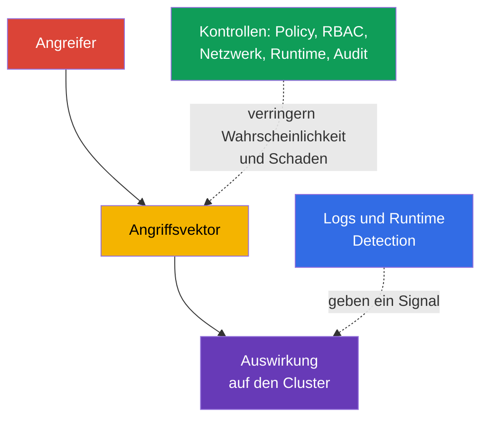
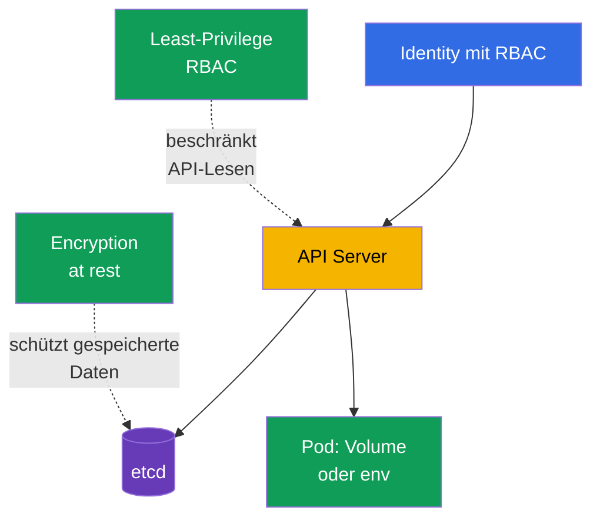

[Русская версия](ru.md) · [Eng version](README.md) · [Versión en español](es.md) · [Version française](fr.md) · [ქართული ვერსია](ge.md) · [繁體中文版](tw.md) · [日本語版](jp.md)

# Kapitel 16. Kubernetes-Bedrohungskategorien

> **Was kommt als Nächstes.** In Kapitel 15 haben wir Vertrauensgrenzen und Datenflüsse definiert. Nun betrachten wir, wie Angriffe diese Grenzen ausnutzen: sich im Cluster festsetzen, Ressourcen erschöpfen, schädlichen Code ausführen, Datenverkehr abfangen, Daten erlangen oder Privilegien ausweiten. Dies ist der KCSA-Bereich **Kubernetes Threat Model** mit einer Gewichtung von 16 %. Die Beispiele im Kurs orientieren sich an Kubernetes `v1.36`.

Ein Bedrohungsmodell verspricht nicht, jedes Risiko zu beseitigen. Es hilft dabei, ein Angriffsszenario mit einer beobachtbaren Ausprägung und mehreren unabhängigen Kontrollen zu verknüpfen. Eine Kontrolle kann ausfallen, deshalb wird Kubernetes schichtweise geschützt: vom Quellcode und Image über `Pod`, API und Netzwerk bis zum Worker Node.



## 16.1 Persistence: Festsetzen im Cluster

**Szenario.** Ein Angreifer mit vorübergehendem Zugriff auf die API oder einen Worker Node möchte das Löschen des ursprünglichen `Pod` überdauern und einen Rückweg in den Cluster behalten. Er kann einen `CronJob` erstellen, der seinen Code regelmäßig startet, `MutatingAdmissionWebhook` verändern, um allen neuen `Pod` einen Container hinzuzufügen, einen static `Pod` in einem vom kubelet überwachten Verzeichnis ablegen oder ein langlebiges Token stehlen.

**Wie es sich zeigt.** In einem Namespace erscheint ein unbekannter `CronJob`, der regelmäßig `Job` und `Pod` erstellt; in der Admission-Konfiguration erscheint ein unbekannter Webhook; kubelet erstellt einen static `Pod` erneut, nachdem dieser über die API gelöscht wurde. Ein kompromittiertes `ServiceAccount`-Token oder kubeconfig wird aus einem ungewöhnlichen Netzwerk oder nach dem Ausscheiden eines Mitarbeiters verwendet. Nicht jeder neue `CronJob` oder Webhook ist ein Angriff, daher wird das Signal mit Owner, Change Record und API-Audit abgeglichen.

**Wie es begrenzt wird.** Beschränken Sie RBAC: Die meisten Identitäten benötigen keine Rechte, `CronJob` zu erstellen, `MutatingWebhookConfiguration` zu ändern oder `ServiceAccount` und `RoleBinding` zu verwalten. Beschränken Sie den Zugriff auf Worker Nodes und static-`Pod`-Pfade; schützen Sie kubelet und dessen Zugangsdaten. Verwenden Sie kurzlebige Tokens, verteilen Sie kubeconfig nicht unkontrolliert und entziehen Sie Zugriff bei einem Rollenwechsel. Admission Policy kann ungeeignete Webhooks oder Images verbieten, während Audit Log und Runtime Detection helfen, die Erstellung und Ausführung unerwarteter Workloads zu erkennen.

| Persistenzpunkt | Warum der ursprüngliche Zugriff überdauert wird | Wichtige Kontrollen |
|---|---|---|
| `CronJob` | Controller erstellt nach Zeitplan neue `Job` | Least-Privilege-RBAC, Audit, Namespace-Review |
| mutating Webhook | betrifft jedes passende neue Objekt | Einschränkung der Admission-Rechte, Konfigurationsprüfung, Audit |
| static `Pod` | kubelet liest das Manifest lokal auf dem Node | Hardening des Worker Node, Schutz der kubelet-Pfade, Monitoring |
| Token oder kubeconfig | ermöglicht erneuten API-Zugriff im Namen einer Identity | kurzlebige Tokens, Rotation, RBAC, Zugriffsverlust |

## 16.2 Denial of Service: Ressourcenerschöpfung

**Szenario.** Ein Anwendungsfehler, ein zu aggressiver Client oder ein absichtlicher Angreifer erzeugt viele `Pod`, verbraucht CPU und Speicher, füllt ephemeral storage, öffnet zahlreiche Verbindungen oder überlastet die API mit Anfragen. Das Ziel eines DoS muss nicht der Zugriff auf Daten sein: Es genügt, einen Service oder die Control Plane unzugänglich zu machen.

**Wie es sich zeigt.** `Pod` erhalten `OOMKilled`, werden wegen fehlender Ressourcen `Pending`, Nodes wechseln zu `NotReady`, die Latenz des API Server steigt und legitime Anfragen erhalten Fehler oder Timeout. In einem Namespace kann eine Flut von `Job` oder `Pod` erscheinen. Eine hohe Last beweist für sich allein keinen Angriff: Sie wird mit normalem Traffic, Limits und der Deployment-Historie verglichen.

**Wie es begrenzt wird.** Für Container werden `resources.requests` und `resources.limits` gesetzt: Requests nehmen an der Planung teil, Limits begrenzen verfügbare CPU oder Speicher. `ResourceQuota` definiert das Gesamtbudget eines Namespace, und `LimitRange` setzt oder verlangt Grenzen auf Containerebene. Sie reduzieren den Blast Radius eines Tenant, ersetzen jedoch weder Capacity Planning, Autoscaling und Schutz gegen Network Flood noch die Kontrolle von API-Clients. Zusätzlich sind Observability, ein Alert bei Sättigung und die Priorisierung kritischer Workloads wichtig.

```yaml
apiVersion: v1
kind: ResourceQuota
metadata:
  name: team-budget
  namespace: team-a
spec:
  hard:
    requests.cpu: "4"
    requests.memory: 8Gi
    limits.cpu: "8"
    limits.memory: 16Gi
    pods: "20"
```

Dieses kurze Beispiel beschränkt das Gesamtbudget eines Namespace, garantiert jedoch nicht die Verfügbarkeit des gesamten Clusters. Ohne Requests und Limits für einzelne Container kann das Budget anders angewendet werden, als das Team erwartet.

## 16.3 Malicious Code Execution und kompromittierte Anwendungen

**Szenario.** Eine Anwendungsschwachstelle führt zu remote code execution (RCE), ein Entwickler startet ein Image mit schädlichem Code oder eine Abhängigkeit enthält eine bekannte CVE. Code im Container kann einen Miner herunterladen, eine reverse shell öffnen, Tokens lesen und im Namen des `ServiceAccount` API-Anfragen stellen.

**Wie es sich zeigt.** Ein Runtime-Detektor erkennt eine Shell, einen Package Manager, einen unerwarteten Befehl oder eine Netzwerkverbindung in einem Application Container. Ein Image Scanner meldet eine verwundbare Bibliothek, und das Audit Log zeigt ungewöhnliche Zugriffe dieses `ServiceAccount` auf die API. Wichtig ist die Unterscheidung: Eine gefundene CVE bedeutet Risiko, beweist aber keine Ausnutzung; eine Shell kann zulässiges Debugging sein. Die Entscheidung wird anhand des Kontexts von Prozess, Image, `Pod`, Identity und Zeit getroffen.

**Wie es begrenzt wird.** Verwenden Sie vertrauenswürdige minimale Images, pinnen Sie deren Digest, scannen Sie Images und Abhängigkeiten in CI, führen Sie ein SBOM und aktualisieren Sie verwundbare Komponenten zeitnah. Image-Signatur und Admission Control verringern die Wahrscheinlichkeit, dass ein ungeprüftes Artefakt gestartet wird. Ein eingeschränkter `securityContext`, der Verzicht auf überflüssige `ServiceAccount`-Tokens, NetworkPolicy und der Start als non-root reduzieren die Möglichkeiten des Codes nach RCE. Runtime Detection, Logs und ein Response-Verfahren helfen, bereits gestarteten schädlichen Code zu erkennen und einzudämmen.

| Kontrolle | In welcher Phase sie wirkt | Was sie nicht ersetzt |
|---|---|---|
| SCA und Image Scan | vor dem Deployment und beim Auftreten einer neuen CVE | Beobachtung der Ausnutzung in der Runtime |
| Image-Signatur und Admission | beim Erstellen eines `Pod` | Sicherheit der Anwendungslogik |
| `securityContext` und minimale Rechte | nach dem Prozessstart | Prüfung der Image-Herkunft |
| Runtime Detection | während der Ausführung | Blockierung aller gefährlichen Aktionen |

## 16.4 Attacker on the Network: MITM und laterale Bewegung

**Szenario.** Ein Angreifer erhält einen Einstiegspunkt im Cluster-Netzwerk oder kompromittiert einen `Pod`. Er versucht, unverschlüsselten Traffic abzufangen, einen Endpoint bei fehlender korrekter TLS-Prüfung zu fälschen oder andere Services, die API und Metadata Endpoints anzusprechen. Eine solche Bewegung zwischen Services wird laterale Bewegung genannt.

**Wie es sich zeigt.** Ein unerwarteter `Pod` beginnt, Verbindungen zu einer Datenbank, einer internen API oder DNS-Namen aufzubauen, die für seine Rolle nicht erforderlich sind. Network Observability zeigt neue Flüsse zwischen Namespaces. Bei TLS-Problemen kann der Client einen Fehler bei der Zertifikatsprüfung sehen, bei unsicherer Konfiguration die Fälschung jedoch überhaupt nicht bemerken. Ein Netzwerkfluss ohne Kenntnis des Anwendungszwecks ist nicht immer schädlich, daher beginnt die Policy mit einer Inventarisierung notwendiger Verbindungen.

**Wie es begrenzt wird.** `NetworkPolicy` setzt das Prinzip default-deny um und erlaubt nur benötigte Ingress- und Egress-Flüsse nach Selector, Port und Protokoll. Für die tatsächliche Durchsetzung muss das CNI Policy unterstützen. mTLS verschlüsselt den Traffic und bestätigt die Identity beider Seiten, was das Risiko von Abfangen und Fälschung mindert; ein Service Mesh kann Zertifikate zentral ausstellen und rotieren. TLS ohne Zertifikatsprüfung, mTLS ohne Netzwerkbeschränkungen und NetworkPolicy ohne Identity-Schutz sind nicht gleichwertig. Zusammen begrenzen sie den Angriffspfad und liefern beobachtbare Netzwerksignale.

## 16.5 Access to Sensitive Data: Secrets, etcd und Volumes

**Szenario.** Ein Angreifer erhält die Rechte `get`, `list` oder `watch` für `secrets`, Zugriff auf etcd oder dessen Backup, kompromittiert einen Worker Node mit eingehängten Volumes oder liest ein Secret aus einer Umgebungsvariable und den Anwendungslogs. `Secret` ist für die Übergabe sensibler Daten praktisch, aber base64 in seinem Feld `data` ist keine Verschlüsselung.

**Wie es sich zeigt.** Das Audit Log zeichnet das massenhafte Lesen von `secrets` auf, ein etcd-Snapshot befindet sich außerhalb eines geschützten Speichers, ein Prozess liest einen ungewöhnlichen Volume-Pfad oder eine Anwendung gibt Zugangsdaten in ein Log aus. Secrets erscheinen in Git, einem Ticket oder einem Crash Dump. Das normale Lesen eines Secret durch einen laufenden Workload ist erwartbar, daher berücksichtigt die Untersuchung Identity, Namespace, Objektanzahl und Zeitpunkt.

**Wie es begrenzt wird.** RBAC gewährt bestimmten Identities Zugriff auf `Secret` und nur mit den benötigten Verben; besonders gefährlich sind breite Rechte für `list` und `watch`. Encryption at rest schützt Daten in etcd und Backup beim Verlust eines Speichermediums oder direktem Zugriff auf den Speicher, schützt aber nicht vor einem Subjekt, dem die API bereits `get` erlaubt. Volume-Verschlüsselung, Schutz der Backups, die Minimierung eingehängter Secrets, getrennte `ServiceAccount` und sicherer Umgang mit Logs begrenzen die Folgen. Für besonders sensible Daten bieten externe Secret Manager und KMS einen separaten Bereich für die Schlüsselverwaltung.



## 16.6 Privilege Escalation: vom Container zum Node

**Szenario.** Ein Angreifer, der bereits Code in einem Container ausgeführt hat, versucht, mehr Rechte zu erhalten. Das Risiko steigt, wenn ein `Pod` mit `privileged: true` läuft, einen sensiblen `hostPath` einhängt, überflüssige Linux Capabilities erhält, `hostPID` verwendet oder Zugriff auf den Socket der Container Runtime hat. Eine Schwachstelle im Kernel oder der Runtime kann zu container escape und Zugriff auf den Worker Node führen.

**Wie es sich zeigt.** Im Manifest erscheinen `privileged` Container, `hostPath` wie `/`, `hostNetwork`, zusätzliche Capabilities oder deaktiviertes seccomp. Ein Runtime-Signal kann einen Mount, Gerätezugriff, das Lesen des Host-Dateisystems oder den Versuch zeigen, den Kernel zu ändern. Nach der Kompromittierung eines Node erhält ein Angreifer häufig Secrets und Tokens der dortigen `Pod`, daher hat dieses Ereignis hohe Priorität.

**Wie es begrenzt wird.** Pod Security Standards und Pod Security Admission lassen gefährliche Einstellungen im Profil `restricted` nicht zu und bieten eine grundlegende gemeinsame Barriere. Entfernen Sie `privileged`, `hostPath`, Host Namespaces und überflüssige Capabilities, starten Sie Prozesse als non-root und verbieten Sie Privilege Escalation, wenn dies mit der Anwendung vereinbar ist. seccomp reduziert die Menge zulässiger Syscalls, während AppArmor Prozessaktionen anhand eines Profile auf unterstützten Nodes einschränkt. Diese Mechanismen ergänzen einander und beheben keine Kernel-Schwachstelle für sich allein. Admission Policy, Manifest-Review, Aktualisierung der Worker Nodes und Runtime Detection bilden die weiteren Schutzschichten.

| Risikoreiche Einstellung | Mögliche Folge | Bevorzugte Kontrolle |
|---|---|---|
| `privileged: true` | umfassender Zugriff auf Geräte und Host-Funktionen | PSS/PSA, Admission, explizite Ausnahme nur bei Notwendigkeit |
| `hostPath` | Lesen/Ändern von Dateien auf dem Worker Node | nicht für gewöhnliche Workloads verwenden; über PSS/PSA oder Admission Policy verbieten oder einschränken; RBAC beschränkt separat, wer Workload-API-Objekte erstellen oder ändern darf. |
| überflüssige Capability | Kernel-Aktion über die Anforderungen der Anwendung hinaus | Capabilities droppen, nur erforderliche hinzufügen |
| `hostPID` oder Runtime Socket | Zugriff auf Host-Prozesse oder Steuerung von Containern | Host Namespaces und Socket-Zugriff verbieten |
| fehlendes seccomp/AppArmor | weniger Barrieren nach einer Ausnutzung | `RuntimeDefault` seccomp, AppArmor-Profile, sofern unterstützt |

## 16.7 Praktische Anwendung

Beginnen Sie nicht mit einer Werkzeugliste, sondern mit kritischen Assets und zulässigen Aktionen. Für jeden Namespace ist es nützlich zu beantworten: Welche Images sind erlaubt, welche Services müssen kommunizieren, welche Secrets werden benötigt, welches Ressourcenbudget ist zulässig und wer darf RBAC, Admission und geplante Workloads verändern.

Eine praktische Reihenfolge kann wie folgt aussehen:

1. Grundlegende präventive Kontrollen aktivieren: Least-Privilege-RBAC, PSA, Requests/Limits, `ResourceQuota`, Image-Prüfung und NetworkPolicy, soweit das CNI diese unterstützt.
2. Daten und Identities schützen: Encryption at rest für sensible Ressourcen aktivieren, `ServiceAccount` trennen, kurzlebige Tokens verwenden, Backups und Worker Nodes schützen.
3. Änderungen beobachtbar machen: Audit Events für die API, CNI- oder Service-Mesh-Logs und Runtime-Signale erfassen. Einen Alert Owner und ein Verfahren festlegen: Kontext prüfen, Workload isolieren, Credential entziehen, Beweise sichern.
4. Ausnahmen regelmäßig überprüfen. Ein `privileged` `Pod`, `hostPath`, eine breite Rolle, offener Egress oder ein Webhook sollten eine Begründung, einen Owner und einen Prüfungstermin haben.

Dies ist keine Laborabfolge von Befehlen, sondern eine Methode, das Bedrohungsmodell in verständliche Anforderungen für Plattform- und Anwendungsteam zu übersetzen.

## 16.8 Exam vocabulary / Mini-Glossar

| Begriff | Bedeutung |
|---|---|
| persistence | Fähigkeit eines Angreifers, nach dem Entfernen des ursprünglichen Einstiegspunkts Zugriff zu behalten |
| DoS | Dienstverweigerung durch Ressourcenerschöpfung oder Überlastung |
| RCE | remote code execution, remote Ausführung von Code über eine Schwachstelle |
| lateral movement | Übergang eines Angreifers von einem System oder Workload zu einem anderen |
| MITM | man-in-the-middle, Abfangen oder Fälschen des Netzwerkaustauschs |
| blast radius | Umfang der Folgen bei der Kompromittierung einer Komponente |
| container escape | Ausbruch eines Prozesses aus der Containerisolierung zu Ressourcen des Worker Node |
| mTLS | gegenseitiges TLS: Die Seiten verschlüsseln den Kanal und prüfen gleichzeitig die Identity der jeweils anderen Seite |

## 16.9 Exam Essentials / Zusammenfassung des Kapitels

- Die sechs KCSA-Bedrohungskategorien beschreiben unterschiedliche Angreiferziele: sich festsetzen, Verfügbarkeit beeinträchtigen, Code ausführen, das Netzwerk angreifen, Daten erlangen oder Privilegien ausweiten.
- Ein einzelnes Symptom ist kein Incident. Es wird mit Identity, Kubernetes-Objekt, Zeitpunkt, erwartetem Verhalten und Audit-/Runtime-Observability-Daten verknüpft.
- `ResourceQuota` und Limits begrenzen den Schaden eines DoS, ersetzen aber weder Capacity Planning noch Observability.
- Signatur, Scanning und Admission reduzieren das Risiko eines schädlichen Artefakts; Runtime Detection wird für Verhalten nach dem Start benötigt.
- `NetworkPolicy` beschränkt erlaubte Flüsse, während mTLS deren Vertraulichkeit und Identity schützt. Beide Kontrollen werden aus unterschiedlichen Gründen benötigt.
- Base64 verschlüsselt kein `Secret`; RBAC, Encryption at rest sowie Schutz von Nodes und Volumes schließen unterschiedliche Datenpfade ab.
- PSS/PSA, seccomp, AppArmor und minimale Privileges bilden mehrere Barrieren gegen Privilege Escalation und Escape.

## 16.10 Nicht verwechseln und typische Prüfungsfragen

Eine KCSA-Frage beschreibt üblicherweise ein Symptom und fordert die Auswahl der **direktesten** Kontrolle. Wenn viele `Pod` in einem Namespace das Budget erschöpfen, suchen Sie nach Limits und `ResourceQuota`, nicht nach NetworkPolicy. Wenn die Bewegung zwischen Services verboten werden soll, wählen Sie `NetworkPolicy`; geht es um Verschlüsselung und gegenseitige Service-Prüfung, wählen Sie mTLS.

Häufige Fallen: Ein `Secret` mit base64 ist nicht verschlüsselt; Encryption at rest hebt das Recht `get secrets` nicht auf; Image Scanning erkennt keinen bereits ausgeführten Befehl; das Audit Log berichtet über Kubernetes-API-Aufrufe, nicht über alle Syscalls in einem Container. Bei einem `privileged` `Pod` ist die beste Antwort meist präventiv: Keine Privilegien ohne Notwendigkeit geben und Admission/PSS anwenden, statt nur auf eine Erkennung nach dem Start zu vertrauen.

## 16.11 Fragen zur Selbstkontrolle

### 1. Welche Kontrolle begrenzt am direktesten die Gesamtzahl von `Pod` und das Ressourcenbudget eines Namespace?

   - a. `ResourceQuota`

   - b. `NetworkPolicy`

   - c. `MutatingAdmissionWebhook`

   - d. mTLS

<details>
<summary>Antwort und Erläuterung</summary>

**Richtige Antwort: a. `ResourceQuota`.** Sie definiert die gesamten Hard Limits eines Namespace, beispielsweise für CPU, Speicher und die Zahl der `Pod`. `NetworkPolicy` regelt Netzwerkflüsse und mTLS schützt eine Verbindung, begrenzt jedoch nicht den Ressourcenverbrauch.

</details>

### 2. Welche Aussage zu Encryption at rest für `Secret` ist richtig?

   - a. Sie verhindert das Lesen eines `Secret` über die API selbst durch ein Subjekt, dem RBAC `get secrets` erlaubt.

   - b. Sie schützt ein `Secret` nur nach dem Einhängen in einen `Pod` und ersetzt den Schutz des Worker Node.

   - c. Sie macht base64 zu kryptografischer Verschlüsselung und beseitigt damit die Notwendigkeit der Schlüsselverwaltung.

   - d. Sie schützt gespeicherte Daten in etcd/Backup, hebt jedoch RBAC für erlaubten API-Zugriff nicht auf.

<details>
<summary>Antwort und Erläuterung</summary>

**Richtige Antwort: d.** Encryption at rest schützt gespeicherte Daten, etwa beim Diebstahl eines etcd-Snapshot. Ein Subjekt mit API-Berechtigung zum Lesen erhält das entschlüsselte Objekt, daher bleibt Least-Privilege-RBAC erforderlich.

</details>

### 3. In einem kompromittierten `Pod` werden Verbindungen zu Services anderer Teams festgestellt. Welche Kontrolle vermindert vorrangig die Möglichkeit einer solchen lateralen Bewegung?

   - a. Default-deny NetworkPolicy mit minimalen Ingress-/Egress-Allow-Regeln für erforderliche Workload-Pfade.
   - b. ResourceQuota, die Gesamt-CPU, Memory und Object Counts innerhalb eines Namespace begrenzt.
   - c. Horizontal Scaling, das bei steigender Last die Zahl der Application Replicas erhöht.
   - d. Base64-Kodierung von Secret Data vor der Übergabe des Werts an die Anwendung.

<details>
<summary>Antwort und Erläuterung</summary>

**Richtige Antwort: a.** Bei CNI-Unterstützung ermöglicht NetworkPolicy, die Netzwerkpfade eines Workload auf erforderliche Richtungen zu beschränken und vermindert damit die Möglichkeiten lateraler Bewegung. Quota schützt die Availability, Scaling verändert die Capacity und base64 ist keine Netzwerkkontrolle.

</details>

### 4. Welches Beispiel beschreibt Persistence in Kubernetes am besten?

   - a. Ein Container erreicht sein Memory Limit und wird mit `OOMKilled` beendet.

   - b. Ein Scanner findet eine verwundbare Bibliothek in einem Image.

   - c. Ein Client besteht die TLS-Zertifikatsprüfung nicht.

   - d. Ein Angreifer erstellt einen `CronJob`, der regelmäßig einen neuen `Pod` erstellt.

<details>
<summary>Antwort und Erläuterung</summary>

**Richtige Antwort: d.** Ein `CronJob` überdauert die Beendigung eines einzelnen `Pod` und startet Code erneut nach Zeitplan. Die übrigen Optionen betreffen Verfügbarkeit, Schwachstellen oder den Kanalschutz.

</details>

### 5. Welches Maßnahmenbündel reduziert das Risiko von container escape und Privilege Escalation am besten?

   - a. Den Container `privileged` belassen, aber Audit Logging, Resource Limits und den Start des Images nur per immutable Digest ergänzen.

   - b. Überflüssige Capabilities und Host Access entfernen, PSS/PSA, seccomp und AppArmor einsetzen, soweit es unterstützt wird.

   - c. Breite Linux Capabilities beibehalten, aber Encryption at rest für `Secret` und eine obligatorische Prüfung der Image-Signatur aktivieren.

   - d. `hostPath` und Runtime Socket erlauben, aber externen Egress über `NetworkPolicy` begrenzen und mTLS verwenden.

<details>
<summary>Antwort und Erläuterung</summary>

**Richtige Antwort: b.** Um das Risiko von Escape und Privilege Escalation zu verringern, wird vor allem der Zugriff des Containers auf Kernel-Funktionen und den Node reduziert: Überflüssige Capabilities und Host-Level Access werden entfernt, gefährliche Pod-Einstellungen über PSS/PSA eingeschränkt und seccomp/AppArmor werden eingesetzt, soweit unterstützt.

Audit Logging, immutable Images, Encryption at rest, Signaturprüfung, `NetworkPolicy` und mTLS sind für andere Schutzschichten nützlich, gleichen jedoch `privileged`, breite Capabilities, `hostPath` oder Zugriff auf den Runtime Socket nicht aus.

</details>

> **Wie weiter.** Für den praktischen Schutz von Runtime und `securityContext` nutzen Sie die Kapitel 16-19 und 22 von CKS. Für Runtime Detection, Untersuchung und verwandte Signale nutzen Sie die Kapitel 29-31 von CKS.

[Inhaltsverzeichnis](../README_DE.md) · [Kapitel 15](../15/de.md) · [Kapitel 17](../17/de.md)
