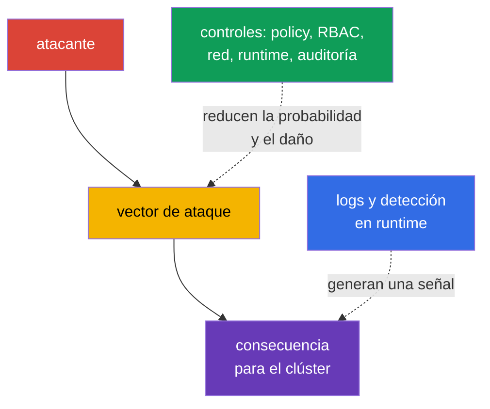
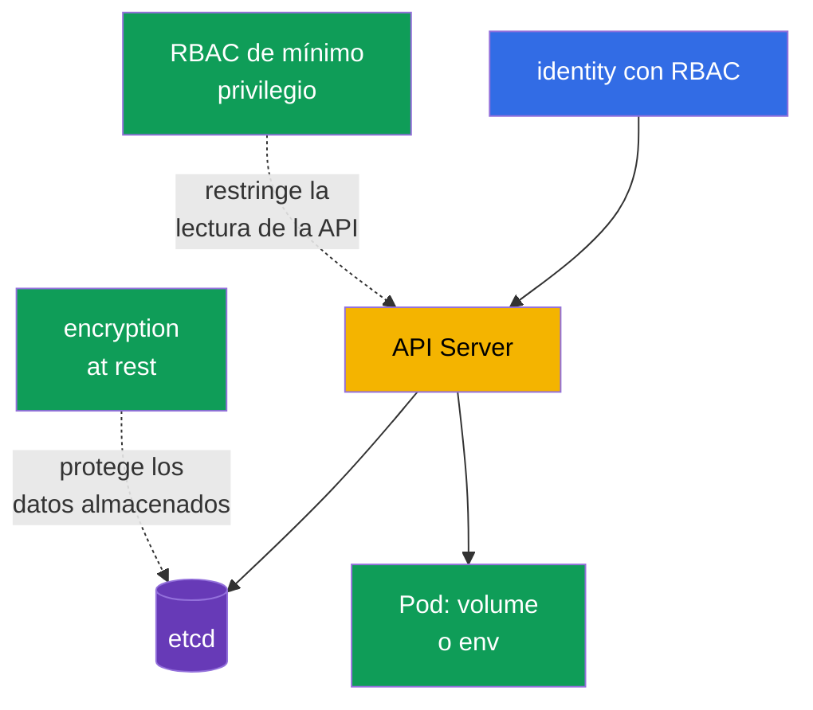

[Русская версия](ru.md) · [Eng version](README.md) · [Version française](fr.md) · [Deutsche Version](de.md) · [ქართული ვერსია](ge.md) · [繁體中文版](tw.md) · [日本語版](jp.md)

# Capítulo 16. Categorías de amenazas de Kubernetes

> **A continuación.** En el capítulo 15 definimos los límites de confianza y los flujos de datos. Ahora veremos cómo los ataques usan esos límites: se afianzan en el clúster, agotan recursos, ejecutan código malicioso, interceptan tráfico, obtienen datos o escalan privilegios. Este es el dominio KCSA **Kubernetes Threat Model** con un peso del 16%. Los ejemplos del curso están orientados a Kubernetes `v1.36`.

Un modelo de amenazas no promete eliminar todo el riesgo. Ayuda a relacionar un escenario de ataque con una manifestación observable y varios controles independientes. Un control puede fallar, por lo que Kubernetes se protege por capas: desde el código fuente y la imagen hasta el `Pod`, la API, la red y el nodo worker.



## 16.1 Persistence: afianzamiento en el clúster

**Escenario.** Un atacante con acceso temporal a la API o a un nodo worker quiere sobrevivir a la eliminación del `Pod` inicial y conservar una vía de regreso al clúster. Puede crear un `CronJob` que ejecute su código periódicamente, modificar un `MutatingAdmissionWebhook` para añadir un contenedor a todos los `Pod` nuevos, colocar un `Pod` static en un directorio supervisado por kubelet o robar un token de larga duración.

**Cómo se manifiesta.** En un namespace aparece un `CronJob` desconocido que crea periódicamente `Job` y `Pod`; aparece un webhook desconocido en la configuración de admission; kubelet vuelve a crear un `Pod` static tras eliminarlo mediante la API. Un token de `ServiceAccount` o kubeconfig comprometido se usa desde una red inusual o después de la salida de un empleado. No todo `CronJob` o webhook nuevo es un ataque, por lo que la señal se correlaciona con el propietario, el registro de cambios y la auditoría de la API.

**Cómo se mitiga.** Restrinja RBAC: la mayoría de las identidades no necesitan permisos para crear `CronJob`, modificar `MutatingWebhookConfiguration` ni administrar `ServiceAccount` y `RoleBinding`. Restrinja el acceso al nodo worker y a las rutas de `Pod` static; proteja kubelet y sus credenciales. Use tokens de corta duración, no distribuya kubeconfig y revoque el acceso al cambiar de rol. Una policy de admission puede prohibir webhooks o imágenes inadecuados, y el audit log y la detección en runtime ayudan a advertir la creación y ejecución de una carga de trabajo inesperada.

| Punto de persistencia | Por qué sobrevive al acceso inicial | Controles principales |
|---|---|---|
| `CronJob` | el controller crea nuevos `Job` según la programación | RBAC de mínimo privilegio, auditoría, revisión del namespace |
| webhook mutating | afecta a cada nuevo objeto que cumple las condiciones | restricción de permisos de admission, revisión de la configuración, auditoría |
| `Pod` static | kubelet lee el manifest localmente en el nodo | hardening del nodo worker, protección de rutas de kubelet, monitorización |
| token o kubeconfig | proporciona acceso reiterado a la API en nombre de una identity | tokens de corta duración, rotación, RBAC, revocación de acceso |

## 16.2 Denial of Service: agotamiento de recursos

**Escenario.** Un error de aplicación, un cliente demasiado agresivo o un atacante intencionado crea muchos `Pod`, consume CPU y memoria, llena el almacenamiento ephemeral, abre muchas conexiones o satura la API con solicitudes. El objetivo de DoS no tiene por qué ser obtener datos: basta con hacer que el servicio o el control plane no estén disponibles.

**Cómo se manifiesta.** Los `Pod` reciben `OOMKilled`, quedan `Pending` por falta de recursos, los nodos pasan a `NotReady`, aumenta la latencia de API Server y las solicitudes legítimas reciben errores o timeout. Puede aparecer una avalancha de `Job` o `Pod` en un namespace. Una carga alta por sí sola no demuestra un ataque: se compara con el tráfico normal, los límites y el historial de deployment.

**Cómo se mitiga.** Para los contenedores se definen `resources.requests` y `resources.limits`: los requests participan en la planificación y los limits restringen la CPU o memoria disponibles. `ResourceQuota` establece el presupuesto total del namespace y `LimitRange` establece o exige límites en el nivel de contenedor. Reducen el blast radius de un tenant, pero no sustituyen la planificación de capacidad, el autoscaling, la protección contra flood de red ni el control de clientes de API. También son importantes la observabilidad, las alertas de saturación y la priorización de las cargas de trabajo críticas.

```yaml
apiVersion: v1
kind: ResourceQuota
metadata:
  name: team-budget
  namespace: team-a
spec:
  hard:
    requests.cpu: "4"
    requests.memory: 8Gi
    limits.cpu: "8"
    limits.memory: 16Gi
    pods: "20"
```

Este ejemplo breve limita el presupuesto agregado del namespace, pero no garantiza la disponibilidad de todo el clúster. Sin requests y limits para los contenedores individuales, el presupuesto puede aplicarse de forma distinta a la esperada por el equipo.

## 16.3 Malicious Code Execution y aplicaciones comprometidas

**Escenario.** Una vulnerabilidad de la aplicación conduce a remote code execution (RCE), un desarrollador ejecuta una imagen con código malicioso o una dependencia contiene una CVE conocida. El código en el contenedor puede descargar un minero, abrir una reverse shell, leer tokens y realizar solicitudes a la API en nombre del `ServiceAccount`.

**Cómo se manifiesta.** Un detector en runtime observa una shell, un package manager, un comando inesperado o una conexión de red en un application container. Un escáner de imágenes informa de una biblioteca vulnerable y el audit log muestra accesos inusuales de este `ServiceAccount` a la API. Es importante distinguir: una CVE detectada implica riesgo, pero no prueba explotación; una shell puede ser depuración autorizada. La decisión se toma según el contexto del proceso, la imagen, el `Pod`, la identity y el momento.

**Cómo se mitiga.** Use imágenes mínimas de confianza, fije su digest, escanee imágenes y dependencias en CI, mantenga un SBOM y actualice con rapidez los componentes vulnerables. La firma de imágenes y el control de admission reducen la probabilidad de ejecutar un artefacto no verificado. Un `securityContext` restrictivo, la eliminación de tokens innecesarios de `ServiceAccount`, NetworkPolicy y la ejecución non-root reducen las posibilidades del código tras un RCE. La detección en runtime, los logs y un procedimiento de respuesta ayudan a detectar y contener código malicioso que ya se está ejecutando.

| Control | En qué etapa funciona | Qué no sustituye |
|---|---|---|
| SCA e image scan | antes del deployment y al aparecer una nueva CVE | observación de la explotación en runtime |
| firma de imagen y admission | al crear el `Pod` | seguridad de la lógica de la aplicación |
| `securityContext` y privilegios mínimos | después de iniciar el proceso | verificación de la procedencia de la imagen |
| detección en runtime | durante la ejecución | bloqueo de todas las acciones peligrosas |

## 16.4 Attacker on the Network: MITM y movimiento lateral

**Escenario.** Un atacante obtiene un punto en la red del clúster o compromete un `Pod`. Intenta interceptar tráfico sin cifrar, sustituir un endpoint sin la validación correcta de TLS o acceder a otros servicios, a la API y a un endpoint de metadata. Este desplazamiento entre servicios se denomina movimiento lateral.

**Cómo se manifiesta.** Un `Pod` inesperado empieza a conectarse a una base de datos, una API interna o nombres DNS que no necesita para su rol. La observabilidad de red muestra flujos nuevos entre namespaces. Ante problemas de TLS, el cliente puede ver un error de validación del certificado y, con una configuración insegura, puede no advertir en absoluto la sustitución. Un flujo de red sin conocer el propósito de la aplicación no siempre es malicioso, por lo que la policy comienza con un inventario de las conexiones necesarias.

**Cómo se mitiga.** `NetworkPolicy` implementa el principio default-deny y permite únicamente los flujos ingress y egress necesarios por selector, puerto y protocolo. Para aplicarla realmente, el CNI debe admitir policy. mTLS cifra el tráfico y confirma la identity de ambas partes, lo que reduce el riesgo de interceptación y sustitución; un service mesh puede emitir y rotar certificados de forma centralizada. TLS sin validación de certificados, mTLS sin restricciones de red y NetworkPolicy sin protección de identity no son equivalentes entre sí. En conjunto, limitan la ruta de ataque y proporcionan señales de red observables.

## 16.5 Access to Sensitive Data: secretos, etcd y volúmenes

**Escenario.** Un atacante obtiene permiso `get`, `list` o `watch` para `secrets`, acceso a etcd o a su backup, captura un nodo worker con volúmenes montados o lee un secreto desde una variable de entorno y los logs de la aplicación. Un `Secret` es práctico para entregar datos sensibles, pero base64 en su campo `data` no es cifrado.

**Cómo se manifiesta.** El audit log registra lectura masiva de `secrets`, un snapshot de etcd termina fuera de un almacenamiento protegido, un proceso lee una ruta de volume inusual o una aplicación imprime una credential en el log. Los secretos aparecen en Git, un ticket o un crash dump. La lectura habitual de un secreto por una carga de trabajo en ejecución es esperada, por lo que la investigación tiene en cuenta la identity, el namespace, el número de objetos y el momento.

**Cómo se mitiga.** RBAC concede acceso a `Secret` a identidades concretas y solo con los verbos necesarios; `list` y `watch` amplios son especialmente peligrosos. Encryption at rest protege los datos en etcd y backup ante la pérdida del soporte o el acceso directo al almacenamiento, pero no protege frente a un sujeto al que la API ya permite `get`. El cifrado de volúmenes, la protección de backup, la minimización del número de secretos montados, la separación de `ServiceAccount` y el tratamiento seguro de logs reducen las consecuencias. Para datos especialmente sensibles, los secret manager externos y KMS ofrecen un plano de gestión de claves separado.



## 16.6 Privilege Escalation: del contenedor al nodo

**Escenario.** Un atacante que ya ejecutó código en un contenedor intenta obtener más privilegios. El riesgo aumenta si el `Pod` se ejecuta con `privileged: true`, monta un `hostPath` sensible, recibe Linux capabilities innecesarias, usa `hostPID` o tiene acceso al socket del container runtime. Una vulnerabilidad de kernel o runtime puede provocar un container escape y acceso al nodo worker.

**Cómo se manifiesta.** En el manifest aparecen contenedores `privileged`, `hostPath` como `/`, `hostNetwork`, capabilities adicionales o seccomp desactivado. Una señal de runtime puede mostrar un mount, acceso a un dispositivo, lectura del host filesystem o un intento de modificar el kernel. Tras comprometer el nodo, el atacante suele obtener secretos y tokens de los `Pod` presentes en él, por lo que este evento tiene alta prioridad.

**Cómo se mitiga.** Pod Security Standards y Pod Security Admission no permiten configuraciones peligrosas en el perfil `restricted` y proporcionan una barrera general básica. Elimine `privileged`, `hostPath`, host namespaces y capabilities innecesarias, ejecute el proceso non-root y prohíba la escalada de privilegios si es compatible con la aplicación. seccomp reduce el conjunto de syscall permitidas y AppArmor limita las acciones del proceso mediante un profile en nodos compatibles. Estos mecanismos se complementan y no corrigen por sí solos una vulnerabilidad del kernel. Las policy de admission, la revisión de manifest, la actualización del nodo worker y la detección en runtime conforman las capas de protección restantes.

| Configuración arriesgada | Posible consecuencia | Control preferido |
|---|---|---|
| `privileged: true` | amplio acceso a dispositivos y capacidades del host | PSS/PSA, admission, excepción explícita solo cuando sea necesaria |
| `hostPath` | lectura/modificación de archivos del nodo worker | no usar para workloads normales; prohibir o restringir mediante PSS/PSA o una admission policy; RBAC restringe por separado quién puede crear o modificar objetos API de workload. |
| capability innecesaria | acción de kernel más allá de las necesidades de la aplicación | eliminar capabilities, añadir solo la necesaria |
| `hostPID` o runtime socket | acceso a procesos del host o gestión de contenedores | prohibir host namespaces y el acceso al socket |
| seccomp/AppArmor ausente | menos barreras tras la explotación | seccomp `RuntimeDefault`, profile AppArmor donde sea compatible |

## 16.7 Cómo aplicarlo en la práctica

No comience con una lista de herramientas, sino con los activos críticos y las acciones permitidas. Para cada namespace es útil responder: qué imágenes se permiten, qué servicios deben comunicarse, qué secretos se necesitan, qué presupuesto de recursos es aceptable y quién tiene permiso para modificar RBAC, admission y scheduled workload.

Un orden práctico puede ser el siguiente:

1. Activar controles preventivos básicos: RBAC de mínimo privilegio, PSA, requests/limits, `ResourceQuota`, verificación de imágenes y NetworkPolicy donde el CNI lo admita.
2. Proteger los datos y las identities: activar encryption at rest para recursos sensibles, separar `ServiceAccount`, usar tokens de corta duración, proteger backup y nodos worker.
3. Hacer observables los cambios: recopilar audit events de la API, logs de CNI o service mesh y señales de runtime. Asignar un propietario de la alerta y un procedimiento: comprobar el contexto, aislar la carga de trabajo, revocar la credential y conservar las pruebas.
4. Revisar las excepciones periódicamente. Un `Pod` `privileged`, `hostPath`, un rol amplio, un egress abierto o un webhook deben tener justificación, propietario y fecha de revisión.

No se trata de una secuencia de comandos de laboratorio, sino de una forma de convertir el modelo de amenazas en requisitos claros para la plataforma y el equipo de aplicación.

## 16.8 Exam vocabulary / Miniglosario

| Término | Significado |
|---|---|
| persistence | capacidad del atacante para mantener el acceso tras eliminar el punto de entrada inicial |
| DoS | denegación de servicio por agotamiento de recursos o sobrecarga |
| RCE | remote code execution, ejecución remota de código mediante una vulnerabilidad |
| lateral movement | desplazamiento del atacante de un sistema o carga de trabajo a otro |
| MITM | man-in-the-middle, interceptación o sustitución del intercambio de red |
| blast radius | alcance de las consecuencias al comprometer un componente |
| container escape | salida de un proceso del aislamiento del contenedor hacia recursos del nodo worker |
| mTLS | TLS mutuo: las partes cifran el canal y verifican simultáneamente la identity de la otra |

## 16.9 Exam Essentials / Resumen del capítulo

- Las seis categorías de amenazas de KCSA describen distintos objetivos del atacante: afianzarse, afectar la disponibilidad, ejecutar código, atacar la red, obtener datos o ampliar privilegios.
- Un síntoma no equivale a un incidente. Se relaciona con la identity, el objeto de Kubernetes, el momento, el comportamiento esperado y los datos de observabilidad de auditoría/runtime.
- `ResourceQuota` y limits limitan el daño de DoS, pero no sustituyen la planificación de capacidad ni la observabilidad.
- La firma, el escaneo y admission reducen el riesgo de un artefacto malicioso; la detección en runtime es necesaria para el comportamiento posterior al inicio.
- `NetworkPolicy` limita los flujos permitidos y mTLS protege su confidencialidad e identity. Ambos controles son necesarios por motivos distintos.
- Base64 no cifra un `Secret`; RBAC, encryption at rest, la protección de nodos y volúmenes cubren rutas diferentes hacia los datos.
- PSS/PSA, seccomp, AppArmor y los privilegios mínimos forman varias barreras contra la escalada de privilegios y escape.

## 16.10 No confundir y cómo aparece en el examen

Una pregunta de KCSA suele describir un síntoma y pedir el control **más directo**. Si muchos `Pod` de un namespace agotan el presupuesto, busque limits y `ResourceQuota`, no NetworkPolicy. Si es necesario prohibir el desplazamiento entre servicios, elija `NetworkPolicy`; si la pregunta trata sobre el cifrado y la validación mutua de un servicio, elija mTLS.

Trampas frecuentes: un `Secret` con base64 no está cifrado; encryption at rest no elimina el derecho `get secrets`; el escaneo de imágenes no detecta un comando ya ejecutado; el audit log informa de la llamada a la API de Kubernetes, no de todos los syscall del contenedor. Para un `Pod` `privileged`, la mejor respuesta suele ser preventiva: no conceder el privilegio sin necesidad y aplicar admission/PSS, en vez de depender solo de la detección tras el inicio.

## 16.11 Preguntas de autoevaluación

### 1. ¿Qué control limita de forma más directa el número total de `Pod` y el presupuesto de recursos de un namespace?

   - a. `ResourceQuota`

   - b. `NetworkPolicy`

   - c. `MutatingAdmissionWebhook`

   - d. mTLS

<details>
<summary>Respuesta y explicación</summary>

**Respuesta correcta: a. `ResourceQuota`.** Establece hard limits agregados del namespace, por ejemplo para CPU, memoria y el número de `Pod`. `NetworkPolicy` regula los flujos de red y mTLS protege la conexión, pero no limitan el consumo de recursos.

</details>

### 2. ¿Qué afirmación sobre encryption at rest para `Secret` es correcta?

   - a. Prohíbe la lectura de `Secret` mediante la API incluso al sujeto al que RBAC permite `get secrets`.

   - b. Protege `Secret` solo después de montarlo en un `Pod` y sustituye la protección del nodo worker.

   - c. Convierte base64 en cifrado criptográfico y, por tanto, elimina la necesidad de gestionar claves.

   - d. Protege los datos almacenados en etcd/backup, pero no elimina RBAC para el acceso autorizado a la API.

<details>
<summary>Respuesta y explicación</summary>

**Respuesta correcta: d.** Encryption at rest protege los datos almacenados, por ejemplo ante el robo de un snapshot de etcd. Un sujeto con permiso de API para leer obtendrá el objeto descifrado, por lo que RBAC de mínimo privilegio sigue siendo obligatorio.

</details>

### 3. En un `Pod` comprometido se observan conexiones a servicios de otros equipos. ¿Qué control reduce ante todo la posibilidad de dicho movimiento lateral?

   - a. NetworkPolicy default-deny con reglas allow mínimas de ingress/egress para las rutas de workload necesarias.
   - b. ResourceQuota que limita la CPU, memory y los object counts agregados dentro del namespace.
   - c. Horizontal scaling que aumenta el número de replicas de la aplicación al crecer la carga.
   - d. Codificación base64 de Secret data antes de entregar el valor a la aplicación.

<details>
<summary>Respuesta y explicación</summary>

**Respuesta correcta: a.** Con soporte de CNI, NetworkPolicy permite limitar las rutas de red de workload exclusivamente a las direcciones necesarias y, con ello, reducir las posibilidades de movimiento lateral. Quota protege la availability, scaling modifica la capacity y base64 no es un control de red.

</details>

### 4. ¿Qué ejemplo describe mejor persistence en Kubernetes?

   - a. Un contenedor alcanzó el memory limit y finalizó con `OOMKilled`.

   - b. Un escáner encontró una biblioteca vulnerable en la imagen.

   - c. Un cliente no superó la validación del certificado TLS.

   - d. Un atacante creó un `CronJob` que crea regularmente un nuevo `Pod`.

<details>
<summary>Respuesta y explicación</summary>

**Respuesta correcta: d.** Un `CronJob` sobrevive a la finalización de un `Pod` individual y vuelve a ejecutar el código según la programación. Las demás opciones corresponden a la disponibilidad, una vulnerabilidad o la protección del canal.

</details>

### 5. ¿Qué conjunto de medidas reduce mejor el riesgo de container escape y escalada de privilegios?

   - a. Mantener el contenedor `privileged`, pero añadir audit logging, resource limits y ejecutar la imagen solo por immutable digest.

   - b. Eliminar capabilities y host access innecesarios, aplicar PSS/PSA, seccomp y AppArmor donde sea compatible.

   - c. Conservar Linux capabilities amplias, pero activar encryption at rest para `Secret` y la validación obligatoria de la firma de imagen.

   - d. Permitir `hostPath` y runtime socket, pero limitar el egress externo mediante `NetworkPolicy` y usar mTLS.

<details>
<summary>Respuesta y explicación</summary>

**Respuesta correcta: b.** Para reducir el riesgo de escape y privilege escalation, primero se reduce el acceso del contenedor a las capacidades del kernel y del nodo: se eliminan capabilities y host-level access innecesarios, se restringen las configuraciones peligrosas de Pod mediante PSS/PSA y se aplican seccomp/AppArmor donde sean compatibles.

Audit logging, immutable images, encryption at rest, signature verification, `NetworkPolicy` y mTLS son útiles para otras capas de protección, pero no compensan `privileged`, capabilities amplias, `hostPath` ni el acceso a runtime socket.

</details>

> **A dónde ir después.** Para la protección práctica de runtime y `securityContext`, use los capítulos 16-19 y 22 de CKS. Para runtime detection, investigación y señales relacionadas, use los capítulos 29-31 de CKS.

[Índice](../README_ES.md) · [Capítulo 15](../15/es.md) · [Capítulo 17](../17/es.md)
