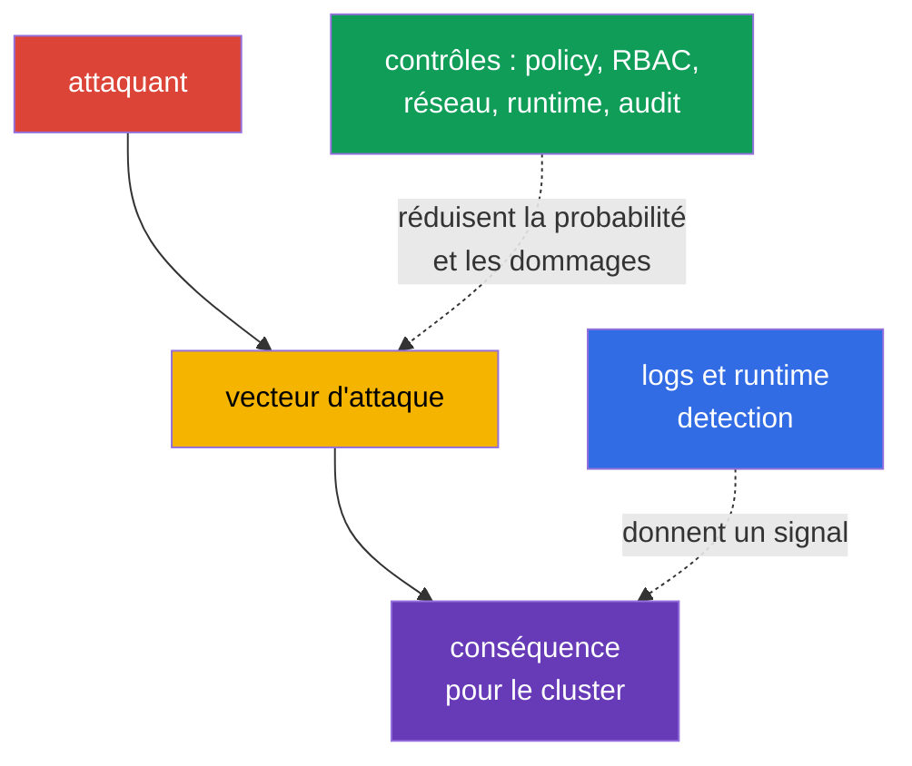
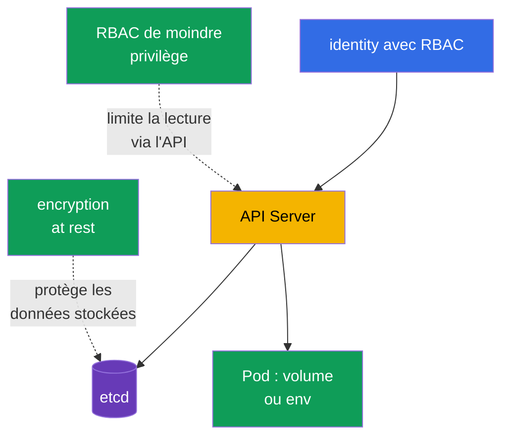

[Русская версия](ru.md) · [Eng version](README.md) · [Versión en español](es.md) · [Deutsche Version](de.md) · [ქართული ვერსია](ge.md) · [繁體中文版](tw.md) · [日本語版](jp.md)

# Chapitre 16. Catégories de menaces Kubernetes

> **La suite.** Au chapitre 15, nous avons défini les frontières de confiance et les flux de données. Examinons maintenant comment les attaques exploitent ces frontières : elles s'installent dans le cluster, épuisent les ressources, exécutent du code malveillant, interceptent le trafic, accèdent aux données ou augmentent les privilèges. C'est le domaine KCSA **Kubernetes Threat Model**, avec un poids de 16 %. Les exemples du cours sont orientés vers Kubernetes `v1.36`.

Le modèle de menaces ne promet pas d'éliminer tous les risques. Il aide à associer un scénario d'attaque à une manifestation observable et à plusieurs contrôles indépendants. Un contrôle peut échouer, c'est pourquoi Kubernetes est protégé par couches : du code source et de l'image au `Pod`, à l'API, au réseau et au nœud worker.



## 16.1 Persistence : installation durable dans le cluster

**Scénario.** Un attaquant disposant d'un accès temporaire à l'API ou à un nœud worker souhaite survivre à la suppression du `Pod` initial et conserver un chemin de retour vers le cluster. Il peut créer un `CronJob` qui lance périodiquement son code, modifier un `MutatingAdmissionWebhook` pour ajouter un conteneur à tous les nouveaux `Pod`, placer un `Pod` static dans un répertoire surveillé par kubelet ou voler un jeton à longue durée de vie.

**Manifestation.** Un `CronJob` inconnu apparaît dans le namespace et crée périodiquement des `Job` et des `Pod` ; un webhook inconnu apparaît dans la configuration d'admission ; kubelet recrée un `Pod` static après sa suppression via l'API. Un jeton `ServiceAccount` ou un kubeconfig compromis est utilisé depuis un réseau inhabituel ou après le départ d'un employé. Tout nouveau `CronJob` ou webhook n'est pas nécessairement une attaque, le signal est donc corrélé avec le propriétaire, le change record et l'audit de l'API.

**Contrôles.** Limitez RBAC : la plupart des identities n'ont pas besoin de droits pour créer des `CronJob`, modifier `MutatingWebhookConfiguration` ou gérer `ServiceAccount` et `RoleBinding`. Limitez l'accès aux nœuds worker et aux chemins des `Pod` static ; protégez kubelet et ses identifiants. Utilisez des jetons de courte durée de vie, ne distribuez pas de kubeconfig et révoquez les accès lors des changements de rôle. Une admission policy peut interdire les webhooks ou images inadaptés, tandis que l'audit log et runtime detection aident à repérer la création et l'exécution d'une workload inattendue.

| Point de persistance | Pourquoi il survit à l'accès initial | Principaux contrôles |
|---|---|---|
| `CronJob` | le controller crée de nouveaux `Job` selon une planification | RBAC de moindre privilège, audit, revue du namespace |
| mutating webhook | affecte chaque nouvel objet correspondant | limitation des droits d'admission, vérification de la configuration, audit |
| `Pod` static | kubelet lit le manifest localement sur le nœud | hardening du nœud worker, protection des chemins kubelet, monitoring |
| jeton ou kubeconfig | donne un accès répété à l'API au nom d'une identity | jetons de courte durée de vie, rotation, RBAC, révocation des accès |

## 16.2 Denial of Service : épuisement des ressources

**Scénario.** Une erreur d'application, un client trop agressif ou un attaquant intentionnel crée de nombreux `Pod`, consomme du CPU et de la mémoire, remplit l'ephemeral storage, ouvre de nombreuses connexions ou surcharge l'API de requêtes. L'objectif d'un DoS n'est pas nécessairement d'obtenir des données : il suffit de rendre le service ou le control plane indisponible.

**Manifestation.** Les `Pod` reçoivent `OOMKilled`, deviennent `Pending` par manque de ressources, les nœuds passent à `NotReady`, la latence de l'API Server augmente et les requêtes légitimes reçoivent des erreurs ou des timeout. Une avalanche de `Job` ou de `Pod` peut apparaître dans un namespace. Une charge élevée ne prouve pas à elle seule une attaque : elle est comparée au trafic habituel, aux limites et à l'historique des deployment.

**Contrôles.** Les conteneurs reçoivent `resources.requests` et `resources.limits` : les requests participent à la planification, les limits bornent le CPU ou la mémoire disponible. `ResourceQuota` définit le budget global d'un namespace et `LimitRange` définit ou exige des limites au niveau du conteneur. Ils réduisent le blast radius d'un tenant, mais ne remplacent ni le capacity planning, ni l'autoscaling, ni la protection contre les network flood, ni le contrôle des clients API. L'observabilité, les alertes de saturation et la priorisation des workloads critiques sont également importantes.

```yaml
apiVersion: v1
kind: ResourceQuota
metadata:
  name: team-budget
  namespace: team-a
spec:
  hard:
    requests.cpu: "4"
    requests.memory: 8Gi
    limits.cpu: "8"
    limits.memory: 16Gi
    pods: "20"
```

Cet exemple court limite le budget cumulé du namespace, mais ne garantit pas la disponibilité de tout le cluster. Sans requests et limits pour les conteneurs individuels, le budget peut être appliqué autrement que l'équipe ne l'attend.

## 16.3 Malicious Code Execution et applications compromises

**Scénario.** Une vulnérabilité d'application conduit à une remote code execution (RCE), un développeur lance une image contenant du code malveillant ou une dépendance contient une CVE connue. Le code dans le conteneur peut télécharger un mineur, ouvrir un reverse shell, lire des jetons et envoyer des requêtes à l'API au nom du `ServiceAccount`.

**Manifestation.** Un runtime-détecteur observe un shell, un package manager, une commande ou une connexion réseau inattendue dans un application container. Le scanner d'image signale une bibliothèque vulnérable et l'audit log montre des accès inhabituels de ce `ServiceAccount` à l'API. Il est important de distinguer : une CVE détectée signifie un risque, mais ne prouve pas une exploitation ; un shell peut être un débogage autorisé. La décision est prise selon le contexte du processus, de l'image, du `Pod`, de l'identity et du moment.

**Contrôles.** Utilisez des images minimales et de confiance, fixez leur digest, scannez les images et les dépendances dans CI, maintenez un SBOM et mettez rapidement à jour les composants vulnérables. La signature d'image et admission control réduisent la probabilité de lancer un artefact non vérifié. Un `securityContext` limité, le refus de jetons `ServiceAccount` superflus, NetworkPolicy et l'exécution non-root réduisent les possibilités du code après une RCE. Runtime detection, les logs et une procédure de réponse aident à détecter et contenir du code malveillant déjà exécuté.

| Contrôle | À quelle étape il agit | Ce qu'il ne remplace pas |
|---|---|---|
| SCA et image scan | avant le deployment et à l'apparition d'une nouvelle CVE | l'observation de l'exploitation au runtime |
| signature d'image et admission | lors de la création du `Pod` | la sécurité de la logique d'application |
| `securityContext` et privilèges minimaux | après le démarrage du processus | la vérification de la provenance de l'image |
| runtime detection | pendant l'exécution | le blocage de toutes les actions dangereuses |

## 16.4 Attacker on the Network : MITM et mouvement latéral

**Scénario.** Un attaquant obtient un point dans le réseau du cluster ou compromet un `Pod`. Il tente d'intercepter le trafic non chiffré, de substituer un endpoint en l'absence de vérification TLS correcte, ou d'accéder à d'autres services, à l'API et au metadata endpoint. Ce déplacement entre services est appelé mouvement latéral.

**Manifestation.** Un `Pod` inattendu commence à se connecter à une base de données, à une API interne ou à des noms DNS dont son rôle n'a pas besoin. L'observabilité réseau montre de nouveaux flux entre namespaces. En cas de problèmes TLS, le client peut voir une erreur de vérification de certificat et, avec une configuration non sûre, ne pas remarquer la substitution. Un flux réseau sans connaissance du rôle de l'application n'est pas toujours malveillant, la policy commence donc par l'inventaire des relations nécessaires.

**Contrôles.** `NetworkPolicy` met en œuvre le principe default-deny et n'autorise que les flux ingress et egress requis, selon le selector, le port et le protocole. Pour son application effective, le CNI doit prendre en charge les policy. mTLS chiffre le trafic et confirme l'identity des deux parties, ce qui réduit le risque d'interception et de substitution ; un service mesh peut émettre et faire tourner les certificats de manière centralisée. TLS sans vérification de certificat, mTLS sans restrictions réseau et NetworkPolicy sans protection de l'identity ne sont pas équivalents. Ensemble, ils limitent le chemin d'attaque et fournissent des signaux réseau observables.

## 16.5 Access to Sensitive Data : secrets, etcd et volumes

**Scénario.** Un attaquant obtient les droits `get`, `list` ou `watch` sur les `secrets`, accède à etcd ou à sa backup, prend le contrôle d'un nœud worker avec des volumes montés, ou lit un secret depuis une variable d'environnement et les logs de l'application. Un `Secret` est pratique pour transmettre des données sensibles, mais base64 dans son champ `data` n'est pas du chiffrement.

**Manifestation.** L'audit log enregistre une lecture massive de `secrets`, un snapshot etcd se retrouve hors d'un stockage protégé, un processus lit un chemin de volume inhabituel ou une application affiche un credential dans un log. Des secrets apparaissent dans Git, un ticket ou un crash dump. La lecture habituelle d'un secret par une workload en cours d'exécution est attendue, l'enquête tient donc compte de l'identity, du namespace, du nombre d'objets et du moment.

**Contrôles.** RBAC accorde l'accès à un `Secret` à des identities précises et uniquement avec les verbes nécessaires ; les `list` et `watch` larges sont particulièrement dangereux. Encryption at rest protège les données dans etcd et les backup lors de la perte d'un support ou d'un accès direct au stockage, mais ne protège pas contre un sujet auquel l'API autorise déjà `get`. Le chiffrement des volumes, la protection des backup, la réduction du nombre de secrets montés, la séparation des `ServiceAccount` et une gestion sûre des logs réduisent les conséquences. Pour les données particulièrement sensibles, les secret manager externes et KMS fournissent un périmètre distinct de gestion des clés.



## 16.6 Privilege Escalation : du conteneur au nœud

**Scénario.** Un attaquant ayant déjà exécuté du code dans un conteneur tente d'obtenir davantage de droits. Le risque augmente si le `Pod` est lancé avec `privileged: true`, monte un `hostPath` sensible, reçoit des Linux capabilities superflues, utilise `hostPID` ou accède au socket du container runtime. Une vulnérabilité du kernel ou du runtime peut conduire à un container escape et à l'accès au nœud worker.

**Manifestation.** Des conteneurs `privileged`, un `hostPath` tel que `/`, `hostNetwork`, des capabilities supplémentaires ou seccomp désactivé apparaissent dans le manifest. Un signal runtime peut montrer un mount, un accès à un périphérique, la lecture du host filesystem ou une tentative de modification du kernel. Après la compromission d'un nœud, l'attaquant obtient souvent les secrets et jetons des `Pod` qui s'y trouvent, cet événement est donc de haute priorité.

**Contrôles.** Pod Security Standards et Pod Security Admission n'autorisent pas les réglages dangereux dans le profil `restricted` et fournissent une barrière générale de base. Retirez `privileged`, `hostPath`, les host namespaces et les capabilities superflues, lancez le processus non-root et interdisez privilege escalation si l'application le permet. seccomp réduit l'ensemble des syscall autorisés et AppArmor restreint les actions du processus par profile sur les nœuds pris en charge. Ces mécanismes se complètent et ne corrigent pas à eux seuls une vulnérabilité du kernel. Admission policy, revue de manifest, mise à jour des nœuds worker et runtime detection constituent les autres couches de protection.

| Réglage risqué | Conséquence possible | Contrôle privilégié |
|---|---|---|
| `privileged: true` | large accès aux périphériques et capacités de l'hôte | PSS/PSA, admission, exception explicite uniquement si nécessaire |
| `hostPath` | lecture/modification de fichiers du nœud worker | ne pas utiliser pour les workloads ordinaires ; interdire ou limiter par PSS/PSA ou admission policy ; RBAC limite séparément qui peut créer ou modifier les objets d'API de workload. |
| capability superflue | action sur le kernel au-delà des besoins de l'application | drop capabilities, ajouter uniquement le nécessaire |
| `hostPID` ou runtime socket | accès aux processus de l'hôte ou gestion des conteneurs | interdire les host namespaces et l'accès au socket |
| seccomp/AppArmor absent | moins de barrières après l'exploitation | seccomp `RuntimeDefault`, profile AppArmor là où il est pris en charge |

## 16.7 Application pratique

Commencez non pas par une liste d'outils, mais par les actifs critiques et les actions autorisées. Pour chaque namespace, il est utile de répondre : quelles images sont autorisées, quels services doivent communiquer, quels secrets sont nécessaires, quel budget de ressources est acceptable et qui est autorisé à modifier RBAC, admission et les workloads scheduled.

Un ordre pratique peut ressembler à ceci :

1. Activer les contrôles préventifs de base : RBAC de moindre privilège, PSA, requests/limits, `ResourceQuota`, vérification des images et NetworkPolicy là où le CNI le prend en charge.
2. Protéger les données et les identities : activer encryption at rest pour les ressources sensibles, séparer les `ServiceAccount`, utiliser des jetons de courte durée de vie, protéger les backup et les nœuds worker.
3. Rendre les changements observables : collecter les audit events de l'API, les logs CNI ou du service mesh et les signaux runtime. Désigner un propriétaire de l'alerte et une procédure : vérifier le contexte, isoler la workload, révoquer le credential, conserver les preuves.
4. Revoir régulièrement les exceptions. Un `Pod` `privileged`, un `hostPath`, un rôle large, un egress ouvert ou un webhook doivent avoir une justification, un propriétaire et une échéance de revue.

Il ne s'agit pas d'une séquence de commandes de laboratoire, mais d'une méthode pour transformer le modèle de menaces en exigences compréhensibles pour la plateforme et l'équipe applicative.

## 16.8 Exam vocabulary / Mini-glossaire

| Terme | Signification |
|---|---|
| persistence | capacité de l'attaquant à conserver l'accès après la suppression du point d'entrée initial |
| DoS | déni de service dû à l'épuisement des ressources ou à une surcharge |
| RCE | remote code execution, exécution de code à distance via une vulnérabilité |
| lateral movement | déplacement de l'attaquant d'un système ou d'une workload à un autre |
| MITM | man-in-the-middle, interception ou substitution d'un échange réseau |
| blast radius | ampleur des conséquences de la compromission d'un composant |
| container escape | sortie d'un processus de l'isolation du conteneur vers les ressources du nœud worker |
| mTLS | TLS mutuel : les parties chiffrent simultanément le canal et vérifient l'identity de l'autre |

## 16.9 Exam Essentials / Résumé du chapitre

- Les six catégories de menaces KCSA décrivent différents objectifs de l'attaquant : s'installer durablement, perturber la disponibilité, exécuter du code, attaquer le réseau, obtenir des données ou étendre ses privilèges.
- Un symptôme ne constitue pas un incident. Il est associé à l'identity, à l'objet Kubernetes, au moment, au comportement attendu et aux données d'observabilité audit/runtime.
- `ResourceQuota` et les limits limitent les dommages d'un DoS, mais ne remplacent ni la planification de capacité ni l'observabilité.
- La signature, le scan et l'admission réduisent le risque d'un artefact malveillant ; runtime detection est nécessaire pour le comportement après le lancement.
- `NetworkPolicy` limite les flux autorisés, tandis que mTLS protège leur confidentialité et leur identity. Ces deux contrôles sont nécessaires pour des raisons différentes.
- Base64 ne chiffre pas un `Secret` ; RBAC, encryption at rest, la protection des nœuds et des volumes couvrent différents chemins vers les données.
- PSS/PSA, seccomp, AppArmor et les privileges minimaux forment plusieurs barrières contre l'augmentation des privilèges et l'escape.

## 16.10 À ne pas confondre et présence à l'examen

Une question KCSA décrit généralement un symptôme et demande de choisir le contrôle **le plus direct**. Si de nombreux `Pod` dans un namespace épuisent le budget, cherchez les limits et `ResourceQuota`, et non NetworkPolicy. S'il faut interdire les déplacements entre services, choisissez `NetworkPolicy` ; si la question porte sur le chiffrement et la vérification mutuelle du service, choisissez mTLS.

Pièges fréquents : un `Secret` avec base64 n'est pas chiffré ; encryption at rest n'annule pas le droit `get secrets` ; le scan d'image ne détecte pas une commande déjà exécutée ; l'audit log relate l'appel à l'API Kubernetes, et non tous les syscall dans un conteneur. Pour un `Pod` `privileged`, la meilleure réponse est généralement préventive : ne pas accorder le privilège sans nécessité et appliquer admission/PSS, plutôt que de compter uniquement sur la détection après le lancement.

## 16.11 Questions d'autoévaluation

### 1. Quel contrôle limite le plus directement le nombre global de `Pod` et le budget de ressources d'un namespace ?

   - a. `ResourceQuota`

   - b. `NetworkPolicy`

   - c. `MutatingAdmissionWebhook`

   - d. mTLS

<details>
<summary>Réponse et explication</summary>

**Bonne réponse : a. `ResourceQuota`.** Il définit les hard limits globaux du namespace, par exemple pour le CPU, la mémoire et le nombre de `Pod`. `NetworkPolicy` régule les flux réseau et mTLS protège la connexion, mais ils ne limitent pas la consommation de ressources.

</details>

### 2. Quelle affirmation concernant encryption at rest pour un `Secret` est correcte ?

   - a. Elle interdit la lecture du `Secret` via l'API, même à un sujet auquel RBAC autorise `get secrets`.

   - b. Elle protège le `Secret` uniquement après son montage dans un `Pod` et remplace la protection du nœud worker.

   - c. Elle transforme base64 en chiffrement cryptographique et élimine donc la nécessité de gérer les clés.

   - d. Elle protège les données stockées dans etcd/backup, mais n'annule pas RBAC pour l'accès API autorisé.

<details>
<summary>Réponse et explication</summary>

**Bonne réponse : d.** Encryption at rest protège les données stockées, par exemple en cas de vol d'un snapshot etcd. Un sujet disposant de l'autorisation API de lecture reçoit l'objet déchiffré, le RBAC de moindre privilège reste donc obligatoire.

</details>

### 3. Dans un `Pod` compromis, des connexions vers les services d'autres équipes sont observées. Quel contrôle réduit avant tout la possibilité d'un tel mouvement latéral ?

   - a. Une NetworkPolicy default-deny avec des règles allow ingress/egress minimales pour les workload paths nécessaires.
   - b. Une ResourceQuota qui limite les CPU, la mémoire et les object counts globaux du namespace.
   - c. Un horizontal scaling qui augmente le nombre de replicas de l'application lorsque la charge croît.
   - d. L'encodage base64 des données d'un Secret avant d'envoyer la valeur à l'application.

<details>
<summary>Réponse et explication</summary>

**Bonne réponse : a.** Lorsque le CNI le prend en charge, NetworkPolicy permet de limiter les chemins réseau d'une workload aux seules directions nécessaires et réduit ainsi les possibilités de mouvement latéral. Quota protège l'availability, le scaling modifie la capacity et base64 n'est pas un contrôle réseau.

</details>

### 4. Quel exemple décrit le mieux la persistence dans Kubernetes ?

   - a. Un conteneur a atteint la memory limit et a été arrêté avec `OOMKilled`.

   - b. Un scanner a trouvé une bibliothèque vulnérable dans une image.

   - c. Un client n'a pas réussi la vérification d'un certificat TLS.

   - d. Un attaquant a créé un `CronJob` qui crée régulièrement un nouveau `Pod`.

<details>
<summary>Réponse et explication</summary>

**Bonne réponse : d.** Un `CronJob` survit à l'arrêt d'un `Pod` individuel et relance le code selon une planification. Les autres options concernent la disponibilité, une vulnérabilité ou la protection du canal.

</details>

### 5. Quel ensemble de mesures réduit le mieux le risque de container escape et d'augmentation des privilèges ?

   - a. Conserver le conteneur `privileged`, mais ajouter audit logging, resource limits et lancer l'image uniquement par immutable digest.

   - b. Retirer les capabilities et host access superflus, appliquer PSS/PSA, seccomp et AppArmor là où ils sont pris en charge.

   - c. Conserver de larges Linux capabilities, mais activer encryption at rest pour le `Secret` et la vérification obligatoire de la signature d'image.

   - d. Autoriser `hostPath` et runtime socket, mais limiter l'egress externe avec NetworkPolicy et utiliser mTLS.

<details>
<summary>Réponse et explication</summary>

**Bonne réponse : b.** Pour réduire le risque d'escape et de privilege escalation, on réduit avant tout l'accès du conteneur aux capacités du kernel et du nœud : on retire les capabilities inutiles et le host-level access, on limite les réglages dangereux du Pod via PSS/PSA et on applique seccomp/AppArmor là où ils sont pris en charge.

Audit logging, immutable images, encryption at rest, signature verification, `NetworkPolicy` et mTLS sont utiles pour d'autres couches de protection, mais ne compensent pas `privileged`, de larges capabilities, `hostPath` ou l'accès au runtime socket.

</details>

> **La suite.** Pour la protection pratique du runtime et de `securityContext`, utilisez les chapitres 16-19 et 22 CKS. Pour runtime detection, l'enquête et les signaux associés, utilisez les chapitres 29-31 CKS.

[Table des matières](../README_FR.md) · [Chapitre 15](../15/fr.md) · [Chapitre 17](../17/fr.md)