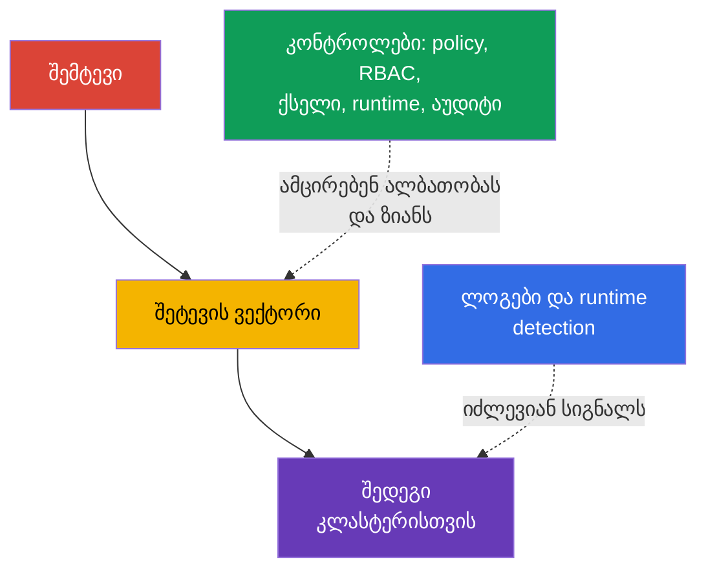
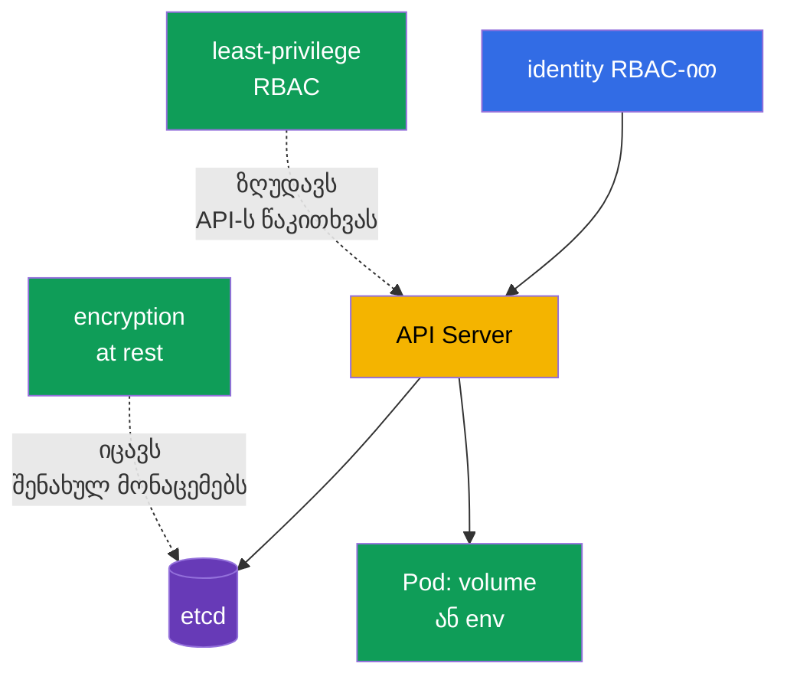

[Русская версия](ru.md) · [Eng version](README.md) · [Versión en español](es.md) · [Version française](fr.md) · [Deutsche Version](de.md) · [繁體中文版](tw.md) · [日本語版](jp.md)

# თავი 16. Kubernetes-ის საფრთხეების კატეგორიები

> **რა არის შემდეგ.** მე-15 თავში განვსაზღვრეთ ნდობის საზღვრები და მონაცემთა ნაკადები. ახლა განვიხილავთ, როგორ იყენებენ შეტევები ამ საზღვრებს: მყარდებიან კლასტერში, ამოწურავენ რესურსებს, ასრულებენ მავნე კოდს, ხელში იგდებენ ტრაფიკს, იღებენ მონაცემებს ან იმაღლებენ პრივილეგიებს. ეს არის KCSA-ს დომენი **Kubernetes Threat Model**, რომლის წონაა 16%. კურსის მაგალითები ორიენტირებულია Kubernetes `v1.36`-ზე.

საფრთხეების მოდელი არ გვპირდება მთელი რისკის აღმოფხვრას. ის გვეხმარება, შეტევის სცენარი დავაკავშიროთ დაკვირვებად გამოვლინებასთან და რამდენიმე დამოუკიდებელ კონტროლთან. ერთი კონტროლი შეიძლება მწყობრიდან გამოვიდეს, ამიტომ Kubernetes-ს შრეებად იცავენ: საწყისი კოდიდან და image-იდან `Pod`-მდე, API-მდე, ქსელამდე და worker node-მდე.



## 16.1 Persistence: კლასტერში დამკვიდრება

**სცენარი.** შემტევს, რომელსაც დროებითი წვდომა აქვს API-ზე ან worker node-ზე, სურს გადაურჩეს საწყისი `Pod`-ის წაშლას და კლასტერში დასაბრუნებელი გზა შეინარჩუნოს. მას შეუძლია შექმნას `CronJob`, რომელიც პერიოდულად გაუშვებს მის კოდს, შეცვალოს `MutatingAdmissionWebhook`, რათა ყველა ახალ `Pod`-ში დაამატოს container, განათავსოს static `Pod` იმ კატალოგში, რომელსაც kubelet აკვირდება, ან მოიპაროს ხანგრძლივი მოქმედების token.

**როგორ ვლინდება.** namespace-ში ჩნდება უცნობი `CronJob`, რომელიც პერიოდულად ქმნის `Job`-სა და `Pod`-ს; admission-ის კონფიგურაციაში ჩნდება უცნობი webhook; kubelet API-ს მეშვეობით წაშლის შემდეგ კვლავ ქმნის static `Pod`-ს. დაკარგული `ServiceAccount` token ან kubeconfig გამოიყენება უჩვეულო ქსელიდან ან თანამშრომლის წასვლის შემდეგ. ყოველი ახალი `CronJob` ან webhook შეტევა არ არის, ამიტომ სიგნალს ადარებენ მფლობელს, change record-სა და API-ს აუდიტს.

**რით იფარება.** შეზღუდეთ RBAC: identity-ების უმრავლესობას არ სჭირდება `CronJob`-ის შექმნის, `MutatingWebhookConfiguration`-ის შეცვლის ან `ServiceAccount`-ისა და `RoleBinding`-ის მართვის უფლებები. შეზღუდეთ worker node-სა და static `Pod`-ის ბილიკებზე წვდომა; დაიცავით kubelet და მისი credentials. გამოიყენეთ ხანმოკლე token-ები, ნუ გაავრცელებთ kubeconfig-ს და გააუქმეთ წვდომა როლის შეცვლისას. Admission policy-ს შეუძლია აკრძალოს შეუსაბამო webhook-ები ან image-ები, ხოლო audit log და runtime detection გეხმარებათ მოულოდნელი workload-ის შექმნისა და შესრულების შემჩნევაში.

| დამკვიდრების წერტილი | რატომ ძლებს საწყისი წვდომის შემდეგ | ძირითადი კონტროლები |
|---|---|---|
| `CronJob` | controller განრიგის მიხედვით ქმნის ახალ `Job`-ებს | least-privilege RBAC, audit, namespace-ის მიმოხილვა |
| mutating webhook | გავლენას ახდენს ყოველ შესაბამის ახალ ობიექტზე | admission-ის უფლებების შეზღუდვა, კონფიგურაციის შემოწმება, აუდიტი |
| static `Pod` | kubelet manifest-ს node-ზე ლოკალურად კითხულობს | worker node-ის hardening, kubelet-ის ბილიკების დაცვა, მონიტორინგი |
| token ან kubeconfig | API-ზე identity-ის სახელით განმეორებით წვდომას იძლევა | ხანმოკლე token-ები, როტაცია, RBAC, წვდომის გაუქმება |

## 16.2 Denial of Service: რესურსების ამოწურვა

**სცენარი.** აპლიკაციის შეცდომა, ზედმეტად აგრესიული client ან განზრახ მოქმედი შემტევი ქმნის ბევრ `Pod`-ს, მოიხმარს CPU-სა და მეხსიერებას, ავსებს ephemeral storage-ს, ხსნის მრავალ კავშირს ან API-ს მოთხოვნებით ტვირთავს. DoS-ის მიზანი აუცილებელი არ არის მონაცემების მიღება იყოს: საკმარისია service ან control plane მიუწვდომელი გახდეს.

**როგორ ვლინდება.** `Pod`-ები იღებენ `OOMKilled`-ს, რესურსების ნაკლებობის გამო გადადიან `Pending` მდგომარეობაში, node-ები გადადიან `NotReady` მდგომარეობაში, იზრდება API Server-ის დაყოვნება, ხოლო ლეგიტიმური მოთხოვნები იღებენ შეცდომებს ან timeout-ს. ერთ namespace-ში შეიძლება `Job`-ების ან `Pod`-ების მოზღვავება გამოჩნდეს. მაღალი დატვირთვა თავისთავად შეტევას არ ამტკიცებს: მას ადარებენ ჩვეულებრივ ტრაფიკს, limits-სა და deployment-ის ისტორიას.

**რით იფარება.** container-ებისთვის განსაზღვრავენ `resources.requests`-სა და `resources.limits`-ს: requests მონაწილეობს დაგეგმვაში, limits კი ზღუდავს ხელმისაწვდომ CPU-ს ან მეხსიერებას. `ResourceQuota` განსაზღვრავს namespace-ის ჯამურ ბიუჯეტს, ხოლო `LimitRange` container-ის დონეზე აწესებს ან მოითხოვს საზღვრებს. ისინი ამცირებენ ერთი tenant-ის blast radius-ს, მაგრამ არ ანაცვლებენ capacity planning-ს, autoscaling-ს, ქსელური flood-ისგან დაცვასა და API client-ების კონტროლს. ასევე მნიშვნელოვანია დაკვირვებადობა, გაჯერებაზე alert და კრიტიკული workload-ების პრიორიტეტიზაცია.

```yaml
apiVersion: v1
kind: ResourceQuota
metadata:
  name: team-budget
  namespace: team-a
spec:
  hard:
    requests.cpu: "4"
    requests.memory: 8Gi
    limits.cpu: "8"
    limits.memory: 16Gi
    pods: "20"
```

ეს მოკლე მაგალითი ზღუდავს namespace-ის ერთობლივ ბიუჯეტს და არა მთელი კლასტერის ხელმისაწვდომობის გარანტიას. ცალკეული container-ებისთვის requests-ისა და limits-ის გარეშე ბიუჯეტი შეიძლება ისე არ იქნეს გამოყენებული, როგორც გუნდი მოელის.

## 16.3 Malicious Code Execution და კომპრომეტირებული აპლიკაციები

**სცენარი.** აპლიკაციის სისუსტე იწვევს remote code execution-ს (RCE), developer უშვებს მავნე კოდის შემცველ image-ს ან dependency შეიცავს ცნობილ CVE-ს. container-ში გაშვებულ კოდს შეუძლია ჩამოტვირთოს miner, გახსნას reverse shell, წაიკითხოს token-ები და `ServiceAccount`-ის სახელით API-ს მიმართოს.

**როგორ ვლინდება.** Runtime detector application container-ში ხედავს shell-ს, package manager-ს, მოულოდნელ command-ს ან ქსელურ კავშირს. Image scanner დაუცველი library-ის შესახებ იუწყება, audit log კი აჩვენებს ამ `ServiceAccount`-ის უჩვეულო მიმართვებს API-სადმი. მნიშვნელოვანია განსხვავება: აღმოჩენილი CVE რისკს ნიშნავს, მაგრამ exploitation-ს არ ამტკიცებს; shell შეიძლება ნებადართული debugging იყოს. გადაწყვეტილებას იღებენ process-ის, image-ის, `Pod`-ის, identity-ისა და დროის კონტექსტის მიხედვით.

**რით იფარება.** გამოიყენეთ სანდო მინიმალური image-ები, დააფიქსირეთ მათი digest, დაასკანერეთ image-ები და dependencies CI-ში, აწარმოეთ SBOM და ოპერატიულად განაახლეთ დაუცველი components. Image signature და admission control ამცირებს შეუმოწმებელი artifact-ის გაშვების ალბათობას. შეზღუდული `securityContext`, ზედმეტ `ServiceAccount` token-ებზე უარის თქმა, NetworkPolicy და non-root გაშვება ამცირებს კოდის შესაძლებლობებს RCE-ის შემდეგ. Runtime detection, ლოგები და ინციდენტზე რეაგირების პროცედურა გეხმარებათ უკვე გაშვებული მავნე კოდის აღმოჩენასა და შეკავებაში.

| კონტროლი | რომელ ეტაპზე მუშაობს | რას არ ანაცვლებს |
|---|---|---|
| SCA და image scan | deployment-მდე და ახალი CVE-ის გამოჩენისას | runtime-ში exploitation-ზე დაკვირვებას |
| image signature და admission | `Pod`-ის შექმნისას | აპლიკაციის ლოგიკის უსაფრთხოებას |
| `securityContext` და მინიმალური უფლებები | process-ის გაშვების შემდეგ | image-ის წარმოშობის შემოწმებას |
| runtime detection | შესრულების დროს | ყველა სახიფათო მოქმედების დაბლოკვას |

## 16.4 Attacker on the Network: MITM და ლატერალური გადაადგილება

**სცენარი.** შემტევი კლასტერის ქსელში საყრდენ წერტილს იღებს ან ერთ `Pod`-ს აკომპრომეტირებს. ის ცდილობს ხელში ჩაიგდოს დაუშიფრავი ტრაფიკი, შეცვალოს endpoint TLS-ის სათანადო შემოწმების არარსებობისას ან მიმართოს სხვა services-ს, API-სა და metadata endpoint-ს. services-ს შორის ასეთ გადაადგილებას ლატერალური გადაადგილება ეწოდება.

**როგორ ვლინდება.** მოულოდნელი `Pod` იწყებს დაკავშირებას მონაცემთა ბაზასთან, შიდა API-სთან ან DNS სახელებთან, რომლებიც მის როლს არ სჭირდება. ქსელის დაკვირვებადობა namespace-ებს შორის ახალ ნაკადებს აჩვენებს. TLS-ის პრობლემებისას client-მა შეიძლება certificate verification-ის შეცდომა დაინახოს, ხოლო არასაიმედო კონფიგურაციის შემთხვევაში ჩანაცვლება საერთოდ ვერ შეამჩნიოს. აპლიკაციის დანიშნულების ცოდნის გარეშე ქსელური ნაკადი ყოველთვის მავნე არ არის, ამიტომ policy საჭირო კავშირების ინვენტარიზაციით იწყება.

**რით იფარება.** `NetworkPolicy` ახორციელებს default-deny პრინციპს და selector-ის, port-ისა და protocol-ის მიხედვით მხოლოდ საჭირო ingress და egress ნაკადებს უშვებს. მისი რეალური გამოყენებისთვის CNI-ს policy-ის მხარდაჭერა სჭირდება. mTLS ტრაფიკს შიფრავს და ორივე მხარის identity-ს ადასტურებს, რაც ხელში ჩაგდებისა და ჩანაცვლების რისკს ამცირებს; service mesh-ს შეუძლია certificates-ის ცენტრალიზებულად გაცემა და როტაცია. TLS certificate verification-ის გარეშე, mTLS ქსელის შეზღუდვების გარეშე და NetworkPolicy identity-ის დაცვის გარეშე ერთმანეთის ეკვივალენტური არ არის. ერთობლივად ისინი ზღუდავენ შეტევის გზას და დაკვირვებად ქსელურ სიგნალებს იძლევიან.

## 16.5 Access to Sensitive Data: secrets, etcd და volumes

**სცენარი.** შემტევი იღებს `secrets`-ისთვის `get`, `list` ან `watch` უფლებას, წვდომას etcd-ზე ან მის backup-ზე, ხელში იგდებს worker node-ს დამონტაჟებული volumes-ით ან კითხულობს secret-ს გარემოს ცვლადიდან და აპლიკაციის ლოგებიდან. `Secret` მოსახერხებელია მგრძნობიარე მონაცემების გადასაცემად, მაგრამ მის `data` ველში base64 დაშიფვრას არ წარმოადგენს.

**როგორ ვლინდება.** Audit log აფიქსირებს `secrets`-ის მასობრივ წაკითხვას, etcd snapshot დაცული საცავის გარეთ აღმოჩნდება, process კითხულობს volume-ის უჩვეულო ბილიკს ან აპლიკაცია credential-ს ლოგში ბეჭდავს. Secrets ჩნდება Git-ში, ticket-ში ან crash dump-ში. გაშვებული workload-ის მიერ secret-ის ჩვეულებრივი წაკითხვა მოსალოდნელია, ამიტომ გამოძიება ითვალისწინებს identity-ს, namespace-ს, ობიექტების რაოდენობასა და დროს.

**რით იფარება.** RBAC `Secret`-ზე წვდომას აძლევს კონკრეტულ identity-ებს და მხოლოდ საჭირო verbs-ით; ფართო `list` და `watch` განსაკუთრებით სახიფათოა. Encryption at rest იცავს მონაცემებს etcd-სა და backup-ში მატარებლის დაკარგვის ან საცავზე პირდაპირი წვდომის შემთხვევაში, მაგრამ არ იცავს იმ სუბიექტისგან, რომელსაც API უკვე აძლევს `get` უფლებას. Volumes-ის დაშიფვრა, backup-ის დაცვა, დამონტაჟებული secrets-ის რაოდენობის მინიმიზაცია, `ServiceAccount`-ების განცალკევება და ლოგებთან უსაფრთხო მუშაობა შედეგების მასშტაბს ამცირებს. განსაკუთრებით მგრძნობიარე მონაცემებისთვის გარე secret manager და KMS გასაღებების მართვის ცალკე კონტურს ქმნის.



## 16.6 Privilege Escalation: container-იდან node-მდე

**სცენარი.** შემტევი, რომელმაც container-ში კოდი უკვე შეასრულა, მეტი უფლებების მიღებას ცდილობს. რისკი იზრდება, თუ `Pod` გაშვებულია `privileged: true`-ით, ამონტაჟებს მგრძნობიარე `hostPath`-ს, იღებს ზედმეტ Linux capabilities-ს, იყენებს `hostPID`-ს ან წვდომა აქვს container runtime-ის socket-ზე. Kernel-ის ან runtime-ის სისუსტემ შეიძლება container escape და worker node-ზე წვდომა გამოიწვიოს.

**როგორ ვლინდება.** Manifest-ში ჩნდება `privileged` container-ები, `/`-ის მსგავსი `hostPath`, `hostNetwork`, დამატებითი capabilities ან გამორთული seccomp. Runtime signal-მა შეიძლება აჩვენოს mount, device-ზე წვდომა, host filesystem-ის წაკითხვა ან kernel-ის შეცვლის მცდელობა. Node-ის კომპრომეტირების შემდეგ შემტევი ხშირად მასზე განთავსებული `Pod`-ების secrets-სა და token-ებს იღებს, ამიტომ ამ მოვლენას მაღალი პრიორიტეტი აქვს.

**რით იფარება.** Pod Security Standards და Pod Security Admission `restricted` profile-ში სახიფათო კონფიგურაციებს არ უშვებენ და საერთო საბაზისო ბარიერს ქმნიან. მოაშორეთ `privileged`, `hostPath`, host namespaces და ზედმეტი capabilities, გაუშვით process non-root რეჟიმში და აკრძალეთ privilege escalation, თუ ეს აპლიკაციასთან თავსებადია. seccomp ამცირებს დაშვებული syscall-ების ნაკრებს, AppArmor კი მხარდაჭერილ node-ებზე profile-ის მიხედვით process-ის მოქმედებებს ზღუდავს. ეს მექანიზმები ერთმანეთს ავსებენ და თავად kernel-ის სისუსტეს არ ასწორებენ. Admission policy, manifest-ის მიმოხილვა, worker node-ის განახლება და runtime detection დაცვის დანარჩენ შრეებს ქმნის.

| სარისკო კონფიგურაცია | შესაძლო შედეგი | სასურველი კონტროლი |
|---|---|---|
| `privileged: true` | host-ის devices-სა და შესაძლებლობებზე ფართო წვდომა | PSS/PSA, admission, მკაფიო გამონაკლისი მხოლოდ საჭიროებისას |
| `hostPath` | worker node-ის files-ის წაკითხვა/შეცვლა | არ გამოიყენოთ ჩვეულებრივი workloads-ისთვის; აკრძალეთ ან შეზღუდეთ PSS/PSA-ით ან admission policy-ით; RBAC ცალკე ზღუდავს, ვის შეუძლია workload API objects-ის შექმნა ან შეცვლა. |
| ზედმეტი capability | kernel-ის მოქმედება აპლიკაციის საჭიროების მიღმა | drop capabilities, დაამატეთ მხოლოდ აუცილებელი |
| `hostPID` ან runtime socket | host-ის processes-ზე წვდომა ან containers-ის მართვა | აკრძალეთ host namespaces და socket-ზე წვდომა |
| seccomp/AppArmor არ არის | ნაკლები ბარიერი exploitation-ის შემდეგ | `RuntimeDefault` seccomp, AppArmor profile იქ, სადაც მხარდაჭერილია |

## 16.7 როგორ გამოიყენება ეს პრაქტიკაში

დაიწყეთ არა tools-ის სიით, არამედ კრიტიკული assets-ითა და დაშვებული მოქმედებებით. თითოეული namespace-ისთვის სასარგებლოა პასუხი გაეცეს კითხვებს: რომელი images არის ნებადართული, რომელი services უნდა უკავშირდებოდეს ერთმანეთს, რომელი secrets არის საჭირო, რესურსების რა ბიუჯეტია დასაშვები და ვის შეუძლია RBAC-ის, admission-ისა და scheduled workload-ის შეცვლა.

პრაქტიკული თანმიმდევრობა შეიძლება ასეთი იყოს:

1. ჩართეთ საბაზისო პრევენციული კონტროლები: least-privilege RBAC, PSA, requests/limits, `ResourceQuota`, image-ების შემოწმება და NetworkPolicy იქ, სადაც CNI ამას მხარს უჭერს.
2. დაიცავით მონაცემები და identities: ჩართეთ encryption at rest მგრძნობიარე რესურსებისთვის, განცალკევეთ `ServiceAccount`-ები, გამოიყენეთ ხანმოკლე token-ები, დაიცავით backup და worker node-ები.
3. ცვლილებები დაკვირვებადი გახადეთ: შეაგროვეთ audit events API-სთვის, CNI-ს ან service mesh-ის ლოგები და runtime signals. დანიშნეთ alert-ის მფლობელი და პროცედურა: შეამოწმეთ კონტექსტი, იზოლაციაში მოაქციეთ workload, გააუქმეთ credential, შეინახეთ მტკიცებულებები.
4. რეგულარულად გადახედეთ გამონაკლისებს. `privileged` `Pod`-ს, `hostPath`-ს, ფართო role-ს, ღია egress-ს ან webhook-ს უნდა ჰქონდეს დასაბუთება, მფლობელი და გადახედვის ვადა.

ეს commands-ის ლაბორატორიული თანმიმდევრობა კი არა, საფრთხეების მოდელის პლატფორმისა და აპლიკაციის გუნდისთვის გასაგებ მოთხოვნებად გარდაქმნის გზაა.

## 16.8 Exam vocabulary / მცირე ლექსიკონი

| ტერმინი | მნიშვნელობა |
|---|---|
| persistence | შემტევის უნარი, შეინარჩუნოს წვდომა საწყისი შესვლის წერტილის წაშლის შემდეგ |
| DoS | რესურსების ამოწურვით ან გადატვირთვით გამოწვეული მომსახურების უარყოფა |
| RCE | remote code execution, სისუსტის მეშვეობით კოდის დისტანციურად შესრულება |
| lateral movement | შემტევის გადასვლა ერთი system-იდან ან workload-იდან მეორეზე |
| MITM | man-in-the-middle, ქსელური მიმოცვლის ხელში ჩაგდება ან ჩანაცვლება |
| blast radius | ერთი component-ის კომპრომეტირების შედეგების მასშტაბი |
| container escape | process-ის container-ის იზოლაციიდან worker node-ის რესურსებამდე გასვლა |
| mTLS | ორმხრივი TLS: მხარეები ერთდროულად შიფრავენ არხს და ერთმანეთის identity-ს ამოწმებენ |

## 16.9 Exam Essentials / თავის შეჯამება

- KCSA-ს საფრთხეების ექვსი კატეგორია აღწერს შემტევის სხვადასხვა მიზანს: დამკვიდრებას, ხელმისაწვდომობის დარღვევას, კოდის შესრულებას, ქსელზე შეტევას, მონაცემების მიღებას ან პრივილეგიების გაფართოებას.
- ერთი სიმპტომი ინციდენტს არ უდრის. მას აკავშირებენ identity-სთან, Kubernetes-ის ობიექტთან, დროსთან, მოსალოდნელ ქცევასთან და audit/runtime დაკვირვებადობის მონაცემებთან.
- `ResourceQuota` და limits ზღუდავენ DoS-ის ზიანს, მაგრამ არ ანაცვლებენ capacity planning-სა და დაკვირვებადობას.
- Signature, scanning და admission ამცირებს მავნე artifact-ის რისკს; runtime detection საჭიროა გაშვების შემდგომი ქცევისთვის.
- `NetworkPolicy` ზღუდავს დაშვებულ ნაკადებს, mTLS კი იცავს მათ კონფიდენციალურობასა და identity-ს. ორივე კონტროლი სხვადასხვა მიზეზით არის საჭირო.
- Base64 `Secret`-ს არ შიფრავს; RBAC, encryption at rest, node-ებისა და volumes-ის დაცვა მონაცემებამდე მიმავალ სხვადასხვა გზას ფარავს.
- PSS/PSA, seccomp, AppArmor და მინიმალური privileges პრივილეგიების ამაღლებისა და escape-ის წინააღმდეგ რამდენიმე ბარიერს ქმნის.

## 16.10 რა არ უნდა აგერიოთ და როგორ გვხვდება ეს გამოცდაზე

KCSA-ს კითხვა ჩვეულებრივ აღწერს სიმპტომს და ითხოვს **ყველაზე პირდაპირი** კონტროლის არჩევას. თუ ერთ namespace-ში ბევრი `Pod` ბიუჯეტს ამოწურავს, ეძებეთ limits და `ResourceQuota`, არა NetworkPolicy. თუ services-ს შორის გადაადგილება უნდა აკრძალოთ, აირჩიეთ `NetworkPolicy`; თუ კითხვა service-ის დაშიფვრასა და ორმხრივ შემოწმებას ეხება, აირჩიეთ mTLS.

ხშირი ხაფანგები: base64-ის მქონე `Secret` დაშიფრული არ არის; encryption at rest არ აუქმებს `get secrets` უფლებას; image scanning უკვე შესრულებულ command-ს ვერ აღმოაჩენს; audit log გვიჩვენებს Kubernetes API-ს გამოძახებას და არა container-ის ყველა syscall-ს. `privileged` `Pod`-ისთვის საუკეთესო პასუხი ჩვეულებრივ პრევენციულია: არ მიანიჭოთ privilege საჭიროების გარეშე და გამოიყენეთ admission/PSS, იმის ნაცვლად, რომ მხოლოდ გაშვების შემდგომ detection-ს დაეყრდნოთ.

## 16.11 თვითშემოწმების კითხვები

### 1. რომელი კონტროლი ზღუდავს ყველაზე პირდაპირ ერთი namespace-ის `Pod`-ების ერთობლივ რაოდენობასა და რესურსების ბიუჯეტს?

   - a. `ResourceQuota`

   - b. `NetworkPolicy`

   - c. `MutatingAdmissionWebhook`

   - d. mTLS

<details>
<summary>პასუხი და განმარტება</summary>

**სწორი პასუხია: a. `ResourceQuota`.** ის განსაზღვრავს namespace-ის ჯამურ hard limits-ს, მაგალითად CPU-ს, მეხსიერებისა და `Pod`-ების რაოდენობის მიხედვით. `NetworkPolicy` არეგულირებს ქსელურ ნაკადებს, mTLS კი კავშირს იცავს, მაგრამ ისინი რესურსების მოხმარებას არ ზღუდავენ.

</details>

### 2. რომელი დებულებაა სწორი `Secret`-ისთვის encryption at rest-ის შესახებ?

   - a. ის კრძალავს `Secret`-ის API-ს მეშვეობით წაკითხვას იმ სუბიექტისთვისაც, რომელსაც RBAC `get secrets`-ის უფლებას აძლევს.

   - b. ის `Secret`-ს მხოლოდ `Pod`-ში დამონტაჟების შემდეგ იცავს და worker node-ის დაცვას ანაცვლებს.

   - c. ის base64-ს კრიპტოგრაფიულ დაშიფვრად აქცევს და ამიტომ გასაღებების მართვის საჭიროებას აღმოფხვრის.

   - d. ის იცავს etcd-ში/backup-ში შენახულ მონაცემებს, მაგრამ ნებადართული API წვდომისთვის RBAC-ს არ აუქმებს.

<details>
<summary>პასუხი და განმარტება</summary>

**სწორი პასუხია: d.** Encryption at rest იცავს შენახულ მონაცემებს, მაგალითად etcd snapshot-ის მოპარვისას. API-ს წაკითხვის ნებართვის მქონე სუბიექტი გაშიფრულ ობიექტს მიიღებს, ამიტომ least-privilege RBAC კვლავ სავალდებულოა.

</details>

### 3. კომპრომეტირებულ `Pod`-ში სხვა გუნდების services-თან კავშირები შენიშნეს. რომელი კონტროლი ამცირებს პირველ რიგში ასეთი ლატერალური გადაადგილების შესაძლებლობას?

   - a. Default-deny NetworkPolicy მინიმალური ingress/egress allow rules-ით საჭირო workload paths-ისთვის.
   - b. ResourceQuota, რომელიც namespace-ში ჯამურ CPU-ს, memory-სა და object counts-ს ზღუდავს.
   - c. Horizontal scaling, რომელიც დატვირთვის ზრდისას აპლიკაციის replicas-ის რაოდენობას ზრდის.
   - d. Secret data-ს Base64 encoding მნიშვნელობის აპლიკაციისთვის გადაცემამდე.

<details>
<summary>პასუხი და განმარტება</summary>

**სწორი პასუხია: a.** CNI-ს მხარდაჭერისას NetworkPolicy workload-ის ქსელურ გზებს მხოლოდ საჭირო მიმართულებებით ზღუდავს და ამით ლატერალური გადაადგილების შესაძლებლობებს ამცირებს. Quota availability-ს იცავს, scaling capacity-ს ცვლის, base64 კი ქსელური კონტროლი არ არის.

</details>

### 4. რომელი მაგალითი აღწერს ყველაზე კარგად persistence-ს Kubernetes-ში?

   - a. Container-მა memory limit-ს მიაღწია და `OOMKilled`-ით დასრულდა.

   - b. Scanner-მა image-ში დაუცველი library იპოვა.

   - c. Client-მა TLS certificate verification ვერ გაიარა.

   - d. შემტევმა შექმნა `CronJob`, რომელიც რეგულარულად ქმნის ახალ `Pod`-ს.

<details>
<summary>პასუხი და განმარტება</summary>

**სწორი პასუხია: d.** `CronJob` ცალკეული `Pod`-ის დასრულების შემდეგაც რჩება და კოდს განრიგის მიხედვით ხელახლა უშვებს. დანარჩენი ვარიანტები ხელმისაწვდომობას, სისუსტეს ან არხის დაცვას ეხება.

</details>

### 5. ღონისძიებების რომელი ნაკრები ამცირებს ყველაზე უკეთ container escape-ისა და პრივილეგიების ამაღლების რისკს?

   - a. დატოვოთ container `privileged`, მაგრამ დაამატოთ audit logging, resource limits და image-ის გაშვება მხოლოდ immutable digest-ით.

   - b. მოაშოროთ ზედმეტი capabilities და host access, გამოიყენოთ PSS/PSA, seccomp და AppArmor იქ, სადაც ის მხარდაჭერილია.

   - c. შეინარჩუნოთ ფართო Linux capabilities, მაგრამ ჩართოთ encryption at rest `Secret`-ისთვის და image signature-ის სავალდებულო შემოწმება.

   - d. დაუშვათ `hostPath` და runtime socket, მაგრამ შეზღუდოთ გარე egress `NetworkPolicy`-ით და გამოიყენოთ mTLS.

<details>
<summary>პასუხი და განმარტება</summary>

**სწორი პასუხია: b.** Escape-ისა და privilege escalation-ის რისკის შესამცირებლად პირველ რიგში ამცირებენ container-ის წვდომას kernel-ისა და node-ის შესაძლებლობებზე: აშორებენ არასაჭირო capabilities-სა და host-level access-ს, ზღუდავენ სახიფათო Pod-ის კონფიგურაციებს PSS/PSA-ით და იყენებენ seccomp/AppArmor-ს იქ, სადაც ისინი მხარდაჭერილია.

Audit logging, immutable images, encryption at rest, signature verification, `NetworkPolicy` და mTLS დაცვის სხვა შრეებისთვის სასარგებლოა, მაგრამ ვერ ანეიტრალებს `privileged`-ს, ფართო capabilities-ს, `hostPath`-ს ან runtime socket-ზე წვდომას.

</details>

> **სად წავიდეთ შემდეგ.** Runtime-ისა და `securityContext`-ის პრაქტიკული დაცვისთვის გამოიყენეთ CKS-ის თავები 16-19 და 22. Runtime detection-ის, გამოძიებისა და დაკავშირებული სიგნალებისთვის გამოიყენეთ CKS-ის თავები 29-31.

[სარჩევი](../README_GE.md) · [თავი 15](../15/ge.md) · [თავი 17](../17/ge.md)
