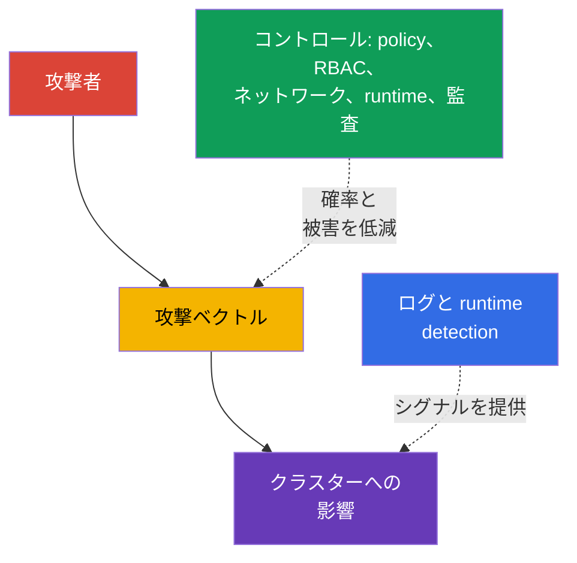
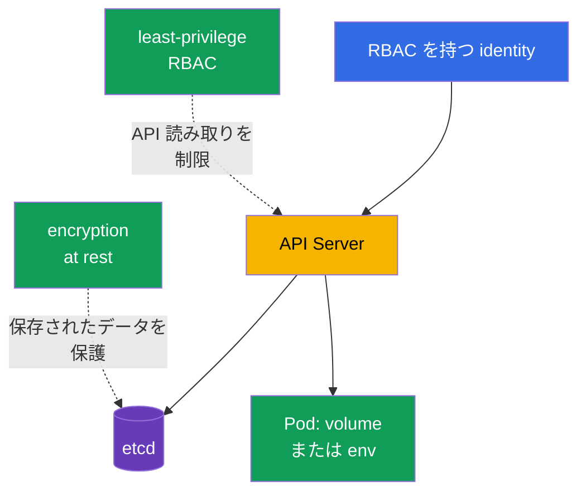

[Русская версия](ru.md) · [Eng version](README.md) · [Versión en español](es.md) · [Version française](fr.md) · [Deutsche Version](de.md) · [ქართული ვერსია](ge.md) · [繁體中文版](tw.md)

# 第16章. Kubernetes の脅威カテゴリ

> **次に進む内容。** 第15章では、信頼境界とデータフローを定義しました。次に、攻撃がこれらの境界をどのように利用するかを見ます。すなわち、クラスター内での永続化、リソース枯渇、悪意あるコードの実行、トラフィックの傍受、データ取得、特権昇格です。これは比重16%の KCSA **Kubernetes Threat Model** ドメインです。本コースの例は Kubernetes `v1.36` を対象にしています。

脅威モデルはすべてのリスクを取り除くとは約束しません。攻撃シナリオを観測可能な兆候と複数の独立したコントロールに結び付ける助けになります。1つのコントロールは失敗し得るため、Kubernetes はソースコードとイメージから `Pod`、API、ネットワーク、ワーカーノードまでを層で防御します。



## 16.1 Persistence: クラスター内での永続化

**シナリオ。** API またはワーカーノードへの一時的なアクセスを得た攻撃者は、最初の `Pod` が削除された後も存続し、クラスターへ戻る経路を維持しようとします。定期的にそのコードを実行する `CronJob` を作成したり、すべての新しい `Pod` にコンテナを追加するよう `MutatingAdmissionWebhook` を変更したり、kubelet が監視するディレクトリに static `Pod` を置いたり、長寿命トークンを盗んだりできます。

**どのように現れるか。** namespace に未知の `CronJob` が現れ、定期的に `Job` と `Pod` を作成します。admission 設定に未知の webhook が追加されます。API 経由で削除した static `Pod` を kubelet が再作成します。漏えいした `ServiceAccount` トークンまたは kubeconfig が、異常なネットワークから、または従業員の離職後に使用されます。すべての新規 `CronJob` や webhook が攻撃とは限らないため、兆候は所有者、change record、API 監査と突き合わせます。

**何で防ぐか。** RBAC を制限します。大半の identity に `CronJob` の作成、`MutatingWebhookConfiguration` の変更、`ServiceAccount` と `RoleBinding` の管理権限は不要です。ワーカーノードと static `Pod` のパスへのアクセスを制限し、kubelet とその認証情報を保護します。短寿命トークンを使用し、kubeconfig を無差別に配布せず、役割変更時にはアクセスを取り消します。Admission policy は不適切な webhook やイメージを拒否でき、audit log と runtime detection は予期しない workload の作成と実行の検出に役立ちます。

| 永続化ポイント | 最初のアクセス後も残る理由 | 主なコントロール |
|---|---|---|
| `CronJob` | controller がスケジュールに従って新しい `Job` を作成する | least-privilege RBAC、監査、namespace レビュー |
| mutating webhook | 該当するすべての新規オブジェクトに影響する | admission 権限の制限、設定検査、監査 |
| static `Pod` | kubelet がノード上で manifest をローカルに読み取る | ワーカーノードの hardening、kubelet パスの保護、監視 |
| トークンまたは kubeconfig | identity として API へ再アクセスできる | 短寿命トークン、ローテーション、RBAC、アクセス取り消し |

## 16.2 Denial of Service: リソース枯渇

**シナリオ。** アプリケーションの不具合、過度に積極的なクライアント、または意図的な攻撃者が、多数の `Pod` を作成し、CPU とメモリを消費し、ephemeral storage を埋め、大量の接続を開く、または API をリクエストで圧迫します。DoS の目的はデータ取得である必要はなく、サービスまたは control plane を利用不能にすれば十分です。

**どのように現れるか。** `Pod` は `OOMKilled` になり、リソース不足で `Pending` となり、ノードは `NotReady` へ移行し、API Server の遅延が増加し、正当なリクエストにエラーや timeout が返されます。1つの namespace に `Job` や `Pod` が雪崩のように出現することがあります。高負荷だけでは攻撃の証明にならないため、通常のトラフィック、制限値、deployment の履歴と比較します。

**何で防ぐか。** コンテナには `resources.requests` と `resources.limits` を設定します。requests はスケジューリングに参加し、limits は利用可能な CPU またはメモリを制限します。`ResourceQuota` は namespace の合計予算を定め、`LimitRange` はコンテナレベルの境界を設定または要求します。これらは単一 tenant の blast radius を縮小しますが、capacity planning、autoscaling、ネットワーク flood 対策、API クライアントの制御の代替ではありません。可観測性、飽和状態の alert、重要な workload の優先順位付けも別途重要です。

```yaml
apiVersion: v1
kind: ResourceQuota
metadata:
  name: team-budget
  namespace: team-a
spec:
  hard:
    requests.cpu: "4"
    requests.memory: 8Gi
    limits.cpu: "8"
    limits.memory: 16Gi
    pods: "20"
```

この短い例は namespace の合計予算を制限するもので、クラスター全体の可用性を保証するものではありません。個々のコンテナに requests と limits がなければ、予算はチームが期待する方法で適用されない可能性があります。

## 16.3 Malicious Code Execution と侵害されたアプリケーション

**シナリオ。** アプリケーションの脆弱性が remote code execution (RCE) につながる、開発者が悪意あるコードを含むイメージを実行する、または依存関係に既知の CVE が含まれます。コンテナ内のコードはマイナーをダウンロードし、reverse shell を開き、トークンを読み取り、`ServiceAccount` として API リクエストを送る可能性があります。

**どのように現れるか。** Runtime 検出器が application container 内の shell、package manager、予期しないコマンド、またはネットワーク接続を確認します。イメージスキャナは脆弱なライブラリを報告し、audit log はこの `ServiceAccount` による異常な API アクセスを示します。区別が重要です。検出された CVE はリスクを意味しますが、悪用を証明するものではありません。shell は認可済みのデバッグの場合もあります。プロセス、イメージ、`Pod`、identity、時刻の文脈に基づいて判断します。

**何で防ぐか。** 信頼できる最小イメージを使用し、その digest を固定して、CI でイメージと依存関係をスキャンし、SBOM を維持して脆弱なコンポーネントを迅速に更新します。イメージ署名と admission control は未検証アーティファクトの実行可能性を減らします。制限された `securityContext`、不要な `ServiceAccount` トークンの不使用、NetworkPolicy、non-root 実行は、RCE 後のコードの能力を低減します。Runtime detection、ログ、対応手順は、すでに実行された悪意あるコードの発見と封じ込めに役立ちます。

| コントロール | 機能する段階 | 代替しないもの |
|---|---|---|
| SCA と image scan | deployment 前および新しい CVE の出現時 | runtime での悪用の監視 |
| イメージ署名と admission | `Pod` 作成時 | アプリケーションロジックの安全性 |
| `securityContext` と最小権限 | プロセス起動後 | イメージの出所検証 |
| runtime detection | 実行中 | すべての危険な操作の阻止 |

## 16.4 Attacker on the Network: MITM とラテラルムーブメント

**シナリオ。** 攻撃者がクラスターのネットワーク内に足場を得るか、1つの `Pod` を侵害します。暗号化されていないトラフィックの傍受、適切な TLS 検証がない場合の endpoint のなりすまし、他のサービス、API、metadata endpoint へのアクセスを試みます。このようなサービス間の移動をラテラルムーブメントと呼びます。

**どのように現れるか。** 予期しない `Pod` が、その役割に不要なデータベース、内部 API、DNS 名への接続を開始します。ネットワーク可観測性は namespace 間の新しいフローを示します。TLS の問題ではクライアントに証明書検証エラーが表示されることがあり、安全でない設定ではなりすましに気付かないことさえあります。アプリケーションの目的を知らずにネットワークフローだけを見ても、常に悪意あるものとは言えないため、policy は必要な接続関係のインベントリから始めます。

**何で防ぐか。** `NetworkPolicy` は default-deny の原則を実装し、selector、ポート、プロトコルにより必要な ingress と egress フローだけを許可します。実際に適用するには、CNI が policy をサポートしている必要があります。mTLS はトラフィックを暗号化し双方の identity を確認するため、傍受となりすましのリスクを軽減します。service mesh は証明書の発行とローテーションを集中管理できます。証明書検証なしの TLS、ネットワーク制限なしの mTLS、identity 保護なしの NetworkPolicy は互いに同等ではありません。組み合わせることで攻撃経路を制限し、観測可能なネットワークシグナルを提供します。

## 16.5 Access to Sensitive Data: Secret、etcd、ボリューム

**シナリオ。** 攻撃者が `secrets` の `get`、`list`、`watch` 権限、etcd またはその backup へのアクセスを得る、ボリュームがマウントされたワーカーノードを侵害する、または環境変数やアプリケーションログから secret を読み取ります。`Secret` は機密データの受け渡しに便利ですが、その `data` フィールドの base64 は暗号化ではありません。

**どのように現れるか。** Audit log は `secrets` の大量読み取りを記録し、etcd snapshot が保護されていないストレージに存在し、プロセスが異常な volume パスを読み取る、またはアプリケーションが credential をログへ出力します。secret が Git、チケット、crash dump に現れます。実行中 workload による通常の secret 読み取りは想定されるため、調査では identity、namespace、オブジェクト数、時刻を考慮します。

**何で防ぐか。** RBAC は `Secret` へのアクセスを特定の identity と必要な動詞だけに付与します。広範な `list` と `watch` は特に危険です。Encryption at rest は、媒体の喪失やストレージへの直接アクセス時に etcd と backup 内のデータを保護しますが、API がすでに `get` を許可している主体からは保護しません。ボリュームの暗号化、backup の保護、マウントする secret 数の最小化、`ServiceAccount` の分離、ログの安全な取り扱いが影響を狭めます。特に機密性の高いデータでは、外部 secret manager と KMS がキー管理の別の制御面を提供します。



## 16.6 Privilege Escalation: コンテナからノードへ

**シナリオ。** すでにコンテナ内でコードを実行した攻撃者は、さらなる権限を得ようとします。`Pod` が `privileged: true` で実行される、機密性の高い `hostPath` をマウントする、不要な Linux capabilities を得る、`hostPID` または container runtime の socket へアクセスできる場合、リスクは高まります。kernel または runtime の脆弱性は container escape とワーカーノードへのアクセスにつながる可能性があります。

**どのように現れるか。** manifest に `privileged` コンテナ、`/` のような `hostPath`、`hostNetwork`、追加の capabilities、または無効化された seccomp が現れます。Runtime シグナルは mount、デバイスアクセス、host filesystem の読み取り、kernel 変更の試みを示すことがあります。ノード侵害後、攻撃者は多くの場合そのノード上の `Pod` の secret とトークンを得るため、この事象は高優先度です。

**何で防ぐか。** Pod Security Standards と Pod Security Admission は、`restricted` プロファイルで危険な設定を許可せず、共通の基本的な障壁を提供します。アプリケーションとの互換性がある場合は、`privileged`、`hostPath`、host namespaces、不要な capabilities を除去し、プロセスを non-root で実行して privilege escalation を禁止します。seccomp は許可する syscall の集合を縮小し、AppArmor は対応ノード上で profile によりプロセスの操作を制限します。これらの機構は互いを補完し、kernel の脆弱性そのものを修正するわけではありません。Admission policy、manifest レビュー、ワーカーノードの更新、runtime detection が残りの防御層を構成します。

| リスクのある設定 | 想定される影響 | 推奨コントロール |
|---|---|---|
| `privileged: true` | ホストのデバイスと機能への広範なアクセス | PSS/PSA、admission、必要な場合に限った明示的例外 |
| `hostPath` | ワーカーノードのファイルの読み取り/変更 | 通常の workloads では使用しない。PSS/PSA または admission policy で禁止または制限する。RBAC は別途、workload API オブジェクトを作成または変更できる主体を制限する。 |
| 不要な capability | アプリケーションの必要性を超えた kernel 操作 | capabilities を drop し、必要なものだけを追加 |
| `hostPID` または runtime socket | ホストプロセスへのアクセスまたはコンテナの管理 | host namespaces と socket へのアクセスを禁止 |
| seccomp/AppArmor がない | 悪用後の障壁が少ない | `RuntimeDefault` seccomp、対応環境では AppArmor profile |

## 16.7 実践での適用方法

ツールの一覧から始めるのではなく、重要な資産と許容される操作から始めます。各 namespace について、どのイメージが許可されるか、どのサービスが接続すべきか、どの secret が必要か、どのリソース予算が許容されるか、誰が RBAC、admission、scheduled workload を変更できるかに答えることが有用です。

実践的な順序は次のようになります。

1. 基本的な予防コントロールを有効化する: least-privilege RBAC、PSA、requests/limits、`ResourceQuota`、イメージ検証、および CNI がサポートする場所での NetworkPolicy。
2. データと identities を保護する: 機密リソースに encryption at rest を有効化し、`ServiceAccount` を分離し、短寿命トークンを使用し、backup とワーカーノードを保護する。
3. 変更を観測可能にする: API の audit events、CNI または service mesh のログ、runtime シグナルを収集する。alert の担当者と手順を定める: 文脈を確認し、workload を隔離し、credential を取り消し、証拠を保存する。
4. 例外を定期的に見直す。`privileged` `Pod`、`hostPath`、広範な role、開放された egress、webhook には根拠、所有者、見直し期限が必要です。

これはコマンドのラボ手順ではなく、脅威モデルをプラットフォームとアプリケーションチームにとって理解しやすい要件に変える方法です。

## 16.8 Exam vocabulary / ミニ用語集

| 用語 | 意味 |
|---|---|
| persistence | 最初の侵入点が削除された後も攻撃者がアクセスを維持する能力 |
| DoS | リソース枯渇または過負荷によるサービス拒否 |
| RCE | remote code execution、脆弱性を介したリモートでのコード実行 |
| lateral movement | 攻撃者があるシステムまたは workload から別のものへ移動すること |
| MITM | man-in-the-middle、ネットワーク通信の傍受またはなりすまし |
| blast radius | 1つのコンポーネントの侵害時に及ぶ影響範囲 |
| container escape | コンテナの隔離からワーカーノードのリソースへのプロセスの脱出 |
| mTLS | 相互 TLS: 双方がチャネルを暗号化し、互いの identity を検証する |

## 16.9 Exam Essentials / 章の要点

- KCSA の6つの脅威カテゴリは、永続化、可用性の妨害、コード実行、ネットワーク攻撃、データ取得、特権拡大という異なる攻撃者の目的を説明します。
- 1つの症状だけでは incident ではありません。identity、Kubernetes オブジェクト、時刻、期待される挙動、audit/runtime 可観測性データと結び付けます。
- `ResourceQuota` と limits は DoS の被害を制限しますが、capacity planning と可観測性の代替ではありません。
- 署名、スキャン、admission は悪意あるアーティファクトのリスクを低減します。起動後の挙動には runtime detection が必要です。
- `NetworkPolicy` は許可されるフローを制限し、mTLS はその機密性と identity を保護します。2つのコントロールが異なる理由で必要です。
- Base64 は `Secret` を暗号化しません。RBAC、encryption at rest、ノードとボリュームの保護はデータへの異なる経路を防ぎます。
- PSS/PSA、seccomp、AppArmor、最小 privileges は、特権昇格と escape に対する複数の障壁を形成します。

## 16.10 混同しやすい点と試験での出題

KCSA の問題は通常、症状を説明して**最も直接的な**コントロールの選択を求めます。1つの namespace 内の多数の `Pod` が予算を使い果たしているなら、NetworkPolicy ではなく limits と `ResourceQuota` を探します。サービス間の移動を禁止する必要があるなら `NetworkPolicy` を選び、サービスの暗号化と相互検証が問われているなら mTLS を選びます。

よくある落とし穴は次のとおりです。base64 の `Secret` は暗号化されていません。encryption at rest は `get secrets` の権限を取り消しません。イメージスキャンはすでに実行されたコマンドを検出しません。audit log は Kubernetes API 呼び出しを示すもので、コンテナ内のすべての syscall を示すわけではありません。`privileged` `Pod` の最良の答えは通常は予防であり、必要なく特権を与えず、起動後の検出だけに頼らず admission/PSS を適用することです。

## 16.11 自己確認問題

### 1. 1つの namespace の `Pod` 合計数とリソース予算を最も直接的に制限するコントロールはどれですか?

   - a. `ResourceQuota`

   - b. `NetworkPolicy`

   - c. `MutatingAdmissionWebhook`

   - d. mTLS

<details>
<summary>回答と解説</summary>

**正解: a. `ResourceQuota`.** これは、たとえば CPU、メモリ、`Pod` 数について namespace の合計 hard limits を定めます。`NetworkPolicy` はネットワークフローを制御し、mTLS は接続を保護しますが、リソース消費を制限しません。

</details>

### 2. `Secret` の encryption at rest に関する正しい記述はどれですか?

   - a. RBAC が `get secrets` を許可する主体であっても、API 経由の `Secret` 読み取りを禁止する。

   - b. `Pod` へのマウント後だけ `Secret` を保護し、ワーカーノードの保護を置き換える。

   - c. base64 を暗号学的な暗号化にし、キー管理の必要性をなくす。

   - d. etcd/backup 内の保存データを保護するが、許可された API アクセスに対する RBAC を置き換えない。

<details>
<summary>回答と解説</summary>

**正解: d.** Encryption at rest は、たとえば etcd snapshot の盗難時に保存データを保護します。API による読み取り権限を持つ主体は復号済みオブジェクトを得るため、least-privilege RBAC は依然として必須です。

</details>

### 3. 侵害された `Pod` で、他チームのサービスへの接続が確認されました。このようなラテラルムーブメントの可能性をまず低減するコントロールはどれですか?

   - a. 必要な workload paths に対する最小限の ingress/egress allow rules を持つ default-deny NetworkPolicy。
   - b. namespace 内の CPU、memory、object counts の合計を制限する ResourceQuota。
   - c. 負荷増加時にアプリケーションの replicas 数を増やす Horizontal scaling。
   - d. 値をアプリケーションへ渡す前に Secret data を Base64 エンコードすること。

<details>
<summary>回答と解説</summary>

**正解: a.** CNI がサポートする場合、NetworkPolicy は workload のネットワーク経路を必要な方向だけに制限でき、ラテラルムーブメントの可能性を低減します。Quota は availability を保護し、scaling は capacity を変え、base64 はネットワークコントロールではありません。

</details>

### 4. Kubernetes における persistence を最もよく表す例はどれですか?

   - a. コンテナが memory limit に達して `OOMKilled` で終了した。

   - b. スキャナがイメージ内の脆弱なライブラリを見つけた。

   - c. クライアントが TLS の証明書検証に失敗した。

   - d. 攻撃者が定期的に新しい `Pod` を作成する `CronJob` を作成した。

<details>
<summary>回答と解説</summary>

**正解: d.** `CronJob` は個々の `Pod` の終了後も残り、スケジュールに従ってコードを再実行します。他の選択肢は可用性、脆弱性、または通信チャネルの保護に関するものです。

</details>

### 5. container escape と特権昇格のリスクを最もよく低減する対策の組み合わせはどれですか?

   - a. コンテナを `privileged` のままにするが、audit logging、resource limits、immutable digest によるイメージ実行だけを追加する。

   - b. 不要な capabilities と host access を削除し、PSS/PSA、seccomp、対応環境では AppArmor を適用する。

   - c. 広範な Linux capabilities を維持するが、`Secret` に encryption at rest を有効化し、イメージ署名の検証を必須にする。

   - d. `hostPath` と runtime socket を許可するが、`NetworkPolicy` で外部 egress を制限し、mTLS を使用する。

<details>
<summary>回答と解説</summary>

**正解: b.** escape と privilege escalation のリスクを低減するには、まず kernel とノードの機能に対するコンテナアクセスを縮小します。不要な capabilities と host-level access を除去し、PSS/PSA で危険な Pod 設定を制限し、対応する場所で seccomp/AppArmor を適用します。

Audit logging、immutable images、encryption at rest、signature verification、`NetworkPolicy`、mTLS は他の防御層には有用ですが、`privileged`、広範な capabilities、`hostPath`、runtime socket へのアクセスを補うものではありません。

</details>

> **次へ。** runtime と `securityContext` の実践的な防御には、CKS の第16-19章と第22章を使用してください。runtime detection、調査、関連シグナルには、CKS の第29-31章を使用してください。

[目次](../README_JP.md) · [第15章](../15/jp.md) · [第17章](../17/jp.md)