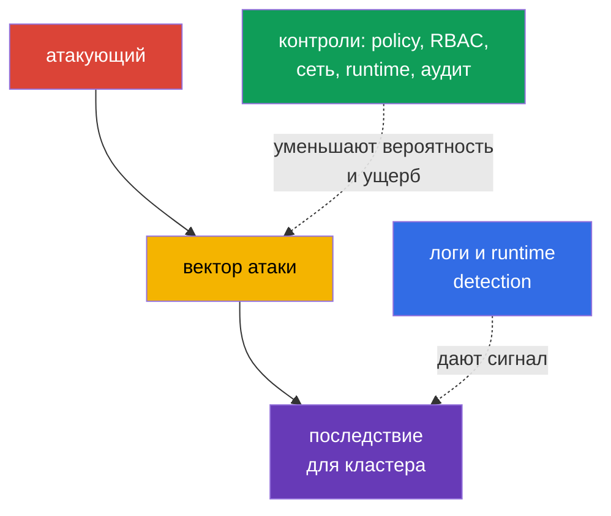
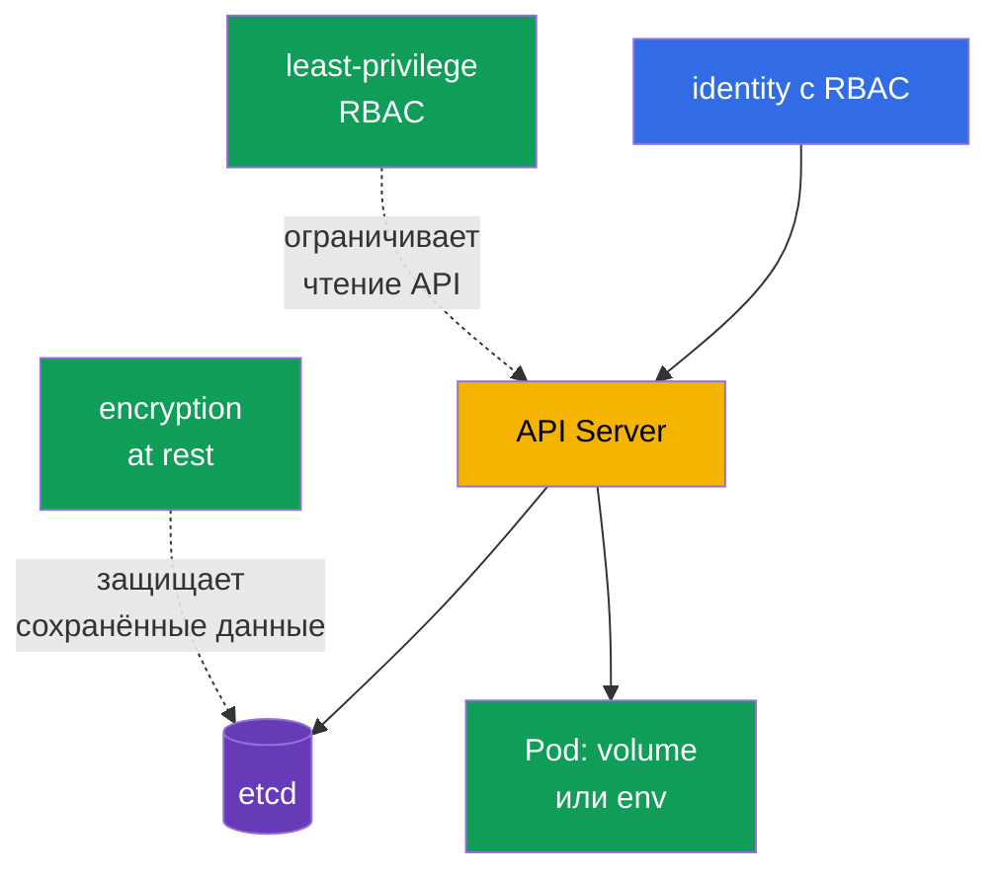

> **Язык:** русский. Переводы будут добавлены после публикации соответствующих файлов.

# Глава 16. Категории угроз Kubernetes

> **Что дальше.** В главе 15 мы определили границы доверия и потоки данных. Теперь рассмотрим, как атаки используют эти границы: закрепляются в кластере, истощают ресурсы, выполняют вредоносный код, перехватывают трафик, получают данные или повышают привилегии. Это домен KCSA **Kubernetes Threat Model** с весом 16%. Примеры в курсе ориентированы на Kubernetes `v1.36`.

Модель угроз не обещает устранить весь риск. Она помогает связать сценарий атаки с наблюдаемым проявлением и несколькими независимыми контролями. Один контроль может дать сбой, поэтому Kubernetes защищают слоями: от исходного кода и образа до `Pod`, API, сети и рабочего узла.



## 16.1 Persistence: закрепление в кластере

**Сценарий.** Атакующий с временным доступом к API или к рабочему узлу хочет пережить удаление первоначального `Pod` и сохранить путь обратно в кластер. Он может создать `CronJob`, который периодически запускает его код, изменить `MutatingAdmissionWebhook`, чтобы добавлять контейнер во все новые `Pod`, разместить static `Pod` в каталоге, который наблюдает kubelet, или украсть долгоживущий токен.

**Как проявляется.** В namespace появляется незнакомый `CronJob`, периодически создающий `Job` и `Pod`; в конфигурации admission появляется неизвестный webhook; kubelet снова создаёт static `Pod` после его удаления через API. Утраченный токен `ServiceAccount` или kubeconfig используется из необычной сети либо после ухода сотрудника. Не каждый новый `CronJob` или webhook является атакой, поэтому сигнал сопоставляют с владельцем, change record и аудитом API.

**Чем закрывается.** Ограничивайте RBAC: большинству идентичностей не нужны права создавать `CronJob`, менять `MutatingWebhookConfiguration` или управлять `ServiceAccount` и `RoleBinding`. Ограничивайте доступ к рабочему узлу и путям static `Pod`; защищайте kubelet и его учётные данные. Используйте короткоживущие токены, не раздавайте kubeconfig и отзывайте доступ при смене роли. Admission policy может запретить неподходящие webhook или образы, а audit log и runtime detection помогают заметить создание и выполнение неожиданной рабочей нагрузки.

| Точка закрепления | Почему переживает исходный доступ | Основные контроли |
|---|---|---|
| `CronJob` | controller создаёт новые `Job` по расписанию | least-privilege RBAC, audit, ревью namespace |
| mutating webhook | влияет на каждый подходящий новый объект | ограничение прав на admission, проверка конфигурации, аудит |
| static `Pod` | kubelet читает manifest локально на узле | hardening рабочего узла, защита путей kubelet, мониторинг |
| токен или kubeconfig | даёт повторный доступ к API от имени identity | короткоживущие токены, ротация, RBAC, отзыв доступа |

## 16.2 Denial of Service: исчерпание ресурсов

**Сценарий.** Ошибка приложения, слишком агрессивный клиент или намеренный злоумышленник создаёт много `Pod`, потребляет CPU и память, заполняет ephemeral storage, открывает множество соединений либо заваливает API запросами. Цель DoS не обязательно получить данные: достаточно сделать сервис или control plane недоступным.

**Как проявляется.** `Pod` получают `OOMKilled`, становятся `Pending` из-за нехватки ресурсов, узлы переходят в `NotReady`, растёт задержка API Server, а легитимные запросы получают ошибки или timeout. В одном namespace может появиться лавина `Job` или `Pod`. Высокая нагрузка сама по себе не доказывает атаку: её сравнивают с обычным трафиком, лимитами и историей deployment.

**Чем закрывается.** Для контейнеров задают `resources.requests` и `resources.limits`: requests участвуют в планировании, limits ограничивают доступное CPU или память. `ResourceQuota` задаёт суммарный бюджет namespace, а `LimitRange` задаёт или требует границы на уровне контейнера. Они уменьшают blast radius одного tenant, но не заменяют capacity planning, autoscaling, защиту от сетевого flood и контроль API-клиентов. Отдельно важны наблюдаемость, alert на насыщение и приоритизация критичных рабочих нагрузок.

```yaml
apiVersion: v1
kind: ResourceQuota
metadata:
  name: team-budget
  namespace: team-a
spec:
  hard:
    requests.cpu: "4"
    requests.memory: 8Gi
    limits.cpu: "8"
    limits.memory: 16Gi
    pods: "20"
```

Этот короткий пример ограничивает совокупный бюджет namespace, а не гарантирует доступность всего кластера. Без requests и limits для отдельных контейнеров бюджет может применяться не так, как ожидает команда.

## 16.3 Malicious Code Execution и скомпрометированные приложения

**Сценарий.** Уязвимость приложения приводит к remote code execution (RCE), разработчик запускает образ с вредоносным кодом или зависимость содержит известную CVE. Код в контейнере может скачать майнер, открыть reverse shell, читать токены и делать запросы к API от имени `ServiceAccount`.

**Как проявляется.** Runtime-детектор видит shell, package manager, неожиданную команду или сетевое соединение в application container. Сканер образа сообщает уязвимую библиотеку, а audit log показывает необычные обращения этой `ServiceAccount` к API. Важно различать: найденная CVE означает риск, но не доказывает эксплуатацию; shell может быть санкционированной отладкой. Решение принимают по контексту процесса, образа, `Pod`, identity и времени.

**Чем закрывается.** Используйте доверенные минимальные образы, фиксируйте их digest, сканируйте образы и зависимости в CI, ведите SBOM и оперативно обновляйте уязвимые компоненты. Подпись образа и admission control уменьшают вероятность запуска непроверенного артефакта. Ограниченный `securityContext`, отказ от лишних токенов `ServiceAccount`, NetworkPolicy и non-root запуск уменьшают возможности кода после RCE. Runtime detection, логи и процедура реагирования помогают обнаружить и сдержать уже запущенный вредоносный код.

| Контроль | На каком этапе работает | Что не заменяет |
|---|---|---|
| SCA и image scan | до deployment и при появлении новой CVE | наблюдение за эксплуатацией в runtime |
| подпись образа и admission | при создании `Pod` | безопасность логики приложения |
| `securityContext` и минимальные права | после запуска процесса | проверку происхождения образа |
| runtime detection | во время выполнения | блокирование всех опасных действий |

## 16.4 Attacker on the Network: MITM и латеральное движение

**Сценарий.** Атакующий получает точку в сети кластера или компрометирует один `Pod`. Он пытается перехватить незашифрованный трафик, подменить endpoint при отсутствии корректной проверки TLS либо обратиться к другим сервисам, API и metadata endpoint. Такое перемещение между сервисами называют латеральным движением.

**Как проявляется.** Неожиданный `Pod` начинает соединяться с базой данных, внутренним API или DNS-именами, которые не нужны его роли. Наблюдаемость сети показывает новые потоки между namespace. При проблемах TLS клиент может видеть ошибку проверки сертификата, а при небезопасной настройке - вообще не заметить подмену. Сетевой поток без знания назначения приложения не всегда вредоносен, поэтому политика начинается с инвентаризации необходимых связей.

**Чем закрывается.** `NetworkPolicy` реализует принцип default-deny и разрешает только нужные ingress и egress потоки по selector, порту и протоколу. Для её реального применения CNI должен поддерживать policy. mTLS шифрует трафик и подтверждает identity обеих сторон, что уменьшает риск перехвата и подмены; service mesh может централизованно выдавать и ротировать сертификаты. TLS без проверки сертификата, mTLS без ограничений сети и NetworkPolicy без защиты identity не равнозначны друг другу. В совокупности они ограничивают путь атаки и дают наблюдаемые сетевые сигналы.

## 16.5 Access to Sensitive Data: секреты, etcd и тома

**Сценарий.** Атакующий получает право `get`, `list` или `watch` для `secrets`, доступ к etcd или его backup, захватывает рабочий узел с примонтированными томами либо читает секрет из переменной окружения и логов приложения. `Secret` удобен для передачи чувствительных данных, но base64 в его поле `data` не является шифрованием.

**Как проявляется.** Audit log фиксирует массовое чтение `secrets`, snapshot etcd оказывается вне защищённого хранилища, процесс читает необычный путь volume или приложение печатает credential в лог. Секреты появляются в Git, тикете или crash dump. Обычное чтение секрета работающей нагрузкой ожидаемо, поэтому расследование учитывает identity, namespace, количество объектов и время.

**Чем закрывается.** RBAC выдаёт доступ к `Secret` конкретным identity и только нужными глаголами; особенно опасны широкие `list` и `watch`. Encryption at rest защищает данные в etcd и backup при потере носителя или прямом доступе к хранилищу, но не защищает от субъекта, которому API уже разрешает `get`. Шифрование томов, защита backup, минимизация числа монтируемых секретов, разделение `ServiceAccount` и безопасная работа с логами сужают последствия. Для особо чувствительных данных внешние secret manager и KMS дают отдельный контур управления ключами.



## 16.6 Privilege Escalation: от контейнера к узлу

**Сценарий.** Атакующий, уже выполнивший код в контейнере, пытается получить больше прав. Риск растёт, если `Pod` запущен с `privileged: true`, монтирует чувствительный `hostPath`, получает лишние Linux capabilities, использует `hostPID` или доступ к socket container runtime. Уязвимость kernel или runtime может привести к container escape и доступу к рабочему узлу.

**Как проявляется.** В manifest появляются `privileged` контейнеры, `hostPath` вроде `/`, `hostNetwork`, дополнительные capabilities или отключённый seccomp. Runtime-сигнал может показать mount, доступ к устройству, чтение host filesystem либо попытку изменить kernel. После компрометации узла атакующий часто получает секреты и токены `Pod` на нём, поэтому это событие имеет высокий приоритет.

**Чем закрывается.** Pod Security Standards и Pod Security Admission не допускают опасные настройки в профиле `restricted` и дают базовый общий барьер. Убирайте `privileged`, `hostPath`, host namespaces и лишние capabilities, запускайте процесс non-root и запрещайте privilege escalation, если это совместимо с приложением. seccomp сокращает набор допустимых syscall, а AppArmor ограничивает действия процесса по profile на поддерживаемых узлах. Эти механизмы дополняют друг друга и не исправляют уязвимость ядра сами по себе. Admission policy, ревью manifest, обновление рабочего узла и runtime detection составляют остальные слои защиты.

| Рискованная настройка | Возможное последствие | Предпочтительный контроль |
|---|---|---|
| `privileged: true` | широкий доступ к устройствам и возможностям хоста | PSS/PSA, admission, явное исключение только при необходимости |
| `hostPath` | чтение/изменение файлов рабочего узла | не использовать для обычных workloads; запрещать или ограничивать через PSS/PSA либо admission policy; RBAC отдельно ограничивает, кто может создавать или изменять workload API-объекты. |
| лишняя capability | действие ядра сверх нужд приложения | drop capabilities, добавить только необходимую |
| `hostPID` или runtime socket | доступ к процессам хоста или управление контейнерами | запретить host namespaces и доступ к socket |
| отсутствующий seccomp/AppArmor | меньше барьеров после эксплуатации | `RuntimeDefault` seccomp, profile AppArmor где поддерживается |

## 16.7 Как это применяют на практике

Начинайте не со списка инструментов, а с критичных активов и допустимых действий. Для каждого namespace полезно ответить: какие образы разрешены, какие сервисы должны связываться, какие секреты нужны, какой ресурсный бюджет допустим и кому разрешено менять RBAC, admission и scheduled workload.

Практический порядок может выглядеть так:

1. Включить базовые профилактические контроли: least-privilege RBAC, PSA, requests/limits, `ResourceQuota`, проверку образов и NetworkPolicy там, где это поддерживает CNI.
2. Защитить данные и identities: включить encryption at rest для чувствительных ресурсов, разделить `ServiceAccount`, использовать короткоживущие токены, защищать backup и рабочие узлы.
3. Сделать изменения наблюдаемыми: собирать audit events для API, логи CNI или service mesh и runtime-сигналы. Назначить владельца alert и процедуру: проверить контекст, изолировать рабочую нагрузку, отозвать credential, сохранить доказательства.
4. Регулярно пересматривать исключения. `privileged` `Pod`, `hostPath`, широкая роль, открытый egress или webhook должны иметь обоснование, владельца и срок пересмотра.

Это не лабораторная последовательность команд, а способ превратить модель угроз в понятные требования платформы и команды приложения.

## 16.8 Exam vocabulary / Мини-глоссарий

| Термин | Значение |
|---|---|
| persistence | способность атакующего сохранить доступ после удаления первоначальной точки входа |
| DoS | отказ в обслуживании из-за истощения ресурсов или перегрузки |
| RCE | remote code execution, выполнение кода через уязвимость удалённо |
| lateral movement | переход атакующего от одной системы или рабочей нагрузки к другой |
| MITM | man-in-the-middle, перехват или подмена сетевого обмена |
| blast radius | масштаб последствий при компрометации одного компонента |
| container escape | выход процесса из изоляции контейнера к ресурсам рабочего узла |
| mTLS | взаимный TLS: стороны одновременно шифруют канал и проверяют identity друг друга |

## 16.9 Exam Essentials / Итоги главы

- Шесть категорий угроз KCSA описывают разные цели атакующего: закрепиться, нарушить доступность, выполнить код, атаковать сеть, получить данные или расширить привилегии.
- Один симптом не равен инциденту. Его связывают с identity, объектом Kubernetes, временем, ожидаемым поведением и данными audit/runtime-наблюдаемости.
- `ResourceQuota` и limits ограничивают ущерб DoS, но не заменяют планирование ёмкости и наблюдаемость.
- Подпись, сканирование и admission уменьшают риск вредоносного артефакта; runtime detection нужен для поведения после запуска.
- `NetworkPolicy` ограничивает разрешённые потоки, а mTLS защищает их конфиденциальность и identity. Оба контроля нужны по разным причинам.
- Base64 не шифрует `Secret`; RBAC, encryption at rest, защита узлов и томов закрывают разные пути к данным.
- PSS/PSA, seccomp, AppArmor и минимальные privileges образуют несколько барьеров против повышения привилегий и escape.

## 16.10 Не путать и как это встречается на экзамене

Вопрос KCSA обычно описывает симптом и просит выбрать **наиболее прямой** контроль. Если много `Pod` в одном namespace исчерпывают бюджет, ищите limits и `ResourceQuota`, а не NetworkPolicy. Если нужно запретить перемещение между сервисами, выбирайте `NetworkPolicy`; если вопрос о шифровании и взаимной проверке сервиса, выбирайте mTLS.

Частые ловушки: `Secret` с base64 не зашифрован; encryption at rest не отменяет право `get secrets`; сканирование образа не обнаруживает уже выполненную команду; audit log рассказывает о вызове Kubernetes API, а не обо всех syscall в контейнере. Для `privileged` `Pod` лучший ответ обычно профилактический: не давать привилегию без необходимости и применять admission/PSS, а не рассчитывать только на обнаружение после запуска.

## 16.11 Вопросы для самопроверки

### 1. Какой контроль наиболее прямо ограничит совокупное число `Pod` и ресурсный бюджет одного namespace?

   - a. `ResourceQuota`

   - b. `NetworkPolicy`

   - c. `MutatingAdmissionWebhook`

   - d. mTLS

<details>
<summary>Ответ и разбор</summary>

**Верный ответ: a. `ResourceQuota`.** Она задаёт суммарные hard limits namespace, например по CPU, памяти и числу `Pod`. `NetworkPolicy` регулирует сетевые потоки, а mTLS защищает соединение, но не ограничивают расход ресурсов.

</details>

### 2. Какое утверждение об encryption at rest для `Secret` верно?

   - a. Оно запрещает чтение `Secret` через API даже субъекту, которому RBAC разрешает `get secrets`.

   - b. Оно защищает `Secret` только после монтирования в `Pod` и заменяет защиту рабочего узла.

   - c. Оно делает base64 криптографическим шифрованием и поэтому устраняет необходимость управлять ключами.

   - d. Оно защищает сохранённые данные в etcd/backup, но не отменяет RBAC для разрешённого API-доступа.

<details>
<summary>Ответ и разбор</summary>

**Верный ответ: d.** Encryption at rest защищает сохранённые данные, например при краже snapshot etcd. Субъект с разрешением API на чтение получит расшифрованный объект, поэтому least-privilege RBAC остаётся обязательным.

</details>

### 3. В скомпрометированном `Pod` замечены соединения к сервисам других команд. Какой контроль прежде всего уменьшает возможность такого латерального движения?

   - a. Default-deny NetworkPolicy с минимальными ingress/egress allow rules для необходимых workload paths.
   - b. ResourceQuota, ограничивающая суммарные CPU, memory и object counts внутри namespace.
   - c. Horizontal scaling, увеличивающий число replicas приложения при росте нагрузки.
   - d. Base64-кодирование Secret data перед передачей значения приложению.

<details>
<summary>Ответ и разбор</summary>

**Верный ответ: a.** При поддержке CNI NetworkPolicy позволяет ограничить сетевые пути workload только необходимыми направлениями и тем самым уменьшить возможности латерального движения. Quota защищает availability, scaling меняет capacity, а base64 не является сетевым контролем.

</details>

### 4. Какой пример лучше всего описывает persistence в Kubernetes?

   - a. Контейнер достиг memory limit и был завершён с `OOMKilled`.

   - b. Сканер нашёл уязвимую библиотеку в образе.

   - c. Клиент не прошёл проверку сертификата TLS.

   - d. Атакующий создал `CronJob`, который регулярно создаёт новый `Pod`.

<details>
<summary>Ответ и разбор</summary>

**Верный ответ: d.** `CronJob` переживает завершение отдельного `Pod` и снова запускает код по расписанию. Остальные варианты относятся к доступности, уязвимости или защите канала.

</details>

### 5. Какой набор мер лучше снижает риск container escape и повышения привилегий?

   - a. Оставить контейнер `privileged`, но добавить audit logging, resource limits и запуск образа только по immutable digest.

   - b. Убрать лишние capabilities и host access, применять PSS/PSA, seccomp и AppArmor там, где он поддерживается.

   - c. Сохранить широкие Linux capabilities, но включить encryption at rest для `Secret` и обязательную проверку подписи образа.

   - d. Разрешить `hostPath` и runtime socket, но ограничить внешний egress через `NetworkPolicy` и использовать mTLS.

<details>
<summary>Ответ и разбор</summary>

**Верный ответ: b.** Для уменьшения риска escape и privilege escalation прежде всего сокращают доступ контейнера к возможностям ядра и узла: убирают ненужные capabilities и host-level access, ограничивают опасные Pod-настройки через PSS/PSA и применяют seccomp/AppArmor там, где они поддерживаются.

Audit logging, immutable images, encryption at rest, signature verification, `NetworkPolicy` и mTLS полезны для других слоёв защиты, но не компенсируют `privileged`, широкие capabilities, `hostPath` или доступ к runtime socket.

</details>

> **Куда дальше.** Для практической защиты runtime и `securityContext` используйте главы 16-19 и 22 CKS. Для runtime detection, расследования и связанных сигналов используйте главы 29-31 CKS.

[Оглавление](../README_RU.md) · [Глава 15](../15/ru.md) · [Глава 17](../17/ru.md)
