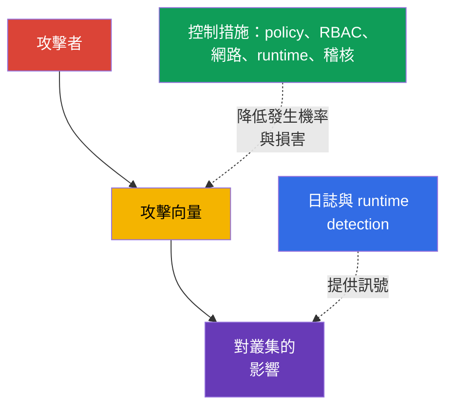
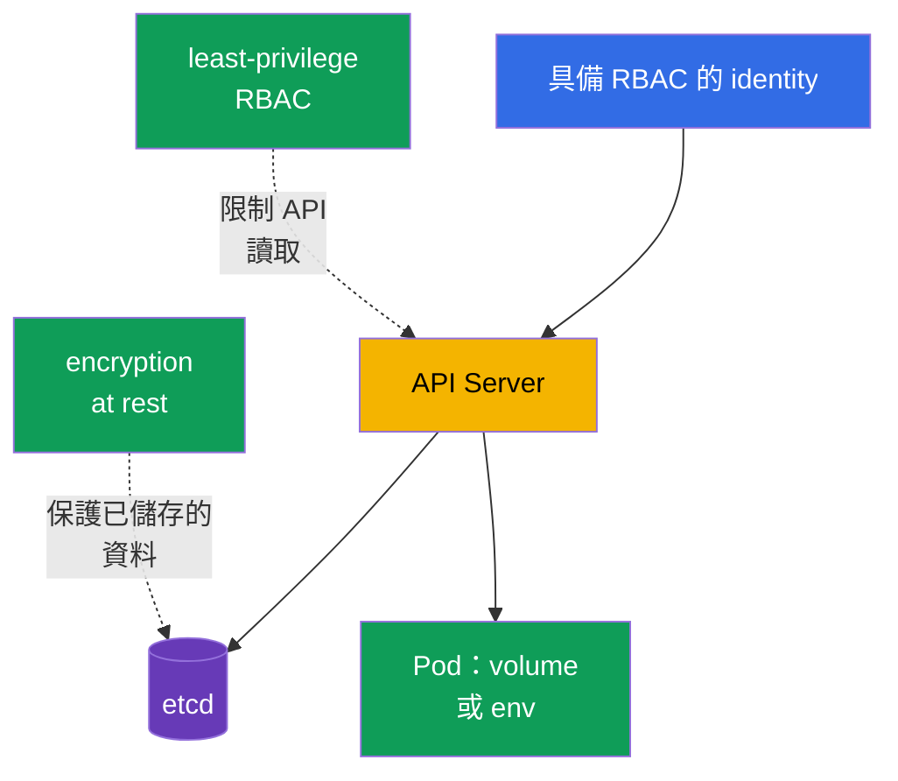

[Русская версия](ru.md) · [Eng version](README.md) · [Versión en español](es.md) · [Version française](fr.md) · [Deutsche Version](de.md) · [ქართული ვერსია](ge.md) · [日本語版](jp.md)

# 第 16 章。Kubernetes 威脅類別

> **接下來。** 在第 15 章中，我們定義了信任邊界與資料流。現在來看看攻擊如何利用這些邊界：在叢集中持續存在、耗盡資源、執行惡意程式碼、攔截流量、取得資料或提升權限。這是 KCSA **Kubernetes Threat Model** 領域，權重為 16%。課程中的範例以 Kubernetes `v1.36` 為準。

威脅模型並不承諾消除所有風險。它協助將攻擊情境連結到可觀察的徵象和多個獨立控制措施。一項控制可能失效，因此 Kubernetes 以多層方式保護：從原始程式碼與映像檔，到 `Pod`、API、網路與工作節點。



## 16.1 Persistence：在叢集中持續存在

**情境。** 取得 API 或工作節點暫時存取權的攻擊者，希望在初始 `Pod` 被刪除後仍能存活，並保留回到叢集的途徑。他可能建立定期執行其程式碼的 `CronJob`、修改 `MutatingAdmissionWebhook` 以在所有新的 `Pod` 中加入容器、將 static `Pod` 放入 kubelet 監看的目錄，或竊取長期有效的權杖。

**如何呈現。** namespace 中出現不熟悉的 `CronJob`，定期建立 `Job` 與 `Pod`；admission 設定中出現未知的 webhook；透過 API 刪除後，kubelet 再次建立 static `Pod`。遺失的 `ServiceAccount` 權杖或 kubeconfig 從不尋常的網路使用，或在員工離職後仍被使用。並非每個新的 `CronJob` 或 webhook 都是攻擊，因此應將訊號與擁有者、變更紀錄及 API 稽核相互比對。

**如何防護。** 限制 RBAC：大多數 identity 不需要建立 `CronJob`、變更 `MutatingWebhookConfiguration`，或管理 `ServiceAccount` 與 `RoleBinding` 的權限。限制工作節點與 static `Pod` 路徑的存取，保護 kubelet 及其憑證。使用短期權杖，不要散發 kubeconfig，並在角色變更時撤銷存取權。Admission policy 可拒絕不合適的 webhook 或映像檔，而 audit log 與 runtime detection 有助於發現非預期 workload 的建立及執行。

| 持續存在位置 | 為何能在初始存取後存活 | 主要控制措施 |
|---|---|---|
| `CronJob` | controller 依排程建立新的 `Job` | least-privilege RBAC、audit、namespace 審查 |
| mutating webhook | 影響每個符合條件的新物件 | 限制 admission 權限、設定檢查、audit |
| static `Pod` | kubelet 從節點本機讀取 manifest | 工作節點 hardening、保護 kubelet 路徑、監控 |
| 權杖或 kubeconfig | 以 identity 身分提供再次存取 API 的能力 | 短期權杖、輪替、RBAC、撤銷存取權 |

## 16.2 Denial of Service：資源耗盡

**情境。** 應用程式錯誤、過度積極的用戶端或蓄意的攻擊者建立大量 `Pod`、消耗 CPU 與記憶體、填滿 ephemeral storage、開啟大量連線，或以請求淹沒 API。DoS 的目標不一定是取得資料：讓服務或 control plane 無法使用就足夠了。

**如何呈現。** `Pod` 出現 `OOMKilled`、因資源不足而變為 `Pending`、節點轉為 `NotReady`、API Server 延遲增加，而合法請求收到錯誤或 timeout。單一 namespace 中可能出現大量 `Job` 或 `Pod`。高負載本身不能證明有攻擊：應與正常流量、限制及 deployment 歷史比較。

**如何防護。** 為容器設定 `resources.requests` 與 `resources.limits`：requests 參與排程，limits 限制可用 CPU 或記憶體。`ResourceQuota` 設定 namespace 的總預算，而 `LimitRange` 在容器層級設定或要求界限。它們可縮小單一 tenant 的 blast radius，但不能取代 capacity planning、autoscaling、對網路 flood 的防護與 API 用戶端控制。可觀測性、飽和度 alert 與關鍵 workload 的優先順序同樣重要。

```yaml
apiVersion: v1
kind: ResourceQuota
metadata:
  name: team-budget
  namespace: team-a
spec:
  hard:
    requests.cpu: "4"
    requests.memory: 8Gi
    limits.cpu: "8"
    limits.memory: 16Gi
    pods: "20"
```

這個簡短範例限制的是 namespace 的總預算，並不保證整個叢集可用。若個別容器沒有 requests 與 limits，預算的套用方式可能與團隊預期不同。

## 16.3 Malicious Code Execution 與遭入侵的應用程式

**情境。** 應用程式漏洞導致 remote code execution (RCE)、開發者執行含有惡意程式碼的映像檔，或相依套件包含已知 CVE。容器中的程式碼可能下載挖礦程式、開啟 reverse shell、讀取權杖，並以 `ServiceAccount` 身分對 API 提出請求。

**如何呈現。** Runtime 偵測器在 application container 中看到 shell、package manager、非預期命令或網路連線。映像檔掃描器報告有漏洞的程式庫，而 audit log 顯示此 `ServiceAccount` 對 API 的異常存取。必須區分：發現 CVE 表示存在風險，但無法證明已遭利用；shell 可能是經核准的除錯。應依程序、映像檔、`Pod`、identity 與時間的脈絡作出判斷。

**如何防護。** 使用可信任的最小映像檔、固定其 digest、在 CI 中掃描映像檔與相依套件、維護 SBOM，並迅速更新有漏洞的元件。映像檔簽署與 admission control 可降低執行未經驗證成品的機率。受限的 `securityContext`、不提供多餘的 `ServiceAccount` 權杖、NetworkPolicy 與 non-root 執行，可降低 RCE 後程式碼的能力。Runtime detection、日誌與應變程序有助於發現並遏制已執行的惡意程式碼。

| 控制措施 | 在哪個階段運作 | 無法取代的項目 |
|---|---|---|
| SCA 與 image scan | deployment 前及出現新 CVE 時 | 對 runtime 中利用行為的觀測 |
| 映像檔簽署與 admission | 建立 `Pod` 時 | 應用程式邏輯安全性 |
| `securityContext` 與最小權限 | 程序啟動後 | 映像檔來源驗證 |
| runtime detection | 執行期間 | 封鎖所有危險動作 |

## 16.4 Attacker on the Network：MITM 與橫向移動

**情境。** 攻擊者取得叢集網路中的立足點，或入侵一個 `Pod`。他嘗試攔截未加密流量、在未正確驗證 TLS 時置換 endpoint，或存取其他服務、API 與 metadata endpoint。這種在服務之間的移動稱為橫向移動。

**如何呈現。** 非預期的 `Pod` 開始連線至資料庫、內部 API 或其角色不需要的 DNS 名稱。網路可觀測性顯示 namespace 之間的新流量。TLS 出現問題時，用戶端可能看到憑證驗證錯誤；在不安全的設定下，甚至完全不會察覺置換。若不知道應用程式用途，網路流量不一定是惡意的，因此 policy 應從盤點必要連線開始。

**如何防護。** `NetworkPolicy` 實作 default-deny 原則，並只依 selector、連接埠與協定允許所需的 ingress 及 egress 流量。要真正套用 policy，CNI 必須支援 policy。mTLS 會加密流量並確認雙方的 identity，降低攔截與置換的風險；service mesh 可集中發放及輪替憑證。未驗證憑證的 TLS、沒有網路限制的 mTLS，以及未保護 identity 的 NetworkPolicy 並不等同。它們合併使用可限制攻擊路徑並提供可觀察的網路訊號。

## 16.5 Access to Sensitive Data：Secret、etcd 與磁碟區

**情境。** 攻擊者取得對 `secrets` 的 `get`、`list` 或 `watch` 權限，存取 etcd 或其 backup、控制掛載磁碟區的工作節點，或從應用程式的環境變數與日誌讀取 secret。`Secret` 方便傳遞敏感資料，但其 `data` 欄位中的 base64 並不是加密。

**如何呈現。** Audit log 記錄大量讀取 `secrets`、etcd snapshot 位於不受保護的儲存空間、程序讀取不尋常的 volume 路徑，或應用程式將 credential 輸出到日誌。Secret 出現在 Git、工單或 crash dump 中。執行中 workload 的一般 secret 讀取是預期行為，因此調查會考慮 identity、namespace、物件數量與時間。

**如何防護。** RBAC 僅以必要的動詞授予特定 identity 存取 `Secret` 的權限；過度寬廣的 `list` 與 `watch` 特別危險。Encryption at rest 可在媒體遺失或直接存取儲存空間時，保護 etcd 與 backup 中的資料，但無法防護 API 已經允許 `get` 的主體。磁碟區加密、backup 保護、減少掛載 secret 的數量、分離 `ServiceAccount` 與安全處理日誌，都能縮小後果。對特別敏感的資料，外部 secret manager 與 KMS 提供獨立的金鑰管理控制面。



## 16.6 Privilege Escalation：從容器到節點

**情境。** 已在容器中執行程式碼的攻擊者嘗試取得更多權限。若 `Pod` 以 `privileged: true` 執行、掛載敏感的 `hostPath`、取得多餘的 Linux capabilities、使用 `hostPID` 或存取 container runtime socket，風險就會升高。kernel 或 runtime 漏洞可能導致 container escape 並存取工作節點。

**如何呈現。** manifest 中出現 `privileged` 容器、如 `/` 的 `hostPath`、`hostNetwork`、額外 capabilities 或停用的 seccomp。Runtime 訊號可能顯示 mount、裝置存取、讀取 host filesystem，或嘗試修改 kernel。節點遭入侵後，攻擊者通常能取得其上的 `Pod` secret 與權杖，因此此事件具有高優先級。

**如何防護。** Pod Security Standards 與 Pod Security Admission 會在 `restricted` profile 中拒絕危險設定，並提供基本的通用屏障。移除 `privileged`、`hostPath`、host namespaces 與多餘 capabilities，以 non-root 執行程序，並在與應用程式相容時禁止 privilege escalation。seccomp 減少允許的 syscall 集合，而 AppArmor 在支援的節點上依 profile 限制程序動作。這些機制彼此補充，且本身無法修正 kernel 漏洞。Admission policy、manifest 審查、工作節點更新與 runtime detection 構成其他防護層。

| 風險設定 | 可能後果 | 建議控制措施 |
|---|---|---|
| `privileged: true` | 可廣泛存取 host 裝置與功能 | PSS/PSA、admission，僅在必要時明確例外 |
| `hostPath` | 讀取或變更工作節點檔案 | 不用於一般 workloads；透過 PSS/PSA 或 admission policy 禁止或限制；RBAC 則另外限制誰能建立或變更 workload API 物件。 |
| 多餘 capability | 執行超出應用程式需求的 kernel 動作 | drop capabilities，僅加入必要項目 |
| `hostPID` 或 runtime socket | 存取 host 程序或管理容器 | 禁止 host namespaces 與 socket 存取 |
| 缺少 seccomp/AppArmor | 遭利用後的屏障較少 | `RuntimeDefault` seccomp，在支援處使用 AppArmor profile |

## 16.7 如何實際套用

不要從工具清單開始，而要從關鍵資產與允許動作開始。對每個 namespace，應回答：允許哪些映像檔、哪些服務必須互相連線、需要哪些 secret、可接受的資源預算為何，以及誰能變更 RBAC、admission 與 scheduled workload。

實務順序可以如下：

1. 啟用基本預防控制措施：least-privilege RBAC、PSA、requests/limits、`ResourceQuota`、映像檔驗證，以及 CNI 支援處的 NetworkPolicy。
2. 保護資料與 identities：為敏感資源啟用 encryption at rest、分離 `ServiceAccount`、使用短期權杖、保護 backup 與工作節點。
3. 讓變更可觀察：收集 API 的 audit events、CNI 或 service mesh 日誌，以及 runtime 訊號。指定 alert 擁有者與程序：檢查脈絡、隔離 workload、撤銷 credential、保留證據。
4. 定期審查例外。`privileged` `Pod`、`hostPath`、寬廣的 role、開放 egress 或 webhook 都應有理由、擁有者與審查期限。

這不是一連串實驗室指令，而是將威脅模型轉化為清楚的平台與應用程式團隊需求的方法。

## 16.8 Exam vocabulary / 迷你詞彙表

| 術語 | 含義 |
|---|---|
| persistence | 攻擊者在初始入口點遭移除後仍保有存取能力 |
| DoS | 由資源耗盡或過載造成的拒絕服務 |
| RCE | remote code execution，透過漏洞遠端執行程式碼 |
| lateral movement | 攻擊者從一個系統或 workload 移動到另一個 |
| MITM | man-in-the-middle，攔截或置換網路通訊 |
| blast radius | 單一元件遭入侵時的影響範圍 |
| container escape | 程序從容器隔離逃逸至工作節點資源 |
| mTLS | 雙向 TLS：雙方同時加密通道並驗證彼此 identity |

## 16.9 Exam Essentials / 本章重點

- 六種 KCSA 威脅類別描述攻擊者的不同目標：持續存在、破壞可用性、執行程式碼、攻擊網路、取得資料或擴大權限。
- 單一徵象不等於事件。應將其與 identity、Kubernetes 物件、時間、預期行為及 audit/runtime 可觀測性資料連結。
- `ResourceQuota` 與 limits 限制 DoS 損害，但不能取代容量規劃與可觀測性。
- 簽署、掃描與 admission 可降低惡意成品風險；runtime detection 用於偵測啟動後的行為。
- `NetworkPolicy` 限制允許的流量，而 mTLS 保護其機密性與 identity。兩者基於不同原因都需要。
- Base64 不會加密 `Secret`；RBAC、encryption at rest、節點與磁碟區保護處理不同的資料存取路徑。
- PSS/PSA、seccomp、AppArmor 與最小 privileges 形成多道屏障，防止 privilege escalation 與 escape。

## 16.10 不要混淆，以及考試中的出現方式

KCSA 題目通常描述一項徵象，並要求選出**最直接的**控制措施。若一個 namespace 中許多 `Pod` 耗盡預算，應尋找 limits 與 `ResourceQuota`，而非 NetworkPolicy。若必須禁止服務之間的移動，選擇 `NetworkPolicy`；若問題是服務的加密與相互驗證，選擇 mTLS。

常見陷阱：具有 base64 的 `Secret` 並未加密；encryption at rest 不會撤銷 `get secrets` 權限；映像檔掃描不會偵測已執行的命令；audit log 描述 Kubernetes API 呼叫，而不是容器中的所有 syscall。對於 `privileged` `Pod`，最佳答案通常是預防性的：除非必要，否則不要授予權限並套用 admission/PSS，而不是只依賴執行後的偵測。

## 16.11 自我檢核題目

### 1. 哪項控制措施最直接限制一個 namespace 的 `Pod` 總數與資源預算？

   - a. `ResourceQuota`

   - b. `NetworkPolicy`

   - c. `MutatingAdmissionWebhook`

   - d. mTLS

<details>
<summary>答案與說明</summary>

**正確答案：a. `ResourceQuota`。** 它設定 namespace 的總 hard limits，例如 CPU、記憶體與 `Pod` 數量。`NetworkPolicy` 管理網路流量，mTLS 則保護連線，兩者都不限制資源使用量。

</details>

### 2. 關於 `Secret` 的 encryption at rest，哪個敘述正確？

   - a. 即使 RBAC 允許主體執行 `get secrets`，它也會禁止透過 API 讀取 `Secret`。

   - b. 它只會在 `Secret` 掛載到 `Pod` 後保護它，並取代工作節點保護。

   - c. 它使 base64 成為加密編碼，因此不再需要管理金鑰。

   - d. 它保護 etcd/backup 中儲存的資料，但不會取消 RBAC 對已允許 API 存取的規則。

<details>
<summary>答案與說明</summary>

**正確答案：d。** Encryption at rest 保護儲存的資料，例如 etcd snapshot 遭竊時。具有 API 讀取權限的主體會取得解密後的物件，因此 least-privilege RBAC 仍是必要的。

</details>

### 3. 在遭入侵的 `Pod` 中發現連線到其他團隊的服務。哪項控制措施最優先降低此類橫向移動的可能性？

   - a. 具有必要 workload paths 最小 ingress/egress allow rules 的 default-deny NetworkPolicy。
   - b. 限制 namespace 內 CPU、memory 與 object counts 總數的 ResourceQuota。
   - c. 在負載增加時增加應用程式 replicas 數量的 Horizontal scaling。
   - d. 將值傳遞給應用程式前，對 Secret data 進行 Base64 編碼。

<details>
<summary>答案與說明</summary>

**正確答案：a。** 在 CNI 支援時，NetworkPolicy 可將 workload 的網路路徑限制為必要方向，因而降低橫向移動的能力。Quota 保護 availability，scaling 改變 capacity，而 base64 不是網路控制措施。

</details>

### 4. 哪個範例最能描述 Kubernetes 中的 persistence？

   - a. 容器達到 memory limit 並以 `OOMKilled` 結束。

   - b. 掃描器在映像檔中發現有漏洞的程式庫。

   - c. 用戶端未通過 TLS 憑證驗證。

   - d. 攻擊者建立一個定期建立新 `Pod` 的 `CronJob`。

<details>
<summary>答案與說明</summary>

**正確答案：d。** `CronJob` 在單一 `Pod` 結束後仍會存續，並依排程再次執行程式碼。其餘選項分別屬於可用性、漏洞或通道保護。

</details>

### 5. 哪組措施最能降低 container escape 與 privilege escalation 的風險？

   - a. 保留 `privileged` 容器，但加入 audit logging、resource limits，並只使用 immutable digest 執行映像檔。

   - b. 移除多餘 capabilities 與 host access，套用 PSS/PSA、seccomp，以及支援處的 AppArmor。

   - c. 保留寬廣的 Linux capabilities，但為 `Secret` 啟用 encryption at rest 並強制驗證映像檔簽章。

   - d. 允許 `hostPath` 與 runtime socket，但以 `NetworkPolicy` 限制外部 egress 並使用 mTLS。

<details>
<summary>答案與說明</summary>

**正確答案：b。** 若要降低 escape 與 privilege escalation 風險，首要做法是減少容器對 kernel 能力與節點的存取：移除不必要的 capabilities 與 host-level access，透過 PSS/PSA 限制危險的 Pod 設定，並在支援處套用 seccomp/AppArmor。

Audit logging、immutable images、encryption at rest、signature verification、`NetworkPolicy` 與 mTLS 對其他防護層很有用，但無法補償 `privileged`、寬廣 capabilities、`hostPath` 或 runtime socket 存取。

</details>

> **下一步。** 如需實作 runtime 防護與 `securityContext`，請使用 CKS 第 16-19 章與第 22 章。如需 runtime detection、調查及相關訊號，請使用 CKS 第 29-31 章。

[目錄](../README_TW.md) · [第 15 章](../15/tw.md) · [第 17 章](../17/tw.md)
