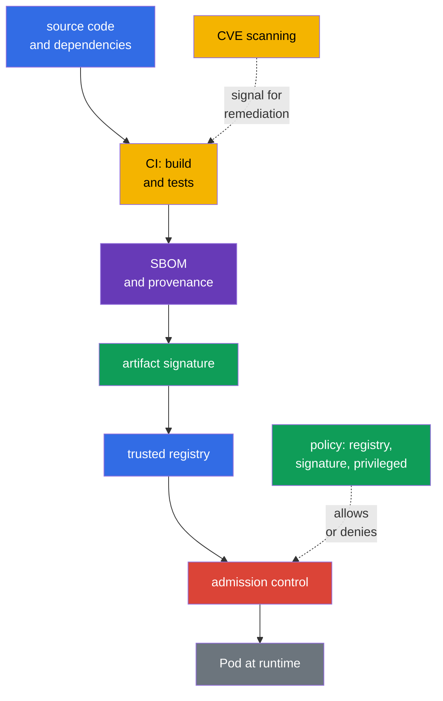
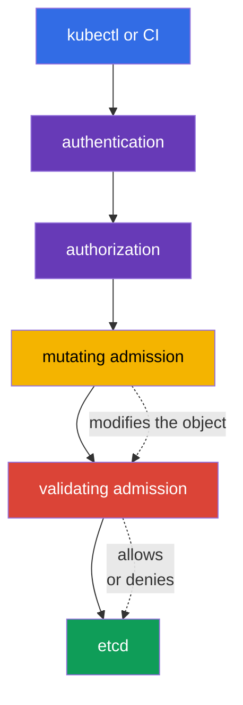

[Русская версия](ru.md) · [Versión en español](es.md) · [Version française](fr.md) · [Deutsche Version](de.md) · [ქართული ვერსია](ge.md) · [繁體中文版](tw.md) · [日本語版](jp.md)

# Chapter 17. Supply chain, image registries, and admission control

> **What is next.** In chapter 16, we examined how malicious code, a vulnerable image, and privilege escalation become threats to a cluster. We now build protection before a workload runs: track the artifact's path from source code, admit images only from a trusted source, and inspect requests to the Kubernetes API. This is the KCSA **Platform Security** domain, weighted at 16%. The examples and API names target Kubernetes `v1.36`.

Supply chain security is not limited to one scanner or signature. It is a chain of evidence: it is clear **what** entered the image, **who and how** it was built, where it was obtained, and whether the object complies with organizational rules at creation time. If even one link is uncontrolled, trust in the artifact weakens.

## 17.1 Supply chain: from code to runtime

The **software supply chain** is the path of software from source code and third-party dependencies through building, testing, and publishing to the image run by a `Pod`. In Kubernetes, the trust boundary is not only around the API: a compromised package, CI runner, or registry can deliver malicious code to the cluster before ordinary runtime controls take effect.

A practical chain usually has these links:

| Link | What can go wrong | Examples of controls |
|---|---|---|
| Code and dependencies | secret in the repository, vulnerable or substituted library | review, SCA, dependency management, secret scanning |
| CI build | an unsecured runner builds different code | isolated build, least privilege, logs, reproducibility |
| Image and metadata | the composition or origin of the artifact is unknown | SBOM, digest, provenance, signature |
| Registry | tag substitution, publication of an unverified image | IAM/RBAC access, private repositories, immutable tags, trusted sources |
| Admission and runtime | an object with a dangerous configuration is admitted to the cluster | policy, signature verification, PSA, observability |

A **digest**, for example `@sha256:...`, uniquely identifies the contents of an image. The `:latest` tag is convenient for development, but mutable: the same tag can represent different bytes today and tomorrow. A digest does not make an image safe, but it makes it possible to pin the exact artifact that was inspected and run.

### SBOM: an inventory of contents

A **Software Bill of Materials (SBOM)** is a machine-readable list of components, versions, and sometimes their relationships within a delivered artifact. It answers the question: "Do our images contain a library for which a CVE has just been published?" An SBOM does not remediate a vulnerability or confirm that the build is trustworthy, but it reduces the time needed to find affected workloads.

Common open formats are **SPDX** and **CycloneDX**. They solve a similar inventory task but differ in their data model and ecosystem. `syft` is an example of a tool that creates an SBOM for a file system or container image. On the exam, it is important to distinguish the purpose of the format and the tool: SPDX/CycloneDX describe an SBOM, while `syft` helps generate it.

### Signature, `cosign`, and sigstore

A signature binds an artifact to the signing party's identity. Before launch, the verifying system ensures that the signature applies to the required digest and matches an allowed key or identity. Therefore, a signature confirms authenticity (association with a trusted signing identity) and integrity (that the artifact was not silently modified after signing), but not the origin of the build - that is a separate task for provenance/attestation - and by itself does not prove the absence of CVEs or a safe `Pod` configuration.

`cosign` is a tool for signing and verifying container artifacts. **sigstore** is an ecosystem that simplifies working with signatures, identities, and a transparency log. Depending on its trust model, an organization can use keys, a CI system identity, or corporate policy. The specific command is not the essential point, but the rule is: verify the signature before admission and bind it to an immutable digest, not only to a mutable tag.

### SLSA and provenance

**SLSA v1.2** (Supply-chain Levels for Software Artifacts) defines a framework of supply-chain requirements with independent **Build** and **Source** tracks. Each track has its own levels and requirements: a Build level is not a statement about a Source level, and vice versa. Therefore, always state a level together with its track, and do not attribute properties that are not asserted by a specific SLSA requirement. **Provenance** is a record of origin: which source code, process, and builder created an artifact. A reproducible build is a useful process property, but not a universal synonym for an SLSA level. SLSA is not a Kubernetes API and does not replace admission policy. It is a language that a team uses to formulate and verify supply-chain requirements.

### End-to-end chain: threat → control → evidence

| Stage | Threat | Control | Evidence |
|---|---|---|---|
| source/dependency | malicious or vulnerable dependency | review, SCA, secret scanning | PR/review and SCA report |
| build | CI builds the wrong source | protected builder and provenance | build record, source revision, artifact digest |
| artifact | mutable tag is substituted | immutable digest | deployment/reference using `@sha256:...` |
| inventory | image composition is unknown | SBOM | SPDX/CycloneDX document linked to the digest |
| release | unknown publisher | signature verification | verification result/signing identity |
| admission/deployment | unsuitable artifact or manifest | allowlist/policy/PSA | admission allow/deny/audit event |
| runtime | new CVE or anomalous behavior | re-scan and runtime monitoring | scan report, registry/runtime telemetry |

The chain does not turn a scanner into proof of safety: a digest pins content, a signature binds an artifact to an identity, an SBOM describes composition, and provenance describes the asserted build path. Each artifact provides separate evidence and has its own limitation.

## 17.2 Image repository and trust in images

An **image repository** or registry stores images and their tags, digests, signatures, and related metadata. A public registry is useful for distribution, but an organization should not consider every public image trusted. Trust means that the source, owner, publishing process, and inspection results comply with organizational rules.

| Approach | Benefit | Residual risk and control |
|---|---|---|
| Allowed registry | restricts image sources | a trusted registry still needs access control and scanning |
| Private registry | limits publication and download, supports internal artifacts | does not automatically make an image safe; permissions, audit, and a publishing process are needed |
| Repository allowlist | prevents accidental public images and name typos | the rule must account for all allowed paths and migration |
| Digest instead of tag | pins specific content | does not confirm that the content is safe or signed |
| Signature | binds an artifact to an identity according to policy | does not replace an SBOM, provenance, CVE analysis, or manifest inspection |
| provenance | describes the asserted artifact build path | is not a signature, SBOM, or SLSA level |
| SLSA v1.2 | defines requirements for independent Build and Source tracks | is not an SBOM, signature, or universal synonym for a reproducible build |

Access to a private registry is usually granted to identities with only the minimum necessary permissions, and credentials are not placed in an image or Git. Kubernetes can use `imagePullSecrets`, but this is not an argument for broad read access to all secrets in a namespace. Registry credentials, like other secrets, are protected by RBAC, rotation, and minimum scope.

### Why scan images

A scanner compares the packages and libraries in an image against known vulnerabilities and CVE databases. **Trivy** is a common tool for this kind of inspection; it can also analyze configurations and secrets, but in the context of image security its key role is detecting known vulnerabilities in an image. The scan result helps select a fixed base or package version and set a threshold for CI.

Scanning does not see every risk class. It can produce false positives, and a known CVE can be inapplicable to a particular execution path. Conversely, the absence of found CVEs does not mean that an image is trustworthy: it can contain secrets, malicious logic, or an unsafe `securityContext`. Therefore, scanning is combined with an SBOM, signatures, review, and admission policy.

## 17.3 Admission control: a decision before storing an object in the cluster

After authentication and authorization, the Kubernetes API Server performs admission control before storing an object in etcd. At this stage, it is possible to evaluate not only the user but also the requested object itself: its image, `securityContext` fields, labels, and compliance with corporate rules.

A **mutating admission webhook** can modify an object, for example by adding a required label, annotation, or sidecar. It is useful for standardization, but object modification must be predictable: unclear mutation complicates investigation and can conflict with another policy.

A **validating admission webhook** evaluates the final version of an object and allows or denies the request. It must not modify the object. Both mutating and validating webhooks operate as external services, so their availability and TLS trust are important: an incorrect configuration can either stop deployment or leave an undesirable bypass path. This behavior when a webhook is unavailable is governed by the `failurePolicy` field in `ValidatingWebhookConfiguration`/`MutatingWebhookConfiguration`: `Fail` stops the request if the webhook is unavailable or returns an error (safer, but can block deployment when the webhook fails), while `Ignore` allows the request without applying the webhook check in this case - that is, a webhook failure or temporary unavailability with `failurePolicy: Ignore` silently disables the control that should have run, without any changes to the object itself.

Kubernetes also provides built-in declarative admission policies using **CEL** (Common Expression Language - an expression language built into the Kubernetes API for describing conditions and rules without running arbitrary code: a policy defines a CEL expression, and the API server evaluates it for a particular object). `MutatingAdmissionPolicy` modifies matching API objects without a separate HTTP webhook; the feature is stable with Kubernetes `v1.36` and enabled by default. `ValidatingAdmissionPolicy` performs built-in declarative validation and can deny a request. Both mechanisms use CEL but solve different tasks: mutation changes the object, validation allows or denies it. For external logic - for example, a network request to a registry or a separate verifier - an external admission webhook / policy engine or a previously obtained trusted verification result available to the policy itself is still required.

`ValidatingAdmissionPolicy` defines validation logic and is a cluster-scoped policy object. For a policy to actually apply, a separate `ValidatingAdmissionPolicyBinding` is created: the binding references the policy, defines `validationActions`, and can narrow applicability through `matchResources`, including `namespaceSelector`. Therefore, it is incorrect to say that `ValidatingAdmissionPolicy` is "in a namespace"; namespace scope is set through binding/matchResources.

### Policy engines: OPA/Gatekeeper and Kyverno

**OPA** (Open Policy Agent) is a general policy engine, while **Gatekeeper** adapts it to Kubernetes admission and constraint management. Policies are usually written in Rego. **Kyverno** is a Kubernetes-oriented policy engine; its rules describe validation, mutation, and sometimes object generation in the Kubernetes YAML style. These tools are not an interchangeable mandatory part of Kubernetes: an organization chooses them based on requirements, team expertise, and the existing policy landscape.

At the KCSA level, it is important to understand the outcome, not to write Rego or complex Kyverno rules. Two typical policies look like this:

| Policy intent | What it checks | Which threat is reduced |
|---|---|---|
| `allowed-registries` | every `container` and `initContainer` uses an image with the `registry.corp.example/` prefix | running an unverified or accidental public image |
| `deny-privileged` | `securityContext.privileged` is not `true` | privilege expansion and increased container escape risk |

These rules complement rather than replace one another. A registry allowlist does not guarantee a safe `Pod`; forbidding `privileged` does not state where an image came from. In addition, policies should apply to all relevant workload creation paths, including `Deployment`, `Job`, and `CronJob`, because the actual `Pod` is created by a controller.

## 17.4 How this is applied in practice

A team usually builds several gates rather than one "perfect" barrier:

1. The developer pins dependencies and does not place secrets in code or an image.
2. CI builds an image from controlled source code, generates an SBOM, scans it, and publishes the artifact to a private registry.
3. CI signs the digest and stores provenance so that a release can be connected to a specific build.
4. The admission-control layer restricts allowed registries; signature verification is performed by an admission webhook / external verifier, or a policy checks an already provided trusted verification result. A separate validating policy or PSA can independently deny dangerous workload fields, for example `privileged: true`.
5. After deployment, the team watches for new CVEs, rescans existing images, and updates affected workloads.

It is safer to introduce policy gradually: first observe violations and agree on exceptions, then enable denial. An exception should be narrow, have an owner, and include a review date. A permanent global "hole" for an old workload turns policy into a formality.

## 17.5 Exam vocabulary / Mini glossary

| Term | Meaning |
|---|---|
| admission control | API request processing stage after authentication and authorization, before the object is stored |
| artifact | a build output, for example a container image, SBOM, or signature |
| `MutatingAdmissionPolicy` | A built-in declarative admission policy that uses CEL for mutation of API objects; stable with Kubernetes v1.36. |
| `ValidatingAdmissionPolicy` | A built-in declarative admission policy that uses CEL for validation of API objects. |
| CEL | Common Expression Language; used by the built-in `MutatingAdmissionPolicy` and `ValidatingAdmissionPolicy`. |
| digest | immutable cryptographic identifier of specific image contents |
| image registry | storage for container images and related metadata |
| provenance | information about the origin of an artifact and its build process |
| SBOM | machine-readable list of components and versions in an artifact |
| SLSA v1.2 | A requirements framework with independent Build and Source tracks; a level is stated together with its track. |

## 17.6 Exam Essentials / Chapter summary

- The supply chain covers the path from code and dependencies to running an image; protection requires several independent controls.
- An SBOM answers the question of artifact composition; SPDX and CycloneDX are SBOM formats, and `syft` helps create one.
- A signature through `cosign`/sigstore confirms authenticity (association with a trusted signing identity) and integrity according to policy, but does not confirm build origin and does not replace CVE scanning or a safe configuration.
- SLSA v1.2 defines independent Build and Source tracks, while provenance describes artifact origin; neither SLSA nor provenance is interchangeable with an SBOM or signature. A reproducible build is not a universal synonym for an SLSA level.
- A trusted or private registry reduces the risk from an uncontrolled source, and `Trivy` helps detect known vulnerabilities.
- Mutation can be performed by either an external `MutatingAdmissionWebhook` or a built-in CEL-based `MutatingAdmissionPolicy`; validation can be performed by an external validating webhook or a built-in CEL-based `ValidatingAdmissionPolicy`.

## 17.7 Do not confuse these concepts and how they appear on the exam

KCSA questions usually test the purpose and limits of controls. Distinguish them: an SBOM inventories composition, a scanner finds known vulnerabilities, a signature binds an artifact to an identity, provenance describes the asserted build path, and admission policy decides whether to admit an object to the cluster. SLSA v1.2 defines independent Build and Source tracks and does not replace an SBOM, signature, or provenance. Do not confuse a private registry with a safety guarantee, a digest with a signature, or a reproducible build with a universal SLSA level.

A common question asks you to select a control for a particular threat. To prohibit images from public sources, use a registry allowlist in admission policy. To prohibit `privileged`, use a validating policy or Pod Security Admission with an appropriate profile. To add required metadata, use mutating admission. The built-in `MutatingAdmissionPolicy` and `ValidatingAdmissionPolicy` use CEL, but the former modifies an object and the latter validates it. A webhook is required not because Kubernetes cannot perform declarative mutation/validation, but when external logic or integration unavailable to a built-in CEL policy is needed.

## 17.8 Self-check questions

### 1. What task does an SBOM primarily solve for a container image?

   - a. Lists components and versions to identify artifacts affected by a vulnerability.

   - b. Prevents a `Pod` from gaining privileged mode.

   - c. Automatically remediates CVEs in the base image.

   - d. Encrypts an image while it is transferred to a registry.

Answer and explanation

**Correct answer: a.** An SBOM inventories an artifact's composition. It helps find affected images, but it does not encrypt them, apply policy, or remediate dependencies.

### 2. What does an image signature successfully verified against an organizational trust policy confirm most precisely?

   - a. That a scanner guaranteed the absence of known and unknown vulnerabilities in the artifact.
   - b. That a private registry by itself proved the origin and integrity of every stored image.
   - c. That a cryptographic assertion over a specific artifact was successfully verified for an allowed key/identity according to the trust policy.
   - d. That runtime is guaranteed to run the container as non-root regardless of its Pod configuration.

Answer and explanation

**Correct answer: c.** Successful signature verification confirms a cryptographic assertion over a specific artifact in the context of the configured trust policy. It does not prove the absence of CVEs, replace provenance, or determine the runtime `securityContext`.

### 3. Which measure best prevents running an image from an accidental public registry?

   - a. Enable `privileged: true` for a diagnostic container.

   - b. Store registry credentials inside the Dockerfile.

   - c. Use only the `latest` tag.

   - d. Configure a validating policy with an allowlist of permitted registries.

Answer and explanation

**Correct answer: d.** A validating policy can inspect every image name and deny the object before it is stored in etcd. `latest` is mutable, and credentials must not be placed in an image.

### 4. What is the main difference between a mutating and a validating admission webhook?

   - a. A validating webhook encrypts a `Secret`, while a mutating webhook creates an SBOM.

   - b. A mutating webhook changes the object, while a validating webhook decides whether to allow or deny it.

   - c. There is no difference between them; they are two names for the same mechanism.

   - d. A mutating webhook works only with `Service`, while a validating webhook works only with `Pod`.

Answer and explanation

**Correct answer: b.** A request goes through mutation before validation; a validating webhook checks the object's final form and must not modify it.

### 5. Which component lets you describe some built-in Kubernetes validating checks with CEL expressions without a separate webhook?

   - a. `PodDisruptionBudget`.

   - b. `imagePullSecret`.

   - c. `ValidatingAdmissionPolicy`.

   - d. `NetworkPolicy`.

Answer and explanation

**Correct answer: c.** `ValidatingAdmissionPolicy` uses CEL for declarative checks of an API object. The other resources address network, availability, and registry authentication tasks.

> **Where to next.** For practical configuration of admission and policy engines, use CKS chapter 20. The supply chain is covered in detail in CKS chapters 25-28: SBOM/CI/CD/artifact repositories, registry/signature/validation, static analysis, and image scanning. For the basics of images and API admission, CKA chapters 23 and 21 are useful.

[Table of contents](../README.md) · [Chapter 16](../16/README.md) · [Chapter 18](../18/README.md)
