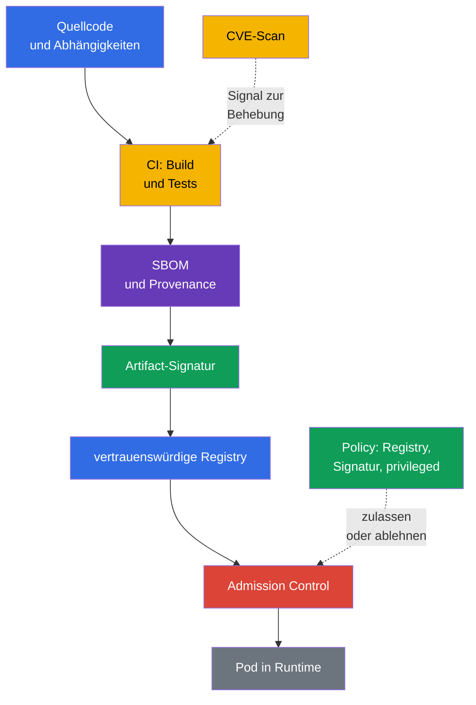
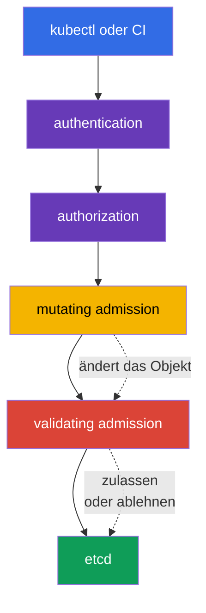

[Русская версия](ru.md) · [Eng version](README.md) · [Versión en español](es.md) · [Version française](fr.md) · [ქართული ვერსია](ge.md) · [繁體中文版](tw.md) · [日本語版](jp.md)

# Kapitel 17. Supply Chain, Image-Registries und Admission Control

> **Wie geht es weiter?** In Kapitel 16 haben wir betrachtet, wie bösartiger Code, ein verwundbares Image und Privilegienerweiterung zu Bedrohungen für den Cluster werden. Jetzt errichten wir Schutzmaßnahmen vor dem Start eines Workload: Wir verfolgen den Weg eines Artifacts vom Quellcode, lassen Images nur aus vertrauenswürdigen Quellen zu und prüfen Anfragen an die Kubernetes API. Dies ist die KCSA-Domain **Platform Security** mit einer Gewichtung von 16 %. Die Beispiele und API-Namen orientieren sich an Kubernetes `v1.36`.

Die Sicherheit der Supply Chain reduziert sich nicht auf einen einzelnen Scanner oder eine Signatur. Sie ist eine Beweiskette: Es ist klar, **was** in das Image gelangt ist, **von wem und wie** es gebaut wurde, woher es bezogen wurde und ob das Objekt beim Erstellen den Regeln der Organisation entspricht. Wird auch nur ein Abschnitt nicht kontrolliert, nimmt das Vertrauen in das Artifact ab.

## 17.1 Supply Chain: vom Code bis zur Runtime

Die **Software Supply Chain** ist der Weg von Quellcode und Drittanbieter-Abhängigkeiten über Build, Tests und Veröffentlichung bis zum Image, das ein `Pod` startet. In Kubernetes verläuft die Vertrauensgrenze nicht nur um die API: Ein kompromittiertes Paket, ein CI-Runner oder eine Registry kann bösartigen Code in den Cluster liefern, noch bevor die üblichen Runtime-Kontrollen greifen.

Eine praktische Kette hat üblicherweise folgende Glieder:

| Glied | Was kann schiefgehen | Beispiele für Kontrollen |
|---|---|---|
| Code und Abhängigkeiten | Secret im Repository, verwundbare oder manipulierte Bibliothek | Review, SCA, Abhängigkeitsverwaltung, Secret-Scanning |
| CI-Build | ein ungeschützter Runner baut anderen Code | isolierter Build, minimale Berechtigungen, Logs, Reproduzierbarkeit |
| Image und Metadata | Zusammensetzung oder Herkunft des Artifacts unbekannt | SBOM, Digest, Provenance, Signatur |
| Registry | Tag-Manipulation, Veröffentlichung eines ungeprüften Images | Zugriff via IAM/RBAC, private Repositories, immutable Tags, vertrauenswürdige Quellen |
| Admission und Runtime | ein Objekt mit gefährlicher Konfiguration wird im Cluster zugelassen | Policy, Signaturprüfung, PSA, Beobachtbarkeit |

Ein **Digest**, beispielsweise `@sha256:...`, verweist eindeutig auf den Inhalt eines Images. Der Tag `:latest` ist für die Entwicklung praktisch, aber veränderlich: Derselbe Tag kann heute und morgen unterschiedliche Bytes bezeichnen. Ein Digest macht ein Image nicht sicher, ermöglicht aber, festzuhalten, welches konkrete Artifact geprüft und gestartet wurde.

### SBOM: Inventar der Zusammensetzung

Eine **Software Bill of Materials (SBOM)** ist eine maschinenlesbare Auflistung von Komponenten, Versionen und manchmal ihrer Beziehungen innerhalb eines ausgelieferten Artifacts. Sie beantwortet die Frage: "Enthalten unsere Images eine Bibliothek, für die gerade eine CVE veröffentlicht wurde?" Eine SBOM behebt keine Schwachstelle und bestätigt nicht, dass der Build vertrauenswürdig ist, verkürzt aber die Zeit zur Suche nach betroffenen Workloads.

Verbreitete offene Formate sind **SPDX** und **CycloneDX**. Sie lösen eine ähnliche Inventarisierungsaufgabe, unterscheiden sich jedoch in Datenmodell und Ökosystem. `syft` ist ein Beispiel für ein Tool, das eine SBOM für ein Dateisystem oder ein Container-Image erstellt. In der Prüfung ist es wichtig, den Zweck von Format und Tool zu unterscheiden: SPDX/CycloneDX beschreiben eine SBOM, während `syft` beim Erstellen hilft.

### Signatur, `cosign` und sigstore

Eine Signatur verbindet ein Artifact mit der Identity der signierenden Partei. Vor dem Start stellt das prüfende System sicher, dass die Signatur zum gewünschten Digest gehört und einem zulässigen Schlüssel oder einer zulässigen Identity entspricht. Deshalb bestätigt eine Signatur Authentizität (Zuordnung zu einer vertrauenswürdigen Signing-Identity) und Integrität (dass das Artifact nach der Signatur nicht unbemerkt geändert wurde), jedoch nicht die Herkunft des Builds - das ist eine separate Aufgabe von Provenance/Attestation - und sie beweist für sich allein weder das Fehlen von CVE noch eine sichere `Pod`-Konfiguration.

`cosign` ist ein Tool zum Signieren und Prüfen von Container-Artifacts. **sigstore** ist ein Ökosystem, das die Arbeit mit Signaturen, Identity und einem Transparenzprotokoll vereinfacht. Je nach Vertrauensmodell kann eine Organisation Schlüssel, die Identity des CI-Systems oder eine unternehmensweite Policy verwenden. Wesentlich ist nicht der konkrete Befehl, sondern die Regel: die Signatur vor der Zulassung prüfen und sie mit einem immutable Digest verknüpfen, nicht nur mit einem veränderlichen Tag.

### SLSA und Provenance

**SLSA v1.2** (Supply-chain Levels for Software Artifacts) definiert einen Rahmen von Anforderungen an die Supply Chain mit unabhängigen Tracks **Build** und **Source**. Jeder Track hat eigene Stufen und Anforderungen: Eine Build-Stufe ist keine Aussage über eine Source-Stufe und umgekehrt. Daher wird eine Stufe immer zusammen mit dem Track angegeben und es werden ihr keine Eigenschaften zugeschrieben, die nicht durch die konkrete SLSA-Anforderung behauptet werden. **Provenance** ist ein Herkunftsnachweis: welcher Quellcode, Prozess und Builder ein Artifact erstellt haben. Ein Reproducible Build ist eine nützliche Eigenschaft des Prozesses, aber kein universelles Synonym für eine SLSA-Stufe. SLSA ist keine Kubernetes API und ersetzt keine Admission Policy. Es ist eine Sprache, mit der das Team Anforderungen an die Supply Chain formuliert und prüft.

### Durchgängige Kette: threat → control → evidence

| Phase | Bedrohung | Control | Evidence |
|---|---|---|---|
| source/dependency | bösartige oder verwundbare Abhängigkeit | Review, SCA, Secret-Scanning | PR/Review und SCA-Report |
| build | CI baut nicht den richtigen Source | geschützter Builder und Provenance | Build-Record, Source-Revision, Artifact-Digest |
| artifact | mutable Tag wird manipuliert | immutable Digest | Deployment/Referenz auf `@sha256:...` |
| inventory | Zusammensetzung des Image unbekannt | SBOM | SPDX/CycloneDX-Dokument, mit dem Digest verknüpft |
| release | unbekannter Publisher | Signature Verification | Verification-Ergebnis/Signing-Identity |
| admission/deployment | ungeeignetes Artifact oder Manifest | Allowlist/Policy/PSA | Admission-Allow/Deny/Audit-Event |
| runtime | neue CVE oder anomalous Behavior | Re-Scan und Runtime Monitoring | Scan-Report, Registry/Runtime-Telemetrie |

Die Kette macht einen Scanner nicht zu einem Proof of Safety: Ein Digest fixiert den Content, eine Signatur verbindet ein Artifact mit einer Identity, eine SBOM beschreibt die Zusammensetzung, Provenance beschreibt den behaupteten Build Path. Jedes Artefakt liefert ein separates Evidence und hat eine eigene Einschränkung.

## 17.2 Image Repository und Vertrauen in Images

Ein **Image Repository** oder eine Registry speichert Images und ihre Tags, Digests, Signaturen und zugehörige Metadata. Eine öffentliche Registry ist für die Verteilung nützlich, doch eine Organisation sollte nicht jedes öffentliche Image als vertrauenswürdig ansehen. Vertrauen bedeutet, dass Quelle, Eigentümer, Veröffentlichungsprozess und Prüfergebnis den Regeln der Organisation entsprechen.

| Ansatz | Nutzen | Restrisiko und Kontrolle |
|---|---|---|
| Zugelassene Registry | begrenzt die Image-Quellen | auch eine vertrauenswürdige Registry erfordert Zugriffsverwaltung und Scanning |
| Private Registry | begrenzt Veröffentlichung und Download, unterstützt interne Artifacts | macht ein Image nicht automatisch sicher; Berechtigungen, Audit und ein Veröffentlichungsprozess sind nötig |
| Allowlist für Repository | verhindert zufällige öffentliche Images und Tippfehler im Namen | die Regel muss alle zulässigen Pfade und Migration berücksichtigen |
| Digest statt Tag | fixiert den konkreten Content | bestätigt nicht, dass der Content sicher oder signiert ist |
| Signatur | verbindet ein Artifact gemäß Policy mit einer Identity | ersetzt weder SBOM, Provenance, CVE-Analyse noch Manifest-Prüfung |
| provenance | beschreibt den behaupteten Build Path eines Artifacts | ist weder Signatur noch SBOM oder SLSA-Stufe |
| SLSA v1.2 | definiert Anforderungen für die unabhängigen Tracks Build und Source | ist weder SBOM noch Signatur oder universelles Synonym für Reproducible Build |

Zugriff auf eine private Registry wird üblicherweise mit minimal erforderlichen Identity-Berechtigungen gewährt, und Credentials werden nicht in Image oder Git abgelegt. Kubernetes kann `imagePullSecrets` verwenden, doch das rechtfertigt keinen umfassenden Lesezugriff auf alle Secrets in einem Namespace. Registry-Credentials werden wie andere Secrets durch RBAC, Rotation und minimalen Geltungsbereich geschützt.

### Warum Images scannen

Ein Scanner gleicht Pakete und Bibliotheken eines Images mit bekannten Schwachstellen und CVE-Datenbanken ab. **Trivy** ist ein verbreitetes Tool für diese Prüfung; es kann auch Konfigurationen und Secrets analysieren, doch im Kontext der Image-Sicherheit besteht seine zentrale Rolle im Erkennen bekannter Schwachstellen in einem Image. Das Scan-Ergebnis hilft, eine korrigierte Basis oder Paketversion auszuwählen und einen Grenzwert für CI festzulegen.

Scanning erkennt nicht alle Risikoklassen. Es kann False Positives geben, und eine bekannte CVE kann für den konkreten Ausführungspfad nicht zutreffen. Umgekehrt bedeutet das Fehlen gefundener CVE nicht, dass ein Image vertrauenswürdig ist: Es kann Secrets, bösartige Logik oder einen unsicheren `securityContext` enthalten. Deshalb wird Scanning mit SBOM, Signatur, Review und Admission Policy kombiniert.

## 17.3 Admission Control: Entscheidung vor dem Speichern im Cluster

Nach Authentication und Authorization führt der Kubernetes API Server Admission Control aus, bevor er ein Objekt in etcd speichert. In dieser Phase können nicht nur der Benutzer, sondern auch das angefragte Objekt selbst bewertet werden: Image, `securityContext`-Felder, Labels und die Einhaltung unternehmensweiter Regeln.

Ein **Mutating Admission Webhook** kann ein Objekt verändern, beispielsweise eine verpflichtende Label, Annotation oder einen Sidecar hinzufügen. Er ist für Standardisierung nützlich, aber die Objektänderung sollte vorhersehbar sein: Eine unklare Mutation erschwert Untersuchungen und kann mit einer anderen Policy kollidieren.

Ein **Validating Admission Webhook** bewertet die endgültige Variante eines Objekts und lässt die Anfrage zu oder lehnt sie ab. Er darf das Objekt nicht ändern. Sowohl mutating als auch validating Webhooks arbeiten als externe Services, weshalb ihre Verfügbarkeit und das TLS-Vertrauen wichtig sind: Eine falsche Konfiguration kann entweder ein Deployment stoppen oder einen unerwünschten Umgehungsweg offenlassen. Genau dieses Verhalten bei Nichtverfügbarkeit eines Webhook regelt das Feld `failurePolicy` in `ValidatingWebhookConfiguration`/`MutatingWebhookConfiguration`: `Fail` stoppt die Anfrage, wenn der Webhook nicht verfügbar ist oder einen Fehler zurückgibt (sicherer, kann aber bei einem Webhook-Ausfall das Deployment blockieren), während `Ignore` die Anfrage in diesem Fall ohne Anwendung der Webhook-Prüfung passieren lässt - das heißt, ein Ausfall oder eine vorübergehende Nichtverfügbarkeit des Webhook bei `failurePolicy: Ignore` deaktiviert die Kontrolle, die hätte greifen sollen, stillschweigend und ohne Änderungen am Objekt selbst.

Kubernetes bietet außerdem integrierte deklarative Admission Policies auf **CEL** (Common Expression Language - eine in die Kubernetes API integrierte Ausdruckssprache zur Beschreibung von Bedingungen und Regeln ohne Ausführung beliebigen Codes: Eine Policy definiert einen CEL-Ausdruck, und der API Server wertet ihn selbst für das konkrete Objekt aus). `MutatingAdmissionPolicy` verändert passende API-Objekte ohne separaten HTTP-Webhook; das Feature ist mit Kubernetes `v1.36` stable und standardmäßig aktiviert. `ValidatingAdmissionPolicy` führt eine integrierte deklarative Validation aus und kann eine Anfrage ablehnen. Beide Mechanismen verwenden CEL, lösen aber unterschiedliche Aufgaben: Mutation verändert das Objekt, Validation lässt es zu oder lehnt es ab. Für externe Logik - beispielsweise eine Netzwerkanfrage an eine Registry oder einen separaten Verifier - ist weiterhin ein externer Admission Webhook / Policy Engine oder ein zuvor ermitteltes vertrauenswürdiges Verification Result nötig, auf das die Policy selbst zugreifen kann.

`ValidatingAdmissionPolicy` definiert die Validation Logic und ist ein cluster-scoped Policy Object. Damit die Policy tatsächlich angewendet wird, wird ein separates `ValidatingAdmissionPolicyBinding` erstellt: Das Binding verweist auf die Policy, definiert `validationActions` und kann die Anwendung über `matchResources`, einschließlich `namespaceSelector`, einschränken. Daher kann nicht gesagt werden, dass sich eine `ValidatingAdmissionPolicy` "in einem Namespace" befindet; der Namespace Scope wird über Binding/`matchResources` festgelegt.

### Policy-Engines: OPA/Gatekeeper und Kyverno

**OPA** (Open Policy Agent) ist eine allgemeine Policy Engine und **Gatekeeper** passt sie an Kubernetes Admission und die Verwaltung von Constraints an. Policies werden gewöhnlich in Rego beschrieben. **Kyverno** ist eine Kubernetes-orientierte Policy Engine; ihre Regeln beschreiben Validation, Mutation und manchmal die Generierung von Objekten im Stil von Kubernetes YAML. Diese Tools sind kein austauschbarer, verpflichtender Bestandteil von Kubernetes: Eine Organisation wählt sie nach Anforderungen, Kompetenzen des Teams und der bestehenden Policy Landscape aus.

Auf KCSA-Ebene ist es wichtig, das Ergebnis zu verstehen, nicht Rego oder komplexe Kyverno-Regeln zu schreiben. Zwei typische Policies sehen so aus:

| Policy-Absicht | Was wird geprüft | Welche Bedrohung wird reduziert |
|---|---|---|
| `allowed-registries` | jeder `container` und `initContainer` verwendet ein Image mit Präfix `registry.corp.example/` | Start eines ungeprüften oder zufälligen öffentlichen Images |
| `deny-privileged` | `securityContext.privileged` ist nicht gleich `true` | Privilegienerweiterung und höheres Risiko eines Container Escape |

Solche Regeln ergänzen sich, ersetzen einander aber nicht. Eine Allowlist für Registries garantiert keinen sicheren `Pod`; das Verbot von `privileged` sagt nichts über die Quelle eines Images aus. Außerdem sollte eine Policy auf alle passenden Wege zum Erstellen von Workloads angewendet werden, einschließlich `Deployment`, `Job` und `CronJob`, da der tatsächliche `Pod` durch einen Controller erstellt wird.

## 17.4 Praktische Anwendung

Ein Team richtet gewöhnlich mehrere Gates ein, nicht eine einzige "perfekte" Barriere:

1. Der Entwickler fixiert Abhängigkeiten und legt keine Secrets in Code oder Image ab.
2. CI baut das Image aus kontrolliertem Quellcode, erstellt eine SBOM, scannt sie und veröffentlicht das Artifact in einer privaten Registry.
3. CI signiert den Digest und speichert Provenance, damit ein Release mit einem konkreten Build verbunden werden kann.
4. Die Admission-Control-Schicht beschränkt zulässige Registries; die Signaturprüfung wird durch einen Admission Webhook / externen Verifier ausgeführt oder eine Policy prüft ein bereits bereitgestelltes vertrauenswürdiges Verification Result. Eine separate Validating Policy oder PSA kann gefährliche Workload-Felder, beispielsweise `privileged: true`, unabhängig ablehnen.
5. Nach dem Deployment überwacht das Team neue CVE, scannt bestehende Images erneut und aktualisiert betroffene Workloads.

Eine Policy ist sicherer schrittweise einzuführen: zunächst Verstöße beobachten und Ausnahmen abstimmen, dann die Ablehnung aktivieren. Eine Ausnahme sollte eng gefasst sein, einen Verantwortlichen und einen Prüftermin haben. Ein permanentes globales "Loch" für einen alten Workload macht die Policy zur Formalität.

## 17.5 Exam Vocabulary / Mini-Glossar

| Begriff | Bedeutung |
|---|---|
| admission control | Phase der API-Anfrageverarbeitung nach Authentication und Authorization, vor dem Speichern des Objekts |
| artifact | Ergebnis eines Builds, beispielsweise Container-Image, SBOM oder Signatur |
| `MutatingAdmissionPolicy` | Integrierte deklarative Admission Policy, die CEL zur Mutation von API-Objekten verwendet; stable ab Kubernetes v1.36. |
| `ValidatingAdmissionPolicy` | Integrierte deklarative Admission Policy, die CEL zur Validation von API-Objekten verwendet. |
| CEL | Common Expression Language; wird von den integrierten `MutatingAdmissionPolicy` und `ValidatingAdmissionPolicy` verwendet. |
| digest | unveränderlicher kryptografischer Identifikator eines bestimmten Image-Inhalts |
| image registry | Speicher für Container Images und zugehörige Metadata |
| provenance | Informationen über die Herkunft eines Artifacts und seinen Build-Prozess |
| SBOM | maschinenlesbare Auflistung von Komponenten und Versionen in einem Artifact |
| SLSA v1.2 | Anforderungsrahmen mit unabhängigen Tracks Build und Source; die Stufe wird zusammen mit dem Track angegeben. |

## 17.6 Exam Essentials / Zusammenfassung des Kapitels

- Die Supply Chain umfasst den Weg von Code und Abhängigkeiten bis zum Start eines Images; Schutz erfordert mehrere unabhängige Kontrollen.
- Eine SBOM beantwortet die Frage nach der Zusammensetzung eines Artifacts; SPDX und CycloneDX sind SBOM-Formate, und `syft` hilft beim Erstellen.
- Eine Signatur über `cosign`/sigstore bestätigt Authentizität (Zuordnung zu einer vertrauenswürdigen Signing-Identity) und Integrität gemäß Policy, bestätigt aber nicht die Herkunft des Builds und ersetzt weder CVE-Scanning noch sichere Konfiguration.
- SLSA v1.2 definiert unabhängige Tracks Build und Source, und Provenance beschreibt die Herkunft eines Artifacts; weder SLSA noch Provenance sind austauschbar mit SBOM oder Signatur. Ein Reproducible Build ist kein universelles Synonym für eine SLSA-Stufe.
- Eine vertrauenswürdige oder private Registry senkt das Risiko einer unkontrollierten Quelle, und `Trivy` hilft beim Erkennen bekannter Schwachstellen.
- Mutation kann sowohl durch einen externen `MutatingAdmissionWebhook` als auch durch die integrierte `MutatingAdmissionPolicy` auf CEL erfolgen; Validation durch einen externen Validating Webhook oder die integrierte `ValidatingAdmissionPolicy` auf CEL.

## 17.7 Nicht verwechseln und wie dies in der Prüfung vorkommt

KCSA-Fragen prüfen gewöhnlich den Zweck und die Grenzen von Kontrollen. Unterscheiden Sie: Eine SBOM inventarisiert die Zusammensetzung, ein Scanner sucht bekannte Schwachstellen, eine Signatur verbindet ein Artifact mit einer Identity, Provenance beschreibt den behaupteten Build Path und eine Admission Policy entscheidet, ob ein Objekt im Cluster zugelassen wird. SLSA v1.2 definiert unabhängige Tracks Build und Source und ersetzt weder SBOM, Signatur noch Provenance. Verwechseln Sie eine private Registry nicht mit einer Sicherheitsgarantie, einen Digest nicht mit einer Signatur und einen Reproducible Build nicht mit einer universellen SLSA-Stufe.

Eine häufige Fragestellung fordert dazu auf, eine Kontrolle für eine konkrete Bedrohung zu wählen. Um Images aus öffentlichen Quellen zu verbieten, eignet sich eine Allowlist für Registries in einer Admission Policy. Um `privileged` zu verbieten, eignet sich eine Validating Policy oder Pod Security Admission mit einem passenden Profil. Zum Hinzufügen verpflichtender Metadata eignet sich Mutating Admission. Die integrierten `MutatingAdmissionPolicy` und `ValidatingAdmissionPolicy` verwenden CEL, aber die erste verändert das Objekt, während die zweite es validiert. Ein Webhook ist nicht nötig, weil Kubernetes keine deklarative Mutation/Validation beherrscht, sondern wenn externe Logik oder eine Integration benötigt wird, die nicht in der integrierten CEL-Policy verfügbar ist.

## 17.8 Fragen zur Selbstkontrolle

### 1. Welche Aufgabe löst eine SBOM für ein Container-Image in erster Linie?

   - a. Sie listet Komponenten und Versionen auf, um von einer Schwachstelle betroffene Artifacts zu bestimmen.

   - b. Sie verhindert, dass ein `Pod` einen privilegierten Modus erhält.

   - c. Sie behebt CVE im Basis-Image automatisch.

   - d. Sie verschlüsselt ein Image bei der Übertragung in die Registry.

Antwort und Erläuterung

**Richtige Antwort: a.** Eine SBOM inventarisiert die Zusammensetzung eines Artifacts. Sie hilft beim Auffinden betroffener Images, verschlüsselt sie aber nicht, wendet keine Policy an und behebt keine Abhängigkeiten.

### 2. Was bestätigt eine erfolgreich gemäß der organisatorischen Trust Policy geprüfte Image-Signatur am genauesten?

   - a. Dass ein Scanner das Fehlen bekannter und unbekannter Schwachstellen im Artifact garantiert hat.
   - b. Dass eine private Registry allein die Herkunft und Integrity jedes gespeicherten Image bewiesen hat.
   - c. Dass eine cryptographic Assertion über ein konkretes Artifact für einen zulässigen Key/Identity gemäß Trust Policy erfolgreich geprüft wurde.
   - d. Dass die Runtime den Container unabhängig von seiner Pod Configuration garantiert als non-root startet.

Antwort und Erläuterung

**Richtige Antwort: c.** Eine erfolgreiche Signature Verification bestätigt eine cryptographic Assertion über ein konkretes Artifact im Kontext der konfigurierten Trust Policy. Sie beweist nicht das Fehlen von CVE, ersetzt keine Provenance und bestimmt nicht den Runtime SecurityContext.

### 3. Welche Maßnahme verhindert am besten, dass ein Image aus einer zufälligen öffentlichen Registry gestartet wird?

   - a. `privileged: true` für einen Diagnose-Container aktivieren.

   - b. Registry-Credentials im Dockerfile speichern.

   - c. Nur den Tag `latest` verwenden.

   - d. Eine Validating Policy mit einer Allowlist zulässiger Registries konfigurieren.

Antwort und Erläuterung

**Richtige Antwort: d.** Eine Validating Policy kann den Namen jedes Images prüfen und das Objekt vor dem Speichern in etcd ablehnen. `latest` ist veränderlich, und Credentials dürfen nicht in ein Image gelangen.

### 4. Was ist der wesentliche Unterschied zwischen mutating und validating Admission Webhooks?

   - a. Ein Validating Webhook verschlüsselt `Secret`, ein Mutating Webhook erstellt eine SBOM.

   - b. Ein Mutating Webhook verändert das Objekt, ein Validating Webhook entscheidet, ob er es zulässt oder ablehnt.

   - c. Es gibt keinen Unterschied, dies sind zwei Namen für denselben Mechanismus.

   - d. Ein Mutating Webhook arbeitet nur mit `Service`, ein Validating Webhook nur mit `Pod`.

Antwort und Erläuterung

**Richtige Antwort: b.** Eine Anfrage durchläuft Mutation vor Validation; ein Validating Webhook prüft die endgültige Form des Objekts und darf sie nicht ändern.

### 5. Welche Komponente ermöglicht es, einen Teil der integrierten Validating-Prüfungen von Kubernetes mit CEL-Ausdrücken ohne separaten Webhook zu beschreiben?

   - a. `PodDisruptionBudget`.

   - b. `imagePullSecret`.

   - c. `ValidatingAdmissionPolicy`.

   - d. `NetworkPolicy`.

Antwort und Erläuterung

**Richtige Antwort: c.** `ValidatingAdmissionPolicy` verwendet CEL für deklarative Prüfungen eines API-Objekts. Die übrigen Ressourcen erfüllen Aufgaben für Netzwerk, Verfügbarkeit und Authentifizierung an einer Registry.

> **Wie geht es weiter?** Für die praktische Konfiguration von Admission und Policy Engines verwenden Sie Kapitel 20 CKS. Die Supply Chain wird in den Kapiteln 25-28 CKS ausführlich behandelt: SBOM/CI/CD/Artifact Repositories, Registry/Signatur/Validation, statische Analyse und Image Scanning. Für den grundlegenden Aufbau von Images und API Admission sind die Kapitel 23 und 21 CKA nützlich.

[Inhaltsverzeichnis](../README_DE.md) · [Kapitel 16](../16/de.md) · [Kapitel 18](../18/de.md)