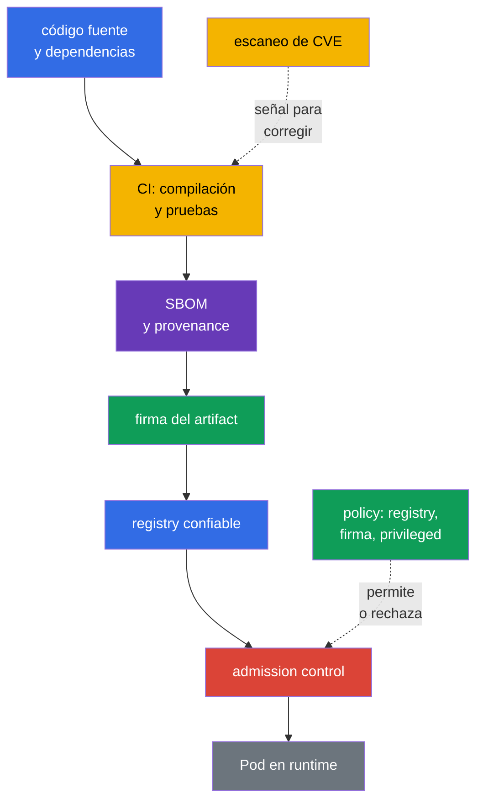
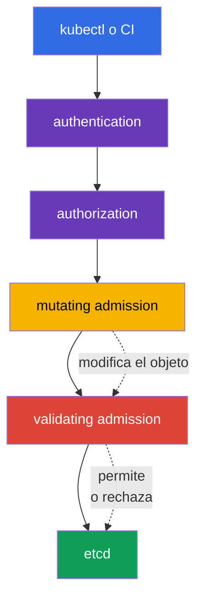

[Русская версия](ru.md) · [Eng version](README.md) · [Version française](fr.md) · [Deutsche Version](de.md) · [ქართული ვერსია](ge.md) · [繁體中文版](tw.md) · [日本語版](jp.md)

# Capítulo 17. Supply chain, registros de imágenes y admission control

> **Qué sigue.** En el capítulo 16 examinamos cómo el código malicioso, una imagen vulnerable y la escalada de privilegios se convierten en amenazas para el clúster. Ahora construimos la protección antes de ejecutar una carga de trabajo: rastreamos la ruta del artefacto desde el código fuente, admitimos imágenes solo de fuentes confiables y verificamos la solicitud a la API de Kubernetes. Este es el dominio KCSA **Platform Security** con un peso del 16 %. Los ejemplos y nombres de API están orientados a Kubernetes `v1.36`.

La seguridad de la supply chain no se reduce a un único escáner o firma. Es una cadena de evidencias: se entiende **qué** entró en la imagen, **quién y cómo** la creó, de dónde se obtuvo y si el objeto cumple las reglas de la organización en el momento de su creación. Si al menos un tramo no está controlado, la confianza en el artefacto se debilita.

## 17.1 Supply chain: del código al runtime

La **software supply chain** es la ruta del software desde el código fuente y las dependencias de terceros, pasando por la compilación, las pruebas y la publicación, hasta la imagen que ejecuta un `Pod`. En Kubernetes, el límite de confianza no está únicamente alrededor de la API: un paquete, CI runner o registry comprometido puede entregar código malicioso al clúster incluso antes de que funcionen los controles habituales de runtime.

Una cadena práctica suele tener estos eslabones:

| Eslabón | Qué puede salir mal | Ejemplos de controles |
|---|---|---|
| Código y dependencias | secreto en el repositorio, biblioteca vulnerable o sustituida | review, SCA, gestión de dependencias, comprobación de secretos |
| Compilación de CI | un runner sin protección compila otro código | compilación aislada, privilegios mínimos, registros, reproducibilidad |
| Imagen y metadata | se desconoce la composición o el origen del artifact | SBOM, digest, provenance, firma |
| Registry | sustitución de etiqueta, publicación de imagen no verificada | acceso mediante IAM/RBAC, repositorios privados, immutable tags, fuentes confiables |
| Admission y runtime | se admite al clúster un objeto con configuración peligrosa | policy, verificación de firma, PSA, observabilidad |

Un **digest**, por ejemplo `@sha256:...`, señala inequívocamente el contenido de una imagen. La etiqueta `:latest` es conveniente para desarrollo, pero es modificable: la misma etiqueta puede representar bytes distintos hoy y mañana. Un digest no hace segura una imagen, pero permite fijar qué artifact concreto se verificó y ejecutó.

### SBOM: inventario de la composición

Una **Software Bill of Materials (SBOM)** es una lista legible por máquina de componentes, versiones y, en ocasiones, sus relaciones dentro del artifact entregado. Responde a la pregunta: «¿Hay en nuestras imágenes una biblioteca para la que acaba de publicarse una CVE?». Una SBOM no corrige una vulnerabilidad ni confirma que la compilación sea confiable, pero reduce el tiempo para localizar las cargas de trabajo afectadas.

Los formatos abiertos habituales son **SPDX** y **CycloneDX**. Resuelven una tarea de inventario parecida, pero difieren en el modelo de datos y el ecosistema. `syft` es un ejemplo de herramienta que crea una SBOM para un sistema de archivos o una container image. En el examen es importante distinguir el propósito de un formato y de una herramienta: SPDX/CycloneDX describen una SBOM, y `syft` ayuda a generarla.

### Firma, `cosign` y sigstore

Una firma vincula un artifact con la identity de la parte que lo firma. Antes de ejecutarlo, el sistema de verificación confirma que la firma corresponde al digest requerido y coincide con la clave o identity permitida. Por eso, la firma confirma la autenticidad (association con una signing identity confiable) y la integridad (que el artifact no se modificó silenciosamente después de firmarse), pero no el origen de la compilación, que es una tarea separada de provenance/attestation, y por sí sola no demuestra la ausencia de CVE ni una configuración segura de `Pod`.

`cosign` es una herramienta para firmar y verificar container artifacts. **sigstore** es un ecosistema que simplifica el trabajo con firmas, identity y un registro de transparencia. Según el modelo de confianza, una organización puede usar claves, identity del sistema CI o una policy corporativa. Lo importante no es un comando concreto, sino la regla: verificar la firma antes de la admisión y vincularla a un digest immutable, no solo a una etiqueta modificable.

### SLSA y provenance

**SLSA v1.2** (Supply-chain Levels for Software Artifacts) establece un marco de requisitos para la cadena de suministro con tracks independientes **Build** y **Source**. Cada track tiene sus propios niveles y requisitos: el nivel Build no es una afirmación sobre el nivel Source, y viceversa. Por ello, el nivel siempre se indica junto con el track y no se le atribuyen propiedades que no estén declaradas por un requisito SLSA concreto. **Provenance** es un registro de origen: qué código fuente, proceso y compilador crearon un artifact. Una reproducible build es una propiedad útil del proceso, pero no un sinónimo universal de un nivel SLSA. SLSA no es una API de Kubernetes ni sustituye una admission policy. Es un lenguaje con el que el equipo formula y verifica requisitos para la cadena de suministro.

### Cadena integral: threat → control → evidence

| Etapa | Amenaza | Control | Evidence |
|---|---|---|---|
| source/dependency | dependencia maliciosa o vulnerable | review, SCA, secret scanning | PR/review y SCA report |
| build | CI compila un source distinto | builder protegido y provenance | build record, source revision, artifact digest |
| artifact | se sustituye una mutable tag | immutable digest | deployment/reference a `@sha256:...` |
| inventory | se desconoce la composición de la image | SBOM | SPDX/CycloneDX document vinculado al digest |
| release | publisher desconocido | signature verification | verification result/signing identity |
| admission/deployment | artifact o manifest no adecuado | allowlist/policy/PSA | admission allow/deny/audit event |
| runtime | nueva CVE o anomalous behavior | re-scan y runtime monitoring | scan report, registry/runtime telemetry |

La cadena no convierte un scanner en proof of safety: un digest fija el content, una signature vincula un artifact con una identity, una SBOM describe la composición y provenance describe el build path declarado. Cada artefacto aporta una evidence independiente y tiene su propia limitación.

## 17.2 Image repository y confianza en las imágenes

Un **image repository** o registry almacena imágenes y sus etiquetas, digest, firmas y metadata asociada. Un registry público es útil para la distribución, pero una organización no debe considerar confiable toda imagen pública. La confianza significa que la fuente, el propietario, el proceso de publicación y el resultado de las verificaciones cumplen las reglas de la organización.

| Enfoque | Beneficio | Riesgo residual y control |
|---|---|---|
| Registry permitido | limita las fuentes de imágenes | un registry confiable también requiere gestión de acceso y escaneo |
| Registry privado | limita la publicación y download, admite artifacts internos | no hace segura automáticamente una imagen; se necesitan permisos, audit y proceso de publicación |
| Allowlist de repository | prohíbe imágenes públicas accidentales y errores tipográficos en el nombre | la regla debe considerar todas las rutas permitidas y la migration |
| Digest en lugar de etiqueta | fija el contenido concreto | no confirma que el contenido sea seguro o esté firmado |
| Firma | vincula el artifact con una identity según la policy | no sustituye SBOM, provenance, análisis de CVE ni la comprobación del manifest |
| provenance | describe la ruta de compilación declarada del artifact | no es una firma, SBOM ni un nivel SLSA |
| SLSA v1.2 | establece requisitos de tracks independientes Build y Source | no es una SBOM, firma ni sinónimo universal de reproducible build |

El acceso a un registry privado se concede normalmente a las identity con los mínimos privilegios necesarios, y las credentials no se colocan en una image ni en Git. Kubernetes puede usar `imagePullSecrets`, pero esto no es motivo para permitir una lectura amplia de todos los secretos del namespace. Las credentials del registry, como otros secretos, se protegen con RBAC, rotación y un alcance mínimo.

### Por qué escanear imágenes

Un scanner compara los paquetes y bibliotecas de la imagen con vulnerabilidades conocidas y bases de CVE. **Trivy** es una herramienta habitual para esta comprobación; también puede analizar configuraciones y secrets, pero en el contexto de image security su función principal es detectar vulnerabilidades conocidas en la imagen. El resultado del escaneo ayuda a elegir una base o versión de paquete corregida y a establecer un umbral para CI.

El escaneo no detecta todas las clases de riesgo. Puede tener falsos positivos, y una CVE conocida puede no ser aplicable a una ruta de ejecución concreta. A la inversa, la ausencia de CVE detectadas no significa que una imagen sea confiable: puede contener secretos, lógica maliciosa o un `securityContext` inseguro. Por eso, el escaneo se combina con SBOM, firma, review y admission policy.

## 17.3 Admission control: decisión antes de escribir en el clúster

Después de authentication y authorization, Kubernetes API Server realiza admission control antes de guardar el objeto en etcd. En esta etapa es posible evaluar no solo al usuario, sino también el propio objeto solicitado: la imagen, los campos de `securityContext`, labels y la conformidad con las reglas corporativas.

Un **mutating admission webhook** puede modificar un objeto, por ejemplo, añadir una label, annotation o sidecar obligatorios. Es útil para la estandarización, pero la modificación del objeto debe ser predecible: una mutación poco clara dificulta la investigación y puede entrar en conflicto con otra policy.

Un **validating admission webhook** evalúa la versión final del objeto y permite o rechaza la solicitud. No debe modificar el objeto. Tanto los webhooks mutating como los validating funcionan como servicios externos, por lo que su disponibilidad y la confianza TLS son importantes: una configuración incorrecta puede detener el deploy o dejar una vía de omisión no deseada. El comportamiento ante la indisponibilidad del webhook se regula precisamente mediante el campo `failurePolicy` en `ValidatingWebhookConfiguration`/`MutatingWebhookConfiguration`: `Fail` detiene la solicitud si el webhook no está disponible o devuelve un error (es más seguro, pero puede bloquear el deploy si falla el webhook), mientras que `Ignore` permite la solicitud sin aplicar la comprobación del webhook en ese caso, es decir, un fallo o indisponibilidad temporal del webhook con `failurePolicy: Ignore` desactiva silenciosamente el control que debía ejecutarse, sin cambios en el propio objeto.

Kubernetes también ofrece declarative admission policies integradas en **CEL** (Common Expression Language - el lenguaje de expresiones integrado en la API de Kubernetes para describir condiciones y reglas sin ejecutar código arbitrario: la policy define una expresión CEL y el API server la evalúa para un objeto concreto). `MutatingAdmissionPolicy` modifica los objetos API que coinciden sin un webhook HTTP independiente; la feature es stable desde Kubernetes `v1.36` y está enabled by default. `ValidatingAdmissionPolicy` realiza validation declarativa integrada y puede rechazar una solicitud. Ambos mecanismos usan CEL, pero resuelven tareas distintas: mutation modifica el objeto, validation lo acepta o rechaza. Para lógica externa, por ejemplo, una solicitud de red a un registry o a un verifier independiente, sigue siendo necesario un admission webhook / policy engine externo o un verification result confiable obtenido previamente y disponible para la propia policy.

`ValidatingAdmissionPolicy` define la validation logic y es un policy object con ámbito de clúster. Para que la policy se aplique realmente, se crea un `ValidatingAdmissionPolicyBinding` separado: el binding hace referencia a la policy, establece `validationActions` y puede restringir su aplicación mediante `matchResources`, incluido `namespaceSelector`. Por tanto, no se puede decir que `ValidatingAdmissionPolicy` está «en un namespace»; el ámbito del namespace se define a través de binding/matchResources.

### Policy engines: OPA/Gatekeeper y Kyverno

**OPA** (Open Policy Agent) es un motor general de políticas, y **Gatekeeper** lo adapta a Kubernetes admission y a la gestión de restricciones. Las políticas normalmente se describen en Rego. **Kyverno** es un policy engine orientado a Kubernetes; sus reglas describen validation, mutation y, en ocasiones, la generación de objetos en el estilo de Kubernetes YAML. Estas herramientas no son una parte obligatoria e intercambiable de Kubernetes: la organización las elige según los requisitos, las competencias del equipo y el policy landscape existente.

En el nivel KCSA, es importante comprender el resultado, no escribir Rego ni reglas complejas de Kyverno. Dos políticas típicas se ven así:

| Intención de la policy | Qué comprueba | Qué amenaza reduce |
|---|---|---|
| `allowed-registries` | cada `container` e `initContainer` usa una imagen con el prefijo `registry.corp.example/` | ejecución de una imagen pública no verificada o accidental |
| `deny-privileged` | `securityContext.privileged` no es igual a `true` | expansión de privilegios y aumento del riesgo de container escape |

Estas reglas se complementan, pero no se sustituyen entre sí. Una allowlist de registry no garantiza un `Pod` seguro; prohibir `privileged` no indica de dónde procede la imagen. Además, la policy debe aplicarse a todas las rutas adecuadas para crear cargas de trabajo, incluidos `Deployment`, `Job` y `CronJob`, ya que el `Pod` real lo crea un controller.

## 17.4 Cómo se aplica en la práctica

Un equipo suele establecer varias gates, no una única barrera «perfecta»:

1. El desarrollador fija las dependencias y no coloca secrets en código ni en una image.
2. CI compila la imagen a partir de código fuente controlado, genera una SBOM, la escanea y publica el artifact en un registry privado.
3. CI firma el digest y conserva provenance, para que el release se pueda vincular a una compilación concreta.
4. La capa de admission control limita los registry permitidos; la comprobación de firma la realiza un admission webhook / verifier externo o la policy comprueba un verification result confiable ya proporcionado. Una validating policy independiente o PSA puede rechazar de forma independiente campos peligrosos de la carga de trabajo, por ejemplo, `privileged: true`.
5. Tras el deploy, el equipo vigila nuevas CVE, vuelve a escanear las imágenes existentes y actualiza las cargas de trabajo afectadas.

Es más seguro introducir una policy gradualmente: primero observar las infracciones y acordar excepciones, y después activar el rechazo. Una excepción debe ser limitada, tener un responsable y una fecha de revisión. Una «brecha» global permanente para una carga de trabajo antigua convierte la policy en una formalidad.

## 17.5 Exam vocabulary / Miniglosario

| Término | Significado |
|---|---|
| admission control | etapa de procesamiento de una solicitud API después de authentication y authorization, antes de escribir el objeto |
| artifact | resultado de la compilación, por ejemplo una container image, SBOM o firma |
| `MutatingAdmissionPolicy` | Declarative admission policy integrada que usa CEL para mutation de objetos API; stable desde Kubernetes v1.36. |
| `ValidatingAdmissionPolicy` | Declarative admission policy integrada que usa CEL para validation de objetos API. |
| CEL | Common Expression Language; la usan `MutatingAdmissionPolicy` y `ValidatingAdmissionPolicy` integradas. |
| digest | identificador criptográfico inmutable del contenido concreto de una imagen |
| image registry | almacenamiento de container images y metadata asociada |
| provenance | información sobre el origen de un artifact y su proceso de compilación |
| SBOM | lista legible por máquina de los componentes y versiones de un artifact |
| SLSA v1.2 | Marco de requisitos con tracks Build y Source independientes; el nivel se indica junto con el track. |

## 17.6 Exam Essentials / Resumen del capítulo

- La supply chain abarca la ruta desde el código y las dependencias hasta la ejecución de la imagen; la protección exige varios controles independientes.
- Una SBOM responde a la pregunta sobre la composición de un artifact; SPDX y CycloneDX son formatos de SBOM, y `syft` ayuda a crearla.
- La firma mediante `cosign`/sigstore confirma la autenticidad (association con una signing identity confiable) y la integridad según la policy, pero no confirma el origen de la compilación ni sustituye el escaneo de CVE y una configuración segura.
- SLSA v1.2 establece tracks Build y Source independientes, y provenance describe el origen del artifact; ni SLSA ni provenance son intercambiables con SBOM o una firma. Una reproducible build no es un sinónimo universal de un nivel SLSA.
- Un registry confiable o privado reduce el riesgo de una fuente no controlada, y `Trivy` ayuda a detectar vulnerabilidades conocidas.
- La mutation puede realizarse tanto con un `MutatingAdmissionWebhook` externo como con una `MutatingAdmissionPolicy` integrada en CEL; la validation, con un validating webhook externo o una `ValidatingAdmissionPolicy` integrada en CEL.

## 17.7 Qué no confundir y cómo aparece en el examen

Las preguntas de KCSA suelen comprobar el propósito y los límites de los controles. Distinga: una SBOM inventaría la composición, un scanner busca vulnerabilidades conocidas, una firma vincula un artifact con una identity, provenance describe la ruta de compilación declarada, y una admission policy decide si admite un objeto en el clúster. SLSA v1.2 establece tracks Build y Source independientes, y no sustituye una SBOM, firma o provenance. No confunda un registry privado con una garantía de seguridad, un digest con una firma ni una reproducible build con un nivel SLSA universal.

Una formulación frecuente propone elegir un control para una amenaza concreta. Para prohibir imágenes de fuentes públicas es adecuada una allowlist de registry en una admission policy. Para prohibir `privileged`, una validating policy o Pod Security Admission con un perfil adecuado. Para añadir metadata obligatoria, mutating admission. Las `MutatingAdmissionPolicy` y `ValidatingAdmissionPolicy` integradas usan CEL, pero la primera modifica el objeto y la segunda lo valida. Un webhook no es necesario porque Kubernetes no pueda realizar mutation/validation declarativa, sino cuando se requiere lógica externa o integración no disponible en una CEL-policy integrada.

## 17.8 Preguntas de autoevaluación

### 1. ¿Qué tarea resuelve principalmente una SBOM para una container image?

   - a. Enumera componentes y versiones para determinar los artifacts afectados por una vulnerabilidad.

   - b. Impide que un `Pod` obtenga modo privilegiado.

   - c. Corrige automáticamente las CVE de la imagen base.

   - d. Cifra la image durante la transferencia al registry.

Respuesta y explicación

**Respuesta correcta: a.** Una SBOM inventaría la composición de un artifact. Ayuda a encontrar imágenes afectadas, pero no las cifra, no aplica una policy ni corrige dependencias.

### 2. ¿Qué confirma con mayor precisión una firma de imagen verificada correctamente según la trust policy de la organización?

   - a. Que un scanner garantizó la ausencia de vulnerabilidades conocidas y desconocidas en el artifact.
   - b. Que un registry privado por sí solo demostró el origen y la integrity de cada image almacenada.
   - c. Que una cryptographic assertion sobre un artifact concreto se verificó correctamente para una key/identity permitida conforme a la trust policy.
   - d. Que el runtime ejecutará con certeza el contenedor como non-root independientemente de su Pod configuration.

Respuesta y explicación

**Respuesta correcta: c.** Una signature verification correcta confirma una cryptographic assertion sobre un artifact concreto en el contexto de la trust policy configurada. No demuestra ausencia de CVE, no sustituye provenance ni determina el runtime securityContext.

### 3. ¿Qué medida previene mejor la ejecución de una imagen desde un registry público accidental?

   - a. Activar `privileged: true` para el contenedor de diagnóstico.

   - b. Guardar las credentials del registry dentro del Dockerfile.

   - c. Usar solo la etiqueta `latest`.

   - d. Configurar una validating policy con una allowlist de registry permitidos.

Respuesta y explicación

**Respuesta correcta: d.** Una validating policy puede comprobar el nombre de cada imagen y rechazar el objeto antes de escribirlo en etcd. `latest` es modificable, y las credentials no deben incluirse en una image.

### 4. ¿Cuál es la diferencia principal entre los admission webhooks mutating y validating?

   - a. El validating webhook cifra un `Secret`, el mutating webhook crea una SBOM.

   - b. El mutating webhook modifica el objeto; el validating webhook decide si lo permite o rechaza.

   - c. No hay diferencia entre ellos, son dos nombres para el mismo mecanismo.

   - d. El mutating webhook funciona solo con `Service`, el validating solo con `Pod`.

Respuesta y explicación

**Respuesta correcta: b.** La solicitud pasa por mutation antes de validation; el validating webhook comprueba la forma final del objeto y no debe modificarla.

### 5. ¿Qué componente permite describir parte de las comprobaciones validating integradas de Kubernetes con expresiones CEL sin un webhook independiente?

   - a. `PodDisruptionBudget`.

   - b. `imagePullSecret`.

   - c. `ValidatingAdmissionPolicy`.

   - d. `NetworkPolicy`.

Respuesta y explicación

**Respuesta correcta: c.** `ValidatingAdmissionPolicy` usa CEL para comprobaciones declarativas de un objeto API. Los demás recursos resuelven tareas de red, disponibilidad y autenticación al registry.

> **Adónde ir después.** Para la configuración práctica de admission y policy engines, use el capítulo 20 de CKS. La cadena de suministro se analiza en detalle en los capítulos 25-28 de CKS: SBOM/CI/CD/artifact repositories, registry/signature/validation, análisis estático e image scanning. Para el funcionamiento básico de images y API admission, son útiles los capítulos 23 y 21 de CKA.

[Índice](../README_ES.md) · [Capítulo 16](../16/es.md) · [Capítulo 18](../18/es.md)
