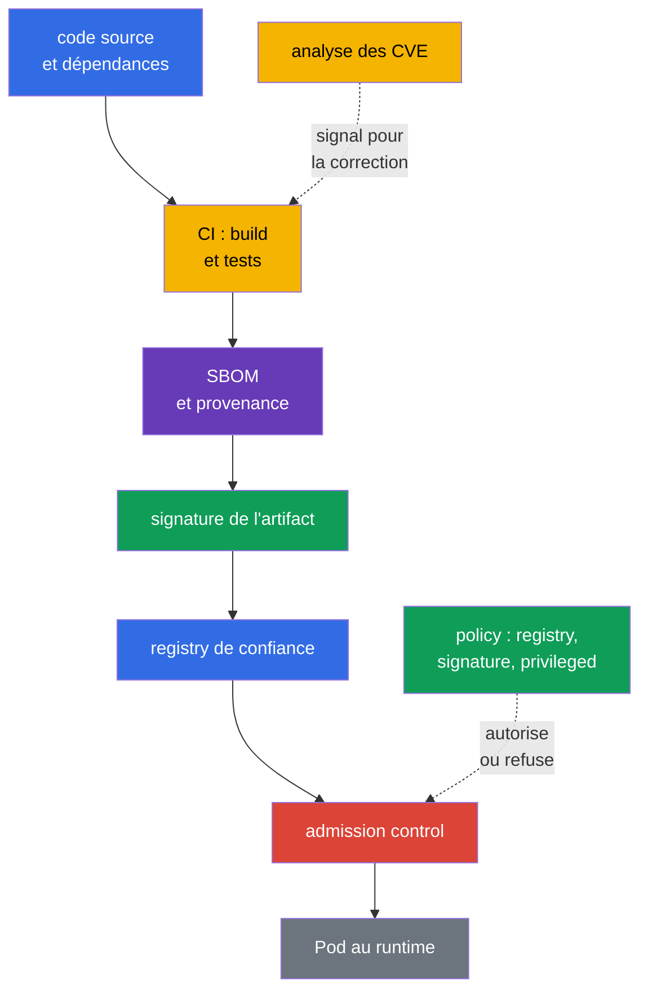
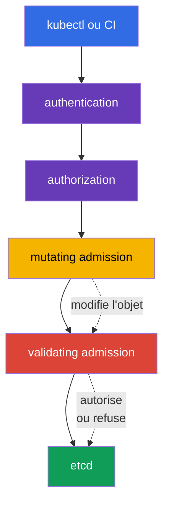

[Русская версия](ru.md) · [Eng version](README.md) · [Versión en español](es.md) · [Deutsche Version](de.md) · [ქართული ვერსია](ge.md) · [繁體中文版](tw.md) · [日本語版](jp.md)

# Chapitre 17. Supply chain, registres d'images et admission control

> **La suite.** Au chapitre 16, nous avons vu comment du code malveillant, une image vulnérable et l'élévation de privilèges deviennent des menaces pour le cluster. Nous construisons maintenant une protection avant l'exécution de la charge de travail : nous retraçons le chemin de l'artifact depuis le code source, n'autorisons les images qu'à partir d'une source de confiance et contrôlons la requête vers l'API Kubernetes. Il s'agit du domaine KCSA **Platform Security**, dont le poids est de 16 %. Les exemples et les noms d'API sont orientés vers Kubernetes `v1.36`.

La sécurité de la supply chain ne se réduit pas à un seul scanner ou à une signature. C'est une chaîne de preuves : on sait clairement **ce qui** est entré dans l'image, **par qui et comment** elle a été construite, d'où elle provient et si l'objet respecte les règles de l'organisation au moment de sa création. Si un seul maillon n'est pas contrôlé, la confiance dans l'artifact s'affaiblit.

## 17.1 Supply chain : du code au runtime

La **software supply chain** est le parcours du logiciel depuis le code source et les dépendances tierces, à travers le build, les tests et la publication, jusqu'à l'image exécutée par un `Pod`. Dans Kubernetes, la frontière de confiance ne se situe pas uniquement autour de l'API : un package, un runner CI ou un registry compromis peut livrer du code malveillant dans le cluster avant même que les contrôles runtime habituels ne s'appliquent.

Une chaîne pratique comporte généralement les maillons suivants :

| Maillon | Ce qui peut mal se passer | Exemples de contrôle |
|---|---|---|
| Code et dépendances | secret dans le dépôt, bibliothèque vulnérable ou remplacée | review, SCA, gestion des dépendances, contrôle des secrets |
| Build CI | un runner non sécurisé construit un autre code | build isolé, privilèges minimaux, journaux, reproductibilité |
| Image et metadata | composition ou origine de l'artifact inconnue | SBOM, digest, provenance, signature |
| Registry | remplacement de tag, publication d'une image non vérifiée | accès par IAM/RBAC, dépôts privés, immutable tags, sources de confiance |
| Admission et runtime | un objet avec une configuration dangereuse est admis dans le cluster | policy, vérification de signature, PSA, observabilité |

Un **digest**, par exemple `@sha256:...`, désigne sans ambiguïté le contenu d'une image. Le tag `:latest` est pratique pour le développement, mais il est modifiable : le même tag peut aujourd'hui et demain désigner des octets différents. Un digest ne rend pas une image sûre, mais il permet de figer l'artifact précis qui a été contrôlé et exécuté.

### SBOM : inventaire de la composition

Un **Software Bill of Materials (SBOM)** est une liste lisible par machine des composants, de leurs versions et parfois de leurs relations au sein d'un artifact livré. Il répond à la question : « Avons-nous dans nos images une bibliothèque pour laquelle une CVE vient d'être publiée ? » Un SBOM ne corrige pas une vulnérabilité et ne confirme pas que le build est fiable, mais il réduit le temps nécessaire pour trouver les charges de travail touchées.

Les formats ouverts courants sont **SPDX** et **CycloneDX**. Ils remplissent une tâche d'inventaire semblable, mais diffèrent par leur modèle de données et leur écosystème. `syft` est un exemple d'outil qui crée un SBOM pour un système de fichiers ou une container image. À l'examen, il est important de distinguer le rôle du format et celui de l'outil : SPDX/CycloneDX décrivent un SBOM, tandis que `syft` aide à le produire.

### Signature, `cosign` et sigstore

Une signature relie un artifact à l'identity de la partie signataire. Avant l'exécution, le système de vérification s'assure que la signature correspond au digest attendu et à la clé ou l'identity autorisée. La signature confirme donc l'authenticité (association à une signing identity de confiance) et l'intégrité (l'artifact n'a pas été modifié discrètement après la signature), mais pas l'origine du build - c'est une tâche distincte de provenance/attestation - et elle ne prouve pas à elle seule l'absence de CVE ni la configuration sûre d'un `Pod`.

`cosign` est un outil de signature et de vérification des container artifacts. **sigstore** est un écosystème qui simplifie le travail avec les signatures, les identity et un journal de transparence. Selon le modèle de confiance, l'organisation peut utiliser des clés, l'identity du système CI ou une policy d'entreprise. L'important n'est pas la commande spécifique, mais la règle : vérifier la signature avant l'admission et l'associer à un digest immutable, pas seulement à un tag modifiable.

### SLSA et provenance

**SLSA v1.2** (Supply-chain Levels for Software Artifacts) établit un cadre d'exigences pour la chaîne d'approvisionnement avec des tracks indépendants **Build** et **Source**. Chaque track possède ses propres niveaux et exigences : le niveau Build n'est pas une affirmation sur le niveau Source, et inversement. C'est pourquoi le niveau est toujours indiqué avec son track et ne reçoit pas de propriétés qui ne sont pas déclarées par une exigence SLSA précise. La **provenance** est un enregistrement de l'origine : quel code source, processus et builder ont créé l'artifact. Un reproducible build est une propriété utile du processus, mais n'est pas un synonyme universel d'un niveau SLSA. SLSA n'est pas une API Kubernetes et ne remplace pas une admission policy. C'est un langage permettant à l'équipe de formuler et vérifier des exigences relatives à la chaîne d'approvisionnement.

### Chaîne de bout en bout : threat → control → evidence

| Étape | Menace | Control | Evidence |
|---|---|---|---|
| source/dependency | dépendance malveillante ou vulnérable | review, SCA, secret scanning | PR/review et SCA report |
| build | CI construit le mauvais source | builder protégé et provenance | build record, source revision, artifact digest |
| artifact | un mutable tag est remplacé | immutable digest | deployment/reference sur `@sha256:...` |
| inventory | composition de l'image inconnue | SBOM | SPDX/CycloneDX document associé au digest |
| release | publisher inconnu | signature verification | verification result/signing identity |
| admission/deployment | artifact ou manifest inadapté | allowlist/policy/PSA | admission allow/deny/audit event |
| runtime | nouvelle CVE ou anomalous behavior | re-scan et runtime monitoring | scan report, registry/runtime telemetry |

La chaîne ne transforme pas un scanner en proof of safety : le digest fige le content, la signature relie l'artifact à une identity, le SBOM décrit la composition et la provenance décrit le build path déclaré. Chaque artifact fournit une evidence distincte et a sa propre limite.

## 17.2 Image repository et confiance dans les images

Un **image repository** ou registry stocke les images ainsi que leurs tags, digest, signatures et metadata associées. Un registry public est utile pour la distribution, mais une organisation ne doit pas considérer chaque image publique comme digne de confiance. La confiance signifie que la source, le propriétaire, le processus de publication et les résultats des contrôles respectent les règles de l'organisation.

| Approche | Bénéfice | Risque résiduel et contrôle |
|---|---|---|
| Registry autorisé | limite les sources d'images | un registry de confiance exige aussi une gestion des accès et du scanning |
| Registry privé | limite la publication et le download, prend en charge les artifacts internes | ne rend pas une image automatiquement sûre ; des droits, un audit et un processus de publication sont nécessaires |
| Allowlist de repository | interdit les images publiques accidentelles et les fautes de frappe dans le nom | la règle doit prendre en compte tous les chemins autorisés et la migration |
| Digest au lieu d'un tag | fige un contenu précis | ne confirme pas que le contenu est sûr ou signé |
| Signature | relie l'artifact à une identity conformément à une policy | ne remplace pas le SBOM, la provenance, l'analyse des CVE ou le contrôle du manifest |
| provenance | décrit le chemin de build déclaré de l'artifact | n'est ni une signature, ni un SBOM, ni un niveau SLSA |
| SLSA v1.2 | définit les exigences des tracks indépendants Build et Source | n'est ni un SBOM, ni une signature, ni un synonyme universel de reproducible build |

L'accès à un registry privé est généralement accordé aux identity avec le minimum de droits nécessaire, et les credentials ne sont pas placés dans l'image ou Git. Kubernetes peut utiliser des `imagePullSecrets`, mais ce n'est pas une raison pour autoriser une lecture étendue de tous les secrets dans un namespace. Les credentials du registry, comme les autres secrets, sont protégés par RBAC, la rotation et un périmètre minimal.

### Pourquoi analyser les images

Un scanner compare les packages et bibliothèques d'une image avec les vulnérabilités connues et les bases CVE. **Trivy** est un outil courant pour ce contrôle ; il peut aussi analyser les configurations et les secrets, mais dans le contexte de l'image security, son rôle principal est de détecter les vulnérabilités connues dans l'image. Le résultat du scan aide à choisir une base corrigée ou une version de package et à établir un seuil pour CI.

Le scanning ne voit pas toutes les classes de risque. Il peut produire des faux positifs, et une CVE connue peut ne pas s'appliquer à un chemin d'exécution donné. À l'inverse, l'absence de CVE détectées ne signifie pas que l'image est fiable : elle peut contenir des secrets, une logique malveillante ou un `securityContext` non sûr. Le scanning est donc associé au SBOM, à la signature, au review et à l'admission policy.

## 17.3 Admission control : décision avant l'écriture dans le cluster

Après authentication et authorization, Kubernetes API Server exécute l'admission control avant de sauvegarder l'objet dans etcd. À cette étape, il est possible d'évaluer non seulement l'utilisateur, mais aussi l'objet demandé : image, champs `securityContext`, labels et conformité aux règles d'entreprise.

Un **mutating admission webhook** peut modifier l'objet, par exemple en ajoutant un label, une annotation ou un sidecar obligatoire. Il est utile pour la standardisation, mais la modification de l'objet doit être prévisible : une mutation peu claire complique l'investigation et peut entrer en conflit avec une autre policy.

Un **validating admission webhook** évalue la version finale de l'objet et autorise ou refuse la requête. Il ne doit pas modifier l'objet. Les webhooks mutating et validating fonctionnent tous deux comme des services externes ; leur disponibilité et la confiance TLS sont donc importantes : une configuration incorrecte peut soit arrêter le deploy, soit laisser une voie de contournement indésirable. C'est précisément le comportement lors de l'indisponibilité d'un webhook que régit le champ `failurePolicy` de `ValidatingWebhookConfiguration`/`MutatingWebhookConfiguration` : `Fail` arrête la requête si le webhook est indisponible ou renvoie une erreur (plus sûr, mais peut bloquer le deploy en cas de panne du webhook), tandis que `Ignore` laisse passer la requête sans appliquer le contrôle du webhook dans ce cas - autrement dit, une défaillance ou l'indisponibilité temporaire d'un webhook avec `failurePolicy: Ignore` désactive silencieusement le contrôle qui aurait dû s'appliquer, sans aucune modification de l'objet lui-même.

Kubernetes propose aussi des declarative admission policies intégrées en **CEL** (Common Expression Language - langage d'expressions intégré à Kubernetes API pour décrire des conditions et des règles sans exécuter de code arbitraire : une policy définit une expression CEL, et l'API server l'évalue lui-même pour un objet précis). `MutatingAdmissionPolicy` modifie les API-objets correspondants sans webhook HTTP distinct ; la fonctionnalité est stable depuis Kubernetes `v1.36` et activée par défaut. `ValidatingAdmissionPolicy` réalise une validation declarative intégrée et peut refuser une requête. Les deux mécanismes utilisent CEL, mais répondent à des tâches différentes : la mutation modifie l'objet, la validation l'accepte ou le refuse. Pour une logique externe - par exemple une requête réseau vers un registry ou un verifier distinct - un admission webhook / policy engine externe reste nécessaire, ou bien un verification result de confiance préalablement obtenu et accessible à la policy elle-même.

`ValidatingAdmissionPolicy` définit la validation logic et est un policy object de portée cluster. Pour qu'une policy soit réellement appliquée, on crée un `ValidatingAdmissionPolicyBinding` distinct : le binding fait référence à la policy, définit les `validationActions` et peut restreindre l'application via `matchResources`, y compris avec `namespaceSelector`. Il ne faut donc pas dire qu'une `ValidatingAdmissionPolicy` se trouve « dans un namespace » ; la portée de namespace est définie par le binding/`matchResources`.

### Policy engines : OPA/Gatekeeper et Kyverno

**OPA** (Open Policy Agent) est un moteur général de policies, et **Gatekeeper** l'adapte à Kubernetes admission et à la gestion des contraintes. Les policies sont généralement décrites avec Rego. **Kyverno** est un policy engine orienté Kubernetes ; ses règles décrivent la validation, la mutation et parfois la génération d'objets dans le style Kubernetes YAML. Ces outils ne constituent pas une partie obligatoire interchangeable de Kubernetes : l'organisation les choisit selon ses exigences, les compétences de l'équipe et le policy landscape existant.

Au niveau KCSA, il est important de comprendre le résultat, pas d'écrire Rego ou des règles Kyverno complexes. Deux policies typiques sont les suivantes :

| Intention de la policy | Ce qu'elle contrôle | Menace réduite |
|---|---|---|
| `allowed-registries` | chaque `container` et `initContainer` utilise une image dont le préfixe est `registry.corp.example/` | exécution d'une image publique non vérifiée ou accidentelle |
| `deny-privileged` | `securityContext.privileged` n'est pas égal à `true` | extension des privilèges et augmentation du risque de container escape |

Ces règles se complètent, sans se remplacer. Une allowlist de registry ne garantit pas un `Pod` sûr ; interdire `privileged` n'indique pas d'où provient l'image. De plus, une policy doit être appliquée à tous les chemins appropriés de création de charges de travail, notamment `Deployment`, `Job` et `CronJob`, car le `Pod` réel est créé par un controller.

## 17.4 Comment cela s'applique en pratique

Une équipe met généralement en place plusieurs gates, et non une « barrière parfaite » unique :

1. Le développeur fige les dépendances et ne place pas de secrets dans le code ou l'image.
2. CI construit une image à partir d'un code source contrôlé, produit un SBOM, l'analyse et publie l'artifact dans un registry privé.
3. CI signe le digest et conserve la provenance afin que la release puisse être reliée à un build précis.
4. La couche admission control limite les registry autorisés ; la vérification de signature est effectuée par un admission webhook / verifier externe, ou une policy contrôle un verification result de confiance déjà fourni. Une validating policy distincte ou PSA peut refuser indépendamment des champs de workload dangereux, par exemple `privileged: true`.
5. Après le deploy, l'équipe surveille les nouvelles CVE, analyse à nouveau les images existantes et met à jour les workloads affectés.

Il est plus sûr d'introduire une policy progressivement : observer d'abord les violations et convenir des exceptions, puis activer le refus. Une exception doit être étroite, avoir un responsable et une date de révision. Une « brèche » globale permanente pour une ancienne charge de travail transforme la policy en formalité.

## 17.5 Exam vocabulary / Mini-glossaire

| Terme | Signification |
|---|---|
| admission control | étape de traitement de la requête API après authentication et authorization, avant l'écriture de l'objet |
| artifact | résultat d'un build, par exemple une container image, un SBOM ou une signature |
| `MutatingAdmissionPolicy` | Declarative admission policy intégrée qui utilise CEL pour la mutation des API-objets ; stable depuis Kubernetes v1.36. |
| `ValidatingAdmissionPolicy` | Declarative admission policy intégrée qui utilise CEL pour la validation des API-objets. |
| CEL | Common Expression Language ; utilisé par les `MutatingAdmissionPolicy` et `ValidatingAdmissionPolicy` intégrées. |
| digest | identifiant cryptographique immutable du contenu précis d'une image |
| image registry | stockage de container images et des metadata associées |
| provenance | informations sur l'origine de l'artifact et son processus de build |
| SBOM | liste lisible par machine des composants et versions d'un artifact |
| SLSA v1.2 | Cadre d'exigences avec des tracks indépendants Build et Source ; le niveau est indiqué avec son track. |

## 17.6 Exam Essentials / Résumé du chapitre

- La supply chain couvre le parcours depuis le code et les dépendances jusqu'à l'exécution de l'image ; la protection exige plusieurs contrôles indépendants.
- Un SBOM répond à la question de la composition de l'artifact ; SPDX et CycloneDX sont des formats SBOM, et `syft` aide à les créer.
- La signature via `cosign`/sigstore confirme l'authenticité (association à une signing identity de confiance) et l'intégrité selon une policy, mais ne confirme pas l'origine du build et ne remplace ni le scanning des CVE ni une configuration sûre.
- SLSA v1.2 définit les tracks indépendants Build et Source, et la provenance décrit l'origine de l'artifact ; ni SLSA ni la provenance ne sont interchangeables avec un SBOM ou une signature. Un reproducible build n'est pas un synonyme universel d'un niveau SLSA.
- Un registry de confiance ou privé réduit le risque de source non contrôlée, et `Trivy` aide à détecter les vulnérabilités connues.
- La mutation peut être réalisée par un `MutatingAdmissionWebhook` externe comme par une `MutatingAdmissionPolicy` intégrée en CEL ; la validation se fait par un validating webhook externe ou une `ValidatingAdmissionPolicy` intégrée en CEL.

## 17.7 À ne pas confondre et présence à l'examen

Les questions KCSA vérifient généralement la fonction et les limites des contrôles. Distinguez : un SBOM inventorie la composition, un scanner recherche les vulnérabilités connues, une signature relie l'artifact à une identity, la provenance décrit le chemin de build déclaré, et une admission policy décide si l'objet est admis dans le cluster. SLSA v1.2 définit les tracks indépendants Build et Source, et ne remplace pas un SBOM, une signature ou la provenance. Ne confondez pas un registry privé avec une garantie de sécurité, un digest avec une signature, ni un reproducible build avec un niveau SLSA universel.

Une formulation fréquente propose de sélectionner un contrôle pour une menace précise. Pour interdire les images issues de sources publiques, une allowlist de registry dans une admission policy convient. Pour interdire `privileged`, utilisez une validating policy ou Pod Security Admission avec un profil approprié. Pour ajouter des metadata obligatoires, utilisez mutating admission. Les `MutatingAdmissionPolicy` et `ValidatingAdmissionPolicy` intégrées utilisent CEL, mais la première modifie l'objet et la seconde le valide. Un webhook est nécessaire non parce que Kubernetes ne sait pas réaliser la mutation/validation declarative, mais lorsqu'une logique ou une intégration externe, inaccessible à une CEL-policy intégrée, est requise.

## 17.8 Questions d'auto-évaluation

### 1. Quelle tâche un SBOM remplit-il avant tout pour une container image ?

   - a. Il répertorie les composants et versions afin d'identifier les artifacts touchés par une vulnérabilité.

   - b. Il empêche un `Pod` d'obtenir le mode privilégié.

   - c. Il corrige automatiquement les CVE dans l'image de base.

   - d. Il chiffre l'image lors de son transfert vers le registry.

Réponse et explication

**Bonne réponse : a.** Un SBOM inventorie la composition de l'artifact. Il aide à trouver les images affectées, mais ne les chiffre pas, n'applique pas de policy et ne corrige pas les dépendances.

### 2. Que confirme le plus précisément une signature d'image dont la vérification a réussi selon la trust policy de l'organisation ?

   - a. Que le scanner a garanti l'absence de vulnérabilités connues et inconnues dans l'artifact.
   - b. Qu'un registry privé a, à lui seul, prouvé la provenance et l'integrity de chaque image stockée.
   - c. Qu'une cryptographic assertion sur un artifact précis a été vérifiée avec succès pour une key/identity autorisée conformément à la trust policy.
   - d. Que le runtime exécutera assurément le conteneur comme non-root, indépendamment de sa Pod configuration.

Réponse et explication

**Bonne réponse : c.** Une signature verification réussie confirme une cryptographic assertion sur un artifact précis dans le contexte de la trust policy configurée. Elle ne prouve pas l'absence de CVE, ne remplace pas la provenance et ne détermine pas le runtime securityContext.

### 3. Quelle mesure empêche le mieux l'exécution d'une image depuis un registry public accidentel ?

   - a. Activer `privileged: true` pour un conteneur de diagnostic.

   - b. Conserver les credentials du registry dans le Dockerfile.

   - c. Utiliser uniquement le tag `latest`.

   - d. Configurer une validating policy avec une allowlist des registry autorisés.

Réponse et explication

**Bonne réponse : d.** Une validating policy peut contrôler le nom de chaque image et refuser l'objet avant son écriture dans etcd. `latest` est modifiable, et les credentials ne doivent pas entrer dans l'image.

### 4. Quelle est la différence principale entre les mutating et validating admission webhooks ?

   - a. Un validating webhook chiffre un `Secret`, un mutating webhook crée un SBOM.

   - b. Un mutating webhook modifie l'objet, un validating webhook décide de l'autoriser ou de le refuser.

   - c. Il n'y a pas de différence entre eux, ce sont deux noms du même mécanisme.

   - d. Un mutating webhook fonctionne uniquement avec `Service`, un validating uniquement avec `Pod`.

Réponse et explication

**Bonne réponse : b.** La requête passe par la mutation avant la validation ; un validating webhook contrôle la forme finale de l'objet et ne doit pas la modifier.

### 5. Quel composant permet de décrire une partie des contrôles validating intégrés de Kubernetes avec des expressions CEL, sans webhook distinct ?

   - a. `PodDisruptionBudget`.

   - b. `imagePullSecret`.

   - c. `ValidatingAdmissionPolicy`.

   - d. `NetworkPolicy`.

Réponse et explication

**Bonne réponse : c.** `ValidatingAdmissionPolicy` utilise CEL pour les contrôles déclaratifs des objets API. Les autres ressources traitent des tâches de réseau, de disponibilité et d'authentification au registry.

> **La suite.** Pour la configuration pratique d'admission et des policy engines, consultez le chapitre 20 CKS. La chaîne d'approvisionnement est détaillée dans les chapitres 25-28 CKS : SBOM/CI/CD/artifact repositories, registry/signature/validation, analyse statique et image scanning. Pour les bases du fonctionnement des images et de l'API admission, les chapitres 23 et 21 CKA sont utiles.

[Table des matières](../README_FR.md) · [Chapitre 16](../16/fr.md) · [Chapitre 18](../18/fr.md)
