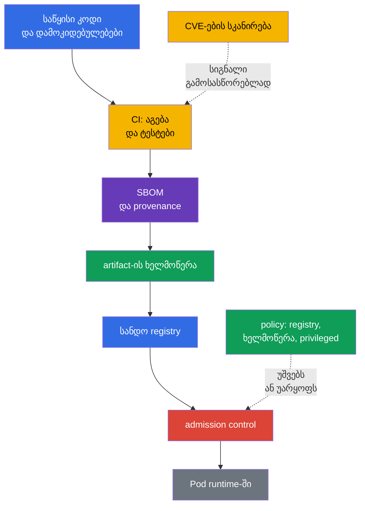
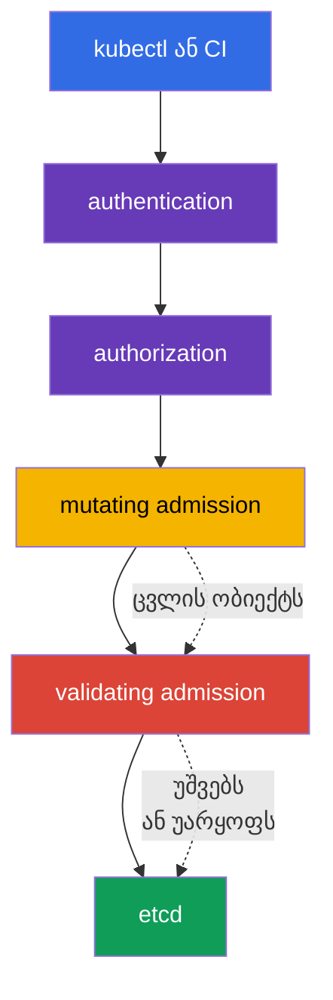

[Русская версия](ru.md) · [Eng version](README.md) · [Versión en español](es.md) · [Version française](fr.md) · [Deutsche Version](de.md) · [繁體中文版](tw.md) · [日本語版](jp.md)

# თავი 17. Supply chain, image registry-ები და admission control

> **რა არის შემდეგ.** მე-16 თავში განვიხილეთ, როგორ იქცევა მავნე კოდი, მოწყვლადი image და პრივილეგიების გაზრდა კლასტერისთვის საფრთხედ. ახლა დაცვას workload-ის გაშვებამდე ვაწყობთ: ვაკვირდებით artifact-ის გზას საწყისი კოდიდან, ვუშვებთ image-ებს მხოლოდ სანდო წყაროდან და ვამოწმებთ Kubernetes API-ს მოთხოვნას. ეს არის KCSA-ს **Platform Security** დომენი, რომლის წონაა 16%. მაგალითები და API-ს სახელები ორიენტირებულია Kubernetes `v1.36`-ზე.

Supply chain-ის უსაფრთხოება არ შემოიფარგლება ერთი scanner-ით ან ხელმოწერით. ეს მტკიცებულებების ჯაჭვია: გასაგებია, **რა** მოხვდა image-ში, **ვის მიერ და როგორ** აიგო ის, საიდან იქნა მიღებული და შექმნის მომენტში შეესაბამება თუ არა ობიექტი ორგანიზაციის წესებს. თუ ერთი მონაკვეთიც კი არ კონტროლდება, artifact-ისადმი ნდობა სუსტდება.

## 17.1 Supply chain: კოდიდან runtime-მდე

**Software supply chain** არის პროგრამული უზრუნველყოფის გზა საწყისი კოდიდან და გარე დამოკიდებულებებიდან, აგების, ტესტირებისა და გამოქვეყნების გავლით, იმ image-მდე, რომელსაც `Pod` უშვებს. Kubernetes-ში ნდობის საზღვარი მხოლოდ API-ს გარშემო არ გადის: კომპრომეტირებულ პაკეტს, CI runner-ს ან registry-ს შეუძლია მავნე კოდი კლასტერში მანამდე მიიტანოს, სანამ ჩვეულებრივი runtime-control-ები ამოქმედდება.

პრაქტიკული ჯაჭვი, როგორც წესი, ასეთ რგოლებს შეიცავს:

| რგოლი | რა შეიძლება მოხდეს | კონტროლის მაგალითები |
|---|---|---|
| კოდი და დამოკიდებულებები | secret რეპოზიტორიაში, მოწყვლადი ან ჩანაცვლებული ბიბლიოთეკა | review, SCA, დამოკიდებულებების მართვა, secret-ების შემოწმება |
| CI build | დაუცველი runner სხვა კოდს აგებს | იზოლირებული build, მინიმალური უფლებები, ჟურნალები, reproducibility |
| Image და metadata | artifact-ის შემადგენლობა ან წარმომავლობა უცნობია | SBOM, digest, provenance, ხელმოწერა |
| Registry | tag-ის ჩანაცვლება, შეუმოწმებელი image-ის გამოქვეყნება | წვდომა IAM/RBAC-ით, private repository-ები, immutable tags, სანდო წყაროები |
| Admission და runtime | კლასტერში სახიფათო კონფიგურაციის მქონე ობიექტი დაიშვა | policy, ხელმოწერის შემოწმება, PSA, observability |

**Digest**, მაგალითად `@sha256:...`, image-ის შიგთავსზე ერთმნიშვნელოვნად მიუთითებს. Tag `:latest` მოსახერხებელია დამუშავებისთვის, მაგრამ ცვალებადია: ერთი და იგივე tag დღეს და ხვალ შეიძლება სხვადასხვა ბაიტს აღნიშნავდეს. Digest image-ს უსაფრთხოს არ ხდის, თუმცა საშუალებას გვაძლევს დავაფიქსიროთ, კონკრეტულად რომელი artifact შემოწმდა და გაეშვა.

### SBOM: შემადგენლობის ინვენტარი

**Software Bill of Materials (SBOM)** არის მიწოდებულ artifact-ში არსებული კომპონენტების, ვერსიებისა და ზოგჯერ მათი ურთიერთკავშირების მანქანის მიერ წაკითხვადი სია. ის პასუხობს კითხვას: „არის თუ არა ჩვენს image-ებში ბიბლიოთეკა, რომლისთვისაც CVE ახლახან გამოქვეყნდა?“ SBOM მოწყვლადობას არ ასწორებს და არც build-ის საიმედოობას ადასტურებს, მაგრამ ამცირებს დაზარალებული workload-ების მოძებნის დროს.

გავრცელებული ღია ფორმატებია **SPDX** და **CycloneDX**. ისინი ინვენტარიზაციის მსგავს ამოცანას წყვეტენ, მაგრამ განსხვავდებიან მონაცემთა მოდელითა და ეკოსისტემით. `syft` არის ინსტრუმენტის მაგალითი, რომელიც ფაილური სისტემისთვის ან container image-ისთვის SBOM-ს ქმნის. გამოცდაზე მნიშვნელოვანია ფორმატისა და ინსტრუმენტის დანიშნულებების გარჩევა: SPDX/CycloneDX აღწერს SBOM-ს, ხოლო `syft` მის შექმნაში გვეხმარება.

### ხელმოწერა, `cosign` და sigstore

ხელმოწერა artifact-ს ხელმომწერი მხარის identity-სთან აკავშირებს. გაშვებამდე შემმოწმებელი სისტემა რწმუნდება, რომ ხელმოწერა საჭირო digest-ს ეკუთვნის და დაშვებულ key-ს ან identity-ს შეესაბამება. ამიტომ ხელმოწერა ადასტურებს ნამდვილობას (association სანდო signing identity-სთან) და მთლიანობას (რომ artifact ხელმოწერის შემდეგ შეუმჩნევლად არ შეცვლილა), მაგრამ არა build-ის წარმომავლობას, რაც provenance/attestation-ის ცალკე ამოცანაა, და თავისთავად არც CVE-ების არარსებობას ან `Pod`-ის უსაფრთხო კონფიგურაციას ამტკიცებს.

`cosign` არის container artifact-ების ხელმოწერისა და შემოწმების ინსტრუმენტი. **sigstore** არის ეკოსისტემა, რომელიც ხელმოწერებთან, identity-სა და გამჭვირვალე ჟურნალთან მუშაობას ამარტივებს. ნდობის მოდელის მიხედვით, ორგანიზაციას შეუძლია გამოიყენოს key-ები, CI სისტემის identity ან კორპორაციული policy. მნიშვნელოვანია არა კონკრეტული ბრძანება, არამედ წესი: ხელმოწერა admission-მდე შემოწმდეს და დაუკავშირდეს immutable digest-ს და არა მხოლოდ ცვალებად tag-ს.

### SLSA და provenance

**SLSA v1.2** (Supply-chain Levels for Software Artifacts) supply chain-ის მოთხოვნების ჩარჩოს განსაზღვრავს დამოუკიდებელი **Build** და **Source** track-ებით. თითოეულ track-ს საკუთარი დონეები და მოთხოვნები აქვს: Build-ის დონე Source-ის დონეზე არაფერს ამტკიცებს და პირიქით. ამიტომ დონე ყოველთვის track-თან ერთად უნდა მიეთითოს და მას არ უნდა მიეწეროს თვისებები, რომლებიც SLSA-ს კონკრეტულ მოთხოვნაში არ არის გაცხადებული. **Provenance** არის წარმომავლობის ჩანაწერი: რომელმა საწყისმა კოდმა, პროცესმა და builder-მა შექმნა artifact. Reproducible build პროცესის სასარგებლო თვისებაა, მაგრამ არა SLSA-ს დონის უნივერსალური სინონიმი. SLSA არ არის Kubernetes API და admission policy-ს არ ცვლის. ეს არის ენა, რომლის საშუალებითაც გუნდი supply chain-ის მოთხოვნებს აყალიბებს და ამოწმებს.

### გამჭოლი ჯაჭვი: threat → control → evidence

| ეტაპი | საფრთხე | Control | Evidence |
|---|---|---|---|
| source/dependency | მავნე ან მოწყვლადი დამოკიდებულება | review, SCA, secret scanning | PR/review და SCA report |
| build | CI არასწორ source-ს აგებს | დაცული builder და provenance | build record, source revision, artifact digest |
| artifact | mutable tag ჩანაცვლებულია | immutable digest | deployment/reference `@sha256:...`-ზე |
| inventory | image-ის შემადგენლობა უცნობია | SBOM | digest-თან დაკავშირებული SPDX/CycloneDX document |
| release | უცნობი publisher | signature verification | verification result/signing identity |
| admission/deployment | შეუსაბამო artifact ან manifest | allowlist/policy/PSA | admission allow/deny/audit event |
| runtime | ახალი CVE ან anomalous behavior | re-scan და runtime monitoring | scan report, registry/runtime telemetry |

ჯაჭვი scanner-ს safety-ის proof-ად არ აქცევს: digest აფიქსირებს content-ს, signature artifact-ს identity-სთან აკავშირებს, SBOM შემადგენლობას აღწერს, ხოლო provenance გაცხადებულ build path-ს აღწერს. თითოეული artifact ცალკე evidence-ს იძლევა და საკუთარი შეზღუდვა აქვს.

## 17.2 Image repository და image-ებისადმი ნდობა

**Image repository** ან registry ინახავს image-ებსა და მათ tag-ებს, digest-ებს, ხელმოწერებსა და დაკავშირებულ metadata-ს. Public registry გავრცელებისთვის სასარგებლოა, მაგრამ ორგანიზაციამ ყველა public image სანდოდ არ უნდა მიიჩნიოს. ნდობა ნიშნავს, რომ წყარო, მფლობელი, გამოქვეყნების პროცესი და შემოწმებების შედეგი ორგანიზაციის წესებს შეესაბამება.

| მიდგომა | სარგებელი | ნარჩენი რისკი და კონტროლი |
|---|---|---|
| დაშვებული registry | ზღუდავს image-ების წყაროებს | სანდო registry-ც საჭიროებს წვდომის მართვასა და სკანირებას |
| Private registry | ზღუდავს გამოქვეყნებასა და download-ს, მხარს უჭერს შიდა artifact-ებს | image-ს ავტომატურად უსაფრთხოს არ ხდის; საჭიროა უფლებები, audit და გამოქვეყნების პროცესი |
| Repository allowlist | კრძალავს შემთხვევით public image-ებს და სახელში შეცდომებს | წესმა ყველა დასაშვები გზა და migration უნდა გაითვალისწინოს |
| Digest tag-ის ნაცვლად | აფიქსირებს კონკრეტულ შიგთავსს | არ ადასტურებს, რომ შიგთავსი უსაფრთხოა ან ხელმოწერილია |
| ხელმოწერა | policy-ს მიხედვით artifact-ს identity-სთან აკავშირებს | არ ცვლის SBOM-ს, provenance-ს, CVE analysis-ს ან manifest-ის შემოწმებას |
| provenance | აღწერს artifact-ის build-ის გაცხადებულ გზას | არ არის ხელმოწერა, SBOM ან SLSA-ს დონე |
| SLSA v1.2 | განსაზღვრავს დამოუკიდებელი Build და Source track-ების მოთხოვნებს | არ არის SBOM, ხელმოწერა ან reproducible build-ის უნივერსალური სინონიმი |

Private registry-ზე წვდომა, როგორც წესი, ენიჭება მინიმალურად აუცილებელ identity-ებს, ხოლო credentials არ თავსდება image-ში ან Git-ში. Kubernetes-ს შეუძლია `imagePullSecrets` გამოიყენოს, მაგრამ ეს namespace-ში ყველა secret-ის წაკითხვის ფართო უფლების არგუმენტი არ არის. Registry credentials, ისევე როგორც სხვა secret-ები, დაცულია RBAC-ით, rotation-ითა და მინიმალური scope-ით.

### რატომ უნდა დასკანირდეს image-ები

Scanner image-ის პაკეტებსა და ბიბლიოთეკებს ცნობილ მოწყვლადობებსა და CVE ბაზებს ადარებს. **Trivy** ასეთი შემოწმების გავრცელებული ინსტრუმენტია; მას კონფიგურაციებისა და secret-ების ანალიზიც შეუძლია, მაგრამ image security-ის კონტექსტში მისი მთავარი როლი image-ში ცნობილი მოწყვლადობების აღმოჩენაა. სკანირების შედეგი გვეხმარება შესწორებული base-ის ან package version-ის არჩევასა და CI-სთვის threshold-ის განსაზღვრაში.

სკანირება ყველა რისკის კლასს ვერ ხედავს. მას შეიძლება false positive შედეგები ჰქონდეს, ხოლო ცნობილი CVE კონკრეტული execution path-ისთვის გამოუყენებელი იყოს. და პირიქით, ნაპოვნი CVE-ების არარსებობა არ ნიშნავს, რომ image სანდოა: მასში შეიძლება იყოს secret-ები, მავნე ლოგიკა ან არაუსაფრთხო `securityContext`. ამიტომ სკანირება SBOM-ს, ხელმოწერას, review-სა და admission policy-ს ერწყმის.

## 17.3 Admission control: გადაწყვეტილება კლასტერში ჩაწერამდე

Authentication-ისა და authorization-ის შემდეგ Kubernetes API Server ობიექტის etcd-ში შენახვამდე admission control-ს ასრულებს. ამ ეტაპზე შეიძლება შეფასდეს არა მხოლოდ მომხმარებელი, არამედ თავად მოთხოვნილი ობიექტიც: image, `securityContext`-ის ველები, labels და კორპორაციულ წესებთან შესაბამისობა.

**Mutating admission webhook**-ს შეუძლია ობიექტის შეცვლა, მაგალითად სავალდებულო label-ის, annotation-ის ან sidecar-ის დამატება. ის სტანდარტიზაციისთვის სასარგებლოა, მაგრამ ობიექტის ცვლილება პროგნოზირებადი უნდა იყოს: გაურკვეველი mutation გამოძიებას ართულებს და შეიძლება სხვა policy-სთან კონფლიქტში შევიდეს.

**Validating admission webhook** ობიექტის საბოლოო ვარიანტს აფასებს და მოთხოვნას უშვებს ან უარყოფს. მან ობიექტი არ უნდა შეცვალოს. Mutating და validating webhook-ები გარე service-ებად მუშაობენ, ამიტომ მათი ხელმისაწვდომობა და TLS trust მნიშვნელოვანია: არასწორმა კონფიგურაციამ შეიძლება deploy ან გააჩეროს, ან გვერდის ავლის არასასურველი გზა დატოვოს. Webhook-ის მიუწვდომლობისას სწორედ ამ ქცევას არეგულირებს `failurePolicy` ველი `ValidatingWebhookConfiguration`/`MutatingWebhookConfiguration`-ში: `Fail` მოთხოვნას აჩერებს, თუ webhook მიუწვდომელია ან error დააბრუნა (უფრო უსაფრთხოა, მაგრამ webhook-ის ხარვეზისას შეიძლება deploy დაბლოკოს), ხოლო `Ignore` ამ შემთხვევაში მოთხოვნას webhook-ის შემოწმების გარეშე ატარებს, ანუ `failurePolicy: Ignore`-ისას webhook-ის ხარვეზი ან დროებითი მიუწვდომლობა ჩუმად თიშავს კონტროლს, რომელიც უნდა ამოქმედებულიყო, თავად ობიექტში ყოველგვარი ცვლილების გარეშე.

Kubernetes ასევე გვთავაზობს ჩაშენებულ declarative admission policy-ებს **CEL**-ზე (Common Expression Language არის Kubernetes API-ში ჩაშენებული გამოსახულებების ენა, რომელიც პირობებისა და წესების აღწერას თვითნებური კოდის შესრულების გარეშე უზრუნველყოფს: policy განსაზღვრავს CEL expression-ს, ხოლო API server მას კონკრეტული ობიექტისთვის თავად ითვლის). `MutatingAdmissionPolicy` ცალკე HTTP webhook-ის გარეშე ცვლის შესაბამის API object-ებს; feature Kubernetes `v1.36`-დან stable არის და enabled by default. `ValidatingAdmissionPolicy` ჩაშენებულ declarative validation-ს ასრულებს და შეუძლია მოთხოვნის უარყოფა. ორივე მექანიზმი CEL-ს იყენებს, მაგრამ სხვადასხვა ამოცანას წყვეტს: mutation ობიექტს ცვლის, validation კი მას იღებს ან უარყოფს. გარე ლოგიკისთვის, მაგალითად registry-სთან network request-ის ან ცალკე verifier-ისთვის, კვლავ საჭიროა გარე admission webhook / policy engine ან წინასწარ მიღებული სანდო verification result, რომელიც თავად policy-სთვის არის ხელმისაწვდომი.

`ValidatingAdmissionPolicy` validation logic-ს განსაზღვრავს და cluster-scoped policy object-ია. Policy რეალურად რომ ამოქმედდეს, ცალკე `ValidatingAdmissionPolicyBinding` იქმნება: binding მიუთითებს policy-ზე, განსაზღვრავს `validationActions`-ს და შეუძლია გამოყენება `matchResources`-ის საშუალებით შეავიწროოს, მათ შორის `namespaceSelector`-ით. ამიტომ ვერ ვიტყვით, რომ `ValidatingAdmissionPolicy` „namespace-ში“ მდებარეობს; namespace scope binding/matchResources-ის საშუალებით განისაზღვრება.

### Policy engine-ები: OPA/Gatekeeper და Kyverno

**OPA** (Open Policy Agent) policy-ების ზოგადი engine-ია, ხოლო **Gatekeeper** მას Kubernetes admission-სა და შეზღუდვების მართვას არგებს. Policy-ები, როგორც წესი, Rego-ზე აღიწერება. **Kyverno** Kubernetes-ზე ორიენტირებული policy engine-ია; მისი წესები validation-ს, mutation-ს და ზოგჯერ ობიექტების გენერირებას Kubernetes YAML-ის სტილში აღწერს. ეს ინსტრუმენტები Kubernetes-ის ურთიერთჩანაცვლებადი სავალდებულო ნაწილი არ არის: ორგანიზაცია მათ მოთხოვნების, გუნდის კომპეტენციებისა და არსებული policy landscape-ის მიხედვით ირჩევს.

KCSA-ს დონეზე მნიშვნელოვანია შედეგის გაგება და არა Rego-ს ან Kyverno-ს რთული წესების წერა. ორი ტიპური policy ასე გამოიყურება:

| Policy-ს მიზანი | რას ამოწმებს | რომელი საფრთხე მცირდება |
|---|---|---|
| `allowed-registries` | თითოეული `container` და `initContainer` იყენებს image-ს პრეფიქსით `registry.corp.example/` | შეუმოწმებელი ან შემთხვევითი public image-ის გაშვება |
| `deny-privileged` | `securityContext.privileged` არ უდრის `true`-ს | პრივილეგიების გაფართოება და container escape-ის რისკის ზრდა |

ასეთი წესები ერთმანეთს ავსებს, მაგრამ არ ცვლის. Registry allowlist უსაფრთხო `Pod`-ის გარანტიას არ იძლევა; `privileged`-ის აკრძალვა არ გვატყობინებს, საიდან არის აღებული image. გარდა ამისა, policy workload-ების შექმნის ყველა შესაბამის გზაზე უნდა გავრცელდეს, მათ შორის `Deployment`, `Job` და `CronJob`, რადგან ფაქტობრივ `Pod`-ს controller ქმნის.

## 17.4 როგორ გამოიყენება ეს პრაქტიკაში

გუნდი, როგორც წესი, რამდენიმე gate-ს აწყობს და არა ერთ „იდეალურ“ ბარიერს:

1. Developer აფიქსირებს დამოკიდებულებებს და secret-ებს კოდში ან image-ში არ ათავსებს.
2. CI image-ს კონტროლირებადი საწყისი კოდიდან აგებს, ქმნის SBOM-ს, ასკანირებს მას და artifact-ს private registry-ში აქვეყნებს.
3. CI ხელს აწერს digest-ს და ინახავს provenance-ს, რათა release კონკრეტულ build-ს დაუკავშირდეს.
4. Admission control-ის ფენა ზღუდავს დაშვებულ registry-ებს; ხელმოწერის შემოწმებას admission webhook / გარე verifier ასრულებს, ან policy უკვე მიწოდებულ სანდო verification result-ს ამოწმებს. ცალკე validating policy-ს ან PSA-ს შეუძლია დამოუკიდებლად უარყოს workload-ის სახიფათო ველები, მაგალითად `privileged: true`.
5. Deploy-ის შემდეგ გუნდი ახალ CVE-ებს აკვირდება, არსებულ image-ებს ხელახლა ასკანირებს და დაზარალებულ workload-ებს ანახლებს.

Policy-ს ეტაპობრივი დანერგვა უფრო უსაფრთხოა: ჯერ დარღვევებს უნდა დავაკვირდეთ და გამონაკლისები შევათანხმოთ, შემდეგ კი უარყოფა ჩავრთოთ. გამონაკლისი ვიწრო უნდა იყოს, ჰყავდეს მფლობელი და ჰქონდეს გადახედვის ვადა. ძველი workload-ისთვის მუდმივი გლობალური „ხვრელი“ policy-ს ფორმალობად აქცევს.

## 17.5 Exam vocabulary / მინი-ლექსიკონი

| ტერმინი | მნიშვნელობა |
|---|---|
| admission control | API request-ის დამუშავების ეტაპი authentication-ისა და authorization-ის შემდეგ, ობიექტის ჩაწერამდე |
| artifact | build-ის შედეგი, მაგალითად container image, SBOM ან ხელმოწერა |
| `MutatingAdmissionPolicy` | ჩაშენებული declarative admission policy, რომელიც API object-ების mutation-ისთვის CEL-ს იყენებს; stable Kubernetes v1.36-დან. |
| `ValidatingAdmissionPolicy` | ჩაშენებული declarative admission policy, რომელიც API object-ების validation-ისთვის CEL-ს იყენებს. |
| CEL | Common Expression Language; გამოიყენება ჩაშენებული `MutatingAdmissionPolicy`-ისა და `ValidatingAdmissionPolicy`-ის მიერ. |
| digest | image-ის კონკრეტული შიგთავსის immutable cryptographic identifier |
| image registry | container image-ებისა და დაკავშირებული metadata-ს საცავი |
| provenance | ინფორმაცია artifact-ის წარმომავლობისა და მისი build process-ის შესახებ |
| SBOM | artifact-ში არსებული კომპონენტებისა და ვერსიების machine-readable list |
| SLSA v1.2 | მოთხოვნების ჩარჩო დამოუკიდებელი Build და Source track-ებით; დონე track-თან ერთად მიეთითება. |

## 17.6 Exam Essentials / თავის შეჯამება

- Supply chain მოიცავს გზას კოდიდან და დამოკიდებულებებიდან image-ის გაშვებამდე; დაცვა რამდენიმე დამოუკიდებელ კონტროლს საჭიროებს.
- SBOM artifact-ის შემადგენლობის შესახებ კითხვას პასუხობს; SPDX და CycloneDX SBOM-ის ფორმატებია, ხოლო `syft` მის შექმნაში გვეხმარება.
- `cosign`/sigstore-ის საშუალებით ხელმოწერა policy-ს მიხედვით ადასტურებს ნამდვილობას (association სანდო signing identity-სთან) და მთლიანობას, მაგრამ build-ის წარმომავლობას არ ადასტურებს და CVE-ების სკანირებასა და უსაფრთხო კონფიგურაციას არ ცვლის.
- SLSA v1.2 დამოუკიდებელ Build და Source track-ებს განსაზღვრავს, ხოლო provenance artifact-ის წარმომავლობას აღწერს; არც SLSA და არც provenance არ არის SBOM-ის ან ხელმოწერის ურთიერთჩანაცვლებადი. Reproducible build SLSA-ს დონის უნივერსალური სინონიმი არ არის.
- სანდო ან private registry უკონტროლო წყაროს რისკს ამცირებს, ხოლო `Trivy` ცნობილი მოწყვლადობების აღმოჩენაში გვეხმარება.
- Mutation შეიძლება შესრულდეს როგორც გარე `MutatingAdmissionWebhook`-ით, ისე CEL-ზე დაფუძნებული ჩაშენებული `MutatingAdmissionPolicy`-ით; validation კი გარე validating webhook-ით ან CEL-ზე დაფუძნებული ჩაშენებული `ValidatingAdmissionPolicy`-ით.

## 17.7 არ აგერიოთ და როგორ გვხვდება ეს გამოცდაზე

KCSA-ს კითხვები, როგორც წესი, კონტროლის საშუალებების დანიშნულებასა და საზღვრებს ამოწმებს. განასხვავეთ: SBOM შემადგენლობის ინვენტარიზაციას ახდენს, scanner ცნობილ მოწყვლადობებს ეძებს, ხელმოწერა artifact-ს identity-სთან აკავშირებს, provenance გაცხადებულ build path-ს აღწერს, ხოლო admission policy წყვეტს, დაიშვას თუ არა ობიექტი კლასტერში. SLSA v1.2 დამოუკიდებელ Build და Source track-ებს განსაზღვრავს და არ ცვლის SBOM-ს, ხელმოწერას ან provenance-ს. არ აგერიოთ private registry უსაფრთხოების გარანტიაში, digest ხელმოწერაში და reproducible build SLSA-ს უნივერსალურ დონეში.

ხშირად ფორმულირება კონკრეტული საფრთხისთვის კონტროლის არჩევას გვთავაზობს. Public წყაროებიდან image-ების აკრძალვისთვის admission policy-ში registry allowlist გამოდგება. `privileged`-ის აკრძალვისთვის validating policy ან შესაბამისი პროფილის Pod Security Admission გამოიყენება. სავალდებულო metadata-ს დასამატებლად mutating admission გამოიყენება. ჩაშენებული `MutatingAdmissionPolicy` და `ValidatingAdmissionPolicy` CEL-ს იყენებს, მაგრამ პირველი ობიექტს ცვლის, ხოლო მეორე მის validation-ს ახდენს. Webhook საჭიროა არა იმიტომ, რომ Kubernetes-ს declarative mutation/validation არ შეუძლია, არამედ მაშინ, როდესაც გარე ლოგიკა ან ინტეგრაციაა საჭირო, რომელიც ჩაშენებული CEL policy-სთვის მიუწვდომელია.

## 17.8 თვითშემოწმების კითხვები

### 1. უპირველეს ყოვლისა, რა ამოცანას წყვეტს SBOM container image-ისთვის?

   - a. ჩამოთვლის კომპონენტებსა და ვერსიებს, რათა მოწყვლადობისგან დაზარალებული artifact-ები განისაზღვროს.

   - b. `Pod`-ს პრივილეგირებული რეჟიმის მიღების საშუალებას არ აძლევს.

   - c. Base image-ში CVE-ებს ავტომატურად ასწორებს.

   - d. Registry-ში გადაცემისას image-ს შიფრავს.

პასუხი და განმარტება

**სწორი პასუხია: a.** SBOM artifact-ის შემადგენლობის ინვენტარიზაციას ახდენს. ის დაზარალებული image-ების მოძებნაში გვეხმარება, მაგრამ მათ არ შიფრავს, policy-ს არ იყენებს და დამოკიდებულებებს არ ასწორებს.

### 2. რას ადასტურებს ყველაზე ზუსტად image-ის ხელმოწერა, რომელიც ორგანიზაციის trust policy-ს მიხედვით წარმატებით შემოწმდა?

   - a. Scanner-მა artifact-ში ცნობილი და უცნობი მოწყვლადობების არარსებობის გარანტია გასცა.
   - b. Private registry-მ თავისთავად დაამტკიცა თითოეული შენახული image-ის წარმომავლობა და integrity.
   - c. კონკრეტულ artifact-ზე cryptographic assertion დაშვებული key/identity-სთვის trust policy-ს შესაბამისად წარმატებით შემოწმდა.
   - d. Runtime გარანტირებულად გაუშვებს container-ს როგორც non-root-ს, მისი Pod configuration-ის მიუხედავად.

პასუხი და განმარტება

**სწორი პასუხია: c.** წარმატებული signature verification კონკრეტულ artifact-ზე cryptographic assertion-ს კონფიგურირებული trust policy-ს კონტექსტში ადასტურებს. ის CVE-ების არარსებობას არ ამტკიცებს, provenance-ს არ ცვლის და runtime securityContext-ს არ განსაზღვრავს.

### 3. რომელი ზომა აღკვეთს ყველაზე უკეთ შემთხვევითი public registry-დან image-ის გაშვებას?

   - a. Diagnostic container-ისთვის `privileged: true`-ის ჩართვა.

   - b. Registry credentials-ის Dockerfile-ში შენახვა.

   - c. მხოლოდ `latest` tag-ის გამოყენება.

   - d. Validating policy-ს კონფიგურაცია დაშვებული registry-ების allowlist-ით.

პასუხი და განმარტება

**სწორი პასუხია: d.** Validating policy-ს შეუძლია თითოეული image-ის სახელი შეამოწმოს და ობიექტი etcd-ში ჩაწერამდე უარყოს. `latest` ცვალებადია, ხოლო credentials image-ში არ უნდა მოხვდეს.

### 4. რა არის mutating და validating admission webhook-ს შორის ძირითადი განსხვავება?

   - a. Validating webhook `Secret`-ს შიფრავს, mutating webhook კი SBOM-ს ქმნის.

   - b. Mutating webhook ობიექტს ცვლის, validating webhook კი მისი დაშვების ან უარყოფის გადაწყვეტილებას იღებს.

   - c. მათ შორის განსხვავება არ არის, ეს ერთი მექანიზმის ორი სახელია.

   - d. Mutating webhook მხოლოდ `Service`-თან მუშაობს, validating კი მხოლოდ `Pod`-თან.

პასუხი და განმარტება

**სწორი პასუხია: b.** Request validation-მდე mutation-ს გადის; validating webhook ობიექტის საბოლოო ფორმას ამოწმებს და ის არ უნდა შეცვალოს.

### 5. რომელი კომპონენტი იძლევა Kubernetes-ის ჩაშენებული validating შემოწმებების ნაწილის CEL expression-ებით, ცალკე webhook-ის გარეშე აღწერის საშუალებას?

   - a. `PodDisruptionBudget`.

   - b. `imagePullSecret`.

   - c. `ValidatingAdmissionPolicy`.

   - d. `NetworkPolicy`.

პასუხი და განმარტება

**სწორი პასუხია: c.** `ValidatingAdmissionPolicy` API object-ის declarative შემოწმებებისთვის CEL-ს იყენებს. დანარჩენი რესურსები network-ის, availability-სა და registry-სთან authentication-ის ამოცანებს წყვეტს.

> **სად წავიდეთ შემდეგ.** Admission-ისა და policy engine-ების პრაქტიკული კონფიგურაციისთვის გამოიყენეთ CKS-ის მე-20 თავი. Supply chain დეტალურად განხილულია CKS-ის 25-28 თავებში: SBOM/CI/CD/artifact repositories, registry/signature/validation, static analysis და image scanning. Image-ებისა და API admission-ის საბაზისო მოწყობისთვის სასარგებლოა CKA-ს 23-ე და 21-ე თავები.

[სარჩევი](../README_GE.md) · [თავი 16](../16/ge.md) · [თავი 18](../18/ge.md)
