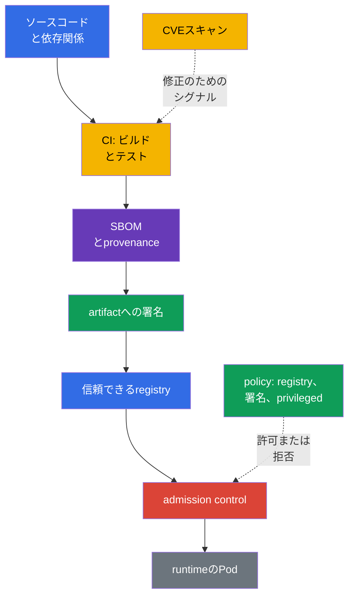
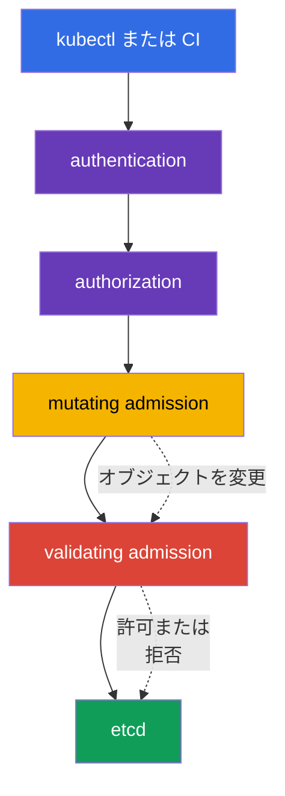

[Русская версия](ru.md) · [Eng version](README.md) · [Versión en español](es.md) · [Version française](fr.md) · [Deutsche Version](de.md) · [ქართული ვერსია](ge.md) · [繁體中文版](tw.md)

# 第17章. Supply chain、image registry、admission control

> **次に進む前に.** 第16章では、悪意のあるコード、脆弱なイメージ、権限昇格がクラスターの脅威となる仕組みを確認しました。ここでは、ワークロードを起動する前の防御を構築します。ソースコードからartifactまでの経路を追跡し、信頼できるソースからのイメージのみを許可し、Kubernetes APIへのリクエストを検証します。これは比重16%のKCSAドメイン **Platform Security** です。例とAPI名はKubernetes `v1.36` を対象としています。

Supply chainのセキュリティは、単一のscannerや署名だけに還元されません。これは証拠の連鎖です。イメージに**何が**含まれるか、**誰がどのように**それをビルドしたか、どこから取得したか、作成時点でオブジェクトが組織のルールに適合するかを把握します。どこか一つでも制御されていなければ、artifactへの信頼は弱まります。

## 17.1 Supply chain: コードからruntimeまで

**Software supply chain** とは、ソースコードとサードパーティ依存関係から、ビルド、テスト、公開を経て、`Pod` が起動するイメージに至るソフトウェアの経路です。Kubernetesでは、信頼境界はAPIの周囲だけにあるわけではありません。侵害されたパッケージ、CI runner、またはregistryは、通常のruntime controlが働く前に悪意のあるコードをクラスターに届ける可能性があります。

実際のチェーンには通常、次の要素があります。

| 要素 | 問題になり得ること | controlの例 |
|---|---|---|
| コードと依存関係 | リポジトリ内のsecret、脆弱または改ざんされたライブラリ | review、SCA、依存関係管理、secret検出 |
| CIビルド | 保護されていないrunnerが異なるコードをビルドする | 分離ビルド、最小権限、ログ、再現可能性 |
| イメージとmetadata | artifactの構成または由来が不明 | SBOM、digest、provenance、署名 |
| Registry | タグの改ざん、未検証イメージの公開 | IAM/RBACによるアクセス、private repository、immutable tag、信頼できるソース |
| Admissionとruntime | 危険な設定を持つオブジェクトがクラスターに許可される | policy、署名検証、PSA、可観測性 |

`@sha256:...` のような**digest**は、イメージの内容を一意に指します。タグ `:latest` は開発には便利ですが変更可能です。同じタグが今日と明日で異なるバイト列を指す可能性があります。digestはイメージを安全にするものではありませんが、どのartifactが検証され、起動されたのかを固定できます。

### SBOM: 構成のインベントリ

**Software Bill of Materials (SBOM)** とは、提供するartifact内のコンポーネント、バージョン、および場合によってはそれらの関係を機械可読で列挙したものです。これは「公開されたばかりのCVEの対象となるライブラリが、当社のイメージにあるか」という問いに答えます。SBOM自体は脆弱性を修正せず、ビルドが信頼できることを確認するものでもありませんが、影響を受けるワークロードを探す時間を短縮します。

一般的なオープンフォーマットは **SPDX** と **CycloneDX** です。どちらも似たインベントリの課題を解決しますが、データモデルとエコシステムは異なります。`syft` は、ファイルシステムまたはcontainer imageのSBOMを作成するツールの例です。試験では、フォーマットとツールの目的を区別することが重要です。SPDX/CycloneDXはSBOMを記述し、`syft` はその作成を支援します。

### 署名、`cosign`、sigstore

署名はartifactを署名者のidentityに結び付けます。起動前に検証システムは、署名が必要なdigestに対応し、許可されたkeyまたはidentityに合致することを確認します。したがって、署名は真正性（信頼できるsigning identityとの関連付け）と完全性（署名後にartifactが密かに変更されていないこと）を確認します。ただし、ビルドのprovenanceは確認しません。これはprovenance/attestationという別の課題です。また、CVEが存在しないことや`Pod`の設定が安全であることを単独で証明するものでもありません。

`cosign` はcontainer artifactに署名し検証するためのツールです。**sigstore** は署名、identity、透明性ログの利用を容易にするエコシステムです。信頼モデルに応じて、組織はkey、CIシステムのidentity、または企業のpolicyを使用できます。重要なのは特定のコマンドではなく、許可前に署名を検証し、変更可能なタグだけでなくimmutable digestに結び付けるというルールです。

### SLSAとprovenance

**SLSA v1.2** (Supply-chain Levels for Software Artifacts) は、独立した **Build** と **Source** のtrackを持つsupply chain要件のフレームワークです。各trackには独自のlevelと要件があります。Build levelはSource levelに関する主張ではなく、その逆も同様です。そのため、levelは常にtrackとともに示し、特定のSLSA要件が主張していない性質をそのlevelに帰してはいけません。**Provenance** は由来の記録です。どのソースコード、プロセス、builderがartifactを作成したかを記録します。Reproducible buildはプロセスの有用な特性ですが、SLSA levelの普遍的な同義語ではありません。SLSAはKubernetes APIではなく、admission policyの代替にもなりません。チームがsupply chainの要件を定式化し検証するための言語です。

### エンドツーエンドのチェーン: threat → control → evidence

| 段階 | 脅威 | Control | Evidence |
|---|---|---|---|
| source/dependency | 悪意のある、または脆弱な依存関係 | review、SCA、secret scanning | PR/reviewとSCA report |
| build | CIが誤ったsourceをビルドする | 保護されたbuilderとprovenance | build record、source revision、artifact digest |
| artifact | mutable tagが改ざんされる | immutable digest | `@sha256:...` を指定したdeployment/reference |
| inventory | imageの構成が不明 | SBOM | digestに関連付けられたSPDX/CycloneDX document |
| release | 不明なpublisher | signature verification | verification result/signing identity |
| admission/deployment | 不適切なartifactまたはmanifest | allowlist/policy/PSA | admission allow/deny/audit event |
| runtime | 新しいCVEまたは異常なbehavior | 再スキャンとruntime monitoring | scan report、registry/runtime telemetry |

このチェーンによってscannerが安全性のproofになるわけではありません。digestはcontentを固定し、signatureはartifactをidentityに結び付け、SBOMは構成を記述し、provenanceは表明されたbuild pathを記述します。各artifactは別個のevidenceを提供し、それぞれ固有の制限があります。

## 17.2 Image repositoryとイメージへの信頼

**Image repository** またはregistryは、イメージ、そのタグ、digest、署名、関連するmetadataを保管します。public registryは配布に役立ちますが、組織はすべてのpublic imageを信頼してはなりません。信頼とは、ソース、所有者、公開プロセス、検査結果が組織のルールに適合することを意味します。

| アプローチ | 利点 | 残存リスクとcontrol |
|---|---|---|
| 許可されたregistry | イメージのソースを制限する | 信頼されたregistryにもアクセス管理とスキャンが必要 |
| Private registry | 公開とdownloadを制限し、内部artifactをサポートする | イメージを自動的に安全にするものではない。権限、audit、公開プロセスが必要 |
| Allowlist repository | 偶発的なpublic imageや名前のタイプミスを禁止する | ルールはすべての許可パスとmigrationを考慮する必要がある |
| タグではなくdigest | 特定のcontentを固定する | contentが安全または署名済みであることは確認しない |
| 署名 | policyに基づいてartifactをidentityに結び付ける | SBOM、provenance、CVE分析、manifest検証の代替にはならない |
| provenance | 表明されたartifactのbuild pathを記述する | 署名、SBOM、SLSA levelではない |
| SLSA v1.2 | 独立したBuildとSourceのtrackの要件を定める | SBOM、署名、reproducible buildの普遍的な同義語ではない |

private registryへのアクセスは通常、必要最小限のidentityに与え、credentialsをimageやGitに入れません。Kubernetesは`imagePullSecrets`を使用できますが、これはnamespace内のすべてのsecretを広く読み取る理由にはなりません。registry credentialsは他のsecretと同様に、RBAC、ローテーション、最小スコープで保護します。

### イメージをスキャンする理由

scannerはイメージ内のパッケージとライブラリを既知の脆弱性およびCVEデータベースと照合します。**Trivy** はこの種の検査で広く使われるツールです。設定やsecretの分析もできますが、image securityの文脈での主要な役割は、イメージ内の既知の脆弱性を見つけることです。スキャン結果は、修正済みのベースイメージまたはパッケージバージョンを選択し、CIのしきい値を設定するのに役立ちます。

スキャンはすべてのリスククラスを見つけるわけではありません。誤検知の可能性があり、既知のCVEが特定の実行パスには適用されない場合もあります。逆に、CVEが見つからないことはイメージが信頼できることを意味しません。secret、悪意のあるロジック、または安全でない`securityContext`が含まれる可能性があります。そのため、スキャンはSBOM、署名、review、admission policyと組み合わせます。

## 17.3 Admission control: クラスターへの書き込み前の判断

authenticationとauthorizationの後、Kubernetes API Serverはオブジェクトをetcdに保存する前にadmission controlを実行します。この段階ではユーザーだけでなく、リクエストされたオブジェクト自体も評価できます。たとえば、イメージ、`securityContext`フィールド、labels、企業ルールへの適合性です。

**Mutating admission webhook** は、必須のlabel、annotation、sidecarを追加するなど、オブジェクトを変更できます。標準化に役立ちますが、オブジェクトの変更は予測可能でなければなりません。不明瞭なmutationは調査を難しくし、別のpolicyと競合する可能性があります。

**Validating admission webhook** はオブジェクトの最終形を評価し、リクエストを許可または拒否します。オブジェクトを変更してはいけません。mutating webhookとvalidating webhookはどちらも外部サービスとして動作するため、その可用性とTLS信頼が重要です。誤った設定はdeployを停止させるか、望ましくないバイパス経路を残す可能性があります。webhookが利用できない場合の挙動は、`ValidatingWebhookConfiguration`/`MutatingWebhookConfiguration`の`failurePolicy`フィールドで制御します。`Fail` はwebhookが利用できないかエラーを返した場合にリクエストを停止します（より安全ですが、webhook障害時にdeployをブロックする可能性があります）。`Ignore` はこの場合、webhookの検査を適用せずにリクエストを通過させます。つまり、`failurePolicy: Ignore`ではwebhookの障害または一時的な利用不能により、オブジェクト自体を変更することなく、本来働くべきcontrolが黙って無効になります。

Kubernetesは、**CEL**（Common Expression Language - Kubernetes APIに組み込まれ、任意のコードを実行せずに条件とルールを記述するための式言語。policyがCEL式を指定し、API serverが特定のオブジェクトに対してそれを評価します）による組み込みのdeclarative admission policyも提供します。`MutatingAdmissionPolicy` は別のHTTP webhookなしに適合するAPIオブジェクトを変更します。Kubernetes `v1.36` でstableとなり、デフォルトでenabledです。`ValidatingAdmissionPolicy` は組み込みのdeclarative validationを実行し、リクエストを拒否できます。両方の仕組みはCELを使用しますが、異なる課題を解決します。mutationはオブジェクトを変更し、validationは許可または拒否します。registryへのネットワークリクエストや専用verifierなど、外部ロジックには依然として外部admission webhook / policy engine、またはpolicy自体が利用できる事前取得済みの信頼できるverification resultが必要です。

`ValidatingAdmissionPolicy` はvalidation logicを定義するcluster-scoped policy objectです。policyを実際に適用するには、別個の`ValidatingAdmissionPolicyBinding`を作成します。bindingはpolicyを参照し、`validationActions`を設定し、`namespaceSelector`を含む`matchResources`により適用範囲を絞れます。したがって、`ValidatingAdmissionPolicy`が「namespace内にある」と言うことはできません。namespace scopeはbinding/matchResourcesを通じて設定します。

### Policy engine: OPA/GatekeeperとKyverno

**OPA** (Open Policy Agent) は汎用policy engineであり、**Gatekeeper** はこれをKubernetes admissionと制約管理に適応させます。policyは通常Regoで記述されます。**Kyverno** はKubernetes指向のpolicy engineです。そのルールはKubernetes YAMLスタイルでvalidation、mutation、場合によってはオブジェクト生成を記述します。これらのツールはKubernetesに必須の、相互交換可能な部分ではありません。組織は要件、チームの能力、既存のpolicy landscapeに応じて選択します。

KCSAレベルでは、Regoや複雑なKyvernoルールを書くことではなく、結果を理解することが重要です。代表的なpolicyを二つ示します。

| policyの意図 | 検査するもの | 軽減する脅威 |
|---|---|---|
| `allowed-registries` | 各`container`と`initContainer`が`registry.corp.example/`プレフィックスのイメージを使用する | 未検証または偶発的なpublic imageの起動 |
| `deny-privileged` | `securityContext.privileged`が`true`ではない | 権限拡大とcontainer escapeリスクの増大 |

このようなルールは相互に補完しますが、互いの代替にはなりません。registry allowlistは安全な`Pod`を保証せず、`privileged`の禁止はイメージの取得元を示しません。また、実際の`Pod`はcontrollerが作成するため、`Deployment`、`Job`、`CronJob`を含め、ワークロードを作成するすべての該当経路にpolicyを適用する必要があります。

## 17.4 実際の適用方法

チームは通常、一つの「完璧な」障壁ではなく、複数のgateを構築します。

1. 開発者は依存関係を固定し、secretをコードやimageに入れません。
2. CIは制御されたソースコードからイメージをビルドし、SBOMを生成してスキャンし、artifactをprivate registryに公開します。
3. CIはdigestに署名し、provenanceを保存して、releaseを特定のビルドに結び付けられるようにします。
4. Admission-control層は許可されたregistryを制限します。署名検証はadmission webhook / 外部verifierが実行するか、policyが既に提供された信頼できるverification resultを検査します。独立したvalidating policyまたはPSAは、`privileged: true`のような危険なworkloadフィールドを別途拒否できます。
5. deploy後、チームは新しいCVEを追跡し、既存のイメージを再スキャンし、影響を受けるworkloadを更新します。

policyは段階的に導入する方が安全です。まず違反を観察して例外を調整し、その後に拒否を有効化します。例外は限定的で、所有者と見直し期限を持つべきです。古いworkloadのための恒久的でグローバルな「穴」は、policyを形式的なものに変えてしまいます。

## 17.5 Exam vocabulary / ミニ用語集

| 用語 | 意味 |
|---|---|
| admission control | authenticationとauthorizationの後、オブジェクトを保存する前のAPIリクエスト処理段階 |
| artifact | container image、SBOM、署名などのビルド成果物 |
| `MutatingAdmissionPolicy` | APIオブジェクトのmutationにCELを使う組み込みdeclarative admission policy。Kubernetes v1.36でstable。 |
| `ValidatingAdmissionPolicy` | APIオブジェクトのvalidationにCELを使う組み込みdeclarative admission policy。 |
| CEL | Common Expression Language。組み込みの`MutatingAdmissionPolicy`と`ValidatingAdmissionPolicy`で使用される。 |
| digest | 特定のイメージ内容を示す不変の暗号学的identifier |
| image registry | container imageと関連metadataの保管場所 |
| provenance | artifactの由来とビルドプロセスに関する情報 |
| SBOM | artifact内のコンポーネントとバージョンの機械可読な一覧 |
| SLSA v1.2 | 独立したBuildとSourceのtrackを持つ要件フレームワーク。levelはtrackとともに示す。 |

## 17.6 Exam Essentials / 章の要点

- Supply chainはコードと依存関係からイメージの起動までの経路を対象とします。防御には複数の独立したcontrolが必要です。
- SBOMはartifactの構成に関する問いに答えます。SPDXとCycloneDXはSBOMフォーマットであり、`syft` はその作成を支援します。
- `cosign`/sigstoreによる署名は、policyに従った真正性（信頼できるsigning identityとの関連付け）と完全性を確認しますが、ビルドのprovenanceを確認するものではなく、CVEスキャンや安全な設定の代替にもなりません。
- SLSA v1.2は独立したBuildとSourceのtrackを定め、provenanceはartifactの由来を記述します。SLSAもprovenanceもSBOMや署名と相互交換可能ではありません。Reproducible buildはSLSA levelの普遍的な同義語ではありません。
- 信頼できるまたはprivateなregistryは管理外のソースのリスクを低減し、`Trivy` は既知の脆弱性の検出を支援します。
- Mutationは外部の`MutatingAdmissionWebhook`とCELによる組み込みの`MutatingAdmissionPolicy`の両方で実行できます。validationは外部validating webhookまたはCELによる組み込みの`ValidatingAdmissionPolicy`で行えます。

## 17.7 混同しやすい点と試験での出題

KCSAの問題は通常、controlの目的と境界の理解を確認します。区別してください。SBOMは構成をインベントリ化し、scannerは既知の脆弱性を探し、署名はartifactをidentityに結び付け、provenanceは表明されたbuild pathを記述し、admission policyはオブジェクトをクラスターに許可するかを決定します。SLSA v1.2は独立したBuildとSourceのtrackを定めるものであり、SBOM、署名、provenanceの代替ではありません。private registryを安全性の保証と、digestを署名と、reproducible buildを普遍的なSLSA levelと混同しないでください。

よくある出題では、特定の脅威に対するcontrolを選ばせます。public sourceからのイメージを禁止するには、admission policy内のregistry allowlistが適しています。`privileged`を禁止するには、適切なprofileを持つvalidating policyまたはPod Security Admissionを使用します。必須metadataを追加するにはmutating admissionを使用します。組み込みの`MutatingAdmissionPolicy`と`ValidatingAdmissionPolicy`はCELを使用しますが、前者はオブジェクトを変更し、後者は検証します。webhookが必要なのは、Kubernetesがdeclarative mutation/validationを実行できないからではなく、組み込みのCEL-policyでは利用できない外部ロジックまたは統合が必要な場合です。

## 17.8 自己確認問題

### 1. container imageに対してSBOMが主に解決する課題は何ですか。

   - a. コンポーネントとバージョンを列挙し、脆弱性の影響を受けるartifactを特定できるようにする。

   - b. `Pod`がprivileged modeを取得できないようにする。

   - c. ベースイメージのCVEを自動的に修正する。

   - d. registryへの転送中にimageを暗号化する。

回答と解説

**正解: a.** SBOMはartifactの構成をインベントリ化します。影響を受けるイメージを見つけるのに役立ちますが、暗号化、policyの適用、依存関係の修正は行いません。

### 2. 組織のtrust policyに照らして正常に検証されたイメージ署名は、最も正確には何を確認しますか。

   - a. scannerがartifact内の既知および未知の脆弱性がないことを保証した。
   - b. private registryだけで、保存した各imageのprovenanceとintegrityを証明した。
   - c. 特定のartifactに対するcryptographic assertionが、trust policyに従って許可されたkey/identityについて正常に検証された。
   - d. runtimeがPod configurationに関係なく、コンテナをnon-rootとして起動することを保証した。

回答と解説

**正解: c.** 正常なsignature verificationは、設定されたtrust policyの文脈で、特定のartifactに対するcryptographic assertionを確認します。CVEが存在しないことを証明せず、provenanceの代替にもならず、runtimeのsecurityContextを決定するものでもありません。

### 3. 偶発的なpublic registryからのイメージ起動を防ぐ最適な対策はどれですか。

   - a. 診断用コンテナに対して`privileged: true`を有効にする。

   - b. Dockerfile内にregistry credentialsを保存する。

   - c. タグ`latest`のみを使用する。

   - d. 許可されたregistryのallowlistを持つvalidating policyを設定する。

回答と解説

**正解: d.** Validating policyは各イメージ名を検査し、etcdに書き込む前にオブジェクトを拒否できます。`latest`は変更可能であり、credentialsをimageに含めるべきではありません。

### 4. mutating admission webhookとvalidating admission webhookの主な違いは何ですか。

   - a. Validating webhookは`Secret`を暗号化し、mutating webhookはSBOMを作成する。

   - b. Mutating webhookはオブジェクトを変更し、validating webhookは許可または拒否を決定する。

   - c. 違いはなく、一つの仕組みに対する二つの名称である。

   - d. Mutating webhookは`Service`だけで動作し、validating webhookは`Pod`だけで動作する。

回答と解説

**正解: b.** リクエストはvalidationの前にmutationを通過します。validating webhookはオブジェクトの最終形を検査し、変更してはいけません。

### 5. 別個のwebhookなしに、CEL式でKubernetesの組み込みvalidating checkの一部を記述できるコンポーネントはどれですか。

   - a. `PodDisruptionBudget`.

   - b. `imagePullSecret`.

   - c. `ValidatingAdmissionPolicy`.

   - d. `NetworkPolicy`.

回答と解説

**正解: c.** `ValidatingAdmissionPolicy`は、APIオブジェクトに対するdeclarative checkにCELを使用します。他のresourceはネットワーク、可用性、registryへのauthenticationの課題を解決します。

> **次に進む場所.** admissionとpolicy engineを実際に設定するには、CKS第20章を参照してください。Supply chainはCKS第25-28章で詳しく扱います。SBOM/CI/CD/artifact repositories、registry/signature/validation、静的解析、image scanningです。imagesとAPI admissionの基本的な仕組みには、CKA第23章と第21章が役立ちます。

[目次](../README_JP.md) · [第16章](../16/jp.md) · [第18章](../18/jp.md)
