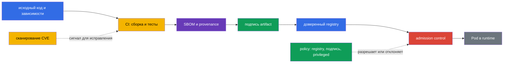

> **Язык:** русский. Переводы будут добавлены после публикации соответствующих файлов.

# Глава 17. Supply chain, реестры образов и admission control

> **Что дальше.** В главе 16 мы рассмотрели, как вредоносный код, уязвимый образ и повышение привилегий становятся угрозами для кластера. Теперь строим защиту до запуска рабочей нагрузки: прослеживаем путь артефакта от исходного кода, допускаем образы только из доверенного источника и проверяем запрос к Kubernetes API. Это домен KCSA **Platform Security** с весом 16%. Примеры и названия API ориентированы на Kubernetes `v1.36`.

Безопасность supply chain не сводится к одному сканеру или подписи. Это цепочка доказательств: понятно, **что** вошло в образ, **кем и как** он собран, откуда он получен и соответствует ли объект правилам организации в момент создания. Если хотя бы один участок не контролируется, доверие к артефакту ослабевает.

## 17.1 Supply chain: от кода до runtime

**Software supply chain** - это путь программного обеспечения от исходного кода и сторонних зависимостей через сборку, тестирование и публикацию до образа, который запускает `Pod`. В Kubernetes граница доверия проходит не только вокруг API: скомпрометированный пакет, CI runner или registry может доставить вредоносный код в кластер ещё до того, как сработают обычные runtime-контроли.

У практической цепочки обычно есть такие звенья:

| Звено | Что может пойти не так | Примеры контроля |
|---|---|---|
| Код и зависимости | секрет в репозитории, уязвимая или подменённая библиотека | review, SCA, управление зависимостями, проверка секретов |
| Сборка CI | незащищённый runner собирает иной код | изолированная сборка, минимальные права, журналы, воспроизводимость |
| Образ и metadata | неизвестен состав или происхождение artifact | SBOM, digest, provenance, подпись |
| Registry | подмена тега, публикация непроверенного образа | доступ по IAM/RBAC, приватные репозитории, immutable tags, доверенные источники |
| Admission и runtime | объект с опасной конфигурацией допущен в кластер | policy, проверка подписи, PSA, наблюдаемость |

**Digest**, например `@sha256:...`, однозначно указывает на содержимое образа. Тег `:latest` удобен для разработки, но изменяем: один и тот же тег сегодня и завтра может обозначать разные байты. Digest не делает образ безопасным, однако позволяет зафиксировать, какой именно artifact был проверен и запущен.

### SBOM: инвентарь состава

**Software Bill of Materials (SBOM)** - машиночитаемый перечень компонентов, версий и иногда их связей внутри поставляемого artifact. Он отвечает на вопрос: «Есть ли в наших образах библиотека, для которой только что опубликована CVE?» SBOM не исправляет уязвимость и не подтверждает, что сборка надёжна, но сокращает время поиска затронутых рабочих нагрузок.

Распространённые открытые форматы - **SPDX** и **CycloneDX**. Они решают сходную задачу инвентаризации, но отличаются моделью данных и экосистемой. `syft` - пример инструмента, который создаёт SBOM для файловой системы или container image. На экзамене важно различать назначение формата и инструмента: SPDX/CycloneDX описывают SBOM, а `syft` помогает его сформировать.

### Подпись, `cosign` и sigstore

Подпись связывает artifact с identity подписавшей стороны. Перед запуском проверяющая система удостоверяется, что подпись относится к нужному digest и соответствует разрешённому ключу или identity. Поэтому подпись подтверждает подлинность (association с доверенной signing identity) и целостность (что artifact не был незаметно изменён после подписания), но не происхождение сборки - это отдельная задача provenance/attestation - и сама по себе не доказывает отсутствие CVE или безопасную конфигурацию `Pod`.

`cosign` - инструмент для подписи и проверки container artifacts. **sigstore** - экосистема, упрощающая работу с подписями, identity и прозрачным журналом. В зависимости от модели доверия организация может использовать ключи, identity CI-системы или корпоративный policy. Существенна не конкретная команда, а правило: проверять подпись до допуска и связывать её с immutable digest, а не лишь с изменяемым тегом.

### SLSA и provenance

**SLSA v1.2** (Supply-chain Levels for Software Artifacts) задаёт рамку требований к цепочке поставки с независимыми tracks **Build** и **Source**. У каждого track собственные уровни и требования: уровень Build не является утверждением об уровне Source, и наоборот. Поэтому уровень всегда указывают вместе с track и не приписывают ему свойства, которые не заявлены конкретным требованием SLSA. **Provenance** - запись о происхождении: какой исходный код, процесс и сборщик создали artifact. Reproducible build - полезное свойство процесса, но не универсальный синоним уровня SLSA. SLSA не является Kubernetes API и не заменяет admission policy. Это язык, с помощью которого команда формулирует и проверяет требования к цепочке поставки.

### Сквозная цепочка: threat → control → evidence

| Этап | Угроза | Control | Evidence |
|---|---|---|---|
| source/dependency | вредоносная или уязвимая зависимость | review, SCA, secret scanning | PR/review и SCA report |
| build | CI собирает не тот source | защищённый builder и provenance | build record, source revision, artifact digest |
| artifact | mutable tag подменён | immutable digest | deployment/reference на `@sha256:...` |
| inventory | неизвестен состав image | SBOM | SPDX/CycloneDX document, связанный с digest |
| release | неизвестный publisher | signature verification | verification result/signing identity |
| admission/deployment | неподходящий artifact или manifest | allowlist/policy/PSA | admission allow/deny/audit event |
| runtime | новая CVE или anomalous behavior | re-scan и runtime monitoring | scan report, registry/runtime telemetry |

Цепочка не превращает scanner в proof of safety: digest фиксирует content, signature связывает artifact с identity, SBOM описывает состав, provenance описывает заявленный build path. Каждый artefact даёт отдельное evidence и имеет собственное ограничение.

## 17.2 Image repository и доверие к образам

**Image repository** или registry хранит образы и их теги, digest, подписи и связанные metadata. Публичный registry полезен для распространения, но организация не должна считать каждый публичный образ доверенным. Доверие означает, что источник, владелец, процесс публикации и результат проверок соответствуют правилам организации.

| Подход | Польза | Остаточный риск и контроль |
|---|---|---|
| Разрешённый registry | ограничивает источники образов | доверенный registry тоже требует управления доступом и сканирования |
| Приватный registry | ограничивает публикацию и download, поддерживает внутренние artifacts | не делает образ автоматически безопасным; нужны права, audit и процесс публикации |
| Allowlist repository | запрещает случайные публичные образы и опечатки в имени | правило должно учитывать все допустимые пути и migration |
| Digest вместо тега | фиксирует конкретное содержимое | не подтверждает, что содержимое безопасно или подписано |
| Подпись | связывает artifact с identity по policy | не заменяет SBOM, provenance, анализ CVE или проверку manifest |
| provenance | описывает заявленный путь сборки artifact | не является подписью, SBOM или уровнем SLSA |
| SLSA v1.2 | задаёт требования независимых tracks Build и Source | не является SBOM, подписью или универсальным синонимом reproducible build |

Доступ к приватному registry обычно предоставляют минимально необходимым identity, а credentials не помещают в image или Git. Kubernetes может использовать `imagePullSecrets`, но это не аргумент для широкого чтения всех секретов в namespace. Credentials registry, как и другие секреты, защищают RBAC, ротацией и минимальной областью действия.

### Зачем сканировать образы

Сканер сопоставляет пакеты и библиотеки образа с известными уязвимостями и базами CVE. **Trivy** - распространённый инструмент для такой проверки; он также может анализировать конфигурации и secrets, но в контексте image security его ключевая роль - обнаружение известных уязвимостей в образе. Результат сканирования помогает выбрать исправленную базу или версию пакета и установить порог для CI.

Сканирование не видит все классы риска. У него могут быть ложные срабатывания, а известная CVE может быть неприменима к конкретному пути выполнения. И наоборот, отсутствие найденных CVE не означает, что образ надёжен: в нём могут быть секреты, вредоносная логика или небезопасный `securityContext`. Поэтому сканирование сочетают с SBOM, подписью, review и admission policy.

## 17.3 Admission control: решение перед записью в кластер

После authentication и authorization Kubernetes API Server выполняет admission control перед сохранением объекта в etcd. На этом этапе можно оценить не только пользователя, но и сам запрошенный объект: образ, поля `securityContext`, labels и соответствие корпоративным правилам.

```mermaid
flowchart LR
    client["kubectl или CI"] --> authn["authentication"]
    authn --> authz["authorization"]
    authz --> mutate["mutating admission"]
    mutate --> validate["validating admission"]
    validate --> etcd["etcd"]
    mutate -. "меняет объект" .-> validate
    validate -. "разрешает или отклоняет" .-> etcd
    style client fill:#326ce5,color:#fff
    style authn fill:#673ab7,color:#fff
    style authz fill:#673ab7,color:#fff
    style mutate fill:#f4b400,color:#000
    style validate fill:#db4437,color:#fff
    style etcd fill:#0f9d58,color:#fff
```

**Mutating admission webhook** может изменить объект, например добавить обязательную label, annotation или sidecar. Он полезен для стандартизации, но изменение объекта должно быть предсказуемым: неясная мутация затрудняет расследование и может конфликтовать с другой политикой.

**Validating admission webhook** оценивает финальный вариант объекта и разрешает или отклоняет запрос. Он не должен менять объект. И mutating, и validating webhook работают как внешние сервисы, поэтому их доступность и TLS-доверие важны: неверная настройка может либо остановить deploy, либо оставить нежелательный путь обхода. Именно это поведение при недоступности webhook регулирует поле `failurePolicy` в `ValidatingWebhookConfiguration`/`MutatingWebhookConfiguration`: `Fail` останавливает запрос, если webhook недоступен или вернул ошибку (безопаснее, но может заблокировать deploy при сбое webhook), а `Ignore` пропускает запрос без применения проверки webhook в этом случае — то есть сбой или временная недоступность webhook при `failurePolicy: Ignore` молча отключает контроль, который должен был сработать, без каких-либо изменений в самом объекте.

Kubernetes также предлагает встроенные declarative admission policies на CEL. `MutatingAdmissionPolicy` изменяет подходящие API-объекты без отдельного HTTP webhook; feature stable с Kubernetes `v1.36` и enabled by default. `ValidatingAdmissionPolicy` выполняет встроенную declarative validation и может отклонить запрос. Оба механизма используют CEL, но решают разные задачи: mutation изменяет объект, validation принимает или отклоняет его. Для внешней логики — например, сетевого запроса к registry или отдельному verifier — всё ещё нужен внешний admission webhook / policy engine либо заранее полученный доверенный verification result, доступный самой policy.

`ValidatingAdmissionPolicy` задаёт validation logic и является cluster-scoped policy object. Чтобы policy реально применялась, создают отдельный `ValidatingAdmissionPolicyBinding`: binding ссылается на policy, задаёт `validationActions` и может сузить применение через `matchResources`, включая `namespaceSelector`. Поэтому нельзя говорить, что `ValidatingAdmissionPolicy` находится «в namespace»; namespace scope задают через binding/matchResources.

### Policy-движки: OPA/Gatekeeper и Kyverno

**OPA** (Open Policy Agent) - общий движок политик, а **Gatekeeper** адаптирует его к Kubernetes admission и управлению ограничениями. Политики обычно описываются на Rego. **Kyverno** - Kubernetes-ориентированный policy engine; его правила описывают validation, mutation и иногда генерацию объектов в стиле Kubernetes YAML. Эти инструменты не являются взаимозаменяемой обязательной частью Kubernetes: организация выбирает их по требованиям, компетенциям команды и существующему policy landscape.

На уровне KCSA важно понимать результат, а не писать Rego или сложные правила Kyverno. Две типичные политики выглядят так:

| Намерение policy | Что проверяет | Какая угроза снижается |
|---|---|---|
| `allowed-registries` | каждый `container` и `initContainer` использует образ с префиксом `registry.corp.example/` | запуск непроверенного или случайного публичного образа |
| `deny-privileged` | `securityContext.privileged` не равен `true` | расширение привилегий и рост риска container escape |

Такие правила дополняют, но не заменяют друг друга. Allowlist registry не гарантирует безопасный `Pod`; запрет `privileged` не сообщает, откуда взят образ. Кроме того, policy следует применять ко всем подходящим путям создания рабочих нагрузок, включая `Deployment`, `Job` и `CronJob`, так как фактический `Pod` создаёт controller.

## 17.4 Как это применяют на практике

Команда обычно выстраивает несколько gates, а не один «идеальный» барьер:

1. Разработчик фиксирует зависимости и не помещает secrets в код или image.
2. CI собирает образ из контролируемого исходного кода, формирует SBOM, сканирует его и публикует artifact в приватный registry.
3. CI подписывает digest и сохраняет provenance, чтобы release можно было связать с конкретной сборкой.
4. Admission-control слой ограничивает разрешённые registry; проверку подписи выполняет admission webhook / внешний verifier либо policy проверяет уже предоставленный доверенный verification result. Отдельная validating policy или PSA может независимо отклонять опасные workload-поля, например `privileged: true`.
5. После deploy команда следит за новыми CVE, пересканирует существующие образы и обновляет затронутые workload.

Политику безопаснее вводить поэтапно: сначала наблюдать нарушения и согласовать исключения, затем включить отклонение. Исключение должно быть узким, иметь владельца и срок пересмотра. Постоянная глобальная «дырка» для старой рабочей нагрузки превращает policy в формальность.

## 17.5 Exam vocabulary / Мини-глоссарий

| Термин | Значение |
|---|---|
| admission control | этап обработки запроса API после authentication и authorization, до записи объекта |
| artifact | результат сборки, например container image, SBOM или подпись |
| `MutatingAdmissionPolicy` | Встроенная declarative admission policy, которая использует CEL для mutation API-объектов; stable с Kubernetes v1.36. |
| `ValidatingAdmissionPolicy` | Встроенная declarative admission policy, которая использует CEL для validation API-объектов. |
| CEL | Common Expression Language; используется встроенными `MutatingAdmissionPolicy` и `ValidatingAdmissionPolicy`. |
| digest | неизменяемый криптографический идентификатор конкретного содержимого образа |
| image registry | хранилище container images и связанных metadata |
| provenance | сведения о происхождении artifact и процессе его сборки |
| SBOM | машиночитаемый перечень компонентов и версий в artifact |
| SLSA v1.2 | Рамка требований с независимыми tracks Build и Source; уровень указывают вместе с track. |

## 17.6 Exam Essentials / Итоги главы

- Supply chain охватывает путь от кода и зависимостей до запуска образа; защита требует нескольких независимых контролей.
- SBOM отвечает на вопрос о составе artifact; SPDX и CycloneDX - форматы SBOM, а `syft` помогает его создавать.
- Подпись через `cosign`/sigstore подтверждает подлинность (association с доверенной signing identity) и целостность по policy, но не подтверждает происхождение сборки и не заменяет сканирование CVE и безопасную конфигурацию.
- SLSA v1.2 задаёт независимые tracks Build и Source, а provenance описывает происхождение artifact; ни SLSA, ни provenance не взаимозаменяемы с SBOM или подписью. Reproducible build не является универсальным синонимом уровня SLSA.
- Доверенный или приватный registry снижает риск неподконтрольного источника, а `Trivy` помогает обнаружить известные уязвимости.
- Mutation может выполняться как внешним `MutatingAdmissionWebhook`, так и встроенной `MutatingAdmissionPolicy` на CEL; validation — внешним validating webhook или встроенной `ValidatingAdmissionPolicy` на CEL.

## 17.7 Не путать и как это встречается на экзамене

Вопросы KCSA обычно проверяют назначение и границы средств контроля. Различайте: SBOM инвентаризирует состав, scanner ищет известные уязвимости, подпись связывает artifact с identity, provenance описывает заявленный путь сборки, а admission policy решает, допустить ли объект в кластер. SLSA v1.2 задаёт независимые tracks Build и Source, а не заменяет SBOM, подпись или provenance. Не путайте приватный registry с гарантией безопасности, digest с подписью и reproducible build с универсальным уровнем SLSA.

Частая формулировка предлагает выбрать контроль для конкретной угрозы. Для запрета образов из публичных источников подходит allowlist registry в admission policy. Для запрета `privileged` - validating policy или Pod Security Admission с подходящим профилем. Для добавления обязательной metadata - mutating admission. Встроенные `MutatingAdmissionPolicy` и `ValidatingAdmissionPolicy` используют CEL, но первая изменяет объект, а вторая валидирует его. Webhook нужен не потому, что Kubernetes не умеет declarative mutation/validation, а когда требуется внешняя логика или интеграция, недоступная встроенной CEL-policy.

## 17.8 Вопросы для самопроверки

### 1. Какую задачу прежде всего решает SBOM для container image?

   - a. Перечисляет компоненты и версии, чтобы определить затронутые уязвимостью artifacts.

   - b. Не позволяет `Pod` получить привилегированный режим.

   - c. Автоматически исправляет CVE в базовом образе.

   - d. Шифрует image при передаче в registry.

Ответ и разбор

**Верный ответ: a.** SBOM инвентаризирует состав artifact. Он помогает найти затронутые образы, но не шифрует их, не применяет policy и не исправляет зависимости.

### 2. Что наиболее точно подтверждает подпись образа, успешно проверенная по организационной trust policy?

   - a. Что scanner гарантировал отсутствие известных и неизвестных уязвимостей в artifact.
   - b. Что приватный registry сам по себе доказал происхождение и integrity каждого сохранённого image.
   - c. Что cryptographic assertion над конкретным artifact успешно проверена для разрешённого key/identity согласно trust policy.
   - d. Что runtime гарантированно запустит контейнер как non-root независимо от его Pod configuration.

Ответ и разбор

**Верный ответ: c.** Успешная signature verification подтверждает cryptographic assertion над конкретным artifact в контексте настроенной trust policy. Она не доказывает отсутствие CVE, не заменяет provenance и не определяет runtime securityContext.

### 3. Какая мера лучше всего предотвращает запуск образа из случайного публичного registry?

   - a. Включить `privileged: true` для диагностического контейнера.

   - b. Сохранить credentials registry внутри Dockerfile.

   - c. Использовать только тег `latest`.

   - d. Настроить validating policy с allowlist разрешённых registry.

Ответ и разбор

**Верный ответ: d.** Validating policy может проверить имя каждого образа и отклонить объект до записи в etcd. `latest` изменяем, а credentials не должны попадать в image.

### 4. В чём основное различие mutating и validating admission webhook?

   - a. Validating webhook шифрует `Secret`, mutating webhook создаёт SBOM.

   - b. Mutating webhook меняет объект, validating webhook принимает решение разрешить или отклонить его.

   - c. Между ними нет различия, это два названия одного механизма.

   - d. Mutating webhook работает только с `Service`, validating - только с `Pod`.

Ответ и разбор

**Верный ответ: b.** Запрос проходит через mutation до validation; validating webhook проверяет финальную форму объекта и не должен её менять.

### 5. Какой компонент позволяет описать часть встроенных validating-проверок Kubernetes выражениями CEL без отдельного webhook?

   - a. `PodDisruptionBudget`.

   - b. `imagePullSecret`.

   - c. `ValidatingAdmissionPolicy`.

   - d. `NetworkPolicy`.

Ответ и разбор

**Верный ответ: c.** `ValidatingAdmissionPolicy` использует CEL для декларативных проверок объекта API. Остальные ресурсы решают задачи сети, доступности и аутентификации к registry.

> **Куда дальше.** Для практической настройки admission и policy-движков используйте главу 20 CKS. Цепочка поставки подробно разобрана в главах 25-28 CKS: SBOM/CI/CD/artifact repositories, registry/signature/validation, статический анализ и image scanning. Для базового устройства images и API admission полезны главы 23 и 21 CKA.

[Оглавление](../README_RU.md) · [Глава 16](../16/ru.md) · [Глава 18](../18/ru.md)
