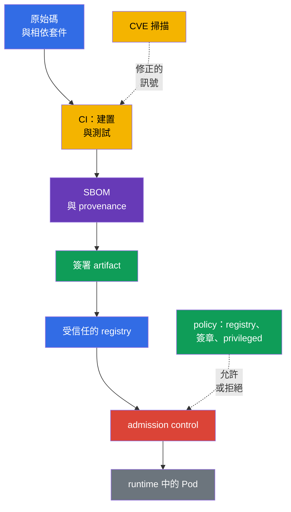
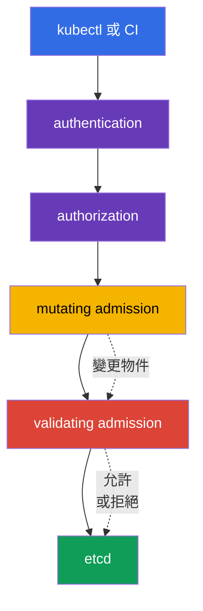

[Русская версия](ru.md) · [Eng version](README.md) · [Versión en español](es.md) · [Version française](fr.md) · [Deutsche Version](de.md) · [ქართული ვერსია](ge.md) · [日本語版](jp.md)

# 第 17 章：Supply chain、映像檔 registry 與 admission control

> **接下來。** 在第 16 章中，我們探討了惡意程式碼、有漏洞的映像檔及權限提升如何成為叢集威脅。現在我們在工作負載啟動前建立防護：追蹤 artifact 從原始碼開始的路徑，只允許來自受信任來源的映像檔，並檢查 Kubernetes API 請求。這是 KCSA **Platform Security** 領域，權重為 16%。範例與 API 名稱以 Kubernetes `v1.36` 為準。

Supply chain 安全性不只是一個 scanner 或簽章，而是一連串證據：清楚知道映像檔中包含**什麼**、由**誰及如何**建置、從何處取得，以及物件在建立當下是否符合組織規則。若有任何一環未受控，對 artifact 的信任就會減弱。

## 17.1 Supply chain：從程式碼到 runtime

**Software supply chain** 是軟體從原始碼和第三方相依套件，經過建置、測試與發布，到啟動 `Pod` 的映像檔所經歷的路徑。在 Kubernetes 中，信任邊界不只環繞 API：遭入侵的套件、CI runner 或 registry 可能在一般 runtime 控制項生效前，便將惡意程式碼帶入叢集。

實務上的鏈通常包含以下環節：

| 環節 | 可能出現的問題 | 控制範例 |
|---|---|---|
| 程式碼與相依套件 | repository 中有 secret，或使用有漏洞、被竄改的函式庫 | review、SCA、相依套件管理、secret 掃描 |
| CI 建置 | 未受保護的 runner 建置了不同的程式碼 | 隔離建置、最小權限、日誌、可重現性 |
| 映像檔與 metadata | artifact 的組成或來源不明 | SBOM、digest、provenance、簽章 |
| Registry | tag 被竄改，或發布未驗證的映像檔 | IAM/RBAC 存取、私有 repository、immutable tags、受信任來源 |
| Admission 與 runtime | 危險設定的物件被允許進入叢集 | policy、簽章驗證、PSA、可觀測性 |

**Digest**，例如 `@sha256:...`，能唯一指定映像檔內容。tag `:latest` 方便開發，但可變動：同一 tag 今天和明天可能代表不同位元組。Digest 不會使映像檔變得安全，但可鎖定究竟是哪個 artifact 已被檢查並啟動。

### SBOM：組成清單

**Software Bill of Materials (SBOM)** 是一份機器可讀的清單，列出所交付 artifact 內的元件、版本，有時也列出它們的關係。它回答的問題是：「我們的映像檔中是否有剛剛發布 CVE 的函式庫？」SBOM 不會修正漏洞，也不會證明建置可靠，但能縮短搜尋受影響工作負載所需時間。

常見的開放格式是 **SPDX** 與 **CycloneDX**。它們解決類似的盤點問題，但資料模型與生態系不同。`syft` 是可為檔案系統或 container image 建立 SBOM 的工具範例。考試時必須區分格式和工具的用途：SPDX/CycloneDX 描述 SBOM，而 `syft` 協助產生它。

### 簽章、`cosign` 與 sigstore

簽章將 artifact 與簽署方的 identity 關聯。在啟動前，驗證系統會確認簽章屬於所需 digest，並符合允許的 key 或 identity。因此，簽章會確認真實性（與受信任 signing identity 的關聯）及完整性（artifact 在簽署後未被悄悄變更），但不確認建置來源 - 那是 provenance/attestation 的獨立工作 - 也不會自行證明不存在 CVE 或 `Pod` 設定安全。

`cosign` 是用於簽署及驗證 container artifacts 的工具。**sigstore** 是一個讓簽章、identity 與透明日誌更易使用的生態系。依信任模型而定，組織可使用 key、CI 系統 identity 或企業 policy。重點不在特定命令，而在規則：允許前驗證簽章，並將其與 immutable digest 關聯，而不只是可變的 tag。

### SLSA 與 provenance

**SLSA v1.2**（Supply-chain Levels for Software Artifacts）為 supply chain 要求提供框架，並有彼此獨立的 **Build** 與 **Source** tracks。每個 track 都有自己的等級和要求：Build 等級並不表示 Source 等級，反之亦然。因此，等級必須連同 track 一起說明，且不可賦予其特定 SLSA 要求未聲明的特性。**Provenance** 是來源紀錄：哪個原始碼、流程與 builder 建立了 artifact。Reproducible build 是流程的有用特性，但不是 SLSA 等級的通用同義詞。SLSA 不是 Kubernetes API，也不取代 admission policy。它是團隊用來陳述及驗證 supply chain 要求的語言。

### 端到端鏈：threat → control → evidence

| 階段 | 威脅 | Control | Evidence |
|---|---|---|---|
| source/dependency | 惡意或有漏洞的相依套件 | review、SCA、secret scanning | PR/review 與 SCA report |
| build | CI 建置錯誤的 source | 受保護的 builder 與 provenance | build record、source revision、artifact digest |
| artifact | mutable tag 被竄改 | immutable digest | 對 `@sha256:...` 的 deployment/reference |
| inventory | image 組成不明 | SBOM | 與 digest 關聯的 SPDX/CycloneDX document |
| release | publisher 不明 | signature verification | verification result/signing identity |
| admission/deployment | 不適當的 artifact 或 manifest | allowlist/policy/PSA | admission allow/deny/audit event |
| runtime | 新 CVE 或異常行為 | re-scan 與 runtime monitoring | scan report、registry/runtime telemetry |

這條鏈不會把 scanner 變成安全證明：digest 固定 content，signature 將 artifact 與 identity 關聯，SBOM 描述組成，provenance 描述所宣告的 build path。每個 artefact 都提供不同的 evidence，且各有其限制。

## 17.2 Image repository 與映像檔信任

**Image repository** 或 registry 儲存映像檔及其 tags、digest、簽章和相關 metadata。公開 registry 有助於散布，但組織不應將每個公開映像檔都視為可信任。信任意指來源、擁有者、發布流程及檢查結果符合組織規則。

| 方法 | 效益 | 殘餘風險與控制 |
|---|---|---|
| 允許的 registry | 限制映像檔來源 | 受信任 registry 仍需要存取管理及掃描 |
| 私有 registry | 限制發布與 download，支援內部 artifacts | 不會自動使映像檔安全；仍需要權限、audit 與發布流程 |
| Allowlist repository | 禁止意外使用公開映像檔與名稱拼寫錯誤 | 規則必須考慮所有允許路徑及 migration |
| 使用 digest 而非 tag | 固定特定內容 | 不確認內容安全或已簽署 |
| 簽章 | 依 policy 將 artifact 與 identity 關聯 | 不取代 SBOM、provenance、CVE 分析或 manifest 檢查 |
| provenance | 描述所宣告的 artifact 建置路徑 | 不是簽章、SBOM 或 SLSA 等級 |
| SLSA v1.2 | 定義獨立的 Build 與 Source tracks 的要求 | 不是 SBOM、簽章或 reproducible build 的通用同義詞 |

私有 registry 的存取通常僅授與具備最小必要權限的 identity，且 credentials 不會放入 image 或 Git。Kubernetes 可以使用 `imagePullSecrets`，但這不是讓人廣泛讀取 namespace 中所有 secrets 的理由。Registry credentials 與其他 secrets 一樣，透過 RBAC、輪替與最小作用範圍來保護。

### 為何要掃描映像檔

Scanner 將映像檔的套件與函式庫比對已知漏洞及 CVE 資料庫。**Trivy** 是這類檢查的常用工具；它也能分析設定與 secrets，但在 image security 的脈絡中，其關鍵角色是找出映像檔內已知的漏洞。掃描結果有助於選擇已修正的基底或套件版本，並為 CI 設定門檻。

掃描無法看見所有種類的風險。它可能產生誤報，且已知 CVE 可能不適用於特定執行路徑。反過來說，未發現 CVE 不代表映像檔可靠：它可能包含 secrets、惡意邏輯或不安全的 `securityContext`。因此，掃描應搭配 SBOM、簽章、review 與 admission policy。

## 17.3 Admission control：寫入叢集前的決策

在 authentication 和 authorization 之後，Kubernetes API Server 會在將物件儲存至 etcd 前執行 admission control。此階段不只能評估使用者，還能評估所請求的物件本身：映像檔、`securityContext` 欄位、labels，以及是否符合企業規則。

**Mutating admission webhook** 可以變更物件，例如新增必要的 label、annotation 或 sidecar。它有助於標準化，但物件變更應可預測：不清楚的 mutation 會使調查變得困難，並可能與另一項 policy 衝突。

**Validating admission webhook** 會評估物件的最終版本並允許或拒絕請求。它不應變更物件。Mutating 和 validating webhook 都以外部服務運作，因此其可用性和 TLS 信任很重要：錯誤設定可能停止 deploy，或留下不希望出現的繞過路徑。當 webhook 無法使用時的行為，正是 `ValidatingWebhookConfiguration`/`MutatingWebhookConfiguration` 中 `failurePolicy` 欄位所規範的：若 webhook 不可用或傳回錯誤，`Fail` 會停止請求（較安全，但 webhook 故障時可能阻擋 deploy）；`Ignore` 則在此情況下不套用 webhook 檢查而放行請求 - 也就是當 `failurePolicy: Ignore` 的 webhook 故障或暫時不可用時，本應生效的控制會被悄悄停用，物件本身不會有任何變更。

Kubernetes 也提供以 **CEL**（Common Expression Language，一種內建於 Kubernetes API 的表達式語言，用來描述條件與規則而不執行任意程式碼：policy 定義 CEL 表達式，而 API server 會自行為特定物件計算它）為基礎的內建 declarative admission policies。`MutatingAdmissionPolicy` 可在沒有額外 HTTP webhook 的情況下修改符合條件的 API 物件；此 feature 自 Kubernetes `v1.36` 起為 stable，且預設 enabled。`ValidatingAdmissionPolicy` 執行內建 declarative validation，並可拒絕請求。兩種機制都使用 CEL，但解決不同問題：mutation 變更物件，validation 接受或拒絕物件。對於外部邏輯 - 例如對 registry 的網路請求或獨立 verifier - 仍需要外部 admission webhook / policy engine，或預先取得、可供 policy 本身使用的受信任 verification result。

`ValidatingAdmissionPolicy` 定義 validation logic，且是 cluster-scoped policy object。為使 policy 確實套用，需建立個別的 `ValidatingAdmissionPolicyBinding`：binding 參照 policy、設定 `validationActions`，並可透過包含 `namespaceSelector` 的 `matchResources` 縮小套用範圍。因此，不可說 `ValidatingAdmissionPolicy` 位於「namespace 中」；namespace scope 是透過 binding/matchResources 指定的。

### Policy 引擎：OPA/Gatekeeper 與 Kyverno

**OPA**（Open Policy Agent）是通用 policy 引擎，而 **Gatekeeper** 將其調整為 Kubernetes admission 與 constraint 管理。Policies 通常以 Rego 描述。**Kyverno** 是 Kubernetes 導向的 policy engine；其規則以 Kubernetes YAML 風格描述 validation、mutation，有時也描述物件生成。這些工具不是 Kubernetes 必要且可互換的部分：組織根據需求、團隊能力與既有 policy landscape 來選擇它們。

在 KCSA 層級，重要的是理解結果，而不是撰寫 Rego 或複雜的 Kyverno 規則。兩種典型 policy 如下：

| Policy 意圖 | 檢查內容 | 降低的威脅 |
|---|---|---|
| `allowed-registries` | 每個 `container` 和 `initContainer` 都使用帶有 `registry.corp.example/` 前綴的映像檔 | 啟動未驗證或意外使用的公開映像檔 |
| `deny-privileged` | `securityContext.privileged` 不等於 `true` | 權限擴張與 container escape 風險上升 |

這類規則彼此補充，但不相互取代。Allowlist registry 不保證 `Pod` 安全；禁止 `privileged` 也不會說明映像檔來源。此外，policy 應套用到所有適當的工作負載建立路徑，包括 `Deployment`、`Job` 和 `CronJob`，因為實際的 `Pod` 是由 controller 建立。

## 17.4 實務上的套用方式

團隊通常建立多個 gates，而非一個「完美」屏障：

1. 開發人員固定相依套件，且不將 secrets 放入程式碼或 image。
2. CI 從受控原始碼建置映像檔、產生 SBOM、掃描它，並將 artifact 發布至私有 registry。
3. CI 簽署 digest 並儲存 provenance，以便將 release 與特定建置關聯。
4. Admission-control 層限制允許的 registry；簽章驗證由 admission webhook / 外部 verifier 執行，或由 policy 檢查已提供的受信任 verification result。個別 validating policy 或 PSA 可獨立拒絕危險的 workload 欄位，例如 `privileged: true`。
5. Deploy 後，團隊追蹤新的 CVE、重新掃描既有映像檔，並更新受影響的 workload。

Policy 應分階段導入會更安全：先觀察違規並協調例外，之後再啟用拒絕。例外應範圍狹窄、具有負責人與檢視期限。為舊工作負載留下永久的全域「漏洞」，會讓 policy 淪為形式。

## 17.5 Exam vocabulary / 迷你詞彙表

| 術語 | 含義 |
|---|---|
| admission control | API 請求在 authentication 和 authorization 之後、物件寫入前的處理階段 |
| artifact | 建置結果，例如 container image、SBOM 或簽章 |
| `MutatingAdmissionPolicy` | 使用 CEL 對 API 物件進行 mutation 的內建 declarative admission policy；自 Kubernetes v1.36 起為 stable。 |
| `ValidatingAdmissionPolicy` | 使用 CEL 對 API 物件進行 validation 的內建 declarative admission policy。 |
| CEL | Common Expression Language；由內建 `MutatingAdmissionPolicy` 與 `ValidatingAdmissionPolicy` 使用。 |
| digest | 特定映像檔內容不可變的加密識別碼 |
| image registry | container images 和相關 metadata 的儲存庫 |
| provenance | artifact 來源及其建置流程的資訊 |
| SBOM | artifact 中元件與版本的機器可讀清單 |
| SLSA v1.2 | 具有獨立 Build 與 Source tracks 的要求框架；等級必須連同 track 一起說明。 |

## 17.6 Exam Essentials / 本章重點

- Supply chain 涵蓋從程式碼與相依套件到映像檔啟動的路徑；防護需要多個獨立控制項。
- SBOM 回答 artifact 組成的問題；SPDX 和 CycloneDX 是 SBOM 格式，而 `syft` 協助建立它。
- 透過 `cosign`/sigstore 的簽章依 policy 確認真實性（與受信任 signing identity 的關聯）及完整性，但不確認建置來源，也不取代 CVE 掃描與安全設定。
- SLSA v1.2 定義獨立的 Build 與 Source tracks，而 provenance 描述 artifact 來源；SLSA 和 provenance 都不可與 SBOM 或簽章相互替代。Reproducible build 不是 SLSA 等級的通用同義詞。
- 受信任或私有 registry 降低不受控來源的風險，而 `Trivy` 協助發現已知漏洞。
- Mutation 可由外部 `MutatingAdmissionWebhook` 或以 CEL 為基礎的內建 `MutatingAdmissionPolicy` 執行；validation 可由外部 validating webhook 或以 CEL 為基礎的內建 `ValidatingAdmissionPolicy` 執行。

## 17.7 不要混淆，以及它在考試中的出現方式

KCSA 題目通常檢驗控制項的用途與邊界。請區分：SBOM 盤點組成，scanner 尋找已知漏洞，簽章將 artifact 與 identity 關聯，provenance 描述所宣告的建置路徑，而 admission policy 決定是否允許物件進入叢集。SLSA v1.2 定義獨立的 Build 與 Source tracks，不取代 SBOM、簽章或 provenance。不要將私有 registry 與安全保證混為一談，也不要混淆 digest 與簽章，以及 reproducible build 與通用 SLSA 等級。

常見題目會要求為特定威脅選擇控制項。要禁止來自公開來源的映像檔，可使用 admission policy 中的 allowlist registry。要禁止 `privileged`，可使用 validating policy 或具有適當 profile 的 Pod Security Admission。要新增必要 metadata，使用 mutating admission。內建 `MutatingAdmissionPolicy` 與 `ValidatingAdmissionPolicy` 都使用 CEL，但前者變更物件，後者驗證物件。Webhook 並非因 Kubernetes 無法進行 declarative mutation/validation 而需要，而是當需要內建 CEL-policy 無法提供的外部邏輯或整合時才需要。

## 17.8 自我檢查問題

### 1. SBOM 主要為 container image 解決哪一項工作？

   - a. 列出元件和版本，以識別受漏洞影響的 artifacts。

   - b. 防止 `Pod` 取得 privileged 模式。

   - c. 自動修正基底映像檔中的 CVE。

   - d. 在傳輸至 registry 時加密 image。

答案與說明

**正確答案：a。** SBOM 盤點 artifact 的組成。它有助於找到受影響映像檔，但不會加密它們、套用 policy 或修正相依套件。

### 2. 根據組織 trust policy 成功驗證的映像檔簽章，最準確地確認什麼？

   - a. Scanner 保證 artifact 中不存在已知與未知漏洞。
   - b. 私有 registry 本身證明每個已儲存 image 的來源與 integrity。
   - c. 對特定 artifact 的 cryptographic assertion 已依 trust policy 針對允許的 key/identity 成功驗證。
   - d. 無論其 Pod configuration 為何，runtime 都保證以 non-root 身分啟動 container。

答案與說明

**正確答案：c。** 成功的 signature verification 表示在已設定 trust policy 的脈絡下，對特定 artifact 的 cryptographic assertion 已通過驗證。它不證明不存在 CVE、不取代 provenance，也不決定 runtime securityContext。

### 3. 哪種措施最能防止啟動來自意外公開 registry 的映像檔？

   - a. 為診斷 container 啟用 `privileged: true`。

   - b. 將 registry credentials 儲存在 Dockerfile 中。

   - c. 僅使用 `latest` tag。

   - d. 設定具有允許 registry allowlist 的 validating policy。

答案與說明

**正確答案：d。** Validating policy 可檢查每個映像檔名稱，並在物件寫入 etcd 前拒絕該物件。`latest` 可變，credentials 不應放入 image。

### 4. Mutating 與 validating admission webhook 的主要差異是什麼？

   - a. Validating webhook 加密 `Secret`，mutating webhook 建立 SBOM。

   - b. Mutating webhook 變更物件，validating webhook 決定允許或拒絕它。

   - c. 兩者沒有差異，只是同一機制的兩種名稱。

   - d. Mutating webhook 僅適用於 `Service`，validating 僅適用於 `Pod`。

答案與說明

**正確答案：b。** 請求會在 validation 前經過 mutation；validating webhook 檢查物件的最終形式，且不應變更它。

### 5. 哪個元件可讓您使用 CEL 表達式描述部分內建 Kubernetes validating 檢查，而無須個別 webhook？

   - a. `PodDisruptionBudget`。

   - b. `imagePullSecret`。

   - c. `ValidatingAdmissionPolicy`。

   - d. `NetworkPolicy`。

答案與說明

**正確答案：c。** `ValidatingAdmissionPolicy` 使用 CEL 對 API 物件進行宣告式檢查。其他資源分別處理網路、可用性及對 registry 的驗證。

> **接下來。** 若要實際設定 admission 與 policy 引擎，請使用 CKS 第 20 章。Supply chain 在 CKS 第 25-28 章中有詳細說明：SBOM/CI/CD/artifact repositories、registry/signature/validation、靜態分析與 image scanning。若要了解 images 與 API admission 的基本運作，請參閱 CKA 第 23 章與第 21 章。

[目錄](../README_TW.md) · [第 16 章](../16/tw.md) · [第 18 章](../18/tw.md)
