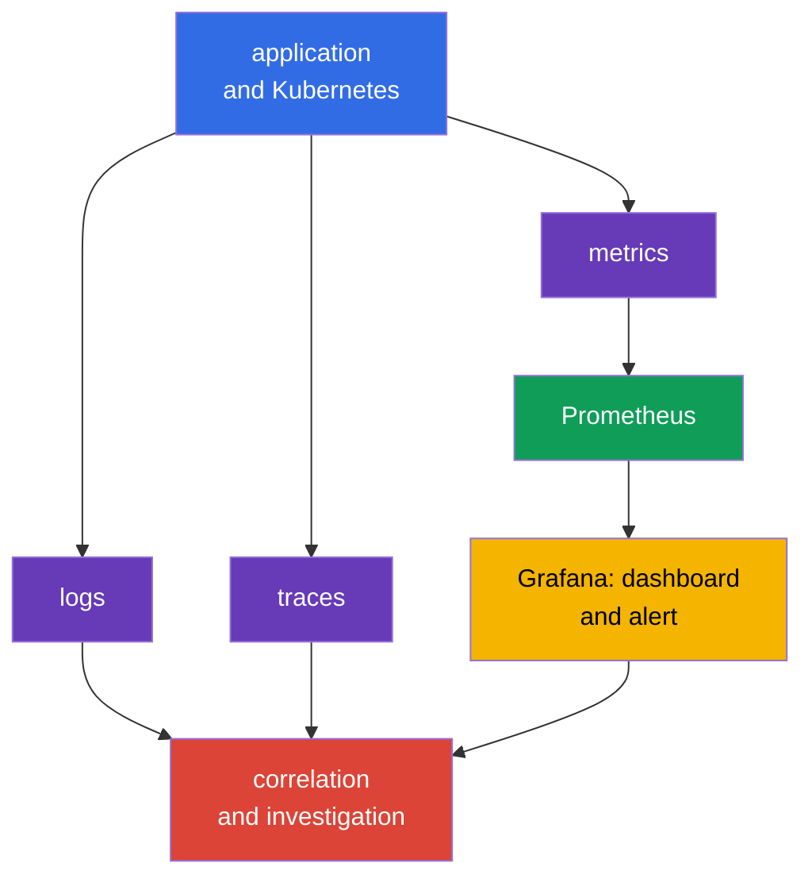
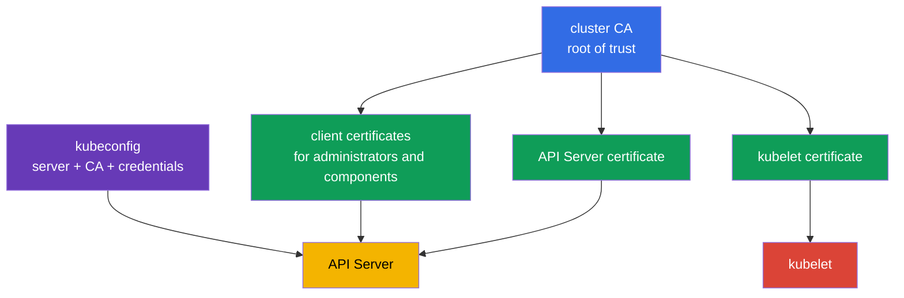
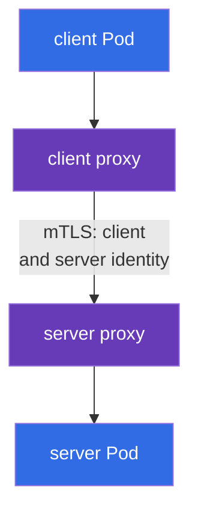

[Русская версия](ru.md) · [Versión en español](es.md) · [Version française](fr.md) · [Deutsche Version](de.md) · [ქართული ვერსია](ge.md) · [繁體中文版](tw.md) · [日本語版](jp.md)

# Chapter 18. Observability, PKI, connectivity, and service mesh

> **What is next.** Chapter 17 showed how to prevent an unverified artifact from entering the cluster. But preventive controls do not replace observing a running system, trust between its components, and protection of network traffic. This chapter covers the Observability, PKI, Connectivity, and Service Mesh competencies of the KCSA **Platform Security** domain, weighted at 16%. Examples and terminology apply to Kubernetes `v1.36`.

## 18.1 Observability: logs, metrics, and traces

**Observability** answers the question of what is happening inside a distributed system through its external signals. For security, it helps not only fix failures but also detect an attack, a compromised workload, or an incorrect configuration. No type of telemetry replaces the others.

| Signal | Question it answers | Example security signal |
|---|---|---|
| Logs | What exactly happened? | authentication failure, shell launch, TLS rejection |
| Metrics | How does state change over time? | spike in 401/403 responses, unusual egress, CPU saturation |
| Traces | Which services did a request pass through? | source of a slow or failing call between services |

`Prometheus` collects and stores numerical metrics, such as request counts, latency, and resource consumption. `Grafana` builds dashboards from this data and can display an alert. A dashboard is not an access control: it provides visibility from which the team investigates the cause and responds.

Correlation is important for security observability. For example, an increase in HTTP 403 responses can mean RBAC worked correctly, a client is misconfigured, or someone is probing for permissions. The answer comes from correlated time, identity, audit logs, API metrics, and application logs, not from one metric alone.

**Falco** is focused on runtime detection. It analyzes system events on a worker node and can report suspicious actions by a process in a container: an interactive shell, reading a sensitive file, launching a package manager, or an unexpected network action. A Falco signal requires context: legitimate debugging and an attack can sometimes look similar.

**Hubble** is Cilium observability tooling for network flows. It helps show which `Pod` established a connection, whether the connection was allowed or denied by policy, and which DNS names are involved. Hubble does not replace `NetworkPolicy`: the former observes flows, while the latter defines permissions.

## 18.2 Kubernetes PKI: trust and certificate rotation

PKI (Public Key Infrastructure) binds a cryptographic key to an identity through a certificate. In Kubernetes, the cluster CA signs component certificates, while clients and servers validate the chain of trust. TLS simultaneously provides channel confidentiality, authentication of the other party, and protection of data integrity in transit.

The simplified model looks like this:

The PKI chain for the exam: the **CA** signs a certificate; a **certificate** binds an identity and public key; **TLS** protects a specific connection; **mTLS** lets both parties present an identity; **rotation** limits credential lifetime and risk. In Kubernetes, this applies to API Server, kubelet, etcd, and client certificate authentication.

> **Do not confuse these.** TLS is not authorization, a certificate is not an RBAC permission, and TLS termination at Ingress does not mean automatic end-to-end encryption. A service mesh provides workload identity, mTLS, policy, and telemetry for service-to-service traffic; it does not replace Kubernetes RBAC, a vulnerability scanner, or application authorization.

`kubeconfig` usually contains the API Server address, CA data or a reference to it, and client credentials, such as a certificate or token. It is not a harmless configuration file. Its disclosure can grant access to the cluster with the permissions of the specified identity. Store kubeconfig with restricted access permissions, do not publish it in a repository, and revoke or replace compromised credentials.

A certificate has a validity period. **Certificate rotation** replaces an expiring key and certificate ahead of time so that the component keeps operating and a compromised credential has a limited lifetime. It is important to distinguish rotation of a component leaf certificate from replacing the CA: changing the CA affects every client and server that trusts it, so it requires a planned transition. The specific mechanism depends on the cluster deployment method and managed provider; at the KCSA level, the key point is understanding the goal and the risk of an expired or untrusted certificate.

Rotation practices must be supported by evidence, not merely declared as a process. Useful evidence for certificate lifecycle control includes expiry monitoring, which warns in advance about approaching expiry; records of rotations actually performed; an inventory of issued certificates; and an alert for certificates that are approaching expiry without a planned replacement. Without such evidence, a team may believe rotation happens but cannot show an auditor or an investigation that it actually occurs.

Certificate validation must include the trusted CA and the server name. Simple encryption without correct identity validation does not protect against server impersonation. Disabling TLS verification to resolve a connection error shifts the problem from availability to security.

## 18.3 Connectivity: TLS, ingress, and egress

Kubernetes networking includes several different traffic directions: client to application, `Pod` to `Pod`, `Pod` to API Server, and `Pod` to an external network. For each direction, the team defines who can establish a connection, how the peer is verified, and where traffic is encrypted.

| Direction | Typical risk | Conceptual control |
|---|---|---|
| client → Ingress → service | interception, incorrect certificate, exposed endpoint | TLS at Ingress, certificate validation, application authentication and authorization |
| `Pod` → `Pod` | traffic reading, impersonation, lateral movement | TLS or mTLS, `NetworkPolicy`, workload identity |
| `Pod` → external service | data leakage, access to a malicious endpoint | egress policy, DNS control, TLS, and destination allowlist |
| component → API Server | credential theft, MITM | TLS, trusted CA, least-privilege RBAC |

**Ingress** accepts incoming traffic into the cluster and usually terminates the TLS connection with the external client. This protects the segment up to Ingress, but it does not automatically mean the Ingress → `Service` or `Pod` segment is also encrypted. You need to explicitly understand the TLS termination point and the protection required for the next segment.

**Egress** is outbound traffic from a `Pod` or cluster. Without restrictions, a compromised workload can contact internal services, a metadata endpoint, or an external command-and-control server. `NetworkPolicy` with specific egress permissions reduces this risk if the CNI enforces the policy. It does not replace TLS: policy selects the permitted direction, while TLS protects the content and identity of the connection.

For connectivity, do not rely only on an IP address and a "closed network." Zero trust assumes that a network may be observable or partly compromised. Therefore, sensitive flows require segmentation, minimal permissions, and cryptographic peer verification.

## 18.4 Service mesh: mTLS and traffic policies

A **service mesh** adds a control layer for service traffic. A data-plane proxy beside a workload (or another mesh data-plane component) establishes mTLS, uses an issued workload identity, applies traffic policy, and produces telemetry. The mesh control-plane identity/CA mechanism, for example `istiod` CA together with the Istio agent, provides issuance/signing and rotation of workload certificates/identities, not the proxy itself.

mTLS (mutual TLS) differs from ordinary server-side TLS: not only the server but also the client presents a certificate. Therefore, a service can verify which workload is calling it, and the client can verify the identity of the service.

Traffic policy (allow, timeout, retry, circuit breaking) is applied by the same proxy on both sides of the connection. It is not shown as a separate node in the diagram, to avoid mixing two different mechanisms in one graph; its role and limitations are described in more detail at the end of this section.

In Istio, the `PeerAuthentication` resource sets the mTLS acceptance mode for the mesh or part of it. The `STRICT` mode requires incoming mesh traffic to the selected workload to use mTLS. This is useful against accidental unencrypted calls and an unauthenticated peer, but by itself it does not determine **who exactly** may call the service or which URL is allowed. Authorization policies, `NetworkPolicy`, and application authorization are required for this, depending on the boundary.

Linkerd also provides identity and mTLS, but it does not use the Istio `PeerAuthentication` resource. On the exam, it is important not to attribute a specific resource from one mesh to another: the general principle is the same, while the specific APIs differ.

Mesh traffic policies can define routing, timeout, retry, circuit breaking, and connection limits. This improves manageability and resilience, while the security benefit appears when policy restricts trusted directions and makes communication observable. Retries are not protection against an attack and, if misconfigured, can increase load during a failure.

A mesh is justified when many services need a common identity, mTLS, observability, and policy. For a small, simple environment, it adds proxies, certificates, and operational complexity. The choice should follow from the threat model and requirements, not from the mere presence of the technology.

## 18.5 How this is applied in practice

A team ties these tools into one process rather than installing them separately:

1. It defines baseline security signals: authentication failures, increased 5xx responses, denied egress, Falco events, and certificate changes.
2. It sends metrics to Prometheus and Grafana, and correlates logs, Hubble network flows, and audit events by time, namespace, `Pod`, and identity.
3. It manages certificates as credentials: it knows the CA owner, validity periods, rotation path, and the way to revoke compromised access.
4. For every ingress and egress path, it records trusted directions, TLS termination, and the peer verification requirement. For critical inter-service flows, it applies `NetworkPolicy` and, if a shared identity layer is needed, a service mesh with mTLS.

For example, an alert reports that a payments service has started connecting to an unknown external address. A metric shows increased egress, Hubble identifies the source `Pod`, Falco helps investigate process behavior, and application logs and the audit log complete the picture. After containment, the team refines the egress policy rather than only blocking one IP address.

## 18.6 Exam vocabulary / Mini-glossary

| Term | Meaning |
|---|---|
| CA | certification authority trusted when validating certificates |
| Falco | runtime detector of suspicious system events |
| Grafana | tool for visualizing dashboards and alerts from observability data |
| Hubble | Cilium observability tool for network flows |
| mTLS | TLS in which both parties to a connection present a certificate |
| `PeerAuthentication` | Istio resource for setting the mTLS traffic acceptance mode |
| PKI | infrastructure of keys, certificates, and chains of trust |
| Prometheus | system for collecting and storing metrics |
| service mesh | infrastructure layer for managing service-to-service traffic |
| TLS termination | point at which a component terminates TLS and decrypts the connection |

## 18.7 Exam Essentials / Chapter summary

- Logs, metrics, and traces answer different questions; correlating them makes a security signal useful for investigation.
- Prometheus and Grafana work with metrics, Falco observes runtime events, and Hubble provides visibility into Cilium network flows.
- The CA, component certificates, and `kubeconfig` form the Kubernetes trust boundary. kubeconfig disclosure and an expired certificate are security and availability risks.
- TLS protects the channel and verifies the peer, while Ingress TLS does not guarantee encryption of every subsequent segment. Egress and ingress require explicit boundaries and policies.
- Istio and Linkerd use mTLS for workload identity. `PeerAuthentication` with `STRICT` in Istio requires mTLS but does not replace authorization or network segmentation.

## 18.8 Do not confuse these concepts and how they appear on the exam

In an MCQ (multiple choice question), distinguish the purpose of tools: Prometheus collects metrics, Grafana displays them, Falco sees runtime behavior, and Hubble observes Cilium flows. A question about TLS can test the termination boundary: a certificate at Ingress does not prove encryption to the backend.

A common trap is to consider mTLS or `PeerAuthentication` a replacement for `NetworkPolicy` and RBAC. mTLS authenticates and protects a connection, `NetworkPolicy` defines permitted network flow, and RBAC controls access to the Kubernetes API. Also, do not confuse `STRICT` with "allow all traffic": it is a requirement to use mTLS for matching incoming connections.

## 18.9 Self-check questions

### 1. Which tool is primarily intended to detect suspicious process actions in an already running container?

   - a. Prometheus

   - b. Falco

   - c. `NetworkPolicy`

   - d. Grafana

Answer and explanation

**Correct answer: b. Falco.** Falco analyzes runtime events and can signal a shell, access to sensitive files, or other suspicious activity. Prometheus collects metrics, while Grafana visualizes data.

### 2. Which statement correctly describes the role of a CA in Kubernetes PKI?

   - a. A CA signs certificates, and clients use it to validate the chain of trust.

   - b. A CA replaces RBAC for access to the API Server.

   - c. A CA stores all `Secret` values in encrypted form.

   - d. A CA allows or denies egress from a `Pod`.

Answer and explanation

**Correct answer: a.** A CA is the root of, or part of, the chain of trust for certificates. TLS authentication does not eliminate RBAC authorization or define network rules.

### 3. In Istio, a workload has `PeerAuthentication` set to `STRICT`. What does this primarily mean?

   - a. All workload logs are stored in etcd.

   - b. Only incoming mesh traffic using mTLS is admitted to the workload.

   - c. Any `Pod` receives administrator permissions in the API Server.

   - d. All outbound connections are automatically denied.

Answer and explanation

**Correct answer: b.** `STRICT` requires mTLS for matching incoming traffic. It is not RBAC, an egress policy, or a logging system.

### 4. Which statement about TLS at Ingress is true?

   - a. It protects the connection up to the TLS termination point, and the following segment must be assessed separately.

   - b. It replaces client certificate validation.

   - c. It removes the need to restrict access to the application.

   - d. It automatically encrypts every segment from Ingress to all `Pod` instances.

Answer and explanation

**Correct answer: a.** TLS applies to a specific connection. If Ingress terminates TLS, the security of the next channel to the backend depends on its separate configuration and controls.

### 5. What best describes the difference between Hubble and `NetworkPolicy`?

   - a. Both tools are intended only to encrypt traffic.

   - b. Hubble replaces a service mesh, and `NetworkPolicy` replaces RBAC.

   - c. Hubble observes network flows, while `NetworkPolicy` defines allowed or denied flows.

   - d. Hubble creates certificates, while `NetworkPolicy` stores metrics.

Answer and explanation

**Correct answer: c.** Hubble provides observability for Cilium network flows. `NetworkPolicy` is a declarative access control for network connections when supported by the CNI.

> **Where to next.** Practical encryption of Pod-to-Pod traffic and mTLS in Cilium, Istio, and Linkerd are covered in CKS chapter 23. Configuring and validating Falco runtime detection is covered in CKS chapter 29.

[Contents](../README.md) · [Chapter 17](../17/README.md) · [Chapter 19](../19/README.md)