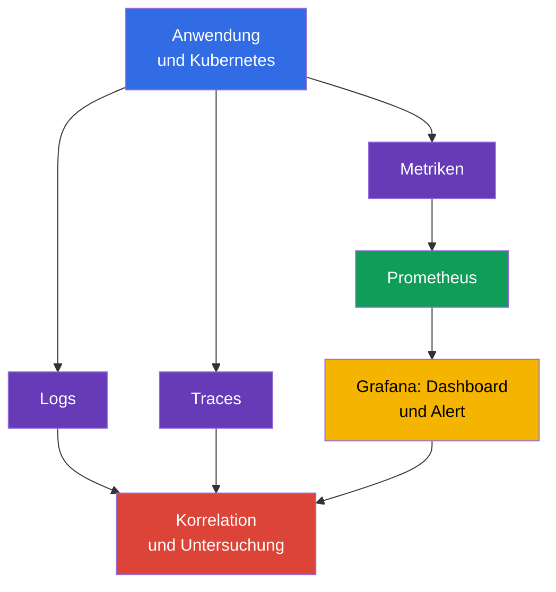
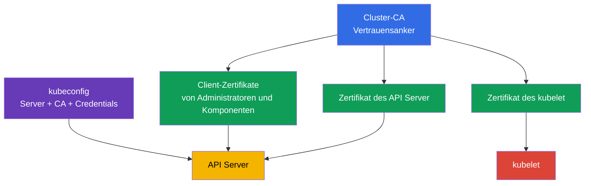
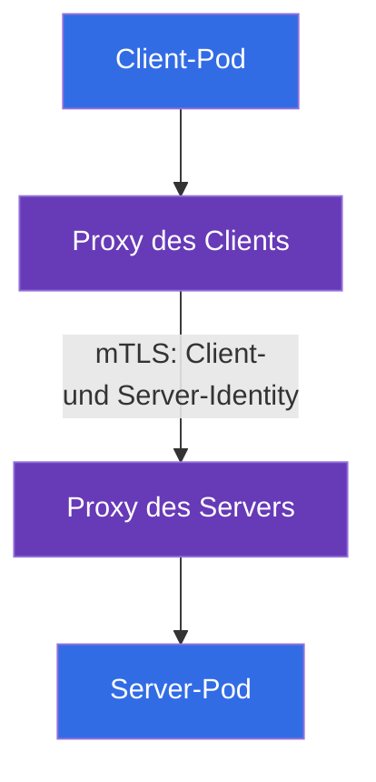

[Русская версия](ru.md) · [Eng version](README.md) · [Versión en español](es.md) · [Version française](fr.md) · [ქართული ვერსია](ge.md) · [繁體中文版](tw.md) · [日本語版](jp.md)

# Kapitel 18. Observability, PKI, Connectivity und Service Mesh

> **Wie geht es weiter?** Kapitel 17 zeigte, wie ein nicht verifiziertes Artefakt vom Cluster ferngehalten wird. Präventive Kontrollen ersetzen jedoch weder die Beobachtung eines laufenden Systems noch Vertrauen zwischen seinen Komponenten oder den Schutz des Netzwerkverkehrs. Hier behandeln wir die Kompetenzen Observability, PKI, Connectivity und Service Mesh der KCSA-Domäne **Platform Security** mit einer Gewichtung von 16 %. Die Beispiele und Begriffe beziehen sich auf Kubernetes `v1.36`.

## 18.1 Observability: Logs, Metriken und Traces

**Observability** beantwortet anhand der externen Signale einer verteilten Anwendung die Frage, was in ihr geschieht. Für die Sicherheit hilft sie nicht nur bei der Behebung von Ausfällen, sondern auch dabei, einen Angriff, eine kompromittierte Workload oder eine fehlerhafte Konfiguration zu erkennen. Keine Art von Telemetrie ersetzt die anderen.

| Signal | Welche Frage beantwortet es? | Beispiel eines Security-Signals |
|---|---|---|
| Logs | Was genau ist geschehen? | Authentifizierungsfehler, Start einer Shell, TLS-Ablehnung |
| Metriken | Wie verändert sich der Zustand im Zeitverlauf? | Anstieg von 401/403, ungewöhnlicher Egress, CPU-Sättigung |
| Traces | Über welche Services lief eine Anfrage? | Ursache eines langsamen oder fehlerhaften Aufrufs zwischen Services |

`Prometheus` erfasst und speichert numerische Metriken, etwa die Anzahl der Anfragen, Latenz und Ressourcennutzung. `Grafana` erstellt daraus Dashboards und kann Alerts anzeigen. Ein Dashboard ist keine Zugriffskontrolle: Es schafft Sichtbarkeit, anhand derer das Team die Ursache prüft und reagiert.

Für Security-Observability ist Korrelation wichtig. Beispielsweise kann ein Anstieg von HTTP 403 auf korrekt funktionierendes RBAC, einen falsch konfigurierten Client oder das Ausloten verfügbarer Berechtigungen hinweisen. Die Antwort liefern abgeglichene Zeit, identity, Audit-Log, API-Metriken und Anwendungs-Logs, nicht eine einzelne Metrik allein.

**Falco** ist auf Runtime Detection ausgerichtet. Es analysiert Systemereignisse des Worker-Nodes und kann verdächtige Aktionen eines Prozesses in einem Container melden: eine interaktive Shell, das Lesen einer sensiblen Datei, den Start eines Package Managers oder eine unerwartete Netzwerkaktion. Ein Falco-Signal benötigt Kontext: Legitime Fehlersuche und ein Angriff können manchmal ähnlich aussehen.

**Hubble** ist das Observability-Werkzeug von Cilium für Netzwerkflüsse. Es hilft zu erkennen, welcher `Pod` eine Verbindung aufgebaut hat, ob sie durch eine Policy erlaubt oder abgelehnt wurde und welche DNS-Namen beteiligt sind. Hubble ersetzt keine `NetworkPolicy`: Ersteres beobachtet Flüsse, Letzteres definiert die Erlaubnisse.

## 18.2 Kubernetes-PKI: Vertrauen und Zertifikatsrotation

PKI (Public Key Infrastructure) verbindet über ein Zertifikat einen kryptografischen Schlüssel mit einer Identität. In Kubernetes signiert die Cluster-CA die Zertifikate der Komponenten, und Clients sowie Server prüfen die Vertrauenskette. TLS bietet zugleich Vertraulichkeit des Kanals, Überprüfung der Authentizität der Gegenstelle und Schutz der Integrität von Daten auf dem Übertragungsweg.

Das vereinfachte Modell sieht so aus:

Die PKI-Kette für die Prüfung: Eine **CA** signiert ein certificate; ein **certificate** verbindet identity und public key; **TLS** schützt eine konkrete Verbindung; **mTLS** ermöglicht beiden Seiten, ihre identity vorzuweisen; **rotation** begrenzt die lifetime und das Risiko eines credential. In Kubernetes betrifft dies Zertifikate für API Server, kubelet, etcd und Client Certificate Authentication.

> **Nicht verwechseln.** TLS ist keine authorization, ein certificate ist keine RBAC permission, und TLS termination an einem Ingress bedeutet nicht automatisch End-to-End Encryption. Ein Service Mesh bietet Workload Identity, mTLS, Policy und Telemetrie für Service-to-Service Traffic; es ersetzt weder Kubernetes RBAC noch einen Vulnerability Scanner oder Anwendungsautorisierung.

`kubeconfig` enthält normalerweise die Adresse des API Server, CA-Daten oder eine Referenz darauf und Client-Credentials, etwa ein Zertifikat oder einen Token. Dies ist keine harmlose Konfigurationsdatei. Ihr Verlust kann Zugriff auf den Cluster mit den Rechten der angegebenen identity ermöglichen. Kubeconfig-Dateien werden mit eingeschränkten Zugriffsrechten gespeichert, nicht im Repository veröffentlicht und bei kompromittierten Credentials widerrufen oder ersetzt.

Ein Zertifikat hat eine Gültigkeitsdauer. **Zertifikatsrotation** ersetzt einen ablaufenden Schlüssel und ein Zertifikat im Voraus, damit die Komponente weiterarbeitet und ein kompromittiertes credential nur begrenzte Zeit gültig bleibt. Es ist wichtig, die Rotation eines Leaf-Zertifikats einer Komponente von einem Wechsel der CA zu unterscheiden: Ein CA-Wechsel betrifft alle Clients und Server, die ihr vertrauen, und erfordert deshalb eine geplante Migration. Der konkrete Mechanismus hängt von der Bereitstellungsart des Clusters und dem verwalteten Provider ab; auf KCSA-Ebene ist entscheidend, Ziel und Risiko eines abgelaufenen oder nicht vertrauenswürdigen Zertifikats zu verstehen.

Die Rotationspraxis muss durch evidence belegt werden, nicht nur als Prozess behauptet werden. Geeignete Nachweise für eine certificate-lifecycle-Kontrolle sind expiry monitoring, das rechtzeitig vor einem nahenden Ablauf warnt, Aufzeichnungen tatsächlich durchgeführter Rotationen (rotation records), ein Inventar ausgestellter Zertifikate sowie ein Alert für Zertifikate, die sich ohne geplanten Ersatz ihrem Ablauf nähern. Ohne solche evidence kann ein Team annehmen, dass Rotation stattfindet, ohne einem Auditor oder einer Untersuchung nachweisen zu können, dass sie tatsächlich durchgeführt wird.

Die Prüfung eines Zertifikats muss die vertrauenswürdige CA und den Servernamen einschließen. Bloße Verschlüsselung ohne korrekte Identity-Prüfung schützt nicht vor der Vortäuschung eines Servers. Das Abschalten der TLS-Prüfung, um einen Verbindungsfehler zu beheben, verlagert das Problem von Verfügbarkeit zu Sicherheit.

## 18.3 Connectivity: TLS, Ingress und Egress

Das Kubernetes-Netzwerk umfasst mehrere unterschiedliche Verkehrsrichtungen: Client zur Anwendung, `Pod` zu `Pod`, `Pod` zu API Server und `Pod` zum externen Netzwerk. Für jede Richtung legt das Team fest, wer eine Verbindung herstellen darf, wie die Gegenstelle geprüft wird und wo der Verkehr verschlüsselt ist.

| Richtung | Typisches Risiko | Konzeptionelle Kontrolle |
|---|---|---|
| Client → Ingress → Service | Abhören, falsches Zertifikat, offener Endpoint | TLS am Ingress, Zertifikatsprüfung, Authentifizierung und Autorisierung der Anwendung |
| `Pod` → `Pod` | Mitlesen von Verkehr, Vortäuschung, laterale Bewegung | TLS oder mTLS, `NetworkPolicy`, Workload Identity |
| `Pod` → externer Service | Datenabfluss, Zugriff auf schädlichen Endpoint | Egress Policy, DNS-Kontrolle, TLS und Allowlist des Ziels |
| Komponente → API Server | Credential-Diebstahl, MITM | TLS, vertrauenswürdige CA, Least-Privilege-RBAC |

**Ingress** nimmt eingehenden Traffic in den Cluster an und beendet gewöhnlich die TLS-Verbindung zum externen Client. Das schützt den Abschnitt bis zum Ingress, bedeutet aber nicht automatisch, dass auch der Abschnitt Ingress → `Service` oder `Pod` verschlüsselt ist. Der Ort der TLS termination und der erforderliche Schutz des folgenden Abschnitts müssen ausdrücklich verstanden werden.

**Egress** ist ausgehender Traffic aus einem `Pod` oder Cluster. Ohne Einschränkungen kann eine kompromittierte Workload auf interne Services, einen Metadata Endpoint oder einen externen Command-and-Control-Server zugreifen. Eine `NetworkPolicy` mit gezielten Egress-Erlaubnissen verringert dieses Risiko, wenn das CNI die Policy durchsetzt. Sie ersetzt TLS nicht: Eine Policy wählt die zulässige Richtung, TLS schützt den Inhalt und die identity der Verbindung.

Für Verbindungen darf man sich nicht nur auf die IP-Adresse und ein „geschlossenes Netzwerk“ verlassen. Zero Trust geht davon aus, dass das Netzwerk beobachtbar oder teilweise kompromittiert sein kann. Deshalb benötigen sensible Flüsse Segmentierung, minimale Berechtigungen und kryptografische Prüfung des Peer.

## 18.4 Service Mesh: mTLS und Traffic Policies

Ein **Service Mesh** fügt eine Verwaltungsebene für Service-Traffic hinzu. Ein Data-Plane-Proxy neben einer Workload (oder eine andere Data-Plane-Komponente des Mesh) etabliert mTLS, verwendet eine ausgestellte Workload Identity, wendet Traffic Policy an und erzeugt Telemetrie. Die Ausstellung, Signierung und Rotation von Workload Certificates/Identities übernimmt der Control-Plane Identity/CA Mechanism des Mesh, zum Beispiel die `istiod` CA zusammen mit dem Istio Agent, nicht der Proxy selbst.

mTLS (mutual TLS) unterscheidet sich von gewöhnlichem serverseitigem TLS: Nicht nur der Server, sondern auch der Client legt ein Zertifikat vor. Dadurch kann ein Service prüfen, welche Workload ihn aufruft, und ein Client kann sich der identity des Service vergewissern.

Traffic Policy (allow, timeout, retry, circuit breaking) wird durch denselben Proxy auf beiden Seiten der Verbindung angewandt. Sie wird im Diagramm nicht als separater Knoten dargestellt, damit nicht zwei verschiedene Mechanismen in einer Grafik vermischt werden; ihre Rolle und Grenzen werden am Ende dieses Abschnitts näher erläutert.

In Istio legt die Ressource `PeerAuthentication` den Modus fest, in dem mTLS für das Mesh oder einen Teil davon akzeptiert wird. Der Modus `STRICT` verlangt, dass eingehender Mesh-Traffic zur ausgewählten Workload mTLS verwendet. Das hilft gegen einen versehentlichen unverschlüsselten Aufruf und einen nicht authentifizierten Peer, legt aber nicht selbst fest, **wer genau** einen Service aufrufen darf und welche URL erlaubt ist. Dafür werden je nach Grenze Autorisierungs-Policies, `NetworkPolicy` und Anwendungsautorisierung benötigt.

Linkerd bietet ebenfalls Identity und mTLS, verwendet jedoch nicht die Istio-Ressource `PeerAuthentication`. In der Prüfung ist es wichtig, nicht ein konkretes Objekt eines Mesh einem anderen zuzuschreiben: Das allgemeine Prinzip ist gleich, die konkreten APIs unterscheiden sich.

Traffic Policies eines Mesh können Routing, Timeout, Retry, Circuit Breaking und Verbindungsbegrenzungen festlegen. Das verbessert Steuerbarkeit und Resilienz; der Sicherheitsnutzen entsteht, wenn die Policy vertrauenswürdige Richtungen begrenzt und die Kommunikation beobachtbar macht. Wiederholungsversuche sind kein Schutz vor einem Angriff und können bei fehlerhafter Konfiguration die Last während eines Ausfalls verstärken.

Ein Mesh ist sinnvoll, wenn viele Services einheitliche Identity, mTLS, Observability und Policy benötigen. Für eine kleine, einfache Umgebung fügt es Proxys, Zertifikate und operative Komplexität hinzu. Die Wahl sollte dem Bedrohungsmodell und den Anforderungen folgen, nicht allein dem Vorhandensein der Technologie.

## 18.5 Praktische Anwendung

Das Team verbindet diese Werkzeuge zu einem Prozess, statt sie getrennt zu installieren:

1. Es definiert grundlegende Security-Signale: Authentifizierungsablehnungen, Anstieg von 5xx, verbotener Egress, Falco-Ereignisse und Zertifikatsänderungen.
2. Es führt Metriken in Prometheus und Grafana zusammen und korreliert Logs, Hubble-Netzwerkflüsse und Audit-Ereignisse nach Zeit, Namespace, `Pod` und identity.
3. Es verwaltet Zertifikate als Credentials: Es kennt Eigentümer der CA, Fristen, den Rotationspfad und die Methode zum Widerruf kompromittierten Zugriffs.
4. Für jeden Ingress und Egress dokumentiert es vertrauenswürdige Richtungen, TLS termination und die Anforderung zur Peer-Prüfung. Für kritische Inter-Service-Flüsse setzt es `NetworkPolicy` und, falls eine gemeinsame Identity-Schicht benötigt wird, ein Service Mesh mit mTLS ein.

Beispielsweise meldet ein Alert, dass der Zahlungs-Service begonnen hat, eine unbekannte externe Adresse aufzurufen. Eine Metrik zeigt steigenden Egress, Hubble weist auf den Ausgangs-`Pod` hin, Falco hilft bei der Prüfung des Prozessverhaltens, und Anwendungs-Logs sowie Audit-Log ergänzen das Bild. Nach der Eindämmung präzisiert das Team die Egress Policy, statt nur eine einzelne IP-Adresse zu sperren.

## 18.6 Exam vocabulary / Mini-Glossar

| Begriff | Bedeutung |
|---|---|
| CA | Zertifizierungsstelle, der bei der Zertifikatsprüfung vertraut wird |
| Falco | Runtime-Detektor für verdächtige Systemereignisse |
| Grafana | Werkzeug zur Visualisierung von Dashboards und Alerts anhand von Observability-Daten |
| Hubble | Werkzeug zur Beobachtung der Cilium-Netzwerkflüsse |
| mTLS | TLS, bei dem beide Seiten der Verbindung ein Zertifikat vorlegen |
| `PeerAuthentication` | Istio-Ressource zur Festlegung des mTLS-Modus für eingehenden Traffic |
| PKI | Infrastruktur aus Schlüsseln, Zertifikaten und Vertrauensketten |
| Prometheus | System zur Erfassung und Speicherung von Metriken |
| Service Mesh | Infrastrukturschicht zur Verwaltung von Inter-Service-Traffic |
| TLS termination | Punkt, an dem eine Komponente TLS beendet und die Verbindung entschlüsselt |

## 18.7 Exam Essentials / Zusammenfassung des Kapitels

- Logs, Metriken und Traces beantworten unterschiedliche Fragen; ihre Korrelation macht ein Security-Signal für eine Untersuchung nutzbar.
- Prometheus und Grafana arbeiten mit Metriken, Falco beobachtet Runtime-Ereignisse und Hubble schafft Sichtbarkeit für Cilium-Netzwerkflüsse.
- CA, Komponentenzertifikate und `kubeconfig` bilden die Vertrauensgrenze von Kubernetes. Eine verlorene kubeconfig und ein abgelaufenes Zertifikat sind Sicherheits- und Verfügbarkeitsrisiken.
- TLS schützt einen Kanal und prüft den Peer, aber Ingress TLS garantiert nicht die Verschlüsselung aller folgenden Abschnitte. Egress und Ingress benötigen explizite Grenzen und Policies.
- Istio und Linkerd verwenden mTLS für die Identity von Workloads. `PeerAuthentication` mit `STRICT` in Istio verlangt mTLS, ersetzt aber weder Autorisierung noch Netzwerksegmentierung.

## 18.8 Nicht verwechseln und typische Prüfungsfragen

Unterscheiden Sie in MCQ (multiple choice question, Frage mit Antwortauswahl) die Aufgaben der Werkzeuge: Prometheus erfasst Metriken, Grafana zeigt sie an, Falco erkennt Runtime-Verhalten und Hubble beobachtet Cilium-Flüsse. Eine Frage zu TLS kann die Grenze der TLS termination prüfen: Ein Zertifikat am Ingress belegt keine Verschlüsselung bis zum Backend.

Eine häufige Falle ist, mTLS oder `PeerAuthentication` als Ersatz für `NetworkPolicy` und RBAC anzusehen. mTLS prüft und schützt die Verbindung, `NetworkPolicy` bestimmt den zulässigen Netzwerkfluss und RBAC steuert den Zugriff auf die Kubernetes API. Verwechseln Sie außerdem nicht `STRICT` mit „allen Traffic erlauben“: Es ist die Anforderung, mTLS für passende eingehende Verbindungen zu verwenden.

## 18.9 Fragen zur Selbstkontrolle

### 1. Welches Werkzeug ist in erster Linie dafür vorgesehen, verdächtige Aktionen eines Prozesses in einem bereits laufenden Container zu erkennen?

   - a. Prometheus

   - b. Falco

   - c. `NetworkPolicy`

   - d. Grafana

Antwort und Erläuterung

**Richtige Antwort: b. Falco.** Falco analysiert Runtime-Ereignisse und kann eine Shell, Zugriff auf sensible Dateien oder andere verdächtige Aktivitäten melden. Prometheus erfasst Metriken und Grafana visualisiert Daten.

### 2. Was beschreibt die Rolle einer CA in der Kubernetes-PKI korrekt?

   - a. Eine CA signiert Zertifikate, und Clients verwenden sie zur Prüfung der Vertrauenskette.

   - b. Eine CA ersetzt RBAC beim Zugriff auf den API Server.

   - c. Eine CA speichert alle Werte von `Secret` verschlüsselt.

   - d. Eine CA erlaubt oder verbietet Egress aus einem `Pod`.

Antwort und Erläuterung

**Richtige Antwort: a.** Eine CA ist der Vertrauensanker oder Teil der Vertrauenskette für Zertifikate. TLS-Authentifizierung hebt weder RBAC-Autorisierung auf noch definiert sie Netzwerkregeln.

### 3. Für eine Workload ist in Istio `PeerAuthentication` mit dem Modus `STRICT` festgelegt. Was folgt daraus vorrangig?

   - a. Alle Logs der Workload werden in etcd gespeichert.

   - b. Zur Workload wird nur eingehender Mesh-Traffic mit mTLS zugelassen.

   - c. Jeder `Pod` erhält Administratorrechte im API Server.

   - d. Alle ausgehenden Verbindungen werden automatisch abgelehnt.

Antwort und Erläuterung

**Richtige Antwort: b.** `STRICT` verlangt mTLS für passenden eingehenden Traffic. Es ist weder RBAC noch eine Egress Policy oder ein Logging-System.

### 4. Welche Aussage über TLS an einem Ingress ist richtig?

   - a. Es schützt die Verbindung bis zum Punkt der TLS termination, und der nachfolgende Abschnitt muss separat bewertet werden.

   - b. Es ersetzt die Zertifikatsprüfung durch den Client.

   - c. Es macht die Zugriffsbeschränkung der Anwendung überflüssig.

   - d. Es verschlüsselt automatisch jeden Abschnitt vom Ingress bis zu allen `Pod`.

Antwort und Erläuterung

**Richtige Antwort: a.** TLS gilt für eine konkrete Verbindung. Wenn der Ingress TLS beendet, hängt die Sicherheit des folgenden Kanals zum Backend von dessen eigener Konfiguration und seinen Kontrollen ab.

### 5. Wie lässt sich der Unterschied zwischen Hubble und `NetworkPolicy` am besten beschreiben?

   - a. Beide Werkzeuge dienen ausschließlich der Verschlüsselung von Traffic.

   - b. Hubble ersetzt Service Mesh und `NetworkPolicy` ersetzt RBAC.

   - c. Hubble beobachtet Netzwerkflüsse, und `NetworkPolicy` definiert erlaubte oder verbotene Flüsse.

   - d. Hubble erstellt Zertifikate, und `NetworkPolicy` speichert Metriken.

Antwort und Erläuterung

**Richtige Antwort: c.** Hubble bietet Observability für Cilium-Netzwerkflüsse. `NetworkPolicy` ist bei Unterstützung durch das CNI eine deklarative Zugriffskontrolle für Netzwerkverbindungen.

> **Wie geht es weiter?** Die praktische Verschlüsselung von Pod-to-Pod Traffic und mTLS in Cilium, Istio und Linkerd werden in Kapitel 23 CKS behandelt. Die Konfiguration und Prüfung von Runtime Detection mit Falco in Kapitel 29 CKS.

[Inhaltsverzeichnis](../README_DE.md) · [Kapitel 17](../17/de.md) · [Kapitel 19](../19/de.md)