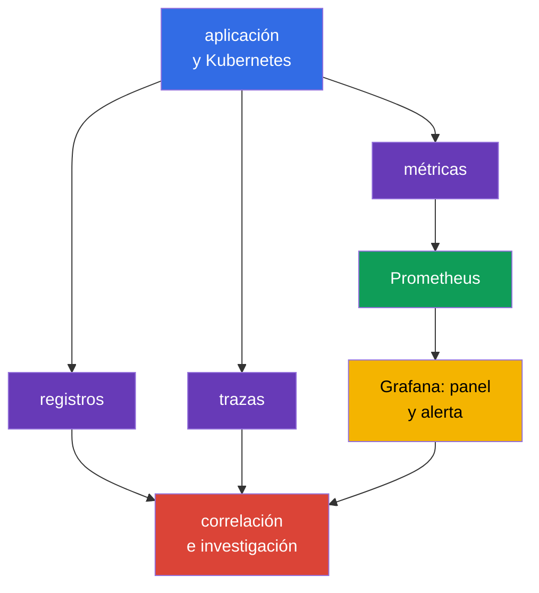
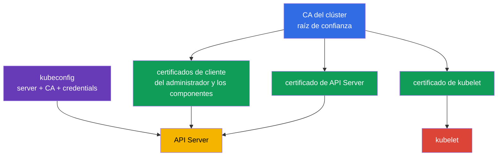
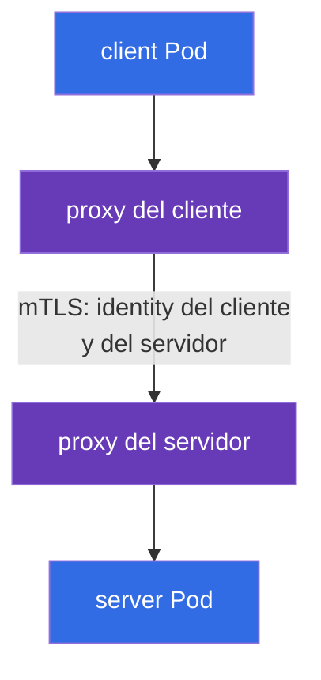

[Русская версия](ru.md) · [Eng version](README.md) · [Version française](fr.md) · [Deutsche Version](de.md) · [ქართული ვერსია](ge.md) · [繁體中文版](tw.md) · [日本語版](jp.md)

# Capítulo 18. Observabilidad, PKI, conectividad y service mesh

> **Qué sigue.** El capítulo 17 mostró cómo evitar que un artefacto no verificado entre en el clúster. Pero los controles preventivos no sustituyen la observación de un sistema en ejecución, la confianza entre sus componentes ni la protección del tráfico de red. Aquí se abordan las competencias de Observability, PKI, Connectivity y Service Mesh del dominio KCSA **Platform Security**, con un peso del 16 %. Los ejemplos y términos se refieren a Kubernetes `v1.36`.

## 18.1 Observabilidad: registros, métricas y trazas

**Observability** responde a la pregunta de qué sucede dentro de un sistema distribuido a partir de sus señales externas. Para la seguridad, ayuda no solo a corregir fallos, sino también a detectar un ataque, una carga de trabajo comprometida o una configuración errónea. Ningún tipo de telemetría sustituye a los demás.

| Señal | A qué pregunta responde | Ejemplo de señal de seguridad |
|---|---|---|
| Registros | ¿Qué ocurrió exactamente? | error de autenticación, inicio de shell, rechazo de TLS |
| Métricas | ¿Cómo cambia el estado con el tiempo? | pico de 401/403, egress inusual, saturación de CPU |
| Trazas | ¿Por qué servicios pasó una solicitud? | origen de una llamada lenta o errónea entre servicios |

`Prometheus` recopila y almacena métricas numéricas, por ejemplo, el número de solicitudes, la latencia y el consumo de recursos. `Grafana` crea paneles a partir de estos datos y puede mostrar una alerta. Un panel no es un control de acceso: proporciona visibilidad con la que el equipo verifica la causa y responde.

Para la observabilidad de seguridad, la correlación es importante. Por ejemplo, un aumento de HTTP 403 puede indicar que RBAC funcionó correctamente, un cliente configurado de forma incorrecta o un sondeo de permisos. La respuesta la dan el tiempo, la identity, el audit log, las métricas de API y los registros de la aplicación correlacionados, no una métrica por sí sola.

**Falco** está orientado a la detección en tiempo de ejecución. Analiza eventos del sistema del nodo de trabajo y puede informar sobre acciones sospechosas de un proceso en un contenedor: shell interactivo, lectura de un archivo sensible, ejecución de un package manager o una acción de red inesperada. Una señal de Falco requiere contexto: la depuración legítima y un ataque a veces se parecen.

**Hubble** es la herramienta de observabilidad de Cilium para flujos de red. Ayuda a ver qué `Pod` estableció una conexión, si fue permitida o rechazada por una política y qué nombres DNS participan. Hubble no sustituye a `NetworkPolicy`: la primera herramienta observa los flujos y la segunda define los permisos.

## 18.2 PKI de Kubernetes: confianza y rotación de certificados

PKI (Public Key Infrastructure) vincula una clave criptográfica con una identidad mediante un certificado. En Kubernetes, la CA del clúster firma los certificados de los componentes, y los clientes y servidores verifican la cadena de confianza. TLS proporciona simultáneamente confidencialidad del canal, verificación de la autenticidad de la parte y protección de la integridad de los datos en tránsito.

El modelo simplificado es el siguiente:

La cadena de PKI para el examen: la **CA** firma un certificate; un **certificate** vincula identity y public key; **TLS** protege una conexión concreta; **mTLS** permite que ambas partes presenten identity; **rotation** limita el lifetime y el riesgo de un credential. En Kubernetes, esto se aplica a los certificados de API Server, kubelet, etcd y client certificate authentication.

> **No confundir.** TLS no es authorization, un certificate no es un RBAC permission, y TLS termination en Ingress no significa automáticamente end-to-end encryption. Service mesh proporciona workload identity, mTLS, policy y telemetry para service-to-service traffic; no sustituye Kubernetes RBAC, un vulnerability scanner ni la autorización de la aplicación.

`kubeconfig` suele contener la dirección de API Server, los datos de la CA o una referencia a ella y las credenciales del cliente, por ejemplo, un certificado o un token. No es un archivo de configuración inocuo. Su filtración puede dar acceso al clúster con los permisos de la identity especificada. Los kubeconfig se almacenan con permisos de acceso restringidos, no se publican en el repositorio y las credentials comprometidas se revocan o sustituyen.

Un certificado tiene un período de validez. La **rotación de certificados** sustituye de antemano la clave y el certificado que van a expirar para que el componente continúe funcionando y para que un credential comprometido tenga una vida útil limitada. Es importante distinguir la rotación del certificado leaf de un componente del cambio de CA: cambiar la CA afecta a todos los clientes y servidores que confían en ella, por lo que requiere una transición planificada. El mecanismo concreto depende de cómo se despliegue el clúster y del proveedor gestionado; a nivel de KCSA, lo principal es comprender el objetivo y el riesgo de un certificado expirado o no confiable.

La práctica de rotación debe confirmarse con evidence, no simplemente declararse como un proceso. Los tipos de evidencia adecuados para un control del ciclo de vida de certificados son: expiry monitoring, que avisa con anticipación de una expiración próxima; registros de rotaciones realmente realizadas (rotation records); un inventario de certificados emitidos; y una alerta para los certificados que se aproximan a la expiración sin sustitución planificada. Sin tal evidencia, un equipo puede considerar que la rotación se realiza, pero no poder demostrar a un auditor o durante una investigación que realmente se lleva a cabo.

La comprobación de un certificado debe incluir una CA confiable y el nombre del servidor. El simple cifrado sin una verificación correcta de identity no protege frente a la suplantación del servidor. Desactivar la comprobación TLS para resolver un error de conexión desplaza el problema de la disponibilidad a la seguridad.

## 18.3 Conectividad: TLS, ingress y egress

La red de Kubernetes incluye varias direcciones de tráfico distintas: cliente a aplicación, `Pod` a `Pod`, `Pod` a API Server y `Pod` a red externa. Para cada dirección, el equipo determina quién puede establecer una conexión, cómo se verifica la parte y dónde se cifra el tráfico.

| Dirección | Riesgo típico | Control conceptual |
|---|---|---|
| cliente → Ingress → servicio | interceptación, certificado incorrecto, endpoint abierto | TLS en Ingress, comprobación de certificado, autenticación y autorización de la aplicación |
| `Pod` → `Pod` | lectura de tráfico, suplantación, movimiento lateral | TLS o mTLS, `NetworkPolicy`, identity de la carga de trabajo |
| `Pod` → servicio externo | filtración de datos, acceso a endpoint malicioso | egress policy, control de DNS, TLS y allowlist de destino |
| componente → API Server | robo de credential, MITM | TLS, CA confiable, RBAC de mínimo privilegio |

**Ingress** recibe tráfico entrante al clúster y normalmente termina la conexión TLS con el cliente externo. Esto protege el tramo hasta Ingress, pero no significa automáticamente que el tramo Ingress → `Service` o `Pod` también esté cifrado. Es necesario comprender explícitamente el punto de TLS termination y la protección requerida para el siguiente tramo.

**Egress** es el tráfico saliente desde un `Pod` o el clúster. Sin restricciones, una carga de trabajo comprometida puede acceder a servicios internos, a un endpoint de metadatos o a un servidor externo de command-and-control. `NetworkPolicy` con permisos de egress específicos reduce este riesgo si el CNI aplica la policy. No sustituye TLS: la policy selecciona la dirección permitida, y TLS protege el contenido y la identity de la conexión.

Para la conectividad, no se debe depender únicamente de una dirección IP y una «red cerrada». Zero trust presupone que la red puede ser observable o estar comprometida en parte. Por tanto, los flujos sensibles necesitan segmentación, permisos mínimos y verificación criptográfica del peer.

## 18.4 Service mesh: mTLS y políticas de tráfico

**Service mesh** añade una capa de gestión del tráfico de servicios. Un data-plane proxy junto a la carga de trabajo (u otro componente data-plane de mesh) establece mTLS, utiliza la workload identity emitida, aplica traffic policy y produce telemetry. La emisión/firma y rotación de workload certificates/identities la proporciona el mecanismo de identity/CA del control plane de mesh, por ejemplo, la CA de `istiod` junto con Istio agent, y no el proxy en sí.

mTLS (mutual TLS) se diferencia del server-side TLS habitual: no solo el servidor, sino también el cliente presenta un certificado. Por eso, un servicio puede verificar qué carga de trabajo lo invoca, y el cliente puede confirmar la identity del servicio.

La traffic policy (allow, timeout, retry, circuit breaking) la aplica el mismo proxy en ambos lados de la conexión. No la mostramos como un nodo independiente en el diagrama para no mezclar dos mecanismos distintos en un gráfico; se explica más sobre su función y limitaciones al final de este apartado.

En Istio, el recurso `PeerAuthentication` establece el modo de aceptación de mTLS para el mesh o una parte de este. El modo `STRICT` exige que el tráfico entrante de mesh hacia la carga de trabajo seleccionada use mTLS. Es útil frente a una llamada no cifrada accidental y un peer no autenticado, pero por sí solo no define **quién exactamente** puede invocar el servicio ni qué URL está permitida. Para ello se necesitan políticas de autorización, `NetworkPolicy` y autorización de la aplicación, según el límite.

Linkerd también proporciona identity y mTLS, pero no usa el recurso `PeerAuthentication` de Istio. En el examen es importante no atribuir un objeto concreto de un mesh a otro: el principio general es el mismo, pero las API concretas difieren.

Las políticas de tráfico de mesh pueden establecer routing, timeout, retry, circuit breaking y límites de conexiones. Esto aumenta la capacidad de gestión y la resiliencia, y el beneficio para la seguridad aparece cuando la política limita las direcciones confiables y hace observable la comunicación. Los reintentos no son una protección contra un ataque y, si se configuran incorrectamente, pueden aumentar la carga durante un fallo.

Un mesh se justifica cuando muchos servicios necesitan una identity común, mTLS, observabilidad y policy. Para un entorno pequeño y simple añade proxies, certificados y complejidad operativa. La elección debe derivarse del modelo de amenazas y los requisitos, no de la mera existencia de la tecnología.

## 18.5 Cómo se aplica en la práctica

El equipo une estas herramientas en un único proceso, en lugar de instalarlas por separado:

1. Define las señales de seguridad básicas: rechazos de autenticación, aumento de 5xx, egress prohibido, eventos de Falco y cambios de certificados.
2. Exporta métricas a Prometheus y Grafana, y correlaciona registros, flujos de red de Hubble y eventos de auditoría por tiempo, namespace, `Pod` e identity.
3. Gestiona los certificados como credential: conoce el propietario de la CA, los plazos, la ruta de rotación y el método para revocar el acceso comprometido.
4. Para cada ingress y egress, documenta las direcciones confiables, TLS termination y el requisito de comprobación del peer. Para los flujos críticos entre servicios, aplica `NetworkPolicy` y, si se necesita una capa común de identity, service mesh con mTLS.

Por ejemplo, una alerta informa que el servicio de pagos empezó a conectarse a una dirección externa desconocida. Una métrica muestra el aumento del egress, Hubble indica el `Pod` de origen, Falco ayuda a comprobar el comportamiento del proceso y los registros de la aplicación y el audit log completan el panorama. Tras la contención, el equipo ajusta la egress policy, no solo bloquea una dirección IP.

## 18.6 Exam vocabulary / Mini-glosario

| Término | Significado |
|---|---|
| CA | entidad de certificación en la que se confía para verificar certificados |
| Falco | detector en tiempo de ejecución de eventos de sistema sospechosos |
| Grafana | herramienta para visualizar paneles y alertas con datos de observabilidad |
| Hubble | herramienta para observar flujos de red de Cilium |
| mTLS | TLS en el que ambas partes de la conexión presentan un certificado |
| `PeerAuthentication` | recurso de Istio para establecer el modo de aceptación de tráfico mTLS |
| PKI | infraestructura de claves, certificados y cadenas de confianza |
| Prometheus | sistema de recopilación y almacenamiento de métricas |
| service mesh | capa de infraestructura para gestionar el tráfico entre servicios |
| TLS termination | punto en el que un componente termina TLS y descifra la conexión |

## 18.7 Exam Essentials / Resumen del capítulo

- Los registros, las métricas y las trazas responden a preguntas diferentes; su correlación hace que una señal de seguridad sea útil para una investigación.
- Prometheus y Grafana trabajan con métricas, Falco observa eventos en tiempo de ejecución y Hubble proporciona visibilidad de los flujos de red de Cilium.
- La CA, los certificados de componentes y `kubeconfig` forman el límite de confianza de Kubernetes. La filtración de kubeconfig y un certificado expirado son riesgos de seguridad y disponibilidad.
- TLS protege el canal y verifica el peer, pero TLS de ingress no garantiza el cifrado de todos los tramos posteriores. Egress e ingress requieren límites y políticas explícitos.
- Istio y Linkerd aplican mTLS para la identity de las cargas de trabajo. `PeerAuthentication` con `STRICT` en Istio exige mTLS, pero no sustituye la autorización ni la segmentación de red.

## 18.8 No confundir y cómo aparece en el examen

En MCQ (multiple choice question, pregunta de elección múltiple), distinga el propósito de las herramientas: Prometheus recopila métricas, Grafana las muestra, Falco detecta el comportamiento en tiempo de ejecución y Hubble observa los flujos de Cilium. Una pregunta sobre TLS puede comprobar el límite de termination: un certificado en Ingress no demuestra el cifrado hasta el backend.

Una trampa frecuente es considerar mTLS o `PeerAuthentication` como sustitutos de `NetworkPolicy` y RBAC. mTLS verifica y protege la conexión, `NetworkPolicy` determina el flujo de red permitido y RBAC gestiona el acceso a la API de Kubernetes. Tampoco confunda `STRICT` con «permitir todo el tráfico»: es un requisito de usar mTLS para las conexiones entrantes adecuadas.

## 18.9 Preguntas de autoevaluación

### 1. ¿Qué herramienta está destinada principalmente a detectar acciones sospechosas de un proceso en un contenedor que ya está en ejecución?

   - a. Prometheus

   - b. Falco

   - c. `NetworkPolicy`

   - d. Grafana

Respuesta y explicación

**Respuesta correcta: b. Falco.** Falco analiza eventos en tiempo de ejecución y puede alertar sobre un shell, acceso a archivos sensibles u otra actividad sospechosa. Prometheus recopila métricas y Grafana visualiza los datos.

### 2. ¿Qué describe correctamente el rol de una CA en la PKI de Kubernetes?

   - a. La CA firma certificados y los clientes la usan para verificar la cadena de confianza.

   - b. La CA sustituye RBAC al acceder a API Server.

   - c. La CA almacena todos los valores de `Secret` cifrados.

   - d. La CA permite o prohíbe egress desde un `Pod`.

Respuesta y explicación

**Respuesta correcta: a.** La CA es la raíz o una parte de la cadena de confianza de certificados. La autenticación TLS no elimina la autorización RBAC ni define reglas de red.

### 3. En Istio, una carga de trabajo tiene un `PeerAuthentication` con modo `STRICT`. ¿Qué se desprende de ello principalmente?

   - a. Todos los registros de la carga de trabajo se almacenan en etcd.

   - b. A la carga de trabajo solo se le permite tráfico entrante de mesh con mTLS.

   - c. Cualquier `Pod` recibe permisos de administrador en API Server.

   - d. Todas las conexiones salientes se prohíben automáticamente.

Respuesta y explicación

**Respuesta correcta: b.** `STRICT` exige mTLS para el tráfico entrante adecuado. No es RBAC, egress policy ni un sistema de registro.

### 4. ¿Qué afirmación sobre TLS en Ingress es correcta?

   - a. Protege la conexión hasta el punto de TLS termination, y el tramo posterior debe evaluarse por separado.

   - b. Sustituye la comprobación de certificado por parte del cliente.

   - c. Elimina la necesidad de restringir el acceso a la aplicación.

   - d. Cifra automáticamente cada tramo desde Ingress hasta todos los `Pod`.

Respuesta y explicación

**Respuesta correcta: a.** TLS actúa sobre una conexión concreta. Si Ingress termina TLS, la seguridad del siguiente canal hasta el backend depende de su configuración y controles propios.

### 5. ¿Cómo se describe mejor la diferencia entre Hubble y `NetworkPolicy`?

   - a. Ambas herramientas están destinadas solo a cifrar el tráfico.

   - b. Hubble sustituye service mesh y `NetworkPolicy` sustituye RBAC.

   - c. Hubble observa los flujos de red y `NetworkPolicy` define los flujos permitidos o prohibidos.

   - d. Hubble crea certificados y `NetworkPolicy` almacena métricas.

Respuesta y explicación

**Respuesta correcta: c.** Hubble proporciona observabilidad para los flujos de red de Cilium. `NetworkPolicy` es un control declarativo de acceso a conexiones de red cuando el CNI lo admite.

> **Adónde seguir.** El cifrado práctico del tráfico Pod-to-Pod y mTLS en Cilium, Istio y Linkerd se abordan en el capítulo 23 de CKS. La configuración y verificación de la detección en tiempo de ejecución con Falco se explican en el capítulo 29 de CKS.

[Índice](../README_ES.md) · [Capítulo 17](../17/es.md) · [Capítulo 19](../19/es.md)
