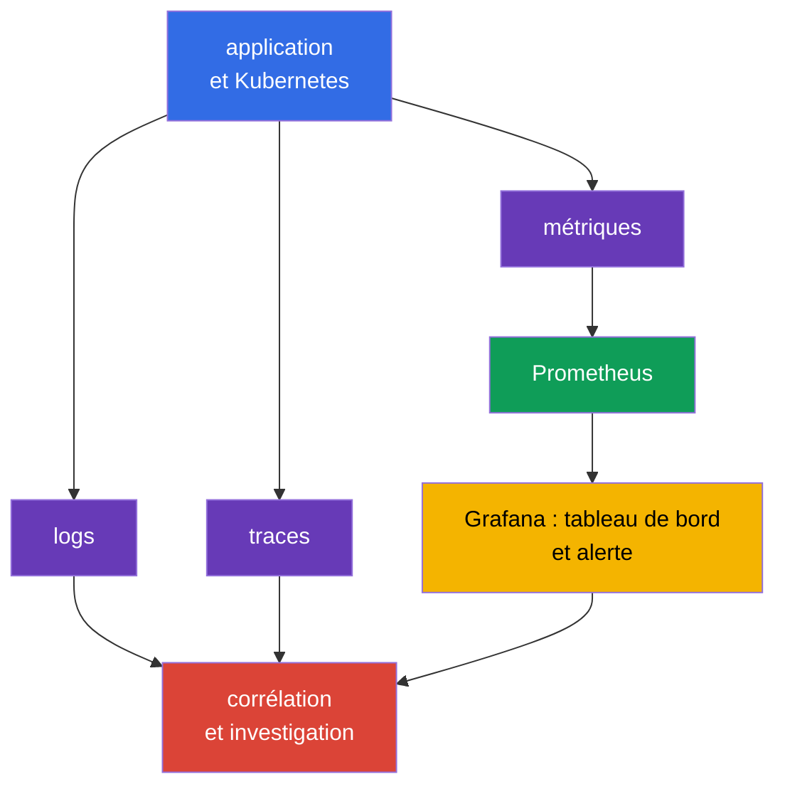
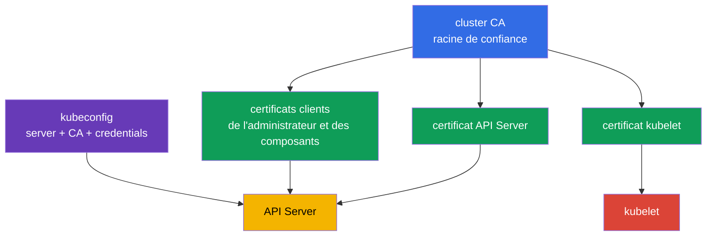
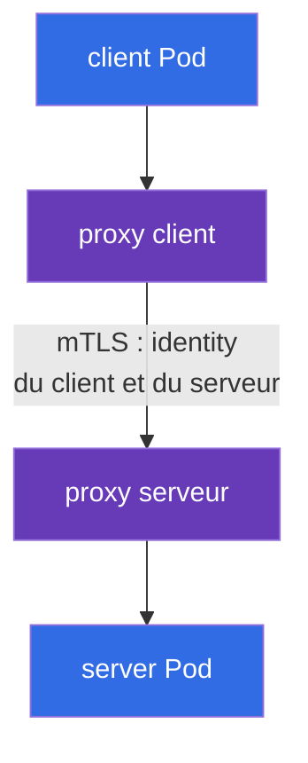

[Русская версия](ru.md) · [Eng version](README.md) · [Versión en español](es.md) · [Deutsche Version](de.md) · [ქართული ვერსია](ge.md) · [繁體中文版](tw.md) · [日本語版](jp.md)

# Chapitre 18. Observability, PKI, connectivité et service mesh

> **La suite.** Le chapitre 17 a montré comment empêcher un artefact non vérifié d'entrer dans le cluster. Mais les contrôles préventifs ne remplacent pas l'observation d'un système en fonctionnement, la confiance entre ses composants et la protection du trafic réseau. Ce chapitre couvre les compétences Observability, PKI, Connectivity et Service Mesh du domaine KCSA **Platform Security**, dont le poids est de 16 %. Les exemples et les termes se rapportent à Kubernetes `v1.36`.

## 18.1 Observability : logs, métriques et traces

L'**observability** répond à la question de ce qui se passe à l'intérieur d'un système distribué à partir de ses signaux externes. Pour la sécurité, elle permet non seulement de corriger les défaillances, mais aussi de détecter une attaque, une charge de travail compromise ou une configuration erronée. Aucun type de télémétrie ne remplace les autres.

| Signal | À quelle question répond-il ? | Exemple de signal de sécurité |
|---|---|---|
| Logs | Que s'est-il exactement passé ? | erreur d'authentification, lancement d'un shell, échec TLS |
| Métriques | Comment l'état évolue-t-il au fil du temps ? | pic de 401/403, egress inhabituel, saturation du CPU |
| Traces | Par quels services une requête est-elle passée ? | source d'un appel lent ou erroné entre services |

`Prometheus` collecte et stocke des métriques numériques, par exemple le nombre de requêtes, la latence et l'utilisation des ressources. `Grafana` crée des tableaux de bord à partir de ces données et peut afficher une alerte. Un tableau de bord n'est pas un contrôle d'accès : il donne de la visibilité afin que l'équipe puisse vérifier la cause et réagir.

La corrélation est importante pour la security-observability. Par exemple, une hausse des HTTP 403 peut signaler un RBAC correctement appliqué, un client mal configuré ou une tentative de tester les permissions disponibles. La réponse vient de la comparaison de l'heure, de l'identity, de l'audit log, des métriques de l'API et des logs de l'application, et non d'une seule métrique.

**Falco** est orienté vers la runtime detection. Il analyse les événements système du nœud de travail et peut signaler des actions suspectes d'un processus dans un conteneur : shell interactif, lecture d'un fichier sensible, lancement d'un package manager ou action réseau inattendue. Un signal Falco exige du contexte : un débogage légitime et une attaque peuvent parfois se ressembler.

**Hubble** est l'outil d'observabilité de Cilium pour les flux réseau. Il aide à voir quel `Pod` a établi une connexion, si celle-ci a été autorisée ou refusée par une politique et quels noms DNS sont impliqués. Hubble ne remplace pas `NetworkPolicy` : le premier observe les flux, le second définit les autorisations.

## 18.2 PKI Kubernetes : confiance et rotation des certificats

La PKI (Public Key Infrastructure) associe une clé cryptographique à une identité par le biais d'un certificat. Dans Kubernetes, la cluster CA signe les certificats des composants, tandis que les clients et les serveurs vérifient la chaîne de confiance. TLS apporte simultanément la confidentialité du canal, la vérification de l'authenticité de la partie et la protection de l'intégrité des données en transit.

Le modèle simplifié est le suivant :

La chaîne PKI à connaître pour l'examen : une **CA** signe un certificate ; un **certificate** associe une identity et une public key ; **TLS** protège une connexion donnée ; **mTLS** permet aux deux parties de présenter une identity ; la **rotation** limite le lifetime et le risque d'un credential. Dans Kubernetes, cela s'applique aux certificats de l'API Server, de kubelet, d'etcd et à l'authentification par client certificate.

> **À ne pas confondre.** TLS n'est pas de l'authorization, un certificate n'est pas une RBAC permission, et la TLS termination sur un Ingress ne signifie pas automatiquement un end-to-end encryption. Un service mesh apporte workload identity, mTLS, policy et telemetry pour le service-to-service traffic ; il ne remplace ni Kubernetes RBAC, ni un vulnerability scanner, ni l'autorisation applicative.

`kubeconfig` contient généralement l'adresse de l'API Server, les données de la CA ou une référence vers celle-ci, ainsi que les credentials du client, par exemple un certificat ou un token. Ce n'est pas un fichier de configuration inoffensif. Sa fuite peut donner accès au cluster avec les droits de l'identity indiquée. Les kubeconfig sont conservés avec des droits d'accès restreints, ne sont pas publiés dans un dépôt et les credentials compromis sont révoqués ou remplacés.

Un certificat a une durée de validité. La **rotation des certificats** remplace à l'avance une clé et un certificat arrivant à expiration, afin que le composant continue de fonctionner et qu'un credential compromis ait une durée de vie limitée. Il est important de distinguer la rotation d'un certificat leaf de composant du remplacement de la CA : le remplacement de la CA affecte tous les clients et serveurs qui lui font confiance, il exige donc une transition planifiée. Le mécanisme concret dépend de la méthode de déploiement du cluster et du fournisseur géré ; au niveau KCSA, l'essentiel est de comprendre l'objectif et le risque d'un certificat expiré ou non fiable.

La pratique de rotation doit être confirmée par des evidence, et non simplement déclarée comme processus. Les types de preuves utiles pour le contrôle du lifecycle des certificats sont : la surveillance de l'expiration (expiry monitoring), qui avertit à l'avance d'une expiration imminente ; les enregistrements des rotations effectivement réalisées (rotation records) ; l'inventaire des certificats émis ; et une alerte pour les certificats qui approchent de l'expiration sans remplacement planifié. Sans ces evidence, l'équipe peut penser que la rotation a lieu sans pouvoir montrer à un auditeur ou lors d'une investigation qu'elle est réellement effectuée.

La vérification d'un certificat doit inclure une CA de confiance et le nom du serveur. Un simple chiffrement sans vérification correcte de l'identity ne protège pas contre l'usurpation du serveur. Désactiver la vérification TLS pour résoudre une erreur de connexion déplace le problème de la disponibilité vers la sécurité.

## 18.3 Connectivité : TLS, ingress et egress

Le réseau Kubernetes comprend plusieurs directions de trafic différentes : du client à l'application, de `Pod` à `Pod`, de `Pod` à l'API Server et de `Pod` vers le réseau externe. Pour chaque direction, l'équipe définit qui peut établir une connexion, comment la partie est vérifiée et où le trafic est chiffré.

| Direction | Risque typique | Contrôle conceptuel |
|---|---|---|
| client → Ingress → service | interception, certificat incorrect, endpoint ouvert | TLS sur Ingress, vérification du certificat, authentification et autorisation de l'application |
| `Pod` → `Pod` | lecture du trafic, usurpation, mouvement latéral | TLS ou mTLS, `NetworkPolicy`, identity de la charge de travail |
| `Pod` → service externe | fuite de données, accès à un endpoint malveillant | egress policy, contrôle DNS, TLS et allowlist de destination |
| composant → API Server | vol de credential, MITM | TLS, CA de confiance, RBAC de moindre privilège |

**Ingress** reçoit le trafic entrant dans le cluster et termine généralement la connexion TLS avec le client externe. Cela protège le segment jusqu'à l'Ingress, mais ne signifie pas automatiquement que le segment Ingress → `Service` ou `Pod` est également chiffré. Il faut comprendre explicitement l'emplacement de la TLS termination et la protection requise pour le segment suivant.

**Egress** est le trafic sortant d'un `Pod` ou du cluster. Sans restrictions, une charge de travail compromise peut joindre des services internes, un metadata endpoint ou un serveur externe de command-and-control. Une `NetworkPolicy` avec des autorisations egress précises réduit ce risque si le CNI applique la policy. Elle ne remplace pas TLS : la policy sélectionne la direction autorisée, TLS protège le contenu et l'identity de la connexion.

Pour une connexion, il ne faut pas se fier uniquement à l'adresse IP et à un « réseau fermé ». Le zero trust suppose que le réseau peut être observé ou partiellement compromis. Les flux sensibles nécessitent donc une segmentation, des autorisations minimales et une vérification cryptographique du peer.

## 18.4 Service mesh : mTLS et politiques de trafic

Un **service mesh** ajoute une couche de gestion du trafic de service. Un data-plane proxy à côté d'une workload (ou un autre composant data-plane du mesh) établit mTLS, utilise une workload identity émise, applique une traffic policy et génère de la telemetry. L'émission, la signature et la rotation des workload certificates/identities sont assurées par le mécanisme control-plane identity/CA du mesh, par exemple la CA `istiod` avec l'agent Istio, et non par le proxy lui-même.

mTLS (mutual TLS) se distingue du server-side TLS ordinaire : le certificat est présenté non seulement par le serveur, mais aussi par le client. Un service peut donc vérifier quelle charge de travail l'appelle, et le client peut s'assurer de l'identity du service.

La traffic policy (allow, timeout, retry, circuit breaking) est appliquée par le même proxy des deux côtés de la connexion. Elle n'est pas représentée comme un nœud séparé dans le diagramme afin de ne pas mélanger deux mécanismes différents dans un même graphe ; son rôle et ses limites sont détaillés à la fin de ce paragraphe.

Dans Istio, la ressource `PeerAuthentication` définit le mode d'acceptation de mTLS pour le mesh ou une partie de celui-ci. Le mode `STRICT` exige que le trafic mesh entrant vers la charge de travail sélectionnée utilise mTLS. Cela est utile contre un appel accidentel non chiffré et un peer non authentifié, mais ne définit pas à lui seul **qui exactement** a le droit d'appeler le service et quelle URL est autorisée. Pour cela, des politiques d'autorisation, une `NetworkPolicy` et l'autorisation applicative sont nécessaires selon la frontière.

Linkerd fournit également identity et mTLS, mais n'utilise pas la ressource Istio `PeerAuthentication`. À l'examen, il est important de ne pas attribuer l'objet spécifique d'un mesh à un autre : le principe général est le même, les API concrètes diffèrent.

Les politiques de trafic du mesh peuvent définir routing, timeout, retry, circuit breaking et des limites de connexion. Cela améliore la contrôlabilité et la résilience, et le bénéfice de sécurité apparaît lorsque la politique limite les directions de confiance et rend la communication observable. Les nouvelles tentatives ne constituent pas une protection contre une attaque et, si elles sont mal configurées, peuvent amplifier la charge pendant une défaillance.

Un mesh se justifie lorsque de nombreux services ont besoin d'une identity, de mTLS, d'observabilité et de policy unifiées. Pour un petit environnement simple, il ajoute des proxies, des certificats et de la complexité opérationnelle. Le choix doit découler du modèle de menace et des exigences, et non de la seule présence de la technologie.

## 18.5 Comment l'appliquer en pratique

L'équipe associe ces outils dans un processus unique plutôt que de les installer séparément :

1. Elle définit les signaux de sécurité de base : échecs d'authentification, hausse des 5xx, egress interdit, événements Falco et changements de certificats.
2. Elle exporte les métriques vers Prometheus et Grafana, puis corrèle les logs, les flux réseau Hubble et les événements d'audit selon l'heure, le namespace, le `Pod` et l'identity.
3. Elle gère les certificats comme des credentials : elle connaît le propriétaire de la CA, les échéances, le chemin de rotation et la méthode de révocation d'un accès compromis.
4. Pour chaque ingress et egress, elle fixe les directions de confiance, la TLS termination et l'exigence de vérification du peer. Pour les flux interservices critiques, elle applique `NetworkPolicy` et, si une couche d'identity commune est nécessaire, un service mesh avec mTLS.

Par exemple, une alerte indique que le service de paiements a commencé à joindre une adresse externe inconnue. Une métrique montre la hausse de l'egress, Hubble indique le `Pod` source, Falco aide à vérifier le comportement du processus, et les logs de l'application ainsi que l'audit log complètent le tableau. Après le confinement, l'équipe affine l'egress policy, au lieu de simplement bloquer une seule adresse IP.

## 18.6 Exam vocabulary / Mini-glossaire

| Terme | Signification |
|---|---|
| CA | autorité de certification à laquelle on fait confiance pour vérifier les certificats |
| Falco | détecteur runtime d'événements système suspects |
| Grafana | outil de visualisation de tableaux de bord et d'alertes à partir de données d'observabilité |
| Hubble | outil d'observabilité des flux réseau Cilium |
| mTLS | TLS dans lequel les deux parties de la connexion présentent un certificat |
| `PeerAuthentication` | ressource Istio qui définit le mode d'acceptation du trafic mTLS |
| PKI | infrastructure de clés, de certificats et de chaînes de confiance |
| Prometheus | système de collecte et de stockage de métriques |
| service mesh | couche d'infrastructure pour gérer le trafic interservices |
| TLS termination | point auquel un composant termine TLS et déchiffre la connexion |

## 18.7 Exam Essentials / Points essentiels du chapitre

- Les logs, les métriques et les traces répondent à des questions différentes ; leur corrélation rend un signal de sécurité utile à l'investigation.
- Prometheus et Grafana travaillent avec les métriques, Falco observe les événements runtime, et Hubble donne de la visibilité sur les flux réseau Cilium.
- La CA, les certificats des composants et `kubeconfig` forment la frontière de confiance de Kubernetes. Une fuite de kubeconfig et un certificat expiré présentent des risques de sécurité et de disponibilité.
- TLS protège le canal et vérifie le peer, mais le TLS d'un ingress ne garantit pas le chiffrement de tous les segments qui suivent. Egress et ingress exigent des frontières et des politiques explicites.
- Istio et Linkerd appliquent mTLS à l'identity des charges de travail. `PeerAuthentication` avec `STRICT` dans Istio exige mTLS, mais ne remplace ni l'autorisation ni la segmentation réseau.

## 18.8 À ne pas confondre et comment cela apparaît à l'examen

Dans les MCQ (multiple choice question, question à choix multiple), distinguez le rôle des outils : Prometheus collecte les métriques, Grafana les affiche, Falco voit le comportement runtime, Hubble observe les flux Cilium. Une question sur TLS peut vérifier la frontière de termination : un certificat sur Ingress ne prouve pas le chiffrement jusqu'au backend.

Un piège fréquent consiste à considérer mTLS ou `PeerAuthentication` comme un remplacement de `NetworkPolicy` et de RBAC. mTLS vérifie et protège la connexion, `NetworkPolicy` définit le flux réseau autorisé, et RBAC contrôle l'accès à l'API Kubernetes. Ne confondez pas non plus `STRICT` avec « autoriser tout le trafic » : c'est une exigence d'utiliser mTLS pour les connexions entrantes correspondantes.

## 18.9 Questions d'auto-évaluation

### 1. Quel outil est avant tout conçu pour détecter les actions suspectes d'un processus dans un conteneur déjà en fonctionnement ?

   - a. Prometheus

   - b. Falco

   - c. `NetworkPolicy`

   - d. Grafana

Réponse et explication

**Bonne réponse : b. Falco.** Falco analyse les événements runtime et peut signaler un shell, l'accès à des fichiers sensibles ou toute autre activité suspecte. Prometheus collecte les métriques et Grafana visualise les données.

### 2. Qu'est-ce qui décrit correctement le rôle de la CA dans la PKI Kubernetes ?

   - a. La CA signe les certificats, et les clients l'utilisent pour vérifier la chaîne de confiance.

   - b. La CA remplace RBAC lors de l'accès à l'API Server.

   - c. La CA stocke toutes les valeurs de `Secret` sous forme chiffrée.

   - d. La CA autorise ou interdit l'egress depuis un `Pod`.

Réponse et explication

**Bonne réponse : a.** La CA est la racine ou une partie de la chaîne de confiance des certificats. L'authentification TLS n'annule pas l'autorisation RBAC et ne définit pas les règles réseau.

### 3. Dans Istio, une `PeerAuthentication` avec le mode `STRICT` est définie pour une charge de travail. Qu'en découle-t-il avant tout ?

   - a. Tous les logs de la charge de travail sont enregistrés dans etcd.

   - b. Seul le trafic mesh entrant avec mTLS est accepté vers la charge de travail.

   - c. Tout `Pod` obtient des droits d'administrateur dans l'API Server.

   - d. Toutes les connexions sortantes sont automatiquement interdites.

Réponse et explication

**Bonne réponse : b.** `STRICT` exige mTLS pour le trafic entrant correspondant. Ce n'est ni RBAC, ni une egress policy, ni un système de journalisation.

### 4. Quelle affirmation sur TLS sur Ingress est correcte ?

   - a. Il protège la connexion jusqu'au point de TLS termination, et le segment suivant doit être évalué séparément.

   - b. Il remplace la vérification du certificat par le client.

   - c. Il élimine la nécessité de restreindre l'accès à l'application.

   - d. Il chiffre automatiquement chaque segment d'Ingress à tous les `Pod`.

Réponse et explication

**Bonne réponse : a.** TLS s'applique à une connexion précise. Si Ingress termine TLS, la sécurité du canal suivant jusqu'au backend dépend de sa configuration et de ses contrôles propres.

### 5. Quelle est la meilleure description de la différence entre Hubble et `NetworkPolicy` ?

   - a. Ces deux outils sont destinés uniquement au chiffrement du trafic.

   - b. Hubble remplace le service mesh, et `NetworkPolicy` remplace RBAC.

   - c. Hubble observe les flux réseau, et `NetworkPolicy` définit les flux autorisés ou interdits.

   - d. Hubble crée des certificats, et `NetworkPolicy` stocke les métriques.

Réponse et explication

**Bonne réponse : c.** Hubble apporte de l'observabilité aux flux réseau Cilium. `NetworkPolicy` est un contrôle d'accès déclaratif aux connexions réseau lorsque le CNI le prend en charge.

> **Pour aller plus loin.** Le chiffrement pratique du trafic Pod-to-Pod et mTLS dans Cilium, Istio et Linkerd sont traités au chapitre 23 CKS. La configuration et la vérification de la runtime detection Falco sont traitées au chapitre 29 CKS.

[Table des matières](../README_FR.md) · [Chapitre 17](../17/fr.md) · [Chapitre 19](../19/fr.md)