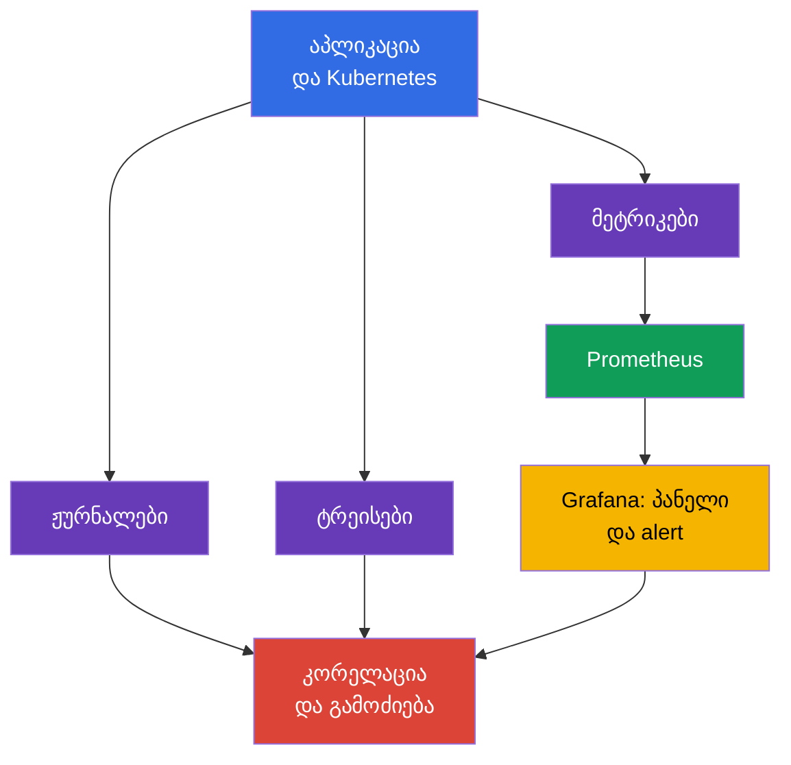
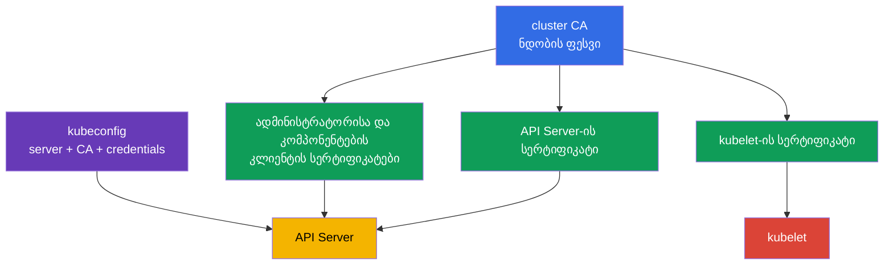
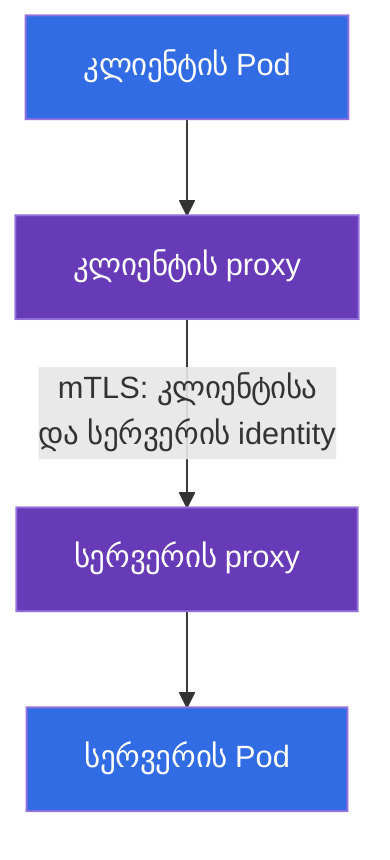

[Русская версия](ru.md) · [Eng version](README.md) · [Versión en español](es.md) · [Version française](fr.md) · [Deutsche Version](de.md) · [繁體中文版](tw.md) · [日本語版](jp.md)

# თავი 18. Observability, PKI, connectivity და service mesh

> **რა არის შემდეგ.** მე-17 თავში ნაჩვენები იყო, როგორ არ დავუშვათ შეუმოწმებელი არტეფაქტი კლასტერში. თუმცა პრევენციული კონტროლები ვერ ჩაანაცვლებს მოქმედ სისტემაზე დაკვირვებას, მის კომპონენტებს შორის ნდობასა და ქსელური ტრაფიკის დაცვას. აქ განვიხილავთ KCSA **Platform Security** დომენის Observability, PKI, Connectivity და Service Mesh კომპეტენციებს, რომელთა წონაა 16%. მაგალითები და ტერმინები ეხება Kubernetes `v1.36`-ს.

## 18.1 Observability: ჟურნალები, მეტრიკები და ტრეისები

**Observability** პასუხობს კითხვას, თუ რა ხდება განაწილებული სისტემის შიგნით მისი გარე სიგნალების მიხედვით. უსაფრთხოებისთვის ის გვეხმარება არა მხოლოდ ხარვეზების გამოსწორებაში, არამედ შეტევის, კომპრომეტირებული სამუშაო დატვირთვის ან არასწორი კონფიგურაციის აღმოჩენაშიც. ტელემეტრიის ვერცერთი სახეობა ვერ ჩაანაცვლებს დანარჩენებს.

| სიგნალი | რომელ კითხვას პასუხობს | security-სიგნალის მაგალითი |
|---|---|---|
| ჟურნალები | კონკრეტულად რა მოხდა? | ავთენტიფიკაციის შეცდომა, shell-ის გაშვება, TLS-ის უარყოფა |
| მეტრიკები | როგორ იცვლება მდგომარეობა დროში? | 401/403-ის მკვეთრი ზრდა, უჩვეულო egress, CPU-ს გაჯერება |
| ტრეისები | რომელ სერვისებში გაიარა მოთხოვნამ? | სერვისებს შორის ნელი ან შეცდომიანი გამოძახების წყარო |

`Prometheus` აგროვებს და ინახავს რიცხვით მეტრიკებს, მაგალითად მოთხოვნების რაოდენობას, დაყოვნებასა და რესურსების მოხმარებას. `Grafana` ამ მონაცემების საფუძველზე ქმნის პანელებს და შეუძლია alert-ის ჩვენება. პანელი წვდომის კონტროლი არ არის: ის უზრუნველყოფს ხილვადობას, რომლის საფუძველზეც გუნდი მიზეზს ამოწმებს და რეაგირებს.

security-observability-სთვის კორელაცია მნიშვნელოვანია. მაგალითად, HTTP 403-ის ზრდა შეიძლება ნიშნავდეს სწორად ამოქმედებულ RBAC-ს, არასწორად კონფიგურირებულ კლიენტს ან უფლებების შერჩევის მცდელობას. პასუხს იძლევა ერთმანეთთან შეჯერებული დრო, identity, audit log, API-ს მეტრიკები და აპლიკაციის ჟურნალები და არა მხოლოდ ერთი მეტრიკა.

**Falco** ორიენტირებულია runtime detection-ზე. ის აანალიზებს სამუშაო კვანძის სისტემურ მოვლენებს და შეუძლია გვაცნობოს კონტეინერში პროცესის საეჭვო მოქმედებების შესახებ: ინტერაქტიული shell, მგრძნობიარე ფაილის წაკითხვა, package manager-ის გაშვება ან მოულოდნელი ქსელური მოქმედება. Falco-ს სიგნალი კონტექსტს მოითხოვს: ლეგიტიმური გამართვა და შეტევა ზოგჯერ ერთმანეთს ჰგავს.

**Hubble** არის Cilium-ის ქსელური ნაკადების დაკვირვებადობის საშუალება. ის გვეხმარება დავინახოთ, რომელმა `Pod`-მა დაამყარა კავშირი, დაშვებული ან უარყოფილი იყო თუ არა ის პოლიტიკით და რომელი DNS-სახელები მონაწილეობს. Hubble არ ანაცვლებს `NetworkPolicy`-ს: პირველი საშუალება ნაკადებს აკვირდება, მეორე კი ნებართვებს განსაზღვრავს.

## 18.2 Kubernetes-ის PKI: ნდობა და სერტიფიკატების როტაცია

PKI (Public Key Infrastructure) სერტიფიკატის მეშვეობით კრიპტოგრაფიულ გასაღებს იდენტობას უკავშირებს. Kubernetes-ში cluster CA ხელს აწერს კომპონენტების სერტიფიკატებს, ხოლო კლიენტები და სერვერები ნდობის ჯაჭვს ამოწმებენ. TLS ერთდროულად უზრუნველყოფს არხის კონფიდენციალურობას, მხარის ავთენტურობის შემოწმებას და გადაცემისას მონაცემთა მთლიანობის დაცვას.

გამარტივებული მოდელი ასე გამოიყურება:

PKI-ჯაჭვი გამოცდისთვის: **CA** ხელს აწერს certificate-ს; **certificate** აკავშირებს identity-სა და public key-ს; **TLS** იცავს კონკრეტულ კავშირს; **mTLS** ორივე მხარეს identity-ს წარდგენის საშუალებას აძლევს; **rotation** ზღუდავს lifetime-სა და credential-ის რისკს. Kubernetes-ში ეს ეხება API Server-ის, kubelet-ის, etcd-ის სერტიფიკატებსა და client certificate authentication-ს.

> **არ აგერიოთ.** TLS არ არის authorization, certificate არ არის RBAC permission, ხოლო Ingress-ზე TLS termination ავტომატურ end-to-end encryption-ს არ ნიშნავს. Service mesh უზრუნველყოფს workload identity-ს, mTLS-ს, policy-სა და telemetry-ს service-to-service traffic-ისთვის; ის არ ანაცვლებს Kubernetes RBAC-ს, vulnerability scanner-ს ან აპლიკაციის ავტორიზაციას.

`kubeconfig` ჩვეულებრივ შეიცავს API Server-ის მისამართს, CA-ს მონაცემებს ან მასზე მითითებას და კლიენტის სააღრიცხვო მონაცემებს, მაგალითად სერტიფიკატს ან ტოკენს. ეს არ არის უვნებელი პარამეტრების ფაილი. მისმა გაჟონვამ შეიძლება კლასტერზე წვდომა მისცეს მითითებული identity-ს უფლებებით. Kubeconfig ინახება წვდომის შეზღუდული უფლებებით, არ ქვეყნდება რეპოზიტორიაში, ხოლო კომპრომეტირებული credentials უქმდება ან იცვლება.

სერტიფიკატს მოქმედების ვადა აქვს. **სერტიფიკატების როტაცია** წინასწარ ცვლის ვადის ამოწურვის პირას მყოფ გასაღებსა და სერტიფიკატს, რათა კომპონენტმა მუშაობა გააგრძელოს და კომპრომეტირებულ credential-ს შეზღუდული სიცოცხლის ხანგრძლივობა ჰქონდეს. მნიშვნელოვანია კომპონენტის leaf-სერტიფიკატის როტაციისა და CA-ს შეცვლის განსხვავება: CA-ს შეცვლა გავლენას ახდენს ყველა კლიენტსა და სერვერზე, რომლებიც მას ენდობიან, ამიტომ დაგეგმილ გადასვლას მოითხოვს. კონკრეტული მექანიზმი დამოკიდებულია კლასტერის განთავსების მეთოდსა და მართულ პროვაიდერზე; KCSA-ს დონეზე მთავარია მიზნისა და ვადაგასული ან არასანდო სერტიფიკატის რისკის გაგება.

როტაციის პრაქტიკა evidence-ით უნდა დადასტურდეს და არა მხოლოდ პროცესად გამოცხადდეს. certificate-lifecycle კონტროლისთვის გამოსადეგი მტკიცებულებებია: მოქმედების ვადის მონიტორინგი (expiry monitoring), რომელიც მოახლოებული ვადის ამოწურვის შესახებ წინასწარ გვაფრთხილებს; ფაქტობრივად შესრულებული როტაციების ჩანაწერები (rotation records); გაცემული სერტიფიკატების ინვენტარი; და alert იმ სერტიფიკატებისთვის, რომელთა ვადის ამოწურვა გეგმური ჩანაცვლების გარეშე ახლოვდება. ასეთი evidence-ის გარეშე გუნდს შეიძლება მიაჩნდეს, რომ როტაცია მიმდინარეობს, თუმცა აუდიტორისთვის ან გამოძიებისთვის მისი რეალურად შესრულების ჩვენება ვერ შეძლოს.

სერტიფიკატის შემოწმება სანდო CA-სა და სერვერის სახელს უნდა მოიცავდეს. უბრალოდ დაშიფვრა identity-ს სწორი შემოწმების გარეშე სერვერის ჩანაცვლებისგან არ იცავს. კავშირის შეცდომის აღმოსაფხვრელად TLS-შემოწმების გამორთვა პრობლემას ხელმისაწვდომობიდან უსაფრთხოებაში გადაიტანს.

## 18.3 Connectivity: TLS, ingress და egress

Kubernetes-ის ქსელი ტრაფიკის რამდენიმე განსხვავებულ მიმართულებას მოიცავს: კლიენტიდან აპლიკაციამდე, `Pod`-იდან `Pod`-ამდე, `Pod`-იდან API Server-მდე და `Pod`-იდან გარე ქსელამდე. თითოეული მიმართულებისთვის გუნდი განსაზღვრავს, ვის შეუძლია კავშირის დამყარება, როგორ მოწმდება მხარე და სად იშიფრება ტრაფიკი.

| მიმართულება | ტიპური რისკი | კონცეპტუალური კონტროლი |
|---|---|---|
| კლიენტი → Ingress → სერვისი | ხელში ჩაგდება, არასწორი სერტიფიკატი, ღია endpoint | TLS Ingress-ზე, სერტიფიკატის შემოწმება, აპლიკაციის ავთენტიფიკაცია და ავტორიზაცია |
| `Pod` → `Pod` | ტრაფიკის წაკითხვა, ჩანაცვლება, ლატერალური გადაადგილება | TLS ან mTLS, `NetworkPolicy`, სამუშაო დატვირთვის identity |
| `Pod` → გარე სერვისი | მონაცემთა გაჟონვა, მავნე endpoint-ზე წვდომა | egress policy, DNS-კონტროლი, TLS და დანიშნულების allowlist |
| კომპონენტი → API Server | credential-ის მოპარვა, MITM | TLS, სანდო CA, least-privilege RBAC |

**Ingress** კლასტერში შემომავალ ტრაფიკს იღებს და, როგორც წესი, გარე კლიენტთან TLS-კავშირს ასრულებს. ეს იცავს მონაკვეთს Ingress-მდე, მაგრამ ავტომატურად არ ნიშნავს, რომ მონაკვეთი Ingress → `Service` ან `Pod` ასევე დაშიფრულია. მკაფიოდ უნდა გვესმოდეს TLS termination-ის ადგილი და შემდეგი მონაკვეთის დაცვის მოთხოვნები.

**Egress** არის გამავალი ტრაფიკი `Pod`-იდან ან კლასტერიდან. შეზღუდვების გარეშე კომპრომეტირებულ სამუშაო დატვირთვას შეუძლია დაუკავშირდეს შიდა სერვისებს, metadata endpoint-ს ან გარე command-and-control სერვერს. `NetworkPolicy` ზუსტი egress-ნებართვებით ამ რისკს ამცირებს, თუ CNI policy-ს აღასრულებს. ის TLS-ს არ ანაცვლებს: policy დასაშვებ მიმართულებას ირჩევს, TLS კი კავშირის შიგთავსსა და identity-ს იცავს.

კავშირის დასამყარებლად მხოლოდ IP-მისამართსა და „დახურულ ქსელს“ ვერ დავეყრდნობით. Zero trust გულისხმობს, რომ ქსელი შეიძლება დაკვირვებადი ან ნაწილობრივ კომპრომეტირებული იყოს. ამიტომ მგრძნობიარე ნაკადებისთვის საჭიროა სეგმენტაცია, მინიმალური ნებართვები და peer-ის კრიპტოგრაფიული შემოწმება.

## 18.4 Service mesh: mTLS და ტრაფიკის პოლიტიკები

**Service mesh** სერვისულ ტრაფიკს მართვის დონეს ამატებს. Data-plane proxy სამუშაო დატვირთვის გვერდით (ან mesh-ის სხვა data-plane კომპონენტი) ამყარებს mTLS-ს, იყენებს გაცემულ workload identity-ს, აღასრულებს traffic policy-ს და ქმნის telemetry-ს. workload certificates/identities-ის გაცემას/ხელმოწერასა და როტაციას უზრუნველყოფს mesh-ის control-plane identity/CA mechanism, მაგალითად `istiod` CA Istio agent-თან ერთად და არა თავად proxy.

mTLS (mutual TLS) ჩვეულებრივი server-side TLS-ისგან განსხვავდება: სერტიფიკატს არა მხოლოდ სერვერი, არამედ კლიენტიც წარადგენს. ამიტომ სერვისს შეუძლია შეამოწმოს, რომელი სამუშაო დატვირთვა უკავშირდება მას, ხოლო კლიენტს შეუძლია სერვისის identity გადაამოწმოს.

Traffic policy (allow, timeout, retry, circuit breaking) იმავე proxy-ს მიერ კავშირის ორივე მხარეს აღსრულდება. მას დიაგრამაზე ცალკე კვანძად არ ვაჩვენებთ, რათა ერთ გრაფში ორი სხვადასხვა მექანიზმი არ ავურიოთ; მის როლსა და შეზღუდვებზე უფრო დაწვრილებით ამ პარაგრაფის ბოლოს ვისაუბრებთ.

Istio-ში რესურსი `PeerAuthentication` mesh-ისთვის ან მისი ნაწილისთვის mTLS-ის მიღების რეჟიმს განსაზღვრავს. რეჟიმი `STRICT` მოითხოვს, რომ შერჩეული სამუშაო დატვირთვისკენ შემომავალმა mesh-ტრაფიკმა mTLS გამოიყენოს. ეს სასარგებლოა შემთხვევითი დაუშიფრავი გამოძახებისა და არაავთენტიფიცირებული peer-ის წინააღმდეგ, მაგრამ თავისთავად არ განსაზღვრავს, **კონკრეტულად ვის** აქვს სერვისის გამოძახების უფლება და რომელი URL არის დაშვებული. ამისთვის, საზღვრის მიხედვით, საჭიროა ავტორიზაციის პოლიტიკები, `NetworkPolicy` და აპლიკაციის ავტორიზაცია.

Linkerd ასევე უზრუნველყოფს identity-სა და mTLS-ს, მაგრამ Istio-ს რესურს `PeerAuthentication`-ს არ იყენებს. გამოცდაზე მნიშვნელოვანია, ერთი mesh-ის კონკრეტული ობიექტი მეორეს არ მივაწეროთ: ზოგადი პრინციპი იგივეა, კონკრეტული API-ები კი განსხვავდება.

mesh-ის ტრაფიკის პოლიტიკებს შეუძლია განსაზღვროს routing, timeout, retry, circuit breaking და კავშირების შეზღუდვები. ეს მართვადობასა და მდგრადობას ზრდის, ხოლო უსაფრთხოების სარგებელი მაშინ ჩნდება, როცა პოლიტიკა სანდო მიმართულებებს ზღუდავს და კავშირს დაკვირვებადს ხდის. განმეორებითი მცდელობები შეტევისგან დაცვა არ არის და არასწორი კონფიგურაციისას ხარვეზის დროს დატვირთვის გაზრდა შეუძლია.

Mesh გამართლებულია, როდესაც ბევრ სერვისს ერთიანი identity, mTLS, დაკვირვებადობა და პოლიტიკა სჭირდება. მცირე, მარტივი კონტურისთვის ის proxy-ებს, სერტიფიკატებსა და საოპერაციო სირთულეს ამატებს. არჩევანი საფრთხეების მოდელიდან და მოთხოვნებიდან უნდა გამომდინარეობდეს და არა მხოლოდ ტექნოლოგიის არსებობიდან.

## 18.5 როგორ იყენებენ ამას პრაქტიკაში

გუნდი ამ საშუალებებს ერთ პროცესში აერთიანებს და არა ცალ-ცალკე აყენებს:

1. განსაზღვრავს საბაზისო security-სიგნალებს: ავთენტიფიკაციის უარყოფას, 5xx-ის ზრდას, აკრძალულ egress-ს, Falco-ს მოვლენებსა და სერტიფიკატების ცვლილებებს.
2. მეტრიკები Prometheus-სა და Grafana-ში გამოაქვს, ხოლო ჟურნალებს, Hubble-ის ქსელურ ნაკადებსა და audit-მოვლენებს დროის, namespace-ის, `Pod`-ისა და identity-ს მიხედვით აკორელირებს.
3. სერტიფიკატებს მართავს, როგორც credential-ს: იცის CA-ს მფლობელი, ვადები, როტაციის გზა და კომპრომეტირებული წვდომის გაუქმების მეთოდი.
4. თითოეული ingress-ისა და egress-ისთვის აფიქსირებს სანდო მიმართულებებს, TLS termination-სა და peer-ის შემოწმების მოთხოვნას. კრიტიკული სერვისთაშორისი ნაკადებისთვის იყენებს `NetworkPolicy`-ს და, თუ identity-ს საერთო დონეა საჭირო, service mesh-ს mTLS-ით.

მაგალითად, alert გვატყობინებს, რომ გადახდების სერვისმა უცნობ გარე მისამართთან დაკავშირება დაიწყო. მეტრიკა egress-ის ზრდას აჩვენებს, Hubble წყაროს `Pod`-ზე მიუთითებს, Falco პროცესის ქცევის შემოწმებაში გვეხმარება, ხოლო აპლიკაციის ჟურნალები და audit log სურათს ავსებს. შეკავების შემდეგ გუნდი egress policy-ს აზუსტებს და მხოლოდ ერთ IP-მისამართს არ კეტავს.

## 18.6 Exam vocabulary / მინი-ლექსიკონი

| ტერმინი | მნიშვნელობა |
|---|---|
| CA | სერტიფიკაციის ცენტრი, რომელსაც სერტიფიკატების შემოწმებისას ენდობიან |
| Falco | საეჭვო სისტემური მოვლენების runtime-დეტექტორი |
| Grafana | დაკვირვებადობის მონაცემების საფუძველზე პანელებისა და alert-ის ვიზუალიზაციის საშუალება |
| Hubble | Cilium-ის ქსელურ ნაკადებზე დაკვირვების საშუალება |
| mTLS | TLS, რომელშიც სერტიფიკატს კავშირის ორივე მხარე წარადგენს |
| `PeerAuthentication` | ტრაფიკის მიღების mTLS-რეჟიმის განსაზღვრის Istio-ს რესურსი |
| PKI | გასაღებების, სერტიფიკატებისა და ნდობის ჯაჭვების ინფრასტრუქტურა |
| Prometheus | მეტრიკების შეგროვებისა და შენახვის სისტემა |
| service mesh | სერვისთაშორისი ტრაფიკის მართვის ინფრასტრუქტურული დონე |
| TLS termination | წერტილი, სადაც კომპონენტი TLS-ს ასრულებს და კავშირს გაშიფრავს |

## 18.7 Exam Essentials / თავის შეჯამება

- ჟურნალები, მეტრიკები და ტრეისები სხვადასხვა კითხვას პასუხობს; მათი კორელაცია security-სიგნალს გამოძიებისთვის გამოსადეგს ხდის.
- Prometheus და Grafana მეტრიკებთან მუშაობს, Falco runtime-მოვლენებს აკვირდება, Hubble კი Cilium-ის ქსელური ნაკადების ხილვადობას უზრუნველყოფს.
- CA, კომპონენტების სერტიფიკატები და `kubeconfig` Kubernetes-ის ნდობის საზღვარს ქმნის. kubeconfig-ის გაჟონვა და ვადაგასული სერტიფიკატი უსაფრთხოებისა და ხელმისაწვდომობის რისკებია.
- TLS არხს იცავს და peer-ს ამოწმებს, მაგრამ ingress TLS ყველა მომდევნო მონაკვეთის დაშიფვრას არ უზრუნველყოფს. Egress და ingress მკაფიო საზღვრებსა და პოლიტიკებს მოითხოვს.
- Istio და Linkerd სამუშაო დატვირთვების identity-სთვის mTLS-ს იყენებს. Istio-ში `PeerAuthentication` რეჟიმით `STRICT` mTLS-ს მოითხოვს, მაგრამ ავტორიზაციასა და ქსელის სეგმენტაციას არ ანაცვლებს.

## 18.8 არ აგერიოთ და როგორ გვხვდება ეს გამოცდაზე

MCQ-ში (multiple choice question, კითხვა პასუხის არჩევით) განასხვავეთ ინსტრუმენტების დანიშნულება: Prometheus აგროვებს მეტრიკებს, Grafana აჩვენებს მათ, Falco ხედავს runtime-ქცევას, Hubble კი Cilium-ის ნაკადებს აკვირდება. TLS-ის შესახებ კითხვამ შეიძლება termination-ის საზღვარი შეამოწმოს: Ingress-ის სერტიფიკატი backend-მდე დაშიფვრას არ ადასტურებს.

ხშირი ხაფანგია mTLS-ის ან `PeerAuthentication`-ის `NetworkPolicy`-სა და RBAC-ის შემცვლელად მიჩნევა. mTLS ამოწმებს და იცავს კავშირს, `NetworkPolicy` დასაშვებ ქსელურ ნაკადს განსაზღვრავს, RBAC კი Kubernetes API-ზე წვდომას მართავს. ასევე არ აგერიოთ `STRICT` და „მთელი ტრაფიკის დაშვება“: ეს შესაბამისი შემომავალი კავშირებისთვის mTLS-ის გამოყენების მოთხოვნაა.

## 18.9 თვითშემოწმების კითხვები

### 1. რომელი ინსტრუმენტია უპირველეს ყოვლისა განკუთვნილი უკვე მოქმედ კონტეინერში პროცესის საეჭვო მოქმედებების აღმოსაჩენად?

   - a. Prometheus

   - b. Falco

   - c. `NetworkPolicy`

   - d. Grafana

პასუხი და განმარტება

**სწორი პასუხია: b. Falco.** Falco აანალიზებს runtime-მოვლენებს და შეუძლია მოგვცეს სიგნალი shell-ის, მგრძნობიარე ფაილებზე წვდომის ან სხვა საეჭვო აქტივობის შესახებ. Prometheus აგროვებს მეტრიკებს, Grafana კი მონაცემების ვიზუალიზაციას ახდენს.

### 2. რომელი აღწერს სწორად CA-ს როლს Kubernetes-ის PKI-ში?

   - a. CA ხელს აწერს სერტიფიკატებს, ხოლო კლიენტები მას ნდობის ჯაჭვის შესამოწმებლად იყენებენ.

   - b. API Server-ზე წვდომისას CA ანაცვლებს RBAC-ს.

   - c. CA ყველა `Secret`-ის მნიშვნელობას დაშიფრული სახით ინახავს.

   - d. CA `Pod`-იდან egress-ს უშვებს ან კრძალავს.

პასუხი და განმარტება

**სწორი პასუხია: a.** CA სერტიფიკატების ნდობის ჯაჭვის ფესვი ან ნაწილია. TLS-ავთენტიფიკაცია RBAC-ავტორიზაციას არ აუქმებს და ქსელის წესებს არ განსაზღვრავს.

### 3. Istio-ში სამუშაო დატვირთვისთვის `PeerAuthentication` რეჟიმით `STRICT` არის განსაზღვრული. უპირველეს ყოვლისა, რა გამომდინარეობს აქედან?

   - a. სამუშაო დატვირთვის ყველა ჟურნალი etcd-ში ინახება.

   - b. სამუშაო დატვირთვასთან დაიშვება მხოლოდ შემომავალი mesh-ტრაფიკი mTLS-ით.

   - c. ნებისმიერი `Pod` API Server-ში ადმინისტრატორის უფლებებს იღებს.

   - d. ყველა გამავალი კავშირი ავტომატურად იკრძალება.

პასუხი და განმარტება

**სწორი პასუხია: b.** `STRICT` შესაბამისი შემომავალი ტრაფიკისთვის mTLS-ს მოითხოვს. ის არ არის RBAC, egress policy ან ჟურნალების წარმოების სისტემა.

### 4. რომელი დებულებაა სწორი Ingress-ზე TLS-ის შესახებ?

   - a. ის კავშირს TLS termination-ის წერტილამდე იცავს, ხოლო შემდგომი მონაკვეთი ცალკე უნდა შეფასდეს.

   - b. ის კლიენტის მიერ სერტიფიკატის შემოწმებას ანაცვლებს.

   - c. ის აპლიკაციაზე წვდომის შეზღუდვის საჭიროებას აუქმებს.

   - d. ის Ingress-იდან ყველა `Pod`-ამდე თითოეულ მონაკვეთს ავტომატურად შიფრავს.

პასუხი და განმარტება

**სწორი პასუხია: a.** TLS კონკრეტულ კავშირზე მოქმედებს. თუ Ingress TLS-ს ასრულებს, backend-მდე შემდეგი არხის უსაფრთხოება მის ცალკე კონფიგურაციასა და კონტროლებზეა დამოკიდებული.

### 5. როგორ აღიწერება საუკეთესოდ Hubble-სა და `NetworkPolicy`-ს შორის განსხვავება?

   - a. ორივე საშუალება მხოლოდ ტრაფიკის დაშიფვრისთვისაა განკუთვნილი.

   - b. Hubble service mesh-ს ანაცვლებს, `NetworkPolicy` კი RBAC-ს.

   - c. Hubble ქსელურ ნაკადებს აკვირდება, `NetworkPolicy` კი დაშვებულ ან აკრძალულ ნაკადებს განსაზღვრავს.

   - d. Hubble სერტიფიკატებს ქმნის, `NetworkPolicy` კი მეტრიკებს ინახავს.

პასუხი და განმარტება

**სწორი პასუხია: c.** Hubble Cilium-ის ქსელური ნაკადების დაკვირვებადობას უზრუნველყოფს. `NetworkPolicy` ქსელურ კავშირებზე წვდომის დეკლარაციული კონტროლია, როცა ის CNI-ს მიერ არის მხარდაჭერილი.

> **სად წავიდეთ შემდეგ.** Pod-to-Pod ტრაფიკის პრაქტიკული დაშიფვრა და mTLS Cilium-ში, Istio-სა და Linkerd-ში განხილულია CKS-ის 23-ე თავში. Falco-ს runtime detection-ის კონფიგურაცია და შემოწმება განხილულია CKS-ის 29-ე თავში.

[სარჩევი](../README_GE.md) · [თავი 17](../17/ge.md) · [თავი 19](../19/ge.md)
