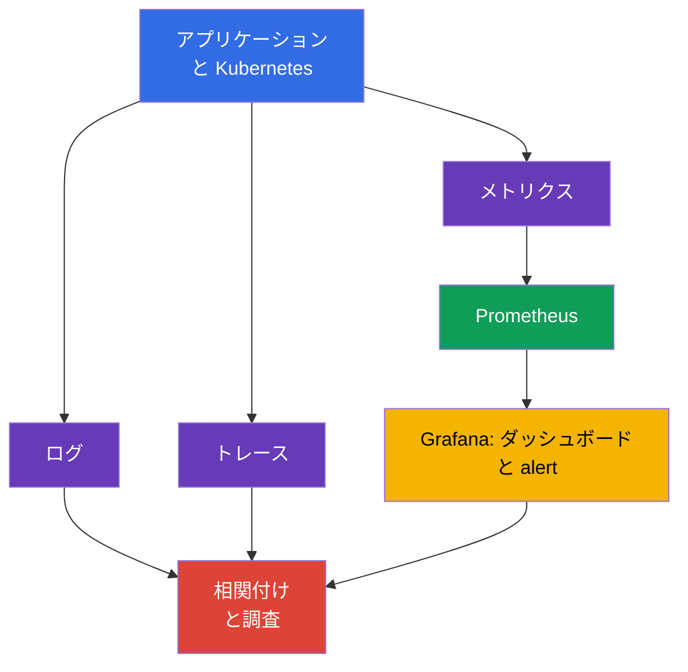
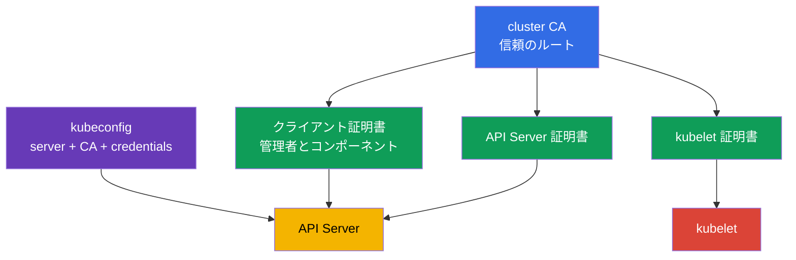
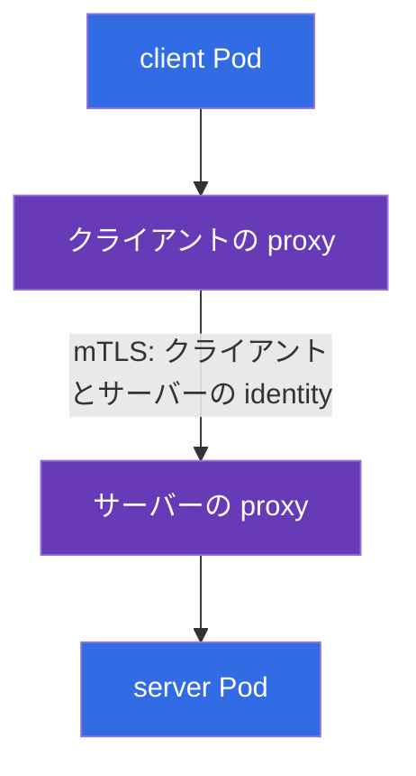

[Русская версия](ru.md) · [Eng version](README.md) · [Versión en español](es.md) · [Version française](fr.md) · [Deutsche Version](de.md) · [ქართული ვერსია](ge.md) · [繁體中文版](tw.md)

# 第18章 Observability、PKI、connectivity、service mesh

> **この後の内容。** 第17章では、未検証のアーティファクトをクラスターに入れない方法を説明しました。しかし、予防的なコントロールは、稼働中システムの監視、コンポーネント間の信頼、ネットワークトラフィックの保護に代わるものではありません。本章では、比重16%の KCSA **Platform Security** ドメインにおける Observability、PKI、Connectivity、Service Mesh のコンピテンシーを扱います。例と用語は Kubernetes `v1.36` に対応しています。

## 18.1 Observability: ログ、メトリクス、トレース

**Observability** は、分散システムの外部シグナルから内部で何が起きているかという問いに答えます。セキュリティでは、障害の修正だけでなく、攻撃、侵害されたワークロード、誤った設定の検知にも役立ちます。どのテレメトリー種別も、他を置き換えるものではありません。

| シグナル | 答える問い | security シグナルの例 |
|---|---|---|
| ログ | 正確には何が起きたか | 認証エラー、shell の起動、TLS の拒否 |
| メトリクス | 状態は時間とともにどう変化するか | 401/403 の急増、異常な egress、CPU の飽和 |
| トレース | リクエストはどのサービスを経由したか | サービス間の遅延または失敗した呼び出しの発生源 |

`Prometheus` は、リクエスト数、レイテンシー、リソース消費量などの数値メトリクスを収集・保存します。`Grafana` はこれらのデータからダッシュボードを作成し、alert を表示できます。ダッシュボードはアクセス制御ではありません。チームが原因を確認して対応するための可視性を提供します。

security observability では相関付けが重要です。たとえば、HTTP 403 の増加は、RBAC が正しく機能したこと、クライアントの設定ミス、または権限の探索を意味する可能性があります。答えは、単一のメトリクスそのものではなく、対応付けた時刻、identity、audit log、API メトリクス、アプリケーションログから得られます。

**Falco** は runtime detection 向けです。ワーカーノードのシステムイベントを分析し、コンテナ内プロセスによる疑わしい行為を報告できます。たとえば、対話的 shell、機密ファイルの読み取り、package manager の実行、予期しないネットワーク動作です。Falco のシグナルにはコンテキストが必要です。正当なデバッグと攻撃が似て見えることがあります。

**Hubble** は、ネットワークフローのための Cilium の observability ツールです。どの `Pod` が接続を確立したか、policy により許可または拒否されたか、どの DNS 名が関与しているかを確認できます。Hubble は `NetworkPolicy` を置き換えません。前者はフローを観測し、後者は許可を定義します。

## 18.2 Kubernetes PKI: 信頼と証明書ローテーション

PKI (Public Key Infrastructure) は、証明書を通じて暗号鍵を identity と結び付けます。Kubernetes では cluster CA がコンポーネントの証明書に署名し、クライアントとサーバーは信頼チェーンを検証します。TLS は、チャネルの機密性、相手の真正性の検証、転送中データの完全性保護を同時に実現します。

簡略化したモデルは次のとおりです。

試験向けの PKI チェーン: **CA** は certificate に署名します。**certificate** は identity と public key を結び付けます。**TLS** は特定の接続を保護します。**mTLS** は双方が identity を提示できるようにします。**rotation** は lifetime と credential のリスクを制限します。Kubernetes では、これは API Server、kubelet、etcd の証明書と client certificate authentication に関係します。

> **混同しないこと。** TLS は authorization ではなく、certificate は RBAC permission ではありません。また、Ingress での TLS termination は自動的な end-to-end encryption を意味しません。Service mesh は、service-to-service traffic のための workload identity、mTLS、policy、telemetry を提供します。Kubernetes RBAC、vulnerability scanner、アプリケーションの認可を置き換えるものではありません。

`kubeconfig` には通常、API Server のアドレス、CA データまたはその参照、証明書やトークンなどのクライアント認証情報が含まれます。これは無害な設定ファイルではありません。漏洩すると、指定された identity の権限でクラスターにアクセスされる可能性があります。Kubeconfig はアクセス権を制限して保管し、リポジトリーに公開せず、侵害された credentials は失効または置き換えます。

証明書には有効期限があります。**証明書ローテーション** は、有効期限切れ前に鍵と証明書を置き換え、コンポーネントの継続稼働を確保するとともに、侵害された credential の有効期間を制限します。コンポーネントの leaf 証明書のローテーションと CA の変更は区別することが重要です。CA の変更は、それを信頼するすべてのクライアントとサーバーに影響するため、計画された移行が必要です。具体的な仕組みは、クラスターのデプロイ方法と管理プロバイダーによって異なります。KCSA レベルで重要なのは、目的と、期限切れまたは信頼されない証明書のリスクを理解することです。

ローテーションの実践は、単にプロセスとして宣言するのではなく、evidence で裏付ける必要があります。certificate-lifecycle コントロールに適した証跡には、期限接近を事前に警告する有効期限監視 (expiry monitoring)、実際に実行されたローテーションの記録 (rotation records)、発行済み証明書のインベントリー、計画された置き換えなしに期限が近づく証明書の alert があります。このような evidence がなければ、チームはローテーションが行われていると考えていても、それが実際に実施されていることを監査人や調査に示せません。

証明書の検証には、信頼する CA とサーバー名を含める必要があります。identity を正しく検証しない単なる暗号化では、サーバーのなりすましを防げません。接続エラーを解消するために TLS 検証を無効化すると、問題を可用性からセキュリティへ移すことになります。

## 18.3 Connectivity: TLS、ingress、egress

Kubernetes ネットワークには、クライアントからアプリケーション、`Pod` から `Pod`、`Pod` から API Server、`Pod` から外部ネットワークなど、複数の異なるトラフィック方向があります。各方向について、チームは誰が接続を確立できるか、相手をどのように検証するか、どこでトラフィックを暗号化するかを定めます。

| 方向 | 典型的なリスク | 概念的なコントロール |
|---|---|---|
| クライアント → Ingress → サービス | 傍受、誤った証明書、公開 endpoint | Ingress の TLS、証明書検証、アプリケーションの認証と認可 |
| `Pod` → `Pod` | トラフィックの読み取り、なりすまし、ラテラルムーブメント | TLS または mTLS、`NetworkPolicy`、ワークロード identity |
| `Pod` → 外部サービス | データ漏洩、悪意ある endpoint へのアクセス | egress policy、DNS 制御、TLS、宛先 allowlist |
| コンポーネント → API Server | credential の窃取、MITM | TLS、信頼する CA、least-privilege RBAC |

**Ingress** はクラスターへの入力トラフィックを受け取り、通常は外部クライアントとの TLS 接続を終端します。これは Ingress までの区間を保護しますが、Ingress → `Service` または `Pod` の区間も自動的に暗号化されることを意味しません。TLS termination の場所と、次の区間に必要な保護を明示的に理解する必要があります。

**Egress** は、`Pod` またはクラスターからの送信トラフィックです。制限がなければ、侵害されたワークロードが内部サービス、metadata endpoint、外部の command-and-control サーバーへ接続できる可能性があります。CNI が policy を適用する場合、限定的な egress 許可を持つ `NetworkPolicy` はこのリスクを低減します。これは TLS を置き換えません。policy は許可する方向を選び、TLS は接続の内容と identity を保護します。

接続では、IP アドレスと「閉じたネットワーク」だけに依存してはなりません。Zero trust は、ネットワークが観測可能である、または部分的に侵害されうることを前提とします。そのため、機密性の高いフローには、セグメンテーション、最小限の許可、peer の暗号学的検証が必要です。

## 18.4 Service mesh: mTLS とトラフィックポリシー

**Service mesh** は、サービストラフィックを管理するレイヤーを追加します。workload のそばにある data-plane proxy (またはその他の mesh data-plane コンポーネント) は、mTLS を確立し、発行された workload identity を使用し、traffic policy を適用し、telemetry を生成します。workload certificates/identities の発行、署名、ローテーションは、proxy 自身ではなく、Istio agent とともに動作する `istiod` CA など、mesh の control-plane identity/CA mechanism が担います。

mTLS (mutual TLS) は通常の server-side TLS と異なります。サーバーだけでなくクライアントも証明書を提示します。そのため、サービスはどのワークロードがアクセスしているかを検証でき、クライアントはサービスの identity を確認できます。

Traffic policy (allow、timeout、retry、circuit breaking) は、接続の両側にある同じ proxy によって適用されます。2 つの異なるメカニズムを1つのグラフで混同しないよう、別のノードとしては表示しません。その役割と制約の詳細は、この段落の末尾で説明します。

Istio では、リソース `PeerAuthentication` が mesh またはその一部に対する mTLS の受信モードを設定します。モード `STRICT` は、選択されたワークロードへの受信 mesh トラフィックで mTLS を使用することを要求します。これは偶発的な非暗号化呼び出しや認証されていない peer に対して有用ですが、それだけでは、**誰が正確に**サービスを呼び出せるか、どの URL が許可されるかを定義しません。そのためには、境界に応じて認可ポリシー、`NetworkPolicy`、アプリケーションの認可が必要です。

Linkerd も identity と mTLS を提供しますが、Istio の `PeerAuthentication` リソースは使用しません。試験では、ある mesh 固有のオブジェクトを別の mesh のものとして扱わないことが重要です。一般原則は同じでも、具体的な API は異なります。

mesh のトラフィックポリシーは、routing、timeout、retry、circuit breaking、接続制限を設定できます。これにより管理性と回復性が向上し、policy が信頼する方向を制限して通信を観測可能にする場合に security 上の利点が生じます。再試行は攻撃に対する防御ではなく、誤った設定では障害中の負荷を増大させる可能性があります。

多くのサービスが統一された identity、mTLS、observability、policy を必要とする場合、mesh は有用です。小規模で単純な環境では、proxy、証明書、運用上の複雑さが追加されます。選択は、技術が存在すること自体ではなく、脅威モデルと要件に従うべきです。

## 18.5 実運用での適用方法

チームは、これらのツールを個別に導入するのではなく、1つのプロセスに結び付けます。

1. 基本的な security シグナルを定義します。認証拒否、5xx の増加、禁止された egress、Falco イベント、証明書の変更です。
2. メトリクスを Prometheus と Grafana に出力し、ログ、Hubble のネットワークフロー、audit イベントを、時刻、namespace、`Pod`、identity によって相関付けます。
3. 証明書を credential として管理します。CA の所有者、有効期限、ローテーション経路、侵害されたアクセスを失効させる方法を把握します。
4. 各 ingress と egress について、信頼する方向、TLS termination、peer 検証の要件を明確にします。重要なサービス間フローには `NetworkPolicy` を適用し、統一された identity レイヤーが必要な場合は mTLS を備えた service mesh を使用します。

たとえば、支払いサービスが未知の外部アドレスへの接続を開始したことを alert が報告します。メトリクスは egress の増加を示し、Hubble は送信元 `Pod` を指し示し、Falco はプロセスの動作確認を支援し、アプリケーションログと audit log が状況を補完します。封じ込め後、チームは単に1つの IP アドレスを閉じるのではなく、egress policy を改善します。

## 18.6 Exam vocabulary / ミニ用語集

| 用語 | 意味 |
|---|---|
| CA | 証明書の検証時に信頼される認証局 |
| Falco | 疑わしいシステムイベントの runtime detector |
| Grafana | observability データに基づくダッシュボードと alert の可視化ツール |
| Hubble | Cilium のネットワークフロー用 observability ツール |
| mTLS | 接続の両側が証明書を提示する TLS |
| `PeerAuthentication` | トラフィック受信時の mTLS モードを設定する Istio リソース |
| PKI | 鍵、証明書、信頼チェーンのインフラストラクチャ |
| Prometheus | メトリクスの収集・保存システム |
| service mesh | サービス間トラフィックを管理するインフラストラクチャレイヤー |
| TLS termination | コンポーネントが TLS を終端して接続を復号する地点 |

## 18.7 Exam Essentials / 本章の要点

- ログ、メトリクス、トレースは異なる問いに答えます。それらの相関付けにより、security シグナルは調査に有用になります。
- Prometheus と Grafana はメトリクスを扱い、Falco は runtime イベントを観測し、Hubble は Cilium のネットワークフローを可視化します。
- CA、コンポーネント証明書、`kubeconfig` は Kubernetes の信頼境界を構成します。kubeconfig の漏洩と証明書の期限切れは、セキュリティと可用性のリスクです。
- TLS はチャネルを保護して peer を検証しますが、ingress TLS は後続のすべての区間の暗号化を保証しません。Egress と ingress には明示的な境界とポリシーが必要です。
- Istio と Linkerd は、ワークロード identity のために mTLS を適用します。Istio の `STRICT` を持つ `PeerAuthentication` は mTLS を要求しますが、認可とネットワークセグメンテーションを置き換えません。

## 18.8 混同しやすい点と試験での出題

MCQ (multiple choice question、選択問題) では、ツールの目的を区別してください。Prometheus はメトリクスを収集し、Grafana はそれを表示し、Falco は runtime の振る舞いを検知し、Hubble は Cilium のフローを観測します。TLS に関する問題では、termination の境界が問われることがあります。Ingress の証明書は、backend までの暗号化を証明しません。

よくある落とし穴は、mTLS や `PeerAuthentication` を `NetworkPolicy` や RBAC の代替と考えることです。mTLS は接続を検証・保護し、`NetworkPolicy` は許可するネットワークフローを定義し、RBAC は Kubernetes API へのアクセスを管理します。また、`STRICT` と「すべてのトラフィックを許可する」を混同しないでください。これは、該当する受信接続で mTLS を使用するという要件です。

## 18.9 自己確認問題

### 1. すでに稼働中のコンテナ内プロセスによる疑わしい行為を検出するために、主に設計されたツールはどれですか。

   - a. Prometheus

   - b. Falco

   - c. `NetworkPolicy`

   - d. Grafana

回答と解説

**正解: b. Falco。** Falco は runtime イベントを分析し、shell、機密ファイルへのアクセス、その他の疑わしいアクティビティをシグナルとして報告できます。Prometheus はメトリクスを収集し、Grafana はデータを可視化します。

### 2. Kubernetes PKI における CA の役割を正しく説明しているものはどれですか。

   - a. CA は証明書に署名し、クライアントはそれを使用して信頼チェーンを検証する。

   - b. CA は API Server へのアクセス時に RBAC を置き換える。

   - c. CA はすべての `Secret` 値を暗号化して保存する。

   - d. CA は `Pod` からの egress を許可または禁止する。

回答と解説

**正解: a。** CA は証明書の信頼チェーンのルートまたは一部です。TLS 認証は RBAC の認可を置き換えるものではなく、ネットワークルールも定義しません。

### 3. Istio でワークロードに対してモード `STRICT` の `PeerAuthentication` が設定されています。ここからまず何が分かりますか。

   - a. ワークロードのすべてのログは etcd に保存される。

   - b. ワークロードには、mTLS を使用する受信 mesh トラフィックのみが許可される。

   - c. 任意の `Pod` が API Server の管理者権限を取得する。

   - d. すべての送信接続が自動的に禁止される。

回答と解説

**正解: b。** `STRICT` は、該当する受信トラフィックに mTLS を要求します。これは RBAC、egress policy、ログ記録システムではありません。

### 4. Ingress の TLS について正しい記述はどれですか。

   - a. TLS termination の地点までの接続を保護し、その後の区間は別途評価する必要がある。

   - b. クライアントによる証明書検証を置き換える。

   - c. アプリケーションへのアクセス制限の必要性をなくす。

   - d. Ingress からすべての `Pod` までの各区間を自動的に暗号化する。

回答と解説

**正解: a。** TLS は特定の接続に対して機能します。Ingress が TLS を終端する場合、backend への次のチャネルのセキュリティは、個別の設定とコントロールに依存します。

### 5. Hubble と `NetworkPolicy` の違いを最もよく説明しているものはどれですか。

   - a. 両方のツールはトラフィックの暗号化のみを目的とする。

   - b. Hubble は service mesh を置き換え、`NetworkPolicy` は RBAC を置き換える。

   - c. Hubble はネットワークフローを観測し、`NetworkPolicy` は許可または禁止されたフローを定義する。

   - d. Hubble は証明書を作成し、`NetworkPolicy` はメトリクスを保存する。

回答と解説

**正解: c。** Hubble は Cilium のネットワークフローの observability を提供します。`NetworkPolicy` は、CNI のサポートがある場合にネットワーク接続への宣言的なアクセス制御となります。

> **次へ。** Pod-to-Pod トラフィックの実践的な暗号化と、Cilium、Istio、Linkerd における mTLS は CKS の第23章で扱います。runtime detection Falco の設定と検証は、CKS の第29章で扱います。

[目次](../README_JP.md) · [第17章](../17/jp.md) · [第19章](../19/jp.md)
