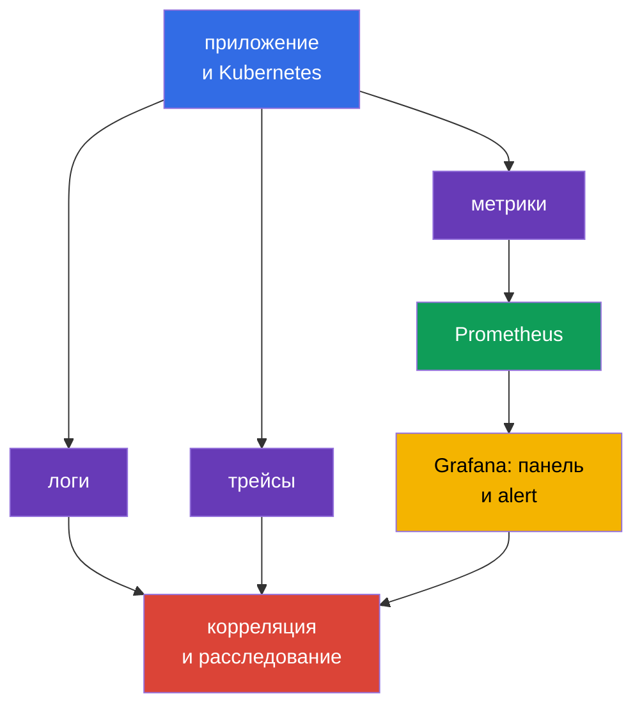
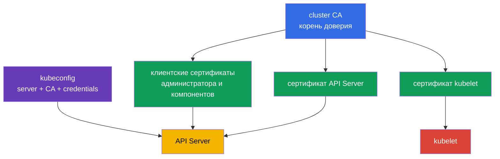
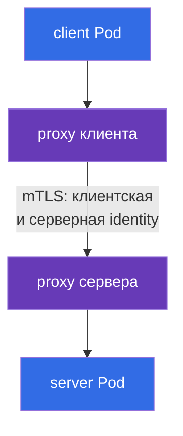

[Eng version](README.md) · [Versión en español](es.md) · [Version française](fr.md) · [Deutsche Version](de.md) · [ქართული ვერსია](ge.md) · [繁體中文版](tw.md) · [日本語版](jp.md)

# Глава 18. Observability, PKI, connectivity и service mesh

> **Что дальше.** Глава 17 показала, как не допускать непроверенный артефакт в кластер. Но превентивные контроли не заменяют наблюдение за работающей системой, доверие между её компонентами и защиту сетевого трафика. Здесь разбираем компетенции Observability, PKI, Connectivity и Service Mesh домена KCSA **Platform Security** с весом 16%. Примеры и термины относятся к Kubernetes `v1.36`.

## 18.1 Observability: логи, метрики и трейсы

**Observability** отвечает на вопрос, что происходит внутри распределённой системы по её внешним сигналам. Для безопасности она помогает не только исправлять сбои, но и заметить атаку, скомпрометированную рабочую нагрузку или ошибочную конфигурацию. Ни один вид телеметрии не заменяет остальные.

| Сигнал | На какой вопрос отвечает | Пример security-сигнала |
|---|---|---|
| Логи | Что именно произошло? | ошибка аутентификации, запуск shell, отказ TLS |
| Метрики | Как меняется состояние во времени? | всплеск 401/403, необычный egress, насыщение CPU |
| Трейсы | Через какие сервисы прошёл запрос? | источник медленного или ошибочного вызова между сервисами |

`Prometheus` собирает и хранит числовые метрики, например число запросов, задержку и потребление ресурсов. `Grafana` строит по этим данным панели и может показывать alert. Панель не является контролем доступа: она даёт видимость, на основании которой команда проверяет причину и реагирует.

Для security-observability важна корреляция. Например, рост HTTP 403 может означать корректно сработавший RBAC, неверно настроенного клиента или подбор прав. Ответ дают сопоставленные время, identity, audit log, метрики API и логи приложения, а не одна метрика сама по себе.

**Falco** ориентирован на runtime detection. Он анализирует системные события рабочего узла и может сообщить о подозрительных действиях процесса в контейнере: интерактивном shell, чтении чувствительного файла, запуске package manager или неожиданном сетевом действии. Сигнал Falco требует контекста: легитимная отладка и атака иногда выглядят похоже.

**Hubble** - средство наблюдаемости Cilium для сетевых потоков. Оно помогает увидеть, какой `Pod` установил соединение, было ли оно разрешено или отклонено политикой и какие DNS-имена участвуют. Hubble не заменяет `NetworkPolicy`: первое средство наблюдает потоки, второе задаёт разрешения.

## 18.2 PKI Kubernetes: доверие и ротация сертификатов

PKI (Public Key Infrastructure) связывает криптографический ключ с идентичностью через сертификат. В Kubernetes cluster CA подписывает сертификаты компонентов, а клиенты и серверы проверяют цепочку доверия. TLS одновременно даёт конфиденциальность канала, проверку подлинности стороны и защиту целостности данных в пути.

Упрощённая модель выглядит так:

PKI-цепочка для экзамена: **CA** подписывает certificate; **certificate** связывает identity и public key; **TLS** защищает конкретное соединение; **mTLS** позволяет обеим сторонам предъявить identity; **rotation** ограничивает lifetime и риск credential. В Kubernetes это относится к сертификатам API Server, kubelet, etcd и client certificate authentication.

> **Не путать.** TLS не является authorization, certificate не является RBAC permission, а TLS termination на Ingress не означает автоматическое end-to-end encryption. Service mesh даёт workload identity, mTLS, policy и telemetry для service-to-service traffic; он не заменяет Kubernetes RBAC, vulnerability scanner или прикладную авторизацию.

`kubeconfig` обычно содержит адрес API Server, данные CA или ссылку на неё и учётные данные клиента, например сертификат или токен. Это не безобидный файл настроек. Его утечка может дать доступ к кластеру с правами указанной identity. Kubeconfig хранят с ограниченными правами доступа, не публикуют в репозитории и отзывают или заменяют скомпрометированные credentials.

Сертификат имеет срок действия. **Ротация сертификатов** заранее заменяет истекающий ключ и сертификат, чтобы компонент продолжал работать и чтобы скомпрометированный credential имел ограниченное время жизни. Важно различать ротацию leaf-сертификата компонента и смену CA: смена CA затрагивает всех доверяющих ей клиентов и серверов, поэтому требует спланированного перехода. Конкретный механизм зависит от способа развёртывания кластера и управляемого провайдера; на уровне KCSA главное понимать цель и риск просроченного либо недоверенного сертификата.

Практику ротации нужно подтверждать evidence, а не просто декларировать её как процесс. Пригодные виды свидетельства для certificate-lifecycle контроля: мониторинг срока действия (expiry monitoring), который заранее предупреждает о приближающемся истечении; записи о фактически выполненных ротациях (rotation records); инвентарь выпущенных сертификатов; и alert для сертификатов, которые приближаются к истечению без плановой замены. Без такого evidence команда может считать, что ротация происходит, но не иметь возможности показать аудитору или расследованию, что она действительно выполняется.

Проверка сертификата должна включать доверенную CA и имя сервера. Простое шифрование без корректной проверки identity не защищает от подмены сервера. Отключение TLS-проверки ради устранения ошибки соединения переносит проблему из доступности в безопасность.

## 18.3 Connectivity: TLS, ingress и egress

Сеть Kubernetes включает несколько разных направлений трафика: клиент к приложению, `Pod` к `Pod`, `Pod` к API Server и `Pod` во внешнюю сеть. Для каждого направления команда определяет, кто может устанавливать соединение, как проверяется сторона и где трафик шифруется.

| Направление | Типовой риск | Концептуальный контроль |
|---|---|---|
| клиент → Ingress → сервис | перехват, неверный сертификат, открытый endpoint | TLS на Ingress, проверка сертификата, аутентификация и авторизация приложения |
| `Pod` → `Pod` | чтение трафика, подмена, латеральное движение | TLS или mTLS, `NetworkPolicy`, identity рабочей нагрузки |
| `Pod` → внешний сервис | утечка данных, доступ к вредоносному endpoint | egress policy, DNS-контроль, TLS и allowlist назначения |
| компонент → API Server | кража credential, MITM | TLS, доверенная CA, least-privilege RBAC |

**Ingress** принимает входящий трафик в кластер и обычно завершает TLS-соединение с внешним клиентом. Это защищает участок до Ingress, но не означает автоматически, что участок Ingress → `Service` или `Pod` тоже шифруется. Нужно явно понимать место TLS termination и требуемую защиту следующего участка.

**Egress** - исходящий трафик из `Pod` или кластера. Без ограничений скомпрометированная рабочая нагрузка может обращаться к внутренним сервисам, metadata endpoint или внешнему command-and-control серверу. `NetworkPolicy` с точечными egress-разрешениями уменьшает этот риск, если CNI применяет policy. Она не заменяет TLS: policy выбирает допустимое направление, TLS защищает содержимое и identity соединения.

Для подключения нельзя полагаться только на IP-адрес и «закрытую сеть». Zero trust предполагает, что сеть может быть наблюдаемой или частично скомпрометированной. Поэтому для чувствительных потоков нужны сегментация, минимальные разрешения и криптографическая проверка peer.

## 18.4 Service mesh: mTLS и политики трафика

**Service mesh** добавляет уровень управления сервисным трафиком. Data-plane proxy рядом с workload (или иной data-plane компонент mesh) устанавливает mTLS, использует выданную workload identity, применяет traffic policy и формирует telemetry. Выдачу/подписание и ротацию workload certificates/identities обеспечивает control-plane identity/CA mechanism mesh, например `istiod` CA вместе с Istio agent, а не сам proxy.

mTLS (mutual TLS) отличается от обычного server-side TLS: сертификат предъявляет не только сервер, но и клиент. Поэтому сервис может проверить, какая рабочая нагрузка обращается к нему, а клиент - удостовериться в identity сервиса.

Traffic policy (allow, timeout, retry, circuit breaking) применяется тем же proxy на обеих сторонах соединения - её не показываем отдельным узлом на диаграмме, чтобы не смешивать два разных механизма в одном графе; подробнее о её роли и ограничениях - в конце этого параграфа.

В Istio ресурс `PeerAuthentication` задаёт режим приема mTLS для mesh или его части. Режим `STRICT` требует, чтобы входящий mesh-трафик к выбранной рабочей нагрузке использовал mTLS. Это полезно против случайного незашифрованного вызова и неаутентифицированного peer, но само по себе не определяет, **кто именно** вправе вызвать сервис и какой URL разрешён. Для этого нужны политики авторизации, `NetworkPolicy` и прикладная авторизация, в зависимости от границы.

Linkerd также обеспечивает identity и mTLS, но не использует ресурс Istio `PeerAuthentication`. На экзамене важно не приписывать конкретный объект одного mesh другому: общий принцип одинаков, конкретные API различаются.

Политики трафика mesh могут задавать routing, timeout, retry, circuit breaking и ограничения соединений. Это повышает управляемость и устойчивость, а security-польза появляется, когда политика ограничивает доверенные направления и делает связь наблюдаемой. Повторные попытки не являются защитой от атаки и при неверной настройке могут усилить нагрузку во время сбоя.

Mesh оправдан, когда много сервисов нуждаются в единой identity, mTLS, наблюдаемости и политике. Для небольшого простого контура он добавляет прокси, сертификаты и операционную сложность. Выбор должен следовать из модели угроз и требований, а не из самого наличия технологии.

## 18.5 Как это применяют на практике

Команда связывает эти средства в один процесс, а не устанавливает их по отдельности:

1. Определяет базовые security-сигналы: отказы аутентификации, рост 5xx, запрещённый egress, события Falco и изменения сертификатов.
2. Выводит метрики в Prometheus и Grafana, а логи, сетевые потоки Hubble и audit-события коррелирует по времени, namespace, `Pod` и identity.
3. Управляет сертификатами как credential: знает владельца CA, сроки, путь ротации и способ отзыва скомпрометированного доступа.
4. Для каждого ingress и egress фиксирует доверенные направления, TLS termination и требование проверки peer. Для критичных межсервисных потоков применяет `NetworkPolicy` и, если нужен общий слой identity, service mesh с mTLS.

Например, alert сообщает, что сервис платежей начал обращаться к неизвестному внешнему адресу. Метрика показывает рост egress, Hubble указывает исходный `Pod`, Falco помогает проверить поведение процесса, а логи приложения и audit log дополняют картину. После сдерживания команда уточняет egress policy, а не только закрывает один IP-адрес.

## 18.6 Exam vocabulary / Мини-глоссарий

| Термин | Значение |
|---|---|
| CA | центр сертификации, которому доверяют при проверке сертификатов |
| Falco | runtime-детектор подозрительных системных событий |
| Grafana | средство визуализации панелей и alert по данным наблюдаемости |
| Hubble | средство наблюдения за сетевыми потоками Cilium |
| mTLS | TLS, в котором сертификат предъявляют обе стороны соединения |
| `PeerAuthentication` | ресурс Istio для задания режима mTLS приема трафика |
| PKI | инфраструктура ключей, сертификатов и цепочек доверия |
| Prometheus | система сбора и хранения метрик |
| service mesh | инфраструктурный слой для управления межсервисным трафиком |
| TLS termination | точка, где компонент завершает TLS и расшифровывает соединение |

## 18.7 Exam Essentials / Итоги главы

- Логи, метрики и трейсы отвечают на разные вопросы; их корреляция делает security-сигнал полезным для расследования.
- Prometheus и Grafana работают с метриками, Falco наблюдает runtime-события, а Hubble даёт видимость сетевых потоков Cilium.
- CA, сертификаты компонентов и `kubeconfig` образуют границу доверия Kubernetes. Утечка kubeconfig и просроченный сертификат являются рисками безопасности и доступности.
- TLS защищает канал и проверяет peer, а ingress TLS не гарантирует шифрование всех следующих участков. Egress и ingress требуют явных границ и политик.
- Istio и Linkerd применяют mTLS для identity рабочих нагрузок. `PeerAuthentication` с `STRICT` в Istio требует mTLS, но не заменяет авторизацию и сетевую сегментацию.

## 18.8 Не путать и как это встречается на экзамене

В MCQ (multiple choice question, вопрос с выбором ответа) различайте назначение инструментов: Prometheus собирает метрики, Grafana показывает их, Falco видит runtime-поведение, Hubble наблюдает потоки Cilium. Вопрос о TLS может проверять границу termination: сертификат на Ingress не доказывает шифрование до backend.

Частая ловушка - считать mTLS или `PeerAuthentication` заменой `NetworkPolicy` и RBAC. mTLS проверяет и защищает соединение, `NetworkPolicy` определяет допустимый сетевой поток, а RBAC управляет доступом к Kubernetes API. Также не путайте `STRICT` с «разрешить весь трафик»: это требование использовать mTLS для подходящих входящих соединений.

## 18.9 Вопросы для самопроверки

### 1. Какой инструмент прежде всего предназначен для обнаружения подозрительных действий процесса в уже работающем контейнере?

   - a. Prometheus

   - b. Falco

   - c. `NetworkPolicy`

   - d. Grafana

Ответ и разбор

**Верный ответ: b. Falco.** Falco анализирует runtime-события и может сигнализировать о shell, доступе к чувствительным файлам или другой подозрительной активности. Prometheus собирает метрики, а Grafana визуализирует данные.

### 2. Что корректно описывает роль CA в PKI Kubernetes?

   - a. CA подписывает сертификаты, а клиенты используют её для проверки цепочки доверия.

   - b. CA заменяет RBAC при доступе к API Server.

   - c. CA хранит все значения `Secret` в зашифрованном виде.

   - d. CA разрешает или запрещает egress из `Pod`.

Ответ и разбор

**Верный ответ: a.** CA является корнем или частью цепочки доверия сертификатов. TLS-аутентификация не отменяет авторизацию RBAC и не задаёт сетевые правила.

### 3. В Istio для рабочей нагрузки задан `PeerAuthentication` с режимом `STRICT`. Что следует из этого прежде всего?

   - a. Все логи рабочей нагрузки сохраняются в etcd.

   - b. К рабочей нагрузке допускается только входящий mesh-трафик с mTLS.

   - c. Любой `Pod` получает права администратора в API Server.

   - d. Все исходящие соединения автоматически запрещены.

Ответ и разбор

**Верный ответ: b.** `STRICT` требует mTLS для подходящего входящего трафика. Он не является RBAC, egress policy или системой журналирования.

### 4. Какое утверждение о TLS на Ingress верно?

   - a. Он защищает соединение до точки TLS termination, а дальнейший участок нужно оценивать отдельно.

   - b. Он заменяет проверку сертификата клиентом.

   - c. Он отменяет необходимость ограничивать доступ к приложению.

   - d. Он автоматически шифрует каждый участок от Ingress до всех `Pod`.

Ответ и разбор

**Верный ответ: a.** TLS действует на конкретном соединении. Если Ingress завершает TLS, безопасность следующего канала до backend зависит от его отдельной конфигурации и контролей.

### 5. Чем лучше всего описывается отличие Hubble от `NetworkPolicy`?

   - a. Оба средства предназначены только для шифрования трафика.

   - b. Hubble заменяет service mesh, а `NetworkPolicy` заменяет RBAC.

   - c. Hubble наблюдает сетевые потоки, а `NetworkPolicy` задаёт разрешённые или запрещённые потоки.

   - d. Hubble создаёт сертификаты, а `NetworkPolicy` хранит метрики.

Ответ и разбор

**Верный ответ: c.** Hubble даёт наблюдаемость для сетевых потоков Cilium. `NetworkPolicy` является декларативным контролем доступа к сетевым соединениям при поддержке CNI.

> **Куда дальше.** Практическое шифрование Pod-to-Pod трафика и mTLS в Cilium, Istio и Linkerd разобраны в главе 23 CKS. Настройка и проверка runtime detection Falco - в главе 29 CKS.

[Оглавление](../README_RU.md) · [Глава 17](../17/ru.md) · [Глава 19](../19/ru.md)
