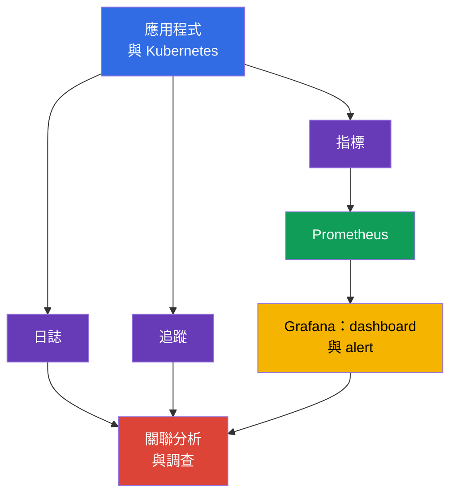
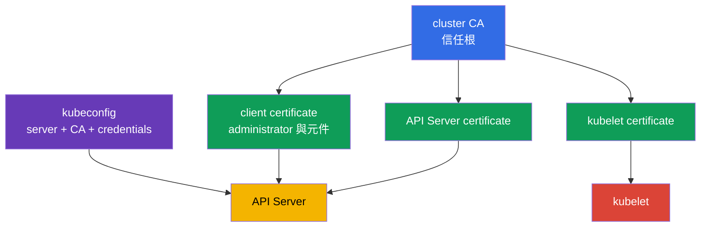
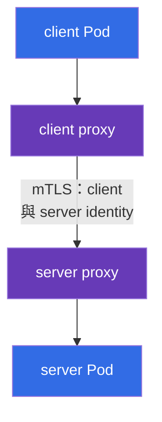

[Русская версия](ru.md) · [Eng version](README.md) · [Versión en español](es.md) · [Version française](fr.md) · [Deutsche Version](de.md) · [ქართული ვერსია](ge.md) · [日本語版](jp.md)

# 第 18 章：Observability、PKI、connectivity 與 service mesh

> **接下來。** 第 17 章說明如何防止未經驗證的 artifact 進入叢集。但預防性控制無法取代對運行中系統的觀測、對其元件間的信任，以及對網路流量的保護。本章探討 KCSA **Platform Security** 領域中權重為 16% 的 Observability、PKI、Connectivity 與 Service Mesh 能力。範例和術語適用於 Kubernetes `v1.36`。

## 18.1 Observability：日誌、指標與追蹤

**Observability** 透過分散式系統的外部訊號，回答其內部正在發生什麼事。對安全性而言，它不僅有助於修復故障，也能發現攻擊、遭入侵的 workload 或錯誤設定。任何一種 telemetry 都不能取代其他種類。

| 訊號 | 回答的問題 | security 訊號範例 |
|---|---|---|
| 日誌 | 究竟發生了什麼？ | authentication 錯誤、啟動 shell、TLS 拒絕 |
| 指標 | 狀態隨時間如何變化？ | 401/403 暴增、異常 egress、CPU 飽和 |
| 追蹤 | 請求經過哪些 service？ | service 間緩慢或失敗呼叫的來源 |

`Prometheus` 收集並儲存數值指標，例如請求數、延遲和資源消耗。`Grafana` 依據這些資料建立 dashboard，並可顯示 alert。dashboard 並非存取控制：它提供可見性，團隊據此檢查原因並採取回應。

對 security-observability 而言，關聯分析很重要。例如，HTTP 403 的增加可能表示 RBAC 正確運作、client 設定錯誤，或有人正在探測權限。答案來自相互對照的時間、identity、audit log、API 指標和應用程式日誌，而非單一指標本身。

**Falco** 著重於 runtime detection。它會分析工作節點的系統事件，並可回報 container 中 process 的可疑行為：互動式 shell、讀取敏感檔案、啟動 package manager，或非預期的網路動作。Falco 訊號需要脈絡：合法的除錯與攻擊有時看起來很相似。

**Hubble** 是 Cilium 用於網路流量的 observability 工具。它有助於了解哪個 `Pod` 建立了連線、連線是由 policy 允許還是拒絕，以及涉及哪些 DNS 名稱。Hubble 無法取代 `NetworkPolicy`：前者觀察流量，後者定義允許項目。

## 18.2 Kubernetes PKI：信任與憑證輪替

PKI（Public Key Infrastructure）透過 certificate 將 cryptographic key 與 identity 連結。在 Kubernetes 中，cluster CA 為元件的 certificate 簽署，而 client 與 server 驗證信任鏈。TLS 同時提供通道機密性、對端真實性驗證，以及對傳輸中資料完整性的保護。

簡化模型如下：

考試所需的 PKI 鏈：**CA** 簽署 certificate；**certificate** 將 identity 與 public key 連結；**TLS** 保護特定連線；**mTLS** 讓雙方都能呈現 identity；**rotation** 限制 credential 的 lifetime 與風險。在 Kubernetes 中，這適用於 API Server、kubelet、etcd 的 certificate，以及 client certificate authentication。

> **不要混淆。** TLS 並不是 authorization，certificate 並不是 RBAC permission，而 Ingress 上的 TLS termination 不表示自動具備 end-to-end encryption。Service mesh 為 service-to-service traffic 提供 workload identity、mTLS、policy 與 telemetry；它不會取代 Kubernetes RBAC、vulnerability scanner 或應用程式 authorization。

`kubeconfig` 通常包含 API Server 位址、CA 資料或其參照，以及 client credentials，例如 certificate 或 token。這不是無害的設定檔。它一旦洩漏，可能會以指定 identity 的權限提供對叢集的存取。應以受限存取權限保存 kubeconfig，不將其發佈到 repository，並撤銷或更換遭入侵的 credentials。

certificate 有有效期限。**certificate rotation** 會預先更換即將到期的 key 與 certificate，使元件能繼續運作，並讓遭入侵 credential 的存活時間受限。務必區分元件 leaf-certificate 的 rotation 與 CA 更換：更換 CA 會影響所有信任它的 client 與 server，因此需要經過規劃的遷移。具體機制取決於叢集的部署方式和 managed provider；在 KCSA 層級，重點是理解目的，以及過期或不受信任 certificate 的風險。

rotation 的實務必須以 evidence 證明，而不僅是宣稱它是一項流程。certificate-lifecycle 控制適用的證據類型包括：提前警示即將到期憑證的有效期限監控（expiry monitoring）；實際已執行 rotation 的記錄（rotation records）；已核發 certificate 的清冊；以及對接近到期卻未有預定更換的 certificate 所發出的 alert。沒有這類 evidence，團隊可能以為 rotation 正在進行，卻無法向 audit 或調查證明它確實被執行。

certificate 驗證應包含受信任的 CA 與 server name。若未正確驗證 identity，單純加密無法防止 server 被冒充。為解決連線錯誤而停用 TLS 驗證，會將問題從可用性轉移到安全性。

## 18.3 Connectivity：TLS、ingress 與 egress

Kubernetes 網路包含數個不同方向的流量：client 到應用程式、`Pod` 到 `Pod`、`Pod` 到 API Server，以及 `Pod` 到外部網路。針對每個方向，團隊都要決定誰可以建立連線、如何驗證對端，以及在哪裡加密流量。

| 方向 | 典型風險 | 概念性控制 |
|---|---|---|
| client → Ingress → service | 攔截、錯誤 certificate、公開 endpoint | Ingress 上的 TLS、certificate 驗證、應用程式 authentication 與 authorization |
| `Pod` → `Pod` | 流量讀取、冒充、橫向移動 | TLS 或 mTLS、`NetworkPolicy`、workload identity |
| `Pod` → 外部 service | 資料外洩、存取惡意 endpoint | egress policy、DNS 控制、TLS 與目的地 allowlist |
| 元件 → API Server | credential 竊取、MITM | TLS、受信任 CA、least-privilege RBAC |

**Ingress** 接收進入叢集的流量，通常會終止與外部 client 的 TLS 連線。這會保護到達 Ingress 前的區段，但不會自動表示 Ingress → `Service` 或 `Pod` 區段也已加密。必須明確了解 TLS termination 的位置，以及下一個區段所需的保護。

**Egress** 是來自 `Pod` 或叢集的傳出流量。若沒有限制，遭入侵的 workload 可存取內部 service、metadata endpoint 或外部 command-and-control server。若 CNI 套用 policy，具有精確 egress 允許項目的 `NetworkPolicy` 可降低此風險。它無法取代 TLS：policy 選擇允許的方向，TLS 保護連線的內容與 identity。

連線時不能只依賴 IP address 與「封閉網路」。Zero trust 假定網路可能遭到觀察或部分入侵。因此，敏感流量需要 segmentation、最小權限與對 peer 的 cryptographic verification。

## 18.4 Service mesh：mTLS 與 traffic policy

**Service mesh** 新增一層對 service traffic 的管理。workload 旁的 data-plane proxy（或 mesh 的其他 data-plane 元件）建立 mTLS、使用已核發的 workload identity、套用 traffic policy，並產生 telemetry。workload certificates/identities 的核發、簽署與 rotation，是由 mesh 的 control-plane identity/CA mechanism 負責，例如 `istiod` CA 搭配 Istio agent，而非 proxy 本身。

mTLS（mutual TLS）與一般 server-side TLS 的差異在於：不僅 server 呈現 certificate，client 也會呈現。因此，service 可驗證是哪個 workload 正在呼叫它，而 client 可確認 service 的 identity。

Traffic policy（allow、timeout、retry、circuit breaking）由連線雙方的相同 proxy 套用。我們不在圖表中將它顯示為獨立節點，以免在同一張圖中混淆兩種不同機制；其角色與限制將在本段結尾進一步說明。

在 Istio 中，`PeerAuthentication` resource 為 mesh 或其一部分設定接收 mTLS 的模式。`STRICT` 模式要求進入所選 workload 的 mesh 流量使用 mTLS。這有助於防範意外的未加密呼叫與未經 authentication 的 peer，但它本身不決定**究竟誰**有權呼叫 service，也不決定允許哪個 URL。依邊界而定，這需要 authorization policy、`NetworkPolicy` 與應用程式 authorization。

Linkerd 同樣提供 identity 與 mTLS，但不使用 Istio 的 `PeerAuthentication` resource。考試時請勿將一種 mesh 的特定 object 歸給另一種 mesh：一般原則相同，具體 API 不同。

mesh 的 traffic policy 可設定 routing、timeout、retry、circuit breaking 與連線限制。這可提升可管理性與韌性；當 policy 限制可信任方向並讓通訊可被觀察時，才產生 security 效益。retry 並不是對抗攻擊的防護，而且錯誤設定時可能在故障期間加劇負載。

當大量 service 需要統一的 identity、mTLS、observability 與 policy 時，mesh 是合理選擇。對小型且簡單的環境，它會增加 proxy、certificate 與營運複雜性。應依 threat model 與需求做出選擇，而非僅因技術本身的存在。

## 18.5 實務上的應用方式

團隊會將這些工具結合為單一流程，而非各自獨立安裝：

1. 定義基礎 security 訊號：authentication 拒絕、5xx 增加、禁止的 egress、Falco 事件與 certificate 變更。
2. 將指標輸出至 Prometheus 和 Grafana，並依時間、namespace、`Pod` 與 identity 關聯日誌、Hubble 網路流量及 audit 事件。
3. 像管理 credential 一樣管理 certificate：了解 CA owner、期限、rotation 路徑，以及撤銷遭入侵存取權的方法。
4. 為每個 ingress 與 egress 記錄可信任方向、TLS termination 與 peer verification 要求。對關鍵的 service 間流量使用 `NetworkPolicy`，若需要共同的 identity 層，則使用具有 mTLS 的 service mesh。

例如，alert 報告付款 service 開始連線至未知的外部位址。指標顯示 egress 增加，Hubble 指出來源 `Pod`，Falco 有助於檢查 process 行為，而應用程式日誌與 audit log 補足整體情況。完成 containment 後，團隊應細化 egress policy，而不只是封鎖一個 IP address。

## 18.6 Exam vocabulary / 迷你詞彙表

| 術語 | 含義 |
|---|---|
| CA | 驗證 certificate 時所信任的 certificate authority |
| Falco | 可偵測可疑系統事件的 runtime detector |
| Grafana | 依 observability 資料視覺化 dashboard 與 alert 的工具 |
| Hubble | 觀察 Cilium 網路流量的工具 |
| mTLS | 連線雙方皆呈現 certificate 的 TLS |
| `PeerAuthentication` | 用來設定 mTLS 流量接收模式的 Istio resource |
| PKI | key、certificate 與信任鏈基礎設施 |
| Prometheus | 收集和儲存指標的系統 |
| service mesh | 用於管理 service 間流量的基礎設施層 |
| TLS termination | 元件終止 TLS 並解密連線的位置 |

## 18.7 Exam Essentials / 本章重點

- 日誌、指標與追蹤回答不同問題；將其關聯能使 security 訊號可用於調查。
- Prometheus 和 Grafana 處理指標，Falco 觀察 runtime 事件，Hubble 提供對 Cilium 網路流量的可見性。
- CA、元件 certificate 與 `kubeconfig` 構成 Kubernetes 的信任邊界。kubeconfig 洩漏和 certificate 過期都是安全性與可用性風險。
- TLS 保護通道並驗證 peer，而 ingress TLS 不保證所有後續區段都已加密。Egress 與 ingress 都需要明確邊界與 policy。
- Istio 與 Linkerd 將 mTLS 用於 workload identity。Istio 中設為 `STRICT` 的 `PeerAuthentication` 要求 mTLS，但不取代 authorization 與網路 segmentation。

## 18.8 不要混淆，以及這在考試中如何出現

在 MCQ（multiple choice question，選擇題）中，請區分工具的用途：Prometheus 收集指標，Grafana 顯示指標，Falco 觀察 runtime 行為，Hubble 觀察 Cilium 流量。關於 TLS 的問題可能考驗 termination 邊界：Ingress 上的 certificate 並不能證明到 backend 的通訊已加密。

常見陷阱是把 mTLS 或 `PeerAuthentication` 當作 `NetworkPolicy` 和 RBAC 的替代品。mTLS 驗證並保護連線，`NetworkPolicy` 定義允許的網路流量，而 RBAC 管理對 Kubernetes API 的存取。同時，不要將 `STRICT` 與「允許全部流量」混淆：它要求適用的傳入連線使用 mTLS。

## 18.9 自我檢查問題

### 1. 哪一項工具主要用於偵測已運行 container 中 process 的可疑動作？

   - a. Prometheus

   - b. Falco

   - c. `NetworkPolicy`

   - d. Grafana

答案與解析

**正確答案：b. Falco。** Falco 會分析 runtime 事件，並可對 shell、存取敏感檔案或其他可疑活動發出訊號。Prometheus 收集指標，而 Grafana 視覺化資料。

### 2. 下列何者正確描述 CA 在 Kubernetes PKI 中的角色？

   - a. CA 簽署 certificate，而 client 使用它來驗證信任鏈。

   - b. CA 在存取 API Server 時取代 RBAC。

   - c. CA 以加密格式儲存所有 `Secret` 值。

   - d. CA 允許或拒絕來自 `Pod` 的 egress。

答案與解析

**正確答案：a。** CA 是 certificate 信任鏈的根或其中一部分。TLS authentication 不會取代 RBAC authorization，也不設定網路規則。

### 3. 在 Istio 中，workload 設定了 `PeerAuthentication` 的 `STRICT` 模式。這首先代表什麼？

   - a. 所有 workload 日誌都儲存在 etcd。

   - b. 僅允許使用 mTLS 的傳入 mesh 流量到達 workload。

   - c. 任意 `Pod` 都能取得 API Server 的 administrator 權限。

   - d. 所有傳出連線都會自動遭到禁止。

答案與解析

**正確答案：b。** `STRICT` 要求適用的傳入流量使用 mTLS。它不是 RBAC、egress policy 或日誌系統。

### 4. 下列關於 Ingress 上 TLS 的敘述何者正確？

   - a. 它保護至 TLS termination 點的連線，而後續區段必須另外評估。

   - b. 它取代 client 的 certificate 驗證。

   - c. 它取消限制應用程式存取的必要性。

   - d. 它會自動加密從 Ingress 到所有 `Pod` 的每個區段。

答案與解析

**正確答案：a。** TLS 適用於特定連線。若 Ingress 終止 TLS，下一個到 backend 的通道安全性取決於其獨立設定與控制。

### 5. 最適合描述 Hubble 與 `NetworkPolicy` 差異的是什麼？

   - a. 兩者都只用於加密流量。

   - b. Hubble 取代 service mesh，而 `NetworkPolicy` 取代 RBAC。

   - c. Hubble 觀察網路流量，而 `NetworkPolicy` 定義允許或禁止的流量。

   - d. Hubble 建立 certificate，而 `NetworkPolicy` 儲存指標。

答案與解析

**正確答案：c。** Hubble 為 Cilium 網路流量提供 observability。當 CNI 支援時，`NetworkPolicy` 是網路連線的宣告式存取控制。

> **下一步。** Pod-to-Pod 流量的實務加密，以及 Cilium、Istio 與 Linkerd 中的 mTLS，將在 CKS 第 23 章說明。runtime detection Falco 的設定與驗證則在 CKS 第 29 章。

[目錄](../README_TW.md) · [第 17 章](../17/tw.md) · [第 19 章](../19/tw.md)