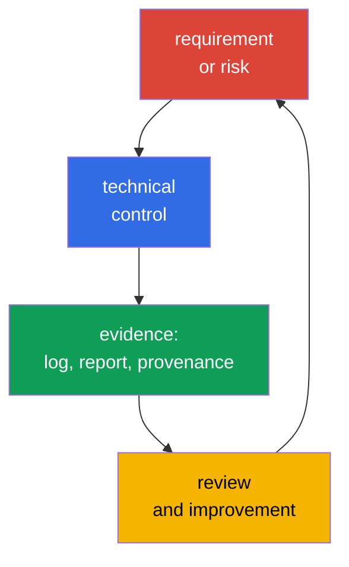
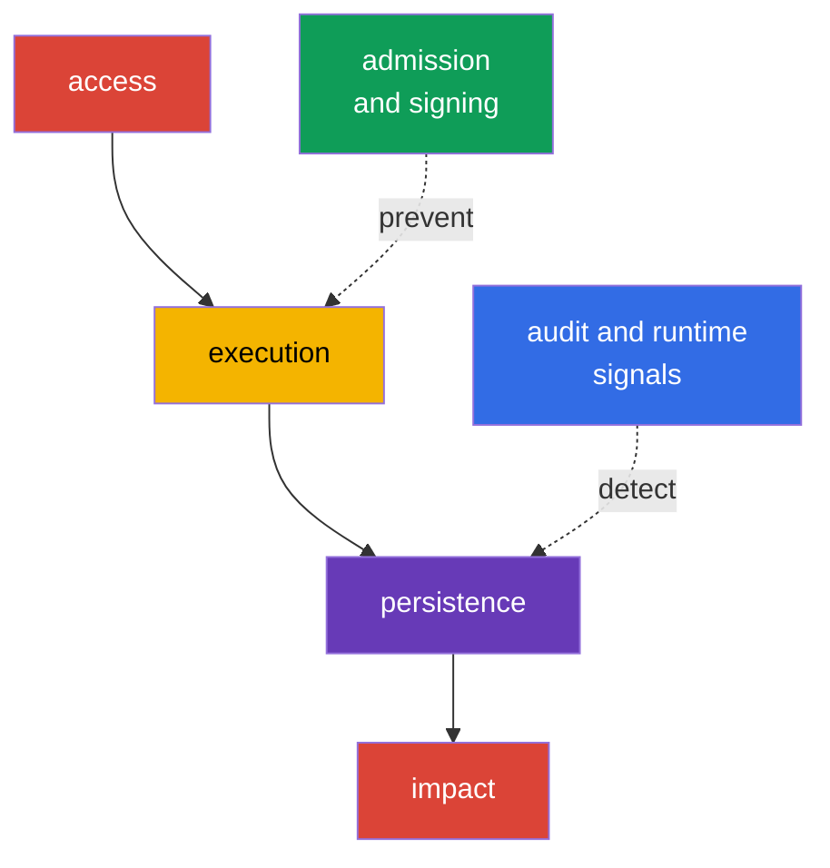

[Русская версия](ru.md) · [Versión en español](es.md) · [Version française](fr.md) · [Deutsche Version](de.md) · [ქართული ვერსია](ge.md) · [繁體中文版](tw.md) · [日本語版](jp.md)

# Chapter 19. Compliance and Security Frameworks

> **What’s next.** In chapters 15-16, we modeled threats and connected them to technical controls, and in chapters 17-18, we examined platform protection. Now we will bring these measures together in language understood by the business, auditors, and development teams: compliance requirements, threat models, artifact provenance evidence, and automated checks. This is the KCSA domain **Compliance and Security Frameworks**, weighted at 10%. Examples target Kubernetes `v1.36`.

Compliance is not the same as security. Meeting requirements means an organization can demonstrate applicable rules, processes, and evidence that they are followed. Security additionally requires selecting measures according to actual threats, verifying their effectiveness, and responding to incidents.

## 19.1 Compliance frameworks: scope, not a ready-made Kubernetes configuration

A framework defines a set of expected practices, control objectives, or mandatory requirements. It does not turn into a single YAML manifest or make a product automatically secure. The team first determines the applicable scope: which data, services, providers, and countries are affected. It then maps requirements to Kubernetes, cloud, CI/CD controls, and people’s processes.

| Framework or regime | Primary scope | What normally must be demonstrated | Example connection to Kubernetes |
|---|---|---|---|
| PCI DSS | payment card data | segmentation, restricted access, data protection, monitoring | isolation of cardholder services, RBAC, access logging |
| NIST | catalog of practices and risk management, often for US government agencies and organizations that choose this approach | inventory, risk assessment, selected and verifiable controls | threat modeling, configuration management, incident response |
| HIPAA | protected health information in the United States | administrative, physical, and technical safeguards for PHI | least privilege, encryption, auditing access to health data |
| SOC 2 | auditor assessment of a service organization’s controls against the Trust Services Criteria | Type I: suitability of control design at a specified date; Type II: design and operating effectiveness of controls over a stated period | role-based access, change management, monitoring, evidence from CI/CD |

PCI DSS and HIPAA may be mandatory for specific types of data and activities; NIST often provides a risk-management structure; SOC 2 is an audit report on controls, not a Kubernetes technical standard. One cluster can be subject to several requirements at once. For example, `NetworkPolicy` is useful for PCI DSS segmentation, but it does not by itself demonstrate full compliance: scope, verification of CNI enforcement, change history, and observation of violations are also needed.

A useful reasoning chain looks like this: “payment card data must not be accessible to all workloads” → restricted network paths and RBAC → policy-check result, audit event, and configuration review. This turns a requirement into a verifiable control rather than a list of general intentions.

### Do not confuse a framework, a control, and evidence

MITRE ATT&CK is a knowledge base about attacker behavior, not a compliance standard. STRIDE is a method for asking questions about threats, not a Kubernetes control. CIS Kubernetes Benchmark is a technical hardening benchmark, not an admission controller. PCI DSS defines requirements for protecting cardholder data, not a Kubernetes configuration guide. A requirement becomes useful only through the **requirement → control → evidence → review** chain.

## 19.2 STRIDE, MITRE ATT&CK for Containers, and the kill chain

Threat modeling starts not with a tool, but with the protected asset and trust boundaries. In Kubernetes, these can include a client and the API Server, a `Pod` and ServiceAccount, a CI system and registry, or a workload and database. Frameworks help avoid missing common attack paths and describe risk consistently to engineers and the security team.

**STRIDE** groups threats into six questions:

| STRIDE category | Question for the system | Kubernetes example |
|---|---|---|
| Spoofing | Can an attacker impersonate another identity? | a stolen ServiceAccount token or kubeconfig |
| Tampering | Can they modify an object or artifact without detection? | replacing an image in a registry or modifying a `Deployment` |
| Repudiation | Can a performed action be denied? | insufficient audit logging for a `RoleBinding` change |
| Information Disclosure | Can data be disclosed? | reading a `Secret` beyond the necessary access |
| Denial of Service | Can availability be exhausted? | creating many `Pod` objects without a quota |
| Elevation of Privilege | Can more permissions be obtained? | launching a privileged `Pod` or having an excessive `ClusterRole` |

MITRE ATT&CK for Containers describes observable tactics and techniques against container environments. It is not a compliance checklist, but a knowledge base for connecting a scenario, telemetry, and detection. For example, a technique can indicate access to credentials, command execution in a container, or abuse of the Kubernetes API. The team maps it to its logs, runtime events, and controls without assuming that every match already means an incident.

The **kill chain** views an attack as a sequence of stages, for example initial access, execution, persistence, privilege escalation, movement toward the target, and impact. The model helps place a control before final damage: image signing and admission validation reduce the risk of running an unsuitable artifact, while audit logs and runtime detection can identify activity after it starts. Real attacks do not have to follow a strictly linear scheme, so the kill chain is used as an analysis aid, not as a rule.

## 19.3 Supply chain compliance: SLSA and provenance

The software supply chain includes source code, dependencies, the build system, registry, deployment, and runtime. Risk arises at every point: a dependency may be vulnerable, a CI credential may be stolen, or an image tag may now point to a different artifact. For compliance, it is important not only to claim that an image is “checked,” but also to retain a verifiable connection between the artifact and its origin.

**SLSA v1.2** (Supply-chain Levels for Software Artifacts) defines supply-chain requirements in independent **Build** and **Source** tracks. Each track has its own levels and requirements, so a Build level cannot be used as a statement about a Source level, and vice versa; the level is always specified together with its track. Do not attribute properties to a level that are not defined by the specific SLSA requirement. A reproducible build can be a useful process property, but it is not a universal synonym for an SLSA level. SLSA does not replace vulnerability scanning and is not a legal product certification. It is a language for expressing required guarantees.

**Reproducible build** - a build in which, given the same source code, specified build environment, and the same build instructions, an independent party can reproduce the specified artifacts identically, bit for bit. Reproducibility helps independently verify the source → artifact correspondence, but it does not itself establish a trusted signing identity, replace provenance, or define an SLSA Build or Source level.

**Provenance** - a machine-readable record of an artifact’s origin. It can identify the source revision, builder, process parameters, inputs, and digest of the resulting image. A verifier compares provenance with organizational policy: an image is allowed if a trusted pipeline built it from an allowed source and it matches the expected digest. A signature protects the provenance assertion from undetected substitution, but the signer’s identity and keys or keyless-signing mechanism must still be trusted.

| Artifact or evidence | Question it answers | Example decision |
|---|---|---|
| SBOM | “Which components make up the image?” | find affected images when a new CVE appears |
| image digest | “Which exact immutable artifact is run?” | deployment with `image@sha256:...` |
| signature | “Which identity attested to the artifact?” | verify the signature before deployment |
| provenance | “Where did it come from, and through which declared process?” | policy allows only a trusted builder and repository |
| SLSA v1.2 | “Which requirements are met in the specified Build or Source track?” | policy and evidence verify the declared track and level |
| scan result | “Which known risks were found at the time of checking?” | CVE handling rule based on severity and context |

These evidence types and frameworks are not interchangeable. An SBOM does not confirm who built an image; a signature does not replace an SBOM or provenance; provenance is not a signature; SLSA does not replace any of these artifacts, but defines requirements for the specified track. A scan does not prove the absence of unknown vulnerabilities. Therefore, a mature process connects the SBOM, signature, provenance, and scan results to the digest, records the applicable SLSA track separately, and retains evidence for review and investigation.

## 19.4 Automation and tools: continuous controls and evidence

A manual review of one cluster quickly becomes outdated: configurations, images, and permissions change more frequently than the next audit occurs. Automation performs repeatable checks, blocks unacceptable changes, or produces evidence. It does not eliminate human decisions about acceptable risk and exceptions.

| Tool or class | Purpose | Typical result |
|---|---|---|
| `kube-bench` | compares configuration against the CIS Kubernetes Benchmark | report of checks and deviations |
| policy engine: OPA/Gatekeeper, Kyverno, ValidatingAdmissionPolicy | evaluates objects at admission or earlier in CI | allow, deny, audit, or policy warning |
| scanner in CI/CD: Trivy and equivalents | finds known vulnerabilities, secrets, or insecure settings | report, pipeline gate, remediation task |
| audit logging | records actions against the Kubernetes API | event with identity, verb, object, and time |
| asset and evidence inventory | connects the cluster, version, policy, and check results | material for review, audit, and investigation |

`kube-bench` checks CIS recommendations and reports deviations, but it does not remediate a cluster or replace assessment of a recommendation’s applicability. A policy engine can deny a privileged `Pod` or an image from an unauthorized registry, yet an incorrect policy can disrupt a legitimate deployment. Policies therefore undergo review, are tested against typical manifests, and are introduced gradually: first audit or warn, then enforce for an agreed requirement.

Compliance evidence must retain the check time, scope, tool/policy version, and identifier of the tested environment or artifact. Access to evidence is restricted against unauthorized modification; for higher assurance, append-only, immutable, or tamper-evident storage is used. Otherwise, it is impossible to reliably prove later that the stored result corresponds to the check actually performed.

In CI/CD, automation typically creates a short path: source code and dependency checking → build → SBOM and scan → signing/provenance → publication by digest → policy check before launch. In the cluster, audit and runtime telemetry provide the next review with facts about whether the control was applied and what happened after deployment.

## 19.5 How this is applied in practice

A payment-service team identifies the namespaces and stores that process card data. For them, it connects PCI DSS requirements to controls: restricted RBAC, traffic segmentation, encrypted connections, audit logging, and an exception-handling process. CI creates an SBOM, scans the image, and gives it a digest and provenance. An admission policy allows only images from a trusted registry that meet the provenance policy into production.

Sometimes a particular workload temporarily requires a deviation from standard policy, for example elevated privileges for diagnostics or migration. Such an exception remains a managed risk only when it is documented and verifiable, not granted informally. A minimal model of a verifiable exception includes five elements: **owner** (who is accountable for the exception and can confirm its status), **scope** (which exact workload, namespace, or condition is covered by the exception, and what is explicitly not covered), **expiry** (a date or condition after which the exception stops applying without a separate renewal), **approval** (who approved the deviation from standard policy and when), and **compensating controls** (which additional measures - enhanced audit, restricted network access, additional monitoring - reduce risk for the exception’s duration). An exception without one of these elements is difficult to distinguish from an uncontrolled policy deviation during a subsequent review or audit.

In parallel, the security team builds a small STRIDE model for the path “developer → CI → registry → `Pod` → database.” For Tampering, it checks pipeline protection and artifact signing; for Information Disclosure, access to `Secret` objects and logs; for Elevation of Privilege, RBAC and policies against privileged workloads. Periodically, `kube-bench` reports, policy results, and a sample of audit events are discussed with system owners. In this way, automation provides input data, but the team remains the risk owner.

## 19.6 Exam vocabulary / Mini-glossary

| Term | Brief meaning |
|---|---|
| compliance | fulfillment of applicable external and internal requirements with supporting evidence |
| control | a technical or process measure that reduces risk or fulfills a requirement |
| evidence | a verifiable trace of a control’s operation: report, log, pipeline record, or review |
| kill chain | a model of attack stages used to find prevention and detection points |
| provenance | information about an artifact’s origin and creation process |
| SLSA v1.2 | a requirement model with independent Build and Source tracks; a level is meaningful only together with its track |
| STRIDE | a threat model: Spoofing, Tampering, Repudiation, Information Disclosure, Denial of Service, Elevation of Privilege |

## 19.7 Exam Essentials / Chapter summary

- Compliance defines applicable requirements and control evidence, but it does not replace management of actual risks.
- PCI DSS, HIPAA, NIST, and SOC 2 differ in scope and purpose; applicability is determined by an organization’s data, activities, and contractual obligations.
- STRIDE helps identify threat classes, MITRE ATT&CK for Containers connects scenarios with tactics and techniques, and the kill chain shows possible attack stages.
- SLSA v1.2 separates independent Build and Source tracks; an SBOM, digest, signature, provenance, and scan answer different questions and are not interchangeable. A reproducible build is not a universal synonym for an SLSA level.
- `kube-bench`, policy engines, CI/CD scanners, and audit logging make checks repeatable and retain evidence, but require review and risk-based configuration.

## 19.8 Do not confuse these concepts and how they appear on the exam

A question usually describes a requirement or scenario and asks you to choose the most appropriate term or control. Distinguish a framework’s scope from a specific implementation: PCI DSS is not a `NetworkPolicy`, and `kube-bench` does not provide compliance by itself. Remember supply-chain artifact differences: an SBOM describes composition, a digest identifies specific content, a signature connects an assertion to an identity, and provenance describes the declared build path. SLSA v1.2 defines requirements independently for Build and Source tracks without replacing these artifacts; a reproducible build is not a universal synonym for an SLSA level.

A common trap is to call every security tool a prevention measure. An audit log primarily creates evidence and aids investigation, whereas an admission policy can prevent an object from being created. Another trap is to consider ATT&CK or STRIDE a list of mandatory controls. These are models for analysis and common terminology, while controls are selected according to risk and requirements.

## 19.9 Self-check questions

### 1. Which statement most accurately describes the purpose of PCI DSS?

   - a. It is a model of attack stages against containers.
   - b. It is a set of security requirements for organizations that process payment card data.
   - c. It is an SBOM format for container images.
   - d. It is an admission control mechanism in Kubernetes.

Answer and explanation

**Correct answer: b.** PCI DSS concerns the protection of payment card data. It may require segmentation, access control, and auditing, but it does not define a single Kubernetes resource or artifact format.

### 2. Which element best answers the question “from which source revision and by which builder was this image created”?

   - a. `NetworkPolicy`.
   - b. API Server audit event.
   - c. Provenance.
   - d. SBOM.

Answer and explanation

**Correct answer: c.** Provenance describes the origin and build process. An SBOM lists components, while an audit event records an action against the cluster API.

### 3. Which example belongs to the STRIDE Elevation of Privilege category?

   - a. An attacker uses another user’s stolen token.
   - b. A workload gains the ability to launch a privileged `Pod`.
   - c. The log does not contain information about who changed a `RoleBinding`.
   - d. An image in the registry is replaced with different content.

Answer and explanation

**Correct answer: b.** Gaining the ability to perform an action with higher permissions belongs to Elevation of Privilege. Option a is Spoofing (using another identity through a stolen token), option c is Repudiation (the inability to identify the author of a change), and option d is Tampering (an unauthorized modification of image content).

### 4. What is the correct role of `kube-bench` in a compliance program?

   - a. It automatically encrypts all `Secret` objects in etcd.
   - b. It signs images and creates provenance.
   - c. It replaces the auditor and the assessment of control applicability.
   - d. It compares configuration against CIS recommendations and produces a report of deviations.

Answer and explanation

**Correct answer: d.** `kube-bench` helps check CIS recommendations. The result needs interpretation: some recommendations may not apply to a managed cluster, while remediation and risk acceptance remain the organization’s responsibility.

### 5. Which evidence correctly describes SLSA v1.2 in a supply-chain report?

   - a. State that a signature exists and treat it as a replacement for provenance, an SBOM, scan results, and a separate declaration of the applicable SLSA track.

   - b. State the applicable Build or Source track and its level, while retaining related evidence separately according to the purpose of each evidence type.

   - c. State that an SBOM exists and use it to assign the same SLSA level to both Build and Source tracks without additional evidence.

   - d. State that a build is reproducible and use it as a universal SLSA level regardless of the selected track, provenance, and level requirements.

Answer and explanation

**Correct answer: b.** SLSA v1.2 has separate Build and Source tracks with their own levels and requirements. Therefore, a level is specified together with its specific track.

An SBOM, signature, provenance, and scan results answer different questions and do not become interchangeable merely because SLSA is used. A reproducible build is also not a universal designation of an SLSA level.

> **Where next.** For practical CIS Benchmark verification, use chapter 07 of CKS. Admission control scenarios are covered in chapter 20 of CKS; supply chain, SBOMs, signatures, and policy are covered in chapters 25-28 of CKS. For audit logging configuration and analysis, use chapter 32 of CKS.

[Table of contents](../README.md) · [Chapter 18](../18/README.md) · [Chapter 20](../20/README.md)