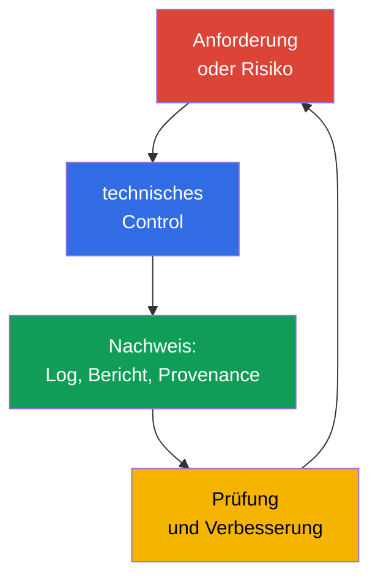
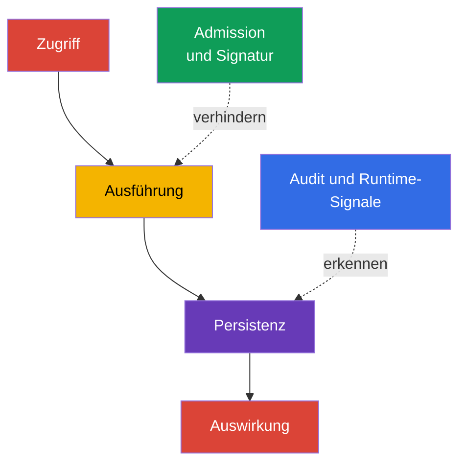

[Русская версия](ru.md) · [Eng version](README.md) · [Versión en español](es.md) · [Version française](fr.md) · [ქართული ვერსია](ge.md) · [繁體中文版](tw.md) · [日本語版](jp.md)

# Kapitel 19. Compliance und Sicherheits-Frameworks

> **Was kommt als Nächstes?** In den Kapiteln 15-16 haben wir Bedrohungen modelliert und sie technischen Controls zugeordnet, und in den Kapiteln 17-18 den Schutz der Plattform behandelt. Nun fassen wir diese Maßnahmen in einer Sprache zusammen, die für Unternehmen, Auditoren und Entwicklungsteams verständlich ist: Compliance-Anforderungen, Bedrohungsmodelle, Herkunftsnachweise von Artefakten und automatisierte Prüfungen. Dies ist die KCSA-Domäne **Compliance and Security Frameworks** mit einer Gewichtung von 10 %. Die Beispiele beziehen sich auf Kubernetes `v1.36`.

Compliance ist nicht gleich Sicherheit. Die Erfüllung von Anforderungen bedeutet, dass eine Organisation anwendbare Regeln, Prozesse und Nachweise ihrer Umsetzung vorzeigen kann. Sicherheit erfordert zusätzlich, Maßnahmen anhand tatsächlicher Bedrohungen auszuwählen, ihre Wirksamkeit zu prüfen und auf Vorfälle zu reagieren.

## 19.1 Compliance-Frameworks: Geltungsbereich statt fertiger Kubernetes-Konfiguration

Ein Framework definiert eine Reihe erwarteter Praktiken, Control-Ziele oder verbindlicher Anforderungen. Es wird nicht zu einem einzelnen YAML-Manifest und macht ein Produkt nicht automatisch sicher. Das Team bestimmt zunächst den anwendbaren Geltungsbereich: Welche Daten, Services, Anbieter und Länder betroffen sind. Anschließend ordnet es Anforderungen Controls in Kubernetes, der Cloud, CI/CD und menschlichen Prozessen zu.

| Framework oder Regelwerk | Hauptbereich | Was üblicherweise nachzuweisen ist | Beispiel für die Verbindung zu Kubernetes |
|---|---|---|---|
| PCI DSS | Zahlungskartendaten | Segmentierung, Zugriffsbeschränkung, Datenschutz, Monitoring | Isolierung von Cardholder-Services, RBAC, Zugriffsprotokollierung |
| NIST | Katalog von Praktiken und Risikomanagement, häufig für US-Behörden und Organisationen, die diesen Ansatz wählen | Inventarisierung, Risikobewertung, ausgewählte und überprüfbare Controls | Bedrohungsmodell, Konfigurationsmanagement, Incident Response |
| HIPAA | geschützte Gesundheitsinformationen in den USA | administrative, physische und technische Safeguards für PHI | Least Privilege, Verschlüsselung, Audit von Zugriffen auf Gesundheitsdaten |
| SOC 2 | Auditbewertung der Controls einer Service-Organisation nach Trust Services Criteria | Type I: Eignung des Control-Designs zu einem angegebenen Datum; Type II: Design und Operating Effectiveness der Controls über den angegebenen Zeitraum | rollenbasierter Zugriff, Change Management, Monitoring, Evidence aus CI/CD |

PCI DSS und HIPAA können für bestimmte Datenarten und Tätigkeiten verpflichtend sein; NIST dient oft als Struktur für das Risikomanagement; SOC 2 ist ein Auditbericht über Controls und kein technischer Kubernetes-Standard. Ein Cluster kann gleichzeitig mehreren Anforderungen unterliegen. Beispielsweise ist eine `NetworkPolicy` für die PCI-DSS-Segmentierung nützlich, weist aber für sich allein nicht die vollständige Compliance nach: Es werden Geltungsbereich, Prüfung der CNI-Anwendung, Änderungshistorie und Beobachtung von Verstößen benötigt.

Eine hilfreiche Argumentationskette sieht so aus: „Zahlungskartendaten dürfen nicht für alle Workloads zugänglich sein“ → Einschränkung von Netzwerkpfaden und RBAC → Ergebnis der Policy-Prüfung, Audit Event und Konfigurationsreview. So wird eine Anforderung zu einem überprüfbaren Control und nicht zu einer Liste allgemeiner Absichten.

### Framework, Control und Evidence nicht verwechseln

MITRE ATT&CK ist eine Wissensdatenbank über das Verhalten von Angreifern und kein Compliance-Standard. STRIDE ist eine Methode, Fragen zu Bedrohungen zu stellen, und kein Kubernetes-Control. CIS Kubernetes Benchmark ist ein technischer Hardening-Benchmark und kein Admission Controller. PCI DSS sind Anforderungen zum Schutz von Cardholder Data und kein Kubernetes-Konfigurationsleitfaden. Eine Anforderung wird erst durch die Kette **requirement → control → evidence → review** nützlich.

## 19.2 STRIDE, MITRE ATT&CK for Containers und Kill Chain

Die Bedrohungsmodellierung beginnt nicht mit einem Tool, sondern mit dem Schutzobjekt und den Vertrauensgrenzen. In Kubernetes können dies Client und API Server, `Pod` und ServiceAccount, CI-System und Registry, Workload und Datenbank sein. Frameworks helfen dabei, typische Angriffswege nicht zu übersehen und Risiken für Engineers und das Sicherheitsteam einheitlich zu beschreiben.

**STRIDE** gruppiert Bedrohungen nach sechs Fragen:

| STRIDE-Kategorie | Frage an das System | Beispiel in Kubernetes |
|---|---|---|
| Spoofing | Kann sich ein Angreifer als eine andere Identity ausgeben? | gestohlener ServiceAccount-Token oder kubeconfig |
| Tampering | Kann er ein Objekt oder Artefakt unbemerkt verändern? | Ersetzen eines Images in der Registry oder Ändern eines `Deployment` |
| Repudiation | Kann eine ausgeführte Aktion abgestritten werden? | fehlendes ausreichendes Audit Logging für eine Änderung an `RoleBinding` |
| Information Disclosure | Können Daten offengelegt werden? | Lesen eines `Secret` über den erforderlichen Zugriff hinaus |
| Denial of Service | Kann die Verfügbarkeit erschöpft werden? | Erstellen vieler `Pod` ohne Quota |
| Elevation of Privilege | Können weitergehende Berechtigungen erlangt werden? | Starten eines privileged `Pod` oder übermäßige `ClusterRole` |

MITRE ATT&CK for Containers beschreibt beobachtbare Taktiken und Techniken gegen Container-Umgebungen. Es ist keine Compliance-Checkliste, sondern eine Wissensdatenbank, um Szenarien, Telemetrie und Detection zu verbinden. Beispielsweise kann eine Technik auf Zugriff auf Credentials, das Ausführen eines Befehls in einem Container oder Missbrauch der Kubernetes-API hinweisen. Das Team ordnet sie seinen Logs, Runtime-Events und Controls zu, ohne anzunehmen, dass jede Übereinstimmung bereits einen Vorfall bedeutet.

Die **Kill Chain** betrachtet einen Angriff als Abfolge von Phasen, beispielsweise Erlangen des Erstzugriffs, Ausführung, Persistenz, Privilegienerweiterung, Bewegung zum Ziel und Auswirkung. Das Modell hilft, Controls vor dem endgültigen Schaden zu platzieren: Image-Signatur und Admission-Prüfung verringern das Risiko, ein ungeeignetes Artefakt zu starten, während Audit Log und Runtime Detection Aktionen nach dem Start erkennen können. Reale Angriffe müssen keinem streng linearen Schema folgen, daher wird die Kill Chain als Analysewerkzeug und nicht als Regel verwendet.

## 19.3 Compliance der Lieferkette: SLSA und Provenance

Die Software-Lieferkette umfasst Quellcode, Abhängigkeiten, Build-System, Registry, Deployment und Runtime. Das Risiko entsteht an jedem Punkt: Eine Abhängigkeit kann verwundbar sein, ein CI-Credential kann gestohlen werden und ein Image-Tag kann bereits auf ein anderes Artefakt zeigen. Für Compliance ist nicht nur wichtig zu behaupten, ein Image sei „geprüft“, sondern auch eine überprüfbare Verbindung zwischen dem Artefakt und seiner Herkunft zu bewahren.

**SLSA v1.2** (Supply-chain Levels for Software Artifacts) definiert Anforderungen an die Lieferkette in unabhängigen Tracks **Build** und **Source**. Jeder Track hat eigene Level und Anforderungen, daher kann ein Build-Level nicht als Aussage über ein Source-Level verwendet werden und umgekehrt; das Level wird immer zusammen mit dem Track angegeben. Einem Level sollten keine Eigenschaften zugeschrieben werden, die nicht durch die konkrete SLSA-Anforderung definiert sind. Ein Reproducible Build kann eine nützliche Eigenschaft des Prozesses sein, ist aber kein universelles Synonym für ein SLSA-Level. SLSA ersetzt weder das Scannen nach Schwachstellen noch ist es eine rechtliche Zertifizierung eines Produkts. Es ist eine Sprache zur Formulierung erforderlicher Garantien.

Ein **Reproducible Build** ist ein Build, bei dem eine unabhängige Partei mit denselben Quellen, einer bestimmten Build Environment und denselben Build Instructions die angegebenen Artefakte bitgenau reproduzieren kann. Reproduzierbarkeit hilft, die Zuordnung source → artifact unabhängig zu überprüfen, beweist für sich allein jedoch weder eine vertrauenswürdige Signing Identity noch ersetzt sie Provenance oder definiert ein SLSA Build- oder Source-Level.

**Provenance** ist eine maschinenlesbare Aufzeichnung über die Herkunft eines Artefakts. Darin können der Source Revision, Builder, Prozessparameter, Eingaben und Digest des entstandenen Images angegeben sein. Der Prüfer vergleicht die Provenance mit der Policy der Organisation: Das Image ist erlaubt, wenn es von einer vertrauenswürdigen Pipeline aus einer erlaubten Quelle gebaut wurde und dem erwarteten Digest entspricht. Eine Signatur schützt die Aussage über Provenance vor unbemerktem Austausch, dennoch muss der Identity des Unterzeichners und den Schlüsseln oder dem Mechanismus der Keyless-Signatur vertraut werden.

| Artefakt oder Nachweis | Welche Frage wird beantwortet? | Beispiel für eine Entscheidung |
|---|---|---|
| SBOM | „Aus welchen Komponenten besteht das Image?“ | Suche nach betroffenen Images bei einer neuen CVE |
| Image-Digest | „Welches genaue unveränderliche Artefakt wird gestartet?“ | Deployment mit `image@sha256:...` |
| Signatur | „Welche Identity hat das Artefakt bestätigt?“ | Prüfung der Signatur vor dem Deployment |
| Provenance | „Woher stammt es und durch welchen angegebenen Prozess wurde es erzeugt?“ | Policy erlaubt nur vertrauenswürdigen Builder und Repository |
| SLSA v1.2 | „Welche Anforderungen sind im angegebenen Track Build oder Source erfüllt?“ | Policy und Evidence prüfen den erklärten Track und das Level |
| Scan-Ergebnis | „Welche bekannten Risiken wurden zum Zeitpunkt der Prüfung gefunden?“ | Regel zur Behandlung von CVE nach Severity und Kontext |

Diese Nachweise und Rahmen sind nicht austauschbar. Eine SBOM bestätigt nicht, wer ein Image gebaut hat; eine Signatur ersetzt weder SBOM noch Provenance; Provenance ist keine Signatur; SLSA ersetzt keines dieser Artefakte, sondern definiert Anforderungen an den angegebenen Track. Ein Scan weist nicht die Abwesenheit unbekannter Schwachstellen nach. Daher verknüpft ein reifer Prozess SBOM, Signatur, Provenance und Scan-Ergebnisse mit dem Digest, hält den anwendbaren SLSA-Track getrennt fest und bewahrt Evidence für Review und Untersuchung auf.

## 19.4 Automatisierung und Tools: kontinuierliche Controls und Evidence

Die manuelle Prüfung eines Clusters veraltet schnell: Konfigurationen, Images und Berechtigungen ändern sich häufiger, als das nächste Audit stattfindet. Automatisierung führt wiederholbare Prüfungen aus, blockiert nicht akzeptable Änderungen oder erzeugt Evidence. Sie ersetzt nicht die Entscheidung eines Menschen über akzeptables Risiko und Ausnahmen.

| Tool oder Klasse | Zweck | Typisches Ergebnis |
|---|---|---|
| `kube-bench` | ordnet die Konfiguration dem CIS Kubernetes Benchmark zu | Bericht über Prüfungen und Abweichungen |
| Policy Engine: OPA/Gatekeeper, Kyverno, ValidatingAdmissionPolicy | bewertet Objekte bei Admission oder vorab in CI | allow, deny, audit oder Warnung gemäß Policy |
| Scanner in CI/CD: Trivy und Äquivalente | sucht nach bekannten Schwachstellen, Secrets oder unsicheren Einstellungen | Bericht, Gate für die Pipeline, Behebungsaufgabe |
| Audit Logging | zeichnet Aktionen mit der Kubernetes-API auf | Event mit Identity, Verb, Objekt und Zeit |
| Asset- und Evidence-Inventar | verbindet Cluster, Version, Policy und Prüfergebnisse | Material für Review, Audit und Untersuchung |

`kube-bench` prüft CIS-Empfehlungen und meldet Abweichungen, korrigiert aber weder den Cluster noch ersetzt es die Bewertung der Anwendbarkeit einer Empfehlung. Eine Policy Engine kann einen privileged `Pod` oder ein Image aus einer nicht erlaubten Registry verweigern, allerdings kann eine fehlerhafte Policy ein legitimes Deployment stören. Deshalb werden Policies reviewt, anhand typischer Manifeste getestet und schrittweise eingeführt: zunächst audit oder warn, dann enforce für eine abgestimmte Anforderung.

Compliance Evidence muss Prüfzeit, Scope, Version des Tools bzw. der Policy und die Kennung der geprüften Umgebung oder des Artefakts bewahren. Der Zugriff auf Evidence wird gegen unbefugte Änderungen eingeschränkt; für erhöhte Assurance wird Append-only-, immutable- oder tamper-evident-Speicher verwendet. Andernfalls kann später nicht zuverlässig nachgewiesen werden, dass das gespeicherte Ergebnis der tatsächlich ausgeführten Prüfung entspricht.

In CI/CD bildet die Automatisierung üblicherweise einen kurzen Pfad: Prüfung von Quellcode und Abhängigkeiten → Build → SBOM und Scan → Signatur/Provenance → Veröffentlichung per Digest → Policy-Prüfung vor dem Start. Im Cluster liefern Audit und Runtime-Telemetrie dem anschließenden Review Fakten darüber, ob das Control angewendet wurde und was nach dem Deployment geschah.

## 19.5 Praktische Anwendung

Ein Team für Zahlungsservices bestimmt die Namespaces und Speicher, die Kartendaten verarbeiten. Dafür verknüpft es PCI-DSS-Anforderungen mit Controls: eingeschränktes RBAC, Traffic-Segmentierung, verschlüsselte Verbindungen, Audit Logging und einen Prozess zur Behandlung von Ausnahmen. In CI wird eine SBOM erstellt, das Image gescannt und mit Digest sowie Provenance versehen. Eine Admission Policy erlaubt in Production nur Images aus einer vertrauenswürdigen Registry, die der Herkunfts-Policy entsprechen.

Manchmal benötigt ein konkreter Workload vorübergehend eine Ausnahme von der Standard-Policy, beispielsweise erhöhte Privilegien für Diagnose oder Migration. Eine solche Ausnahme bleibt nur dann ein gesteuertes Risiko, wenn sie dokumentiert und überprüfbar ist, statt informell erteilt zu werden. Ein minimales Modell einer überprüfbaren Ausnahme umfasst fünf Elemente: **owner** (wer für die Ausnahme verantwortlich ist und ihren Status bestätigen kann), **scope** (welcher genaue Workload, Namespace oder welche Bedingung durch die Ausnahme abgedeckt ist und was ausdrücklich nicht abgedeckt ist), **expiry** (ein Datum oder eine Bedingung, nach der die Ausnahme ohne separate Verlängerung nicht mehr gilt), **approval** (wer die Abweichung von der Standard-Policy wann genehmigt hat) und **compensating controls** (welche zusätzlichen Maßnahmen - verstärktes Audit, eingeschränkter Netzwerkzugang, zusätzliches Monitoring - das Risiko während der Geltung der Ausnahme senken). Eine Ausnahme ohne eines dieser Elemente lässt sich bei einem späteren Review oder Audit nur schwer von einer unkontrollierten Abweichung von der Policy unterscheiden.

Parallel erstellt das Sicherheitsteam ein kleines STRIDE-Modell für den Pfad „Entwickler → CI → Registry → `Pod` → Datenbank“. Für Tampering prüft es den Schutz der Pipeline und die Signatur von Artefakten; für Information Disclosure Zugriffe auf `Secret` und Logs; für Elevation of Privilege RBAC und Policies gegen privileged Workloads. In regelmäßigen Abständen werden Berichte von `kube-bench`, Policy-Ergebnisse und eine Auswahl von Audit Events mit den Systemverantwortlichen besprochen. So liefert Automatisierung Eingabedaten, doch Eigentümer des Risikos bleibt das Team.

## 19.6 Exam vocabulary / Mini-Glossar

| Begriff | Kurzbedeutung |
|---|---|
| compliance | Erfüllung anwendbarer externer und interner Anforderungen mit bestätigenden Nachweisen |
| control | technische oder prozessuale Maßnahme, die Risiko verringert oder eine Anforderung erfüllt |
| evidence | überprüfbare Spur der Arbeit eines Controls: Bericht, Log, Pipeline-Aufzeichnung oder Review |
| kill chain | Modell von Angriffsphasen zur Suche nach Punkten für Prävention und Erkennung |
| provenance | Informationen über Herkunft und Erstellungsprozess eines Artefakts |
| SLSA v1.2 | Anforderungsmodell mit unabhängigen Tracks Build und Source; ein Level ist nur zusammen mit dem Track aussagekräftig |
| STRIDE | Bedrohungsmodell: Spoofing, Tampering, Repudiation, Information Disclosure, Denial of Service, Elevation of Privilege |

## 19.7 Exam Essentials / Kernaussagen des Kapitels

- Compliance definiert anwendbare Anforderungen und Evidence für Controls, ersetzt aber nicht das Management tatsächlicher Risiken.
- PCI DSS, HIPAA, NIST und SOC 2 unterscheiden sich in Geltungsbereich und Zweck; die Anwendbarkeit wird durch Daten, Tätigkeiten und vertragliche Verpflichtungen der Organisation bestimmt.
- STRIDE hilft bei der Suche nach Bedrohungsklassen, MITRE ATT&CK for Containers verbindet Szenarien mit Taktiken und Techniken, und die Kill Chain zeigt mögliche Angriffsphasen.
- SLSA v1.2 trennt die unabhängigen Tracks Build und Source; SBOM, Digest, Signatur, Provenance und Scan beantworten unterschiedliche Fragen und sind nicht austauschbar. Ein Reproducible Build ist kein universelles Synonym für ein SLSA-Level.
- `kube-bench`, Policy Engines, CI/CD-Scanner und Audit Logging machen Prüfungen wiederholbar und bewahren Evidence, erfordern jedoch Review und eine auf das Risiko abgestimmte Konfiguration.

## 19.8 Nicht verwechseln und wie es in der Prüfung vorkommt

Eine Frage beschreibt üblicherweise eine Anforderung oder ein Szenario und fordert dazu auf, den passendsten Begriff oder das geeignetste Control auszuwählen. Unterscheiden Sie den Bereich eines Frameworks von einer konkreten Implementierung: PCI DSS ist keine `NetworkPolicy`, und `kube-bench` gewährleistet nicht für sich allein Compliance. Beachten Sie die Unterschiede der Artefakte in der Lieferkette: Eine SBOM beschreibt die Zusammensetzung, ein Digest identifiziert den konkreten Inhalt, eine Signatur verbindet eine Aussage mit einer Identity, und Provenance beschreibt den angegebenen Build-Pfad. SLSA v1.2 definiert Anforderungen unabhängig für die Tracks Build und Source, ohne diese Artefakte zu ersetzen; ein Reproducible Build ist kein universelles Synonym für ein SLSA-Level.

Eine typische Falle besteht darin, jedes Security-Tool als Präventionsmittel zu bezeichnen. Ein Audit Log erzeugt primär Evidence und hilft bei Untersuchungen, während eine Admission Policy ein Objekt vor seiner Erstellung ablehnen kann. Eine weitere Falle ist, ATT&CK oder STRIDE als Liste verpflichtender Controls anzusehen. Dies sind Modelle für Analyse und gemeinsame Terminologie; Controls werden anhand von Risiko und Anforderungen ausgewählt.

## 19.9 Fragen zur Selbstkontrolle

### 1. Welche Aussage beschreibt den Zweck von PCI DSS am treffendsten?

   - a. Es ist ein Modell von Angriffsstadien auf Container.
   - b. Es ist eine Reihe von Sicherheitsanforderungen für Organisationen, die Zahlungskartendaten verarbeiten.
   - c. Es ist ein SBOM-Format für Container-Images.
   - d. Es ist ein Admission-Control-Mechanismus in Kubernetes.

Antwort und Erläuterung

**Richtige Antwort: b.** PCI DSS bezieht sich auf den Schutz von Zahlungskartendaten. Es kann Segmentierung, Zugriffskontrolle und Audit verlangen, definiert jedoch weder eine einzelne Kubernetes-Ressource noch ein Artefaktformat.

### 2. Welches Element beantwortet am besten die Frage „aus welcher Source Revision und von welchem Builder wurde dieses Image erstellt“?

   - a. `NetworkPolicy`.
   - b. Audit Event des API Server.
   - c. Provenance.
   - d. SBOM.

Antwort und Erläuterung

**Richtige Antwort: c.** Provenance beschreibt Herkunft und Build-Prozess. Eine SBOM listet Komponenten auf, während ein Audit Event eine Aktion mit der Cluster-API aufzeichnet.

### 3. Welches Beispiel gehört zur STRIDE-Kategorie Elevation of Privilege?

   - a. Ein Angreifer verwendet den gestohlenen Token eines anderen Benutzers.
   - b. Ein Workload erhält die Möglichkeit, einen privileged `Pod` zu starten.
   - c. Im Log fehlen Angaben dazu, wer ein `RoleBinding` geändert hat.
   - d. Ein Image in der Registry wurde durch anderen Inhalt ersetzt.

Antwort und Erläuterung

**Richtige Antwort: b.** Die Möglichkeit, eine Aktion mit höheren Berechtigungen auszuführen, gehört zu Elevation of Privilege. Antwort a entspricht Spoofing (Nutzung einer fremden Identity durch einen gestohlenen Token), Antwort c Repudiation (Unmöglichkeit, den Autor einer Änderung festzustellen), und Antwort d Tampering (nicht abgestimmte Änderung des Image-Inhalts).

### 4. Welche Rolle hat `kube-bench` in einem Compliance-Programm korrekt?

   - a. Es verschlüsselt automatisch alle `Secret` in etcd.
   - b. Es signiert Images und erstellt Provenance.
   - c. Es ersetzt den Auditor und die Bewertung der Anwendbarkeit von Controls.
   - d. Es ordnet die Konfiguration den CIS-Empfehlungen zu und erstellt einen Bericht über Abweichungen.

Antwort und Erläuterung

**Richtige Antwort: d.** `kube-bench` hilft bei der Prüfung von CIS-Empfehlungen. Das Ergebnis muss interpretiert werden: Ein Teil der Empfehlungen kann für einen verwalteten Cluster nicht anwendbar sein, während Behebung und Risikoakzeptanz Aufgaben der Organisation bleiben.

### 5. Welche Evidence beschreibt SLSA v1.2 in einem Bericht über die Lieferkette korrekt?

   - a. Das Vorhandensein einer Signatur angeben und sie als Ersatz für Provenance, SBOM, Scan-Ergebnisse und eine separate Erklärung des anwendbaren SLSA-Tracks behandeln.

   - b. Den anwendbaren Track Build oder Source und sein Level angeben und die zugehörige Evidence entsprechend dem Zweck jeder Nachweisart getrennt bewahren.

   - c. Das Vorhandensein einer SBOM angeben und auf dieser Grundlage ohne zusätzliche Evidence gleichzeitig beiden Tracks Build und Source dasselbe SLSA-Level zuweisen.

   - d. Einen Reproducible Build angeben und ihn unabhängig von gewähltem Track, Provenance und Level-Anforderungen als universelles SLSA-Level verwenden.

Antwort und Erläuterung

**Richtige Antwort: b.** SLSA v1.2 besitzt getrennte Tracks Build und Source mit eigenen Leveln und Anforderungen. Daher wird ein Level zusammen mit dem konkreten Track angegeben.

SBOM, Signatur, Provenance und Scan-Ergebnisse beantworten unterschiedliche Fragen und werden nicht allein durch die Verwendung von SLSA austauschbar. Ein Reproducible Build ist ebenfalls keine universelle Bezeichnung für ein SLSA-Level.

> **Wie geht es weiter?** Für die praktische Prüfung des CIS Benchmark verwenden Sie Kapitel 07 CKS. Szenarien für Admission Control werden in Kapitel 20 CKS behandelt; Lieferkette, SBOM, Signaturen und Policy in den Kapiteln 25-28 CKS. Verwenden Sie für die Konfiguration und Analyse von Audit Logging Kapitel 32 CKS.

[Inhaltsverzeichnis](../README_DE.md) · [Kapitel 18](../18/de.md) · [Kapitel 20](../20/de.md)