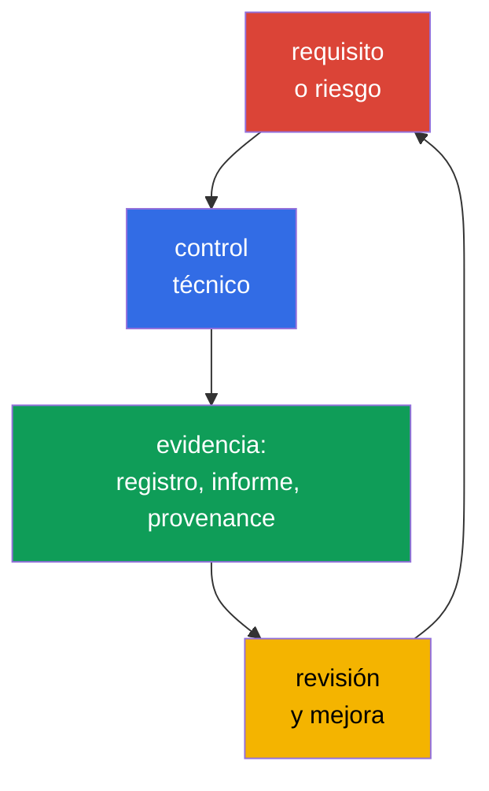
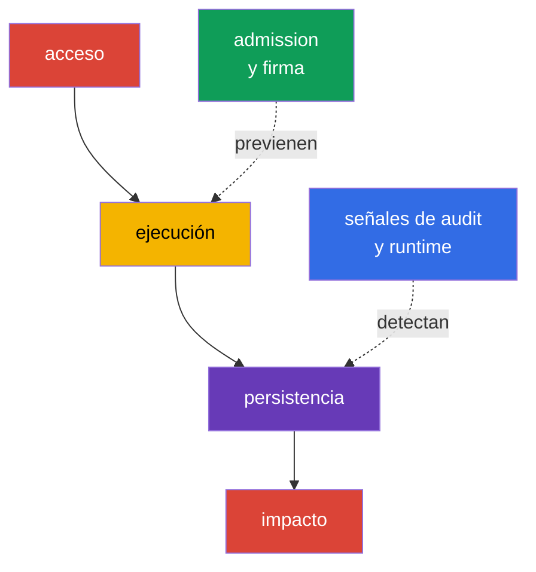

[Русская версия](ru.md) · [Eng version](README.md) · [Version française](fr.md) · [Deutsche Version](de.md) · [ქართული ვერსია](ge.md) · [繁體中文版](tw.md) · [日本語版](jp.md)

# Capítulo 19. Cumplimiento y marcos de seguridad

> **Qué sigue.** En los capítulos 15-16 modelamos amenazas y las vinculamos con controles técnicos, y en los capítulos 17-18 examinamos la protección de la plataforma. Ahora reuniremos estas medidas en un lenguaje comprensible para el negocio, los auditores y los equipos de desarrollo: requisitos de cumplimiento, modelos de amenazas, evidencia de procedencia de artefactos y verificaciones automatizadas. Este es el dominio KCSA **Compliance and Security Frameworks**, con un peso del 10%. Los ejemplos están orientados a Kubernetes `v1.36`.

El cumplimiento no equivale a la seguridad. Cumplir requisitos significa que una organización puede mostrar las reglas, procesos y evidencias aplicables de su ejecución. La seguridad requiere además seleccionar medidas según las amenazas reales, comprobar su efectividad y responder a incidentes.

## 19.1 Marcos de cumplimiento: alcance, no una configuración de Kubernetes lista para usar

Un marco define un conjunto de prácticas esperadas, objetivos de control o requisitos obligatorios. No se convierte en un único manifiesto YAML ni hace que un producto sea automáticamente seguro. El equipo primero determina el alcance aplicable: qué datos, servicios, proveedores y países están involucrados. Después relaciona los requisitos con controles de Kubernetes, la nube, CI/CD y los procesos de las personas.

| Marco o régimen | Área principal | Lo que normalmente se debe demostrar | Ejemplo de vínculo con Kubernetes |
|---|---|---|---|
| PCI DSS | datos de tarjetas de pago | segmentación, acceso restringido, protección de datos, monitorización | aislamiento de servicios de titulares de tarjetas, RBAC, registro de accesos |
| NIST | catálogo de prácticas y gestión de riesgos, a menudo para organismos gubernamentales de EE. UU. y organizaciones que eligen este enfoque | inventario, evaluación de riesgos, controles seleccionados y verificables | modelo de amenazas, gestión de configuración, respuesta a incidentes |
| HIPAA | información médica protegida en EE. UU. | salvaguardas administrativas, físicas y técnicas para PHI | least privilege, cifrado, auditoría del acceso a datos médicos |
| SOC 2 | evaluación de auditoría de controles de una organización de servicios según los Trust Services Criteria | Type I: idoneidad del diseño del control en una fecha indicada; Type II: diseño y efectividad operativa de los controles durante el período declarado | acceso por roles, gestión de cambios, monitorización, evidencia de CI/CD |

PCI DSS e HIPAA pueden ser obligatorios para determinados tipos de datos y actividades; NIST suele servir como estructura de gestión de riesgos; SOC 2 es un informe de auditoría sobre controles, no un estándar técnico de Kubernetes. Un clúster puede estar sujeto simultáneamente a varios requisitos. Por ejemplo, `NetworkPolicy` es útil para la segmentación de PCI DSS, pero por sí sola no demuestra todo el cumplimiento: se necesita el alcance, la comprobación de la aplicación de CNI, el historial de cambios y la observación de infracciones.

Una cadena de razonamiento útil es: «los datos de tarjetas de pago no deben ser accesibles para todas las cargas de trabajo» → limitar las rutas de red y RBAC → resultado de la comprobación de policy, audit event y revisión de configuración. Así, un requisito se convierte en un control verificable, y no en una lista de intenciones generales.

### No confundir marco, control y evidencia

MITRE ATT&CK es una base de conocimiento sobre el comportamiento de un atacante, no un estándar de cumplimiento. STRIDE es un método para plantear preguntas sobre amenazas, no un control de Kubernetes. CIS Kubernetes Benchmark es un benchmark técnico de hardening, no un admission controller. PCI DSS son requisitos para proteger cardholder data, no una guía de configuración de Kubernetes. Un requisito solo resulta útil mediante la cadena **requirement → control → evidence → review**.

## 19.2 STRIDE, MITRE ATT&CK for Containers y kill chain

El modelado de amenazas no comienza con una herramienta, sino con el objeto que se protege y los límites de confianza. En Kubernetes pueden ser el cliente y API Server, `Pod` y ServiceAccount, el sistema CI y registry, o la carga de trabajo y la base de datos. Los marcos ayudan a no omitir rutas de ataque típicas y a describir el riesgo de igual manera a los ingenieros y al equipo de seguridad.

**STRIDE** agrupa las amenazas en seis preguntas:

| Categoría STRIDE | Pregunta al sistema | Ejemplo en Kubernetes |
|---|---|---|
| Spoofing | ¿Puede un atacante hacerse pasar por otra identity? | token de ServiceAccount o kubeconfig robado |
| Tampering | ¿Puede modificar un objeto o artefacto sin ser detectado? | sustitución de una imagen en registry o modificación de `Deployment` |
| Repudiation | ¿Puede negar una acción realizada? | ausencia de audit logging suficiente para modificar `RoleBinding` |
| Information Disclosure | ¿Puede revelar datos? | lectura de un `Secret` por encima del acceso necesario |
| Denial of Service | ¿Puede agotar la disponibilidad? | creación de muchos `Pod` sin quota |
| Elevation of Privilege | ¿Puede obtener más privilegios? | ejecución de un `Pod` privileged o un `ClusterRole` excesivo |

MITRE ATT&CK for Containers describe tácticas y técnicas observables contra entornos de contenedores. No es una lista de verificación de cumplimiento, sino una base de conocimiento para vincular el escenario, la telemetría y la detección. Por ejemplo, una técnica puede indicar acceso a credentials, ejecución de un comando en un contenedor o abuso de la API de Kubernetes. El equipo la relaciona con sus registros, eventos de runtime y controles, sin suponer que cada coincidencia ya constituye un incidente.

**Kill chain** considera un ataque como una secuencia de etapas, por ejemplo, obtener acceso inicial, ejecución, persistencia, escalada de privilegios, movimiento hacia el objetivo e impacto. El modelo ayuda a situar un control antes del daño final: la firma de una imagen y la comprobación de admission reducen el riesgo de ejecutar un artefacto inadecuado, mientras que audit log y runtime detection pueden advertir acciones después de la ejecución. Los ataques reales no tienen que seguir un esquema estrictamente lineal, por lo que kill chain se usa como herramienta de análisis, no como una regla.

## 19.3 Cumplimiento de la cadena de suministro: SLSA y provenance

La cadena de suministro de software incluye código fuente, dependencias, el sistema de compilación, registry, deployment y runtime. El riesgo surge en cada punto: una dependencia puede ser vulnerable, una credential de CI puede ser robada y una etiqueta de imagen puede apuntar a otro artefacto. Para el cumplimiento, no basta con afirmar que una imagen está «verificada», sino que se debe conservar un vínculo verificable entre el artefacto y su origen.

**SLSA v1.2** (Supply-chain Levels for Software Artifacts) establece requisitos para la cadena de suministro en los tracks independientes **Build** y **Source**. Cada track tiene sus propios niveles y requisitos, por lo que el nivel Build no se puede usar como afirmación sobre el nivel Source, ni a la inversa; el nivel siempre se indica junto con el track. No se deben atribuir a un nivel propiedades que no estén definidas por un requisito concreto de SLSA. Un reproducible build puede ser una propiedad útil del proceso, pero no es un sinónimo universal de un nivel SLSA. SLSA no sustituye el análisis de vulnerabilidades ni es una certificación legal del producto. Es un lenguaje para formular las garantías requeridas.

**Reproducible build** - compilación en la que, con las mismas fuentes, un entorno de compilación definido y las mismas instrucciones de compilación, una parte independiente puede reproducir los artefactos especificados idénticos bit a bit. La reproducibilidad ayuda a verificar de forma independiente la correspondencia source → artifact, pero por sí sola no demuestra una signing identity de confianza, no sustituye provenance y no define el nivel SLSA Build o Source.

**Provenance** - registro legible por máquinas sobre el origen de un artefacto. Puede indicar la revisión de origen, builder, parámetros del proceso, entradas y digest de la imagen resultante. El verificador relaciona provenance con la policy de la organización: una imagen se permite si fue creada por un pipeline de confianza desde una fuente permitida y coincide con el digest esperado. La firma protege la afirmación sobre provenance contra una sustitución no detectada, pero aún se debe confiar en la identity del firmante y en las claves o el mecanismo de firma sin claves.

| Artefacto o evidencia | Qué pregunta responde | Ejemplo de decisión |
|---|---|---|
| SBOM | «¿De qué componentes está compuesta la imagen?» | búsqueda de imágenes afectadas ante una CVE nueva |
| digest de imagen | «¿Qué artefacto inmutable concreto se ejecuta?» | deployment con `image@sha256:...` |
| firma | «¿Qué identity confirmó el artefacto?» | comprobar la firma antes del deployment |
| provenance | «¿De dónde proviene y mediante qué proceso declarado se obtuvo?» | policy permite solo builder y repository de confianza |
| SLSA v1.2 | «¿Qué requisitos se cumplen en el track Build o Source indicado?» | policy y evidence verifican el track y el nivel declarados |
| resultado de scan | «¿Qué riesgos conocidos se encontraron en el momento de la comprobación?» | regla para tratar CVE según severity y contexto |

Estas evidencias y marcos no son intercambiables. Un SBOM no confirma quién creó la imagen; una firma no sustituye un SBOM ni provenance; provenance no es una firma; SLSA no sustituye ninguno de estos artefactos, sino que establece requisitos para el track indicado. Un scan no demuestra la ausencia de vulnerabilidades desconocidas. Por ello, un proceso maduro vincula SBOM, firma, provenance y resultados de scan con el digest, documenta por separado el track SLSA aplicable y conserva evidence para la revisión y la investigación.

## 19.4 Automatización y herramientas: controles y evidencia continuos

La revisión manual de un clúster queda obsoleta rápidamente: las configuraciones, imágenes y permisos cambian con más frecuencia que la siguiente auditoría. La automatización realiza comprobaciones repetibles, bloquea cambios inaceptables o genera evidencia. No elimina la decisión humana sobre el riesgo aceptable y las excepciones.

| Herramienta o clase | Propósito | Resultado típico |
|---|---|---|
| `kube-bench` | relaciona la configuración con CIS Kubernetes Benchmark | informe de comprobaciones y desviaciones |
| policy engine: OPA/Gatekeeper, Kyverno, ValidatingAdmissionPolicy | evalúa objetos en admission o previamente en CI | allow, deny, audit o advertencia según policy |
| scanner en CI/CD: Trivy y análogos | busca vulnerabilidades conocidas, secrets o configuraciones inseguras | informe, gate para pipeline, tarea de corrección |
| audit logging | registra acciones con la API de Kubernetes | evento con identity, verb, objeto y hora |
| inventario de activos y evidencia | relaciona el clúster, versión, policy y resultados de comprobaciones | material para revisión, auditoría e investigación |

`kube-bench` comprueba recomendaciones CIS e informa de las desviaciones, pero no corrige el clúster ni sustituye la evaluación de la aplicabilidad de una recomendación. Un policy engine puede denegar un `Pod` privileged o una imagen de un registry no permitido; sin embargo, una policy errónea puede interrumpir un deployment legítimo. Por ello, las policy se revisan, se prueban en manifiestos típicos y se introducen gradualmente: primero audit o warn, después enforce para el requisito acordado.

Compliance evidence debe conservar la hora de la comprobación, scope, versión de tool/policy e identificador del entorno o artefacto comprobado. El acceso a evidence se restringe frente a modificaciones no autorizadas; para una assurance mayor, se usa almacenamiento append-only, inmutable o tamper-evident. De otro modo, después no se podrá demostrar de forma fiable que el resultado guardado corresponde a la comprobación realmente realizada.

En CI/CD, la automatización normalmente construye un camino corto: comprobación del código fuente y las dependencias → compilación → SBOM y scan → firma/provenance → publicación por digest → comprobación de policy antes de la ejecución. En el clúster, audit y runtime telemetry proporcionan a la siguiente revisión hechos sobre si el control se aplicó y qué ocurrió después del deployment.

## 19.5 Cómo se aplica en la práctica

Un equipo de servicio de pagos define los namespace y almacenes que procesan datos de tarjetas. Para ellos, vincula los requisitos PCI DSS con controles: RBAC restringido, segmentación del tráfico, conexiones cifradas, audit logging y un proceso de gestión de excepciones. En CI se crea un SBOM, la imagen se analiza, recibe un digest y provenance. La admission policy permite en producción únicamente imágenes de un registry de confianza que cumplan la policy de procedencia.

A veces, una carga de trabajo concreta requiere temporalmente una excepción a la policy estándar, por ejemplo, privilegios elevados para diagnóstico o migración. Esta excepción sigue siendo un riesgo gestionado solo cuando está documentada y es verificable, no cuando se concede de manera informal. Un modelo mínimo de excepción verificable incluye cinco elementos: **owner** (quién es responsable de la excepción y puede confirmar su estado), **scope** (qué carga de trabajo, namespace o condición concreta cubre la excepción y qué queda explícitamente fuera), **expiry** (fecha o condición tras la cual la excepción deja de ser válida sin una renovación independiente), **approval** (quién y cuándo aprobó la desviación de la policy estándar) y **compensating controls** (qué medidas adicionales - audit reforzado, acceso de red restringido, monitoring adicional - reducen el riesgo durante la vigencia de la excepción). Una excepción sin alguno de estos elementos es difícil de distinguir de una desviación no controlada de la policy durante una revisión o auditoría posterior.

En paralelo, el equipo de seguridad construye un pequeño modelo STRIDE para el recorrido «desarrollador → CI → registry → `Pod` → base de datos». Para Tampering comprueba la protección del pipeline y la firma de artefactos; para Information Disclosure, los accesos a `Secret` y los registros; para Elevation of Privilege, RBAC y la policy contra cargas de trabajo privileged. Periódicamente, los informes de `kube-bench`, los resultados de policy y una muestra de audit events se analizan con los propietarios de los sistemas. Así, la automatización proporciona datos de entrada, pero el equipo sigue siendo el propietario del riesgo.

## 19.6 Exam vocabulary / Miniglosario

| Término | Significado breve |
|---|---|
| compliance | cumplimiento de requisitos externos e internos aplicables con evidencia de respaldo |
| control | medida técnica o de proceso que reduce el riesgo o satisface un requisito |
| evidence | rastro verificable del trabajo de un control: informe, registro, entrada de pipeline o revisión |
| kill chain | modelo de etapas de ataque, usado para buscar puntos de prevención y detección |
| provenance | información sobre el origen y el proceso de creación de un artefacto |
| SLSA v1.2 | modelo de requisitos con tracks independientes Build y Source; el nivel solo tiene sentido junto al track |
| STRIDE | modelo de amenazas: Spoofing, Tampering, Repudiation, Information Disclosure, Denial of Service, Elevation of Privilege |

## 19.7 Exam Essentials / Resumen del capítulo

- El cumplimiento establece requisitos aplicables y evidencia de controles, pero no sustituye la gestión de los riesgos reales.
- PCI DSS, HIPAA, NIST y SOC 2 difieren en alcance y propósito; la aplicabilidad está determinada por los datos, la actividad y las obligaciones contractuales de la organización.
- STRIDE ayuda a buscar clases de amenazas, MITRE ATT&CK for Containers vincula escenarios con tácticas y técnicas, y kill chain muestra posibles etapas de un ataque.
- SLSA v1.2 separa los tracks independientes Build y Source; SBOM, digest, firma, provenance y scan responden a preguntas diferentes y no son intercambiables. Reproducible build no es un sinónimo universal de un nivel SLSA.
- `kube-bench`, policy engines, scanners de CI/CD y audit logging hacen que las comprobaciones sean repetibles y conservan evidence, pero requieren revisión y configuración según el riesgo.

## 19.8 No confundir y cómo aparece en el examen

Una pregunta normalmente describe un requisito o escenario y pide elegir el término o control más adecuado. Distinga el alcance de un marco de una implementación concreta: PCI DSS no es una `NetworkPolicy`, y `kube-bench` no proporciona cumplimiento por sí mismo. Recuerde las diferencias entre los artefactos de la cadena de suministro: SBOM describe la composición, digest identifica un contenido concreto, la firma vincula una afirmación con una identity, y provenance describe el recorrido de compilación declarado. SLSA v1.2 establece requisitos independientemente para los tracks Build y Source, sin sustituir estos artefactos; reproducible build no es un sinónimo universal de un nivel SLSA.

Una trampa típica es llamar a cualquier herramienta de seguridad un medio de prevención. Audit log crea principalmente evidencia y ayuda a la investigación, mientras que una admission policy puede impedir que un objeto se cree. Otra trampa es considerar ATT&CK o STRIDE como una lista de controles obligatorios. Son modelos de análisis y terminología común; los controles se eligen según el riesgo y los requisitos.

## 19.9 Preguntas de autoevaluación

### 1. ¿Qué afirmación describe con mayor precisión el propósito de PCI DSS?

   - a. Es un modelo de etapas de ataque contra contenedores.
   - b. Es un conjunto de requisitos de seguridad para organizaciones que procesan datos de tarjetas de pago.
   - c. Es un formato SBOM para imágenes de contenedor.
   - d. Es un mecanismo de admission control en Kubernetes.

Respuesta y explicación

**Respuesta correcta: b.** PCI DSS se refiere a la protección de los datos de tarjetas de pago. Puede requerir segmentación, control de acceso y auditoría, pero no define un único recurso de Kubernetes ni un formato de artefacto.

### 2. ¿Qué elemento responde mejor a la pregunta «a partir de qué revisión de origen y mediante qué builder se creó esta imagen»?

   - a. `NetworkPolicy`.
   - b. Audit event de API Server.
   - c. Provenance.
   - d. SBOM.

Respuesta y explicación

**Respuesta correcta: c.** Provenance describe el origen y el proceso de compilación. SBOM enumera los componentes y un audit event registra una acción sobre la API del clúster.

### 3. ¿Qué ejemplo pertenece a la categoría STRIDE Elevation of Privilege?

   - a. Un atacante utiliza el token robado de otro usuario.
   - b. Una carga de trabajo obtiene la capacidad de ejecutar un `Pod` privileged.
   - c. El registro no contiene datos sobre quién modificó `RoleBinding`.
   - d. La imagen en registry se sustituye por otro contenido.

Respuesta y explicación

**Respuesta correcta: b.** Obtener la capacidad de realizar una acción con privilegios más altos pertenece a Elevation of Privilege. La opción a corresponde a Spoofing (usar la identidad de otra persona mediante un token robado), la opción c a Repudiation (imposibilidad de determinar el autor de un cambio) y la opción d a Tampering (modificación no autorizada del contenido de una imagen).

### 4. ¿Cuál es el papel correcto de `kube-bench` en un programa de cumplimiento?

   - a. Cifra automáticamente todos los `Secret` en etcd.
   - b. Firma imágenes y crea provenance.
   - c. Sustituye al auditor y la evaluación de la aplicabilidad de los controles.
   - d. Relaciona la configuración con las recomendaciones CIS y genera un informe de desviaciones.

Respuesta y explicación

**Respuesta correcta: d.** `kube-bench` ayuda a comprobar las recomendaciones CIS. El resultado requiere interpretación: algunas recomendaciones pueden no ser aplicables a un clúster gestionado, y la corrección y la aceptación del riesgo siguen siendo responsabilidad de la organización.

### 5. ¿Qué evidencia describe correctamente SLSA v1.2 en un informe de la cadena de suministro?

   - a. Indicar la presencia de una firma y considerarla un sustituto de provenance, SBOM, resultados de scan y una declaración independiente del track SLSA aplicable.

   - b. Indicar el track Build o Source aplicable y su nivel, y conservar la evidence relacionada por separado según el propósito de cada tipo de prueba.

   - c. Indicar la presencia de un SBOM y, basándose en ello, asignar el mismo nivel SLSA simultáneamente a los tracks Build y Source sin evidencia adicional.

   - d. Indicar un reproducible build y usarlo como nivel SLSA universal, independientemente del track elegido, provenance y los requisitos de nivel.

Respuesta y explicación

**Respuesta correcta: b.** SLSA v1.2 tiene tracks Build y Source independientes, con sus propios niveles y requisitos. Por tanto, el nivel se indica junto con el track específico.

SBOM, signature, provenance y resultados de scan responden a preguntas diferentes y no se vuelven intercambiables solo por usar SLSA. Reproducible build tampoco es una designación universal de nivel SLSA.

> **Adónde ir después.** Para la comprobación práctica de CIS Benchmark, use el capítulo 07 de CKS. Los escenarios de admission control se tratan en el capítulo 20 de CKS; supply chain, SBOM, firmas y policy, en los capítulos 25-28 de CKS. Para configurar y analizar audit logging, use el capítulo 32 de CKS.

[Índice](../README_ES.md) · [Capítulo 18](../18/es.md) · [Capítulo 20](../20/es.md)