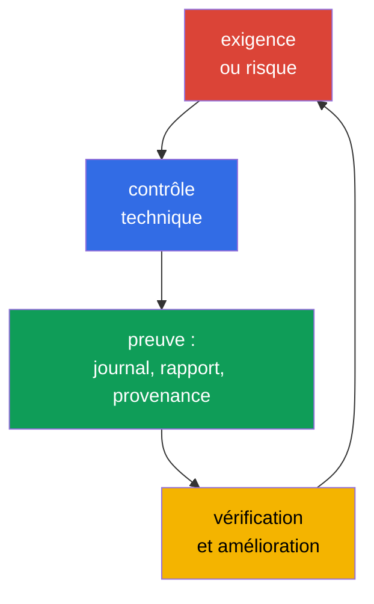
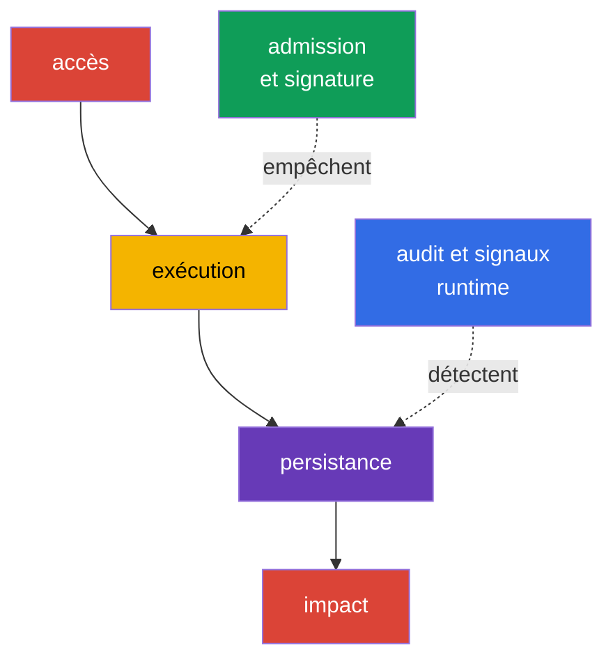

[Русская версия](ru.md) · [Eng version](README.md) · [Versión en español](es.md) · [Deutsche Version](de.md) · [ქართული ვერსია](ge.md) · [繁體中文版](tw.md) · [日本語版](jp.md)

# Chapitre 19. Conformité et cadres de sécurité

> **Et après.** Dans les chapitres 15-16, nous avons modélisé les menaces et les avons liées aux contrôles techniques, tandis que dans les chapitres 17-18, nous avons étudié la protection de la plateforme. Nous allons maintenant rassembler ces mesures dans un langage compréhensible par l'entreprise, les auditeurs et les équipes de développement : exigences de conformité, modèles de menaces, preuves de provenance des artefacts et contrôles automatisés. C'est le domaine KCSA **Compliance and Security Frameworks**, qui pèse 10 %. Les exemples sont orientés vers Kubernetes `v1.36`.

La conformité n'est pas la sécurité. La conformité aux exigences signifie que l'organisation peut démontrer les règles, processus et preuves de leur exécution applicables. La sécurité exige en outre de sélectionner des mesures selon les menaces réelles, de vérifier leur efficacité et de réagir aux incidents.

## 19.1 Cadres de conformité : un périmètre, pas une configuration Kubernetes prête à l'emploi

Un cadre définit un ensemble de pratiques attendues, d'objectifs de contrôle ou d'exigences obligatoires. Il ne se transforme pas en un unique manifeste YAML et ne rend pas automatiquement le produit sécurisé. L'équipe définit d'abord le périmètre applicable : quelles données, quels services, fournisseurs et pays sont concernés. Elle met ensuite en correspondance les exigences avec les contrôles de Kubernetes, du cloud, du CI/CD et les processus humains.

| Cadre ou régime | Domaine principal | Ce qu'il faut généralement démontrer | Exemple de lien avec Kubernetes |
|---|---|---|---|
| PCI DSS | données de cartes de paiement | segmentation, restriction des accès, protection des données, surveillance | isolement des services cardholder, RBAC, journalisation des accès |
| NIST | catalogue de pratiques et gestion des risques, souvent pour les organismes publics américains et les organisations ayant choisi cette approche | inventaire, évaluation des risques, contrôles sélectionnés et vérifiables | modèle de menaces, gestion de la configuration, incident response |
| HIPAA | informations médicales protégées aux États-Unis | safeguards administratifs, physiques et techniques pour les PHI | least privilege, chiffrement, audit des accès aux données médicales |
| SOC 2 | évaluation d'audit des controls d'une organisation de services selon les Trust Services Criteria | Type I : suitability of control design à une date donnée ; Type II : design et operating effectiveness des controls pendant la période déclarée | accès par rôles, change management, surveillance, evidence du CI/CD |

PCI DSS et HIPAA peuvent être obligatoires pour certains types de données et d'activités ; NIST sert souvent de structure de gestion des risques ; SOC 2 est un rapport d'audit sur les controls, et non une norme technique Kubernetes. Un même cluster peut simultanément être soumis à plusieurs exigences. Par exemple, une `NetworkPolicy` est utile pour la segmentation PCI DSS, mais elle ne démontre pas à elle seule toute la conformité : il faut le périmètre, la vérification de l'application par le CNI, l'historique des modifications et l'observation des violations.

Une chaîne de raisonnement utile est la suivante : « les données de cartes de paiement ne doivent pas être accessibles à toutes les charges de travail » → restriction des chemins réseau et RBAC → résultat du contrôle de policy, audit event et revue de configuration. Ainsi, une exigence devient un contrôle vérifiable, plutôt qu'une liste d'intentions générales.

### Ne pas confondre cadre, control et evidence

MITRE ATT&CK est une base de connaissances sur le comportement des attaquants, et non une compliance standard. STRIDE est une méthode pour poser des questions sur les menaces, et non un Kubernetes control. CIS Kubernetes Benchmark est un technical hardening benchmark, et non un admission controller. PCI DSS définit des exigences de protection des cardholder data, et non un Kubernetes configuration guide. Une exigence ne devient utile qu'à travers la chaîne **requirement → control → evidence → review**.

## 19.2 STRIDE, MITRE ATT&CK for Containers et kill chain

La modélisation des menaces ne commence pas par un outil, mais par l'objet à protéger et les frontières de confiance. Pour Kubernetes, il peut s'agir du client et de l'API Server, du `Pod` et du ServiceAccount, du système CI et du registry, de la charge de travail et de la base de données. Les cadres aident à ne pas omettre les chemins d'attaque typiques et à décrire le risque de manière cohérente aux ingénieurs et à l'équipe sécurité.

**STRIDE** regroupe les menaces selon six questions :

| Catégorie STRIDE | Question posée au système | Exemple dans Kubernetes |
|---|---|---|
| Spoofing | Un attaquant peut-il se faire passer pour une autre identity ? | token ServiceAccount ou kubeconfig volé |
| Tampering | Peut-il modifier discrètement un objet ou un artefact ? | substitution d'une image dans le registry ou modification d'un `Deployment` |
| Repudiation | Une action effectuée peut-elle être niée ? | absence d'un audit logging suffisant pour modifier un `RoleBinding` |
| Information Disclosure | Des données peuvent-elles être divulguées ? | lecture d'un `Secret` au-delà des accès nécessaires |
| Denial of Service | La disponibilité peut-elle être épuisée ? | création d'un grand nombre de `Pod` sans quota |
| Elevation of Privilege | Peut-on obtenir davantage de droits ? | exécution d'un `Pod` privileged ou `ClusterRole` excessif |

MITRE ATT&CK for Containers décrit les tactiques et techniques observables contre les environnements de conteneurs. Ce n'est pas une liste de contrôle de conformité, mais une base de connaissances permettant de relier un scénario, la télémétrie et la détection. Par exemple, une technique peut indiquer l'accès aux credentials, l'exécution d'une commande dans un conteneur ou l'utilisation abusive de l'API Kubernetes. L'équipe l'associe à ses journaux, à ses événements runtime et à ses controls, sans supposer que chaque correspondance constitue déjà un incident.

La **kill chain** considère une attaque comme une séquence d'étapes, par exemple l'obtention d'un accès initial, l'exécution, la persistance, l'élévation de privilèges, le mouvement vers la cible et l'impact. Ce modèle aide à placer un contrôle avant le dommage final : la signature d'image et la vérification à l'admission réduisent le risque d'exécuter un artefact inadapté, tandis que l'audit log et la runtime detection peuvent repérer les actions après l'exécution. Les attaques réelles ne suivent pas obligatoirement un schéma linéaire strict, la kill chain est donc utilisée comme outil d'analyse, et non comme règle.

## 19.3 Conformité de la chaîne logistique : SLSA et provenance

La chaîne logistique logicielle comprend le code source, les dépendances, le système de build, le registry, le deployment et le runtime. Le risque existe à chaque point : une dépendance peut être vulnérable, un credential CI peut être volé et un tag d'image peut déjà pointer vers un autre artefact. Pour la conformité, il est important non seulement d'affirmer qu'une image est « vérifiée », mais aussi de conserver un lien vérifiable entre l'artefact et son origine.

**SLSA v1.2** (Supply-chain Levels for Software Artifacts) définit des exigences pour la chaîne logistique dans les tracks indépendants **Build** et **Source**. Chaque track a ses propres niveaux et exigences. Un niveau Build ne peut donc pas servir à affirmer un niveau Source, et inversement ; le niveau est toujours indiqué avec son track. Il ne faut pas attribuer à un niveau des propriétés qui ne sont pas définies par une exigence SLSA précise. Un reproducible build peut être une propriété utile du processus, mais n'est pas un synonyme universel d'un niveau SLSA. SLSA ne remplace pas le scan de vulnérabilités et n'est pas une certification juridique du produit. C'est un langage permettant de formuler les garanties requises.

Un **reproducible build** est une build dans laquelle, à partir des mêmes sources, d'un build environment défini et des mêmes build instructions, une partie indépendante peut reproduire des artefacts spécifiés identiques bit-for-bit. La reproductibilité aide à vérifier indépendamment la correspondance source → artifact, mais elle ne prouve pas à elle seule une signing identity de confiance, ne remplace pas la provenance et ne définit pas un niveau SLSA Build ou Source.

La **provenance** est un enregistrement lisible par machine sur l'origine d'un artefact. Elle peut indiquer la revision source, le builder, les paramètres du processus, les entrées et le digest de l'image obtenue. Le vérificateur compare la provenance à la policy de l'organisation : l'image est autorisée si elle a été produite par un pipeline de confiance depuis une source autorisée et si elle correspond au digest attendu. La signature protège l'affirmation de provenance contre une substitution discrète, mais il faut toujours faire confiance à l'identity du signataire et aux clés ou au mécanisme de signature keyless.

| Artefact ou preuve | À quelle question répond-il ? | Exemple de décision |
|---|---|---|
| SBOM | « De quels composants l'image est-elle composée ? » | recherche des images affectées lors d'une nouvelle CVE |
| digest d'image | « Quel artefact immuable précis est exécuté ? » | deployment avec `image@sha256:...` |
| signature | « Quelle identity a confirmé l'artefact ? » | vérification de la signature avant le deployment |
| provenance | « De quelle source et par quel processus déclaré a-t-il été obtenu ? » | la policy autorise uniquement un builder et un repository de confiance |
| SLSA v1.2 | « Quelles exigences sont satisfaites dans le track Build ou Source indiqué ? » | la policy et les evidence vérifient le track et le niveau déclarés |
| résultat du scan | « Quels risques connus ont été trouvés au moment du contrôle ? » | règle de traitement des CVE selon la severity et le contexte |

Ces preuves et cadres ne sont pas interchangeables. Un SBOM ne confirme pas qui a produit l'image ; une signature ne remplace ni le SBOM ni la provenance ; la provenance n'est pas une signature ; SLSA ne remplace aucun de ces artefacts, mais définit les exigences du track indiqué. Un scan ne démontre pas l'absence de vulnérabilités inconnues. Par conséquent, un processus mature relie le SBOM, la signature, la provenance et les résultats du scan au digest, consigne séparément le track SLSA applicable et conserve les evidence pour la revue et l'enquête.

## 19.4 Automatisation et outils : controls et evidence continus

La vérification manuelle d'un seul cluster devient rapidement obsolète : les configurations, images et droits changent plus souvent que n'a lieu l'audit suivant. L'automatisation exécute des contrôles reproductibles, bloque les modifications inacceptables ou produit des evidence. Elle n'annule pas la décision humaine sur le risque acceptable et les exceptions.

| Outil ou catégorie | Objectif | Résultat typique |
|---|---|---|
| `kube-bench` | compare la configuration au CIS Kubernetes Benchmark | rapport sur les contrôles et les écarts |
| policy engine: OPA/Gatekeeper, Kyverno, ValidatingAdmissionPolicy | évalue les objets à l'admission ou en amont dans le CI | allow, deny, audit ou avertissement de policy |
| scanner dans CI/CD : Trivy et équivalents | recherche des vulnérabilités connues, des secrets ou des configurations non sûres | rapport, gate de pipeline, tâche de correction |
| audit logging | enregistre les actions sur l'API Kubernetes | événement avec identity, verb, objet et heure |
| asset et evidence inventory | associe le cluster, la version, la policy et les résultats des contrôles | matériel pour la revue, l'audit et l'enquête |

`kube-bench` vérifie les recommandations CIS et signale les écarts, mais il ne corrige pas le cluster et ne remplace pas l'évaluation de l'applicabilité d'une recommandation. Un policy engine peut interdire un `Pod` privileged ou une image provenant d'un registry non autorisé, mais une policy erronée peut perturber un deployment légitime. Les policy font donc l'objet d'une revue, sont testées sur des manifestes typiques et introduites progressivement : d'abord audit ou warn, puis enforce pour une exigence convenue.

Les compliance evidence doivent conserver le moment du contrôle, le scope, la version du tool/de la policy et l'identifiant de l'environnement ou de l'artefact contrôlé. L'accès aux evidence est limité contre toute modification non autorisée ; pour une assurance renforcée, on utilise un stockage append-only, immutable ou tamper-evident. Sinon, il est ultérieurement impossible de démontrer de manière fiable que le résultat conservé correspond au contrôle réellement exécuté.

Dans le CI/CD, l'automatisation construit généralement un chemin court : contrôle du code source et des dépendances → build → SBOM et scan → signature/provenance → publication par digest → contrôle de policy avant l'exécution. Dans le cluster, l'audit et la runtime-telemetry fournissent à la revue suivante des éléments factuels permettant de savoir si le control a été appliqué et ce qui s'est produit après le deployment.

## 19.5 Application pratique

L'équipe d'un service de paiement identifie les namespaces et stockages qui traitent les données de carte. Pour ceux-ci, elle relie les exigences PCI DSS aux contrôles : RBAC restreint, segmentation du trafic, connexions chiffrées, audit logging et processus de traitement des exceptions. Dans le CI, un SBOM est créé, l'image est scannée, reçoit un digest et une provenance. Une admission policy n'autorise en production que les images provenant d'un registry de confiance et conformes à la policy de provenance.

Il arrive qu'une charge de travail particulière nécessite temporairement une dérogation à la policy standard, par exemple des privilèges élevés pour un diagnostic ou une migration. Une telle exception ne reste un risque géré que lorsqu'elle est documentée et vérifiable, et non accordée de manière informelle. Un modèle minimal d'exception vérifiable comprend cinq éléments : **owner** (qui est responsable de l'exception et peut en confirmer le statut), **scope** (quelle charge de travail, quel namespace ou quelle condition sont précisément couverts par l'exception, et ce qui ne l'est explicitement pas), **expiry** (la date ou la condition après laquelle l'exception cesse de s'appliquer sans prolongation distincte), **approval** (qui et quand a approuvé l'écart à la policy standard) et **compensating controls** (quelles mesures supplémentaires - audit renforcé, accès réseau limité, monitoring supplémentaire - réduisent le risque pendant la durée de l'exception). Une exception sans l'un de ces éléments est difficile à distinguer d'un écart non contrôlé à la policy lors d'une revue ou d'un audit ultérieur.

En parallèle, l'équipe sécurité construit un petit modèle STRIDE pour le chemin « développeur → CI → registry → `Pod` → base de données ». Pour Tampering, elle vérifie la protection du pipeline et la signature des artefacts ; pour Information Disclosure, les accès aux `Secret` et les journaux ; pour Elevation of Privilege, RBAC et les policy contre les workloads privileged. Régulièrement, les rapports `kube-bench`, les résultats des policy et un échantillon d'audit events sont examinés avec les propriétaires des systèmes. Ainsi, l'automatisation fournit les données d'entrée, mais l'équipe reste propriétaire du risque.

## 19.6 Exam vocabulary / Mini-glossaire

| Terme | Signification brève |
|---|---|
| compliance | respect des exigences externes et internes applicables, avec des preuves à l'appui |
| control | mesure technique ou procédurale qui réduit le risque ou satisfait une exigence |
| evidence | trace vérifiable du fonctionnement d'un control : rapport, journal, enregistrement de pipeline ou revue |
| kill chain | modèle d'étapes d'une attaque, utilisé pour trouver des points de prévention et de détection |
| provenance | informations sur l'origine et le processus de création d'un artefact |
| SLSA v1.2 | modèle d'exigences avec les tracks indépendants Build et Source ; le niveau n'est pertinent qu'avec son track |
| STRIDE | modèle de menaces : Spoofing, Tampering, Repudiation, Information Disclosure, Denial of Service, Elevation of Privilege |

## 19.7 Exam Essentials / Points essentiels du chapitre

- La conformité définit les exigences applicables et les evidence des controls, mais ne remplace pas la gestion des risques réels.
- PCI DSS, HIPAA, NIST et SOC 2 diffèrent par leur domaine et leur objectif ; l'applicabilité est déterminée par les données, les activités et les obligations contractuelles de l'organisation.
- STRIDE aide à rechercher les catégories de menaces, MITRE ATT&CK for Containers relie les scénarios aux tactiques et techniques, et la kill chain montre les étapes possibles d'une attaque.
- SLSA v1.2 sépare les tracks indépendants Build et Source ; SBOM, digest, signature, provenance et scan répondent à des questions différentes et ne sont pas interchangeables. Un reproducible build n'est pas un synonyme universel d'un niveau SLSA.
- `kube-bench`, les policy engines, les scanners CI/CD et l'audit logging rendent les contrôles reproductibles et conservent les evidence, mais exigent une revue et un réglage selon le risque.

## 19.8 Ne pas confondre et présence à l'examen

La question décrit généralement une exigence ou un scénario et demande de choisir le terme ou le contrôle le plus adapté. Distinguez le domaine d'un cadre de son implémentation concrète : PCI DSS n'est pas une `NetworkPolicy`, et `kube-bench` n'assure pas à lui seul la conformité. Gardez en mémoire les différences entre les artefacts de la chaîne logistique : le SBOM décrit la composition, le digest identifie le contenu précis, la signature lie une affirmation à une identity, et la provenance décrit le chemin de build déclaré. SLSA v1.2 définit indépendamment des exigences pour les tracks Build et Source, sans remplacer ces artefacts ; un reproducible build n'est pas un synonyme universel d'un niveau SLSA.

Un piège fréquent consiste à appeler n'importe quel outil de sécurité un moyen de prévention. Un audit log crée avant tout des evidence et aide à l'enquête, tandis qu'une admission policy peut empêcher la création d'un objet. Un autre piège consiste à considérer ATT&CK ou STRIDE comme une liste de controls obligatoires. Ce sont des modèles d'analyse et une terminologie commune, tandis que les controls sont sélectionnés selon le risque et les exigences.

## 19.9 Questions d'auto-évaluation

### 1. Quelle affirmation décrit le plus précisément l'objectif de PCI DSS ?

   - a. C'est un modèle des étapes d'une attaque contre un conteneur.
   - b. C'est un ensemble d'exigences de sécurité pour les organisations qui traitent des données de cartes de paiement.
   - c. C'est un format de SBOM pour les images de conteneurs.
   - d. C'est un mécanisme d'admission control dans Kubernetes.

Réponse et explication

**Bonne réponse : b.** PCI DSS concerne la protection des données de cartes de paiement. Il peut exiger la segmentation, le contrôle d'accès et l'audit, mais il ne définit pas une ressource Kubernetes ou un format d'artefact unique.

### 2. Quel élément répond le mieux à la question « à partir de quelle revision source et par quel builder cette image a-t-elle été créée » ?

   - a. `NetworkPolicy`.
   - b. Audit event API Server.
   - c. Provenance.
   - d. SBOM.

Réponse et explication

**Bonne réponse : c.** La provenance décrit l'origine et le processus de build. Un SBOM énumère les composants, tandis qu'un audit event enregistre une action sur l'API du cluster.

### 3. Quel exemple appartient à la catégorie STRIDE Elevation of Privilege ?

   - a. Un attaquant utilise le token volé d'un autre utilisateur.
   - b. Une charge de travail obtient la possibilité d'exécuter un `Pod` privileged.
   - c. Le journal ne contient pas d'information sur la personne ayant modifié un `RoleBinding`.
   - d. L'image dans le registry est remplacée par un autre contenu.

Réponse et explication

**Bonne réponse : b.** Obtenir la capacité d'effectuer une action avec des droits plus élevés relève d'Elevation of Privilege. L'option a correspond à Spoofing (utilisation de l'identité d'autrui via un token dérobé), l'option c à Repudiation (impossibilité d'établir l'auteur d'une modification), et l'option d à Tampering (modification non autorisée du contenu de l'image).

### 4. Quel est le rôle correct de `kube-bench` dans un programme de conformité ?

   - a. Il chiffre automatiquement tous les `Secret` dans etcd.
   - b. Il signe les images et crée la provenance.
   - c. Il remplace l'auditeur et l'évaluation de l'applicabilité des controls.
   - d. Il compare la configuration aux recommandations CIS et produit un rapport sur les écarts.

Réponse et explication

**Bonne réponse : d.** `kube-bench` aide à vérifier les recommandations CIS. Le résultat doit être interprété : certaines recommandations peuvent ne pas s'appliquer à un cluster géré, et la correction ainsi que l'acceptation du risque restent de la responsabilité de l'organisation.

### 5. Quelle evidence décrit correctement SLSA v1.2 dans un rapport sur la chaîne logistique ?

   - a. Indiquer la présence d'une signature et la considérer comme un remplacement de la provenance, du SBOM, des résultats de scan et d'une déclaration distincte du track SLSA applicable.

   - b. Indiquer le track Build ou Source applicable et son niveau, tout en conservant séparément les evidence associées selon la finalité de chaque type de preuve.

   - c. Indiquer la présence d'un SBOM et lui attribuer sur cette base le même SLSA level simultanément aux tracks Build et Source, sans evidence supplémentaire.

   - d. Indiquer un reproducible build et l'utiliser comme SLSA level universel, indépendamment du track choisi, de la provenance et des exigences de niveau.

Réponse et explication

**Bonne réponse : b.** SLSA v1.2 a des tracks Build et Source distincts, avec leurs propres niveaux et exigences. Le niveau est donc indiqué avec le track précis.

SBOM, signature, provenance et résultats de scan répondent à des questions différentes et ne deviennent pas interchangeables par la seule utilisation de SLSA. Un reproducible build n'est pas non plus une désignation universelle d'un SLSA level.

> **Pour continuer.** Pour une vérification pratique du CIS Benchmark, utilisez le chapitre 07 CKS. Les scénarios d'admission control sont traités dans le chapitre 20 CKS ; supply chain, SBOM, signatures et policy sont abordés dans les chapitres 25-28 CKS. Pour la configuration et l'analyse de l'audit logging, utilisez le chapitre 32 CKS.

[Table des matières](../README_FR.md) · [Chapitre 18](../18/fr.md) · [Chapitre 20](../20/fr.md)