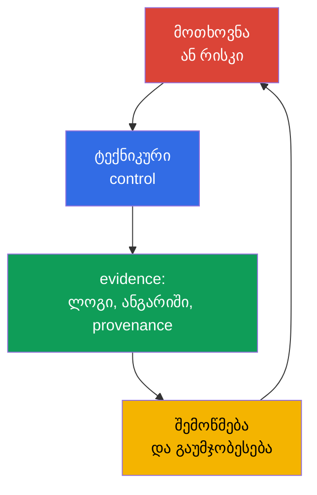
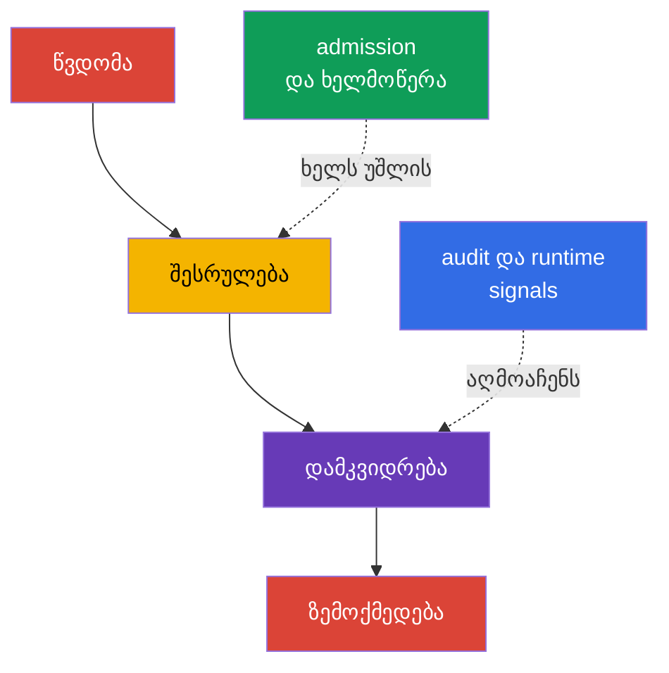

[Русская версия](ru.md) · [Eng version](README.md) · [Versión en español](es.md) · [Version française](fr.md) · [Deutsche Version](de.md) · [繁體中文版](tw.md) · [日本語版](jp.md)

# თავი 19. კომპლაიენსი და უსაფრთხოების ფრეიმვორკები

> **შემდეგ რა არის.** თავებში 15-16 ჩვენ საფრთხეების მოდელირება მოვახდინეთ და ისინი ტექნიკურ კონტროლებს დავუკავშირეთ, ხოლო თავებში 17-18 პლატფორმის დაცვა განვიხილეთ. ახლა ამ ზომებს ბიზნესისთვის, აუდიტორებისა და დეველოპერების გუნდებისთვის გასაგებ ენაზე გავაერთიანებთ: კომპლაიენსის მოთხოვნები, საფრთხეების მოდელები, არტეფაქტების წარმოშობის მტკიცებულებები და ავტომატიზებული შემოწმებები. ეს არის KCSA-ს დომენი **Compliance and Security Frameworks**, რომლის წონაა 10%. მაგალითები ორიენტირებულია Kubernetes `v1.36`-ზე.

კომპლაიენსი უსაფრთხოებას არ უდრის. მოთხოვნებთან შესაბამისობა ნიშნავს, რომ ორგანიზაციას შეუძლია აჩვენოს მოქმედი წესები, პროცესები და მათი შესრულების მტკიცებულებები. უსაფრთხოება დამატებით მოითხოვს რეალური საფრთხეების შესაბამისი ზომების შერჩევას, მათი ეფექტიანობის შემოწმებასა და ინციდენტებზე რეაგირებას.

## 19.1 კომპლაიენსის ფრეიმვორკები: მოქმედების სფერო და არა Kubernetes-ის მზა კონფიგურაცია

ფრეიმვორკი განსაზღვრავს მოსალოდნელი პრაქტიკების, კონტროლის მიზნების ან სავალდებულო მოთხოვნების ერთობლიობას. ის ერთ YAML-მანიფესტად არ გარდაიქმნება და პროდუქტს ავტომატურად უსაფრთხოს არ ხდის. გუნდი ჯერ მოქმედების შესაბამის სფეროს განსაზღვრავს: რომელ მონაცემებს, სერვისებს, მომწოდებლებსა და ქვეყნებს ეხება მოთხოვნები. შემდეგ მოთხოვნებს Kubernetes-ის, ღრუბლის, CI/CD-ისა და ადამიანური პროცესების კონტროლებს უსადაგებს.

| ფრეიმვორკი ან რეჟიმი | ძირითადი სფერო | ჩვეულებრივ რისი დამტკიცებაა საჭირო | Kubernetes-თან კავშირის მაგალითი |
|---|---|---|---|
| PCI DSS | საგადახდო ბარათების მონაცემები | სეგმენტაცია, წვდომის შეზღუდვა, მონაცემთა დაცვა, მონიტორინგი | cardholder-სერვისების იზოლაცია, RBAC, წვდომის ჟურნალირება |
| NIST | პრაქტიკების კატალოგი და რისკების მართვა, ხშირად აშშ-ის სახელმწიფო უწყებებისთვის და იმ ორგანიზაციებისთვის, რომლებმაც ეს მიდგომა აირჩიეს | ინვენტარიზაცია, რისკის შეფასება, შერჩეული და შემოწმებადი controls | საფრთხეების მოდელი, კონფიგურაციის მართვა, incident response |
| HIPAA | დაცული სამედიცინო ინფორმაცია აშშ-ში | ადმინისტრაციული, ფიზიკური და ტექნიკური safeguards PHI-სთვის | least privilege, დაშიფვრა, სამედიცინო მონაცემებზე წვდომის აუდიტი |
| SOC 2 | სერვისის მიმწოდებელი ორგანიზაციის controls-ის აუდიტორული შეფასება Trust Services Criteria-ს მიხედვით | Type I: control design-ის suitability მითითებულ თარიღში; Type II: controls-ის design და operating effectiveness გამოცხადებული პერიოდის განმავლობაში | როლებზე დაფუძნებული წვდომა, change management, მონიტორინგი, evidence CI/CD-დან |

PCI DSS და HIPAA შეიძლება სავალდებულო იყოს გარკვეული ტიპის მონაცემებისა და საქმიანობისთვის; NIST ხშირად რისკის მართვის სტრუქტურად გამოიყენება; SOC 2 კი არის აუდიტორული ანგარიში controls-ის შესახებ და არა Kubernetes-ის ტექნიკური სტანდარტი. ერთი კლასტერი შეიძლება ერთდროულად რამდენიმე მოთხოვნის ქვეშ მოექცეს. მაგალითად, `NetworkPolicy` სასარგებლოა PCI DSS-ის სეგმენტაციისთვის, მაგრამ თავისთავად სრულ კომპლაიენსს არ ამტკიცებს: საჭიროა მოქმედების სფერო, CNI-ის გამოყენების შემოწმება, ცვლილებების ისტორია და დარღვევებზე დაკვირვება.

მსჯელობის სასარგებლო ჯაჭვი ასე გამოიყურება: „საგადახდო ბარათის მონაცემები ყველა workload-ისთვის ხელმისაწვდომი არ უნდა იყოს“ → ქსელური გზებისა და RBAC-ის შეზღუდვა → policy-შემოწმების შედეგი, audit event და კონფიგურაციის მიმოხილვა. ასე მოთხოვნა შემოწმებად კონტროლად იქცევა და არა ზოგადი განზრახვების სიად.

### ერთმანეთში არ აგერიოთ framework, control და evidence

MITRE ATT&CK არის თავდამსხმელის ქცევის შესახებ ცოდნის ბაზა და არა compliance standard. STRIDE არის საფრთხეების შესახებ კითხვების დასმის მეთოდი და არა Kubernetes control. CIS Kubernetes Benchmark არის technical hardening benchmark და არა admission controller. PCI DSS არის cardholder data-ს დაცვის მოთხოვნები და არა Kubernetes configuration guide. მოთხოვნა სასარგებლო მხოლოდ **requirement → control → evidence → review** ჯაჭვის მეშვეობით ხდება.

## 19.2 STRIDE, MITRE ATT&CK for Containers და kill chain

საფრთხეების მოდელირება იწყება არა ხელსაწყოთი, არამედ დაცვის ობიექტითა და ნდობის საზღვრებით. Kubernetes-ისთვის ეს შეიძლება იყოს კლიენტი და API Server, `Pod` და ServiceAccount, CI-სისტემა და registry, workload და მონაცემთა ბაზა. ფრეიმვორკები გვეხმარება, არ გამოგვრჩეს თავდასხმის ტიპური გზები და რისკი ინჟინრებსა და უსაფრთხოების სამსახურს ერთნაირად აღვუწეროთ.

**STRIDE** საფრთხეებს ექვსი კითხვის მიხედვით აჯგუფებს:

| STRIDE-ის კატეგორია | კითხვა სისტემის შესახებ | მაგალითი Kubernetes-ში |
|---|---|---|
| Spoofing | შეუძლია თუ არა თავდამსხმელს თავი სხვა identity-დ გაასაღოს? | მოპარული ServiceAccount token ან kubeconfig |
| Tampering | შეუძლია თუ არა მას ობიექტის ან არტეფაქტის შეუმჩნევლად შეცვლა? | registry-ში image-ის ჩანაცვლება ან `Deployment`-ის შეცვლა |
| Repudiation | შესაძლებელია თუ არა შესრულებული მოქმედების უარყოფა? | `RoleBinding`-ის ცვლილებისთვის საკმარისი audit logging-ის არარსებობა |
| Information Disclosure | შესაძლებელია თუ არა მონაცემების გამჟღავნება? | `Secret`-ის წაკითხვა აუცილებელ წვდომაზე მეტად |
| Denial of Service | შესაძლებელია თუ არა ხელმისაწვდომობის რესურსის ამოწურვა? | მრავალი `Pod`-ის შექმნა quota-ს გარეშე |
| Elevation of Privilege | შესაძლებელია თუ არა მეტი უფლების მიღება? | privileged `Pod`-ის გაშვება ან ზედმეტად ფართო `ClusterRole` |

MITRE ATT&CK for Containers აღწერს კონტეინერული გარემოების წინააღმდეგ მიმართულ დაკვირვებად ტაქტიკებსა და ტექნიკებს. ეს არ არის შესაბამისობის checklist, არამედ ცოდნის ბაზაა სცენარის, ტელემეტრიისა და აღმოჩენის დასაკავშირებლად. მაგალითად, ტექნიკა შეიძლება მიუთითებდეს credentials-ზე წვდომაზე, კონტეინერში ბრძანების შესრულებაზე ან Kubernetes API-ის ბოროტად გამოყენებაზე. გუნდი მას საკუთარ ლოგებს, runtime მოვლენებსა და controls-ს უსადაგებს და არ მიიჩნევს, რომ ყოველი დამთხვევა უკვე ინციდენტს ნიშნავს.

**Kill chain** თავდასხმას განიხილავს როგორც ეტაპების თანმიმდევრობას, მაგალითად, საწყისი წვდომის მოპოვებას, შესრულებას, დამკვიდრებას, პრივილეგიების ამაღლებას, მიზნისკენ გადაადგილებასა და ზემოქმედებას. მოდელი გვეხმარება კონტროლი საბოლოო ზიანამდე უფრო ადრე განვათავსოთ: image-ის ხელმოწერა და admission-შემოწმება შეუფერებელი არტეფაქტის გაშვების რისკს ამცირებს, ხოლო audit log-სა და runtime detection-ს გაშვების შემდეგ მოქმედებების შემჩნევა შეუძლია. რეალური თავდასხმები ვალდებული არ არის მკაცრად ხაზოვან სქემას მიჰყვეს, ამიტომ kill chain გამოიყენება როგორც ანალიზის საშუალება და არა როგორც წესი.

## 19.3 მიწოდების ჯაჭვის კომპლაიენსი: SLSA და provenance

პროგრამული უზრუნველყოფის მიწოდების ჯაჭვი მოიცავს საწყის კოდს, დამოკიდებულებებს, build-სისტემას, registry-ს, deployment-სა და runtime-ს. რისკი ყოველ წერტილში წარმოიშობა: დამოკიდებულება შეიძლება მოწყვლადი იყოს, CI credential შეიძლება მოიპარონ, ხოლო image-ის tag შეიძლება უკვე სხვა არტეფაქტზე მიუთითებდეს. კომპლაიენსისთვის მნიშვნელოვანია არა მხოლოდ იმის მტკიცება, რომ image „შემოწმებულია“, არამედ არტეფაქტსა და მის წარმოშობას შორის შემოწმებადი კავშირის შენარჩუნებაც.

**SLSA v1.2** (Supply-chain Levels for Software Artifacts) მიწოდების ჯაჭვის მოთხოვნებს დამოუკიდებელ **Build** და **Source** tracks-ში განსაზღვრავს. თითოეულ track-ს საკუთარი დონეები და მოთხოვნები აქვს, ამიტომ Build-ის დონე Source-ის დონის შესახებ მტკიცებად ვერ გამოიყენება და პირიქით; დონე ყოველთვის track-თან ერთად მიეთითება. დონეს არ უნდა მივაწეროთ თვისებები, რომლებიც SLSA-ს კონკრეტული მოთხოვნით არ არის განსაზღვრული. Reproducible build შეიძლება პროცესის სასარგებლო თვისება იყოს, მაგრამ SLSA-ს დონის უნივერსალური სინონიმი არ არის. SLSA არც მოწყვლადობების სკანირებას ცვლის და არც პროდუქტის იურიდიულ სერტიფიცირებას წარმოადგენს. ეს არის საჭირო გარანტიების ფორმულირების ენა.

**Reproducible build** - build, რომლის დროსაც იგივე საწყისი კოდის, განსაზღვრული build environment-ისა და იგივე build instructions-ის გამოყენებით დამოუკიდებელ მხარეს შეუძლია მითითებული, bit-for-bit იდენტური არტეფაქტების გამეორება. Reproducibility გვეხმარება source → artifact შესაბამისობის დამოუკიდებლად გადამოწმებაში, მაგრამ თავისთავად სანდო signing identity-ს არ ამტკიცებს, provenance-ს არ ცვლის და SLSA Build-ის ან Source-ის დონეს არ განსაზღვრავს.

**Provenance** არის მანქანის მიერ წაკითხვადი ჩანაწერი არტეფაქტის წარმოშობის შესახებ. მასში შეიძლება მითითებული იყოს საწყისი revision, builder, პროცესის პარამეტრები, შემავალი მონაცემები და მიღებული image-ის digest. შემმოწმებელი provenance-ს ორგანიზაციის policy-ს ადარებს: image ნებადართულია, თუ ის სანდო pipeline-მა ნებადართული წყაროდან შექმნა და მოსალოდნელ digest-ს შეესაბამება. ხელმოწერა provenance-ის შესახებ მტკიცებას შეუმჩნეველი ჩანაცვლებისგან იცავს, თუმცა მაინც საჭიროა ხელმომწერის identity-სა და გასაღებების ან keyless-ხელმოწერის მექანიზმის ნდობა.

| არტეფაქტი ან მტკიცებულება | რომელ კითხვას პასუხობს | გადაწყვეტილების მაგალითი |
|---|---|---|
| SBOM | „რომელი კომპონენტებისგან შედგება image?“ | ახალი CVE-ის შემთხვევაში დაზარალებული images-ის ძიება |
| image-ის digest | „კონკრეტულად რომელი უცვლელი არტეფაქტი ეშვება?“ | deployment `image@sha256:...`-ით |
| ხელმოწერა | „რომელმა identity-მ დაადასტურა არტეფაქტი?“ | deployment-მდე ხელმოწერის შემოწმება |
| provenance | „საიდან და რომელი გამოცხადებული პროცესით მიიღეს ის?“ | policy მხოლოდ სანდო builder-სა და repository-ს უშვებს |
| SLSA v1.2 | „რომელი მოთხოვნები შესრულდა მითითებულ Build ან Source track-ში?“ | policy და evidence ამოწმებს გამოცხადებულ track-სა და დონეს |
| scan-ის შედეგი | „რომელი ცნობილი რისკები აღმოჩნდა შემოწმების მომენტში?“ | CVE-ის დამუშავების წესი severity-სა და კონტექსტის მიხედვით |

ეს მტკიცებულებები და ჩარჩოები ურთიერთჩანაცვლებადი არ არის. SBOM არ ადასტურებს, ვინ შექმნა image; ხელმოწერა არ ცვლის SBOM-ს ან provenance-ს; provenance ხელმოწერა არ არის; SLSA ამ artefact-ებიდან არც ერთს არ ცვლის, არამედ მითითებული track-ის მოთხოვნებს განსაზღვრავს. Scan უცნობი მოწყვლადობების არარსებობას არ ამტკიცებს. ამიტომ მომწიფებული პროცესი SBOM-ს, ხელმოწერას, provenance-სა და scan-ის შედეგებს digest-ს უკავშირებს, ცალკე აფიქსირებს შესაბამის SLSA track-ს და evidence-ს მიმოხილვისა და გამოძიებისთვის ინახავს.

## 19.4 ავტომატიზაცია და ხელსაწყოები: უწყვეტი controls და evidence

ერთი კლასტერის ხელით შემოწმება სწრაფად ძველდება: კონფიგურაციები, images და უფლებები უფრო ხშირად იცვლება, ვიდრე მორიგი აუდიტი ტარდება. ავტომატიზაცია ასრულებს განმეორებად შემოწმებებს, ბლოკავს მიუღებელ ცვლილებებს ან ქმნის evidence-ს. ის არ აუქმებს ადამიანის გადაწყვეტილებას დასაშვები რისკისა და გამონაკლისების შესახებ.

| ხელსაწყო ან კლასი | დანიშნულება | ტიპური შედეგი |
|---|---|---|
| `kube-bench` | კონფიგურაციას CIS Kubernetes Benchmark-ს ადარებს | ანგარიში შემოწმებებისა და გადახრების შესახებ |
| policy engine: OPA/Gatekeeper, Kyverno, ValidatingAdmissionPolicy | ობიექტებს admission-ისას ან წინასწარ, CI-ში აფასებს | allow, deny, audit ან გაფრთხილება policy-ს მიხედვით |
| scanner CI/CD-ში: Trivy და ანალოგები | ცნობილ მოწყვლადობებს, secrets-ს ან არაუსაფრთხო პარამეტრებს ეძებს | ანგარიში, gate pipeline-ისთვის, გამოსწორების დავალება |
| audit logging | Kubernetes API-სთან მოქმედებებს აღრიცხავს | მოვლენა identity-ს, verb-ის, ობიექტისა და დროის მითითებით |
| asset და evidence inventory | კლასტერს, ვერსიას, policy-სა და შემოწმების შედეგებს ერთმანეთთან აკავშირებს | მასალა მიმოხილვის, აუდიტისა და გამოძიებისთვის |

`kube-bench` CIS-ის რეკომენდაციებს ამოწმებს და გადახრის შესახებ იუწყება, მაგრამ კლასტერს არ ასწორებს და რეკომენდაციის შესაბამისობის შეფასებას არ ცვლის. Policy engine-ს შეუძლია აკრძალოს privileged `Pod` ან image არანებადართული registry-დან, თუმცა მცდარმა policy-მ შეიძლება ლეგიტიმური deployment დაარღვიოს. ამიტომ policies გადის მიმოხილვას, იტესტება ტიპურ მანიფესტებზე და ეტაპობრივად ინერგება: ჯერ audit ან warn, შემდეგ enforce შეთანხმებული მოთხოვნისთვის.

Compliance evidence უნდა ინახავდეს შემოწმების დროს, scope-ს, tool/policy-ის ვერსიას და შესამოწმებელი გარემოს ან არტეფაქტის იდენტიფიკატორს. Evidence-ზე წვდომა არასანქცირებული ცვლილებისგან იზღუდება; უფრო მაღალი assurance-ისთვის გამოიყენება append-only, immutable ან tamper-evident საცავი. სხვაგვარად მოგვიანებით შეუძლებელი იქნება საიმედოდ დამტკიცდეს, რომ შენახული შედეგი რეალურად შესრულებულ შემოწმებას შეესაბამება.

CI/CD-ში ავტომატიზაცია ჩვეულებრივ მოკლე გზას აწყობს: საწყისი კოდისა და დამოკიდებულებების შემოწმება → build → SBOM და scan → ხელმოწერა/provenance → digest-ის მიხედვით გამოქვეყნება → policy-შემოწმება გაშვებამდე. კლასტერში audit და runtime-telemetry მომდევნო მიმოხილვას აწვდის ფაქტებს იმის შესახებ, გამოყენებული იყო თუ არა control და რა მოხდა deployment-ის შემდეგ.

## 19.5 როგორ გამოიყენება ეს პრაქტიკაში

საგადახდო სერვისის გუნდი განსაზღვრავს namespace-სა და საცავებს, რომლებიც ბარათის მონაცემებს ამუშავებს. მათთვის გუნდი PCI DSS-ის მოთხოვნებს აკავშირებს კონტროლებთან: შეზღუდული RBAC, ტრაფიკის სეგმენტაცია, დაშიფრული კავშირები, audit logging და გამონაკლისების დამუშავების პროცესი. CI-ში იქმნება SBOM, image სკანირდება, იღებს digest-სა და provenance-ს. Admission policy production-ში მხოლოდ სანდო registry-დან მიღებულ და წარმოშობის policy-სთან შესაბამის images-ს უშვებს.

ზოგჯერ კონკრეტულ workload-ს დროებით სჭირდება სტანდარტული policy-დან გადახვევა, მაგალითად, გაზრდილი პრივილეგიები დიაგნოსტიკისთვის ან მიგრაციისთვის. ასეთი გამონაკლისი მართვად რისკად მხოლოდ მაშინ რჩება, როცა დოკუმენტირებული და შემოწმებადია და არა არაფორმალურად გაცემული. შემოწმებადი გამონაკლისის მინიმალური მოდელი ხუთ ელემენტს მოიცავს: **owner** (ვინ არის პასუხისმგებელი გამონაკლისზე და შეუძლია მისი სტატუსის დადასტურება), **scope** (კონკრეტულად რომელ workload-ს, namespace-ს ან პირობას მოიცავს გამონაკლისი და რას არ მოიცავს ცალსახად), **expiry** (თარიღი ან პირობა, რომლის შემდეგაც გამონაკლისი ცალკე გახანგრძლივების გარეშე მოქმედებას წყვეტს), **approval** (ვინ და როდის დაამტკიცა სტანდარტული policy-დან გადახვევა) და **compensating controls** (რომელი დამატებითი ზომები - გაძლიერებული audit, შეზღუდული ქსელური წვდომა, დამატებითი monitoring - ამცირებს რისკს გამონაკლისის მოქმედების პერიოდში). ამ ელემენტებიდან თუნდაც ერთის გარეშე შემდგომი მიმოხილვის ან აუდიტისას რთულია გამონაკლისის გარჩევა policy-დან უკონტროლო გადახვევისგან.

პარალელურად security-გუნდი მცირე STRIDE-მოდელს ქმნის გზისთვის „დეველოპერი → CI → registry → `Pod` → მონაცემთა ბაზა“. Tampering-ისთვის ის pipeline-ის დაცვასა და არტეფაქტების ხელმოწერას ამოწმებს; Information Disclosure-ისთვის - `Secret`-ებზე წვდომასა და ლოგებს; Elevation of Privilege-ისთვის - RBAC-სა და policy-ს privileged workloads-ის წინააღმდეგ. პერიოდულად `kube-bench`-ის ანგარიშები, policy-ის შედეგები და audit events-ის ნიმუში სისტემების მფლობელებთან განიხილება. ამგვარად, ავტომატიზაცია შემავალ მონაცემებს იძლევა, მაგრამ რისკის მფლობელი გუნდი რჩება.

## 19.6 Exam vocabulary / მინი-ლექსიკონი

| ტერმინი | მოკლე მნიშვნელობა |
|---|---|
| compliance | მოქმედი გარე და შიდა მოთხოვნების შესრულება დამადასტურებელ მტკიცებულებებთან ერთად |
| control | ტექნიკური ან პროცესული ზომა, რომელიც რისკს ამცირებს ან მოთხოვნის შესრულებას უზრუნველყოფს |
| evidence | control-ის მუშაობის შემოწმებადი კვალი: ანგარიში, ლოგი, pipeline-ის ჩანაწერი ან მიმოხილვა |
| kill chain | თავდასხმის ეტაპების მოდელი, რომელიც პრევენციისა და აღმოჩენის წერტილების მოსაძებნად გამოიყენება |
| provenance | ინფორმაცია არტეფაქტის წარმოშობისა და შექმნის პროცესის შესახებ |
| SLSA v1.2 | მოთხოვნების მოდელი დამოუკიდებელი Build და Source tracks-ით; დონეს მნიშვნელობა მხოლოდ track-თან ერთად აქვს |
| STRIDE | საფრთხეების მოდელი: Spoofing, Tampering, Repudiation, Information Disclosure, Denial of Service, Elevation of Privilege |

## 19.7 Exam Essentials / თავის შეჯამება

- კომპლაიენსი განსაზღვრავს მოქმედ მოთხოვნებსა და controls-ის მტკიცებულებებს, მაგრამ რეალური რისკების მართვას არ ცვლის.
- PCI DSS, HIPAA, NIST და SOC 2 სფეროთი და დანიშნულებით განსხვავდება; მათი შესაბამისობა ორგანიზაციის მონაცემებით, საქმიანობითა და სახელშეკრულებო ვალდებულებებით განისაზღვრება.
- STRIDE საფრთხეების კლასების მოძებნაში გვეხმარება, MITRE ATT&CK for Containers სცენარებს ტაქტიკებსა და ტექნიკებთან აკავშირებს, ხოლო kill chain თავდასხმის შესაძლო ეტაპებს აჩვენებს.
- SLSA v1.2 დამოუკიდებელ Build და Source tracks-ს გამოყოფს; SBOM, digest, ხელმოწერა, provenance და scan სხვადასხვა კითხვას პასუხობს და ურთიერთჩანაცვლებადი არ არის. Reproducible build SLSA-ს დონის უნივერსალური სინონიმი არ არის.
- `kube-bench`, policy engines, CI/CD scanners და audit logging შემოწმებებს განმეორებადს ხდის და evidence-ს ინახავს, თუმცა რისკზე მორგებულ მიმოხილვასა და კონფიგურაციას საჭიროებს.

## 19.8 ერთმანეთში არ აგერიოთ და როგორ გვხვდება ეს გამოცდაზე

კითხვა ჩვეულებრივ აღწერს მოთხოვნას ან სცენარს და ყველაზე შესაფერისი ტერმინის ან კონტროლის არჩევას მოითხოვს. განასხვავეთ ფრეიმვორკის სფერო კონკრეტული იმპლემენტაციისგან: PCI DSS არ არის `NetworkPolicy`, ხოლო `kube-bench` თავისთავად კომპლაიენსს არ უზრუნველყოფს. გახსოვდეთ supply chain-ის არტეფაქტებს შორის განსხვავებები: SBOM აღწერს შემადგენლობას, digest კონკრეტულ შიგთავსს აიდენტიფიცირებს, ხელმოწერა მტკიცებას identity-სთან აკავშირებს, provenance კი გამოცხადებულ build-გზას აღწერს. SLSA v1.2 მოთხოვნებს Build და Source tracks-ისთვის დამოუკიდებლად განსაზღვრავს და ამ არტეფაქტებს არ ცვლის; reproducible build SLSA-ს დონის უნივერსალური სინონიმი არ არის.

ტიპური ხაფანგია ნებისმიერი security-ხელსაწყოს პრევენციის საშუალებად მიჩნევა. Audit log უპირველესად evidence-ს ქმნის და გამოძიებას ეხმარება, მაშინ როცა admission policy-ს შეუძლია ობიექტის შექმნამდე მისი დაშვება აღკვეთოს. კიდევ ერთი ხაფანგია ATT&CK-ის ან STRIDE-ის სავალდებულო controls-ის ჩამონათვალად მიჩნევა. ეს ანალიზის მოდელები და საერთო ტერმინოლოგიაა, controls კი რისკისა და მოთხოვნების მიხედვით ირჩევა.

## 19.9 თვითშემოწმების კითხვები

### 1. რომელი დებულება აღწერს ყველაზე ზუსტად PCI DSS-ის დანიშნულებას?

   - a. ეს არის კონტეინერზე თავდასხმის ეტაპების მოდელი.
   - b. ეს არის უსაფრთხოების მოთხოვნების ერთობლიობა იმ ორგანიზაციებისთვის, რომლებიც საგადახდო ბარათების მონაცემებს ამუშავებენ.
   - c. ეს არის კონტეინერის images-ის SBOM ფორმატი.
   - d. ეს არის admission control-ის მექანიზმი Kubernetes-ში.

პასუხი და განმარტება

**სწორი პასუხია: b.** PCI DSS საგადახდო ბარათების მონაცემთა დაცვას ეხება. მან შეიძლება მოითხოვოს სეგმენტაცია, წვდომის კონტროლი და აუდიტი, მაგრამ Kubernetes-ის ერთ კონკრეტულ რესურსს ან არტეფაქტის ფორმატს არ განსაზღვრავს.

### 2. რომელი ელემენტი პასუხობს საუკეთესოდ კითხვას „რომელი საწყისი revision-იდან და რომელი builder-ის მიერ შეიქმნა ეს image“?

   - a. `NetworkPolicy`.
   - b. API Server-ის audit event.
   - c. Provenance.
   - d. SBOM.

პასუხი და განმარტება

**სწორი პასუხია: c.** Provenance აღწერს წარმოშობასა და build-ის პროცესს. SBOM კომპონენტებს ჩამოთვლის, ხოლო audit event კლასტერის API-სთან მოქმედებას აღრიცხავს.

### 3. რომელი მაგალითი მიეკუთვნება STRIDE-ის Elevation of Privilege კატეგორიას?

   - a. თავდამსხმელი სხვა მომხმარებლის მოპარულ token-ს იყენებს.
   - b. Workload იღებს privileged `Pod`-ის გაშვების შესაძლებლობას.
   - c. ჟურნალში არ არის მონაცემები იმის შესახებ, თუ ვინ შეცვალა `RoleBinding`.
   - d. Registry-ში image სხვა შიგთავსით შეიცვალა.

პასუხი და განმარტება

**სწორი პასუხია: b.** უფრო მაღალი უფლებებით მოქმედების შესრულების შესაძლებლობის მიღება Elevation of Privilege-ს მიეკუთვნება. ვარიანტი a შეესაბამება Spoofing-ს (სხვისი identity-ის გამოყენება მოპარული token-ის მეშვეობით), ვარიანტი c - Repudiation-ს (ცვლილების ავტორის დადგენის შეუძლებლობა), ხოლო ვარიანტი d - Tampering-ს (image-ის შიგთავსის შეუთანხმებელი შეცვლა).

### 4. რა არის `kube-bench`-ის სწორი როლი კომპლაიენსის პროგრამაში?

   - a. ის ავტომატურად შიფრავს ყველა `Secret`-ს etcd-ში.
   - b. ის ხელს აწერს images-ს და ქმნის provenance-ს.
   - c. ის ცვლის აუდიტორსა და controls-ის შესაბამისობის შეფასებას.
   - d. ის კონფიგურაციას CIS-ის რეკომენდაციებს ადარებს და გადახრების ანგარიშს ქმნის.

პასუხი და განმარტება

**სწორი პასუხია: d.** `kube-bench` CIS-ის რეკომენდაციების შემოწმებაში გვეხმარება. შედეგს ინტერპრეტაცია სჭირდება: ზოგი რეკომენდაცია შეიძლება მართვადი კლასტერისთვის შეუსაბამო იყოს, ხოლო გამოსწორება და რისკის მიღება ორგანიზაციის ამოცანად რჩება.

### 5. რომელი evidence აღწერს სწორად SLSA v1.2-ს supply chain-ის ანგარიშში?

   - a. მიეთითოს ხელმოწერის არსებობა და ის ჩაითვალოს provenance-ის, SBOM-ის, scan-ის შედეგებისა და შესაბამისი SLSA track-ის ცალკე დეკლარირების შემცვლელად.

   - b. მიეთითოს შესაბამისი Build ან Source track და მისი დონე, ხოლო დაკავშირებული evidence ცალკე შეინახოს თითოეული ტიპის მტკიცებულების დანიშნულების მიხედვით.

   - c. მიეთითოს SBOM-ის არსებობა და მის საფუძველზე ერთი და იგივე SLSA level ერთდროულად მიენიჭოს Build და Source tracks-ს დამატებითი evidence-ის გარეშე.

   - d. მიეთითოს reproducible build და ის უნივერსალურ SLSA level-ად გამოიყენოს არჩეული track-ის, provenance-ისა და დონის მოთხოვნებისგან დამოუკიდებლად.

პასუხი და განმარტება

**სწორი პასუხია: b.** SLSA v1.2-ს აქვს ცალკეული Build და Source tracks საკუთარი დონეებითა და მოთხოვნებით. ამიტომ დონე კონკრეტულ track-თან ერთად მიეთითება.

SBOM, signature, provenance და scan-ის შედეგები სხვადასხვა კითხვას პასუხობს და მხოლოდ SLSA-ს გამოყენების გამო ურთიერთჩანაცვლებადი არ ხდება. Reproducible build ასევე არ წარმოადგენს SLSA level-ის უნივერსალურ აღნიშვნას.

> **შემდეგ სად გადავიდეთ.** CIS Benchmark-ის პრაქტიკული შემოწმებისთვის გამოიყენეთ CKS-ის თავი 07. Admission control-ის სცენარები განხილულია CKS-ის მე-20 თავში; supply chain, SBOM, ხელმოწერები და policy - CKS-ის თავებში 25-28. Audit logging-ის კონფიგურაციისა და ანალიზისთვის გამოიყენეთ CKS-ის თავი 32.

[სარჩევი](../README_GE.md) · [თავი 18](../18/ge.md) · [თავი 20](../20/ge.md)
